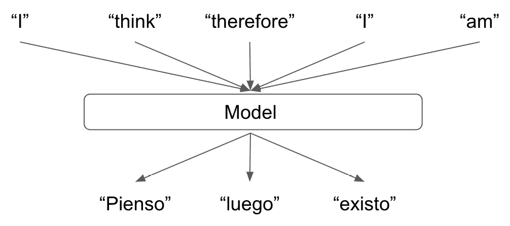
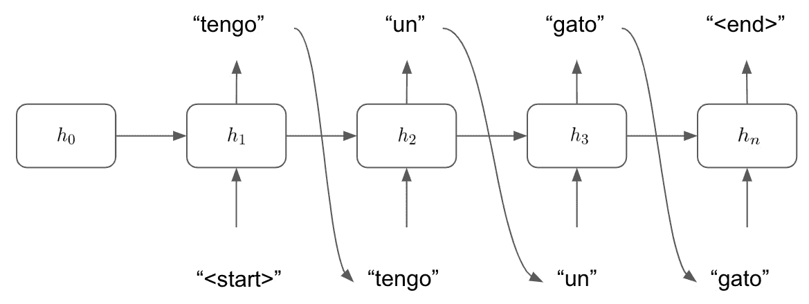
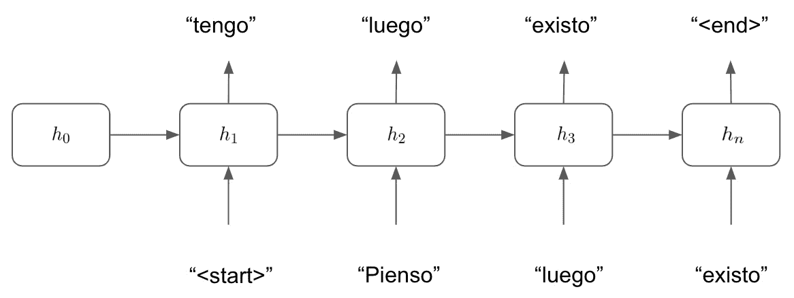
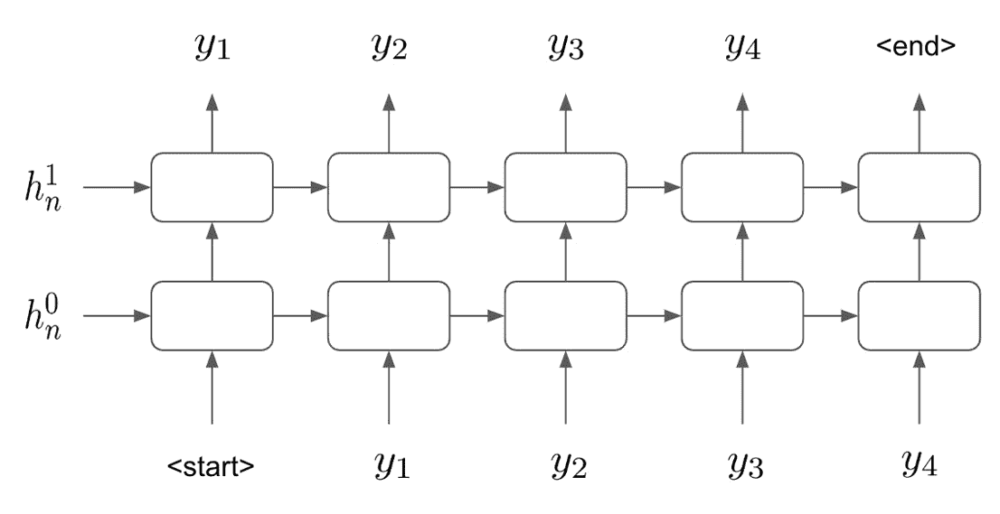

# “第 7 章”：使用序列到序列神经网络的文本翻译

在前两章中，我们使用神经网络对文本进行分类并执行情感分析。 两项任务都涉及获取 NLP 输入并预测一些值。 就我们的情感分析而言，这是一个介于 0 和 1 之间的数字，代表我们句子的情感。 就我们的句子分类模型而言，我们的输出是一个多类预测，其中我们的句子属于多个类别。 但是，如果我们不仅希望做出单个预测，还希望做出整个句子，该怎么办？ 在本章中，我们将构建一个序列到序列模型，该模型将一种语言的句子作为输入，并输出另一种语言的句子翻译。

我们已经探索了用于 NLP 学习的几种类型的神经网络架构，即 “第 5 章”，“循环神经网络和情感分析”中的循环神经网络，以及“第 6 章”，“使用 CNN 的文本分类”中的卷积神经网络。 在本章中，我们将再次使用这些熟悉的 RNN，而不仅仅是构建简单的 RNN 模型，我们还将 RNN 用作更大，更复杂的模型的一部分，以执行序列到序列的翻译。 通过使用我们在前几章中了解到的 RNN 的基础，我们可以展示如何扩展这些概念，以创建适合目的的各种模型。

在本章中，我们将介绍以下主题：

*   序列到序列模型理论
*   构建用于文本翻译的序列到序列神经网络
*   下一步

# 技术要求

本章的所有代码都可以在[这个页面](https://github.com/PacktPublishing/Hands-On-Natural-Language-Processing-with-PyTorch-1.x)中找到。

# 序列到序列模型理论

序列到序列模型与到目前为止我们所看到的常规神经网络结构非常相似。 主要区别在于，对于模型的输出，我们期望使用另一个序列，而不是二进制或多类预测。 这在翻译之类的任务中特别有用，我们可能希望将整个句子转换为另一种语言。

在以下示例中，我们可以看到我们的英语到西班牙语翻译将单词映射到单词：


图 7.1 –英语到西班牙语的翻译

输入句子中的第一个单词与输出句子中的第一个单词很好地映射。 如果所有语言都是这种情况，我们可以简单地通过训练有素的模型将句子中的每个单词逐个传递以获得输出句子，并且不需要任何序列到序列建模，如下所示：


图 7.2 –单词的英语到西班牙语翻译

但是，我们从的 NLP 经验中得知，语言并不像这样简单！ 一种语言中的单个单词可能会映射到其他语言中的多个单词，并且这些单词在语法正确的句子中出现的顺序可能并不相同。 因此，我们需要一个可以捕获整个句子的上下文并输出正确翻译的模型，而不是旨在直接翻译单个单词的模型。 这是序列到序列建模必不可少的地方，如下所示：



图 7.3 –用于翻译的序列到序列建模

为了训练一个序列到序列模型，该模型捕获输入句子的上下文并将其转换为输出句子，我们将实质上训练两个较小的模型，使我们能够做到这一点：

*   **编码器**模型，其中捕获句子的上下文并将其作为单个上下文向量输出
*   **解码器**，它使用原始句子的上下文向量表示并将其翻译成另一种语言

因此，实际上，我们完整的序列到序列翻译模型实际上将如下所示：


图 7.4 –完整的序列到序列模型

通过将模型分成单独的编码器和解码器元素，我们可以有效地模块化我们的模型。 这意味着，如果我们希望训练多个模型以将英语翻译成不同的语言，则无需每次都重新训练整个模型。 我们只需要训练多个不同的解码器就可以将上下文向量转换为输出语句。 然后，在进行预测时，我们可以简单地交换我们希望用于翻译的解码器：


图 7.5 –详细的模型布局

接下来，我们将检查序列到序列模型的编码器和解码器组件。

## 编码器

我们的序列到序列模型的编码器元素的目的是能够完全捕获我们输入句子的上下文并将其表示为向量。 我们可以通过使用 RNN 或更具体地说是 LSTM 来实现。 您可能从我们前面的章节中回忆过，RNN 接受顺序输入并在整个顺序中保持隐藏状态。 序列中的每个新单词都会更新隐藏状态。 然后，在序列的最后，我们可以使用模型的最终隐藏状态作为下一层的输入。

在我们的编码器的情况下，隐藏状态表示整个句子的上下文向量表示，这意味着我们可以使用 RNN 的隐藏状态输出来表示整个输入句子：


图 7.6 –检查编码器

我们使用最终的隐藏状态`h[n]`作为上下文向量，然后使用训练有素的解码器对其进行解码。 也值得观察，在我们的序列到序列模型的上下文中，我们分别在输入句子的开头和结尾添加了`start`和`end`标记。 这是因为我们的输入和输出没有有限的长度，并且我们的模型需要能够学习句子何时结束。 我们的输入语句将始终以`end`令牌结尾，该令牌向编码器发出信号，表明此时的隐藏状态将用作此输入语句的最终上下文向量表示形式。 类似地，在解码器步骤中，我们将看到我们的解码器将继续生成单词，直到它预测到`end`令牌为止。 这使我们的解码器可以生成实际的输出语句，而不是无限长的令牌序列。

接下来，我们将研究解码器如何获取此上下文向量，并学习将其转换为输出语句。

## 解码器

我们的解码器从我们的编码器层获取最终隐藏状态，并将其解码为另一种语言的句子。 我们的解码器是 RNN，类似于我们的编码器，但是我们的编码器会根据当前的隐藏状态和句子中的当前单词来更新其隐藏状态，而解码器会在每次迭代时更新其隐藏状态并输出令牌， 当前隐藏状态和句子中的先前预测单词。 在下图中可以看到：


图 7.7 –检查解码器

首先，我们的模型将上下文向量作为编码器步骤`h0`的最终隐藏状态。 然后，我们的模型旨在根据给定的当前隐藏状态预测句子中的下一个单词，然后预测句子中的前一个单词。 我们知道我们的句子必须以“开始”标记开头，因此，在第一步中，我们的模型会尝试根据给定的先前隐藏状态`h0`来预测句子中的第一个单词， 句子（在这种情况下，是“开始”标记）。 我们的模型进行预测（`"pienso"`），然后更新隐藏状态以反映模型的新状态`h1`。 然后，在下一步中，我们的模型将使用新的隐藏状态和最后的预测单词来预测句子中的下一个单词。 这一直持续到模型预测出`end`令牌为止，这时我们的模型停止生成输出字。

该模型背后的直觉与到目前为止我们所学的关于语言表示的知识一致。 给定句子中的单词取决于其前面的单词。 因此，要预测句子中的任何给定单词而不考虑之前已被预测的单词，这将是没有意义的，因为任何给定句子中的单词都不是彼此独立的。

我们像以前一样学习模型参数：通过向前传递，根据预测句子计算目标句子的损失，并通过网络反向传播此损失，并随即更新参数。 但是，使用此过程进行学习可能会非常缓慢，因为首先，我们的模型具有很小的预测能力。 由于我们对目标句子中单词的预测不是彼此独立的，因此，如果我们错误地预测目标句子中的第一个单词，则输出句子中的后续单词也不太可能是正确的。 为了帮助完成此过程，我们可以使用一种称为**教师强制**的技术。

## 使用教师强制

由于我们的模型最初并未做出良好的预测，因此我们会发现任何初始误差都会成倍增加。 如果我们在句子中的第一个预测单词不正确，那么句子的其余部分也可能不正确。 这是因为我们的模型所做的预测取决于之前所做的预测。 这意味着我们的模型所遭受的任何损失都可以成倍增加。 因此，我们可能会遇到梯度爆炸问题，这使得我们的模型很难学习任何东西：



图 7.8 –使用教师强制

但是，通过使用**教师强制**，我们使用正确的先前目标词来训练我们的模型，以便一个错误的预测不会抑制我们的模型从正确的预测中学习的能力。 这意味着，如果我们的模型在句子中的某一点做出了错误的预测，那么它仍然可以使用后续单词来做出正确的预测。 尽管我们的模型仍然会错误地预测单词，并且会损失损耗以更新梯度，但是现在，我们没有遭受梯度爆炸的困扰，并且我们的模型将更快地学习：



图 7.9 –更新损失

您可以考虑使用教师强制作为一种帮助我们的模型在每个时间步上独立于其先前预测进行学习的方式。 这样一来，早期阶段错误预测所导致的损失就不会转移到后续阶段。

通过组合编码器和解码器步骤，并应用教师强制来帮助我们的模型学习，我们可以构建一个序列到序列模型，该模型将允许我们将一种语言的序列翻译成另一种语言。 在下一节中，我们将说明如何使用 PyTorch 从头开始构建它。

# 构建用于文本翻译的序列到序列模型

为了建立我们的序列到序列模型进行翻译，我们将实现前面概述的编码器/解码器框架。 这将显示如何将模型的两半一起使用，以便使用编码器捕获数据的表示形式，然后使用我们的解码器将该表示形式转换为另一种语言。 为此，我们需要获取数据。

## 准备数据

到现在为止，我们对机器学习有了足够的了解，知道对于这样的任务，我们将需要一组带有相应标签的训练数据。 在这种情况下，我们将需要一种语言的句子以及另一种语言的相应翻译。 幸运的是，我们在上一章中使用的`Torchtext`库包含一个数据集，可让我们获取此信息。

`Torchtext`中的 **Multi30k** 数据集由大约 30,000 个句子以及相应的多种语言翻译组成。 对于此翻译任务，我们的输入句子将使用英语，而我们的输出句子将使用德语。 因此，我们经过全面训练的模型将允许我们**将英语句子翻译成德语**。

我们将从提取数据并对其进行预处理开始。 我们将再次使用`spacy`，其中包含内置词汇表，可用于标记数据：

1.  我们首先将`spacy`分词器加载到 Python 中。我们需要为每一种语言做一次，因为我们将为这个任务构建两个完全独立的词汇表。

    ```py
    spacy_german = spacy.load('de')
    spacy_english = spacy.load('en')
    ```

    重要的提示

    您可能需要通过执行以下操作从命令行安装德语词汇表（我们在上一章中安装了英语词汇表）：`python3 -m spacy download de`

2.  接下来，我们为每种语言创建一个函数来标记我们的句子。请注意，我们为输入的英语句子创建的分词器将标记的顺序颠倒了。

    ```py
    def tokenize_german(text):
        return [token.text for token in spacy_german.tokenizer(text)]
    def tokenize_english(text):
        return [token.text for token in spacy_english.tokenizer(text)][::-1]
    ```

    虽然并非必须反转输入句子的顺序，但已证明它可以提高模型的学习能力。 如果我们的模型由两个连接在一起的 RNN 组成，则可以证明反转输入句子时模型中的信息流得到改善。 例如，让我们以英语作为基本输入句子，但不作反述，如下所示：

    

    图 7.10 –反转输入字

    在这里，我们可以看到，为了正确预测第一个输出单词`y0`，我们从`x0`开始的第一个英语单词必须经过三个 RNN 层才能进行预测。 就学习而言，这意味着我们的梯度必须通过三个 RNN 层进行反向传播，同时保持通过网络的信息流。 现在，我们将其与的情况进行比较，在该情况下我们反转了输入句子：

    

    图 7.11 –反转输入语句

    现在我们可以看到输入句子中第一个真正单词与输出句子中相应单词之间的距离只是一个 RNN 层。 这意味着梯度只需要反向传播到一层，这意味着与这两个词之间的距离为三层时相比，我们网络的信息流和学习能力要大得多。

    如果我们要计算逆向和非逆向变体的输入单词与它们的输出对应单词之间的总距离，我们会发现它们是相同的。 但是，我们之前已经看到输出语句中最重要的单词是第一个单词。 这是因为输出句子中的单词取决于它们之前的单词。 如果我们错误地预测了输出句子中的第一个单词，那么我们句子中的其余单词很可能也会被错误地预测。 但是，通过正确预测第一个单词，我们可以最大程度地正确预测整个句子。 因此，通过最小化输出句子中第一个单词与其输入对应单词之间的距离，我们可以提高模型学习这种关系的能力。 这增加了该预测正确的机会，从而最大化了正确预测整个输出句子的机会。

3.  构造好分词后，我们现在需要定义分词的字段。请注意我们如何在序列中添加开始和结束标记，以便我们的模型知道序列的输入和输出何时开始和结束。为了简单起见，我们还将所有输入句子转换为小写。

    ```py
    SOURCE = Field(tokenize = tokenize_english,
                init_token = ‘<sos>’,
                eos_token = ‘<eos>’,
                lower = True)
    TARGET = Field(tokenize = tokenize_german,
                init_token = ‘<sos>’,
                eos_token = ‘<eos>’,
                lower = True)
    ```

4.  定义了我们的字段后，我们的分词就变成了简单的单行本。包含 30000 个句子的数据集内置了训练、验证和测试集，我们可以将其用于我们的模型。

    ```py
    train_data, valid_data, test_data = Multi30k.splits(exts = ('.en', '.de'), fields = (SOURCE, TARGET))
    ```

5.  我们可以使用数据集对象的`examples`属性检查单个句子。在这里，我们可以看到源（`src`）属性包含了我们的英语反向输入句，而我们的目标（`trg`）包含了我们的德语非反向输出句。

    ```py
    print(train_data.examples[0].src)
    print(train_data.examples[0].trg)
    ```

    这给我们以下输出：

    

    图 7.12 –训练数据示例

6.  现在，我们可以检查我们每个数据集的大小。在这里，我们可以看到，我们的训练数据集由 29,000 个例子组成，而我们的每个验证和测试集分别由 1,014 个和 1,000 个例子组成。在过去，我们对训练和验证数据使用了 80%/20% 的分割。然而，在这样的情况下，当我们的输入和输出字段非常稀疏，而我们的训练集规模有限时，在可用的数据上进行训练往往是有益的。

    ```py
    print("Training dataset size: " + str(len(train_data.       examples)))
    print("Validation dataset size: " + str(len(valid_data.       examples)))
    print("Test dataset size: " + str(len(test_data.       examples)))
    ```

    这将返回以下输出：

    

    图 7.13 –数据样本长度

7.  现在，我们可以建立我们的词汇表并检查它们的大小。我们的词汇表应该包括在我们的数据集中找到的每一个独特的单词。我们可以看到，我们的德语词汇量比英语词汇量大得多。我们的词汇量明显小于每种语言的每个词汇的真实大小（英语词典中的每个单词）。因此，由于我们的模型只能准确地翻译它以前见过的单词，所以我们的模型不太可能很好地泛化到英语中所有可能的句子。这就是为什么要准确地训练这样的模型，需要极其庞大的 NLP 数据集（比如谷歌能够获得的数据集）。

    ```py
    SOURCE.build_vocab(train_data, min_freq = 2)
    TARGET.build_vocab(train_data, min_freq = 2)
    print("English (Source) Vocabulary Size: " + str(len(SOURCE.vocab)))
    print("German (Target) Vocabulary Size: " + str(len(TARGET.vocab)))
    ```

    这给出以下输出：

    

    图 7.14 –数据集的词汇量

8.  最后，我们可以从我们的数据集创建我们的数据迭代器。就像我们之前所做的那样，我们指定使用支持 CUDA 的 GPU（如果我们的系统中可用的话），并指定我们的批次大小。

    ```py
    device = torch.device('cuda' if torch.cuda.is_available() else 'cpu')
    batch_size = 32
    train_iterator, valid_iterator, test_iterator = BucketIterator.splits(
        (train_data, valid_data, test_data),
        batch_size = batch_size,
        device = device
    )
    ```

现在我们的数据已经过预处理，我们可以开始构建模型本身。

## 构建编码器

现在，我们准备开始构建我们的编码器：

1.  首先，我们通过继承我们的`nn.Module`类来初始化我们的模型，就像我们之前所有的模型一样。我们用几个参数进行初始化，这些参数我们将在后面定义，以及我们 LSTM 层中隐藏层的维数和 LSTM 层的数量。

    ```py
    class Encoder(nn.Module):
        def __init__(self, input_dims, emb_dims, hid_dims, n_layers, dropout):
            super().__init__()  
            self.hid_dims = hid_dims
            self.n_layers = n_layers
    ```

2.  接下来，我们在编码器内定义我们的嵌入层，即输入维数的长度和嵌入维数的深度。

    ```py
    self.embedding = nn.Embedding(input_dims, emb_dims)
    ```

3.  接下来，我们定义我们实际的 LSTM 层。这从嵌入层中获取我们的嵌入句子，保持一个定义长度的隐藏状态，并由若干层组成（我们稍后将定义为 2）。我们还实现了**丢弃**来对我们的网络进行正则化。

    ```py
    self.rnn = nn.LSTM(emb_dims, hid_dims, n_layers, dropout                    = dropout)
    self.dropout = nn.Dropout(dropout)
    ```

4.  然后，我们在编码器内定义正向传播。我们将嵌入应用到我们的输入句子，并应用丢弃。然后，我们将这些嵌入通过我们的 LSTM 层，它输出我们的最终隐藏状态。这将被我们的解码器用来形成我们的翻译句子。

    ```py
    def forward(self, src):
        embedded = self.dropout(self.embedding(src))
        outputs, (h, cell) = self.rnn(embedded)
        return h, cell
    ```

我们的编码器将包含两个 LSTM 层，这意味着我们的输出将输出两个隐藏状态。 这也意味着我们的整个 LSTM 层以及我们的编码器将看起来像，其中我们的模型输出两个隐藏状态：


图 7.15 –带有编码器的 LSTM 模型

现在我们已经构建了编码器，让我们开始构建解码器。

## 构建解码器

我们的解码器将从我们的编码器的 LSTM 层中获取最终的隐藏状态，并将其转换为另一种语言的输出语句。 我们首先以与编码器几乎完全相同的方式初始化解码器。 唯一的区别是我们还添加了一个全连接线性层。 该层将使用来自 LSTM 的最终隐藏状态，以便对句子中的正确单词进行预测：

```py
class Decoder(nn.Module):
    def __init__(self, output_dims, emb_dims, hid_dims,     n_layers, dropout):
        super().__init__()
        
        self.output_dims = output_dims
        self.hid_dims = hid_dims
        self.n_layers = n_layers
        
        self.embedding = nn.Embedding(output_dims, emb_dims)
        
        self.rnn = nn.LSTM(emb_dims, hid_dims, n_layers,                           dropout = dropout)
        
        self.fc_out = nn.Linear(hid_dims, output_dims)
        
        self.dropout = nn.Dropout(dropout)
```

除了增加了两个关键步骤外，我们的正向传播与编码器非常相似。 首先，从上一层取消输入，以使其为进入嵌入层的正确大小。 我们还添加了一个全连接层，该层采用了 RNN 层的输出隐藏层，并使用它来预测序列中的下一个单词：

```py
def forward(self, input, h, cell):
                
    input = input.unsqueeze(0)
                
    embedded = self.dropout(self.embedding(input))
                
    output, (h, cell) = self.rnn(embedded, (h, cell))
        
    pred = self.fc_out(output.squeeze(0))
        
    return pred, h, cell
```

同样，类似于我们的编码器，我们在解码器中使用了两层 LSTM 层。 我们从编码器获取最终的隐藏状态，并使用它们生成序列`Y1`中的第一个单词。 然后，我们更新隐藏状态，并使用它和`Y1`生成我们的下一个单词`Y2`，重复此过程，直到我们的模型生成结束标记。 我们的解码器看起来像这样：



图 7.16 –带有解码器的 LSTM 模型

在这里，我们可以看到，分别定义编码器和解码器并不是特别复杂。 但是，当我们将这些步骤组合成一个更大的序列到序列模型时，事情开始变得有趣起来：

## 构建完整的序列到序列模型

现在，我们必须将模型的两半拼接在一起，以产生完整的序列到序列模型：

1.  我们先创建一个新的序列对序列类。这将允许我们将编码器和解码器作为参数传递给它。

    ```py
    class Seq2Seq(nn.Module):
        def __init__(self, encoder, decoder, device):
            super().__init__()
            
            self.encoder = encoder
            self.decoder = decoder
            self.device = device
    ```

2.  接下来，我们在`Seq2Seq`类中创建`forward`方法。这可以说是模型中最复杂的部分。我们将我们的编码器与解码器结合起来，并使用教师强制来帮助我们的模型学习。我们首先创建一个张量，我们仍然在其中存储我们的预测。我们将其初始化为一个充满零的张量，但我们仍然会在做出预测时用我们的预测更新它。我们的零点张量的形状将是我们的目标句子的长度，我们的批次大小的宽度，以及我们的目标（德语）词汇大小的深度。

    ```py
    def forward(self, src, trg, teacher_forcing_rate = 0.5):
        batch_size = trg.shape[1]
        target_length = trg.shape[0]
        target_vocab_size = self.decoder.output_dims
            
         outputs = torch.zeros(target_length, batch_size,                     target_vocab_size).to(self.device)
    ```

3.  接下来，我们将输入的句子输入到编码器中，得到输出的隐藏状态。

    ```py
    h, cell = self.encoder(src)
    ```

4.  然后，我们必须在解码器模型中循环，为输出序列中的每一步生成一个输出预测。我们输出序列的第一个元素将始终是`<start>`令牌。我们的目标序列已经包含这个作为第一个元素，所以我们只需通过取列表中的第一个元素来设置我们的初始输入等于此。

    ```py
    input = trg[0,:]
    ```

5.  接下来，我们遍历并做出预测。 我们将隐藏状态（从编码器的输出）传递到解码器，以及初始输入（即`<start>`令牌）。 这将返回我们序列中所有单词的预测。 但是，我们只对当前步骤中的单词感兴趣。 也就是说，序列中的下一个单词。 请注意，我们是如何从 1 而不是 0 开始循环的，所以我们的第一个预测是序列中的第二个单词（因为预测的第一个单词将始终是起始标记）。
6.  这个输出由一个目标词汇长度的向量组成，并对词汇中的每个单词进行预测。我们采取`argmax`函数来确定模型预测的实际单词。

    然后，我们需要为下一步选择新的输入。 我们将教师强制率设置为 50%，这意味着 50% 的时间，我们将使用刚刚做出的预测作为解码器的下一个输入，而其他 50% 的时间，我们将采用真正的目标 。 正如我们之前所讨论的，这比仅依赖模型的预测可以帮助我们的模型更快地学习。

    然后，我们继续执行此循环，直到对序列中的每个单词有完整的预测为止：

    ```py
    for t in range(1, target_length):
        output, h, cell = self.decoder(input, h, cell)
                    
        outputs[t] = output
                    
        top = output.argmax(1)
                
        input = trg[t] if (random.random() < teacher_forcing_                   rate) else top
                
    return outputs
    ```

7.  最后，我们创建一个`Seq2Seq`模型的实例，准备进行训练。我们用选定的超参数初始化一个编码器和一个解码器，所有这些参数都可以改变以稍微改变模型。

    ```py
    input_dimensions = len(SOURCE.vocab)
    output_dimensions = len(TARGET.vocab)
    encoder_embedding_dimensions = 256
    decoder_embedding_dimensions = 256
    hidden_layer_dimensions = 512
    number_of_layers = 2
    encoder_dropout = 0.5
    decoder_dropout = 0.5
    ```

8.  然后我们将编码器和解码器传递给我们的`Seq2Seq`模型，以便创建完整的模型。

    ```py
    encod = Encoder(input_dimensions,\
                    encoder_embedding_dimensions,\
                    hidden_layer_dimensions,\
                    number_of_layers, encoder_dropout)
    decod = Decoder(output_dimensions,\
                    decoder_embedding_dimensions,\
                    hidden_layer_dimensions,\
                    number_of_layers, decoder_dropout)
    model = Seq2Seq(encod, decod, device).to(device)
    ```

在此处尝试使用不同的参数进行试验，看看它如何影响模型的性能。 例如，尽管模型的整体最终性能可能会更好，但是在隐藏层中使用大量尺寸可能会使模型训练速度变慢。 或者，模型可能过拟合。 通常，需要进行实验才能找到性能最佳的模型。

在完全定义了 Seq2Seq 模型之后，我们现在就可以开始对其进行训练了。

## 训练模型

我们的模型将以在模型的所有部分中权重为 0 的初始化。 尽管理论上该模型应该能够在没有（零）权重的情况下进行学习，但事实表明，使用随机权重进行初始化可以帮助模型更快地学习。 让我们开始吧：

1.  在这里，我们将用来自正态分布的随机样本的权重来初始化我们的模型，数值在 -0.1 到 0.1 之间。

    ```py
    def initialize_weights(m):
        for name, param in m.named_parameters():
            nn.init.uniform_(param.data, -0.1, 0.1)
            
    model.apply(initialize_weights)
    ```

2.  接下来，与我们所有其他模型一样，我们定义我们的优化器和损失函数。我们正在使用交叉熵损失，因为我们正在执行多类分类（而不是二分类的二进制交叉熵损失）。

    ```py
    optimizer = optim.Adam(model.parameters())
    criterion = nn.CrossEntropyLoss(ignore_index = TARGET.vocab.stoi[TARGET.pad_token])
    ```

3.  接下来，我们在一个名为`train()`的函数内定义训练过程。首先，我们将我们的模型设置为训练模式，并将`epoch_loss`设置为`0`。

    ```py
    def train(model, iterator, optimizer, criterion, clip):
        model.train()
        epoch_loss = 0
    ```

4.  然后，我们在训练迭代器内循环检查每个批次，并提取要翻译的句子（`src`）和这个句子的正确翻译（`trg`）。然后我们将我们的梯度归零（以防止梯度累积），并通过传递我们的模型函数我们的输入和输出来计算我们模型的输出。

    ```py
    for i, batch in enumerate(iterator):
    src = batch.src
    trg = batch.trg
    optimizer.zero_grad()
    output = model(src, trg)
    ```

5.  接下来，我们需要通过比较我们的预测输出和真实的、正确的翻译句子来计算我们模型预测的损失。我们使用`shape`和`view`函数重塑我们的输出数据和目标数据，以便创建两个可以比较的张量来计算损失。我们计算我们的输出和`trg`向量之间的`loss`标准，然后通过网络反推这个损失。

    ```py
    output_dims = output.shape[-1]
    output = output[1:].view(-1, output_dims)
    trg = trg[1:].view(-1)
            
    loss = criterion(output, trg)
            
    loss.backward()
    ```

6.  然后，我们实现梯度剪裁以防止模型内的梯度爆炸，通过梯度下降对我们的优化器进行必要的参数更新，最后将批次的损失添加到周期损失中。整个过程对一个训练周期内的所有批次重复进行，从而返回每个批次的最终平均损失。

    ```py
    torch.nn.utils.clip_grad_norm_(model.parameters(), clip)
            
    optimizer.step()
            
    epoch_loss += loss.item()
            
    return epoch_loss / len(iterator)
    ```

7.  之后，我们创建一个类似的函数，叫做`evaluate()`。这个函数将计算我们的验证数据在整个网络中的损失，以便评估我们的模型在翻译它以前没有见过的数据时的表现。这个函数与我们的`train()`函数几乎相同，只是我们切换到了评估模式。

    ```py
    model.eval()
    ```

8.  由于我们不对我们的权重进行任何更新，我们需要确保实现`no_grad`模式。

    ```py
    with torch.no_grad():
    ```

9.  唯一不同的是，我们需要确保在评估模式下关闭教师强制。我们希望评估我们的模型在未见数据上的表现，而启用教师强迫将使用我们正确的（目标）数据来帮助我们的模型做出更好的预测。我们希望我们的模型能够做出完美的、无辅助的预测。

    ```py
    output = model(src, trg, 0)
    ```

0.  最后，我们需要创建一个训练循环，在这个循环中调用`train()`和`evaluate()`函数。我们首先定义了我们希望训练的次数和最大梯度（用于梯度剪接）。我们还将最低验证损失设置为无穷大。这将在后面用来选择我们表现最好的模型。

    ```py
    epochs = 10
    grad_clip = 1
    lowest_validation_loss = float('inf')
    ```

1.  然后，我们循环浏览我们的每个时代，并在每个时代内，使用我们的`train()`和·evaluate()函数计算我们的训练和验证损失。我们还通过在训练过程前后调用`time.time()`来计算时间。

    ```py
    for epoch in range(epochs):
    
        start_time = time.time()
        
        train_loss = train(model, train_iterator, optimizer, criterion, grad_clip)
        valid_loss = evaluate(model, valid_iterator, criterion)
        
        end_time = time.time()
    ```

2.  接下来，对于每个时代，我们确定我们刚刚训练的模型是否是我们迄今为止看到的表现最好的模型。如果我们的模型在我们的验证数据上表现最好（如果验证损失是我们迄今为止看到的最低的），我们就保存我们的模型。

    ```py
    if valid_loss < lowest_validation_loss:
        lowest_validation_loss = valid_loss
        torch.save(model.state_dict(), 'seq2seq.pt')
    ```

3.  最后，我们只需打印我们的输出。

    ```py
    print(f'Epoch: {epoch+1:02} | Time: {np.round(end_time-start_time,0)}s')
    print(f'\tTrain Loss: {train_loss:.4f}')
    print(f'\t Val. Loss: {valid_loss:.4f}')
    ```

    如果我们的训练工作正常，我们应该看到训练损失会随着时间而减少，就像这样：


图 7.17 –训练模型

在这里，我们可以看到我们的训练和验证损失似乎都随着时间而下降。 我们可以继续训练模型很多时间，理想情况下，直到验证损失达到最低值为止。 现在，我们可以评估性能最佳的模型，以查看进行实际翻译时的性能。

## 评估模型

为了评估我们的模型，我们将使用我们的测试数据集并通过我们的模型运行英语句子，以获得对德语翻译的预测。 然后，我们将能够将其与真实的预测进行比较，以查看我们的模型是否做出了准确的预测。 让我们开始吧！

1.  我们首先创建一个`translate()`函数。这在功能上与我们创建的`evaluate()`函数相同，以计算验证集的损失。然而，这一次，我们不关心我们的模型的损失，而是预测的输出。我们将源句和目标句传递给模型，同时确保我们将教师强制关闭，这样我们的模型就不会使用这些句子来进行预测。然后我们把我们模型的预测结果，用`argmax`函数来确定我们模型预测输出句子中每个单词的索引。

    ```py
    output = model(src, trg, 0)
    preds = torch.tensor([[torch.argmax(x).item()] for x in output])
    ```

2.  然后，我们可以使用这个指数从我们的德语词汇中获得实际的预测词。最后，我们将英语输入与我们的模型进行比较，该模型包含正确的德语句子和预测的德语句子。请注意，在这里，我们使用`[1:-1]`从我们的预测中删除开始和结束标记，并且我们将英语输入的顺序反过来（因为输入句子在被输入到模型之前已经被反过来了）。

    ```py
    print('English Input: ' + str([SOURCE.vocab.itos[x] for x in src][1:-1][::-1]))
    print('Correct German Output: ' + str([TARGET.vocab.itos[x] for x in trg][1:-1]))
    print('Predicted German Output: ' + str([TARGET.vocab.itos[x] for x in preds][1:-1]))
    ```

    通过这样做，我们可以将我们的预测输出与正确的输出进行比较，以评估我们的模型是否能够做出准确的预测。 从模型的预测中可以看出，我们的模型能够将英语句子翻译成德语，尽管还差强人意。 我们模型的某些预测与目标数据完全相同，这表明我们的模型完美地翻译了这些句子：


图 7.18 –翻译输出第一部分

在其他情况下，我们的模型仅需一个词即可完成。 在这种情况下，我们的模型会预测单词`hüten`而不是`mützen`； 但是，`hüten`实际上是`mützen`可接受的翻译，尽管这些词在语义上可能并不相同：


图 7.19 –翻译输出第二部分

我们还可以看到一些似乎被误解的示例。 在下面的示例中，我们预测的德语句子的英语等同词为`A woman climbs through one`，这不等于`Young woman climbing rock face`。 但是，该模型仍然设法翻译了英语句子（女性和攀岩）的关键要素：


图 7.20 –翻译输出第三部分

在这里，我们可以看到尽管我们的模型清楚地尝试了将英语翻译成德语的尝试，但它远非完美，并且会犯一些错误。 当然，它不能愚弄以德语为母语的人！ 接下来，我们将讨论几种改进序列到序列翻译模型的方法。

# 后续步骤

虽然我们已经证明序列到序列模型可以有效地执行语言翻译，但是从头开始训练的模型无论如何都不是完美的翻译器。 部分原因是由于我们的训练数据相对较小。 我们用 30,000 个英语/德语句子集训练了模型。 尽管这看起来可能很大，但是为了训练一个完美的模型，我们需要一个大几个数量级的训练集。

从理论上讲，我们需要为整个英语和德语中的每个单词提供几个示例，以使我们的模型真正理解其上下文和含义。 就上下文而言，我们训练中的 30,000 个英语句子仅包含 6,000 个独特单词。 据说说英语的人的平均词汇量在 20,000 到 30,000 个单词之间，这使我们了解到，要训练一个表现出色的模型，我们需要多少个例句。 这可能就是为什么最准确的翻译工具归能够访问大量语言数据的公司（例如 Google）所有的原因。

# 总结

在本章中，我们介绍了如何从头开始构建序列到序列模型。 我们学习了如何分别对编码器和解码器组件进行编码，以及如何将它们集成到一个模型中，该模型能够将句子从一种语言翻译成另一种语言。

尽管我们的由编码器和解码器组成的序列到序列模型对于序列翻译很有用，但它已不再是最新技术。 在过去的几年中，已经完成了将序列到序列模型与注意力模型结合起来以实现最新性能的方法。

在下一章中，我们将讨论如何在序列到序列学习的上下文中使用注意力网络，并展示如何使用两种技术来构建聊天机器人。