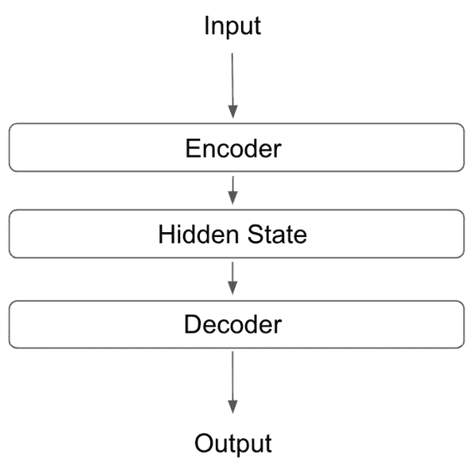
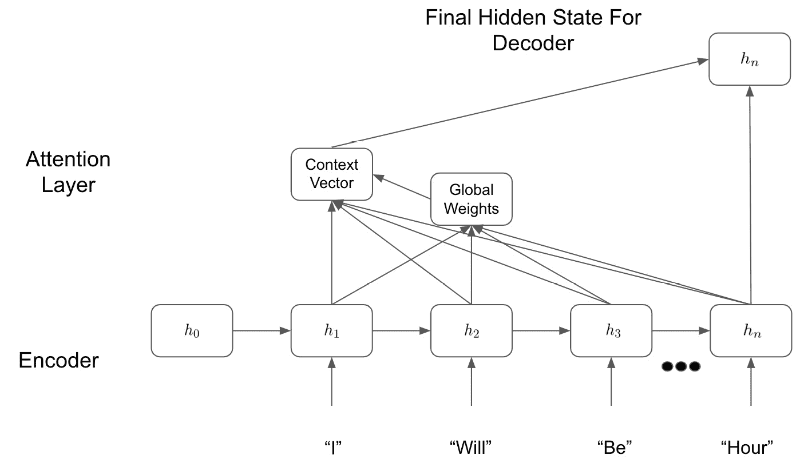
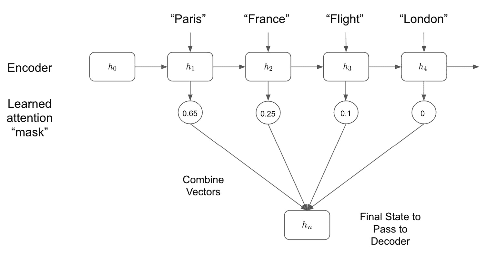
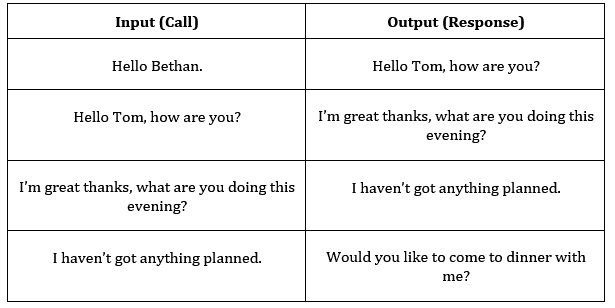
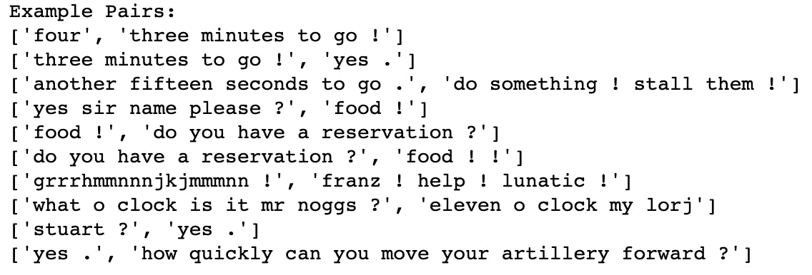

# “第 8 章”：使用基于注意力的神经网络构建聊天机器人

如果您曾经看过任何未来派科幻电影，那么您很有可能会看到与机器人的人类对话。 基于机器的情报一直是小说作品中的长期特征。 但是，由于 NLP 和深度学习的最新发展，与计算机的对话不再是幻想。 虽然我们可能距离真正的智能还很多年，在这种情况下，计算机能够以与人类相同的方式理解语言的含义，但机器至少能够进行基本的对话并提供基本的智能印象。

在上一章中，我们研究了如何构建序列到序列模型以将句子从一种语言翻译成另一种语言。 能够进行基本交互的对话型聊天机器人的工作方式几乎相同。 当我们与聊天机器人交谈时，我们的句子将成为模型的输入。 输出是聊天机器人选择回复的内容。 因此，我们正在训练它如何响应，而不是训练我们的聊天机器人来学习如何解释输入的句子。

我们将在上一章中扩展序列到序列模型，在模型中增加**注意**。 对序列到序列模型的这种改进意味着我们的模型可以学习输入句子中要查找的位置以获得所需信息的方式，而不是使用整个输入句子决策。 这项改进使我们能够创建具有最先进性能的效率更高的序列到序列模型。

在本章中，我们将研究以下主题：

*   神经网络中的注意力理论
*   在神经网络内实现注意力以构建聊天机器人

# 技术要求

本章的所有代码都可以在[这个页面](https://github.com/PacktPublishing/Hands-On-Natural-Language-Processing-with-PyTorch-1.x)中找到。

# 神经网络中的注意力理论

在上一章中，在用于句子翻译的序列到序列模型中（没有引起注意），我们同时使用了编码器和解码器。 编码器从输入句子中获得了隐藏状态，这是我们句子的一种表示形式。 然后，解码器使用此隐藏状态执行转换步骤。 对此的基本图形说明如下：

图 8.1 –序列到序列模型的图形表示

但是，对整个隐藏状态进行解码不一定是使用此任务的最有效方法。 这是因为隐藏状态代表整个输入句子； 但是，在某些任务中（例如预测句子中的下一个单词），我们无需考虑输入句子的整体，而只考虑与我们要进行的预测相关的部分。 我们可以通过在序列到序列神经网络中使用注意力来证明这一点。 我们可以教导我们的模型仅查看输入的相关部分以进行预测，从而建立一个更加有效和准确的模型。

考虑以下示例：

我将于 3 月 2 日前往法国首都巴黎。 我的航班从伦敦希思罗机场出发，大约需要一个小时。

假设我们正在训练一种模型来预测句子中的下一个单词。 我们可以先输入句子的开头：

法国的首都是 _____。

在这种情况下，我们希望我们的模型能够检索单词 **Paris** 。 如果要使用基本的序列到序列模型，我们会将整个输入转换为隐藏状态，然后我们的模型将尝试从中提取相关信息。 这包括有关航班的所有无关信息。 您可能会在这里注意到，我们只需要查看输入句子的一小部分即可确定完成句子所需的相关信息：

我将于 3 月 2 日前往法国首都巴黎**。 我的航班从伦敦希思罗机场出发，大约需要一个小时。**

因此，如果我们可以训练模型以仅使用输入句子中的相关信息，则可以做出更准确和相关的预测。 为此，我们可以在网络中实现**注意**。

我们可以采用两种主要的注意力机制：局部和全局注意力。

## 比较本地和全球关注

我们可以在网络中通过实现的两种注意形式与非常相似，但存在细微的关键区别。 我们将从关注本地开始。

在**局部关注**中，我们的模型仅查看编码器的一些隐藏状态。 例如，如果我们正在执行句子翻译任务，并且我们正在计算翻译中的第二个单词，则模型可能希望仅查看与输入中第二个单词相关的编码器的隐藏状态 句子。 这意味着我们的模型需要查看编码器的第二个隐藏状态（`h`2），但也可能需要查看它之前的隐藏状态（`h`1）。

在下图中，我们可以在实践中看到这一点：

图 8.2 –本地注意力模型

我们首先从最终隐藏状态`h`n 计算对齐位置`p`t。 这告诉我们需要进行观察才能发现哪些隐藏状态。 然后，我们计算局部权重并将其应用于隐藏状态，以确定上下文向量。 这些权重可能告诉我们，更多地关注最相关的隐藏状态（`h`2），而较少关注先前的隐藏状态（`h`1）。

然后，我们获取上下文向量，并将其转发给解码器以进行预测。 在我们基于非注意力的序列到序列模型中，我们只会向前传递最终的隐藏状态`h`n，但在这里我们看到的是，我们仅考虑了我们的相关隐藏状态 模型认为做出预测是必要的。

**全球关注**模型的运作方式与非常相似。 但是，我们不仅要查看所有隐藏状态，还希望查看模型的所有隐藏状态，因此命名为 global。 我们可以在此处看到全球关注层的图形化图示：

图 8.3 –全球关注模型

我们在前面的图中可以看到，尽管这看起来与我们的本地关注框架非常相似，但是我们的模型现在正在查看所有隐藏状态，并计算所有隐藏状态的全局权重。 这使我们的模型可以查看它认为相关的输入句子的任何给定部分，而不必局限于由本地关注方法确定的本地区域。 我们的模型可能只希望看到一个很小的局部区域，但这在模型的能力范围内。 考虑全球关注框架的一种简单方法是，它实质上是学习一个掩码，该掩码仅允许通过与我们的预测相关的隐藏状态：

图 8.4 –组合模型

我们在前面的图中可以看到，通过了解要注意的隐藏状态，我们的模型可以控制解码步骤中使用哪些状态来确定我们的预测输出。 一旦确定了要注意的隐藏状态，我们就可以使用多种不同的方法将它们组合在一起-通过连接或采用加权的点积。

# 注意使用序列到序列神经网络构建聊天机器人

准确说明如何在神经网络中实现注意力的最简单方法是通过示例。 现在，我们将使用应用了关注框架的序列到序列模型，完成从头构建聊天机器人的所有步骤。

与所有其他 NLP 模型一样，我们的第一步是获取并处理数据集以用于训练我们的模型。

## 正在获取我们的数据集

要训​​练我们的聊天机器人，我们需要一个会话数据集，模型可以通过该数据集学习如何响应。 我们的聊天机器人将接受一系列人工输入，并使用生成的句子对其进行响应。 因此，理想的数据集将由多行对话和适当的响应组成。 诸如此类任务的理想数据集将是来自两个人类用户之间的对话的实际聊天记录。 不幸的是，这些数据由私人信息组成，很难在公共领域获得，因此对于此任务，我们将使用电影脚本的数据集。

电影脚本由两个或更多角色之间的对话组成。 尽管此数据不是我们希望的自然格式，但我们可以轻松地将其转换为所需的格式。 以两个字符之间的简单对话为例：

*   **第 1 行**：您好 Bethan。
*   **第 2 行**：汤姆你好，你好吗？
*   **第 3 行**：非常感谢，您今天晚上在做什么？
*   **第 4 行**：我还没有任何计划。
*   **第 5 行**：您想和我一起吃晚饭吗？

现在，我们需要将其转换为调用和响应的输入和输出对，其中输入是脚本中的一行（调用），预期输出是脚本的下一行（响应）。 我们可以将`n`行的脚本转换为 *n-1* 对输入/输出：

图 8.5 –输入和输出表

我们可以使用这些输入/输出对来训练我们的网络，其中输入是人工输入的代理，而输出则是我们希望从模型中获得的响应。

建立模型的第一步是读取数据并执行所有必要的预处理步骤。

## 处理我们的数据集

幸运的是，为该示例提供的数据集已经被格式化，因此每行代表一个输入/输出对。 我们可以先读取其中的数据并检查一些行：

body =“ movie_corpus”

corpus_name = "movie_corpus"

数据文件= os.path.join（主体，“ formatted_movie_lines.txt”）

使用 open（datafile，'rb'）作为文件：

行数= file.readlines（）

用于行中的行[：3]：

打印（str（线）+'\ n'）

打印以下结果：

图 8.6 –检查数据集

首先，您会注意到我们的行与预期的一样，因为第一行的下半部分成为下一行的前半部分。 我们还可以注意到，每行的通话和响应半部分由制表符分隔符（**/ t**）分隔，我们的每行均由新的行分隔符（**/ n**）。 在处理数据集时，我们必须考虑到这一点。

第一步是创建一个词汇表或语料库，其中包含我们数据集中的所有唯一单词。

## 创建词汇

过去，我们的语料库由几个词典组成，这些词典由我们的语料库中的唯一单词以及在单词和索引之间的查找组成。 但是，我们可以通过创建一个包含所有必需元素的词汇表类，以一种更为优雅的方式来实现此目的：

1.  We start by creating our **Vocabulary** class. We initialize this class with empty dictionaries—**word2index** and **word2count**. We also initialize the **index2word** dictionary with placeholders for our padding tokens, as well as our **Start-of-Sentence** (**SOS**) and **End-of-Sentence** (**EOS**) tokens. We keep a running count of the number of words in our vocabulary, too (which is 3 to start with as our corpus already contains the three tokens mentioned). These are the default values for an empty vocabulary; however, they will be populated as we read our data in:

    PAD_token = 0

    SOS_token = 1

    EOS_token = 2

    课程词汇：

    def __init __（自己，名字）：

    self.name = name

    self.trimmed =假

    self.word2index = {}

    self.word2count = {}

    self.index2word = {PAD_token：“ pad”，SOS_token“ SOS”，EOS_token“ them”}

    self.num_words = 3

2.  Next, we create the functions that we will use to populate our vocabulary. **addWord** takes a word as input. If this is a new word that is not already in our vocabulary, we add this word to our indices, set the count of this word to 1, and increment the total number of words in our vocabulary by 1\. If the word in question is already in our vocabulary, we simply increment the count of this word by 1:

    def addWord（self，w）：

    如果 w 不在 self.word2index 中：

    self.word2index [w] = self.num_words

    self.word2count [w] = 1

    self.index2word [self.num_words] = w

    self.num_words + = 1

    其他：

    self.word2count [w] + = 1

3.  We also use the **addSentence** function to apply the **addWord** function to all the words within a given sentence:

    def addSentence（自己发送）：

    对于 send.split（''）中的单词：

    self.addWord（word）

    我们可以做的加快模型训练的一件事是减少词汇量。 这意味着任何嵌入层都将更小，并且模型中学习的参数总数会更少。 一种简单的方法是从我们的词汇表中删除所有低频词。 在我们的数据集中仅出现一次或两次的任何单词都不太可能具有巨大的预测能力，因此在最终模型中将它们从语料库中删除并替换为空白标记可以减少我们训练模型所需的时间并减少过度拟合而无需 对我们模型的预测有很大的负面影响。

4.  To remove low-frequency words from our vocabulary, we can implement a **trim** function. The function first loops through the word count dictionary and if the occurrence of the word is greater than the minimum required count, it is appended to a new list:

    def trim（self，min_cnt）：

    如果自我修剪：

    返回

    self.trimmed =真

    words_to_keep = []

    对于 k，v 在 self.word2count.items（）中：

    如果 v> = min_cnt：

    words_to_keep.append（k）

    print（'要保留的单词：{} / {} = {：.2% }'。format（

    len（words_to_keep），len（self.word2index），

    len（words_to_keep）/ len（self.word2index）））

5.  Finally, our indices are rebuilt from the new **words_to_keep** list. We set all the indices to their initial empty values and then repopulate them by looping through our kept words with the **addWord** function:

    self.word2index = {}

    self.word2count = {}

    self.index2word = {PAD_token：“ PAD”，\

    SOS_token：“ SOS”，\

    EOS_token“他们”}

    self.num_words = 3

    对于 words_to_keep 中的 w：

    self.addWord（w）

现在，我们已经定义了一个词汇类，可以很容易地用我们的输入句子填充。 接下来，我们实际上需要加载数据集以创建训练数据。

## 加载数据

我们将通过以下步骤开始加载数据：

1.  The first step for reading in our data is to perform any necessary steps to clean the data and make it more human-readable. We start by converting it from Unicode into ASCII format. We can easily use a function to do this:

    def unicodeToAscii（s）：

    返回''.join（

    unicodedata.normalize（'NFD'，s）中的 c 代表 c

    如果 unicodedata.category（c）！='Mn'

    )

2.  Next, we want to process our input strings so that they are all in lowercase and do not contain any trailing whitespace or punctuation, except the most basic characters. We can do this by using a series of regular expressions:

    def cleanString（s）：

    s = unicodeToAscii（s.lower（）。strip（））

    s = re.sub（r“（[。！？]]）”，r“ \ 1”，s）

    S =应用 re.sub（R “[“一个-ZA-Z！？] +” R “” S）

    s = re.sub（r“ \ s +”，r“”，s）.strip（）

    返回 s

3.  Finally, we apply this function within a wider function—**readVocs**. This function reads our data file into lines and then applies the **cleanString** function to every line. It also creates an instance of the **Vocabulary** class that we created earlier, meaning this function outputs both our data and vocabulary:

    def readVocs（数据文件，语料库名称）：

    lines =打开（数据文件，编码='utf-8'）。\

    read（）。strip（）。split（'\ n'）

    对= [[l 中的 s 的 cleanString（s）.split（'\ t'）]对 l 的行]

    voc =词汇表（corpus_name）

    回声，成对

    接下来，我们根据输入对的最大长度对其进行过滤。 再次这样做是为了减少我们模型的潜在维数。 预测数百个单词长的句子将需要非常深的架构。 为了节省培训时间，我们希望将此处的培训数据限制为输入和输出少于 10 个字长的实例。

4.  To do this, we create a couple of filter functions. The first one, **filterPair**, returns a Boolean value based on whether the current line has an input and output length that is less than the maximum length. Our second function, **filterPairs**, simply applies this condition to all the pairs within our dataset, only keeping the ones that meet this condition:

    def filterPair（p，max_length）：

    返回 len（p [0] .split（''））<max_length .split=""></max_length>

    def filterPairs（pairs，max_length）：

    返回[成对成对，如果 filterPair（pair，max_length）]

5.  Now, we just need to create one final function that applies all the previous functions we have put together and run it to create our vocabulary and data pairs:

    def loadData（语料库，语料库名称，数据文件，save_dir，max_length）：

    voc，对= readVocs（数据文件，语料库名称）

    print（str（len（pairs））+“句子对”）

    对= filterPairs（pairs，max_length）

    print（str（len（pairs））+“修剪后的句子对”）

    对于 p 对：

    voc.addSentence（p [0]）

    voc.addSentence（p [1]）

    print（str（voc.num_words）+“词汇中的不同单词”）

    回声，成对

    max_length = 10

    voc，对= loadData（corpus，corpus_name，datafile，max_length）

    我们可以看到我们的输入数据集包含超过 200,000 对。 当我们将其过滤为输入和输出长度均少于 10 个单词的句子时，这将减少为仅由 18,000 个不同单词组成的 64,000 对：

    

    图 8.7 –数据集中句子的值

6.  We can print a selection of our processed input/output pairs in order to verify that our functions have all worked correctly:

    打印（“示例对：”）

    成对使用[-10：]：

    打印（一对）

    生成以下输出：

图 8.8 –处理后的输入/输出对

看来我们已经成功地将数据集分为输入和输出对，可以在上面训练网络。

最后，在开始构建模型之前，我们必须从语料库和数据对中删除稀有词。

## 删除稀有词

如前所述，仅在数据集中出现几次的单词会增加模型的维数，从而增加模型的复杂度以及训练模型所需的时间。 因此，最好将其从我们的训练数据中删除，以使我们的模型尽可能简化和高效。

您可能还记得我们在词汇表中内置了**修剪**函数，这使我们能够从词汇表中删除不经常出现的单词。 现在，我们可以创建一个函数来删除这些稀有单词，并从词汇表中调用 **trim** 方法，这是我们的第一步。 您将看到，这从我们的词汇表中删除了大部分单词，这表明我们词汇表中的大多数单词很少出现。 这是可以预期的，因为任何语言模型中的单词分布都会遵循长尾分布。 我们将使用以下步骤删除单词：

1.  We first calculate the percentage of words that we will keep within our model:

    def removeRareWords（voc，all_pairs，最小值）：

    voc.trim（最低）

    结果为以下输出：

    

    图 8.9 –要保留的单词百分比

2.  Within this same function, we loop through all the words in the input and output sentences. If for a given pair either the input or output sentence has a word that isn't in our new trimmed corpus, we drop this pair from our dataset. We print the output and see that even though we have dropped over half of our vocabulary, we only drop around 17% of our training pairs. This again reflects how our corpus of words is distributed over our individual training pairs:

    pair_to_keep = []

    对于 all_pairs 中的 p：

    保持=真

    对于 p [0] .split（''）中的单词：

    如果单词不在 voc.word2index 中：

    保持=假

    打破

    对于 p [1] .split（''）中的单词：

    如果单词不在 voc.word2index 中：

    保持=假

    打破

    如果保持：

    pair_to_keep.append（p）

    print（“从{}对修剪成{}，占总数的{：.2% }。\

    格式（len（all_pairs），len（pairs_to_keep），

    len（pairs_to_keep）/ len（all_pairs）））

    返回 pairs_to_keep

    minimum_count = 3

    对= removeRareWords（voc，对，minimum_count）

    结果为以下输出：

图 8.10 –构建数据集后的最终值

现在我们有了完成的数据集，我们需要构建一些函数，将我们的数据集转换为成批的张量，然后将它们传递给模型。

## 将句子对转换为张量

我们知道我们的模型不会将原始文本作为输入，而是将句子的张量表示作为输入。 我们也不会一一处理句子，而是分批处理。 为此，我们需要将输入和输出语句都转换为张量，其中张量的宽度表示我们希望在其上训练的批处理的大小：

1.  We start by creating several helper functions, which we can use to transform our pairs into tensors. We first create a **indexFromSentence** function, which grabs the index of each word in the sentence from the vocabulary and appends an EOS token to the end:

    def indexFromSentence（voc，句子）：

    返回[voc.word2index [word]中的单词 in \

    send.split（）] + [EOS_token]

2.  Secondly, we create a **zeroPad** function, which pads any tensors with zeroes so that all of the sentences within the tensor are effectively the same length:

    def zeroPad（l，fillvalue = PAD_token）：

    返回列表（itertools.zip_longest（* l，\

    fillvalue = fillvalue））

3.  Then, to generate our input tensor, we apply both of these functions. First, we get the indices of our input sentence, then apply padding, and then transform the output into **LongTensor**. We will also obtain the lengths of each of our input sentences out output this as a tensor:

    def inputVar（l，voc）：

    index_batch = [indexFromSentence（voc，句子）\

    l 中的句子]

    padList = zeroPad（indexes_batch）

    padTensor =火炬 LongTensor（padList）

    lengths = torch.tensor（[在 lens_batch 中为 lens 的 len \（indexes）]）

    返回垫张量，长度

4.  Within our network, our padded tokens should generally be ignored. We don't want to train our model on these padded tokens, so we create a Boolean mask to ignore these tokens. To do so, we use a **getMask** function, which we apply to our output tensor. This simply returns`1`if the output consists of a word and`0`if it consists of a padding token:

    def getMask（l，value = PAD_token）：

    m = []

    对于 i，枚举（l）中的 seq：

    m.append（[]）

    对于 seq 中的令牌：

    如果令牌== PAD_token：

    m [i] .append（0）

    其他：

    m [i] .append（1）

    返回 m

5.  We then apply this to our **outputVar** function. This is identical to the **inputVar** function, except that along with the indexed output tensor and the tensor of lengths, we also return the Boolean mask of our output tensor. This Boolean mask just returns **True** when there is a word within the output tensor and **False** when there is a padding token. We also return the maximum length of sentences within our output tensor:

    def outputVar（l，voc）：

    index_batch = [indexFromSentence（voc，句子）

    l 中的句子]

    max_target_len = max（[len（indexes）for in

    index_batch]）

    padList = zeroPad（indexes_batch）

    面具=火炬.BoolTensor（getMask（padList））

    padTensor =火炬 LongTensor（padList）

    返回 padTensor，遮罩，max_target_len

6.  Finally, in order to create our input and output batches concurrently, we loop through the pairs in our batch and create input and output tensors for both pairs using the functions we created previously. We then return all the necessary variables:

    def batch2Train（voc，batch）：

    batch.sort（key = lambda x：len（x [0] .split（“”）），\

    反向=真）

    input_batch = []

    output_batch = []

    对于批处理 p：

    input_batch.append（p [0]）

    output_batch.append（p [1]）

    inp，长度= inputVar（input_batch，voc）

    输出，掩码，max_target_len = outputVar（输出批处理，voc）

    返回 inp，长度，输出，掩码，max_target_len

7.  This function should be all we need to transform our training pairs into tensors for training our model. We can validate that this is working correctly by performing a single iteration of our **batch2Train** function on a random selection of our data. We set our batch size to`5`and run this once:

    test_batch_size = 5

    batchs = batch2Train（voc，[范围内的 _ \的 random.choice（pairs）对（test_batch_size）]）

    input_variable，长度，target_variable，掩码，max_target_len =批次

    在这里，我们可以验证输入张量是否已正确创建。 注意句子如何以填充（0 个标记）结尾，其中句子长度小于张量的最大长度（在本例中为 9）。 张量的宽度也对应于批量大小（在这种情况下为 5）：

图 8.11 –输入张量

我们还可以验证相应的输出数据和掩码。 请注意，掩码中的**假**值如何与输出张量中的填充标记（零）重叠：

图 8.12 –目标和模板张量

现在我们已获取，清理和转换了数据，我们准备开始训练基于注意力的模型，该模型将成为聊天机器人的基础。

## 建立模型

与其他序列到序列模型一样，我们通过创建编码器开始。 这会将输入句子的初始张量表示转换为隐藏状态。

### 构造编码器

现在，我们将通过以下步骤创建编码器：

1.  As with all of our PyTorch models, we start by creating an **Encoder** class that inherits from **nn.Module**. All the elements here should look familiar to the ones used in previous chapters:

    EncoderRNN（nn.Module）类：

    def __init __（self，hidden_​​size，embedding，\

    n_layers = 1，辍学= 0）：

    super（EncoderRNN，self）.__ init __（）

    self.n_layers = n_layers

    self.hidden_​​size = hidden_​​size

    self.embeddding =嵌入

    接下来，我们创建我们的**循环** **神经** **网络**（**RNN**）模块。 在此聊天机器人中，我们将使用**门控循环单元**（**GRU**）代替 **Long** **短期** **内存 我们之前看到的**（**LSTM**）模型。 尽管 GRU 仍然控制通过 RNN 的信息流，但其的复杂度比 LSTM 小，但它们没有像 LSTM 这样的单独的门和更新门。 我们在这种情况下使用 GRU 的原因有几个：

    a）由于需要学习的参数较少，因此 GRU 已被证明具有更高的计算效率。 这意味着我们的模型使用 GRU 进行训练要比使用 LSTM 进行训练更快。

    b）已证明 GRU 在短数据序列上具有与 LSTM 相似的性能水平。 当学习更长的数据序列时，LSTM 更有用。 在这种情况下，我们仅使用 10 个单词或更少的输入句子，因此 GRU 应该产生相似的结果。

    c）事实证明，GRU 在学习小型数据集方面比 LSTM 更有效。 由于我们的训练数据的规模相对于我们要学习的任务的复杂性而言较小，因此我们应该选择使用 GRU。

2.  We now define our GRU, taking into account the size of our input, the number of layers, and whether we should implement dropout:

    self.gru = nn.GRU（hidden_​​size，hidden_​​size，n_layers，

    dropout =（如果 n_layers == 1 则为 0，否则\

    退出），双向= True）

    注意这里我们如何在模型中实现双向性。 您会从前面的章节中回顾到，双向 RNN 允许我们学习从句子向前移动到句子之间以及向后顺序移动的句子。 这使我们可以更好地捕获句子中每个单词相对于前后单词的上下文。 GRU 中的双向性意味着我们的编码器如下所示：

    

    图 8.13 –编码器布局

    我们在输入句子中保持两个隐藏状态以及每一步的输出。

3.  Next, we need to create a forward pass for our encoder. We do this by first embedding our input sentences and then using the **pack_padded_sequence** function on our embeddings. This function "packs" our padded sequence so that all of our inputs are of the same length. We then pass out the packed sequences through our GRU to perform a forward pass:

    def forward（自我，input_seq，input_lengths，hidden = None）：

    嵌入式= self.embedding（input_seq）

    包装= nn.utils.rnn.pack_padded_sequence（嵌入，

    input_lengths）

    输出，隐藏= self.gru（打包，隐藏）

4.  After this, we unpack our padding and sum the GRU outputs. We can then return this summed output, along with our final hidden state, to complete our forward pass:

    输出，_ = nn.utils.rnn.pad_packed_sequence（输出）

    输出=输出[：，：，：self.hidden_​​size] +一个\

    输出[：，：，self.hidden_​​size：]

    返回输出，隐藏

现在，我们将在下一部分继续创建关注模块。

### 构建注意力模块

接下来，我们需要构建我们的注意力模块，该模块将应用于我们的编码器，以便我们可以从编码器输出的相关部分中学习。 我们将按照以下方式进行：

1.  Start by creating a class for the attention model:

    类 Attn（nn.Module）：

    def __init __（self，hidden_​​size）：

    super（Attn，self）.__ init __（）

    self.hidden_​​size = hidden_​​size

2.  Then, create the **dot_score** function within this class. This function simply calculates the dot product of our encoder output with the output of our hidden state by our encoder. While there are other ways of transforming these two tensors into a single representation, using a dot product is one of the simplest:

    def dot_score（自身，隐藏，encoder_output）：

    返回 torch.sum（隐藏* encoder_output，dim = 2）

3.  We then use this function within our forward pass. First, calculate the attention weights/energies based on the **dot_score** method, then transpose the results, and return the softmax transformed probability scores:

    def forward（自身，隐藏，encoder_outputs）：

    attn_energies = self.dot_score（隐藏，\

    encoder_outputs）

    attn_energies = attn_energies.t（）

    返回 F.softmax（attn_energies，dim = 1）.unsqueeze（1）

接下来，我们可以在解码器中使用此关注模块来创建关注焦点的解码器。

### 构造解码器

我们现在将构造解码器，如下所示：

1.  We begin by creating our **DecoderRNN** class, inheriting from **nn.Module** and defining the initialization parameters:

    类 DecoderRNN（nn.Module）：

    def __init __（self，embedding，hidden_​​size，\

    output_size，n_layers = 1，dropout = 0.1）：

    超级（DecoderRNN，self）.__ init __（）

    self.hidden_​​size = hidden_​​size

    self.output_size = output_size

    self.n_layers = n_layers

    self.dropout =辍学

2.  We then create our layers within this module. We will create an embedding layer and a corresponding dropout layer. We use GRUs again for our decoder; however, this time, we do not need to make our GRU layer bidirectional as we will be decoding the output from our encoder sequentially. We will also create two linear layers—one regular layer for calculating our output and one layer that can be used for concatenation. This layer is twice the width of the regular hidden layer as it will be used on two concatenated vectors, each with a length of **hidden_size**. We also initialize an instance of our attention module from the last section in order to be able to use it within our **Decoder** class:

    self.embeddding =嵌入

    self.embedding_dropout = nn.Dropout（辍学）

    self.gru = nn.GRU（hidden_​​size，hidden_​​size，n_layers，辍学=（如果 n_layers == 1 则辍学，为 0））

    self.concat = nn.Linear（2 * hidden_​​size，hidden_​​size）

    self.out = nn.Linear（hidden_​​size，output_size）

    self.attn = Attn（hidden_​​size）

3.  After defining all of our layers, we need to create a forward pass for the decoder. Notice how the forward pass will be used one step (word) at a time. We start by getting the embedding of the current input word and making a forward pass through the GRU layer to get our output and hidden states:

    def forward（自我，input_step，last_hidden，encoder_outputs）：

    嵌入式= self.embedding（input_step）

    嵌入式= self.embedding_dropout（嵌入式）

    rnn_output，隐藏= self.gru（嵌入，last_hidden）

4.  Next, we use the attention module to get the attention weights from the GRU output. These weights are then multiplied by the encoder outputs to effectively give us a weighted sum of our attention weights and our encoder output:

    attn_weights = self.attn（rnn_output，编码器输出）

    context = attn_weights.bmm（encoder_outputs.transpose（0，

    1))

5.  We then concatenate our weighted context vector with the output of our GRU and apply a **tanh** function to get out final concatenated output:

    rnn_output = rnn_output.squeeze（0）

    上下文= context.squeeze（1）

    concat_input = torch.cat（（rnn_output，上下文），1）

    concat_output =火炬.tanh（self.concat（concat_input））

6.  For the final step within our decoder, we simply use this final concatenated output to predict the next word and apply a **softmax** function. The forward pass finally returns this output, along with the final hidden state. This forward pass will be iterated upon, with the next forward pass using the next word in the sentence and this new hidden state:

    输出= self.out（concat_output）

    输出= F.softmax（输出，暗= 1）

    返回输出，隐藏

现在我们已经定义了模型，我们准备定义训练过程

## 定义培训过程

训练过程的第一步是为我们的模型定义损失的度量。 由于我们的输入张量可能由填充序列组成，由于我们输入的句子都具有不同的长度，因此我们不能简单地计算真实输出和预测输出张量之间的差。 为了解决这个问题，我们将定义一个损失函数，该函数将布尔掩码应用于输出，并且仅计算未填充令牌的损失：

1.  In the following function, we can see that we calculate cross-entropy loss across the whole output tensors. However, to get the total loss, we only average over the elements of the tensor that are selected by the Boolean mask:

    def NLLMaskLoss（inp，target，mask）：

    TotalN = mask.sum（）

    CELoss = -torch.log（torch.gather（inp，1，\ target.view（-1，1））。squeeze（1））

    损失= CELoss.masked_select（mask）.mean（）

    损失= loss.to（设备）

    回波损耗，TotalN.item（）

2.  For the majority of our training, we need two main functions—one function, **train()**, which performs training on a single batch of our training data and another function, **trainIters()**, which iterates through our whole dataset and calls **train()** on each of the individual batches. We start by defining **train()** in order to train on a single batch of data. Create the **train()** function, then get the gradients to 0, define the device options, and initialize the variables:

    def train（输入变量，长度，目标变量，\

    遮罩，max_target_len，编码器，解码器，\

    嵌入，encoder_optimizer，\

    coder_optimizer，batch_size，片段，\

    max_length = max_length）：

    encoder_optimizer.zero_grad（）

    coder_optimizer.zero_grad（）

    input_variable = input_variable.to（设备）

    长度= lengths.to（设备）

    target_variable = target_variable.to（设备）

    mask = mask.to（设备）

    损失= 0

    print_losses = []

    n_totals = 0

3.  Then, perform a forward pass of the inputs and sequence lengths though the encoder to get the output and hidden states:

    编码器输出，编码器隐藏=编码器（输入变量，长度）

4.  Next, we create our initial decoder input, starting with SOS tokens for each sentence. We then set the initial hidden state of our decoder to be equal to that of the encoder:

    coder_input = torch.LongTensor（[[[SOS_token for _ in \

    范围（batch_size）]]）

    解码器输入=解码器输入.to（设备）

    coder_hidden = encoder_hidden [：decoder.n_layers]

    接下来，我们实施教师强迫。 如果您从上一章的老师强迫中回想起，当以给定的概率生成输出序列时，我们将使用真正的上一个输出标记而不是预测的上一个输出标记来生成输出序列中的下一个单词。 使用教师强制可以帮助我们的模型更快收敛。 但是，我们必须小心，不要使教师强迫率过高，否则我们的模型将过于依赖教师强迫，并且不会学会独立产生正确的输出。

5.  Determine whether we should use teacher forcing for the current step:

    use_TF =如果 random.random（）<teacher_forcing_ratio></teacher_forcing_ratio>

6.  Then, if we do need to implement teacher forcing, run the following code. We pass each of our sequence batches through the decoder to obtain our output. We then set the next input as the true output (**target**). Finally, we calculate and accumulate the loss using our loss function and print this to the console:

    对于范围内的 t（max_target_len）：

    解码器输出，解码器隐藏=解码器（

    解码器输入，解码器隐藏，编码器输出）

    coder_input = target_variable [t] .view（1，-1）

    mask_loss，nTotal = NLLMaskLoss（decoder_output，\

    target_variable [t]，mask [t]）

    损失+ = mask_loss

    print_losses.append（mask_loss.item（）* nTotal）

    n_totals + = nTotal

7.  If we do not implement teacher forcing on a given batch, the procedure is almost identical. However, instead of using the true output as the next input into the sequence, we use the one generated by the model:

    _，topi =解码器输出.topk（1）

    coder_input = torch.LongTensor（[[topi [i] [0] for i in \

    范围（batch_size）]]）

    解码器输入=解码器输入.to（设备）

8.  Finally, as with all of our models, the final steps are to perform backpropagation, implement gradient clipping, and step through both of our encoder and decoder optimizers to update the weights using gradient descent. Remember that we clip out gradients in order to prevent the vanishing/exploding gradient problem, which was discussed in earlier chapters. Finally, our training step returns our average loss:

    loss.backward（）

    _ = nn.utils.clip_grad_norm_（encoder.parameters（），剪辑）

    _ = nn.utils.clip_grad_norm_（decoder.parameters（），剪辑）

    encoder_optimizer.step（）

    coder_optimizer.step（）

    返回总和（print_losses）/ n_totals

9.  Next, as previously stated, we need to create the **trainIters()** function, which repeatedly calls our training function on different batches of input data. We start by splitting our data into batches using the **batch2Train** function we created earlier:

    def trainIters（model_name，voc，对，编码器，解码器，\

    encoder_optimizer，decoder_optimizer，\

    嵌入，encoder_n_layers，

    coder_n_layers，save_dir，n_iteration，\

    batch_size，print_every，save_every，\

    剪辑，corpus_name，loadFilename）：

    training_batches = [batch2Train（voc，\

    [_ in 的 random.choice（对）\

    _ in \的 range（batch_size）]）

    范围（n_iteration）]

10.  We then create a few variables that will allow us to count iterations and keep track of the total loss over each epoch:

    打印（'开始...'）

    start_iteration = 1

    print_loss = 0

    如果 loadFilename：

    start_iteration = checkpoint ['iteration'] + 1

11.  Next, we define our training loop. For each iteration, we get a training batch from our list of batches. We then extract the relevant fields from our batch and run a single training iteration using these parameters. Finally, we add the loss from this batch to our overall loss:

    打印（“开始培训...”）

    对于范围内的迭代（start_iteration，n_iteration + 1）：

    training_batch = training_batches [迭代-1]

    输入变量，长度，目标变量，掩码，\

    max_target_len = training_batch

    损失=火车（输入变量，长度，\

    target_variable，掩码，max_target_len，\

    编码器，解码器，嵌入，

    encoder_optimizer，decoder_optimizer，\

    batch_size，剪辑）

    print_loss + =损失

12.  On every iteration, we also make sure we print our progress so far, keeping track of how many iterations we have completed and what our loss was for each epoch:

    如果迭代% print_every == 0：

    print_loss_avg = print_loss / print_every

    print（“迭代：{};完成百分比：{：.1f}% ; \

    平均损失：{:. 4f}“。format（迭代，

    迭代/ n_iteration \

    * 100，print_loss_avg））

    print_loss = 0

13.  For the sake of completion, we also need to save our model state after every few epochs. This allows us to revisit any historical models we have trained; for example, if our model were to begin overfitting, we could revert back to an earlier iteration:

    如果（迭代% save_every == 0）：

    目录= os.path.join（save_dir，model_name，\

    corpus_name, '{}-{}_{}'.\

    格式（encoder_n_layers，\

    coder_n_layers，\

    hidden_​​size））

    如果不是 os.path.exists（目录）：

    os.makedirs（目录）

    torch.save({

    “迭代”：迭代，

    ``en''：encoder.state_dict（），

    'de': decoder.state_dict(),

    'en_opt'：encoder_optimizer.state_dict（），

    'de_opt': decoder_optimizer.state_dict(),

    “损失”：损失，

    'voc_dict'：您.__ dict__，

    '嵌入'：embedding.state_dict（）

    }，os.path.join（目录，'{} _ {}。tar'.format（iteration，'checkpoint'）））

现在已经完成了开始训练模型的所有必要步骤，我们需要创建函数以允许我们评估模型的性能。

## 定义评估过程

评估聊天机器人与评估其他序列到序列模型略有不同。 在我们的文本翻译任务中，英语句子将直接翻译成德语。 虽然可能有多种正确的翻译，但在大多数情况下，只有一种正确的翻译可以将一种语言翻译成另一种语言。

对于聊天机器人，有多个不同的有效输出。 从与聊天机器人进行的一些对话中获取以下三行内容：

**输入**：*“您好”*

**输出**：*“您好”*

**输入**：*“您好”*

**输出**：*“你好。你好吗？”*

**输入**：“ *你好”*

**输出**：*“您想要什么？”*

在这里，我们有三个不同的响应，每个响应都同样有效。 因此，在与聊天机器人进行对话的每个阶段，都不会出现任何“正确”的响应。 因此，评估要困难得多。 测试聊天机器人是否产生有效输出的最直观方法是与之对话！ 这意味着我们需要以一种使我们能够与其进行对话以确定其是否运行良好的方式来设置聊天机器人：

1.  We will start by defining a class that will allow us to decode the encoded input and produce text. We do this by using what is known as a **greedy encoder**. This simply means that at each step of the decoder, our model takes the word with the highest predicted probability as the output. We start by initializing the **GreedyEncoder()** class with our pretrained encoder and decoder:

    GreedySearchDecoder（nn.Module）类：

    def __init __（自身，编码器，解码器）：

    超级（GreedySearchDecoder，self）.__ init __（）

    self.encoder =编码器

    self.decoder =解码器

2.  Next, define a forward pass for our decoder. We pass the input through our encoder to get our encoder's output and hidden state. We take the encoder's final hidden layer to be the first hidden input to the decoder:

    def 转发（自己，input_seq，input_length，max_length）：

    encoder_outputs，encoder_hidden = \

    self.encoder（input_seq，input_length）

    coder_hidden = encoder_hidden [：decoder.n_layers]

3.  Then, create the decoder input with SOS tokens and initialize the tensors to append decoded words to (initialized as a single zero value):

    coder_input = torch.ones（1，1，device = device，dtype = torch.long）* SOS_token

    all_tokens = torch.zeros（[0]，device = device，dtype = torch.long）

    all_scores = torch.zeros（[0]，device = device）

4.  After that, iterate through the sequence, decoding one word at a time. We perform a forward pass through the encoder and add a **max** function to obtain the highest-scoring predicted word and its score, which we then append to the **all_tokens** and **all_scores** variables. Finally, we take this predicted token and use it as the next input to our decoder. After the whole sequence has been iterated over, we return the complete predicted sentence:

    对于 _ 范围（最大长度）：

    解码器输出，解码器隐藏= self.decoder \

    （解码器输入，解码器隐藏，编码器输出）

    解码器分数，解码器输入=

    torch.max（decoder_output，dim = 1）

    all_tokens = torch.cat（（all_tokens，解码器输入），\

    零= 0）

    all_scores = torch.cat（（all_scores，decoder_scores），\

    零= 0）

    解码器输入= torch.unsqueeze（解码器输入，0）

    返回 all_tokens，all_scores

    所有的部分都开始融合在一起。 我们具有已定义的训练和评估功能，因此最后一步是编写一个功能，该功能实际上会将我们的输入作为文本，将其传递给我们的模型，并从模型中获取响应。 这将是我们聊天机器人的“界面”，我们实际上在那里进行对话。

5.  We first define an **evaluate()** function, which takes our input function and returns the predicted output words. We start by transforming our input sentence into indices using our vocabulary. We then obtain a tensor of the lengths of each of these sentences and transpose it:

    def 评估（编码器，解码器，搜索器，voc，句子，\

    max_length = max_length）：

    索引= [indexFromSentence（voc，句子）]

    lengths = torch.tensor（[len（indexes）for index \

    索引中]）

    input_batch =火炬。LongTensor（indices）.transpose（0，1）

6.  Then, we assign our lengths and input tensors to the relevant devices. Next, run the inputs through the searcher (**GreedySearchDecoder**) to obtain the word indices of the predicted output. Finally, we transform these word indices back into word tokens before returning them as the function output:

    input_batch = input_batch.to（设备）

    长度= lengths.to（设备）

    令牌，分数=搜索者（input_batch，长度，\

    最长长度）

    解码字= [voc.index2word [token.item（）]

    令牌中的令牌]

    返回 decoded_words

7.  Finally, we create a **runchatbot** function, which acts as the interface with our chatbot. This function takes human-typed input and prints the chatbot's response. We create this function as a **while** loop that continues until we terminate the function or type **quit** as our input:

    def runchatbot(encoder, decoder, searcher, voc):

    input_sentence =''

    while（1）：

    尝试：

    input_sentence = input（'>'）

    如果 input_sentence =='quit'：中断

8.  We then take the typed input and normalize it, before passing the normalized input to our **evaluate()** function, which returns the predicted words from the chatbot:

    input_sentence = cleanString（input_sentence）

    output_words =评估（编码器，解码器，搜索器，\

    voc，input_sentence）

9.  Finally, we take these output words and format them, ignoring the EOS and padding tokens, before printing the chatbot's response. Because this is a **while** loop, this allows us to continue the conversation with the chatbot indefinitely:

    output_words [：] = [x 表示 output_words 中的 x，如果\

    不是（x =='EOS'或 x =='PAD'）]

    print（'Response：'，''.join（output_words））

现在我们已经构建了训练，评估和使用聊天机器人所需的所有功能，现在该开始最后一步了—训练模型并与训练有素的聊天机器人进行对话。

## 训练模型

当我们定义了所有必需的功能时，训练模型就成为一种情况或初始化我们的超参数并调用我们的训练功能：

1.  We first initialize our hyperparameters. While these are only suggested hyperparameters, our models have been set up in a way that will allow them to adapt to whatever hyperparameters they are passed. It is good practice to experiment with different hyperparameters to see which ones result in an optimal model configuration. Here, you could experiment with increasing the number of layers in your encoder and decoder, increasing or decreasing the size of the hidden layers, or increasing the batch size. All of these hyperparameters will have an effect on how well your model learns, as well as a number of other factors, such as the time it takes to train the model:

    model_name ='聊天机器人模型'

    hidden_​​size = 500

    encoder_n_layers = 2

    coder_n_layers = 2

    辍学= 0.15

    batch_size = 64

2.  After that, we can load our checkpoints. If we have previously trained a model, we can load the checkpoints and model states from previous iterations. This saves us from having to retrain our model each time:

    loadFilename =无

    checkpoint_iter = 4000

    如果 loadFilename：

    检查点= torch.load（loadFilename）

    encoder_sd =检查点['en']

    decoder_sd = checkpoint['de']

    encoder_optimizer_sd =检查点['en_opt']

    decoder_optimizer_sd = checkpoint['de_opt']

    embedding_sd =检查点['嵌入']

    您.__ dict__ =检查点['voc_dict']

3.  After that, we can begin to build our models. We first load our embeddings from the vocabulary. If we have already trained a model, we can load the trained embeddings layer:

    嵌入= nn。嵌入（voc.num_words，hidden_​​size）

    如果 loadFilename：

    embedding.load_state_dict（embedding_sd）

4.  We then do the same for our encoder and decoder, creating model instances using the defined hyperparameters. Again, if we have already trained a model, we simply load the trained model states into our models:

    编码器= EncoderRNN（hidden_​​size，嵌入，\

    encoder_n_layers，辍学）

    解码器= DecoderRNN（嵌入，hidden_​​size，

    voc.num_words，decoder_n_layers，

    退出）

    如果 loadFilename：

    encoder.load_state_dict（encoder_sd）

    coder.load_state_dict（decoder_sd）

5.  Last but not least, we specify a device for each of our models to be trained on. Remember, this is a crucial step if you wish to use GPU training:

    编码器= encoder.to（设备）

    解码器=解码器.to（设备）

    打印（“模型已构建，可以开始使用！”）

    如果一切正常，并且创建的模型没有错误，则应该看到以下内容：

    

    图 8.14 –成功的输出

    现在我们已经创建了编码器和解码器的实例，我们准备开始训练它们。

    我们首先初始化一些训练超参数。 以与模型超参数相同的方式，可以调整这些参数以影响训练时间以及模型的学习方式。 裁剪控制渐变裁剪，教师强迫控制我们在模型中使用教师强迫的频率。 请注意，我们如何使用教师强制比 1，以便始终使用教师强制。 降低教学强迫率将意味着我们的模型需要更长的时间才能收敛。 但是，从长远来看，这可能有助于我们的模型更好地自行生成正确的句子。

6.  We also need to define the learning rates of our models and our decoder learning ratio. You will find that your model performs better when the decoder carries out larger parameter updates during gradient descent. Therefore, we introduce a decoder learning ratio to apply a multiplier to the learning rate so that the learning rate is greater for the decoder than it is for the encoder. We also define how often our model prints and saves the results, as well as how many epochs we want our model to run for:

    save_dir ='./'

    剪辑= 50.0

    Teacher_forcing_ratio = 1.0

    learning_rate = 0.0001

    coder_learning_ratio = 5.0

    时代= 4000

    print_every = 1

    save_every = 500

7.  Next, as always when training models in PyTorch, we switch our models to training mode to allow the parameters to be updated:

    encoder.train（）

    coder.train（）

8.  Next, we create optimizers for both the encoder and decoder. We initialize these as Adam optimizers, but other optimizers will work equally well. Experimenting with different optimizers may yield different levels of model performance. If you have trained a model previously, you can also load the optimizer states if required:

    print（'建筑优化器...'）

    encoder_optimizer = optim.Adam（encoder.parameters（），\

    lr = learning_rate）

    coder_optimizer = optim.Adam（decoder.parameters（），

    lr =学习率*解码器学习率）

    如果 loadFilename：

    encoder_optimizer.load_state_dict（\

    encoder_optimizer_sd）

    coder_optimizer.load_state_dict（\

    coder_optimizer_sd）

9.  The final step before running the training is to make sure CUDA is configured to be called if you wish to use GPU training. To do this, we simply loop through the optimizer states for both the encoder and decoder and enable CUDA across all of the states:

    对于 encoder_optimizer.state.values（）中的状态：

    对于 k，v 在 state.items（）中：

    如果 isinstance（v，火炬张量）：

    状态[k] = v.cuda（）

    用于解码器 _ 优化器。状态。值（）中的状态：

    对于 k，v 在 state.items（）中：

    如果 isinstance（v，火炬张量）：

    状态[k] = v.cuda（）

10.  Finally, we are ready to train our model. This can be done by simply calling the **trainIters** function with all the required parameters:

    打印（“开始培训！”）

    trainIters（model_name，voc，对，编码器，解码器，\

    编码器优化器，解码器优化器，

    嵌入，encoder_n_layers，

    coder_n_layers，save_dir，时期，\

    batch_size，print_every，save_every，\

    片段，语料库名称，loadFilename）

    如果此操作正常，您应该看到以下输出开始打印：

图 8.15 –训练模型

您的模型正在训练中！ 根据许多因素，例如您将模型设置为训练多少个时期以及是否使用 GPU，模型可能需要一些时间来训练。 完成后，您将看到以下输出。 如果一切正常，则模型的平均损失将大大低于开始训练时的损失，这表明模型已经学到了一些有用的信息：

图 8.16 – 4,000 次迭代后的平均损耗

现在我们的模型已经训练完毕，我们可以开始评估过程并开始使用聊天机器人。

### 评估模型

### 既然我们已经成功创建并训练了我们的模型，那么现在该评估其性能了。 我们将通过以下步骤进行操作：

1.  To begin the evaluation, we first switch our model into evaluation mode. As with all other PyTorch models, this is done to prevent any further parameter updates occurring within the evaluation process:

    encoder.eval（）

    coder.eval（）

2.  We also initialize an instance of **GreedySearchDecoder** in order to be able to perform the evaluation and return the predicted output as text:

    搜索者= GreedySearchDecoder（编码器，解码器）

3.  Finally, to run the chatbot, we simply call the **runchatbot** function, passing it **encoder**, **decoder**, **searcher**, and **voc**:

    runchatbot(encoder, decoder, searcher, voc)

    这样做将打开一个输入提示，供您输入文本：

图 8.17 –用于输入文本的 UI 元素

在此处输入您的文本，然后按*输入*，会将您的输入发送到聊天机器人。 使用我们训练有素的模型，我们的聊天机器人将创建一个响应并将其打印到控制台：

图 8.18 –聊天机器人的输出

您可以多次重复此过程，以与聊天机器人进行“对话”。 在简单的对话级别，聊天机器人可以产生令人惊讶的良好结果：

图 8.19 –聊天机器人的输出

但是，一旦对话变得更加复杂，就很明显，聊天机器人无法进行与人类相同级别的对话：

图 8.20 –聊天机器人的局限性

在许多情况下，您的聊天机器人的响应可能没有意义：

图 8.21 –错误的输出

很明显，我们已经创建了一个聊天机器人，能够进行简单的来回对话。 但是，我们的聊天机器人要通过图灵测试并说服我们我们实际上正在与人类交谈，我们还有很长的路要走。 但是，考虑到我们训练模型所涉及的数据量相对较小，在序列到序列模型中使用注意已显示出相当不错的结果，证明了这些体系结构的通用性。

虽然最好的聊天机器人是在数十亿个数据点的庞大数据集上进行训练的，但事实证明，相对较小的聊天机器人，该模型是相当有效的。 但是，基本注意力网络已不再是最新技术，在下一章中，我们将讨论 NL P 学习的一些最新发展，这些发展已使聊天机器人更加逼真。

# 摘要

在本章中，我们运用了从递归模型和序列到序列模型中学到的所有知识，并将它们与注意力机制结合起来，构建了一个可以正常工作的聊天机器人。 尽管与聊天机器人进行对话与与真实的人交谈并不太容易，但是我们可能希望通过一个更大的数据集来实现一个更加现实的聊天机器人。

尽管 2017 年备受关注的序列到序列模型是最新技术，但机器学习是一个快速发展的领域，自那时以来，对这些模型进行了多次改进。 在最后一章中，我们将更详细地讨论其中一些最先进的模型，并涵盖用于 NLP 的机器学习中的其他几种当代技术，其中许多仍在开发中。