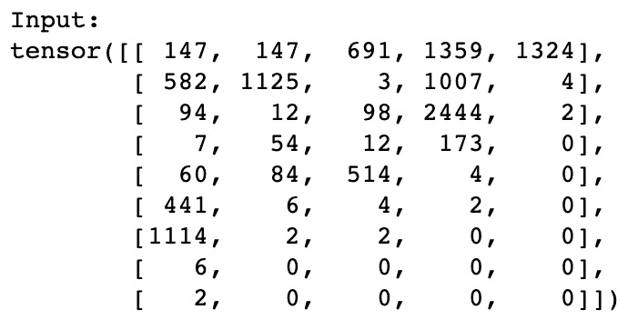
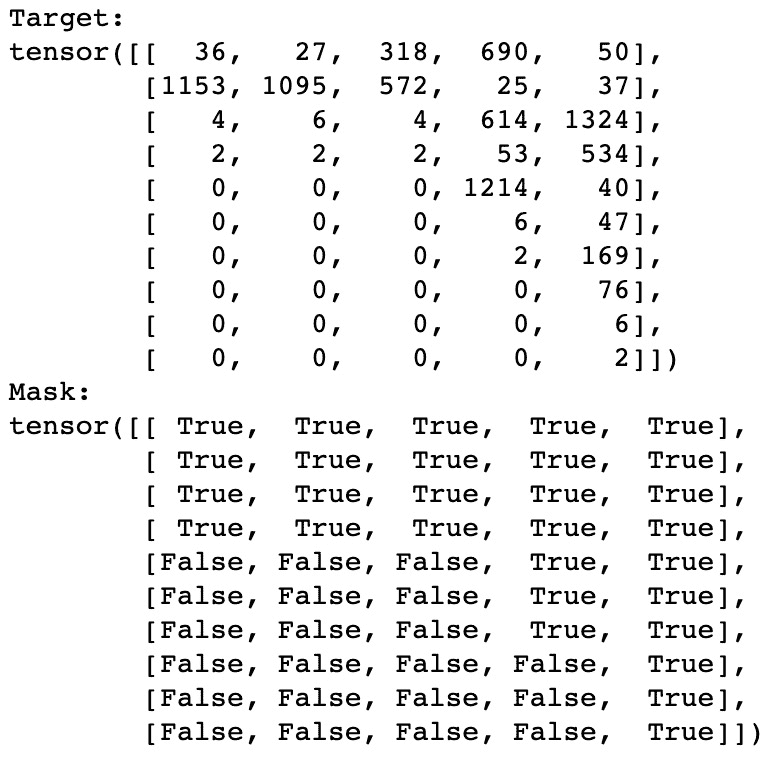
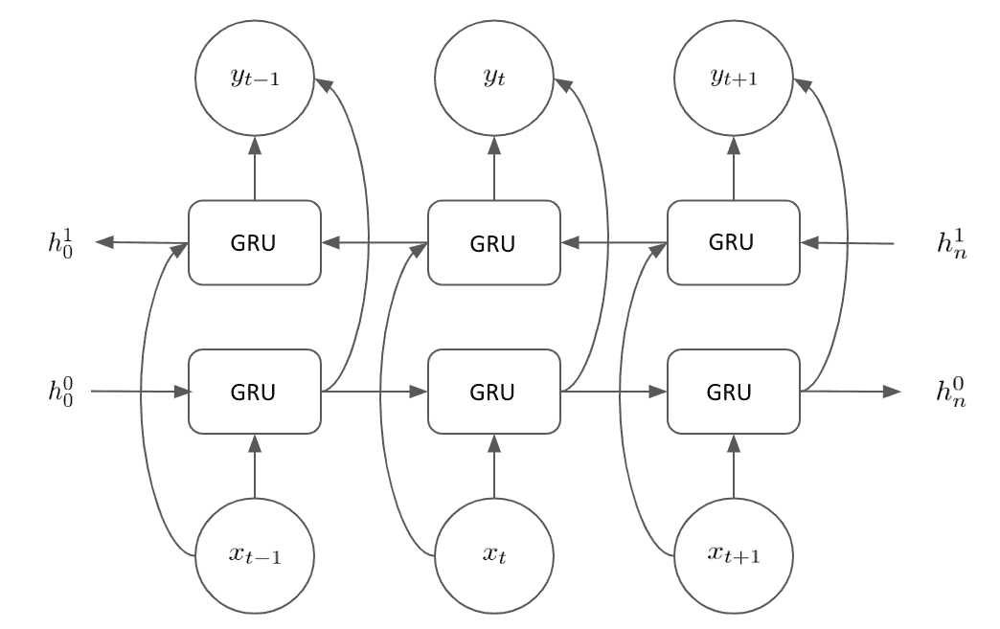

# “第 8 章”：使用基于注意力的神经网络构建聊天机器人

如果您曾经看过任何未来派科幻电影，那么您很有可能会看到与机器人的人类对话。 基于机器的情报一直是小说作品中的长期特征。 但是，由于 NLP 和深度学习的最新发展，与计算机的对话不再是幻想。 虽然我们可能距离真正的智能还很多年，在这种情况下，计算机能够以与人类相同的方式理解语言的含义，但机器至少能够进行基本的对话并提供基本的智能印象。

在上一章中，我们研究了如何构建序列到序列模型以将句子从一种语言翻译成另一种语言。 能够进行基本交互的对话型聊天机器人的工作方式几乎相同。 当我们与聊天机器人交谈时，我们的句子将成为模型的输入。 输出是聊天机器人选择回复的内容。 因此，我们正在训练它如何响应，而不是训练我们的聊天机器人来学习如何解释输入的句子。

我们将在上一章中扩展序列到序列模型，在模型中增加**注意力**。 对序列到序列模型的这种改进意味着我们的模型可以学习输入句子中要查找的位置以获得所需信息的方式，而不是使用整个输入句子决策。 这项改进使我们能够创建具有最先进性能的效率更高的序列到序列模型。

在本章中，我们将研究以下主题：

*   神经网络中的注意力理论
*   在神经网络内实现注意力以构建聊天机器人

# 技术要求

本章的所有代码都可以在[这个页面](https://github.com/PacktPublishing/Hands-On-Natural-Language-Processing-with-PyTorch-1.x)中找到。

# 神经网络中的注意力理论

在上一章中，在用于句子翻译的序列到序列模型中（没有引起注意），我们同时使用了编码器和解码器。 编码器从输入句子中获得了隐藏状态，这是我们句子的一种表示形式。 然后，解码器使用此隐藏状态执行转换步骤。 对此的基本图形说明如下：


图 8.1 –序列到序列模型的图形表示

但是，对整个隐藏状态进行解码不一定是使用此任务的最有效方法。 这是因为隐藏状态代表整个输入句子； 但是，在某些任务中（例如预测句子中的下一个单词），我们无需考虑输入句子的整体，而只考虑与我们要进行的预测相关的部分。 我们可以通过在序列到序列神经网络中使用注意力来证明这一点。 我们可以教导我们的模型仅查看输入的相关部分以进行预测，从而建立一个更加有效和准确的模型。

考虑以下示例：

```py
I will be traveling to Paris, the capital city of France, on the 2nd of March. My flight leaves from London Heathrow airport and will take approximately one hour.
```

假设我们正在训练一种模型来预测句子中的下一个单词。 我们可以先输入句子的开头：

```py
The capital city of France is _____.
```

在这种情况下，我们希望我们的模型能够检索单词`Paris`。 如果要使用基本的序列到序列模型，我们会将整个输入转换为隐藏状态，然后我们的模型将尝试从中提取相关信息。 这包括有关航班的所有无关信息。 您可能会在这里注意到，我们只需要查看输入句子的一小部分即可确定完成句子所需的相关信息：

```py
I will be traveling to Paris, the capital city of France, on the 2nd of March. My flight leaves from London Heathrow airport and will take approximately one hour.
```

因此，如果我们可以训练模型以仅使用输入句子中的相关信息，则可以做出更准确和相关的预测。 为此，我们可以在网络中实现**注意力**。

我们可以采用两种主要的注意力机制：局部和全局注意力。

## 比较本地和全局注意力

我们可以在网络中通过实现的两种注意形式与非常相似，但存在细微的关键区别。 我们将从关注本地开始。

在**局部注意力**中，我们的模型仅查看编码器的一些隐藏状态。 例如，如果我们正在执行句子翻译任务，并且我们正在计算翻译中的第二个单词，则模型可能希望仅查看与输入中第二个单词相关的编码器的隐藏状态 句子。 这意味着我们的模型需要查看编码器的第二个隐藏状态（`h2`），但也可能需要查看它之前的隐藏状态（`h1`）。

在下图中，我们可以在实践中看到这一点：


图 8.2 –本地注意力模型

我们首先从最终隐藏状态`h[n]`计算对齐位置`p[t]`。 这告诉我们需要进行观察才能发现哪些隐藏状态。 然后，我们计算局部权重并将其应用于隐藏状态，以确定上下文向量。 这些权重可能告诉我们，更多地关注最相关的隐藏状态（`h2`），而较少关注先前的隐藏状态（`h1`）。

然后，我们获取上下文向量，并将其转发给解码器以进行预测。 在我们基于非注意力的序列到序列模型中，我们只会向前传递最终的隐藏状态`h[n]`，但在这里我们看到的是，我们仅考虑了我们的相关隐藏状态 模型认为做出预测是必要的。

**全局注意力**模型的运作方式与非常相似。 但是，我们不仅要查看所有隐藏状态，还希望查看模型的所有隐藏状态，因此命名为全局。 我们可以在此处看到全局注意力层的图形化图示：


图 8.3 –全局注意力模型

我们在前面的图中可以看到，尽管这看起来与我们的本地关注框架非常相似，但是我们的模型现在正在查看所有隐藏状态，并计算所有隐藏状态的全局权重。 这使我们的模型可以查看它认为相关的输入句子的任何给定部分，而不必局限于由本地关注方法确定的本地区域。 我们的模型可能只希望看到一个很小的局部区域，但这在模型的能力范围内。 考虑全局注意力框架的一种简单方法是，它实质上是学习一个掩码，该掩码仅允许通过与我们的预测相关的隐藏状态：


图 8.4 –组合模型

我们在前面的图中可以看到，通过了解要注意的隐藏状态，我们的模型可以控制解码步骤中使用哪些状态来确定我们的预测输出。 一旦确定了要注意的隐藏状态，我们就可以使用多种不同的方法将它们组合在一起-通过连接或采用加权的点积。

# 注意使用序列到序列神经网络构建聊天机器人

准确说明如何在神经网络中实现注意力的最简单方法是通过示例。 现在，我们将使用应用了关注框架的序列到序列模型，完成从头构建聊天机器人的所有步骤。

与所有其他 NLP 模型一样，我们的第一步是获取并处理数据集以用于训练我们的模型。

## 正在获取我们的数据集

要训​​练我们的聊天机器人，我们需要一个会话数据集，模型可以通过该数据集学习如何响应。 我们的聊天机器人将接受一系列人工输入，并使用生成的句子对其进行响应。 因此，理想的数据集将由多行对话和适当的响应组成。 诸如此类任务的理想数据集将是来自两个人类用户之间的对话的实际聊天记录。 不幸的是，这些数据由私人信息组成，很难在公共领域获得，因此对于此任务，我们将使用电影脚本的数据集。

电影脚本由两个或更多角色之间的对话组成。 尽管此数据不是我们希望的自然格式，但我们可以轻松地将其转换为所需的格式。 以两个字符之间的简单对话为例：

*   **第 1 行**：`Hello Bethan.`
*   **第 2 行**：`Hello Tom, how are you?`
*   **第 3 行**：`I'm great thanks, what are you doing this evening?`
*   **第 4 行**：`I haven't got anything planned.`
*   **第 5 行**：`Would you like to come to dinner with me?`

现在，我们需要将其转换为调用和响应的输入和输出对，其中输入是脚本中的一行（调用），预期输出是脚本的下一行（响应）。 我们可以将`n`行的脚本转换为`n-1`对输入/输出：


图 8.5 –输入和输出表

我们可以使用这些输入/输出对来训练我们的网络，其中输入是人工输入的代理，而输出则是我们希望从模型中获得的响应。

建立模型的第一步是读取数据并执行所有必要的预处理步骤。

## 处理我们的数据集

幸运的是，为该示例提供的数据集已经被格式化，因此每行代表一个输入/输出对。 我们可以先读取其中的数据并检查一些行：

```py
corpus = "movie_corpus"
corpus_name = "movie_corpus"
datafile = os.path.join(corpus, "formatted_movie_lines.txt")
with open(datafile, 'rb') as file:
    lines = file.readlines()
    
for line in lines[:3]:
    print(str(line) + '\n')
```

打印以下结果：


图 8.6 –检查数据集

首先，您会注意到我们的行与预期的一样，因为第一行的下半部分成为下一行的前半部分。 我们还可以注意到，每行的通话和响应半部分由制表符分隔符（`\t`）分隔，我们的每行均由新的行分隔符（`\n`）。 在处理数据集时，我们必须考虑到这一点。

第一步是创建一个词汇表或语料库，其中包含我们数据集中的所有唯一单词。

## 创建词汇

过去，我们的语料库由几个词典组成，这些词典由我们的语料库中的唯一单词以及在单词和索引之间的查找组成。 但是，我们可以通过创建一个包含所有必需元素的词汇表类，以一种更为优雅的方式来实现此目的：

1.  我们先创建`Vocabulary`类。我们用空字典--`word2index`和`word2count`来初始化这个类。我们还用填充标记的占位符以及**句子开始**（**SOS**）和**句子结束**（**EOS**）标记初始化了`index2word`字典。我们也会对词汇中的单词数量进行统计（首先是 3 个，因为我们的语料库已经包含了上述三个标记）。这些是一个空词汇的默认值，但是，当我们读入数据时，它们会被填充。

    ```py
    PAD_token = 0
    SOS_token = 1
    EOS_token = 2
    class Vocabulary:
        def __init__(self, name):
            self.name = name
            self.trimmed = False
            self.word2index = {}
            self.word2count = {}
            self.index2word = {PAD_token: "PAD", SOS_token:                           "SOS", EOS_token: "EOS"}
            self.num_words = 3
    ```

2.  接下来，我们创建我们将用来填充词汇的函数。`addWord`接收一个单词作为输入。如果这是个新词，还没有在我们的词汇中，我们就把这个词添加到我们的索引中，把这个词的计数设为 1，并把我们词汇中的总词数递增 1。如果这个词已经在我们的词汇中，我们只需将这个词的数量增加 1。

    ```py
    def addWord(self, w):
        if w not in self.word2index:
            self.word2index[w] = self.num_words
            self.word2count[w] = 1
            self.index2word[self.num_words] = w
            self.num_words += 1
        else:
            self.word2count[w] += 1
    ```

3.  我们还使用`addSentence`函数将`addWord`函数应用于给定句子中的所有单词。

    ```py
    def addSentence(self, sent):
        for word in sent.split(' '):
            self.addWord(word)
    ```

    我们可以做的加快模型训练的一件事是减少词汇量。 这意味着任何嵌入层都将更小，并且模型中学习的参数总数会更少。 一种简单的方法是从我们的词汇表中删除所有低频词。 在我们的数据集中仅出现一次或两次的任何单词都不太可能具有巨大的预测能力，因此在最终模型中将它们从语料库中删除并替换为空白标记可以减少我们训练模型所需的时间并减少过拟合而无需 对我们模型的预测有很大的负面影响。

4.  为了从词汇中删除低频词，我们可以实现一个`trim`函数。该函数首先循环浏览单词计数词典，如果该单词的出现次数大于所需的最小计数，则将其追加到一个新的列表中。

    ```py
    def trim(self, min_cnt):
        if self.trimmed:
            return
        self.trimmed = True
        words_to_keep = []
        for k, v in self.word2count.items():
            if v >= min_cnt:
                words_to_keep.append(k)
        print('Words to Keep: {} / {} = {:.2%}'.format(
            len(words_to_keep), len(self.word2index),    
            len(words_to_keep) / len(self.word2index)))
    ```

5.  最后，我们的索引从新的`words_to_keep`列表中重建。我们将所有的索引设置为初始的空值，然后通过`addWord`函数循环浏览我们保留的单词来重新填充它们。

    ```py
    self.word2index = {}
        self.word2count = {}
        self.index2word = {PAD_token: "PAD",\
                           SOS_token: "SOS",\
                           EOS_token: "EOS"}
        self.num_words = 3
        for w in words_to_keep:
            self.addWord(w)
    ```

现在，我们已经定义了一个词汇类，可以很容易地用我们的输入句子填充。 接下来，我们实际上需要加载数据集以创建训练数据。

## 加载数据

我们将通过以下步骤开始加载数据：

1.  读取我们的数据的第一步是执行任何必要的步骤来清理数据，使其更易于人类阅读。我们首先将数据从 Unicode 转换为 ASCII 格式。我们可以很容易地使用一个函数来完成这个工作。

    ```py
    def unicodeToAscii(s):
        return ''.join(
            c for c in unicodedata.normalize('NFD', s)
            if unicodedata.category(c) != 'Mn'
        )
    Next, we want to process our input s
    ```

2.  接下来，我们要处理我们的输入字符串，使它们都是小写的，除了最基本的字符外，不包含任何尾部的空格或标点符号。我们可以通过使用一系列的正则表达式来实现。

    ```py
    def cleanString(s):
        s = unicodeToAscii(s.lower().strip())
        s = re.sub(r"([.!?])", r" \1", s)
        s = re.sub(r"[^a-zA-Z.!?]+", r" ", s)
        s = re.sub(r"\s+", r" ", s).strip()
        return s
    ```

3.  最后，我们在一个更广泛的函数--`readVocs`中应用这个函数。这个函数将我们的数据文件读成行，然后将`cleanString`函数应用到每一行。它还创建了一个我们前面创建的`Vocabulary`类的实例，这意味着这个函数同时输出我们的数据和词汇。

    ```py
    def readVocs(datafile, corpus_name):
        lines = open(datafile, encoding='utf-8').\
            read().strip().split('\n')
        pairs = [[cleanString(s) for s in l.split('\t')]               for l in lines]
        voc = Vocabulary(corpus_name)
        return voc, pairs
    ```

    接下来，我们根据输入对的最大长度对其进行过滤。 再次这样做是为了减少我们模型的潜在维数。 预测数百个单词长的句子将需要非常深的架构。 为了节省训练时间，我们希望将此处的训练数据限制为输入和输出少于 10 个字长的实例。

4.  为此，我们创建了几个过滤函数。第一个函数，`filterPair`，根据当前行的输入和输出长度是否小于最大长度，返回一个布尔值。我们的第二个函数`filterPairs`，简单地将此条件应用于数据集中的所有对，只保留满足此条件的对。

    ```py
    def filterPair(p, max_length):
        return len(p[0].split(' ')) < max_length and len(p[1].split(' ')) < max_length
    def filterPairs(pairs, max_length):
        return [pair for pair in pairs if filterPair(pair, max_length)]
    ```

5.  现在，我们只需要创建一个最后的函数，应用我们之前整理的所有函数，并运行它来创建我们的词汇和数据对。

    ```py
    def loadData(corpus, corpus_name, datafile, save_dir, max_length):
        voc, pairs = readVocs(datafile, corpus_name)
        print(str(len(pairs)) + " Sentence pairs")
        pairs = filterPairs(pairs,max_length)
        print(str(len(pairs))+ " Sentence pairs after trimming")
        for p in pairs:
            voc.addSentence(p[0])
            voc.addSentence(p[1])
        print(str(voc.num_words) + " Distinct words in vocabulary")
        return voc, pairs
    max_length = 10
    voc, pairs = loadData(corpus, corpus_name, datafile, max_length)
    ```

    我们可以看到我们的输入数据集包含超过 200,000 对。 当我们将其过滤为输入和输出长度均少于 10 个单词的句子时，这将减少为仅由 18,000 个不同单词组成的 64,000 对：

    

    图 8.7 –数据集中句子的值

6.  我们可以打印我们处理过的输入/输出对中的一部分，以验证我们的函数是否全部正确工作。

    ```py
    print("Example Pairs:")
    for pair in pairs[-10:]:
        print(pair)
    ```

    生成以下输出：


图 8.8 –处理后的输入/输出对

看来我们已经成功地将数据集分为输入和输出对，可以在上面训练网络。

最后，在开始构建模型之前，我们必须从语料库和数据对中删除稀有词。

## 删除稀有词

如前所述，仅在数据集中出现几次的单词会增加模型的维数，从而增加模型的复杂度以及训练模型所需的时间。 因此，最好将其从我们的训练数据中删除，以使我们的模型尽可能简化和高效。

您可能还记得我们在词汇表中内置了`trim`函数，这使我们能够从词汇表中删除不经常出现的单词。 现在，我们可以创建一个函数来删除这些稀有单词，并从词汇表中调用`trim`方法，这是我们的第一步。 您将看到，这从我们的词汇表中删除了大部分单词，这表明我们词汇表中的大多数单词很少出现。 这是可以预期的，因为任何语言模型中的单词分布都会遵循长尾分布。 我们将使用以下步骤删除单词：

1.  我们首先要计算出我们将保留在模型中的词的百分比。

    ```py
    def removeRareWords(voc, all_pairs, minimum):
        voc.trim(minimum)
    ```

    结果为以下输出：

    

    图 8.9 –要保留的单词百分比

2.  在这个函数中，我们循环检查输入和输出句子中的所有单词。如果对于一个给定的对子，无论是输入句还是输出句都有一个不在我们新修剪的语料中的单词，我们就从我们的数据集中删除这个对子。我们打印输出结果，发现即使我们放弃了一半以上的词汇，也只放弃了 17% 左右的训练对。这再次反映了我们的词汇语料库是如何分布在我们的各个训练对上的。

    ```py
    pairs_to_keep = []
    for p in all_pairs:
        keep = True
        for word in p[0].split(' '):
            if word not in voc.word2index:
                keep = False
                break
        for word in p[1].split(' '):
            if word not in voc.word2index:
                keep = False
                break
        if keep:
            pairs_to_keep.append(p)
    print("Trimmed from {} pairs to {}, {:.2%} of total".\
           format(len(all_pairs), len(pairs_to_keep),
                  len(pairs_to_keep)/ len(all_pairs)))
    return pairs_to_keep
    minimum_count = 3
    pairs = removeRareWords(voc, pairs, minimum_count)
    ```

    结果为以下输出：


图 8.10 –构建数据集后的最终值

现在我们有了完成的数据集，我们需要构建一些函数，将我们的数据集转换为成批的张量，然后将它们传递给模型。

## 将句子对转换为张量

我们知道我们的模型不会将原始文本作为输入，而是将句子的张量表示作为输入。 我们也不会一一处理句子，而是分批量。 为此，我们需要将输入和输出语句都转换为张量，其中张量的宽度表示我们希望在其上训练的批量的大小：

1.  我们首先创建几个辅助函数，用来将我们的词对转化为时序。我们首先创建一个`indexFromSentence`函数，它从词汇中抓取句子中每个单词的索引，并在句尾附加一个 EOS 标记。

    ```py
    def indexFromSentence(voc, sentence):
        return [voc.word2index[word] for word in\
                sent.split(' ')] + [EOS_token]
    ```

2.  其次，我们创建了一个`zeroPad`函数，它可以将任何张量用零来填充，这样张量中的所有句子实际上都是相同的长度。

    ```py
    def zeroPad(l, fillvalue=PAD_token):
        return list(itertools.zip_longest(*l,\
                    fillvalue=fillvalue))
    ```

3.  然后，为了生成我们的输入张量，我们应用这两个函数。首先，我们得到我们输入句子的指数，然后应用填充，然后将输出转化为`LongTensor`。我们还将获得我们每个输入句子的长度输出这个作为一个张量。

    ```py
    def inputVar(l, voc):
        indexes_batch = [indexFromSentence(voc, sentence)\
                         for sentence in l]
        padList = zeroPad(indexes_batch)
        padTensor = torch.LongTensor(padList)
        lengths = torch.tensor([len(indexes) for indexes in indexes_batch])
        return padTensor, lengths
    ```

4.  在我们的网络中，我们的填充标记一般应该被忽略。我们不想在这些填充的标记上训练我们的模型，所以我们创建一个布尔掩码来忽略这些标记。为此，我们使用`getMask`函数，将其应用到我们的输出张量上。如果输出由一个词组成，则返回`1`，如果由一个填充标记组成，则返回`0`。

    ```py
    def getMask(l, value=PAD_token):
        m = []
        for i, seq in enumerate(l):
            m.append([])
            for token in seq:
                if token == PAD_token:
                    m[i].append(0)
                else:
                    m[i].append(1)
        return m
    ```

5.  然后我们将其应用于`outputVar`函数。这和`inputVar`函数是一样的，只是除了有索引的输出张量和长度张量之外，我们还返回输出张量的布尔掩码。这个布尔掩码只是在输出张量内有词时返回`True`，有填充标记时返回`False`。我们还返回输出张量中句子的最大长度。

    ```py
    def outputVar(l, voc):
        indexes_batch = [indexFromSentence(voc, sentence)
                         for sentence in l]
        max_target_len = max([len(indexes) for indexes in
                              indexes_batch])
        padList = zeroPad(indexes_batch)
        mask = torch.BoolTensor(getMask(padList))
        padTensor = torch.LongTensor(padList)
        return padTensor, mask, max_target_len
    ```

6.  最后，为了同时创建我们的输入和输出批次，我们循环浏览批次中的对，并使用之前创建的函数为两个对创建输入和输出时序。然后我们返回所有必要的变量。

    ```py
    def batch2Train(voc, batch):
        batch.sort(key=lambda x: len(x[0].split(" ")),\
                   reverse=True)
        
        input_batch = []
        output_batch = []
        
        for p in batch:
            input_batch.append(p[0])
            output_batch.append(p[1])
            
        inp, lengths = inputVar(input_batch, voc)
        output, mask, max_target_len = outputVar(output_batch, voc)
        
        return inp, lengths, output, mask, max_target_len
    ```

7.  这个函数应该是我们将训练对转化为训练模型所需的全部内容。我们可以通过在随机选择的数据上执行`batch2Train`函数的单次迭代来验证这个函数是否正确。我们将我们的批次大小设置为`5`，然后运行一次。

    ```py
    test_batch_size = 5
    batches = batch2Train(voc, [
        random.choice(pairs) 
        for _ in range(test_batch_size)
    ])
    input_variable, lengths, target_variable, mask, max_target_len = batches
    ```

    在这里，我们可以验证输入张量是否已正确创建。 注意句子如何以填充（0 个标记）结尾，其中句子长度小于张量的最大长度（在本例中为 9）。 张量的宽度也对应于批量大小（在这种情况下为 5）：



图 8.11 –输入张量

我们还可以验证相应的输出数据和掩码。 请注意，掩码中的**假**值如何与输出张量中的填充标记（零）重叠：



图 8.12 –目标和模板张量

现在我们已获取，清理和转换了数据，我们准备开始训练基于注意力的模型，该模型将成为聊天机器人的基础。

## 构建模型

与其他序列到序列模型一样，我们通过创建编码器开始。 这会将输入句子的初始张量表示转换为隐藏状态。

### 构造编码器

现在，我们将通过以下步骤创建编码器：

1.  与我们所有的 PyTorch 模型一样，我们首先创建一个`Encoder`类，该类继承自`nn.Module`。这里的所有元素看起来都应该和前面章节中使用的元素一样熟悉。

    ```py
    class EncoderRNN(nn.Module):
        def __init__(self, hidden_size, embedding,\
                     n_layers=1, dropout=0):
            super(EncoderRNN, self).__init__()
            self.n_layers = n_layers
            self.hidden_size = hidden_size
            self.embedding = embedding
    ```

    接下来，我们创建我们的**循环神经网络**（**RNN**）模块。 在此聊天机器人中，我们将使用**门控循环单元**（**GRU**）代替我们之前看到的**长短期记忆**（**LSTM**）模型。 尽管 GRU 仍然控制通过 RNN 的信息流，但其的复杂度比 LSTM 小，但它们没有像 LSTM 这样的单独的门和更新门。 我们在这种情况下使用 GRU 的原因有几个：

    a）由于需要学习的参数较少，因此 GRU 已被证明具有更高的计算效率。 这意味着我们的模型使用 GRU 进行训练要比使用 LSTM 进行训练更快。

    b）已证明 GRU 在短数据序列上具有与 LSTM 相似的性能水平。 当学习更长的数据序列时，LSTM 更有用。 在这种情况下，我们仅使用 10 个单词或更少的输入句子，因此 GRU 应该产生相似的结果。

    c）事实证明，GRU 在学习小型数据集方面比 LSTM 更有效。 由于我们的训练数据的规模相对于我们要学习的任务的复杂性而言较小，因此我们应该选择使用 GRU。

2.  现在我们定义我们的 GRU，考虑到输入的大小，层数，以及是否应该实现丢弃。

    ```py
    self.gru = nn.GRU(hidden_size, hidden_size, n_layers,
                      dropout=(0 if n_layers == 1 else dropout), 
                      bidirectional=True)
    ```

    注意这里我们如何在模型中实现双向性。 您会从前面的章节中回顾到，双向 RNN 允许我们学习从句子向前移动到句子之间以及向后顺序移动的句子。 这使我们可以更好地捕获句子中每个单词相对于前后单词的上下文。 GRU 中的双向性意味着我们的编码器如下所示：

    

    图 8.13 –编码器布局

    我们在输入句子中保持两个隐藏状态以及每一步的输出。

3.  接下来，我们需要为我们的编码器创建一个正向传递。我们首先将输入句子嵌入，然后使用`pack_padded_sequence`函数对我们的嵌入进行处理。这个函数对我们的填充序列进行 "打包"，使我们所有的输入都具有相同的长度。然后，我们将打包后的序列通过 GRU 传递出去，进行前向传递。

    ```py
    def forward(self, input_seq, input_lengths, hidden=None):
        embedded = self.embedding(input_seq)
        packed = nn.utils.rnn.pack_padded_sequence(embedded,
                                          input_lengths)
        outputs, hidden = self.gru(packed, hidden)
    ```

4.  在这之后，我们解包我们的填充并对 GRU 输出进行求和。然后，我们可以返回这个加和后的输出，以及我们最终的隐藏状态，来完成我们的前向传递。

    ```py
    outputs, _ = nn.utils.rnn.pad_packed_sequence(outputs)
    outputs = outputs[:, :, :self.hidden_size] + a \
              outputs[:, : ,self.hidden_size:]
    return outputs, hidden
    ```

现在，我们将在下一部分继续创建关注模块。

### 构建注意力模块

接下来，我们需要构建我们的注意力模块，该模块将应用于我们的编码器，以便我们可以从编码器输出的相关部分中学习。 我们将按照以下方式进行：

1.  首先为注意力模型创建一个类。

    ```py
    class Attn(nn.Module):
        def __init__(self, hidden_size):
            super(Attn, self).__init__()
            self.hidden_size = hidden_size
    ```

2.  然后，在这个类中创建`dot_score`函数。这个函数简单地计算我们的编码器输出与我们的编码器输出的隐藏状态的点积。虽然还有其他的方法可以将这两个张量转化为单一的表示方式，但使用点积是最简单的方法之一。

    ```py
    def dot_score(self, hidden, encoder_output):
        return torch.sum(hidden * encoder_output, dim=2)
    ```

3.  然后，我们在前传内使用这个函数。首先，根据`dot_score`方法计算注意力权重/能量，然后对结果进行转置，并返回 softmax 变换后的概率分数。

    ```py
    def forward(self, hidden, encoder_outputs):
        attn_energies = self.dot_score(hidden, \
                                       encoder_outputs)
        attn_energies = attn_energies.t()
        return F.softmax(attn_energies, dim=1).unsqueeze(1)
    ```

接下来，我们可以在解码器中使用此关注模块来创建关注焦点的解码器。

### 构造解码器

我们现在将构造解码器，如下所示：

1.  我们首先创建`DecoderRNN`类，继承自`nn.Module`并定义初始化参数。

    ```py
    class DecoderRNN(nn.Module):
        def __init__(self, embedding, hidden_size, \
                     output_size, n_layers=1, dropout=0.1):
            super(DecoderRNN, self).__init__()
            self.hidden_size = hidden_size
            self.output_size = output_size
            self.n_layers = n_layers
            self.dropout = dropout
    ```

2.  然后我们在这个模块中创建我们的层。我们将创建一个嵌入层和一个相应的丢弃层。我们再次为我们的解码器使用 GRU；但是，这次我们不需要使我们的 GRU 层成为双向的，因为我们将依次对编码器的输出进行解码。我们还将创建两个线性层--一个是用于计算我们的输出的常规层，另一个是可用于连接的层。这个层的宽度是常规隐藏层的两倍，因为它将用于两个连通向量，每个向量的长度为`hidden_size`。我们还初始化了上一节中的注意力模块的一个实例，以便能够在我们的`Decoder`类中使用它。

    ```py
    self.embedding = embedding
    self.embedding_dropout = nn.Dropout(dropout)
    self.gru = nn.GRU(hidden_size, hidden_size, n_layers, dropout=(0 if n_layers == 1 else dropout))
    self.concat = nn.Linear(2 * hidden_size, hidden_size)
    self.out = nn.Linear(hidden_size, output_size)
    self.attn = Attn(hidden_size)
    ```

3.  在定义了所有的层之后，我们需要为解码器创建一个前向通道。请注意前向通证将如何一步一步（单词）地使用。我们首先得到当前输入词的嵌入，然后通过 GRU 层进行前向通证，得到我们的输出和隐藏状态。

    ```py
    def forward(self, input_step, last_hidden, encoder_outputs):
        embedded = self.embedding(input_step)
        embedded = self.embedding_dropout(embedded)
        rnn_output, hidden = self.gru(embedded, last_hidden)
    ```

4.  接下来，我们使用注意力模块从 GRU 输出中获取注意力权重。然后将这些权重与编码器输出相乘，从而有效地得到我们的注意力权重和编码器输出的加权和。

    ```py
    attn_weights = self.attn(rnn_output, encoder_outputs)
    context = attn_weights.bmm(encoder_outputs.transpose(0, 1))
    ```

5.  然后，我们将加权上下文向量与 GRU 的输出相连接，并应用`tanh`函数得到最终的连接输出。

    ```py
    rnn_output = rnn_output.squeeze(0)
    context = context.squeeze(1)
    concat_input = torch.cat((rnn_output, context), 1)
    concat_output = torch.tanh(self.concat(concat_input))
    ```

6.  对于我们解码器内的最后一步，我们只需使用这个最终的连通输出来预测下一个词，并应用一个 **softmax** 函数。前向传递最后会返回这个输出，以及最终的隐藏状态。这个前向通证将被迭代，下一个前向通证将使用句子中的下一个词和这个新的隐藏状态。

    ```py
    output = self.out(concat_output)
    output = F.softmax(output, dim=1)
    return output, hidden
    ```

现在我们已经定义了模型，我们准备定义训练过程

## 定义训练过程

训练过程的第一步是为我们的模型定义损失的度量。 由于我们的输入张量可能由填充序列组成，由于我们输入的句子都具有不同的长度，因此我们不能简单地计算真实输出和预测输出张量之间的差。 为了解决这个问题，我们将定义一个损失函数，该函数将布尔掩码应用于输出，并且仅计算未填充令牌的损失：

1.  在下面的函数中，我们可以看到，我们计算的是整个输出张量的交叉熵损失。然而，为了得到总损失，我们只对被布尔掩码选中的张量元素进行平均。

    ```py
    def NLLMaskLoss(inp, target, mask):
        TotalN = mask.sum()
        CELoss = -torch.log(
            torch.gather(inp, 1, target.view(-1, 1)).squeeze(1))
        loss = CELoss.masked_select(mask).mean()
        loss = loss.to(device)
        return loss, TotalN.item()
    ```

2.  对于我们的大部分训练，我们需要两个主要函数--一个函数`train()`，它对我们的单批训练数据进行训练，另一个函数`trainIters()`，它遍历我们的整个数据集，并对每个单独的批次调用`train()`。我们先定义`train()`，以便对单批数据进行训练。创建`train()`函数，然后让梯度为 0，定义设备选项，并初始化变量。

    ```py
    def train(input_variable, lengths, target_variable,\
              mask, max_target_len, encoder, decoder,\
              embedding, encoder_optimizer,\
              decoder_optimizer, batch_size, clip,\
              max_length=max_length):
        encoder_optimizer.zero_grad()
        decoder_optimizer.zero_grad()
        input_variable = input_variable.to(device)
        lengths = lengths.to(device)
        target_variable = target_variable.to(device)
        mask = mask.to(device)
        loss = 0
        print_losses = []
        n_totals = 0
    ```

3.  然后，通过编码器执行输入和序列长度的正向传递，得到输出和隐藏状态。

    ```py
    encoder_outputs, encoder_hidden = encoder(input_variable, lengths)
    ```

4.  接下来，我们创建我们的初始解码器输入，从每个句子的 SOS 标记开始。然后我们将解码器的初始隐藏状态设置为与编码器的状态相等。

    ```py
    decoder_input = torch.LongTensor(
        [[SOS_token for _ in range(batch_size)]])
    decoder_input = decoder_input.to(device)
    decoder_hidden = encoder_hidden[:decoder.n_layers]
    ```

    接下来，我们实施教师强迫。 如果您从上一章的老师强迫中回想起，当以给定的概率生成输出序列时，我们将使用真正的上一个输出标记而不是预测的上一个输出标记来生成输出序列中的下一个单词。 使用教师强制可以帮助我们的模型更快收敛。 但是，我们必须小心，不要使教师强迫率过高，否则我们的模型将过于依赖教师强迫，并且不会学会独立产生正确的输出。

5.  确定我们是否应该对当前步骤使用教师强制。

    ```py
    use_TF = True if random.random() < teacher_forcing_ratio else False
    ```

6.  然后，如果我们确实需要实现教师强制，请运行以下代码。我们将每一个序列批次通过解码器来获得我们的输出。然后，我们将下一个输入设置为真实输出（**目标**）。最后，我们使用我们的损失函数计算和累积损失，并将其打印到控制台。

    ```py
    for t in range(max_target_len):
    decoder_output, decoder_hidden = decoder(
      decoder_input, decoder_hidden, encoder_outputs)
    decoder_input = target_variable[t].view(1, -1)
    mask_loss, nTotal = NLLMaskLoss(decoder_output, \
         target_variable[t], mask[t])
    loss += mask_loss
    print_losses.append(mask_loss.item() * nTotal)
    n_totals += nTotal
    ```

7.  如果我们不对给定的批次实施教师强迫，程序几乎是相同的。但是，我们不使用真实输出作为序列的下一个输入，而是使用模型生成的输出。

    ```py
    _, topi = decoder_output.topk(1)
    decoder_input = torch.LongTensor([[topi[i][0] for i in \
                                       range(batch_size)]])
    decoder_input = decoder_input.to(device)
    ```

8.  最后，与我们所有的模型一样，最后的步骤是执行反向传播，实现梯度剪接，并通过我们的编码器和解码器优化器来使用梯度下降更新权重。请记住，我们剪掉梯度是为了防止梯度消失/爆炸的问题，这在前面的章节中已经讨论过。最后，我们的训练步骤返回我们的平均损失。

    ```py
    loss.backward()
    _ = nn.utils.clip_grad_norm_(encoder.parameters(), clip)
    _ = nn.utils.clip_grad_norm_(decoder.parameters(), clip)
    encoder_optimizer.step()
    decoder_optimizer.step()
    return sum(print_losses) / n_totals
    ```

9.  接下来，如前所述，我们需要创建`trainIters()`函数，它在不同批次的输入数据上反复调用我们的训练函数。我们首先使用之前创建的`batch2Train`函数将我们的数据分成若干批次。

    ```py
    def trainIters(model_name, voc, pairs, encoder, decoder,\
                   encoder_optimizer, decoder_optimizer,\
                   embedding, encoder_n_layers, \
                   decoder_n_layers, save_dir, n_iteration,\
                   batch_size, print_every, save_every, \
                   clip, corpus_name, loadFilename):
        training_batches = [batch2Train(voc,\
                           [random.choice(pairs) for _ in\
                            range(batch_size)]) for _ in\
                            range(n_iteration)]
    ```

0.  然后，我们创建一些变量，使我们能够计算迭代次数，并跟踪每个时代的总损失。

    ```py
    print('Starting ...')
    start_iteration = 1
    print_loss = 0
    if loadFilename:
        start_iteration = checkpoint['iteration'] + 1
    ```

1.  接下来，我们定义我们的训练循环。对于每次迭代，我们从我们的批次列表中得到一个训练批次。然后，我们从我们的批次中提取相关字段，并使用这些参数运行一次训练迭代。最后，我们将这个批次的损失加入到我们的总体损失中。

    ```py
    print("Beginning Training...")
    for iteration in range(start_iteration, n_iteration + 1):
        training_batch = training_batches[iteration - 1]
        input_variable, lengths, target_variable, mask, \
              max_target_len = training_batch
        loss = train(input_variable, lengths,\
                     target_variable, mask, max_target_len,\
                     encoder, decoder, embedding, \
                     encoder_optimizer, decoder_optimizer,\
                     batch_size, clip)
        print_loss += loss
    ```

2.  在每一次迭代中，我们还确保打印出迄今为止的进度，跟踪我们已经完成了多少次迭代，以及每个纪元的损失是多少。

    ```py
    if iteration % print_every == 0:
        print_loss_avg = print_loss / print_every
        print("Iteration: {}; Percent done: {:.1f}%;\
        Mean loss: {:.4f}".format(iteration,
                              iteration / n_iteration \
                              * 100, print_loss_avg))
        print_loss = 0
    ```

3.  为了完成，我们还需要在每隔几个纪元后保存我们的模型状态。这让我们可以重新审视我们已经训练过的任何历史模型；例如，如果我们的模型开始过拟合，我们可以恢复到早期的迭代。

    ```py
    if (iteration % save_every == 0):
        directory = os.path.join(save_dir, model_name,\
                                 corpus_name, '{}-{}_{}'.\
                                 format(encoder_n_layers,\
                                 decoder_n_layers, \
                                 hidden_size))
                if not os.path.exists(directory):
                    os.makedirs(directory)
                torch.save({
                    'iteration': iteration,
                    'en': encoder.state_dict(),
                    'de': decoder.state_dict(),
                    'en_opt': encoder_optimizer.state_dict(),
                    'de_opt': decoder_optimizer.state_dict(),
                    'loss': loss,
                    'voc_dict': voc.__dict__,
                    'embedding': embedding.state_dict()
                }, os.path.join(directory, '{}_{}.tar'.format(iteration, 'checkpoint')))
    ```

现在已经完成了开始训练模型的所有必要步骤，我们需要创建函数以允许我们评估模型的性能。

## 定义评估过程

评估聊天机器人与评估其他序列到序列模型略有不同。 在我们的文本翻译任务中，英语句子将直接翻译成德语。 虽然可能有多种正确的翻译，但在大多数情况下，只有一种正确的翻译可以将一种语言翻译成另一种语言。

对于聊天机器人，有多个不同的有效输出。 从与聊天机器人进行的一些对话中获取以下三行内容：

**输入**：`Hello`

**输出**：`Hello`

**输入**：`Hello`

**输出**：`Hello. How are you?`

**输入**：`Hello`

**输出**：`What do you want?`

在这里，我们有三个不同的响应，每个响应都同样有效。 因此，在与聊天机器人进行对话的每个阶段，都不会出现任何“正确”的响应。 因此，评估要困难得多。 测试聊天机器人是否产生有效输出的最直观方法是与之对话！ 这意味着我们需要以一种使我们能够与其进行对话以确定其是否运行良好的方式来设置聊天机器人：

1.  我们首先要定义一个类，让我们能够对编码输入进行解码并生成文本。我们通过使用所谓的`GreedyEncoder`来实现这一目标。这简单地说，在解码器的每一步，我们的模型都将预测概率最高的词作为输出。我们先用预先训练好的编码器和解码器初始化`GreedyEncoder`类。

    ```py
    class GreedySearchDecoder(nn.Module):
        def __init__(self, encoder, decoder):
            super(GreedySearchDecoder, self).__init__()
            self.encoder = encoder
            self.decoder = decoder
    ```

2.  接下来，为我们的解码器定义一个正向传递。我们将输入通过编码器得到我们编码器的输出和隐藏状态。我们把编码器的最后一个隐藏层作为解码器的第一个隐藏输入。

    ```py
    def forward(self, input_seq, input_length, max_length):
        encoder_outputs, encoder_hidden = \
                        self.encoder(input_seq, input_length)
        decoder_hidden = encoder_hidden[:decoder.n_layers]
    ```

3.  然后，用 SOS 令牌创建解码器输入，并初始化附加解码词的令牌（初始化为单个零值）。

    ```py
    decoder_input = torch.ones(1, 1, device=device, dtype=torch.long) * SOS_token
    all_tokens = torch.zeros([0], device=device, dtype=torch.long)
    all_scores = torch.zeros([0], device=device)
    ```

4.  之后，对序列进行迭代，每次解码一个词。我们对编码器进行正向传递，并添加一个`max`函数，以获得得分最高的预测词及其得分，然后将其追加到`all_tokens`和`all_scores`变量中。最后，我们将这个预测的标记作为我们解码器的下一个输入。在整个序列被迭代过后，我们返回完整的预测句。

    ```py
    for _ in range(max_length):
        decoder_output, decoder_hidden = self.decoder\
            (decoder_input, decoder_hidden, encoder_outputs)
        decoder_scores, decoder_input = \
             torch.max (decoder_output, dim=1)
        all_tokens = torch.cat((all_tokens, decoder_input),\
                                dim=0)
        all_scores = torch.cat((all_scores, decoder_scores),\
                                dim=0)
        decoder_input = torch.unsqueeze(decoder_input, 0)
    return all_tokens, all_scores
    ```

    所有的部分都开始融合在一起。 我们具有已定义的训练和评估功能，因此最后一步是编写一个功能，该功能实际上会将我们的输入作为文本，将其传递给我们的模型，并从模型中获取响应。 这将是我们聊天机器人的“界面”，我们实际上在那里进行对话。

5.  我们首先定义一个`evaluate()`函数，它接受我们的输入函数并返回预测的输出词汇。我们首先使用我们的词汇将输入句子转化为指数。然后，我们获得这些句子中每个句子的长度的张量，并对其进行转置。

    ```py
    def evaluate(encoder, decoder, searcher, voc, sentence,\
                 max_length=max_length):
        indices = [indexFromSentence(voc, sentence)]
        lengths = torch.tensor([len(indexes) for indexes \
                                in indices])
        input_batch = torch.LongTensor(indices).transpose(0, 1)
    ```

6.  然后，我们将我们的长度和输入时序分配给相关设备。接下来，通过搜索器（`GreedySearchDecoder`）运行输入，以获得预测输出的词索引。最后，我们将这些词索引转化回词令牌，再作为函数输出返回。

    ```py
    input_batch = input_batch.to(device)
    lengths = lengths.to(device)
    tokens, scores = searcher(input_batch, lengths, \
                              max_length)
    decoded_words = [voc.index2word[token.item()] for \
                     token in tokens]
    return decoded_words
    ```

7.  最后，我们创建一个`runchatbot`函数，作为我们聊天机器人的接口。这个函数接受人类输入的信息并打印聊天机器人的响应。我们将这个函数创建为一个`while`循环，一直到我们终止该函数或输入`quit`为止。

    ```py
    def runchatbot(encoder, decoder, searcher, voc):
        input_sentence = ''
        while(1):
            try:
                input_sentence = input('> ')
                if input_sentence == 'quit': break
    ```

8.  然后，我们将输入的类型化输入进行归一化处理，再将归一化输入传给我们的`evaluate()`函数，该函数返回聊天机器人的预测词。

    ```py
    input_sentence = cleanString(input_sentence)
    output_words = evaluate(encoder, decoder, searcher,\
                            voc, input_sentence)
    ```

9.  最后，我们将这些输出词进行格式化，忽略 EOS 和填充标记，然后再打印聊天机器人的响应。因为这是一个`while`循环，这让我们可以无限期地继续与聊天机器人对话。

```py
output_words[:] = [x for x in output_words if \
                   not (x == 'EOS' or x == 'PAD')]
print('Response:', ' '.join(output_words))
```

现在我们已经构建了训练，评估和使用聊天机器人所需的所有功能，现在该开始最后一步了—训练模型并与训练有素的聊天机器人进行对话。

## 训练模型

当我们定义了所有必需的功能时，训练模型就成为一种情况或初始化我们的超参数并调用我们的训练功能：

1.  我们首先初始化我们的超参数。虽然这些只是建议的超参数，但我们的模型已经被设置为允许它们适应任何传递给它们的超参数的方式。用不同的超参数进行实验，看看哪些超参数能带来最佳的模型配置，这是一个很好的做法。在这里，你可以试验增加编码器和解码器的层数，增加或减少隐藏层的大小，或者增加批次大小。所有这些超参数都会对模型的学习效果产生影响，同时也会影响其他一些因素，例如训练模型所需的时间。

    ```py
    model_name = 'chatbot_model'
    hidden_size = 500
    encoder_n_layers = 2
    decoder_n_layers = 2
    dropout = 0.15
    batch_size = 64
    ```

2.  之后，我们可以加载我们的检查点。如果我们之前已经训练过一个模型，我们可以加载之前迭代中的检查点和模型状态。这就节省了我们每次都要重新训练我们的模型。

    ```py
    loadFilename = None
    checkpoint_iter = 4000
    if loadFilename:
        checkpoint = torch.load(loadFilename)
        encoder_sd = checkpoint['en']
        decoder_sd = checkpoint['de']
        encoder_optimizer_sd = checkpoint['en_opt']
        decoder_optimizer_sd = checkpoint['de_opt']
        embedding_sd = checkpoint['embedding']
        voc.__dict__ = checkpoint['voc_dict']
    ```

3.  之后，我们可以开始构建我们的模型。我们首先从词汇中加载我们的嵌入。如果我们已经训练了一个模型，我们可以加载训练好的嵌入层。

    ```py
    embedding = nn.Embedding(voc.num_words, hidden_size)
    if loadFilename:
        embedding.load_state_dict(embedding_sd)
    We then do the same for our encoder and decoder, creating model instances using
    ```

4.  然后，我们对编码器和解码器做同样的工作，使用定义的超参数创建模型实例。同样，如果我们已经训练了一个模型，我们只需将训练好的模型状态加载到我们的模型中。

    ```py
    encoder = EncoderRNN(hidden_size, embedding, \
                         encoder_n_layers, dropout)
    decoder = DecoderRNN(embedding, hidden_size, \
                         voc.num_words, decoder_n_layers,
                         dropout)
    if loadFilename:
        encoder.load_state_dict(encoder_sd)
        decoder.load_state_dict(decoder_sd)
    ```

5.  最后但并非最不重要的是，我们为我们的每个模型指定一个要训练的设备。请记住，如果你想使用 GPU 训练，这是至关重要的一步。

    ```py
    encoder = encoder.to(device)
    decoder = decoder.to(device)
    print('Models built and ready to go!')
    ```

    如果一切正常，并且创建的模型没有错误，则应该看到以下内容：

    

    图 8.14 –成功的输出

    现在我们已经创建了编码器和解码器的实例，我们准备开始训练它们。

    我们首先初始化一些训练超参数。 以与模型超参数相同的方式，可以调整这些参数以影响训练时间以及模型的学习方式。 裁剪控制梯度裁剪，教师强迫控制我们在模型中使用教师强迫的频率。 请注意，我们如何使用教师强制比 1，以便始终使用教师强制。 降低教学强迫率将意味着我们的模型需要更长的时间才能收敛。 但是，从长远来看，这可能有助于我们的模型更好地自行生成正确的句子。

6.  我们还需要定义模型的学习率和解码器的学习率。你会发现，当解码器在梯度下降过程中进行较大的参数更新时，你的模型表现会更好。因此，我们引入一个解码器学习率，对学习率施加一个倍数，使解码器的学习率大于编码器的学习率。我们还定义了我们的模型打印和保存结果的频率，以及我们希望我们的模型运行多少个纪元。

    ```py
    save_dir = './'
    clip = 50.0
    teacher_forcing_ratio = 1.0
    learning_rate = 0.0001
    decoder_learning_ratio = 5.0
    epochs = 4000
    print_every = 1
    save_every = 500
    ```

7.  接下来，和以往在 PyTorch 中训练模型时一样，我们将模型切换到训练模式，以便更新参数。

    ```py
    encoder.train()
    decoder.train()
    ```

8.  接下来，我们为编码器和解码器创建优化器。我们将这些优化器初始化为 Adam 优化器，但其他优化器也同样适用。用不同的优化器进行实验可能会产生不同级别的模型性能。如果你之前已经训练过一个模型，如果需要的话，你也可以加载优化器的状态。

    ```py
    print('Building optimizers ...')
    encoder_optimizer = optim.Adam(encoder.parameters(), \
                                   lr=learning_rate)
    decoder_optimizer = optim.Adam(decoder.parameters(),
                   lr=learning_rate * decoder_learning_ratio)
    if loadFilename:
        encoder_optimizer.load_state_dict(\
                                       encoder_optimizer_sd)
        decoder_optimizer.load_state_dict(\
                                       decoder_optimizer_sd)
    ```

9.  运行训练前的最后一步是确保 CUDA 被配置为被调用，如果你想使用 GPU 训练。要做到这一点，我们只需简单地循环编码器和解码器的优化器状态，并在所有状态中启用 CUDA。

    ```py
    for state in encoder_optimizer.state.values():
        for k, v in state.items():
            if isinstance(v, torch.Tensor):
                state[k] = v.cuda()
    for state in decoder_optimizer.state.values():
        for k, v in state.items():
            if isinstance(v, torch.Tensor):
                state[k] = v.cuda()
    ```

0.  最后，我们准备好训练我们的模型。这可以通过简单地调用`trainIters`函数来完成，其中包含所有所需参数。

    ```py
    print("Starting Training!")
    trainIters(model_name, voc, pairs, encoder, decoder,\
               encoder_optimizer, decoder_optimizer, \
               embedding, encoder_n_layers, \
               decoder_n_layers, save_dir, epochs, \
                batch_size,print_every, save_every, \
                clip, corpus_name, loadFilename)
    ```

    如果此操作正常，您应该看到以下输出开始打印：


图 8.15 –训练模型

您的模型正在训练中！ 根据许多因素，例如您将模型设置为训练多少个时期以及是否使用 GPU，模型可能需要一些时间来训练。 完成后，您将看到以下输出。 如果一切正常，则模型的平均损失将大大低于开始训练时的损失，这表明模型已经学到了一些有用的信息：


图 8.16 – 4,000 次迭代后的平均损耗

现在我们的模型已经训练完毕，我们可以开始评估过程并开始使用聊天机器人。

### 评估模型

### 既然我们已经成功创建并训练了我们的模型，那么现在该评估其性能了。 我们将通过以下步骤进行操作：

1.  为了开始评估，我们首先将模型切换到评估模式。与所有其他 PyTorch 模型一样，这样做是为了防止在评估过程中发生任何进一步的参数更新。

    ```py
    encoder.eval()
    decoder.eval()
    ```

2.  我们还初始化了一个`GreedySearchDecoder`的实例，以便能够进行评估，并将预测的输出结果作为文本返回

    ```py
    searcher = GreedySearchDecoder(encoder, decoder)
    ```

3.  最后，要运行聊天机器人，我们只需调用`runchatbot`函数，将`encoder`、`decoder`、`searcher`和`voc`传递给它。

    ```py
    runchatbot(encoder, decoder, searcher, voc)
    ```

    这样做将打开一个输入提示，供您输入文本：


图 8.17 –用于输入文本的 UI 元素

在此处输入您的文本，然后按`Enter`，会将您的输入发送到聊天机器人。 使用我们训练有素的模型，我们的聊天机器人将创建一个响应并将其打印到控制台：


图 8.18 –聊天机器人的输出

您可以多次重复此过程，以与聊天机器人进行“对话”。 在简单的对话级别，聊天机器人可以产生令人惊讶的良好结果：


图 8.19 –聊天机器人的输出

但是，一旦对话变得更加复杂，就很明显，聊天机器人无法进行与人类相同级别的对话：


图 8.20 –聊天机器人的局限性

在许多情况下，您的聊天机器人的响应可能没有意义：


图 8.21 –错误的输出

很明显，我们已经创建了一个聊天机器人，能够进行简单的来回对话。 但是，我们的聊天机器人要通过图灵测试并说服我们我们实际上正在与人类交谈，我们还有很长的路要走。 但是，考虑到我们训练模型所涉及的数据量相对较小，在序列到序列模型中使用注意已显示出相当不错的结果，证明了这些架构的通用性。

虽然最好的聊天机器人是在数十亿个数据点的庞大数据集上进行训练的，但事实证明，相对较小的聊天机器人，该模型是相当有效的。 但是，基本注意力网络已不再是最新技术，在下一章中，我们将讨论 NLP 学习的一些最新发展，这些发展已使聊天机器人更加逼真。

# 总结

在本章中，我们运用了从递归模型和序列到序列模型中学到的所有知识，并将它们与注意力机制结合起来，构建了一个可以正常工作的聊天机器人。 尽管与聊天机器人进行对话与与真实的人交谈并不太容易，但是我们可能希望通过一个更大的数据集来实现一个更加现实的聊天机器人。

尽管 2017 年备受关注的序列到序列模型是最新技术，但机器学习是一个快速发展的领域，自那时以来，对这些模型进行了多次改进。 在最后一章中，我们将更详细地讨论其中一些最先进的模型，并涵盖用于 NLP 的机器学习中的其他几种当代技术，其中许多仍在开发中。