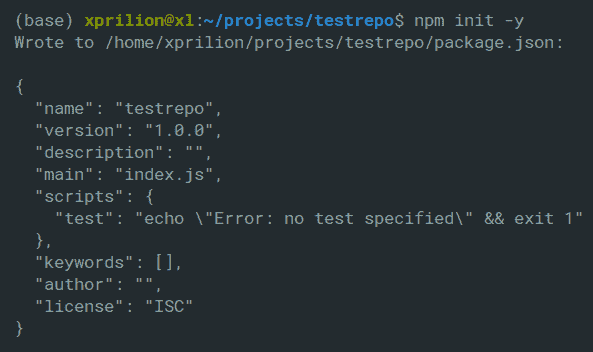
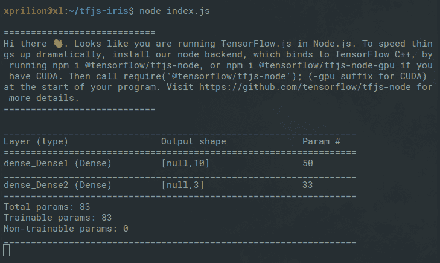
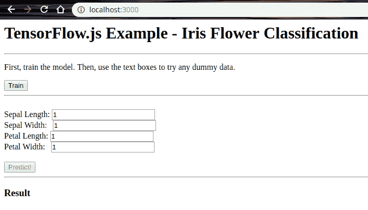
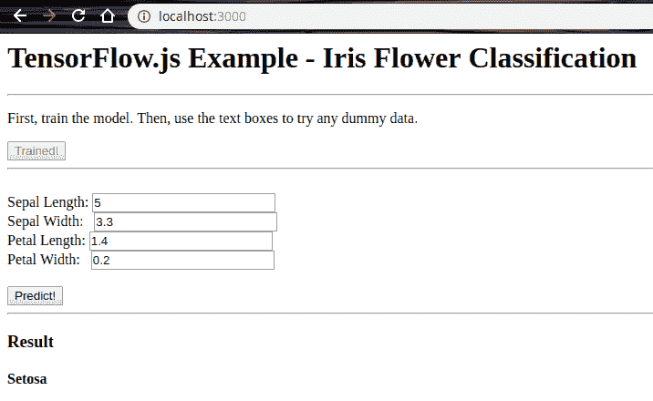

# 四、TensorFlow.js 入门

到目前为止，我们已经向深度学习的美好世界轻轻地介绍了自己，并且对于使当今的 Web 应用变得更加智能化，我们对深度学习所能提供的东西有相当的了解。 在“第 1 章”，“揭秘人工智能和机器学习基础”中，我们详细介绍了 AI 突破前后的 Web 应用。 在“第 3 章”，“创建您的第一个深度学习 Web 应用”中，我们使用简单的神经网络构建了自己的基于图像分类器的简单 Web 应用。

Web 应用无处不在，它们已成为我们日常生活不可分割的一部分。 在构建 Web 应用时，很难忽略 JavaScript 的使用。 那么，如果我们不使用 JavaScript 而不使用其他脚本语言来构建智能 Web 应用呢？ 在本章中，我们将了解如何使用名为 **TensorFlow.js**（**TF.js**）的 JavaScript 库来构建支持深度学习的 Web 应用- 将在网络浏览器中完成所有这些操作。

在本章中，我们将介绍以下主题：

*   TF.js 及其产品的基础
*   使用 TF.js 开发深度学习模型并进行推理
*   直接在浏览器中使用预训练的模型
*   构建一个 Web 应用以识别花的种类
*   TF.js 的优缺点

# 技术要求

您可以通过[这里](https://github.com/PacktPublishing/Hands-On-Python-Deep-Learning-for-Web/tree/master/Chapter4)访问本章中使用的代码。

要学习本章，您需要以下软件：

*   TF.js 0.15.1+
*   NPM 存储库中的`@tensorflow/tfjs-node` 0.3.0+ 软件包

# TF.js 的基础

在本节中，我们将简要回顾 TF.js 的一些基本概念。 我们将从介绍 TensorFlow 开始，然后我们将继续研究 TF.js 的不同组件。

# 什么是 TensorFlow？

在开始讨论 TF.js 之前，我们必须了解 TensorFlow 是什么。 TensorFlow 是由 Google 开发和维护的开源库。 它建立在称为张量的数据结构上。 张量是标量和向量的广义形式。 TensorFlow 为广泛的科学领域中的高性能数值计算提供了许多有效的工具。 TensorFlow 还提供了一套非常灵活的实用程序套件，用于执行机器学习以及深度学习开发和研究。 鼓励您访问 [TensorFlow 的官方网站](https://www.tensorflow.org/)，以获取更多信息。

# 什么是 TF.js？

TF.js 是一个 JavaScript 库，它提供了构建和部署机器学习模型的生态系统。 它提供以下功能：

*   使用 JavaScript 开发机器学习模型
*   使用预训练的机器学习模型
*   部署机器学习模型

TF.js 为您提供了机器学习项目所需的所有元素。 它具有用于数据预处理，张量处理，模型构建，模型评估等的专用模块，而所有模块均使用 JavaScript。 在继续深入研究之前，让我们快速了解对 TF.js 的需求。

# 为什么是 TF.js？

正如我们在上一章中所看到的，简单地在线训练和托管模型，将其包装在 REST API 中，然后在任何前端上使用该 API 来显示我们的结果是非常容易和直观的。 那么，为什么会出现使用 TF.js 的需求？

一个简单的答案就是浏览器中是否有 AI！ 考虑一个需要使用 AI 代理的游戏，该 AI 代理会从人类玩家的玩法中学到东西，从而随着游戏的发展变得越来越困难。 现在，如果游戏每隔一秒钟就不断向服务器发送请求，以将数据往返于游戏和服务器之间传输，那将是多余的。 此外，它很容易导致**拒绝服务**（**DoS**）攻击。

因此，当代理必须保持实时学习时，拥有可以在浏览器中生存和学习的 AI 才有意义。 它也可以通过两种方式进行混合：

*   如果在呈现代理期间加载了预训练的模型，并且从那里开始，它会间隔一段时间在服务器上开始学习和更新模型。
*   如果 AI 代理的多个版本同时在多个系统上运行，并且它们从运行它们的系统上的交互中学习。 同样，如果他们的集体学习在服务器上被吸收，并且代理每隔一段时间从服务器获取更新。

因此，使用 TF.js 可以大大减少对人类用户在每一步与服务器进行交互以与服务器进行交互的页面的依赖性。

我们现在可以构建一个显示 TF.js 功能的迷你项目。 暂时不必担心 TF.js 生态系统-我们将继续介绍项目的所有元素。

# TF.js 的基本概念

以下是我们将在项目中使用的 TF.js 组件：

*   张量
*   变数

*   运作方式
*   楷模
*   层数

让我们详细研究它们中的每一个。

# 张量

像 TensorFlow 一样，TF.js 中的中央数据处理单元是张量。 Goodfellow 等。 （在他们关于深度学习的书中）进行以下观察：

在一般情况下，排列在具有可变数量轴的规则网格上的数字数组称为张量。

简单描述，张量是一维或多维数组的容器。 以下是您可能已经知道的一些张量示例：

*   标量（零级张量）
*   向量（一维或秩一张量）
*   矩阵（二维或二级张量）

我们可以在 TF.js 中针对给定形状创建张量，如下所示：

```py
const shape = [2, 3]; // 2 rows, 3 columns
const a = tf.tensor([4.0, 2.0, 5.0, 15.0, 19.0, 27.0], shape);
```

`a`是已创建的张量，可以使用以下命令来打印其内容：

```py
a.print()
```

打印以下输出：

```py
Output: [[4 , 2 , 5 ],
 [15, 19, 27]]
```

`a`是矩阵（第二张量）。 TF.js 还提供了专用功能，例如`tf.scalar`，`tf.tensor1d`，`tf.tensor2d`，`tf.tensor3d`和`tf.tensor4d`，可以创建特定形状的张量，而不必显式指定`shape`参数。 它还提供了更好的可读性。 张量在 TF.js 中是不可变的。

# 变量

与张量不同，变量在 TF.js 中是可变的。 变量在训练神经网络时特别有用，因为它们包含大量中间数据存储和更新。 以下是如何在 TF.js 中使用变量的示例：

```py
const initialValues = tf.ones([5]);
const weights = tf.variable(initialValues); // initialize weights
weights.print(); // output: [1, 1, 1, 1, 1]
const updatedValues = tf.tensor1d([0, 1, 0, 1, 0]);
weights.assign(updatedValues); // update values of weights
weights.print(); // output: [0, 1, 0, 1, 0]
```

现在让我们来看一下运算符。

# 运算符

运算符使您可以对数据执行数学运算。 TF.js 提供了各种操作来操纵张量。 由于张量本质上是不可变的，因此运算符不会更改张量中包含的数据，而是返回新的张量作为结果。 您可以对张量执行二进制运算，例如加法，乘法和减法。 您甚至可以链接多个操作。 以下示例显示了使用链接在 TF.js 中使用两个不同的运算符的方法：

```py
const e = tf.tensor2d([[1.0, 2.0], [3.0, 4.0]]); 
const f = tf.tensor2d([[3.0, 4.0], [5.0, 6.0]]); 
const sq_sum = tf.square(tf.add(e, f));
sq_sum.print();
```

我们首先创建了两个二维张量，并将它们分配给`e`和`f`。 然后，我们添加了他们并取得了他们的方块。

这将产生以下输出：

```py
// Output: [[16 , 36],
// [64, 100]]
```

接下来，我们将介绍模型和层。

# 模型和层

在深度学习文献中，模型是指神经网络本身，特别是神经网络架构。 正如“第 2 章”，“使用 Python 进行深度学习的入门”中所讨论的那样，神经网络由基本组件组成，例如层之间的层，神经元和连接。 TF.js 提供了两个用于创建这些模型的函数-`tf.model`和`tf.sequential`。 `tf.model`帮助您获得更复杂的架构，例如跳过某些层，而`tf.sequential`提供了一种创建线性层堆叠而无需跳过，分支等的方法。

TF.js 为不同类型的任务提供了不同类型的专用层-`tf.layers.dense`，`tf.layers.dropout`，`tf.layers.conv1d`，`tf.layers.simpleRNN`，`tf.layers.gru`和`tf.layers.lstm`。 以下示例在`tf.sequential`和`tf.layers.dense`的帮助下演示了一个简单的神经网络模型：

```py
const model = tf.sequential();
model.add(tf.layers.dense({units: 4, inputShape: [4], activation: 'relu'}));
model.add(tf.layers.dense({units: 1, activation: sigmoid}));
```

前面的示例创建了一个具有以下内容的简单神经网络：

*   两层（请记住，在计算总层数时我们不考虑输入层）。 网络采用具有四个功能的输入（`inputShape`参数有助于指定该功能）。
*   第一层包含四个神经元（因此`units: 4`）。 第二层（输出层）只有一个神经元。
*   `relu`激活函数用于第一层，`sigmoid`激活函数用于输出层。

建议您转到[这里](https://js.tensorflow.org/api/latest/index.html)了解有关 TF.js 前述组件的更多信息。

# 使用 TF.js 的案例研究

我们将遵循机器学习项目中通常涉及的所有步骤（我们在“第 1 章”，“人工智能和机器学习基础知识揭秘”中的讨论）。 一个好的项目始于定义明确的问题陈述。 因此，让我们快速查看一下并相应地决定后续步骤。

# 我们的 TF.js 小型项目的问题陈述

我们将在这里讨论的问题可能是您开始机器学习之旅时遇到的最著名的挑战之一-通过从鸢尾花数据集中学习其特征来分类和预测鸢尾花的类型。 训练以及预测将在浏览器本身中执行。

我们已经为项目定义了问题陈述。 接下来是数据准备步骤。 数据已经可供我们使用，因此我们不需要自己收集数据。 但是，在准备数据之前，最好对数据本身有更多了解。

# 鸢尾花数据集

由统计学家和生物学家罗纳德·费舍尔（Ronald Fisher）于 1936 年引入，鸢尾花数据集包含 150 行数据和大约 3 种不同的鸢尾花品种。 列如下：

*   萼片长度（厘米）
*   萼片宽度（厘米）
*   花瓣长度（厘米）
*   花瓣宽度（厘米）
*   品种：
    *   柔滑的
    *   杂色
    *   维珍妮卡

您可以在[这个页面](http://archive.ics.uci.edu/ml/datasets/Iris)中获取原始数据集并了解更多信息。

# 您的第一个使用 TF.js 的深度学习 Web 应用

在本节中，我们将借助 TF.js 开发一个 Web 应用。 该应用将包括一个标准的，全栈，支持深度学习的 Web 项目的步骤。 我们将从准备数据开始，然后将简短地研究项目架构，然后，我们将逐步构建所需的组件。

# 准备数据集

鸢尾花数据集的原始形式是一个 CSV 文件，其中包含 150 行数据，以逗号分隔的格式分成 5 列，每个条目用新行分隔。

但是，我们将使用数据的 JSON 格式，以简化 JavaScript 的可操作性。 可以从[这里](https://gist.github.com/xprilion/33cc85952d317644c944274ee6071547)下载 JSON 格式的数据集。

您可以使用任何语言的简单函数将 CSV 文件转换为 JSON 文件，并按照以下约定更改列名：

*   萼片长度：`sepal_length`
*   萼片宽度：`sepal_width`
*   花瓣长度：`petal_length`
*   花瓣宽度：`petal_width`
*   品种：`species`

在开发用于模型构建的张量时，我们将在 JSON 中使用这些属性名称。

# 项目架构

我们将在该项目中使用 Node.js 创建服务器。 这样做是为了在通过 Node.js 后端使用时获得 TF.js 更快的计算性能的好处。 我们将创建一个非常基本的前端，该前端将能够发出命令以执行使用 TF.js 构建的神经网络的训练，而另一个按钮可以发出命令以基于以下内容预测鸢尾花的假设特征向量的类别，基于用户提供的输入。

下图显示了项目的组件及其交互：


现在我们已经了解了架构，让我们从项目开始。

# 启动项目

要开始从事该项目，首先需要安装最新版本的 Node.js 和 **Node 包管理器**（**NPM**）。 虽然执行此操作的标准方法是阅读 Node.js 网站上提供的文档，但我们建议您使用 **Node 版本管理器**（**NVM**）安装 Node.js 和 NPM。

可以在[这里](https://github.com/creationix/nvm) [b.com/creationix/nvm](https://github.com/creationix/nvm)找到设置说明和文件。

一旦安装了 Node.js 和 NPM，我们就可以开始进行项目本身的工作了：

1.  创建一个名为`tfjs-iris`的文件夹。
2.  打开一个终端，并使用以下命令启动该项目的程序包管理器：

```py
npm init -y
```

这将在项目目录中创建一个文件`package.json`。 上一条命令的输出如下：



请注意，输出为 JSON 格式。 `main`键定义了作为模块导入的文件，该文件将成为程序的入口点。 默认情况下，此项目中`main`的值设置为`index.js`。 但是，该文件尚未创建。 让我们来研究`index.js`文件。

我们将使用 Node.js 的`express`模块创建服务器。 您可以在[这个页面](https://expressjs.com/)上阅读有关`express`的更多信息。

3.  要使用`express`，我们需要将模块添加到我们的项目中。 为此，请使用以下代码：

```py
npm install express --save
```

这会将`express`模块依赖项添加到`package.json`文件，并将其安装在项目工作目录内的`node_modules`目录中。

4.  在项目存储库的根目录中创建一个名为`index.js`的文件，并添加以下代码：

```py
var express = require('express');
var app = express(); 
```

这将创建一个`express`应用对象。 现在，我们将 TF.js 添加到项目中。 最简单的方法是通过 NPM 安装它。 完整的设置说明可在[这个页面](https://js.tensorflow.org/setup/)中找到。

5.  使用以下命令在终端中安装`TF.js`模块：

```py
npm install @tensorflow/tfjs --save
```

6.  现在，我们可以将模块添加到`index.js`文件中：

```py
const tf = require('@tensorflow/tfjs');
```

7.  我们还将需要 Express.js 中的`body-parser`模块来处理来自客户端的传入查询数据，这些数据将通过 AJAX `POST`请求发送。 为此，我们使用以下命令：

```py
npm install body-parser --save
```

8.  现在，我们创建一个`body-parser`对象，并使用以下代码将其绑定到应用：

```py
var bodyParser = require('body-parser');
app.use(bodyParser.urlencoded({ extended: false }));
```

在此阶段，`package.json`应该包含以下片段，列出您项目的依赖项：


请注意，先前的版本可能会更改。 现在，我们可以导入`iris.json`文件，我们将在以下文件上训练我们的模型：

```py
const iris = require('./iris.json');
```

完成初始设置后，我们现在可以继续编写 TF.js 代码以对可用数据集进行训练。

# 创建一个 TF.js 模型

让我们开始将存储在`iris`变量中的数据读取到`tensor2d`对象中：

1.  在您的`index.js`文件中，添加以下代码：

```py
const trainingData = tf.tensor2d(iris.map(item=> [
    item.sepal_length, item.sepal_width, item.petal_length, item.petal_width
]),[144,4])
```

我们还没有任何测试数据； 这将由用户提供。

2.  接下来，我们为可能的三种花创建一个一次性编码：

```py
const outputData = tf.tensor2d(iris.map(item => [
    item.species === 'setosa' ? 1 : 0,
    item.species === 'virginica' ? 1 : 0,
    item.species === 'versicolor' ? 1 : 0
]), [144,3])
```

现在，我们准备创建训练模型。 以下代码可能使您想起上一章为 MNIST 手写数字数据集创建模型时使用的代码。 这仅仅是因为我们仍然仅使用另一种语言使用 TensorFlow 的概念！

3.  我们首先声明一个顺序的 TensorFlow 模型：

```py
const model = tf.sequential();
```

4.  接下来，让我们在模型中添加一层神经元：

```py
model.add(tf.layers.dense({
    inputShape: 4, 
    activation: 'sigmoid', 
    units: 10
 }));
```

`inputShape`参数指示将添加到此层的输入的形状。 `units`参数设置该层要使用的神经元数量。 我们正在使用的`activation`功能是`sigmoid`功能。

5.  现在添加输出层：

```py
model.add(tf.layers.dense({
    inputShape: 10, 
    units: 3, 
    activation: 'softmax'
}));
```

在这里，我们在输出层中将有 3 个神经元，并且在这一层上期望的输入是 10，这与上一层中的神经元数量匹配。

除了输入层，我们只有一个隐藏层和输出层。 在该应用中这是可以接受的，因为数据集很小并且预测很简单。 请注意，我们在此处使用了`softmax`激活函数，该函数产生类概率作为输出。

这在我们的案例中特别有用，因为该问题是多类分类问题。

6.  完成此操作后，我们现在可以编译我们的模型了。 为此，我们使用以下代码：

```py
model.compile({
    loss: "categoricalCrossentropy",
    optimizer: tf.train.adam()
});
```

由于我们手头有一个可能存在多个标签的分类问题，因此我们将`categoricalCrossentropy`用作`loss`函数。 为了进行优化，使用了`adam`优化器。 建议您尝试其他超参数值。

7.  我们可以使用以下代码生成模型的摘要：

```py
model.summary();
```

接下来，我们将训练我们的 TF.js 模型。

# 训练 TF.js 模型

现在，我们将编写一个`async`函数。 这样做的原因是，不会使调用我们函数的客户端 JavaScript 陷入等待结果的状态。 在我们的程序中，需要花费一些时间才能完成的功能是`train_data()`功能。 此函数执行模型的训练：

```py
async function train_data(){
    console.log("Training Started");
    for(let i=0;i<50;i++){
        let res = await model.fit(trainingData, outputData, {epochs: 50});
        console.log(`Iteration ${i}: ${res.history.loss[0]}`);
    }
    console.log("Training Complete");
}
```

`train_data()`功能可以异步运行。 它还将训练的每个阶段的损失打印到我们将要从中运行服务器的控制台。 现在，让我们创建一个将调用`train_data()`函数的 API。

首先，我们创建一个名为`doTrain`的*中间件*，该中间件将在用于训练的 API 之前运行，并将返回任何数据。

您可以在[这个页面](https://expressjs.com/en/guide/using-middleware.html)上了解有关中间件的更多信息。

`doTrain()`中间件在其参数中接受对 Node.js 服务器的请求，用于做出响应的变量以及将在执行完以下代码后转发程序执行的函数的名称。 中间件中定义的代码：

```py
var doTrain = async function (req, res, next) {
    await train_data();
    next();
}
```

`doTrain`中间件调用`train_data()`函数并等待其结果。 `train_data()`函数返回`Promise`，以便继续执行而不会冻结。 `next()`功能在`train_data()`功能完成后立即运行，并且仅将程序的执行传递给中间件旁边*链接*的功能，如下所示：

```py
app.use(doTrain).post('/train', function(req, res) {
    res.send("1");
});
```

现在，我们将`'/train'`路由绑定到`express`应用，然后将`doTrain`中间件链接到该应用。 现在，对于`'/train'` API 的每次调用，中间件都首先运行，然后执行传递到该 API 的主要代码块。 此代码块仅返回任意值以表示训练已完成。

# 将 TF.js 模型用于预测

训练完成后，我们还需要创建一个 API 来调用预测函数并返回预测结果。 我们使用`POST`方法将 API 绑定到`'/predict'`路由，以对此 API 进行请求，如下所示：

```py
app.post('/predict', function(req, res) {
    var test = tf.tensor2d([parseFloat(req.body.sepLen), parseFloat(req.body.sepWid),                                 parseFloat(req.body.petLen), parseFloat(req.body.petWid)], [1,4]);
    var out = model.predict(test);
    var maxIndex = 0;
    for (let i=1;i<out.size; i++){
        if (out.buffer().get(0, i) > out.buffer().get(0, maxIndex)){
            maxIndex = i;
        }
    }

    ans = "Undetermined";
    switch(maxIndex) {
        case 0:
            ans = "Setosa"; 
        break;
        case 1:
            ans = "Virginica"; 
        break;
        case 2:
            ans = "Versicolor"; 
        break; 
    }
    console.log(ans);
    res.send(ans);
});
```

了解预测 API 的代码非常简单。 让我们分部分讨论它：

```py
app.post('/predict', function(req, res) {
```

这行代码将`'/predict'`路由绑定到`POST`请求方法，并打开将处理该路由请求的语句的代码块：

```py
    var test = tf.tensor2d([parseFloat(req.body.sepLen), parseFloat(req.body.sepWid),                                     parseFloat(req.body.petLen), parseFloat(req.body.petWid)], [1,4]);
    var output = model.predict(test);
```

这些行从数据中创建一个 TF.js `tensor2d`对象，该对象是从客户端接收的。 然后，在模型上运行`predict`方法，并将结果存储在输出变量中：

```py
    var maxIndex = 0;
    for (let i=1;i<out.size; i++){
        if (out.buffer().get(0, i) > out.buffer().get(0, maxIndex)){
            maxIndex = i;
        }
    }
```

该代码块仅找到与`tensor2d`变量输出中最高元素对应的索引。 请记住，在`softmax`激活输出中，最大值对应于预测的索引。

在确定了输出的最大索引之后，我们使用一个简单的`switch-case`语句来确定要从 API 发送到客户端的输出。 请求数据还将记录到服务器上可见的控制台中。 最后，我们使用以下代码将 Node.js 应用绑定为侦听端口`3000`：

```py
app.listen(3000);
```

现在，我们将在以下部分中创建一个简单的客户端。

# 创建一个简单的客户端

为了在我们的应用中处理`'/'`路由，我们将以下代码行添加到`index.js`中，该代码仅呈现静态文件`index.html`，该文件位于公共文件夹中：

```py
app.use(express.static('./public')).get('/', function (req, res) {
    res.sendFile('./index.html');
});
```

现在，让我们按照以下步骤创建静态`index.html`文件：

1.  首先，创建一个文件夹`public`，并在其中创建`index.html.`将以下代码添加到`index.html`文件中：

```py
<html>
  <head>
    <title>TF.js Example - Iris Flower Classficiation</title>
  </head>
  <body>
    <h1> TF.js Example - Iris Flower Classification </h1>
    <hr>
    <p>
      First, train the model. Then, use the text boxes to try any dummy data.
    </p>

    <button id="train-btn">Train</button>

    <hr><br>
    <label for="sepLen">Sepal Length: </label>
    <input type="number" id="sepLen" value="1" /><br>
    <label for="sepWid">Sepal Width:&nbsp;&nbsp;</label>
    <input type="number" id="sepWid" value="1" /><br>
    <label for="petLen">Petal Length: </label>
    <input type="number" id="petLen" value="1" /><br>
    <label for="petWid">Petal Width:&nbsp;&nbsp;</label>
    <input type="number" id="petWid" value="1" /><br>
    <br>
    <button id="send-btn" disabled="="true">Predict!</button>
    <hr>
    <h3> Result </h3>
    <h4 id="res"></h4>

    <script src="https://cdnjs.cloudflare.com/ajax/libs/jquery/3.3.1/jquery.min.js"></script>
```

2.  在为开发用于调用我们使用 TF.js 创建的 API 的客户端设置一个简单的 UI 之后，我们准备定义从客户端部署它们的功能。 请注意，`"/train"`和`"/predict"` API 都将由`POST`请求调用：

```py
    <script>

      $('#train-btn').click(function(){
        $('#train-btn').prop('disabled', true);
        $('#train-btn').empty().append("Training...");
        $.ajax({
          type: 'POST',
          url: "/train",
          success: function(result) {
            console.log(result);
            $('#send-btn').prop('disabled', false);
            $('#train-btn').empty().append("Trained!");
          }
        });
      });

      $('#send-btn').click(function(){
        var sepLen = $('#sepLen').val();
        var sepWid = $('#sepWid').val();
        var petLen = $('#petLen').val();
        var petWid = $('#petWid').val();
        $.ajax({
          type: 'POST',
          url: "/predict",
          data: {sepLen: sepLen, sepWid: sepWid, petLen: petLen, petWid: petWid},
          success: function(result) {
            console.log(result);
            $('#res').empty().append(result);
          }
        });
      });
    </script>
  </body>
</html>
```

现在让我们运行 TF.js Web 应用。

# 运行 TF.js Web 应用

使用所有应用编码后，我们现在可以运行我们的应用。 首先，打开一个终端，并在其中包含`package.json`文件的`tfjs-iris`文件夹作为您的工作目录。

运行以下代码行以启动 Node.js 服务器：

```py
node index.js
```

该命令产生的输出类似于以下屏幕截图：



现在，连同此输出，服务器从端口`3000`启动，我们可以在浏览器中查看该端口。 打开浏览器，在地址栏中键入`http://localhost:3000/`，以显示以下输出：



首先，您必须单击“训练”按钮以调用`'/train'` API，该 API 开始训练，并且该按钮将变为禁用状态。 一旦预测！ 按钮被启用，训练完成，用户可以将虚拟数据发送到服务器进行预测。 假设我们从数据集中选择了第 50 行数据，并将其发送到服务器，其预期输出为`Setosa`。

以下屏幕截图显示了项目最终版本的一小部分：



我们看到为提供的输入生成了正确的输出。

# TF.js 的优缺点

现在，让我们总结一下 TF.js 在 TensorFlow 上带来的一些优势，以及我们在本章中已经谈到的那些优势：

*   **自动 GPU 支持**：您无需与 TF.js 分别安装 CUDA 或 GPU 驱动程序，即可从系统上存在的 GPU 中受益。 这是因为浏览器本身实现了 GPU 支持。
*   **集成**：使用 Node.js 将 TF.js 集成到 Web 开发项目中，然后将预训练的模型导入该项目并在浏览器中运行，这相当简单。

但是，它也有几个缺点，在开发生产时必须牢记。 其中一些如下：

*   **速度**：TF.js 适用于小型数据集。 在大规模数据集上，计算速度受到严重影响，并且速度慢了近 10 倍。
*   **缺少 TensorBoard**：框架的 JavaScript 端口中缺少此强大的工具，它可以使 TensorFlow 模型可视化，因为 TF.js 只是一个 API。
*   **对 API 的不完全支持**：并非所有 TensorFlow API 在 TF.js 上都可用，因此在使用 TF.js 开发时，您可能必须重新考虑代码逻辑或创建自己的函数以使用某些功能。

# 总结

在本章中，我们了解了使用 TF.js 创建模型有多么容易。 您不仅可以使用整个 JavaScript 生态系统，还可以在 TF.js 中获得所有经过预训练的 TensorFlow 模型。 我们使用鸢尾花数据集开发了一个简单的 Web 应用，并且在此过程中，我们了解了 TF.js 必须提供的几个组件。 到目前为止，我们已经构建了两个简单的基于端到端深度学习的 Web 应用。

我们的进步确实是显而易见的。 在接下来的章节中，我们将构建自己的深度学习 API，并使用它们来创建智能 Web 应用。 但是在此之前，让我们在下一章中熟悉 API 的整个概念。