# 六、Google Cloud Platform 上的 Python 深度学习

在上一章中，我们看到了各种组织提供的各种深度学习 API。 我们还看到它们的适用性大致分为两类：第一类是计算机视觉和图像处理，第二类是自然语言处理。 我们还将在本章中继续探索深度学习 API。 本章向您介绍 **Google Cloud Platform**（**GCP**）以及它在深度学习领域提供的三个 API。

在本章中，我们将介绍以下主题：

*   设置您的 GCP 帐户
*   在 GCP 上创建您的第一个项目
*   在 Python 中使用 Dialogflow API
*   在 Python 中使用 Cloud Vision API
*   在 Python 中使用 Cloud Translation API

# 技术要求

您可以从[这里](https://github.com/PacktPublishing/Hands-On-Python-Deep-Learning-for-Web/tree/master/Chapter6)访问本章的代码。

要运行本章中的代码，您的系统上需要安装 Python 3.6+。

本章将介绍其他必要的安装。

# 设置您的 GCP 帐户

在继续使用 GCP 提供的 API 之前，您必须设置您的 GCP 帐户。 假设您已经拥有 Google 帐户-首先，转到[这里](https://cloud.google.com/)。 如果您是第一次注册，GCP 会给您 300 美元的信用额度（您可以使用 12 个月）； 这种信誉足以容纳许多优秀项目，并使您能够试用 GCP 的产品。 完成此操作后，我们可以按照以下步骤操作：

1.  在 GCP 主页的右上角，您应该能够找到“免费试用”按钮。 只需单击它：


2.  如果您尚未登录 Google 帐户，则会要求您登录。相应地选择您所在的国家/地区，并确保选中服务条款框。 之后，单击“同意并继续”。 您将在以下屏幕截图中看到一个页面：

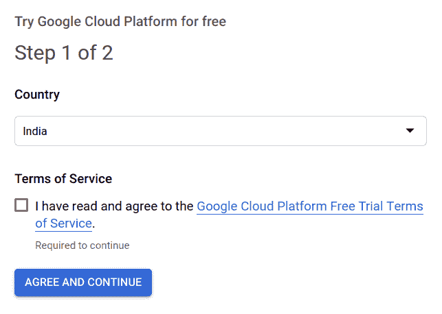

3.  然后，系统会要求您输入所选付款方式的详细信息。 即使您有免费的积分，也要使用 GCP 的实用程序，也需要设置一个有效的结算帐户。 但请放心，除非您允许 GCP 这样做，否则不会从您的结算帐户中向您收费。 免费试用期间，将仅从您的免费信用额中扣除您将在 GCP 上使用的所有计费实用程序。 一旦您的免费信用额度限额终止，GCP 就会向您发送提醒。

完成结算手续后，您应该进入 GCP 的控制台页面，该页面如下所示：

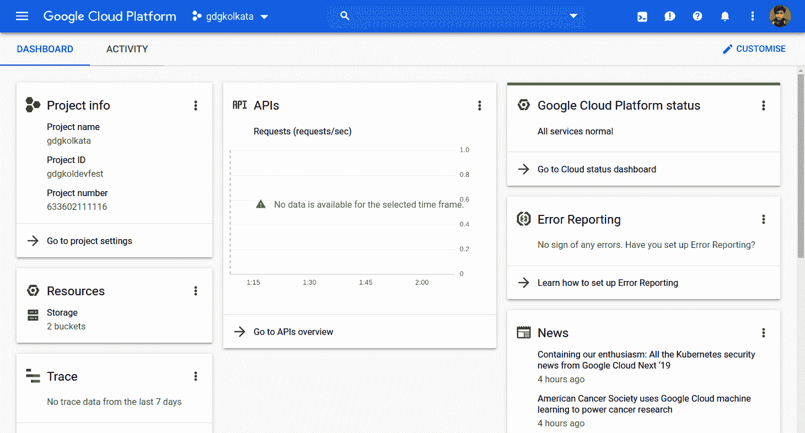

这实际上是您的 GCP 信息中心，可为您提供 GCP 使用情况的总体摘要。 GCP 还允许您自定义出现在 GCP 控制台上的标签。

现在，您应该完成 GCP 帐户设置。 为了能够使用 GCP 中的实用程序，您需要创建一个带有有效账单帐户的 GCP 项目。 在下一节中，您将看到如何执行此操作。

# 在 GCP 上创建您的第一个项目

一个项目可帮助您系统地组织所有 GCP 资源。 只需单击几下即可在 GCP 上创建项目：

1.  登录到您的 Google 帐户后，使用[这里](https://console.cloud.google.com)打开 GCP 控制台。 在左上角，您应该看到 Google Cloud Platform，在其旁边，您可以看到一个下拉列表，如下所示：


2.  如果您在注册 GCP 或之前注册时确实创建了任何项目，则其中一个项目将显示在标记的区域中（fast-ai-exploration 和 gcp-api 是我在 GCP 上创建的两个项目）。 现在，单击向下箭头，将出现一个弹出窗口：

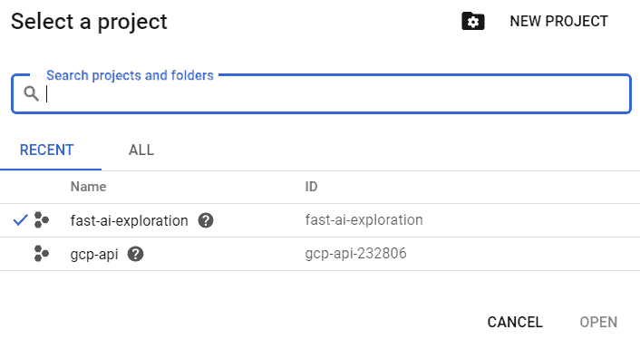

3.  单击“新项目”继续。 您应该最终显示在以下屏幕快照中的页面上，该页面将要求您指定项目的名称。 GCP 会为您正在创建的项目自动生成一个 ID，但也可以根据您的选择编辑该 ID：

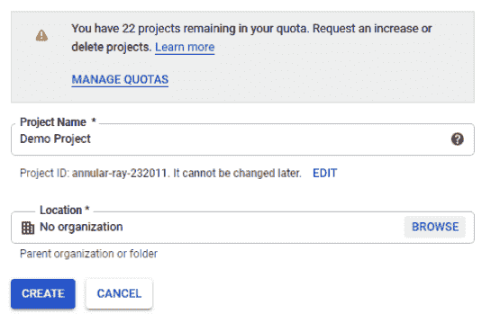

4.  在指定完项目的初始详细信息之后，只需单击`CREATE`即可创建该项目。 创建项目后，它应出现在项目列表中。 您始终可以使用 GCP 在其控制台页面上提供的便捷下拉菜单导航至此列表。 您可以在以下屏幕截图中看到它：

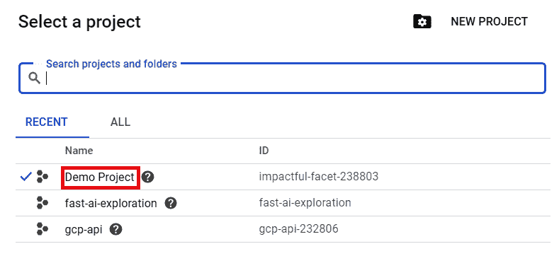

如果您想了解有关 GCP 项目的更多信息，可以在[这个页面](https://cloud.google.com/storage/docs/projects)上查看官方文档。 GCP 配备了各种实用程序，可在[这里](https://cloud.google.com/products/)中找到。 鼓励您看一下，并就自己的兴趣进行探索。

GCP 为我们提供了广泛的 API，可用于各种任务，包括深度学习。 在接下来的两节中，我们将了解如何使用 Python 代码来使用一些使用最广泛的深度学习 API。 我们将从 Dialogflow 开始。

# 在 Python 中使用 Dialogflow API

在开始学习如何在 Python 中使用 Dialogflow API 之前，让我们了解 Dialogflow 的全部含义。

Dialogflow（以前称为 **api.ai**）提供了一套实用程序，用于构建自然而丰富的对话界面，例如语音助手和聊天机器人。 它由深度学习和自然语言处理提供支持，并被许多公司使用。 它与网站，移动应用以及许多流行的平台（例如 Facebook Messenger，Amazon Alexa 等）无缝集成。 Dialogflow 为我们提供了构建对话用户界面的三个主要组件：

*   可以轻松应用于任何对话用户界面的最佳做法和流程
*   添加构建会话用户界面可能需要的任何自定义逻辑的功能
*   训练智能体的设施，以便微调界面的整体体验

现在，我们将看到如何使用 Dialogflow 在 Python 中创建一个简单的应用。 您可以参考[这里](https://dialogflow.com)了解有关 Dialogflow 的更多信息。

我们将从创建 Dialogflow 帐户开始。

# 创建一个 Dialogflow 帐户

创建 Dialogflow 帐户非常简单。 该过程涉及以下步骤：

1.  访问[这里](https://console.dialogflow.com/api-client/#/login)，您将看到以下屏幕：


2.  单击“使用 Google 登录”按钮后，将要求您选择要用于 Dialogflow 的 Google 帐户。
3.  选择帐户时，可能会要求您允许 Diagflow 的帐户权限，并接受 Dialogflow 条款和条件。

# 创建一个新智能体

创建帐户后，将为您提供一个仪表板，该仪表板将显示您活动的 Dialogflow 项目或要求您创建要显示的新代理，但是**智能体**是什么？

用 Dialogflow 术语来说，代理是一种软件，执行从用户接收输入的任务，该输入可能采用文本，音频，图像或视频的格式。 然后，它尝试确定*意图*或与输入对应的先前定义的适当操作。 匹配的意图可能会执行*动作*，或者可能只是对用户输入的查询产生超文本响应。 最后，代理将结果返回给用户。

要创建新代理，请在 Dialogflow 控制台的左侧导航菜单中，单击“创建代理”。

屏幕上将显示以下屏幕：


我们已将代理 DemoBot 命名为默认语言，并将其设置为英语。 此外，我们必须为代理选择一个 Google 项目。

Google 项目，或者简称为**项目**，是您在 GCP 研究中遇到的一个术语。 一个项目包含分配给使用这些资源并由 GCP 上的一个计费帐户提供资金的任何软件项目的全部资源。 如果没有为资源定义项目，则无法分配资源。 此外，如果不向其添加有效的计费选项，则无法创建任何项目。

现在，您将能够看到一个屏幕，如以下屏幕截图所示，其中为您的代理提供了某些默认意图：

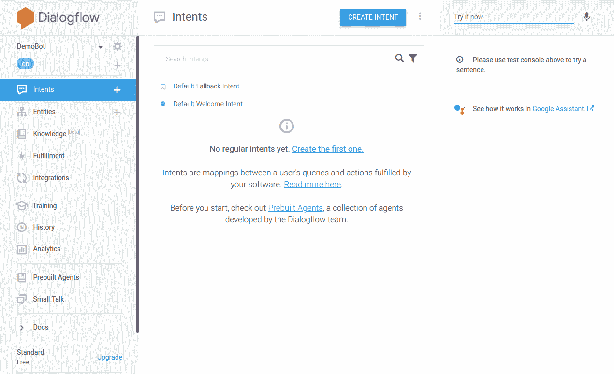

在左侧，您可以看到导航菜单，该菜单提供了可以在您的代理中组合在一起的所有各种模块，以实现软件提供的更好的类似于人的交互。 在右侧面板中，您可以选择随时使用您提供的任何输入来测试代理。 这将在开发响应时以及在测试意图与提供的输入的匹配时派上用场。

# 创建一个新的意图

要为我们的代理创建新的意图，请按照下列步骤操作：

1.  单击中间部分右上角的“创建意图”按钮。
2.  您需要为此目的提供一个名称-假设`Dummy Intent`。
3.  然后，我们将需要提供一些触发此意图的训练短语。 假设我们提供了三个训练短语，如下所示：

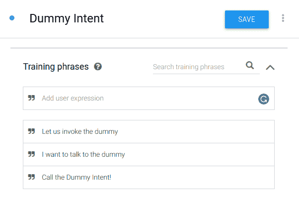

现在，我们可以期望只要系统遇到训练中提到的短语（或类似短语），就会调用此意图。

4.  现在，我们可以添加一些调用该意图时代理将做出的响应，如下所示：

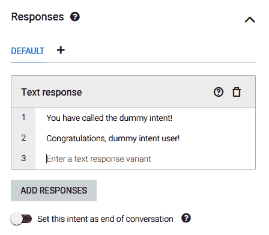

5.  在中间部分的右上角，单击“保存”按钮以保存新的意图，然后将通知您座席训练已开始。

对于小型特工，训练将在几秒钟内完成，并且将为您提供特工训练已完成的通知。

现在，我们准备测试我们的代理是否能够执行此意图。

# 测试您的代理

在 Dialogflow 控制台的右侧部分，您将能够测试您的代理。 在顶部文本字段中，输入查询。 在我们的代理中，要调用`Dummy Intent`，我们将编写为`Talk to the dummy`。

如果意图正确匹配，您将能够看到`Dummy Intent`的响应，如下所示：

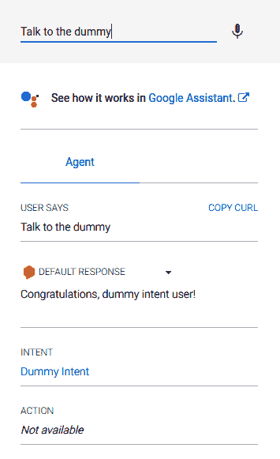

在上一个屏幕截图中，您将看到用户的输入为`Talk to the dummy`，生成的响应是我们在`Dummy Intent`响应中定义的两个响应之一。 您可以观察到与输入匹配的意图是`Dummy Intent`。

现在，我们将研究如何使用 Python 调用代理。

# 安装 Dialogflow Python SDK

在本节中，我们将演示如何将 Dialogflow Python API V2 与 Dialogflow 代理一起使用，以使使用 Python 构建的应用具有交互性。 首先，让我们了解 DialogFlow 生态系统的几个组件如何与下图交互：

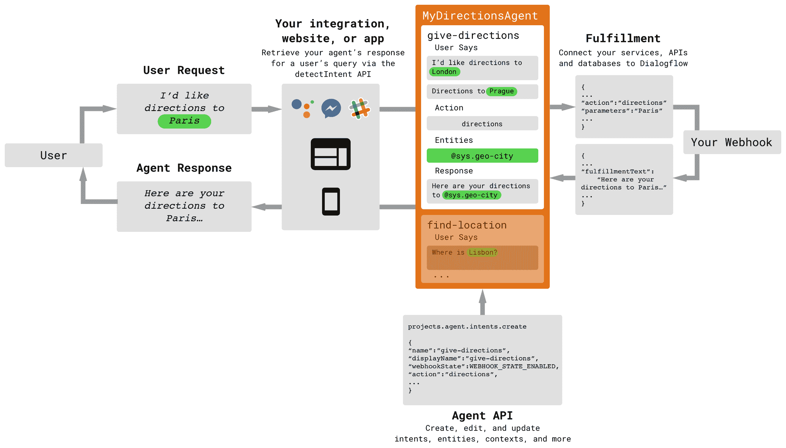

用户创建输入，然后通过集成 API，网站或应用将其发送到代理。 代理将用户输入与可用意图进行匹配，并产生对**查询**的满足。 响应通过 Webhook 发送回用户界面，并将响应呈现给用户。

集成 API 很有可能包含 Dialogflow 以外的服务。 您可以创建一个应用，该应用可以将同一用户查询传播到多个代理并合并他们的响应。

另外，开发人员可以引入中间件处理器或集成，它们将对用户查询和代理响应进行预处理或后处理：

1.  要安装 Dialogflow Python SDK，我们在终端中使用以下命令：

```py
pip install dialogflow
```

强烈建议您先使用`virtualenv`创建一个虚拟环境，然后再使用上一个命令来创建干净无间断的依赖关系。 要了解有关`virtualenv`的更多信息，请参阅[这里](https://virtualenv.pypa.io/en/latest/)。

2.  安装完成后，您将可以使用以下导入代码将 Dialogflow API 导入到项目中：

```py
import dialogflow
```

现在，我们将创建一个 GCP 服务帐户来验证我们的 Python 脚本，以便使用我们创建的 Dialogflow 代理。

# 创建 GCP 服务帐户

GCP 服务帐户管理提供的访问 GCP 资源的权限。 我们创建的 Dialogflow 代理是 GCP 资源，因此要从 Python API 使用它，我们需要一个服务帐户：

1.  在 GCP 控制台的左侧导航菜单中，转到“API | 服务 | 证书”。
2.  单击“创建凭据”按钮以获取以下选项：

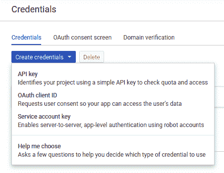

3.  单击“服务帐户密钥”。 在接下来出现的页面中，选择`Dialogflow Integrations`作为服务帐户，选择 JSON 作为密钥类型。 单击“创建”后，将 JSON 文件下载到您的计算机。
4.  记下此 JSON 文件的地址，例如`/home/user/Downloads/service-account-file.json`。 文件名可能会有所不同，因为将文件下载到计算机时由 GCP 控制台提供。
5.  打开此文件以获取项目 ID。
6.  现在，在终端中使用以下命令（系统中将使用适当的替代命令）将凭据导出到环境变量：

```py
export GOOGLE_APPLICATION_CREDENTIALS="<your_service_account_file_location>"
export DIALOGFLOW_PROJECT_ID="<your_project_id>"

```

```py
set GOOGLE_APPLICATION_CREDENTIALS=<your_service_account_file_location>
set DIALOGFLOW_PROJECT_ID=<your_project_id>

```

完成此操作后，我们现在就可以编写将调用 Dialogflow 代理的 Python 脚本了。

请注意，前面的命令仅设置当前会话的变量。 每次重新启动会话时，都需要运行命令。

# 使用 Python API 调用 Dialogflow 代理

在此示例中，我们将创建一个简单的基于 Python 的 API，该 API 调用在 Dialogflow 控制台中创建的代理以调用`Dummy Intent`，如下所示：

1.  首先，我们必须将 Dialogflow 模块导入到项目中。 为此，请使用以下代码：

```py
import dialogflow
```

2.  为了将项目 ID 放入脚本中，我们可以从运行时环境变量中获取它。 为此，请使用以下代码：

```py
import os
project_id = os.getenv("DIALOGFLOW_PROJECT_ID")
```

3.  我们还将声明一个唯一的会话 ID，以存储在与用户进行的任何单个会话中进行的会话的记录：

```py
session_id="any_random_unique_string"
```

4.  现在，我们将创建一个方便的函数，该函数将允许我们重复执行调用 Dialogflow 代理所需的一组预处理语句：

```py
def detect_intent(project_id, session_id, text, language_code):

    session_client = dialogflow.SessionsClient()
    session = session_client.session_path(project_id, session_id)

    text_input = dialogflow.types.TextInput(text=text, language_code=language_code)
    query_input = dialogflow.types.QueryInput(text=text_input)
    response = session_client.detect_intent(session=session, query_input=query_input)

    return response.query_result.fulfillment_text
```

在前面的代码中，我们将首先初始化`SessionsClient`对象。 一个会话记录了一次不间断会话期间用户与 Dialogflow 代理之间的完整交互。 接下来，我们必须设置会话的路径，这是项目到唯一会话 ID 的映射。

前面的函数定义的后两行用于创建包含 Dialogflow `TextInput`对象的 Dialogflow `QueryInput`对象。 `query_input`变量保存用户为 Dialogflow 代理输入的消息。

下一行调用`SessionsClient`对象的`detect_intent()`方法。 `session ID-project ID`映射与输入一起作为参数传递给方法。 Dialogflow 代理的响应存储在响应变量中。 该函数返回实现文本响应。

5.  现在让我们使用此方法。 首先，声明一条消息以传递给 Dialogflow 代理。 回忆我们为`Dummy Intent`提供给 Dialogflow 代理的训练短语。 我们将传递与训练短语相似的消息：

```py
message = "Can I talk to the dummy?"

fulfillment_text = detect_intent(project_id, session_id, message, 'en')

print(fulfillment_text)
```

我们将获得一个输出，该输出是我们为`Dummy Intent`定义的两个响应之一。

6.  在`detect_intent()`方法中生成响应变量，可以通过在`detect_intent()`函数中添加以下代码行来完成：

```py
def detect_intent(project_id, session_id, text, language_code):
    ...
    response = session_client.detect_intent(session=session, query_input=query_input)
    print(response) ### <--- ADD THIS LINE

    return response.query_result.fulfillment_text
```

您将获得以下 JSON：

```py
response_id: "d1a7b2bf-0000-0000-0000-81161394cc24"
query_result {
  query_text: "talk to the dummy?"
  parameters {
  }
  all_required_params_present: true
  fulfillment_text: "Congratulations, dummy intent user!"
  fulfillment_messages {
    text {
      text: "Congratulations, dummy intent user!"
    }
  }
  intent {
    name: "projects/gcp-api-232806/agent/intents/35e15aa5-0000-0000-0000-672d46bcefa7"
    display_name: "Dummy Intent"
  }
  intent_detection_confidence: 0.8199999928474426
  language_code: "en"
}
```

您将观察到匹配的意图的名称为`Dummy Intent`，而在此代理调用中我们得到的输出为`Congratulations, dummy intent user!`。

还有其他几种使用 Python 使用 Dialogflow API 的方法，包括但不限于视听输入和基于传感器的输入。 Dialogflow 代理可以与主要平台集成，例如 Google Assistant，Facebook Messenger，Slack，Telegram，WhatsApp 和其他几个平台，如下所示：

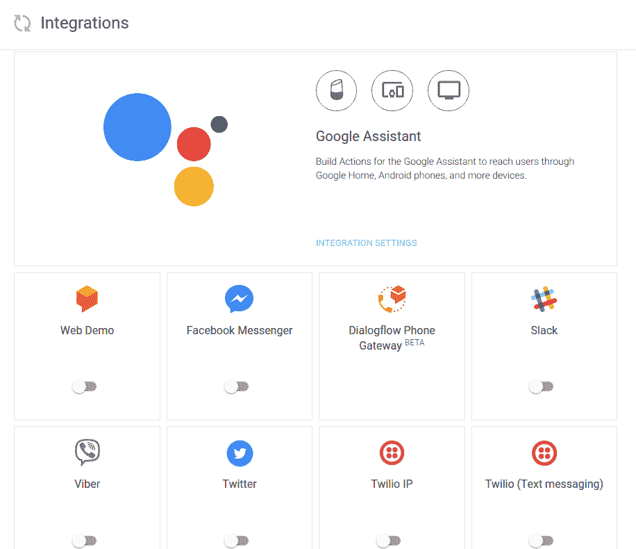

Dialogflow 生态系统正在迅速引入新功能，并且正朝着提供可以同时执行多个任务的完整的基于 AI 的聊天机器人的方向发展。

在下一节中，我们将探索另一个 GCP API，该 API 可用于预测图像和视频的内容。

# 在 Python 中使用 Cloud Vision API

计算机视觉是使计算机理解图像并理解图像的领域。 常见的计算机视觉任务包括图像分类，图像检测，图像分割等。 如前几章所述，深度学习在实现人类水平（有时甚至更好）的性能方面的有效性已严重影响了计算机视觉领域。

Cloud Vision API 为我们提供了许多用于执行计算机视觉任务的实用程序。 Cloud Vision 允许我们使用预先训练的模型，以及建立自己的定制生产模型来满足我们的需求（例如 AutoML Vision Beta）。 现在让我们简要地看一下 Cloud Vision API 提供的功能：

*   标签检测
*   光学字符识别
*   手写识别
*   地标检测
*   对象定位
*   图片搜索
*   产品搜索

除了前面提到的功能之外，Cloud Vision 还允许我们提取给定图像的不同属性。 以下屏幕截图显示了此实用程序：

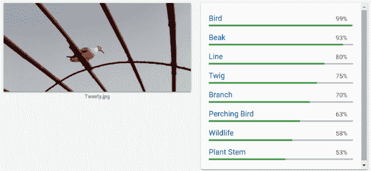

如我们所见，当提供图像时，Cloud Vision API 会自动提取其属性。 您也可以通过转到[这里](https://cloud.google.com/vision/)来尝试此操作。

从较早的章节开始，我们一直在使用术语**预训练模型**。 我们还看到了 Cloud Vision API 如何使我们整合预训练的模型。 为了理解使用它们的重要性，有必要对术语“预训练的模型”进行更深入的研究。

# 使用预训练模型的重要性

预训练模型的使用通常称为**迁移学习**。 迁移学习并不是深度学习的基础，它只是一种方法。 它并不表示特定的深度学习模型，但其对迁移学习的含义非常有效，尤其是在深度学习环境中。

我们人类不会从头开始学习每一项任务。 我们尝试利用过去的经验来完成性质相似的任务。 这是迁移学习。 我们倾向于将过去的经验知识转移到我们遇到的类似任务上。

但这如何适用于深度学习？ 让我们找出答案。

当针对特定任务训练神经网络时，它会尝试估计可能的最佳权重矩阵的值。 现在，当您尝试在类似任务上训练另一个网络时，事实证明您可以使用上一个任务的权重。 这里的“相似性”定义很宽泛，暂时可以避免。 但是您可能想知道这里的优势是什么。 好吧，优点是多方面的，但是这里有两个示例：

*   您无需从头开始训练您的神经网络，这可以节省大量时间。
*   它利用了机会来使用与您的问题域类似的最新结果。

在文献中，使用网络权重的任务称为源任务，将权重应用于的任务称为目标任务。 您使用权重所依据的网络模型称为预训练模型。 Goodfellow 等。 在他们的书*深度学习*中给出了迁移学习的非常微妙的定义：

“在一种情况下所学到的东西被用来改善另一种情况下的泛化性的情况。”

在**自然语言处理**（**NLP**），计算机视觉等领域的广泛深度学习应用中，迁移学习的使用已显示出非凡的成果。 但是，迁移学习也有其局限性：

*   当源任务与使用迁移学习的任务不充分相关时，迁移学习会导致性能下降。
*   有时很难确定从源任务到目标任务需要多少转移。

对于迁移学习的深入研究，建议您阅读 Dipanjan 等人的书籍 《Python 迁移学习实践指南》。 现在，我们将借助示例学习如何使用 Python 使用 Cloud Vision API。

# 设置视觉客户端库

Cloud Vision API 可通过一组适用于不同语言的库（称为 Vision Client 库）获得。

此集中提供的一个此类库是 Python Cloud Vision 客户端库，我们将在示例中使用该库：

1.  要安装 Python Cloud Vision 客户端库，我们在终端中使用以下命令：

```py
pip install --upgrade google-cloud-vision
```

强烈建议您使用 Python 虚拟环境安装 Vision Client 库。

2.  安装完成后，我们将需要设置一个服务帐户以使用 API​​。

3.  如前所述，设置服务帐户应遵循的步骤如下：
    1.  打开 Goog​​le Cloud 控制台。
    2.  转到“API | 服务 | 证书”。
    3.  单击“创建凭据”。
    4.  在下拉菜单中选择“新服务帐户”以选择服务帐户。
    5.  填写服务帐户的任何名称。
    6.  取消选中角色。 使用 Cloud Vision API 时不需要这样做。
    7.  单击“创建”。 确认出现的所有警告框。
    8.  `service account credentials` JSON 文件已下载到您的计算机。

4.  现在，像我们之前所做的那样，将下载的文件导出到系统环境。 为此，请使用以下命令：

```py
export GOOGLE_APPLICATION_CREDENTIALS="/home/user/Downloads/service-account-file.json"

```

```py
set GOOGLE_APPLICATION_CREDENTIALS=/home/user/Downloads/service-account-file.json
```

5.  作为使用 Cloud Vision API 的最后一步，我们需要在我们为其创建服务帐户的项目中启用该 API。 为此，请执行以下操作：
    1.  在 Google Cloud 控制台的左侧导航面板中，单击“API 和服务”。
    2.  单击“启用 API 和服务”。
    3.  在出现的列表中找到 Cloud Vision API。
    4.  单击“启用”。

之后，我们准备在脚本中使用 Python 使用 Cloud Vision API。

# 使用 Python 调用 Cloud Vision API

让我们创建一个新的 Python 脚本（或 Jupyter 笔记本）。 为了使用 Cloud Vision API，我们首先需要导入 Cloud Vision 客户端库。

1.  为此，我们使用以下代码：

```py
from google.cloud import vision
```

2.  这样，我们就可以继续使用客户端库了。 在我们的示例中，我们将对图像进行注释。 图像注释服务由视觉库中的`imageAnnotatorClient()`功能提供。 我们将创建该方法的对象：

```py
client = vision.ImageAnnotatorClient()
```

3.  现在，让我们将要测试的文件加载到程序中：

```py
with open("test.jpg", 'rb') as image_file:
    content = image_file.read()
```

请注意，您必须在同一工作目录中包含`test.jpg`文件，此文件才能工作。

4.  该文件当前是程序的原始二进制数据文件。 为了使 Cloud Vision API 正常工作，我们需要将其转换为 Vision 客户端将接受的图像类型：

```py
image = vision.types.Image(content=content)
```

5.  最后，我们呼吁 GCP 通过 Cloud Vision API 注释图像：

```py
response = client.label_detection(image=image)
labels = response.label_annotations
```

在打印了视觉 API 设置的标签后，我们将能够在提供的图片中查看 Cloud Vision API 能够检测到的所有可能的对象和功能，如下所示：


如果打印`labels`，结果应如下所示：


预测的标记是`Sky`，`Horizon`，`Atmosphere`，`Sunrise`，`Sunset`，`Morning`，`Ocean`，`Calm`，`Wing`和`Evening`。

先前的预测非常接近先前照片中捕获的真实场景。 那是日出，是从飞机窗上取下来的。

# 在 Python 中使用 Cloud Translation API

Cloud Translation API 可帮助开发人员轻松地将语言翻译功能集成到他们的应用中。 它由最新的神经机器翻译提供支持，可以将其视为深度学习和机器翻译的结合。 Cloud Translation API 提供了用于使用预训练模型和构建可用于生产环境的自定义模型的编程接口。

许多开发人员使用 Cloud Translation API 的预训练模型将给定的一组文本动态翻译为目标语言。 Cloud Translate API 支持 100 多种语言。 但是，该语言库正在不断发展，以增强开发人员社区的能力。 以下屏幕截图显示了一些英语翻译成孟加拉语的译文：


您随时可以在[这个页面](https://cloud.google.com/translate/)上尝试此操作。 但是有时，给定文本的语言本身可能是未知的。 Cloud Translation API 提供了称为**标签检测**的服务来处理此类情况。

Cloud Translation API 的 AutoML 变体使我们可以根据需要针对语言对（源语言和目标语言）构建自定义模型。

# 设置适用于 Python 的 Cloud Translate API

要将 Cloud Translation API 与 Python 一起使用，我们必须首先安装 Google Cloud Translate Python 库。

1.  为此，请在终端中使用以下`pip`命令：

```py
pip install google-cloud-translate
```

2.  现在，像以前一样，创建一个服务帐户并下载凭据文件。 将此文件导出到`GOOGLE_APPLICATION_CREDENTIALS`环境变量的路径。
3.  接下来，在要启用的 API 列表中找到`Cloud Translate API`。 完成后，我们准备使用 GCP 直接从 Python 进行翻译。

# 使用 Google Cloud Translation Python 库

创建一个新的 Jupyter 笔记本或新的 Python 脚本。 现在，我们将 Google Cloud Translate API 导入我们的项目。

1.  为此，请使用以下代码：

```py
from google.cloud import translate_v2 as translate
```

2.  我们将需要创建一个 Cloud Translate API 对象来进行服务调用。 我们可以这样做，如下所示：

```py
translate_client = translate.Client()
```

3.  现在让我们开始翻译过程。 首先，我们需要一条消息来翻译：

```py
original = u'नमस्ते'
```

这样会在印地语中创建一个包含单词`Namaste`的 Unicode 字符串。 让我们看看它会转换成英文！

我们调用 API 使用以下代码将文本翻译成英文：

```py
translation = translate_client.translate(original, target_language="en")
```

如果观察`translation`变量，则会发现它包含以下详细信息：

```py
{
    'translatedText': 'Hello', 
    'detectedSourceLanguage': 'hi', 
    'input': 'नमस्ते'
}
```

从该词典中可以轻松推断出检测到的语言是印地语（由`hi`表示）。 输入以输入的格式显示。`translatedText`保留`Hello`，这是`Namaste`的确切翻译。

# 总结

在本章中，我们探讨了 GCP 提供的一些著名的突破性的基于深度学习的服务。 我们学习了如何使用 Python 使用 Dialogflow 来构建可以随时间学习的对话式聊天机器人。 我们使用 Cloud Vision API 来预测任何图像中识别出的对象。 我们可以轻松地将其推断为视频并获得类似的结果。 最后，我们介绍了 Cloud Translate API，用于使用该服务执行基于 NLP 的深度转换。 GCP 提供的所有主要服务都可以通过 API 进行访问，这使得它们可以在任何项目中轻松替换。 由训练有素的专业人员创建的模型的准确率值得称赞，并且在尝试构建基于 AI 的 Web 解决方案时，使 Web 开发人员的工作更加轻松。

在下一章中，我们将介绍 **Amazon Web Services**（**AWS**）提供的功能，以使用 Python 将 AI 与 Web 应用集成。