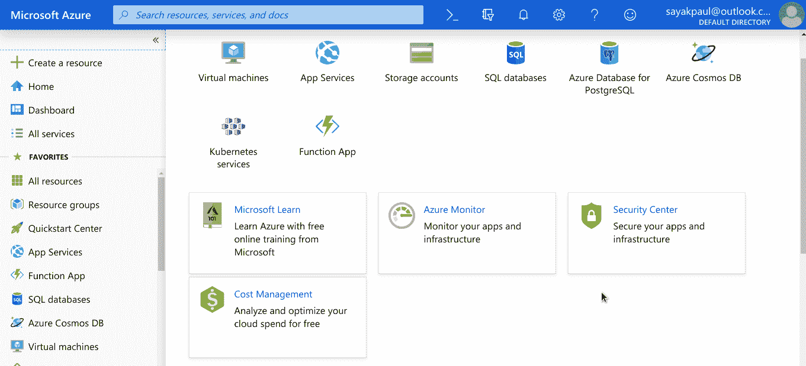
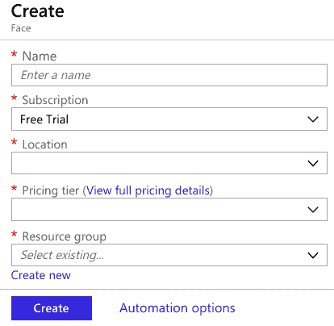
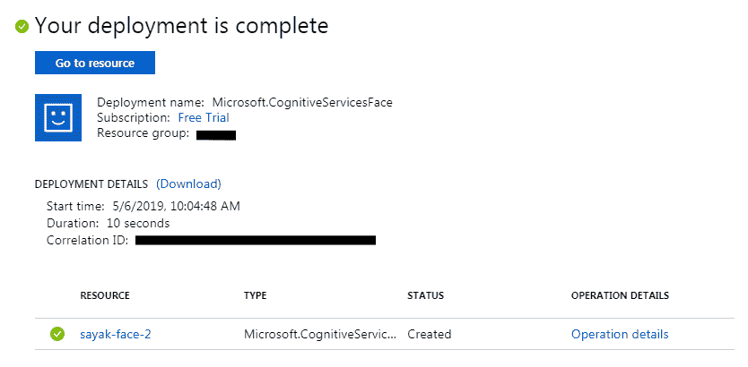
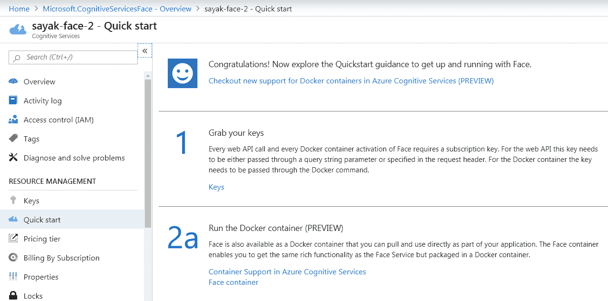
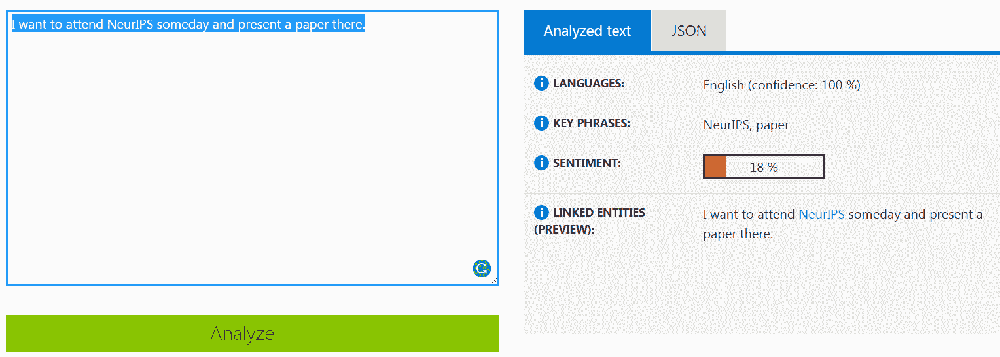
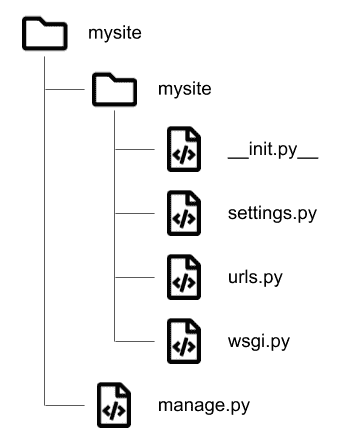
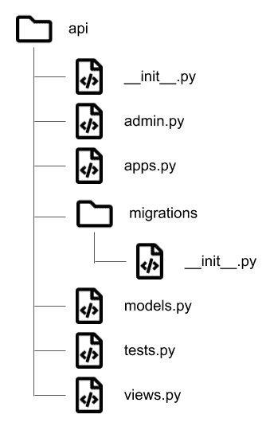
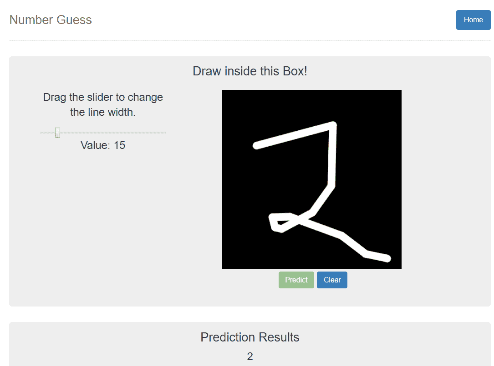

# 使用 Python 在 Microsoft Azure 上进行深度学习

我们将在本章结束我们的云 API 探索之旅。 到目前为止，我们已经将自己轻轻地介绍给了 API 的美好世界，特别是让我们轻松进行深度学习的 API。 我们已经看到了如何使用 REST API 并以编程方式使用它们。 与 **Google Cloud Platform**（**GCP**）和 **Amazon Web Services**（**AWS**）一样，Microsoft 也提供了自己的云服务平台，该平台是 称为 Azure。 与前几章一样，我们将只专注于 Azure 必须提供的基于深度学习的解决方案。 我们将稍作调整，还将介绍 Microsoft 的**认知工具包**（**CNTK**），它是像 Keras 这样的深度学习框架。

在本章中，我们将介绍以下主题：

*   在 Azure 中设置您的帐户
*   快速浏览 Azure 提供的深度学习解决方案
*   在 Python 中使用 Face API
*   在 Python 中使用 Text Analytics API
*   CNTK 简介

# 技术要求

您可以从[这里](https://github.com/PacktPublishing/Hands-On-Python-Deep-Learning-for-Web/tree/master/Chapter8)访问本章的代码。

要运行本章中使用的代码，您将需要以下软件：

*   Python 3.6+
*   Python PIL 库
*   Matplotlib 库

本章将介绍所有其他安装，例如 CNTK 和 Django。

# 在 Azure 中设置您的帐户

根据您以前使用云平台的经验，您可能已经意识到，这一切都始于在云提供商中设置帐户和计费。 这是一个非常标准的工作流程，Azure 也不例外。 因此，让我们转到[这里](https://azure.microsoft.com/)并执行以下步骤：

1.  单击免费启动按钮，如下所示：


请注意，您将需要一个 Microsoft 帐户才能继续以下步骤。 因此，如果您没有，请在[这个页面](https://account.microsoft.com/account)中创建一个。

2.  您将被重定向到另一个页面，在该页面上您将再次看到另一个“免费启动”按钮。 点击它。


3.  系统将要求您登录到您的 Microsoft 帐户以继续。 相应地提供凭据，您应该进入页面，如以下屏幕截图所示：


如果您是首次使用该产品，您将在 30 天内免费获得 200 美元的信用额（取决于您的货币），以浏览 Azure 提供的其他服务。

4.  填写您的详细信息，其中还包括通过卡验证您的身份。

您可能需要为此支付象征性的费用。 请确保查看 Azure 免费套餐的条款和条件，您可以在[这个页面](https://azure.microsoft.com/en-in/offers/ms-azr-0003p/)中找到这些条款和条件。

完成此过程后，您将全部准备就绪并可以移至 [Azure 门户](https://portal.azure.com/#home)，该门户的作用方式与 GCP 和 AWS 控制台相同 您已经在前面的章节中看到过。

Azure 门户如下所示：



现在，您已经设置了 Azure 帐户，让我们在下一部分中探索基于深度学习的 Azure 产品。

# Azure 提供的深度学习服务的演练

Azure 的基于深度学习（和通用机器学习）的产品大致分为三个部分：

*   [**Azure 机器学习服务**](https://azure.microsoft.com/en-in/services/machine-learning-service/)，它提供端到端的服务 机器学习生命周期，包括模型构建，训练和部署：


*   [**机器学习 API**](https://gallery.azure.ai/machineLearningAPIs)，它们为各种学习任务提供 API，例如内容审核，翻译，异常检测， 等等：


*   [**Azure AI**](https://azure.microsoft.com/en-in/overview/ai-platform/)，其重点是诸如**知识挖掘**之类的主题，**决策挖掘**以及计算机视觉和语言建模领域中的许多其他类似的机器学习功能：


现在，我们将研究分别用于计算机视觉任务和自然语言理解任务的两个 API。 我们还将研究如何从 Python 使用这些 API。 让我们潜入。

# 使用 Face API 和 Python 进行对象检测

对象检测是计算机视觉的经典用例，已广泛应用于许多实际问题，例如视频监视系统。 在本节中，我们将使用 Face API 从给定图像中检测面部。 在设计视频监视系统时，可以直接使用。 您可以从[其官方页面](https://azure.microsoft.com/en-us/services/cognitive-services/face/)了解有关 Face API 的更多信息。

# 初始设置

Azure 还可以让您免费试用此 API 7 天。 但是，由于您已经拥有一个 Azure 帐户（我想拥有免费信用），因此我们可以采用另一种方式，如下所示：

1.  登录到您的 Azure 帐户。
2.  转到[这里](https://azure.microsoft.com/en-us/services/cognitive-services/face/)。
3.  单击已经使用 Azure？ 立即免费试用此服务。

现在，您应该有一个窗口，如以下屏幕截图所示：



4.  相应地填写详细信息，完成后单击“创建”。 您将看到一个弹出窗口，显示“正在提交部署”。

部署完成后，您应该进入页面，如以下屏幕截图所示：



5.  单击转到资源，您将被重定向到资源页面，其中包含许多详细信息：



只需向下滚动一点，您将能够看到 Face API 的端点。 请注意，它会根据您在创建部署时输入的配置详细信息而有所不同。 端点看起来像[这里](https://eastus.api.cognitive.microsoft.com/face/v1.0)。 注意这一点。

现在，要能够以编程方式使用 Face API，您需要创建相应的 API 密钥。 在同一页面的顶部，有一个部分显示**抓取密钥**：


6.  在该部分下，单击“密钥”，您将看到以下屏幕截图中的内容：


既然您已经有了 Face API 的 API 密钥，就可以使用它了。

# 从 Python 代码使用 Face API

当您的程序包含诸如 API 密钥之类的安全凭证时，通常最好将这些密钥定义为环境变量，然后在程序中调用它们。 因此，继续创建一个环境变量以存储 Face API 的 API 密钥之一。

要将环境变量添加到计算机，可以在[这个页面](https://www.twilio.com/blog/2017/01/how-to-set-environment-variables.html)上关注此文章。

就我而言，我已将环境变量命名为`face_api_key`。 您可以放置​​任何包含面部的图像。 对于此示例，我将使用以下图像：


创建一个新的 Jupyter 笔记本，然后按照以下步骤操作：

1.  现在，让我们使用 Python 加载环境变量，如下所示：

```py
import os
face_api_key = os.environ['face_api_key']
```

2.  现在，将 Face API 端点（用于对象检测）分配给变量。
3.  此外，将要测试的图像上载到在线文件服务器（例如 Imgur），然后检索允许从 Imgur 提取原始图像的 URL。

就我而言，我已将图像上传到 GitHub 存储库并使用了相应的 URL：

```py
face_api_url = 'https://eastus.api.cognitive.microsoft.com/face/v1.0/detect'

image_url= 'https://raw.githubusercontent.com/PacktPublishing/Hands-On-Python-Deep-Learning-for-Web/master/Chapter8/sample_image.jpg'
```

请注意，在前面的 API 中，仅 URL 末尾的终结点名称发生更改。 在大多数情况下，除非使用 Azure 平台本身要求进行更改，否则在使用认知服务期间，终结点名称之前的部分将保持不变。

4.  现在，导入`requests`模块并设置 API 有效负载，如下所示：

```py
import requests
params = {
'returnFaceId': 'true',
'returnFaceLandmarks': 'false',
'returnFaceAttributes': 'age,gender',
}
```

5.  现在，我们可以向 Face API 发出请求了。

以下代码行可为您完成此操作：

```py
# Define the header param
headers = { 'Ocp-Apim-Subscription-Key': face_api_key }
# Define the body params
params = {
'returnFaceId': 'true',
'returnFaceLandmarks': 'false',
'returnFaceAttributes': 'age,gender',
}
```

6.  现在，我们可以显示从 API 收到的响应：

```py
# Make the call to the API
response = requests.post(face_api_url, params=params, headers=headers, json={"url": image_url})
# Get the response and log
faces = response.json()
print('There are {} faces im the given image'.format(str(len(faces))))
```

在这种情况下，返回的代码如下：

```py
There are 2 faces in the given image
```

请注意`returnFaceAttributes`主体参数，该参数可让您指定面孔的多个属性，并且 Face API 将针对这些属性分析给定的面孔。 要查找有关这些属性的更多信息，请查看[这个页面](http://bit.ly/2J3j6nM)上的文档。

让我们以一种合理的方式将从 API 获得的响应嵌入到图像中。 我们将在图像中显示检测到的面部的可能的性别和可能的年龄。 我们将使用`matplotlib`，`PIL`和`io`库进行此操作，并且我们将使用 Jupyter 笔记本来处理本节中的以下代码段。 我们将从导入库开始：

```py
%matplotlib inline #Only for Jupyter Notebook
import matplotlib.pyplot as plt
from PIL import Image
from matplotlib import patches
from io import BytesIO
```

要使用从 API 收到的响应在图像上显示叠加层，我们使用以下方法：

1.  存储 API 响应：

```py
response = requests.get(image_url)
```

2.  根据响应内容创建图像：

```py
image = Image.open(BytesIO(response.content))
```

3.  创建一个空图：

```py
plt.figure(figsize=(8,8))
```

4.  显示使用响应创建的图像：

```py
ax = plt.imshow(image, alpha=0.6)
```

5.  遍历前面部分中指定的面并提取必要的信息：

```py
for face in faces:
 # Extract the information
 fr = face["faceRectangle"]

 fa = face["faceAttributes"]
 origin = (fr["left"], fr["top"])
 p = patches.Rectangle(origin, fr["width"], fr["height"], fill=False, 
 linewidth=2, color='b')
 ax.axes.add_patch(p)
 plt.text(origin[0], origin[1], "%s, %d"%(fa["gender"].capitalize(), fa["age"]), 
 fontsize=20, weight="bold", va="bottom")
# Turn off the axis
_ = plt.axis("off") 
plt.show()
```

您应该具有这样的图像：


鼓励您尝试使用 API​​提供的不同参数。 现在，我们将研究**自然语言理解**（**NLU**）API。

# 使用 Text Analytics API 和 Python 提取文本信息

无论是有意还是无意，我们都必须遇到自然语言处理的一些惊人用例。 无论是自动更正，下一个单词建议还是语言翻译，这些用例都非常重要而不能忽略。 在本节中，我们将使用[文本分析 API](https://azure.microsoft.com/en-us/services/cognitive-services/text-analytics/) 从中提取有意义的信息 给定的一段文字。

您可以使用前面提到的链接免费试用 API，并查看其功能。 在以下示例中，我输入了短语`I want to attend NeurIPS someday and present a paper there`，Text Analytics API 从中提取了四个有意义的信息：



观察 API 如何从短语中提取所有关键信息。

现在，我们将看到如何使用 Python 以编程方式执行此操作。 设置步骤将与前面的步骤完全相同。 只需转到[这里](https://portal.azure.com/#create/Microsoft.CognitiveServicesTextAnalytics)并按照那里的步骤进行。 一旦拥有使用 API​​的相应 API 密钥，请继续进行以下小节。 别忘了记下各自的端点。 端点应以[这个页面](https://eastus.api.cognitive.microsoft.com/text/analytics/v2.0)开头。 该 URL 不能单独使用； 它需要有一个后缀，指向要调用的正确方法。

# 使用 Python 代码中的 Text Analytics API

本节将向您展示如何在自己的 Python 代码中使用 Text Analytics API。 以下是使用它的步骤：

1.  我们将从导入所需的库开始本节：

```py
import requests
import os
from pprint import pprint
```

2.  然后，我们将从环境变量中加载 Text Analytics API 的 API 密钥：

```py
api_key = os.environ['text_api_key']
```

3.  现在让我们指定一些 URL 来存储 API 端点：

```py
text_analytics_base_url = \
'https://eastus.api.cognitive.microsoft.com/text/analytics/v2.0'
language_api_url = text_analytics_base_url + "/languages"
sentiment_api_url = text_analytics_base_url + "/sentiment"
key_phrase_api_url = text_analytics_base_url + "/keyPhrases"
```

4.  现在，通过提供 API 密钥来定义`headers`参数：

```py
headers = {"Ocp-Apim-Subscription-Key": api_key}
```

5.  我们还要定义 body 参数。 就我而言，我将保留之前在基于 GUI 的演示中显示的相同短语：

```py
documents = { 'documents': [
{ 'id': '1', 'text': 'I want to attend NeurIPS someday and present a paper there.' }
]}
```

6.  现在，我们可以调用 Text Analytics 的各个 API。 让我们从检测语言开始：

```py
response = requests.post(language_api_url, headers=headers, json=documents)
language = response.json()
pprint(language)
```

我们得到相应的响应，如下所示：


请注意，我已突出显示该语言。 现在，让我们继续进行情感分析部分：

```py
response = requests.post(sentiment_api_url, headers=headers, json=documents)
sentiment = response.json()
pprint(sentiment)
```

显示的情感如下所示：


注意，此处使用的短语既不包含正面情感也不包含负面情感，因此不包含得分。 现在，我们将从给定的文本中提取关键短语：

```py
response = requests.post(key_phrase_api_url, headers=headers, json=documents)
phrases = response.json()
print(phrases)
```

关键短语如下所示：


注意端点相对于任务的变化。 您可以在[这个页面](http://bit.ly/2JjLRfi)上探索有关上一示例中使用的端点的不同参数的更多信息。

# CNTK 简介

CNTK 是 Microsoft 提供的产品。 该框架是 ONNX 格式计划的一部分，该计划允许在不同的神经工具套件框架之间轻松转换模型。 该框架负责 Microsoft 软件和平台上的深度学习生产工作量的很大一部分。 该框架于 2016 年推出，一直是 TensorFlow，PyTorch 等流行框架的竞争者。 该框架是完全开源的，可以在[这个页面](http://github.com/microsoft/CNTK)中找到。

CNTK 为企业服务（例如 Cortana 和 Bing）以及广告（例如 Skype Translate，Microsoft Cognitive Services 等）提供动力。 事实证明，它在某些应用上比 TensorFlow 和 PyTorch 等竞争对手更快地工作。

在本节中，我们将研究 CNTK 的一些基础知识，然后继续创建 Django 应用程序以将基于 CNTK 的模型传递到网络上。

# CNTK 入门

CNTK 是最容易上手的框架之一，这得益于其简单的语法和无需会话概念即可工作的能力，就像 TensorFlow 一样，这使大多数学习者感到困惑。 让我们看看如何在本地计算机或 Google Colaboratory 上设置 CNTK。

# 在本地计算机上安装

CNTK 框架支持 64 位和 32 位架构的计算机。 但是，在编写本书时，它仅支持 3.6 版以下的 Python 版本。 您可以在[这个页面](https://pypi.org/project/cntk/)上验证最新支持的版本。 此外，目前，CNTK 无法作为 macOS 上的内置二进制文件使用。

要安装框架，可以使用`pip`程序包管理器，也可以使用 Anaconda 上已编译的二进制文件进行安装。 假设已设置 Python 环境，则可以使用以下命令在 Windows 和 Linux 上安装 CNTK：

*   如果没有 Anaconda，则将以下内容用于 CPU 版本：

```py
# For CPU version
pip install cntk
```

*   将以下内容用于启用 GPU 的版本：

```py
# For the GPU enabled version
pip install cntk-gpu
```

*   在支持 Anaconda 的计算机上，可以使用`pip`通过以下命令安装 CNTK 框架：

```py
pip install <url>
```

可以从 [CNTK 网站](http://tiny.cc/cntk)获得`<url>`。

该命令将类似于以下内容：

```py
pip install https://cntk.ai/PythonWheel/CPU-Only/cntk-2.6-cp35-cp35m-win_amd64.whl
```

现在，我们开始在 Google Colaboratory 中安装它。

# 在 Google 合作实验室上安装

默认情况下，CNTK 框架在 Google Colaboratory 平台上不可用，因此必须与其他必要模块一起安装。 要在 Google Colaboratory 运行时上安装 CNTK，请在脚本顶部使用以下命令：

```py
!apt-get install --no-install-recommends openmpi-bin libopenmpi-dev libopencv-dev python3-opencv python-opencv && ln -sf /usr/lib/x86_64-linux-gnu/libmpi_cxx.so /usr/lib/x86_64-linux-gnu/libmpi_cxx.so.1 && ln -sf /usr/lib/x86_64-linux-gnu/openmpi/lib/libmpi.so /usr/lib/x86_64-linux-gnu/openmpi/lib/libmpi.so.12 && ln -sf /usr/lib/x86_64-linux-gnu/libmpi.so /usr/lib/x86_64-linux-gnu/libmpi.so.12 && pip install cntk
```

请注意，前面的命令是单行命令。 如果将其分成多行，则应确保将所需的更改添加到命令中。

一旦上一步成功运行，您将无需在该运行时再次使用此命令。 因此，该命令可以在程序的将来运行中被注释掉。

通常，通过`C`别名将 CNTK 导入 Python 项目。 我们使用以下代码将库导入项目：

```py
import cntk as C
```

我们可以使用以下行来检查已安装的 CNTK 的版本：

```py
print(C.__version__)
```

将 CNTK 导入到项目中后，我们准备着手创建深度学习模型的先决条件。

# 创建 CNTK 神经网络模型

在本节中，我们将完成创建预测神经网络之前所需的步骤，然后将创建神经网络本身：

1.  首先，将必要的模块导入项目：

```py
import matplotlib.pyplot as plt
%matplotlib inline

import numpy as np
from sklearn.datasets import fetch_openml
import random

import cntk.tests.test_utils
from sklearn.preprocessing import OneHotEncoder

import cntk as C # if you have not done this before in the project
```

`sklearn`模块的`fetch_openml()`方法可帮助我们将本示例中使用的数据集直接下载到项目中，即 MNIST 手写数字数据集。 `OneHotEncoder`方法用于标签的一键编码。

2.  接下来，设置程序执行过程中所需的几个常量：

```py
num_samples = 60000
batch_size = 64
learning_rate = 0.1
```

我们将对 60,000 个样本进行训练，初始学习率为`0.1`。 该速率可以在训练期间动态更新。

3.  然后，我们需要创建一种用于生成随机迷你批的训练方法：

```py
class Batch_Reader(object):
    def __init__(self, data , label):
        self.data = data
        self.label = label
        self.num_sample = data.shape[0]

    def next_batch(self, batch_size):
        index = random.sample(range(self.num_sample), batch_size)
        return self.data[index,:].astype(float),self.label[index,:].astype(float)
```

每次调用时，前面的方法将生成等于上一步中设置的大小的批次，例如，每个批次中有 64 个样本。 这些样本是从数据集中随机抽取的。

4.  现在需要获取数据集； 为此，我们使用以下代码行：

```py
mnist = fetch_openml('mnist_784')
```

提取数据后，可以将其分为训练和测试数据集，如下所示：

```py
train_data = mnist.data[:num_samples,:]
train_label = mnist.target[:num_samples]
test_data = mnist.data[num_samples:,:]
test_label = mnist.target[num_samples:]
```

5.  数据集中的标签在输入训练模型之前需要进行一次热编码。 为此，我们使用以下代码：

```py
enc = OneHotEncoder()
enc.fit(train_label[:,None])
train_encoded = enc.transform(train_label[:,None]).toarray()
```

6.  现在，我们可以为训练批次生成器创建一个生成器对象，如下所示：

```py
train_reader = Batch_Reader(train_data, train_encoded)
```

7.  我们也快速对`test`数据集执行前面的步骤：

```py
enc = OneHotEncoder()
enc.fit(test_label[:,None])
test_encoded = enc.transform(test_label[:,None]).toarray()

test_reader = Batch_Reader(test_data, test_encoded)
```

8.  现在，让我们创建一个 CNTK 神经网络模型。 我们首先从定义一些常量开始：

```py
dimensions = 784
classes = 10
hidden_layers = 3
hidden_layers_neurons = 400
```

我们将输入数据的维度定义为`784`。 回顾“第 3 章”，“创建第一个深度学习 Web 应用程序”的示例，在此我们使用了 MNIST 数据集。 MNIST 数据集中的图像以单维数组的格式存储，其中包含`0`至`255`范围内的`28 x 28`值。 图像属于 10 个不同的类别，分别对应于阿拉伯数字系统中的每个数字。 我们提供 3 个隐藏层，每个包含 400 个神经元。

9.  然后，我们创建两个 CNTK `input`变量，以在创建模型时使用。 这是 CNTK 最重要的概念之一。

```py
input = C.input_variable(dimensions)
label = C.input_variable(classes)
```

CNTK 中的`input`变量本质上是一个占位符，我们在模型训练，评估或测试期间使用它来填充样本。 在此步骤中，数据集输入的形状必须与`input`变量声明中声明的尺寸完全匹配。 在这里重要的是要提到，很多人将输入的维数与数据集具有的特征数量混为一谈。 具有`N`个特征数量和`M`个样本数量的数据集具有（`M`，`N`）形状，因此维度为 这个数据集就是`2`：

```py
def create_model(features):
    with C.layers.default_options(init = C.layers.glorot_uniform(), activation = C.ops.relu):
​
            hidden_out = features
​
            for _ in range(hidden_layers):
                hidden_out = C.layers.Dense(hidden_layers_neurons)(hidden_out)
​
            network_output = C.layers.Dense(classes, activation = None)(hidden_out)
            return network_output
```

10.  我们创建`create_model()`方法，该方法将要素的输入作为参数。

首先，为模型设置默认值，以使用权重初始化和其他值的均匀分布。 默认激活功能设置为`ReLU`。

第一层包含要素本身，最后一层包含向量，其维数等于类的数量。 中间的所有层都包含一个由 3 个隐藏层组成的全连接网络，每个隐藏层都有 400 个神经元，并具有 ReLU 激活功能：

```py
model = create_model(input/255.0)
```

最后，我们使用先前的功能创建模型。 除以`255`可对数据集进行归一化，从而在`0`和`1`之间的图像数组中呈现值。

# 训练 CNTK 模型

创建模型后，我们现在可以继续训练模型并使其学习预测。 为此，我们需要使用 CNTK 模型对象，并将数据集中的样本拟合到该对象。 我们可以同时记录`loss`和其他评估指标。 我们需要执行以下步骤来训练我们的模型：

1.  为`loss`和分类错误创建占位符：

```py
loss = C.cross_entropy_with_softmax(model, label)
label_error = C.classification_error(model, label)
```

2.  现在，我们可以为 CNTK 框架设置一个`trainer`对象，该对象用于执行实际的训练：

```py
lrs = C.learning_rate_schedule(learning_rate, C.UnitType.minibatch)
learner = C.sgd(model.parameters, lrs)
trainer = C.Trainer(model, (loss, label_error), [learner])
```

3.  现在开始进行训练：

```py
epochs = 10
num_iters = (num_samples * epochs) / batch_size

for i in range(int(num_iters)):

    batch_data, batch_label = train_reader.next_batch(batch_size=batch_size)

    arguments = {input: batch_data, label: batch_label}
    trainer.train_minibatch(arguments=arguments)

    if i % 1000 == 0:
        training_loss = False
        evalaluation_error = False
        training_loss = trainer.previous_minibatch_loss_average
        evalaluation_error = trainer.previous_minibatch_evaluation_average
        print("{0}: , Loss: {1:.3f}, Error: {2:.2f}%".format(i, training_loss, evalaluation_error * 100))
```

我们将训练的纪元数设置为`10`，以便进行快速训练和评估。 您可以将其设置为较高的值，以提高训练的准确率； 但是，在某些情况下，这可能不会导致更好的训练或过拟合。 在第 1,000 次迭代中，我们显示直到那时为止的损失和评估误差。 这些的总体趋势应该是下降。

# 测试并保存 CNTK 模型

在继续使用 Django 框架将该项目转换为 Web 应用程序之前，让我们快速测试在模型训练中获得的准确率。 我们将执行以下操作以从模型进行预测：

```py
predicted_label_probs = model.eval({input: test_data})
```

这将为数据集中的每个标签创建一个 NumPy 概率数组。 必须将其转换为索引，并与测试数据的标签进行比较。 我们这样做如下所示：

```py
predictions = np.argmax(predicted_label_probs, axis=1)
actual = np.argmax(test_encoded, axis=1)
correct = np.sum(predictions == actual)
print(correct / len(actual))
```

我们发现预测的准确率约为 98%。 这是一个非常好的价值，我们将继续保存模型并通过 Django 使用它。 为了保存 CNTK 模型，我们执行以下操作：

```py
model.save("cntk.model")
```

成功保存模型后，如果您已使用 Colaboratory 构建模型，则必须将`model`文件下载到本地系统。 接下来，我们可以继续在基于 Django 的服务器上部署模型。

# Django Web 开发简介

Django 是使用 Python 进行 Web 开发的最受欢迎的框架之一。 该框架轻巧，健壮，并由社区积极维护，可快速修补安全漏洞并添加新功能。 在本书中，我们介绍了 Flask 框架，该框架本质上是 Python Web 开发的基本框架。 但是，Django 随附了许多内置功能，这些功能可实现最新的方法和实践。

Django 项目的初始结构如下：



使用`django-admin`工具创建新的 Django 项目时，这些文件会自动生成。 顶级目录`mysite`表示 Django 项目的名称。 每个 Django 项目均包含应用程序。 应用程序类似于软件开发中模块的概念。 它们通常是整个项目的独立部分，并由`mysite`主应用程序放在项目目录中。 每个项目中可以包含多个应用程序。

让我们学习如何开始使用 Django 并创建一个新项目！

# Django 入门

使用 Django 之前，最重要的步骤是安装它。 幸运的是，该框架很容易从 Python PIP 存储库中作为模块安装。 它也可以在 Conda 存储库中找到。 要安装 Django，请打开一个新的终端窗口，然后使用以下命令：

```py
conda install django
```

或者，如果您更喜欢 PIP，请使用以下命令：

```py
pip install django
```

这会将 Django 模块安装到您的 Python 环境中。

要检查是否已成功安装，请在终端中使用以下命令：

```py
python -m django --version
```

这将产生版本号的输出，例如`- 2.0.8`。 如果没有，请检查您的 Django 安装。

# 创建一个新的 Django 项目

Django 提供了一个方便的实用程序`django-admin`工具，该工具可用于生成 Django 项目所需的样板代码。 要创建一个名为`cntkdemo`的新项目，请使用以下代码：

```py
django-admin startproject cntkdemo
```

这将创建所有样板文件夹和文件。 但是，我们必须在项目中创建至少一个应用程序。 使用终端将活动的工作目录更改为`cntkdemo`文件夹。 使用以下命令在此项目中创建一个应用程序：

```py
python manage.py startapp api
```

因此，我们创建了一个名为`api`的文件夹，其中包含以下文件夹； 所有文件都是使用占位符代码和文档自动生成的：



现在，我们可以进行初始 UI 的编码。

# 设置主页模板

现在让我们创建一个网页，该网页在访问`/`路由时加载。 还记得我们在项目中创建的`api`应用吗？ 为了简单起见，使索引页面成为该应用程序的一部分。 虽然可以在`mysite`应用程序的`urls.py`文件中创建此路由，但我们将为`api`应用程序提供其自己的路由处理文件。

让我们从设置主页模板的步骤开始：

1.  在`api`文件夹中创建一个文件`urls.py`。 该文件相对于项目目录的完整路径为`mysite/api/urls.py`。 在此文件中，让我们使用以下代码添加`/`路由：

```py
from django.urls import path

from . import views

urlpatterns = [
 path('', views.indexView), # This line handles the '/' route.
]
```

2.  保存此文件。 前面的代码从本质上为`api`应用添加了新路径`/`（注意，不是项目！）。 它将导入`api`应用程序的`views.py`文件中的所有可用视图。 请注意，`indexView`仍然不存在。 下一步之后，我们将创建此视图。
3.  `api`应用未链接到主项目应用。 我们需要在`mysite/mysite/urls.py`文件中添加以下几行，以通过`api`应用的路由处理程序启用路由处理：

```py
from django.contrib import admin
from django.urls import path
from django.urls import include # -- Add this line!

urlpatterns = [
 path('', include('api.urls')), # -- Add this line!
 path('admin/', admin.site.urls),
]
```

第一行导入了一个实用程序，用于将特定于应用程序的路由设置包括到项目应用程序中。 我们使用它使用`api.urls`字符串将`urls.py`文件包含在`api`应用程序内。 这会自动将字符串转换为试图查找并包含正确文件的代码行。

4.  在`api`应用程序目录内的`views.py`文件中，添加以下行：

```py
from django.http import HttpResponse
from django.template import loader
```

`HttpResponse`方法允许`view`方法返回 HTML 响应。 `loader`类为我们提供了从磁盘加载 HTML 模板的方法。

5.  现在让我们创建`indexView`方法：

```py
def indexView(request):
 template = loader.get_template('api/index.html')
 context = {}
 return HttpResponse(template.render(context, request))
```

`indexView`方法加载`api/index.html`模板文件，并使用`context`词典中提供的变量以及模板可用的`request`参数对其进行呈现。 当前，我们传递空白上下文，因为我们没有任何值可发送到模板。 但是同样，先前定义的`api/index.html`文件不存在。

6.  让我们创建一个用于保存模板的文件夹，并将其链接到项目设置。 为此，请转到项目的根目录并创建一个名为`templates`的文件夹。 我们需要项目能够将该文件夹识别为模板的目录。 为此，我们需要修改`mysite/mysite/settings.py`文件中的`TEMPLATES`设置：

```py
TEMPLATES = [
 {
 'BACKEND': 'django.template.backends.django.DjangoTemplates',
 'DIRS': [os.path.join(BASE_DIR, 'templates')], # -- Add this line!
 'APP_DIRS': True,
 'OPTIONS': {
 'context_processors': [
```

添加上一行后，项目将在`mysite/templates/`文件夹中查找模板。

7.  创建`index.html`模板文件。

    请注意，步骤 4 中的模板文件路由存在于`api`目录中。 在`templates`目录中创建一个名为`api`的文件夹。 在其中，使用以下代码创建`index.html`文件：

```py

...
        <div class="jumbotron">
            <h3 class="jumbotronHeading">Draw here!</h3>
            ...
        </div>
        <div class="jumbotron">
            <h3>Prediction Results</h3> 
            <p id="result"></p>
        </div>
        <div id="csrf"></div>
    </div>
    <script src='https://cdnjs.cloudflare.com/ajax/libs/jquery/2.1.3/jquery.min.js'></script>
    <script src=""></script>
...
```

我们在前面的代码块的末尾包含了一些必需的脚本，其中包括一个从后端获取 CSRF 令牌的脚本。

8.  现在，让我们在上一个代码块中通过`jumbotron`类将`canvas`元素添加到`div`中，在这里我们将绘制数字。 我们还将添加一个用于选择绘图笔宽度的滑块，如下所示：

```py
        <div class="jumbotron">
            <h3 class="jumbotronHeading">Draw here!</h3>        
            <div class="slidecontainer">
                <input type="range" min="10" max="50" value="15" id="myRange">
                <p>Value: <span id="sliderValue"></span></p>
            </div>
            <div class="canvasDiv">
                <canvas id="canvas" width="350" height="350"></canvas>
                <p>
                    <button class="btn btn-success" id="predict-btn" role="button">Predict</button>
                    <button class="btn btn-primary" id="clearButton" role="button">Clear</button>
                </p>
            </div>
        </div>
```

`template`文件还包括两个静态文件-`style.css`和`script.js`。 我们将在接下来的部分中创建这些文件。 我们尚未创建用于将数据发送到服务器并呈现收到的响应的脚本。

9.  现在，我们将开始添加与后端 API 通信所需的 JavaScript 代码。 首先，我们创建一种方法来检查是否需要 CSRF 令牌才能与后端进行通信。 这只是一个实用程序功能，与调用后端 API 无关，后者可能有时被设计为接受没有 CSRF 令牌的请求。 我们创建此函数，如下所示：

```py
<script type="text/javascript">
    function csrfSafeMethod(method) {
        return (/^(GET|HEAD|OPTIONS|TRACE)$/.test(method));
    }
```

10.  然后，我们为`Predict`按钮创建`click`处理程序。 此处理函数首先设置适当的标头，以调用后端 API，然后将画布上显示的图形转换为数据 URL 字符串：

```py
    $("#predict-btn").click(function() {

        var csrftoken = $('input[name=csrfmiddlewaretoken]').val();

        $.ajaxSetup({
            beforeSend: function(xhr, settings) {
                if (!csrfSafeMethod(settings.type) && !this.crossDomain) {
                    xhr.setRequestHeader("X-CSRFToken", csrftoken);
                }
            }
        });

        $('#predict-btn').prop('disabled', true);

        var canvasObj = document.getElementById("canvas");
        var img = canvasObj.toDataURL();

        // MORE CODE TO BE ADDED BELOW THIS LINE

        // MORE CODE TO BE ADDED ABOVE THIS LINE
    });
    </script>
```

11.  最后，我们将代码添加到`Predict`按钮的`click`处理函数中，以使用画布中的数据对后端进行 Ajax 调用，如下所示：

```py
$("#predict-btn").click(function() {
...
        // MORE CODE TO BE ADDED BELOW THIS LINE
        $.ajax({
            type: "POST",
            url: "/predict",
            data: img,
            success: function(data) {
                console.log(data);
                var tb = "<table class='table table-hover'><thead><tr><th>Item</th><th>Confidence</th></thead><tbody>";
                var res = JSON.parse(data);
                console.log(res);

                $('#result').empty.append(res.data);
                $('#predict-btn').prop('disabled', false);
            }
        });
        // MORE CODE TO BE ADDED ABOVE THIS LINE
...
});
    </script>
```

12.  在创建静态文件之前，我们需要为它们创建一个文件夹并将其链接到项目。 这类似于我们创建`templates`文件夹的方式。 首先，在项目目录中使用`mysite/static/`路径创建一个文件夹`static`。 然后，在`mysite/mysite/settings.py`文件中修改`STATIC`配置，如下所示：

```py
STATIC_URL = '/static/'

STATICFILES_DIRS = [
 os.path.join(BASE_DIR, "static"), # -- Add this line!
]
```

现在，我们可以使用模板文件顶部的``指令创建静态文件并将其加载到项目模板中，就像在`index.html`文件中一样。

13.  创建`style.css`和`script.js`-由于这些文件与本书的上下文没有明显关系，因此可以直接从[这里](http://tiny.cc/cntk-demo)下载它们。

请注意，没有`script.js`文件，该项目将无法运行。

我们已经创建了用于预测`index.html`模板文件中存在的画布上绘制的图像的设置。 但是，`/predict`路由尚未创建。 在下一部分中，让我们看看如何在 Django 中加载和使用 CNTK 模型。

# 使用 Django 项目中的 CNTK 进行预测

在本节中，我们将首先设置 CNTK 模型与 Django 一起使用所需的路线，视图和导入。 然后，我们将从保存的文件中加载 CNTK 模型，并使用它进行预测。

# 设置预测路线和视图

回想一下我们如何在`api`应用中创建`/`路线及其对应的视图：

1.  首先，将以下行添加到`mysite/api/urls.py`：

```py
urlpatterns = [
 path('', views.indexView),
 path('predict', views.predictView), # -- Add this line!
]
```

这将创建`/predict`路由。 但是，视图`predictView`尚未创建。

2.  将以下行添加到`api`应用程序中的`views.py`文件中：

```py
from django.http import JsonResponse

def predictView(request):
 # We will add more code below this line

 # We will add more code above this line
 return JsonResponse({"data": -1})
```

请注意前几行中的占位符。 在接下来的步骤中，我们将在此处添加更多内容。

# 进行必要的模块导入

现在，让我们加载使用 CNTK 模型进行预测所需的所有模块，如以下步骤所示：

1.  将以下几行导入添加到`api`应用程序的`views.py`文件中：

```py
import os
from django.conf import settings
```

2.  我们需要前面的导入才能从磁盘加载模型：

```py
import cntk as C
from cntk.ops.functions import load_model
```

前几行将 CNTK 模块导入到 Django 项目。 `load_model`方法将帮助我们加载保存的 CNTK 模型文件。

以下模块用于处理将在其上进行预测的图像：

```py
from PIL import Image
import numpy as np
```

以下模块提供了用于处理 Base64 编码的字符串的实用程序，该格式是`index.html`页在请求中发送画布数据的格式：

```py
import re
import base64
import random 
import string
```

在接下来的部分中将对其他库进行说明。

# 使用 CNTK 模型进行加载和预测

现在，我们将按照以下步骤进一步编辑`predictView`视图：

1.  首先，使用以下代码将 Base64 编码的图像字符串数据读取为变量：

```py
def predictView(request):
 # We will add more code below this line

 post_data = request.POST.items()
 pd = [p for p in post_data]
 imgData = pd[1][0].replace(" ", "+")
 imgData += "=" * ((4 - len(imgData) % 4) % 4)
```

Base64 解码的字符串没有适当的填充，并且包含需要转换为`+`的空格。 上一个代码块中的最后两行对字符串执行相同的操作。

2.  接下来，我们将将此 Base64 编码的字符串转换为 PNG 图像，并通过以下几行将其保存到磁盘：

```py
filename = ''.join([random.choice(string.ascii_letters + string.digits) for n in range(32)])

convertImage(imgData, filename)
```

第一行为文件名创建一个 32 个字符长的随机字符串。 下一行调用`convertImage`方法，该方法将`base64`字符串存储为提供的文件名。

3.  但是，`convertImage`方法尚未定义。 在`predictView`方法之外，添加函数的定义，如下所示：

```py
def convertImage(imgData, filename):
 imgstr = re.search(r'base64,(.*)', str(imgData)).group(1)
 img = base64.b64decode(imgstr)
 with open(filename+'.png', 'wb') as output:
 output.write(img)
```

该方法从字符串中去除多余的元数据。 然后，它解码该字符串并将其另存为 PNG 文件。

4.  让我们回到`predictView`方法。 我们将首先加载保存的`image`文件：

```py
image = Image.open(filename+'.png').convert('1')
```

我们还将图像仅转换为黑白通道。 这样会将图像中的通道数从 3 减少到 1。

5.  回想一下，MNIST 数据集中的所有图像的尺寸均为 28 x28。我们必须将当前图像调整为相同的尺寸。 我们使用以下代码行：

```py
image.thumbnail((28,28), Image.ANTIALIAS)
```

6.  现在，我们使用以下几行将图像转换为 NumPy 数组：

```py
image_np = np.array(image.getdata()).astype(int)
image_np_expanded = np.expand_dims(image_np, axis = 0)
```

`np.expanded_dims`是 NumPy 中的一个简单实用程序，用于为数组添加额外的维度，以与大多数机器学习库保持适当的兼容性。

7.  加载 CNTK 模型。 首先，在项目的根目录中创建一个名为`data`的文件夹，然后将已保存的`model`文件复制到`mysite/data/cntk.model`中。

    现在，我们以`predictView`方法加载 CNTK 模型，如下所示：

```py
model = load_model(os.path.join(settings.BASE_DIR, "data/cntk.model"))
```

8.  最后，我们可以预测图像的标签，如下所示：

```py
predicted_label_probs = model.eval({model.arguments[0]: image_np_expanded})
data = np.argmax(predicted_label_probs, axis=1)
```

`eval`方法在其第一个参数中，期望图像的 NumPy 数组，并返回每个输出类的概率列表。 `np.argmax`方法用于找到概率最高的类别的索引。

9.  要返回输出，请修改`predictView`方法的`return`部分，如下所示：

```py
 # We will add more code above this line
 return JsonResponse({"data": str(data[0])})
```

图像的预测标签将作为 JSON 响应的`data`变量中包含的数字发送，该变量显示在页面上。

# 测试网络应用

最后，我们可以测试我们开发的 CNTK + Django 应用程序。 为此，打开终端并将其定向到项目的根目录。

使用以下命令启动 Django 服务器：

```py
python manage.py runserver
```

如果端口可用，则服务器从`http://localhost:8000`启动。 在网络浏览器中打开页面。 在提供的画布上绘制数字，然后单击“预测”按钮。 您将能够在页面底部看到来自模型的结果，如下所示：



请注意，该模型在前面的屏幕快照 2 中返回了正确的输出。因此，我们得出了使用 Django 部署 CNTK 模型的结论。

# 概要

在本章中，我们介绍了 Microsoft AI 和 Azure 云提供的用于在网站上执行深度学习的产品。 我们了解了如何使用 Face API 来预测图像中人物的性别和年龄，以及如何使用 Text Analytics API 来预测给定文本的语言以及所提供文本或情感中的关键短语 任何句子。 最后，我们在 MNIST 数据集上使用 CNTK 创建了深度学习模型。 我们了解了如何保存模型，然后通过基于 Django 的 Web 应用程序以 API 的形式部署模型。 通过 Django 保存的模型的这种部署可以轻松地适应其他深度学习框架，例如 TensorFlow 或 PyTorch。

在下一章中，我们将讨论使用 Python 构建生产级深度学习应用程序的通用框架。