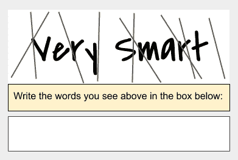
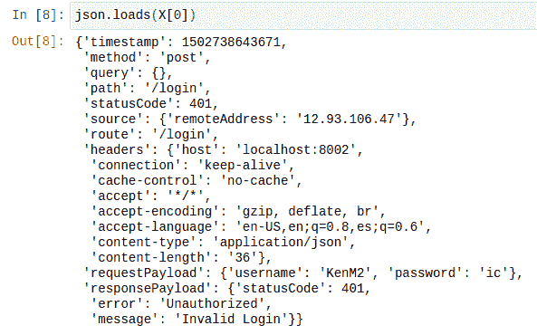
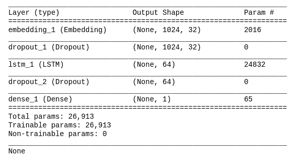
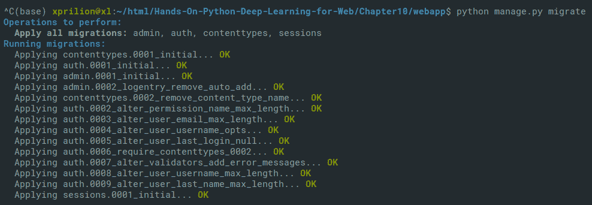
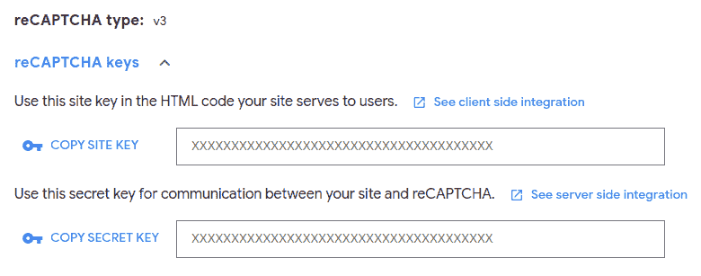
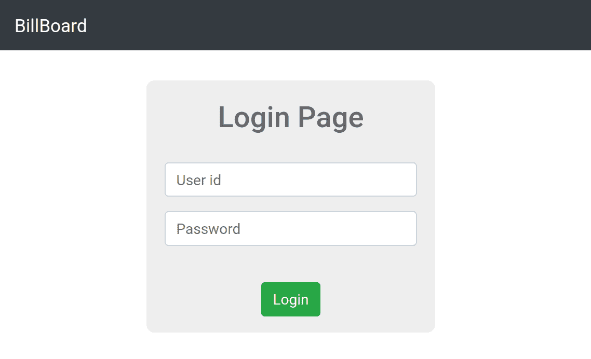
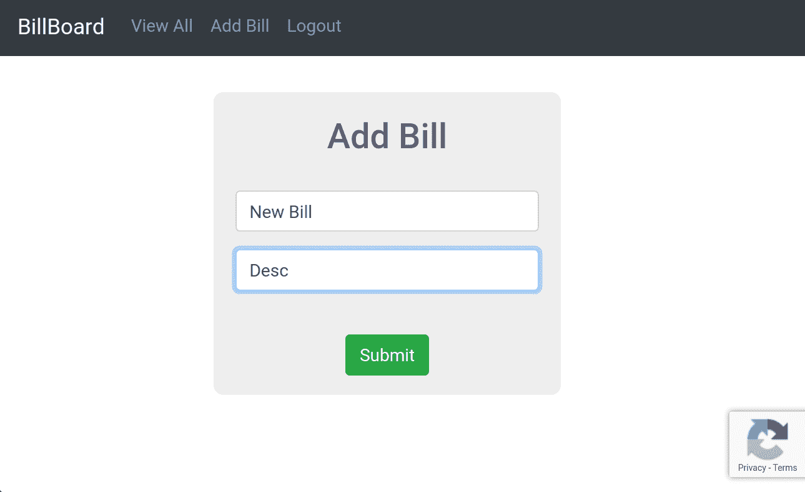

# 通过深度学习保护 Web 应用安全

一般而言，安全性对于任何网站以及所有软件而言都是至关重要的。 如今，安全威胁随着可用计算能力的提高和技术领域的发展而不断发展。 因此，重要的是网站必须采取最佳的安全措施以确保其数据和用户信息的安全。 从事在线商业活动的网站始终处于高风险之中，它们面对从未见过的安全攻击非常普遍。 对于基于规则的安全系统而言，新的攻击尤其难以识别和阻止。 因此，您可以查看由深度学习驱动的安全系统提供的选项，这些选项可以有效替代基于规则的系统，并且还能够正确识别和阻止新威胁。

本章讨论了一些技巧和技术，您可以使用这些技巧和技术通过使用 Python 进行深度学习来保护网站的安全。 我们将介绍 reCAPTCHA 和 Cloudflare，并讨论如何使用它们来增强网站的安全性。 我们还将向您展示如何使用基于深度学习的技术和 Python 后端，实施安全机制来检测网站上的恶意用户。 本章将涵盖以下主题：

*   reCAPTCHA 的故事
*   DIY –在 Django 上进行恶意用户检测
*   使用 Python 在 Web 应用程序中使用 reCAPTCHA
*   Cloudflare 的网站安全

我们将从 reCAPTCHA 的故事开始本章的讨论，reCAPTCHA 是 Google 创造的一种巧妙的工具，它改变了互联网。

# 技术要求

您可以在[这个页面](https://github.com/PacktPublishing/Hands-On-Python-Deep-Learning-for-Web/tree/master/Chapter10)上访问本章的代码。

您需要以下软件来运行本章中的代码：

*   Python 3.6+
*   TensorFlow 1.14
*   Keras 与 TensorFlow 1.14 兼容
*   Django 2.x

# reCAPTCHA 的故事

“对人类易如反掌” – 这是 reCAPTCHA 的口号，它陈述了一个简单的想法，即 reCAPTCHA 是一个系统，该系统确定应用程序或网站上的用户是真正的人类用户还是自动脚本 。 reCAPTCHA 是 CAPTCHA 技术的特定实现，CAPTCHA 技术是一种使用带有扭曲，弯曲的字母和数字的视觉效果，并要求用户解密视觉图像的内容并将其以纯格式写出的方法。

如果您在 2000 年代初期是普通的互联网用户，那么您可能会在许多网站上看到类似于以下验证码的图片：



**CAPTCHA** 是**用于区分计算机和人类得完全自动化的公共图灵测试**的首字母缩写。

在 Yahoo 的推广下，CAPTCHA 系统迅速在数百万个网站上使用。 但是，尽管此系统提供给网站的安全性得到了提高，但它很耗时，并且经常遭到流氓程序员的殴打。 人们常常每隔一段时间就会创建具有不同设计和视觉元素组合的新 CAPTCHA 系统。

同时，开发人员正在解决一个非常不同的问题-将印刷书籍和其他文本数字化。 一种快速的解决方案是扫描书籍。 也就是说，使用**光学字符识别**（**OCR**）将书籍转换为初步的数字文本形式。 对于使用标准字体制成的打印内容，其扫描质量很好，转换效果很好。 但是，打印格式和手稿格式错误会影响转换精度。 人们越来越多地将图像上传到在线平台，以寻求从这些图像中提取文本并将其用于多种目的，例如确定图像中的内容，位置或提及的品牌。

CAPTCHA 的起源与多个组织的发明主张存在争议，但是 Luis von Ahn 在 2003 年创造了 CAPTCHA 这个词，后来他成为 reCAPTCHA 的创始人，该公司被 Google 收购。

众包服务的先驱 Luis von Ahn 使用 reCAPTCHA 程序来显示从印刷书籍扫描中裁切出来的非常小的文本块。 只有人类才能轻松解决这些挑战，自动化程序将失败。 同时，通过未知的众包活动，大量人类用户的贡献将这些书缓慢地数字化。 reCAPTCHA 仍然对用户构成困扰，但图书数字化的问题已解决。

随着时间的流逝，reCAPTCHA 演变为使用基于 AI 的系统来识别真实和虚假用户。 在撰写本书时，reCAPTCHA 由 Google 积极开发，目前处于其第三版本，该版本允许在网页背景中对用户进行无形验证，并且仅在无法成功验证用户时显示挑战 。 这为真正的用户节省了大量时间，并给机器带来了挑战。

我们现在将建立一个网站，以使用基于深度学习的模型和 reCAPTCHA 为网站提供安全元素。

# 恶意用户检测

网站上的恶意用户是任何试图执行未经授权执行任务的用户。 在当今世界，恶意用户所构成的威胁正呈指数级增长，黑客向公众暴露了来自几家全球高科技巨头，政府机构和其他私人公司的巨大个人信息数据库。 拥有可以自动缓解这些恶意攻击的系统非常重要。

为了识别示例 Web 应用程序中的恶意用户，我们创建了一个模型，该模型能够了解用户的常规行为，并且在任何情况下用户的行为与过去的使用情况发生显着变化时，都会发出警报。

异常检测是机器学习的流行分支。 它是一组算法，用于检测给定数据集中的数据样本，这些数据样本不会随大多数数据样本属性一起下降。 在狗窝里检测猫是异常检测。 异常检测以几种方式执行：

*   通过使用列的最小最大范围
*   通过找出数据图中的突然尖峰
*   在数据绘制在高斯曲线下时，通过将位于端点的点标记为离群值（异常）

支持向量机，k 最近邻和贝叶斯网络是用于异常检测的一些最流行的算法。

我们如何定义网站用户的常规行为？

假设您使用的网站通常是使用笔记本电脑登录的。 通常，最多需要两次尝试才能成功登录该网站。 如果有一天您突然开始使用一台新笔记本电脑，则该登录名可能会是可疑的，并且可能是一种恶意尝试来入侵您的帐户。 如果新设备的位置是您最近或从未去过的地方，那就更是如此。 如果您尝试 10 次登录帐户，也将非常可疑。 处于任何可疑使用状态的状态是用户在网站上的通常行为。

有时，异常可能不是由于任何特定用户的不正常行为引起的。 由于服务器的更改，用户的正常流量以及他们的行为可能会更改。 在这种情况下，我们必须注意不要将所有用户标记为恶意用户。 另外，用户的不正常行为可能是由于黑客尝试以外的其他原因引起的。 如果真正的用户突然开始访问他们不应该访问的网站部分，则这是异常现象，需要防止。

在我们的示例网站中，我们将集成这样的系统。 为此，我们将检查网站的登录页面，在该页面上我们将尝试确定用户的登录是正常还是异常。 我们将考虑用户登录的页面，因为一个网站可能有多个登录页面，并尝试确定它是否是用户登录的常用页面。 如果用户尝试从通常不登录的页面登录，我们会将其标记为异常。 这只是检查异常用户的一个简单标准，范围为数百个其他参数。

# 基于 LSTM 的用于验证用户的模型

我们将本节分为两个主要子节：

1.  建立安全检查模型
2.  将模型作为 API 托管

让我们从第一部分开始。

# 建立验证有效性检查的模型

为了根据用户的登录活动对用户进行身份验证，我们将需要一个用于检查请求的 API。 我们可以使用以下步骤构建此模型：

1.  让我们从开发身份验证模型开始，该模型确定用户是否未按常规方式进行操作。 我们首先在运行 Python 3.6+的 Jupyter 笔记本中导入必要的模块，如下所示：

```py
import sys
import os
import json
import pandas
import numpy
from keras.models import Sequential
from keras.layers import LSTM, Dense, Dropout
from keras.layers.embeddings import Embedding
from keras.preprocessing import sequence
from keras.preprocessing.text import Tokenizer
from collections import OrderedDict
```

2.  现在，我们可以将数据导入到项目中。 我们将在[使用数据集](https://github.com/PacktPublishing/Hands-On-Python-Deep-Learning-for-Web/blob/master/Chapter10/model/data/data-full.csv)。 我们将数据集加载到项目中，如下所示：

```py
file = 'data-full.csv'

df = pandas.read_csv(file, quotechar='|', header=None)
df_count = df.groupby([1]).count()
total_req = df_count[0][0] + df_count[0][1]
num_malicious = df_count[0][1]

print("Malicious request logs in dataset: {:0.2f}%".format(float(num_malicious) / total_req * 100))
```

您将看到一些有关数据的常规统计信息，如下所示：


您将看到数据包含文本，如下所示：



此观察很重要，我们将在以后的步骤中参考此屏幕快照。

3.  但是，所有数据都是字符串格式。 我们需要将其转换为适当的值类型。 此外，数据集目前仅包含一个 DataFrame； 我们将使用以下代码将其分为两部分：训练列和标签列：

```py
df_values = df.sample(frac=1).values

X = df_values[:,0]
Y = df_values[:,1]
```

4.  另外，由于只想使用数据集中与任务相关的要素，因此我们需要丢失一些列：

```py
for index, item in enumerate(X):
    req = json.loads(item, object_pairs_hook=OrderedDict)
    del req['timestamp']
    del req['headers']
    del req['source']
    del req['route']
    del req['responsePayload']
    X[index] = json.dumps(req, separators=(',', ':'))
```

5.  完成此操作后，我们现在可以继续对请求正文进行标记化了。 标记化是一种方法，其中我们将大段分解为句子，将句子分解为单词。 我们可以使用以下代码执行令牌化：

```py
tokenizer = Tokenizer(filters='\t\n', char_level=True)
tokenizer.fit_on_texts(X)
```

6.  完成标记化后，我们将每个请求正文条目转换为向量。 这样做是因为我们需要数据的数字表示形式，以便计算机能够对其进行计算。 之后，我们进一步将数据集分为两部分-数据集的 75% 用于训练，其余部分用于测试。 同样，使用以下代码拆分标签列：

```py
num_words = len(tokenizer.word_index)+1
X = tokenizer.texts_to_sequences(X)

max_log_length = 1024
split = int(len(df_values) * .75)

X_processed = sequence.pad_sequences(X, maxlen=max_log_length)
X_train, X_test = X_processed[0:split], X_processed[split:len(X_processed)]
Y_train, Y_test = Y[0:split], Y[split:len(Y)]
```

请记住，从步骤 2 开始，该数据主要包含文本。 当涉及文本数据时，很可能存在上下文和与之关联的特定顺序。

例如，考虑以下句子中的单词 - “Sachin Tendulkar 是伟大的板球运动员”。 为了传达预期的含义，不得更改单词的顺序。 在机器学习中处理文本数据时，这就是维护顺序和上下文的重要性所在的地方。

在我们的案例中，我们将使用一种特殊类型的循环神经网络-**长短期记忆**（**LSTM**），它将学习识别常规的用户行为。

关于 LSTM 的详细讨论超出了本书的范围，但是如果您有兴趣，可以参考[这里](http://bit.ly/2m0RWnx)来详细了解它。

7.  现在，我们使用以下代码添加层以及单词嵌入，这有助于维护数字编码文本和实际单词之间的关系：

```py
clf = Sequential()
clf.add(Embedding(num_words, 32, input_length=max_log_length))
clf.add(Dropout(0.5))
clf.add(LSTM(64, recurrent_dropout=0.5))
clf.add(Dropout(0.5))
clf.add(Dense(1, activation='sigmoid'))
```

我们的输出是单个神经元，在非异常登录尝试或异常登录尝试的情况下，它们分别持有`0`或`1`。

8.  然后，我们使用以下代码编译模型并打印摘要：

```py
clf.compile(loss='binary_crossentropy', optimizer='adam', metrics=['accuracy'])
print(clf.summary())
```

产生了模型摘要，如下所示：



现在，我们准备继续训练模型：

1.  我们使用模型的`fit()`方法，如下所示：

```py
clf.fit(X_train, Y_train, validation_split=0.25, epochs=3, batch_size=128)
```

2.  我们将快速检查模型所达到的准确率。 我们可以看到该模型在验证数据上的准确率超过 96%。 鉴于这是我们的第一个模型，这个分数非常可观。 我们可以使用以下代码检查模型的准确率：

```py
score, acc = clf.evaluate(X_test, Y_test, verbose=1, batch_size=128)
print("Model Accuracy: {:0.2f}%".format(acc * 100))
```

您应该看到如下屏幕截图所示的输出：


3.  让我们节省这些重量。 我们将使用它们来创建用于验证用户身份的 API。 我们可以使用以下代码保存模型：

```py
clf.save_weights('weights.h5')
clf.save('model.h5')
```

准备好模型后，我们现在可以将其作为 Flask API 进行托管。

# 托管自定义身份验证验证模型

现在，让我们创建 API，该 API 将接受用户的登录尝试并返回其对登录有效性的信心：

1.  我们首先导入创建 Flask 服务器所需的模块，如下所示：

```py
from sklearn.externals import joblib
from flask import Flask, request, jsonify
from string import digits

import sys
import os
import json
import pandas
import numpy
import optparse
from keras.models import Sequential, load_model
from keras.preprocessing import sequence
from keras.preprocessing.text import Tokenizer
from collections import OrderedDict
```

2.  现在，我们需要从`model`训练步骤中导入保存的模型和权重。 一旦这样做，我们需要重新编译模型，并使用`make_predict_function()`方法使其模型成为`predict`函数：

```py
app = Flask(__name__)

model = load_model('lstm-model.h5')
model.load_weights('lstm-weights.h5')
model.compile(loss = 'binary_crossentropy', optimizer = 'adam', metrics = ['accuracy'])
model._make_predict_function()
```

3.  我们将使用数据清理功能在客户端应用程序的传入查询中去除数字和其他无用的文本：

```py
def remove_digits(s: str) -> str:
    remove_digits = str.maketrans('', '', digits)
    res = s.translate(remove_digits)
    return res
```

4.  接下来，我们在应用程序中创建`/login`路由，当用户尝试登录时，该路由将接受来自客户端应用程序的登录凭据和其他请求标头详细信息。请注意，我们仍然像在此过程中一样丢弃了一些额外的请求标头。 训练。
5.  清理数据后，我们将其标记化和向量化。 这些步骤与我们在训练期间进行的预处理相同。 这是为了确保对传入请求的处理与训练阶段完全相同：

```py
@app.route('/login', methods=['GET, POST'])
def login():
    req = dict(request.headers)
    item = {}
    item["method"] = str(request.method)
    item["query"] = str(request.query_string)
    item["path"] = str(request.path)
    item["statusCode"] = 200
    item["requestPayload"] = []

    X = numpy.array([json.dumps(item)])
    log_entry = "store"

    tokenizer = Tokenizer(filters='\t\n', char_level=True)
    tokenizer.fit_on_texts(X)
    seq = tokenizer.texts_to_sequences([log_entry])
    max_log_length = 1024
    log_entry_processed = sequence.pad_sequences(seq, maxlen=max_log_length)

    prediction = model.predict(log_entry_processed)
    print(prediction)
    response = {'result': float(prediction[0][0])}
    return jsonify(response)
```

最后，应用程序以 JSON 形式返回对用户进行身份验证的信心。

6.  要在所需端口上运行服务器，我们需要在脚本末尾添加以下行：

```py
if __name__ == '__main__':
    app.run(port=9000, debug=True)
```

7.  最后，我们将服务器脚本文件另存为`main.py`。 我们将通过在系统上使用以下命令来使服务器运行：

```py
python main.py
```

这将启动 Flask 服务器，该服务器侦听回送 IP `127.0.0.1`和端口`9000`。 您可以轻松地将此脚本托管在云中的虚拟机上，并作为通用的安全检查点 API 将其提供给所有应用程序和网站。

现在，我们可以继续创建在 Django 框架上运行的 Web 应用程序。

# 一个使用 API​​的基于 Django 的应用

我们创建的使用用户身份验证检查 API 的网站将是一个简单的广告牌演示。 该网站将规定用户登录然后将帐单发布到广告牌。 尽管该应用程序很简单，但它包含基于深度学习的安全集成的两个主要功能-用户身份验证期间的异常检测以及账单发布期间 reCAPTCHA 的实现-避免垃圾邮件。

以下各节将讨论创建应用程序的步骤。

# Django 项目设置

在本节中，我们将使用 Django。 在继续本节之前，请确保在系统上安装了有效的 Django。 您可以在“第 8 章”，“使用 python 在 Microsoft Azure 上进行深度学习”的“Django Web 开发简介”部分中找到 Django 的安装说明。

现在，我们将创建一个 Django 项目。 为此，我们使用以下命令：

```py
django-admin startproject webapp
```

这将在当前文件夹中创建`webapp`目录。 我们将在此目录中添加所有将来的代码。 当前目录结构如下：

```py
webapp/
    manage.py
    webapp/
        __init__.py
        settings.py
        urls.py
        wsgi.py
    db.sqlite3

```

完成此操作后，我们现在准备在项目内部创建一个应用程序，这将在下一部分中显示。

# 在项目中创建一个应用

如“第 8 章”，“在 Microsoft Azure 上使用 Python 进行深度学习”中所述，我们现在必须将应用程序添加到网站项目中。 为此，我们使用以下命令：

```py
cd webapp
python manage.py startapp billboard
```

前面的命令将在项目中创建一个名为`billboard`的应用程序。 但是，我们仍然必须将此应用程序链接到项目。

# 将应用程序链接到项目

要将应用添加到项目中，我们需要将应用名称添加到项目设置文件中`settings.py`中的应用列表中，如以下代码所示。 在`settings.py`中，添加以下更改：

```py
# Application definition

INSTALLED_APPS = [
    'billboard',  # <---- ADD THIS LINE
    'django.contrib.admin',
    'django.contrib.auth',
    'django.contrib.contenttypes',
    'django.contrib.sessions',
    'django.contrib.messages',
    'django.contrib.staticfiles',
]
```

这样，我们准备在网站上创建路线。

# 向网站添加路线

要向项目添加路线，我们编辑`webapp`的`urls.py`文件：

```py
from django.contrib import admin
from django.urls import path, include # <--- ADD 'include' module

urlpatterns = [
    path('', include('billboard.urls')), # <--- ADD billboard.urls path
    path('admin/', admin.site.urls),
]
```

但是，`billboard.urls`路径不存在。 我们将创建前进的道路。

# 在布告栏应用程序中创建路线处理文件

在`billboard`文件夹中创建一个名为`urls.py`的新文件，如下所示：

```py
from django.urls import path
from django.contrib.auth.decorators import login_required

from . import views

urlpatterns = [
    path('', login_required(views.board), name='View Board'),
    path('add', login_required(views.addbill), name='Add Bill'),
    path('login', views.loginView, name='Login'),
    path('logout', views.logoutView, name='Logout'),
]
```

将其另存为`webapp/billboard/urls.py`。 请注意，我们已将一些`views`项目导入此路由处理文件。 另外，我们使用了`login_required`方法。 这表明我们可以开始对网站进行身份验证。

# 添加认证路由和配置

要添加用于验证的路由，请在`webapp/settings.py`文件的末尾添加以下内容：

```py
LOGIN_URL = "/login"
LOGIN_REDIRECT_URL = '/'
LOGOUT_REDIRECT_URL = '/logout'
```

这些行表明我们将需要`/login`和`/logout`路线。

# 创建登录页面

要创建登录页面，我们需要在广告牌应用中将`/login`路由添加到`urls.py`。 但是，我们已经做到了。 接下来，我们需要将`loginView`视图添加到布告栏应用程序的`views.py`文件中：

```py
def loginView(request):
    if request.user.is_authenticated:
        return redirect('/')
    else:
        if request.POST:
            username = request.POST['username']
            password = request.POST['password']
            user = authenticate(request, username=username, password=password)
            ## MORE CODE BELOW THIS LINE

            ## MORE CODE ABOVE THIS LINE
            else:
                return redirect('/logout')
        else:
            template = loader.get_template('login.html')
            context = {}
            return HttpResponse(template.render(context, request))
```

前面的功能首先检查用户数据库中是否存在传递给用户名和密码的用户名和密码。 因此，将来，我们将需要一个用户模型来将用户存储在数据库文件`db.sqlite3`中，该文件是在项目创建步骤中创建的。

然后，该函数将调用身份验证检查模型 API，以验证用户登录是否正常。 验证按以下代码进行：

```py
def loginView(request):
    ...
            ## MORE CODE BELOW THIS LINE            
            if user is not None:
                url = 'http://127.0.0.1:9000/login'
                values = { 'username': username, 'password': password }
                data = urllib.parse.urlencode(values).encode()
                req = urllib.request.Request(url, data=data)
                response = urllib.request.urlopen(req)
                result = json.loads(response.read().decode())
                if result['result'] > 0.20:
                    login(request, user)
                    return redirect('/')
                else:
                    return redirect('/logout')
            ## MORE CODE ABOVE THIS LINE
    ...
```

前面的代码块验证用户登录，如果发现用户登录无效，则执行注销操作，并将用户重定向回再次登录。

为此，我们需要向`view.py`文件添加一些必要的导入，如下所示：

```py
from django.shortcuts import redirect
from django.contrib.auth import authenticate, login, logout

from django.http import HttpResponse
from django.template import loader

from django.conf import settings
from django.urls import reverse_lazy
from django.views import generic

from django.contrib.auth.models import User

import urllib
import ssl
import json
```

注意，我们还从`django.contrib.auth`导入了`logout`方法。 这将用于创建`logout`视图。

# 创建注销视图

现在，让我们创建`logout`视图。 这样做非常简单，如下所示：

```py
def logoutView(request):
    logout(request)
    return redirect('/')
```

现在，让我们创建登录页面的模板。

# 创建登录页面模板

要创建模板，我们首先需要创建所需的文件夹。

在`billboard`目录中创建一个名为`templates`的文件夹。 现在，目录结构将类似于以下代码：

```py
webapp/
    manage.py
    webapp/
        __init__.py
        settings.py
        urls.py
        wsgi.py
    billboard/
        templates/
        ___init_.py
        admin.py
        apps.py
        models.py
        tests.py
        urls.py
        views.py
```

在`templates`文件夹内，我们将放置模板文件。 首先创建`base.html`，我们将在所有其他模板中进行扩展。 这将包含`CSS`和`JS`包含，以及页面的常规块结构。

我们已在[这里](https://github.com/PacktPublishing/Hands-On-Python-Deep-Learning-for-Web/blob/master/Chapter10/webapp/billboard/templates/base.html)提供了此文件的示例。

完成此操作后，我们准备创建`login.html`文件，该文件将执行将登录值发送到服务器的过程：

```py


<div class="container">
    <div class="row">
        <div class="form_bg">
            <form method="post">
                
                <h2 class="text-center">Login Page</h2>
                # WE'LL ADD MORE CODE BELOW THIS LINE
                ...
                # WE'LL ADD MORE CODE ABOVE THIS LINE
            </form>
        </div>
    </div>
</div>

```

注意，我们已经在前面的视图模板中扩展了`base.html`模板。

您可以在[这个页面](https://tutorial.djangogirls.org/en/template_extending/)上阅读有关扩展 Django 模板的更多信息。

此登录页面中的表单发出`POST`请求，因此需要传递 CSRF 令牌。 现在，我们可以创建登录完成后呈现的页面。

# 广告牌页面模板

由于我们已经设置了`base.html`文件，因此我们可以简单地在`board.html`模板文件中对其进行扩展以创建广告牌显示页面：

```py


<div class="container">
    <div class="row">
        
        <div class="col-sm-4 py-2">
            <div class="card card-body h-100">
                <h2>{{ bill.billName }}</h2>
                <hr>
                <p>
                    {{ bill.billDesc }}
                </p>
                <a href="#" class="btn btn-outline-secondary">{{ bill.user.username }}</a>
            </div>
        </div>
        
    </div>
</div>

```

在前面的代码块中，我们遍历了广告牌数据库中所有可用的`bills`项目，并使用模板中的`for`循环显示了它们。 `base.html`模板的使用允许我们减少视图模板中的重复代码量。

此后，我们将创建一个页面，该页面具有将新账单添加到广告牌的代码。

# 添加到广告牌页面模板

要创建将帐单添加到广告牌的页面模板，我们使用以下代码创建`add.html`模板文件：

```py


<div class="container">
    <div class="row">
        <div class="form_bg">
            <form method="post" id="form">
                
                <h2 class="text-center">Add Bill</h2>
                <br />
                <div class="form-group">
                    <input type="text" class="form-control" id="billname" name="billname" placeholder="Bill Name">
                </div>
                <div class="form-group">
                    <input type="text" class="form-control" id="billdesc" name="billdesc" placeholder="Description">
                </div>
                <br />
                <div class="align-center">
                    <button type="submit" class="btn btn-success" id="save">Submit</button>
                </div>
            </form>
        </div>
    </div>
</div>

```

在前面的代码块中，我们扩展了`base.html`模板以添加允许我们添加帐单的表格。 注意`form`元素中 CSRF 令牌的使用。 在 Django 中，我们始终需要在发出 POST 请求时传递有效的 CSRF 令牌。

您可以在[这个页面](https://docs.djangoproject.com/en/3.0/ref/csrf/)上了解有关 Django 中 CSRF 令牌的更多信息。

但是，等等，我们还没有添加视图来处理广告牌页面和添加账单页面。 让我们现在添加它们！

# 广告牌模型

我们需要添加视图以在广告牌页面上查看所有账单。 但是，为此，我们首先需要创建一个模型来保存所有账单。

在`models.py`文件中，添加以下代码：

```py
from django.utils.timezone import now
from django.contrib.auth.models import User

class Bills(models.Model):
    billName = models.CharField("Bill Name", blank=False, max_length=100, default="New Bill")
    user = models.ForeignKey(User, on_delete=models.CASCADE)
    billDesc = models.TextField("Bill Description")
    billTime = models.DateTimeField(default=now, editable=False)

    class Meta:
        db_table = "bills"
```

在前面的代码中，我们创建了一个名为`Bills`的新模型。 这将存储用户在广告牌上添加的所有账单的详细信息。 `user`模型与此模型链接为外键。 将此文件另存为`webapp/billboard/models.py`。

您可以在[这个页面](https://www.sqlite.org/foreignkeys.html)上了解有关外键和其他键的更多信息。

完成此操作后，我们现在可以在视图中使用`Bills`模型。

# 创建广告牌视图

要开始在应用程序中使用`Bills`模型，我们首先需要将其导入`views.py`文件。

在`view.py`文件的顶部添加以下行：

```py
from .models import Bills
```

然后，我们可以为广告牌添加视图，如下所示：

```py
def board(request):
    template = loader.get_template('board.html')
    context = {}
    context["isLogged"] = 1

    Bill = Bills.objects.all()

    context["bills"] = Bill

    return HttpResponse(template.render(context, request))
```

接下来，我们需要创建用于添加账单的视图。

# 创建账单并添加视图

在此视图中，我们将创建账单。 如果对由`addbill`方法提供服务的路由提出了有效的`POST`请求，我们将创建一个新的`Bill`对象并将其保存到数据库中。 否则，我们显示用于向用户添加账单的表格。 让我们看看如何在以下代码中执行此操作：

```py
def addbill(request):
    if request.POST:
            billName = request.POST['billname']
            billDesc = request.POST['billdesc']
            Bill = Bills.objects.create(billName=billName, user=request.user, billDesc=billDesc)
            Bill.save()
            return redirect('/')
    else:
        template = loader.get_template('add.html')
        context = {}
        context["isLogged"] = 1

        return HttpResponse(template.render(context, request))
```

但是，在使用该应用之前，我们仍然需要创建管理员用户。

# 创建管理员用户并对其进行测试

要创建管理员用户，我们使用以下命令：

```py
 python manage.py createsuperuser
```

现在，我们可以使用以下命令来迁移数据库更改：

```py
python manage.py makemigrations
python manage.py migrate
```

产生类似于以下内容的输出：



现在，让我们使用 reCAPTCHA 工具保护广告牌发布。

# 使用 Python 在 Web 应用程序中使用 reCAPTCHA

要将 reCAPTCHA 添加到网站，我们首先需要从 Google reCAPTCHA 控制台获取 API 密钥：

1.  首先，登录到您的 Google 帐户，然后转到[这里](https://www.google.com/recaptcha)。
2.  接下来，点击右上角的管理控制台。
3.  按照屏幕上显示的步骤将站点添加到控制台。 如果要在本地系统上进行测试，则必须指定`127.0.0.1`作为 URL 之一。
4.  获取您的域的 API 密钥。

    您打开域的 API 密钥的屏幕应类似于以下屏幕截图：



5.  现在，将密钥添加到 Web 应用程序的`settings.py`文件中，如下所示：

```py
GOOGLE_RECAPTCHA_SECRET_KEY = '6Lfi6ncUAAAAANJYkMC66skocDgA1REblmx0-3B2'
```

6.  接下来，我们需要将要加载的脚本添加到`add.html`模板中。 我们将其添加到广告牌应用页面模板中，如下所示：

```py
<script src="https://www.google.com/recaptcha/api.js?render=6Lfi6ncUAAAAAIaJgQCDaR3s-FGGczzo7Mefp0TQ"></script>
<script>
    grecaptcha.ready(function() {
        grecaptcha.execute('6Lfi6ncUAAAAAIaJgQCDaR3s-FGGczzo7Mefp0TQ')
        .then(function(token) {
            $("#form").append('<input type="hidden" name="g-recaptcha-response" value="'+token+'" >');
        });
    });
</script>


```

请注意，此步骤中使用的密钥是客户端/站点密钥。

7.  最后，我们需要在添加广告牌视图中验证 reCAPTCHA，如下所示：

```py
def addbill(request):
    if request.POST:
        recaptcha_response = request.POST.get('g-recaptcha-response')
        url = 'https://www.google.com/recaptcha/api/siteverify'
        values = {  'secret': settings.GOOGLE_RECAPTCHA_SECRET_KEY,
                    'response': recaptcha_response}
        context = ssl._create_unverified_context()
        data = urllib.parse.urlencode(values).encode()
        req = urllib.request.Request(url, data=data)
        response = urllib.request.urlopen(req, context=context)
        result = json.loads(response.read().decode())
        if result['success']:
            # Do stuff if valid
    else:
        # Do actions when no request is made
```

您可以从[这个页面](https://github.com/PacktPublishing/Hands-On-Python-Deep-Learning-for-Web/blob/master/Chapter10/webapp/billboard/views.py)中的上一个代码块中获取`addbill`方法的完整工作版本。

经过先前的更改，我们终于可以使用所有安全措施来测试运行该网站了。 运行以下命令以启动网站服务器：

```py
python manage.py runserver
```

您应该能够看到网站的登录页面，如下所示：



请注意，此时，您将需要同时运行执行登录验证的 Flask 服务器。

登录后，您将看到在广告牌页面上贴有账单的页面。 转到“添加帐单”按钮以添加新帐单，如下所示：



请注意屏幕右下角的 reCAPTCHA 徽标。 这表明使用 reCAPTCHA 保护了页面免受垃圾邮件的侵扰。 如果您能够成功过帐，则显示已提交的帐单的广告牌。 否则，您将面临 reCAPTCHA 验证挑战。

# Cloudflare 的网站安全

Cloudflare 是业界领先的 Web 基础架构和网站安全提供商。 它在网站及其用户之间创建了一层安全性和快速的内容交付，从而通过其服务器路由所有流量，从而实现了网站的安全性和其他功能。 2017 年，Cloudflare 为超过 1200 万个网站提供了 DNS 服务。 这些服务包括内容交付网络，**分布式拒绝服务**（**DDoS**）攻击保护，黑客尝试保护以及其他 Internet 安全服务，例如水浸保护。

2014 年，Cloudflare 报告减轻了对客户的 400 Gib / s DDoS 攻击，随后不久又于次年进行了 500 Gib / s 的攻击。 在记录的任何网站上，最大的攻击是在 GitHub 上，该站点面临 1.4Tb / s 的 DDoS 泛洪。 GitHub 使用的是 Akamai Prolexic（Cloudflare 的替代产品），并且能够承受攻击，仅下降了 10 分钟，然后完全恢复正常。 Cloudflare 免费为其所有用户提供 DDoS 防护。

要开始在您的网站上部署 Cloudflare 服务，您需要将 Cloudflare 设置为用户和托管服务器之间的中间层。 下图描述了 Cloudflare 如何位于网络上：


因此，Cloudflare 会自动在基本范围内（通过 Google 的 reCAPTCHA 帮助我们检测以前创建了自定义解决方案的垃圾邮件和恶意用户）（在免费层中，在更高层中具有更强大的解决方案） 升级时）。 因此，对于一小群开发人员而言，将他们的安全需求推向 Cloudflare 的系统并确保他们免受许多安全漏洞的侵害是非常直观和简单的。

# 概要

在本章中，我们了解了如何使用 Cloudflare 的服务为网站提供安全性。 我们还看到了如何创建可与 Web 应用程序和其他安全服务（例如 reCAPTCHA）集成使用的安全 API。 任何规模的网站都必须采取这些安全措施，以使其网站服务正常运行，这一点至关重要。 近年来发生了重大漏洞，而 AI 驱动系统尝试了无数漏洞，这些漏洞由于不是问题而没有成为新闻。 使用深度学习进行安全性研究是一个紧迫的话题，并且相信在不久的将来，安全系统都将完全依靠深度学习来识别和消除威胁。

在下一章中，我们将讨论如何建立生产级深度学习环境。 我们将讨论您可以遵循的架构设计，具体取决于它们的大小要求以及最新的服务提供商和工具。