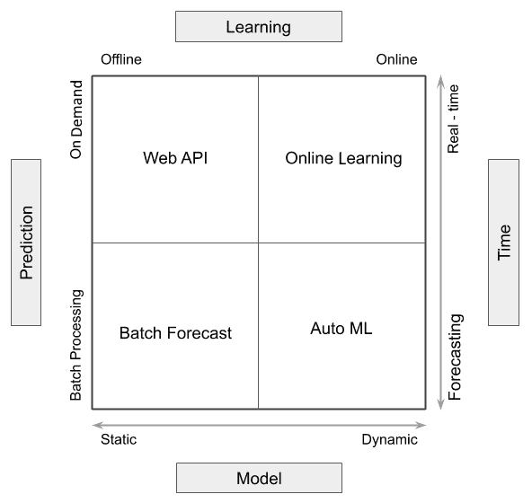
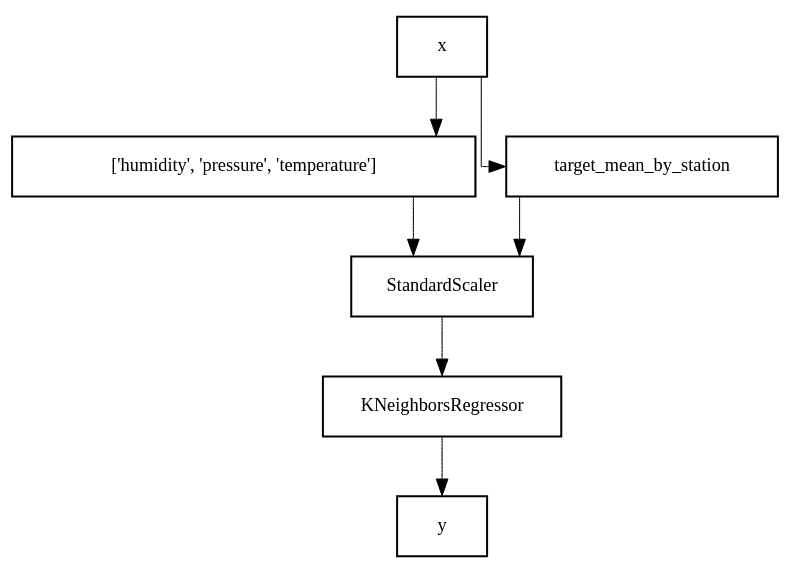
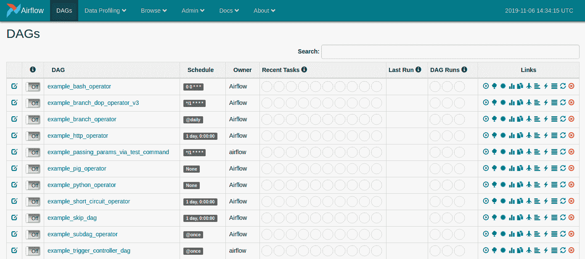
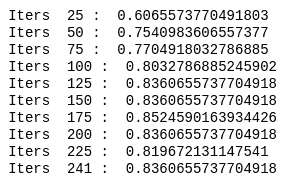
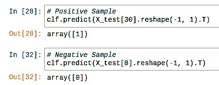
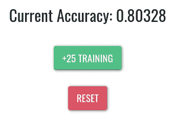

# 十一、DIY - Web DL 生产环境

在先前的章节中，我们了解了如何使用一些著名的**深度学习**（**DL**）平台，例如 **Amazon Web Services**（**AWS**） ， **Google Cloud Platform**（**GCP**）和 Microsoft Azure，以在我们的 Web 应用中启用 DL。 然后，我们看到了如何使用 DL 使网站安全。 但是，在生产中，挑战通常不仅是建立预测模型，当您要更新已经向用户发送响应的模型时，就会出现真正的问题。 在替换模型文件的 30 秒或 1 分钟内，您可能损失多少时间和业务？ 如果有为每个用户定制的模型怎么办？ 这甚至可能意味着数十亿美元的模型用于 Facebook 之类的平台。

您需要确定的解决方案来更新生产中的模型。 另外，由于摄取的数据可能不是采用训练的格式，因此您需要定义数据流，以便以无缝方式将其变形以供使用。

在本章中，我们将讨论更新生产模型的方法以及选择每种方法的思路。 我们将从简要概述开始，然后演示一些用于创建 DL 数据流的著名工具。 最后，我们将实现自己的在线学习或增量学习演示，以建立更新生产模型的方法。

我们将在本章介绍以下主题：

*   生产方法中的 DL 概述
*   在生产中部署 ML 的流行工具
*   实现 DL Web 生产环境演示
*   将项目部署到 Heroku
*   安全性，监视和表现优化

# 技术要求

您可以在[这个页面](https://github.com/PacktPublishing/Hands-On-Python-Deep-Learning-for-Web/tree/master/Chapter11)上访问本章的代码。

您需要以下软件来运行本章中使用的代码：

*   Python 3.6+
*   Flask 1.1.12+

所有其他安装将在本章中进行。

# 生产方法中的 DL 概述

无论是 DL 还是经典的**机器学习**（**ML**），在生产中使用模型时，都会遇到挑战。 主要原因是数据助长了机器学习，并且数据会随着时间而变化。 在生产中部署 ML 模型时，由于数据会随着时间不断变化，因此会每隔一定间隔对其进行重新训练。 因此，当您考虑基于生产的目的时，对 ML 进行再训练不是奢侈的事情，而是必需品。 DL 只是 ML 的一个子字段，它也不例外。 机器学习模型有两种流行的训练方法：批量学习和在线学习，尤其是在生产中。

我们将在下一部分中讨论在线学习。 在本节中，让我们自我介绍批量学习的概念。 在批量学习中，我们首先在特定数据块上训练 ML 模型，然后在对该数据块进行训练后，再为模型提供下一个数据块，此过程将继续进行，直到所有数据块都用完为止。 这些块称为批量。

在现实生活中的项目中，您将一直在处理大量数据。 一次将这些数据集放入内存中并不理想。 在这种情况下，批量学习对我们有帮助。 使用批量学习有一些缺点，我们将在下一节中介绍它们。 您可能想知道（也可能不是），但是是的，只要在本书中训练神经网络，我们就会执行批量学习。

就像训练一样，批量的概念也可以应用于服务 ML 模型。 在这里服务 ML 模型意味着使用机器模型对看不见的数据点进行预测。 这也称为推理。 现在，模型服务可以分为两种类型：在线服务和在线服务，其中在线服务需要在模型与数据点相遇时做出预测（在这里我们无法承受延迟），离线服务则首先需要收集一批数据点，然后通过模型运行批量以获得预测。 请注意，在第二种情况下，我们可以选择一些延迟。

请注意，还有一些工程方面直接与生产 ML 系统相关。 讨论这些内容不在本书的讨论范围之内，但是 GCP 小组鼓励您在线查看课程。

让我们尝试使用下图总结并进一步理解前面的讨论：



此图描述了 AI 后端的要求以及可能影响您选择的解决方案选择的各种参数。 我们将在下一节中讨论该图中所有可用的方面和选择。

因此，我们在生产中的 DL 实现中通常可以找到四种主要类型的解决方案：

*   Web API 服务
*   在线学习
*   批量预测
*   AutoML

让我们详细研究它们中的每一个。

# Web API 服务

我们有一个模型，该模型由后端上的单独脚本训练，然后存储为模型，然后部署为基于 API 的服务。 在这里，我们正在寻找一种按需产生结果，但训练是离线进行的解决方案（不在负责响应客户端查询的那部分代码的执行范围内）。 Web API 一次响应单个查询并产生单个结果。

迄今为止，这是在生产中部署 DL 的最常用方法，因为它允许数据科学家离线进行准确的训练，并使用简短的部署脚本来创建 API。 在本书中，我们主要进行了这种部署。

# 在线学习

通过后端进行的按需预测的另一种形式是在线学习。 但是，在这种方法中，学习是在服务器脚本执行期间进行的，因此该模型随每个相关查询而不断变化。 尽管这种方法是动态的并且不太可能过时，但它通常不如静态的 Web API 准确。 在线学习也一次产生一个结果。

在本章中，我们演示了在线学习的示例。 在接下来的部分中，我们将讨论有助于在线学习的工具。

# 批量预测

在这种方法中，许多预测一次完成并存储在服务器上，随时可以在用户需要时提取和使用。 但是，作为静态训练方法，此方法允许离线训练模型，因此类似于 Web API，为训练提供了更高的准确率。

换句话说，批量预测可以理解为 Web API 的批量版本。 但是，API 不提供这些预测。 相反，预测是从数据库中存储和获取的。

# AutoML

进行预测只是将 DL 投入生产的整个过程的一部分。 数据科学家还负责清理和组织数据，创建管道以及进行优化。 Auto ML 是一种无需执行此类重复任务的方法。

Auto ML 是一种批量预测方法，无需人工干预。 因此，数据通过管道传递，并且定期更新预测。 因此，此方法比批量预测方法提供了更多最新的预测。

现在让我们讨论一些工具，这些工具可以快速实现我们介绍的某些方法。

# 在生产中部署 ML 的流行工具

在本节中，我们将讨论一些用于将 ML 放入生产系统中的流行工具。 这些工具提供的核心工具是使学习-预测-反馈流程自动化，并有助于监视模型的质量和表现。 尽管很有可能为此创建自己的工具，但强烈建议您根据软件要求使用以下任何工具。

让我们开始讨论`creme`。

# `creme`

`creme`是一个 Python 库，可让我们有效地执行在线学习。 在实际研究`creme`之前，让我们简要讨论一下在线学习本身：


在在线学习中，机器学习模型一次只针对一个实例进行训练，而不是针对一批数据进行训练（这也称为批量学习）。 为了能够欣赏在线学习的使用，了解批量学习的弊端很重要：

*   在生产中，我们需要随着时间的推移在新数据上对 ML 模型进行重新训练。 批量学习迫使我们这样做，但这是有代价的。 代价不仅在于计算资源，还在于从头开始重新训练模型的事实。 从头开始训练模型在生产环境中并不总是有用的。
*   数据的功能和标签会随时间变化。 批量学习不允许我们训练可以支持动态功能和标签的 ML 模型。

这正是我们需要使用在线学习的地方，这使我们能够执行以下操作：

*   一次仅使用一个实例训练 ML 模型。 因此，我们将不需要大量数据来训练 ML 模型。 可以使用可用的数据立即对其进行训练。
*   使用动态功能和标签训练 ML 模型。

在线学习还有其他几个名称，但是它们都具有相同的作用：

*   增量学习
*   顺序学习
*   迭代学习
*   核心学习

如前所述，`creme`是用于执行在线学习的 Python 库。 保留在 ML 工具箱中是一件非常有用的事情，尤其是在处理生产环境时。 `creme`受 scikit-learn（这是 Python 中非常流行的 ML 库）的启发，它非常易于使用。 要全面了解`creme`，建议您在[这个页面](https://github.com/creme-ml/creme)上查看`creme`的官方 GitHub 存储库。

够说话了！ 让我们继续，首先安装`creme`。 可以通过使用以下命令来完成：

```py
pip install creme
```

要获取`creme`的最新版本，可以使用以下命令：

```py
pip install git+https://github.com/creme-ml/creme
# Or through SSH:
pip install git+ssh://git@github.com/creme-ml/creme.git
```

通过执行以下步骤，让我们看一个简单的示例：

1.  我们首先从`creme`模块进行一些必要的导入：

```py
from creme import compose
from creme import datasets
from creme import feature_extraction
from creme import metrics
from creme import model_selection
from creme import preprocessing
from creme import stats
from creme import neighbors

import datetime as dt
```

请注意，`creme`的命名约定与`sklearn`库的命名约定相似，以提供更轻松的迁移体验。

2.  然后，我们将`creme`模块本身提供的数据集提取到数据变量中：

```py
data = datasets.Bikes()
```

我们将处理此数据集，其中包含有关骑车共享的信息。

尽管数据集包含在`creme`库中，但您可以在[这个页面](https://archive.ics.uci.edu/ml/datasets/bike+sharing+dataset)上了解有关此数据集的更多信息。

3.  接下来，我们使用`creme`构建管道，如下所示：

```py
model = compose.Select("humidity", "pressure", "temperature")
model += feature_extraction.TargetAgg(by="station", how=stats.Mean())
model |= preprocessing.StandardScaler()
model |= neighbors.KNeighborsRegressor()
```

注意使用`|=`和`+=`运算符。 `creme`使使用这些运算符成为可能，这使得对数据管道的理解非常直观。 通过使用以下命令，我们可以获得在前面的代码块中构建的管道的详细表示：

```py
model
```

上一条命令的输出如下所示：

```py
Pipeline([('TransformerUnion', TransformerUnion (
 Select (
 humidity
 pressure
 temperature
 ),
 TargetAgg (
 by=['station']
 how=Mean ()
 target_name="target"
 )
 )), ('StandardScaler', StandardScaler (
 with_mean=True
 with_std=True
 )), ('KNeighborsRegressor', KNeighborsRegressor([]))])
```

我们还可以使用以下命令来直观地看到该管道：

```py
model.draw()
```

这将产生以下图形：



4.  最后，我们运行训练并以数据集的每 30,000 行间隔获取得分指标。 在生产服务器上，此代码将导致每 1 分钟进行批量预测：

```py
model_selection.progressive_val_score(
 X_y=data,
 model=model,
 metric=metrics.RMSE(),
 moment='moment',
 delay=dt.timedelta(minutes=1),
 print_every=30_000
)
```

因此，`creme`凭借清晰的语法和调试功能，可以非常轻松地在生产中创建批量预测和在线学习部署。

现在，我们将讨论另一个流行的工具 -- Airflow。

# Airflow

作为一名有效的 ML 练习者，您将需要以编程方式处理诸如上一个工作流之类的工作流，并且还必须能够使其自动化。 Airflow 为您提供了一个有效执行此操作的平台。 [此链接](https://airflow.apache.org)是摘自 Airflow 的官方网站。 Airflow 是一个用于以编程方式编写，安排和监视工作流的平台。

这样做的主要优点是，**有向无环图**（**DAG**）上表示的任务可以轻松地分布在可用资源（通常称为工作器）上。 这也使可视化整个工作流变得更加容易，这非常有帮助，尤其是当工作流非常复杂时。 如果您需要复习 DAG，请访问[这个页面](https://cran.r-project.org/web/packages/ggdag/vignettes/intro-to-dags.html)中的文章。 当您很快看到此实现时，这将变得更加清晰。

在设计 ML 工作流程时，您需要考虑许多不同的事物，例如：

*   数据收集管道
*   数据预处理管道
*   使数据可用于 ML 模型
*   ML 模型的训练和评估管道
*   模型的部署
*   监控模型以及其他内容

现在，让我们继续执行以下行来安装 Airflow：

```py
pip install apache-airflow
```

尽管 Airflow 是基于 Python 的，但是绝对可以使用 Airflow 来定义为不同任务包含不同语言的工作流。

安装完成后，您可以调用 Airflow 的管理面板并查看其上的 DAG 列表，以及对其进行管理并触发许多其他有用的功能，如下所示：

1.  为此，您必须首先初始化数据库：

```py
airflow initdb
```

2.  您应该看到在`SQLite3`数据库上创建了许多表。 如果成功，您将能够使用以下命令启动 Web 服务器：

```py
airflow webserver
```

在浏览器中打开`http://localhost:8080`。 您将看到一个屏幕，如以下屏幕截图所示：



提出了许多示例 DAG。 您可以尝试运行它们以进行简短播放！

现在让我们讨论一个非常流行的工具，称为 AutoML。

# AutoML

DL 或 AI 解决方案不仅限于在 Jupyter 笔记本中构建工业应用中的尖端精确模型。 形成 AI 解决方案需要几个步骤，首先是收集原始数据，将数据转换为可用于预测模型的格式，创建预测，围绕模型构建应用以及在生产中监视和更新模型。 AutoML 旨在通过自动化预部署任务来自动化此过程。 通常，AutoML 主要是关于数据编排和贝叶斯超参数优化。 AutoML 有时仅表示完全自动化的学习渠道。

`H2O.ai`提供了一个可用于 AutoML 的著名库，称为`H2O.AutoML`。 要使用它，我们可以使用以下命令进行安装：

```py
# Using Conda installer
conda install -c h2oai h2o

# Using PIP installer
pip install -f http://h2o-release.s3.amazonaws.com/h2o/latest_stable_Py.html h2o
```

`H2O.AutoML`的语法与其他流行的 ML 库相似，因此非常易于理解。

# 实现 DL Web 演示环境

现在，我们将深入研究构建示例生产应用，该应用在后端使用在线学习。 我们将基于 Cleveland 数据集创建一个可以预测心脏病的应用。 然后，我们将将此模型部署到基于云容器的服务 Heroku。 最后，我们将演示该应用的在线学习功能。

您可以通过[这里](https://heroku.com)来找到有关 Heroku 的更多信息。

让我们列出我们将涉及的步骤：

1.  在 Jupyter 笔记本上建立预测模型。
2.  为 Web 应用构建一个可以预测保存的模型的后端。
3.  为 Web 应用构建一个前端，该前端在模型上调用增量学习。
4.  在服务器端逐步更新模型。
5.  将应用部署到 Heroku。

我们将从第零步开始； 也就是说，观察数据集。

UCI 心脏病数据集包含 303 个样本，每个样本具有 76 个属性。 但是，有关数据集的大多数研究工作都集中在具有 13 个属性的克利夫兰数据集的简化版本上，如下所示：

*   年龄
*   性别
*   胸痛类型：
    *   典型的心绞痛
    *   非典型心绞痛
    *   非心绞痛
    *   无症状
*   静息血压
*   血清胆固醇，mg/dl
*   空腹血糖 >120 mg/dl
*   静息心电图结果：
    *   正常
    *   患有 ST-T 波异常（T 波倒置和/或 ST 升高或降低 >0.05 mV）
    *   根据 Estes 的标准显示的可能或确定的左心室肥大
*   达到最大心率
*   运动诱发的心绞痛
*   Oldpeak：运动引起的相对于休息的 ST 抑制
*   运动高峰的 ST 段的斜率
*   荧光检查着色的主要血管数目（0-3）
*   Thal：3：正常；6：固定缺陷；7：可逆缺陷

最后会有一列，这是我们将要预测的目标。 这将使当前问题在正常患者和受影响患者之间进行分类。

您可以在[这个页面](https://archive.ics.uci.edu/ml/datasets/Heart+Disease)上了解有关克利夫兰数据集的更多信息。

现在让我们开始构建心脏病检测模型。

# 建立预测模型

在本小节中，我们将从使用 Keras 构建简单的神经网络开始，该网络将从给定的输入中分类患者患心脏病的可能性。

# 步骤 1 – 导入必要的模块

我们首先导入所需的库：

```py
import pandas as pd
import numpy as np
from sklearn.model_selection import train_test_split
np.random.seed(5)
```

我们已经导入了`pandas`和`numpy`模块。 伴随着这些，我们从 scikit-learn 库中导入了`train_test_split`方法，以帮助我们将数据集快速分为训练和测试部分。

# 步骤 2 – 加载数据集并观察

让我们加载数据集，假设它存储在名为`data`的文件夹中，该文件夹与包含 Jupyter 笔记本的目录位于同一目录级别：

```py
df = pd.read_csv("data/heart.csv")
```

我们将快速观察`DataFrame`以查看是否所有列均已正确导入：

```py
df.head(5)
```

这将在 Jupyter 笔记本中产生以下输出：


我们可以观察到这 14 列，并查看它们是否已正确导入。 基本的**探索性数据分析**（**EDA**）将显示该数据集不包含任何缺失值。 但是，原始的 UCI 克利夫兰数据集确实包含与我们使用的版本相反的缺失值，该版本已经过预处理，可以在互联网上以这种形式轻松获得。 [您可以在 GitHub 上本章的存储库中找到它的副本](http://tiny.cc/HoPforDL-Ch-11)。

# 步骤 3 – 分离目标变量

现在，我们将从数据集中拼接出目标变量，如下所示：

```py
X = df.drop("target",axis=1)
y = df["target"]

```

接下来，我们将对要素进行缩放。

# 步骤 4 – 对特征执行缩放

正如您可能在上一步的数据集样本中观察到的，训练列中的值不在相同或可比较的范围内。 我们将在列上执行缩放以使它们达到统一的范围分布，如下所示：

```py
from sklearn.preprocessing import StandardScaler

X = StandardScaler().fit_transform(X)
```

目标在`0`至`1`的范围内，因此不需要缩放。

# 步骤 5 – 将数据集分为测试和训练数据集

然后，使用下面的代码行将数据集分为训练和测试部分：

```py
X_train,X_test,y_train,y_test = train_test_split(X,y,test_size=0.20,random_state=0)
```

我们已将 20% 的数据集分配给测试目的。

# 步骤 6 – 在 sklearn 中创建神经网络对象

接下来，我们通过实例化`MLPClassifier`对象的新对象来创建分类器模型的实例：

```py
from sklearn.neural_network import MLPClassifier

clf = MLPClassifier(max_iter=200)
```

我们已将最大迭代次数设置为`200`。 如果收敛较早发生，则可能无法实现。

# 步骤 7 – 执行训练

最后，我们进行训练并注意观察到的方法的准确率：

```py
for i in range(len(X_train)):
    xt = X_train[i].reshape(1, -1)
    yt = y_train.values[[i]]
    clf = clf.partial_fit(xt, yt, classes=[0,1])
    if i > 0 and i % 25 == 0 or i == len(X_train) - 1:
        score = clf.score(X_test, y_test)
        print("Iters ", i, ": ", score)
```

Jupyter 笔记本中前面代码块的输出如下：



我们可以看到，在对处理后的数据集中的所有 241 个样本进行训练之后，预期准确率将达到 83.60%。 注意前面代码块中的`partial_fit`方法。 这是模型的一种方法，可以将简单的样本拟合到模型中。 实际上，更常用的`fit`方法是`partial_fit`方法的包装器，迭代整个数据集并在每次迭代中训练一个样本。 它是我们使用 scikit-learn 库进行的增量学习演示的最有用的部分之一。

为了快速查看模型提供输出的格式，我们运行以下代码块：

```py
# Positive Sample
clf.predict(X_test[30].reshape(-1, 1).T)

# Negative Sample
clf.predict(X_test[0].reshape(-1, 1).T)
```

获得以下输出：



注意，预测输出为`0`的样本表示该人没有心脏病，而输出为`1`的样本表示该人患有心脏病。

现在，我们将开始将此 Jupyter 笔记本转换为可以按需执行增量学习的脚本。 但是，我们将首先构建该项目的前端，以便我们可以从后端了解需求。

# 实现前端

我们将在这里采用一种自下而上的方法，并首先设计示例应用的前端。 这样做只是为了理解为什么我们在后端脚本中编写一些方法与前面几章中的方法有所不同。 很明显，在开发实际应用时，首先要创建后端脚本。

我们将有一个非常简化的前端，仅包括一个调用应用增量训练的按钮和一个占位符，用于显示在给定数量的样本下训练的模型的准确率得分。

让我们快速浏览一下我们正在构建的内容：



您可能会从我们将要构建的应用的上述屏幕截图中解释，我们将有两个按钮-一个将训练数据集中的训练样本中的 25 个样本添加到部分训练的模型中，另一个将训练重置为 0 个样本（即， 实际上，在实现中使用 1 个样本，以避免由 0 引起的常见错误；但这对演示的影响很小。

让我们创建一个名为`app`的 Flask 项目文件夹。 然后，我们创建`templates`文件夹并在其中创建`index.html`。 在`app`文件夹中创建另一个名为`app.py`的文件。 我们将在此文件夹中创建更多文件，以在 Heroku 上进行部署。

我们不会编写`index.html`文件的完整代码，但是我们将看看通过 Ajax 触发器调用后端 API 的两个函数。

您可以在[这个页面](http://tiny.cc/HoPforDL-Ch-11-index)中找到完整的代码。

观察`index.html`中的`109`至`116`行：

```py
.... 
$("#train-btn").click(function() {
     $.ajax({
         type: "POST",
         url: "/train_batch",
         dataType: "json",
         success: function(data) {
             console.log(data);
....
```

前面的 JavaScript（jQuery）代码片段在具有`train-btn` ID 的按钮上创建了`click`处理器。 它在后端调用`/train_batch` API。 我们将在开发后端时创建此 API。

此文件中另一个有趣的代码块是`138`至`145`行：

```py
....
$("#reset-btn").click(function() {
     $.ajax({
         type: "POST",
         url: "/reset",
         dataType: "json",
         success: function(data) {
             console.log(data);
....
```

在这里，我们在具有`reset-btn` ID 的按钮上设置了`click`处理器，以向`/reset` API 发出请求。 这是增量学习的一个容易被遗忘的方面，它要求减少训练。 也就是说，它将训练后的模型重置为未训练状态。

现在，我们知道了需要在后端构建的 API。 让我们在下一部分中构建它们！

# 实现后端

在本节中，我们将创建所需的 API 以及用于演示的服务器脚本。 编辑项目根文件夹中的`app.py`文件：

1.  首先，我们将对脚本进行一些必要的导入：

```py
from flask import Flask, request, jsonify, render_template

import pandas as pd
import numpy as np
from sklearn.model_selection import train_test_split
from sklearn.preprocessing import StandardScaler
from sklearn.neural_network import MLPClassifier

np.random.seed(5)
```

请注意，此处的导入与我们在 Jupyter 笔记本中创建模型时进行的导入非常相似。 这是由于我们仅将 Jupyter 笔记本代码转换为用于后端演示的服务器脚本这一事实而解释的。

2.  然后，我们将数据集加载到 pandas `DataFrame`上：

```py
df = pd.read_csv("data/heart.csv")
```

3.  我们将快速遍历其余代码，在其中拆分数据集，缩放列并在一定数量的样本上训练模型：

```py
X = df.drop("target",axis=1)
y = df["target"]

X = StandardScaler().fit_transform(X)
X_train,X_test,y_train,y_test = train_test_split(X,y,test_size=0.20,random_state=0)

clf = MLPClassifier(max_iter=200)

for i in range(100):
    xt = X_train[i].reshape(1, -1)
    yt = y_train.values[[i]]
    clf = clf.partial_fit(xt, yt, classes=[0,1])
    if i > 0 and i % 25 == 0 or i == len(X_train) - 1:
        score = clf.score(X_test, y_test)
        print("Iters ", i, ": ", score)
```

注意，在前面的代码中，我们在数据集中的`100`样本上训练模型。 这将使模型相当准确，但显然还有改进的余地，我们将使用`/train_batch` API 触发该改进，该 API 将为模型训练增加 25 个样本。

4.  让我们设置一些变量来使用脚本，以及实例化`Flask`服务器对象：

```py
score = clf.score(X_test, y_test)

app = Flask(__name__)

start_at = 100
```

5.  现在，我们将创建`/train_batch` API，如下所示：

```py
@app.route('/train_batch', methods=['GET', 'POST'])
def train_batch():
    global start_at, clf, X_train, y_train, X_test, y_test, score
    for i in range(start_at, min(start_at+25, len(X_train))):
        xt = X_train[i].reshape(1, -1)
        yt = y_train.values[[i]]
        clf = clf.partial_fit(xt, yt, classes=[0,1])

    score = clf.score(X_test, y_test)

    start_at += 25

    response = {'result': float(round(score, 5)), 'remaining': len(X_train) - start_at}

    return jsonify(response)
```

`train_batch()`函数通过`25`样本或数据集的其余样本来增加对模型的学习。 它返回数据集 20% 测试分割上模型的当前分数。 再次注意用于 25 次迭代的`partial_fit`方法的用法。

6.  接下来，我们将创建`/reset` API，它将模型重置为未训练状态：

```py
@app.route('/reset', methods=['GET', 'POST'])
def reset():
    global start_at, clf, X_train, y_train, X_test, y_test, score
    start_at = 0
    del clf
    clf = MLPClassifier(max_iter=200)
    for i in range(start_at, start_at+1):
        xt = X_train[i].reshape(1, -1)
        yt = y_train.values[[i]]
        clf = clf.partial_fit(xt, yt, classes=[0,1])

    score = clf.score(X_test, y_test)

    start_at += 1

    response = {'result': float(round(score, 5)), 'remaining': len(X_train) - start_at}

    return jsonify(response)
```

该 API 再次返回重置后的模型得分。 假设数据集在其类别中是平衡的，这应该是预期的（非常差）。

7.  现在让我们编写代码来启动此应用的 Flask 服务器：

```py
@app.route('/')
def index():
    global score, X_train
    rem = (len(X_train) - start_at) > 0

    return render_template("index.html", score=round(score, 5), remain = rem)

if __name__ == '__main__':
    app.run()
```

8.  完成此操作后，我们准备通过从控制台运行该应用来测试该应用是否正常运行。 为此，请打开一个新的终端窗口，然后在`app`目录中输入以下命令：

```py
python app.py
```

服务器运行后，您可以在`http://localhost:5000`上查看应用。

最后，我们将项目部署到 Heroku。

# 将项目部署到 Heroku

在本节中，我们将研究如何将演示应用部署到 Heroku。 在以下步骤中，我们将在 Heroku 上创建一个帐户，并将所需的修改添加到代码中，从而使其有资格在平台上托管：

1.  首先，访问[这里](https://id.heroku.com/login)以获取 Heroku 的登录屏幕。 如果您还没有用户帐户，则可以完成注册过程以免费创建一个：


2.  现在，我们将创建一个`Procfile`文件。 在此步骤中，我们在`app`目录中创建一个名为`Procfile`的空白文件。 创建完成后，我们向其添加以下行：

```py
web: gunicorn app:app
```

该文件在将项目部署到 Heroku 的过程中使用。 上一行指示 Heroku 系统使用`gunicorn`服务器并运行名为`app.py`的文件。

3.  然后，我们冻结项目的需求。 Heroku 寻找`requirements.txt`文件来自动下载并安装项目所需的包。 要创建需求列表，请在终端中使用以下命令：

```py
pip freeze > requirements.txt
```

这将在项目的根文件夹中名为`requirements.txt`的文件中创建包列表。

您可能要保留一些包，使其不包含在`requirements.txt`文件中。 处理此类项目的一个好方法是使用虚拟环境，以便环境中仅提供所需的包，因此`requirements.txt`仅包含它们。 但是，此解决方案可能并不总是可行的。 在这种情况下，请随时手动编辑`requirements.txt`并删除包含与项目无关的包的行。

该项目的目录结构当前应如下所示：

```py
app/
---- templates/
-------- index.html
---- Procfile
---- requirements.txt
---- app.py
```

4.  现在，我们需要在本地系统上安装 Heroku CLI。 按照[这里](https://devcenter.heroku.com/articles/heroku-cli)提供的说明在系统上安装 Heroku。
5.  接下来，我们将在目录上初始化`git`。 为此，请在项目的根目录中使用以下命令：

```py
git init
```

6.  然后，我们在项目上初始化 Heroku 版本管理。 我们打开一个终端窗口，然后导航到项目目录。 使用以下命令初始化 Heroku 为该项目提供的版本管理器，并将其注册到您当前登录的用户中：

```py
heroku create
```

该命令将通过显示将承载您的项目的 URL 结束。 随之显示`.git` URL，该 URL 用于跟踪项目的版本。 您可以从此`.git` URL 推/拉，以更改项目并触发重新部署。 输出将类似于以下内容：

```py
https://yyyyyy-xxxxxx-ddddd.herokuapp.com/ | https://git.heroku.com/yyyyyy-xxxxxx-ddddd.git
```

7.  接下来，我们将文件添加到`git`并推送到 Heroku。 现在您可以将文件推送到 Heroku `git`项目进行部署。 我们使用以下命令：

```py
git add .
git commit -m "some commit message"
git push heroku master
```

这将创建部署，您将看到很长的输出流。 流是项目部署期间发生的事件的日志，包括安装包，确定运行时以及启动监听脚本。 获得成功的部署消息后​​，您将能够在上一步中的 Heroku 提供的 URL 上查看您的应用。 如果您不记得它，可以使用以下命令来触发它从终端在浏览器中打开：

```py
heroku open
```

现在，您应该在默认浏览器中看到带有已部署代码的新窗口或选项卡打开。 如果发生任何问题，您将能够在 Heroku 仪表板中看到部署日志，如下所示：


这是在部署本章中介绍的代码时来自失败构建的实际屏幕截图。 您应该能够在日志末尾找出错误。

如果构建成功部署，您将在日志末尾看到成功部署消息。

# 安全措施，监控技术和表现优化

在本节中，我们将讨论可以集成到生产中的 DL 解决方案中的安全措施，监视技术和表现优化。 这些功能对于维护依赖于 AI 后端的解决方案至关重要。 虽然我们在前面的章节中讨论了 DL 所促进的安全方法，但我们将讨论可能对 AI 后端造成的安全威胁。

对 AI 后端的最大安全威胁之一是来自嘈杂的数据。 在生产中使用 AI 的大多数方法中，定期检查训练数据集中是否有新类型的噪声非常重要。

对于所有喜欢 Python `pickle`库的开发人员来说，这是一条非常重要的信息：


上面的屏幕截图来自[官方 Python 文档](https://docs.python.org/3/library/pickle.html) 。

为了演示一个简单的示例，说明为什么在生产中进行酸洗可能会很危险，请考虑以下 Python 代码：

```py
data = """cos
    system
    (S'rm -ri ~'
    tR.
"""

pickle.loads(data)
```

前面的代码所做的很简单-它试图清除您的主目录。

警告：任何运行上述代码的人应对其操作结果承担全部责任。

前面的示例和相关警告暗示了 AI 后端和几乎每个自动化系统中的一般安全威胁-不可信输入的危害。 因此，重要的是要正确验证可能在模型中输入的任何数据（无论是在训练还是测试中），以确保不会对系统造成任何严重问题。

对生产中的模型进行连续监视也很重要。 模型通常会过时和过时，并且冒着过一会儿做出过时的预测的风险。 重要的是要检查 AI 模型所做的预测的相关性。 考虑一个只了解 CD-ROM 和软盘的人。 随着时间的流逝，我们想到了 USB 驱动器和固态磁盘。 此人将无法对最近的设备做出任何明智的决定。 同样，从 2000 年代初开始针对​​文本转储训练的**自然语言处理**（**NLP**）模型将无法理解有人问`Can you please WhatsApp me the wiki link for Avengers: Endgame?`的对话。

最后，您如何才能对 AI 后端的表现进行优化？

Web 开发人员最关心这个问题。 生产中的所有东西都必须快如闪电。 加快生产中 AI 模型速度的一些技巧如下：

*   将数据集分解为可以进行准确预测的最少数量的特征。 这是由几种算法（例如主成分分析和其他启发式方法）执行的特征选择的核心思想。 通常，并非所有输入到系统中的数据都是相关的，或者仅是稍微相关的，才能基于该数据进行预测。
*   考虑将模型托管在启用了自动缩放功能的单独的功能强大的云服务器上。 这将确保您的模型不会在为网站的页面提供服务时浪费资源，而只会处理基于 AI 的查询。 自动缩放将解决后端工作负载突然增加或急剧减少的问题。
*   在线学习和自动 ML 方法受数据集大小的影响而变得缓慢。 确保您有适当的约束条件，不允许动态学习系统搅动的数据量爆炸。

# 总结

在本章中，我们介绍了可用于在生产中部署 DL 模型的方法。 我们详细研究了不同的方法以及一些著名的工具，这些工具有助于简化在此处的生产部署和模型管理。 我们介绍了使用 Flask 和`sklearn`库进行在线学习的示例。 我们还讨论了部署后的条件以及一些最常见任务的示例。

在下一章中，我们将使用集成到网站中的 Dialogflow 演示端到端示例应用（客户支持聊天机器人）。