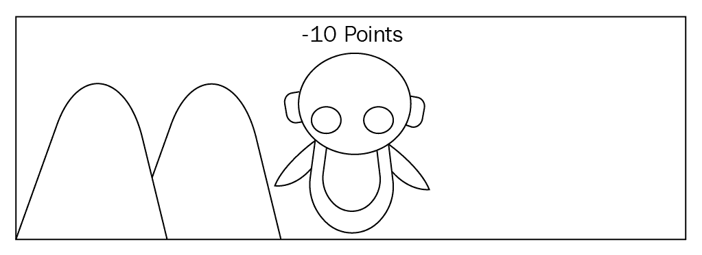
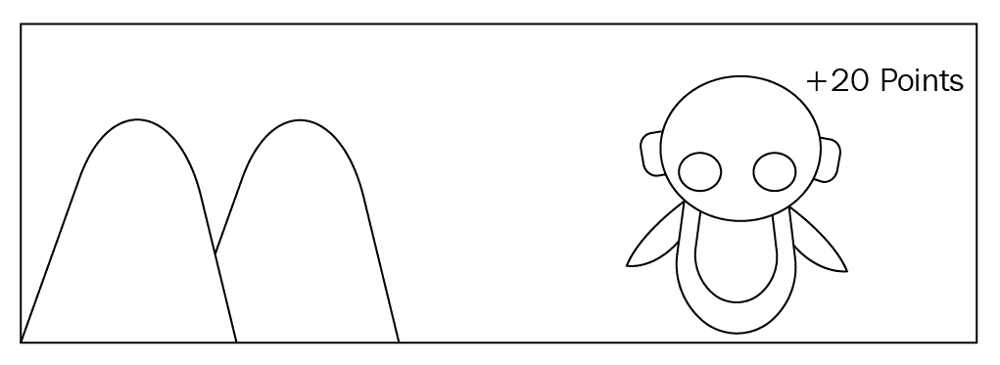
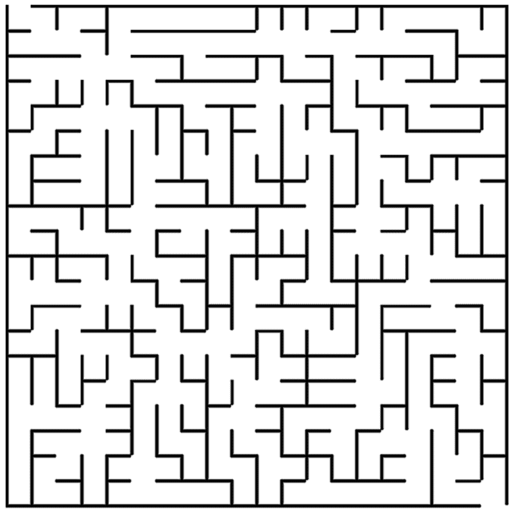

# 强化学习导论

强化学习（**RL**）是机器学习的一个分支，其中学习是通过与环境交互来进行的。 这是面向目标的学习，不教导学习者采取什么行动； 相反，学习者从其行动的结果中学习。 随着各种算法的迅速发展，它是**人工智能**（**AI**）中最活跃的研究领域之一。

在本章中，您将了解以下内容：

*   RL 的基本概念
*   RL 算法
*   智能体环境接口
*   RL 环境的类型
*   RL 平台
*   RL 的应用

# 什么是 RL？

考虑到您正在教狗接球，但是您不能明确地教狗接球； 取而代之的是，您将只扔一个球，每次狗抓到球时，您都将给它一个曲奇。 如果无法接住球，则不会提供曲奇。 狗将找出使它收到 Cookie 的动作，然后重复这些动作。

同样，在 RL 环境中，您不会教智能体做什么或如何做，而是会针对智能体执行的每个操作给予奖励。 奖励可以是正面的或负面的。 然后，智能体将开始执行使其获得正面奖励的操作。 因此，这是一个反复试验的过程。 在先前的类比中，狗代表智能体。 接球时给狗送饼干是一种积极的奖励，而不送饼干则是一种消极的奖励。

奖励可能会延迟。 您可能无法在每一步都获得奖励。 只有在任务完成后才能给予奖励。 在某些情况下，您会在每一步中获得奖励，以查明您是否犯了任何错误。

想象一下，您想教一个机器人走路而不会撞上山而被卡住，但是您不会明确地教它不要朝着山的方向走：

相反，如果机器人撞到并卡在山上，您将获得 10 分，这样机器人就会知道撞上山会产生负奖励，并且不会再次朝该方向前进：

如果机器人在正确的方向上行走而不被卡住，您将获得 20 分。 因此，机器人将了解哪条道路是正确的，并会通过朝正确的方向努力来最大化回报：

RL 智能体可以**探索**可能提供良好奖励的不同动作，也可以**利用**（使用）导致良好奖励的先前动作。 如果 RL 智能体探索不同的行动，则该智能体很可能会收到较差的报酬，因为所有行动都不会成为最佳行动。 如果 RL 智能体仅利用已知的最佳动作，那么也有可能会错过最佳动作，这可能会提供更好的回报。 探索与利用之间总是要权衡取舍。 我们不能同时进行探索和利用。 在接下来的章节中，我们将详细讨论探索与利用难题。

# RL 算法

典型的 RL 算法涉及的步骤如下：

1.  首先，智能体通过执行操作与环境进行交互
2.  智能体执行动作并从一种状态转移到另一种状态
3.  然后，智能体将根据其执行的动作获得奖励
4.  根据奖励，智能体将了解该操作是好是坏
5.  如果该动作是好的，即如果该智能体收到了积极的报酬，则该智能体将更喜欢执行该动作，否则该智能体将尝试执行导致积极报酬的其他动作。 所以这基本上是一个反复试验的学习过程

# RL 与其他 ML 范式有何不同

在监督学习中，机器（智能体）从训练数据中学习，该训练数据具有一组标记的输入和输出。 目的是模型外推并概括其学习，以便可以很好地应用于看不见的数据。 有一个外部主管，他具有完整的环境知识基础并监督智能体以完成一项任务。

考虑一下我们刚才讨论的狗类比； 在监督学习中，要教狗接球，我们将通过指定向左转，向右走，前进五个步骤，接球等等来明确地教它。 但是在 RL 中，我们只是扔一个球，每当狗抓到球时，我们都会给它一个曲奇（奖励）。 因此，狗将学会接球，这意味着它收到了饼干。

在无监督学习中，我们为模型提供只有一组输入的训练数据。 模型学习确定输入中的隐藏模式。 有一个普遍的误解，认为 RL 是一种无监督的学习，但事实并非如此。 在无监督学习中，模型学习隐藏的结构，而在 RL 中，模型通过最大化奖励来学习。 假设我们想向用户推荐新电影。 无监督学习会分析用户观看过的相似电影并建议电影，而 RL 会不断从用户那里收到反馈，了解他的电影偏好，并在此基础上建立知识库并建议新电影。

还有另一种称为半监督学习的学习，它基本上是有监督学习和无监督学习的结合。 它涉及对标记和未标记数据的功能估计，而 RL 本质上是智能体与其环境之间的相互作用。 因此，RL 与所有其他机器学习范例完全不同。

# RL 的元素

RL 的元素在以下各节中显示。

# 智能体

智能体是做出明智决策的软件程序，它们基本上是 RL 的学习者。 智能体通过与环境互动来采取行动，他们会根据自己的行动获得奖励，例如，在视频游戏中导航的超级马里奥。

# 策略函数

策略定义环境中智能体的行为。 智能体决定执行哪种操作的方式取决于策略。 假设您想在家中到达办公室； 到达办公室的路线会有所不同，有些路线是捷径，有些路线很长。 这些路线被称为策略，因为它们代表了我们选择采取行动以达到目标的方式。 策略通常用符号π表示。 策略可以采用查找表或复杂的搜索过程的形式。

# 值函数

值函数表示智能体处于特定状态的程度如何。 它取决于策略，通常用`v(s)`表示。 它等于智能体从初始状态开始收到的总预期奖励。 可以有多个值函数。 最优值函数是与其他值函数相比在所有状态下具有最高值的函数。 同样，最优策略是具有最优价值功能的策略。

# 模型

模型是智能体程序对环境的表示。 学习可以分为两种类型：基于模型的学习和无模型的学习。 在基于模型的学习中，智能体利用先前学习的信息来完成任务，而在无模型的学习中，智能体仅依靠反复试验的经验来执行正确的操作。 假设您想在家中更快地到达办公室。 在基于模型的学习中，您只需使用以前学习的经验（地图）即可更快地到达办公室，而在无模型的学习中，您将不会使用以前的经验，而是尝试所有不同的路线并选择更快的路线。

# 智能体环境接口

智能体是指一次执行`A[t]`，`t`移动的动作的软件智能体。 从一种状态`S[t]`，到另一种状态`S[t + 1]`。 基于行为，智能体从环境中获得数值奖励`R`。 最终，RL 就是寻找可以增加数值奖励的最佳行动：

让我们通过迷宫游戏来理解 RL 的概念：

迷宫的目的是到达目的地而不会卡在障碍物上。 这是工作流程：

*   智能体是穿越迷宫的人，这是我们的软件程序/ RL 算法
*   环境是迷宫
*   状态是智能体当前位于迷宫中的位置
*   智能体通过从一种状态转移到另一种状态来执行动作
*   当智能体的动作没有遇到任何障碍时，它会获得正向奖励；当智能体的行为没有遇到任何障碍时，它会得到负向奖励，因此它无法到达目的地
*   目的是清除迷宫并到达目的地

# RL 环境的类型

智能体与之交互的所有事物都称为环境。 环境是外部世界。 它包含智能体之外的所有内容。 有不同类型的环境，将在下一节中介绍。

# 确定性环境

当我们基于当前状态知道结果时，就可以说环境是确定性的。 例如，在国际象棋游戏中，我们知道移动任何玩家的确切结果。

# 随机环境

当我们无法根据当前状态确定结果时，就说环境是随机的。 不确定性将更大。 例如，我们永远不知道掷骰子时会显示多少数字。

# 完全可观察的环境

当智能体可以始终确定系统状态时，称为完全可观察。 例如，在国际象棋游戏中，系统状态，即所有玩家在国际象棋棋盘上的位置始终可用，因此玩家可以做出最佳决策。

# 部分可观察的环境

当智能体无法始终确定系统状态时，称为部分可观察。 例如，在扑克游戏中，我们不知道对手拥有的牌。

# 离散环境

当只有有限状态的动作可用于从一种状态转移到另一种状态时，它称为离散环境。 例如，在国际象棋游戏中，我们只有一组有限的动作。

# 连续环境

当动作的无限状态可以从一种状态转移到另一种状态时，称为连续环境。 例如，我们有多条路线可用于从源头到目的地的旅行。

# 情景和非情景环境

情景环境也称为**非顺序**环境。 在情景环境中，主体的当前动作不会影响将来的动作，而在非周期性环境中，主体的当前动作会影响未来的动作，也称为**顺序**环境。 也就是说，主体在情节环境中执行独立的任务，而在非周期性环境中，所有主体的动作都是相关的。

# 单智能体和多智能体环境

顾名思义，单智能体环境只有一个智能体，多智能体环境有多个智能体。 在执行复杂任务时，广泛使用多智能体环境。 在完全不同的环境中将存在不同的智能体。 不同环境中的智能体将彼此通信。 由于多主体环境具有更大的不确定性，因此它几乎是随机的。

# RL 平台

RL 平台用于在环境中模拟，构建，渲染和试验我们的 RL 算法。 有很多可用的 RL 平台，如以下各节所述。

# OpenAI Gym 和 Universe

OpenAI Gym 是用于构建，评估和比较 RL 算法的工具包。 它与在 TensorFlow，Theano，Keras 等任何框架中编写的算法兼容。 它很容易理解。 它不对智能体的结构做任何假设，并提供了所有 RL 任务的接口。

OpenAI Universe 是 OpenAI Gym 的扩展。 它提供了在各种简单到实时复杂环境中训练和评估智能体的能力。 它可以无限制地访问许多游戏环境。 使用 Universe，可以通过在虚拟网络计算远程桌面后自动启动程序来将任何程序转换为 Gym 环境，而无需访问程序内部，源代码或 API，因为 Universe 可以工作。

# DeepMind Lab

DeepMind Lab 是另一个基于 AI 智能体的惊人研究平台。 它提供了一个丰富的模拟环境，可以作为运行几种 RL 算法的实验室。 它是高度可定制和可扩展的。 视觉效果非常丰富，科幻风格且逼真。

# RLGlue

RL-Glue 提供了一个接口，用于将智能体，环境和程序连接在一起，即使它们是用不同的编程语言编写的。 它具有与他人共享您的智能体和环境以在您的工作之上进行构建的能力。 由于这种兼容性，可重用性大大提高了。

# Malmo 计划

Malmo 计划是微软在 Minecraft 之上构建的另一个 AI 实验平台。 它为自定义环境提供了良好的灵活性。 它与复杂的环境集成在一起。 它还允许超频，这使程序员能够比标准 Minecraft 更快地播放场景。 但是，与 Open AI Universe 不同，Malmo 当前仅提供 Minecraft 游戏环境。

# ViZDoom

顾名思义，ViZDoom 是一个基于 Doom 的 AI 平台。 它为多智能体提供支持，并提供竞争环境来测试智能体。 但是，ViZDoom 仅支持 Doom 游戏环境。 它提供了屏幕外渲染以及单人和多人游戏支持。

# RL 的应用

凭借更大的进步和研究，RL 已在从玩计算机游戏到汽车自动化的多个领域迅速发展了日常应用程序。 以下各节列出了一些 RL 应用程序。

# 教育

许多在线教育平台都在使用 RL 为每个学生提供个性化的内容。 有些学生可能会从视频内容中学习得更好，一些学生可能会通过做项目来学习，而有些人可能会从笔记中学习。 RL 用于根据每个学生的学习风格来调整个性化的教育内容，并且可以根据用户的行为进行动态更改。

# 医药保健

RL 在医学和卫生保健方面有无数的应用； 其中一些包括个性化医疗，基于医学图像的诊断，获得临床决策中的治疗策略，医学图像分割等。

# 制造业

在制造中，智能机器人用于将物体放置在正确的位置。 如果它失败或无法成功将对象放置在正确的位置，它将记住该对象并训练自己以更高的精度执行此操作。 使用智能智能体将减少人工成本并提高性能。

# 库存管理

RL 广泛用于库存管理，这是一项至关重要的业务活动。 其中一些活动包括供应链管理，需求预测和处理多个仓库操作（例如将产品放置在仓库中以有效管理空间）。 DeepMind 的 Google 研究人员开发了 RL 算法，可有效降低其数据中心的能耗。

# 金融

RL 被广泛用于金融投资组合管理，这是将资金不断重新分配给不同金融产品的过程，也用于商业交易市场的预测和交易。 JP Morgan 已成功使用 RL 为大订单提供更好的交易执行结果。

# 自然语言处理与计算机视觉

凭借深度学习和 RL 的统一能力，**深度强化学习**（**DRL**）在**自然语言处理**（**NLP**）和**计算机视觉**（**CV**）领域中得到了极大的发展。。 DRL 已用于文本摘要，信息提取，机器翻译和图像识别，比当前系统具有更高的准确性。

# 总结

在本章中，我们学习了 RL 的基础知识以及一些关键概念。 我们了解了 RL 的不同元素和 RL 环境的不同类型。 我们还介绍了各种可用的 RL 平台以及 RL 在各个领域中的应用。

在下一章第 2 章，“OpenAI 和 TensorFlow 入门”中，我们将学习 OpenAI 和 TensorFlow 的基础知识以及如何安装 OpenAI 和 TensorFlow，然后模拟环境并教给智能体如何在环境中学习。

# 问题

问题列表如下：

1.  什么是强化学习？
2.  RL 与其他 ML 范例有何不同？
3.  什么是智能体，智能体如何学习？
4.  策略功能和价值功能有什么区别？
5.  基于模型的学习与基于模型的学习有什么区别？
6.  RL 中有哪些不同类型的环境？
7.  OpenAI Universe 与其他 RL 平台有何不同？
8.  RL 有哪些应用？

# 进一步阅读

[**RL 概述**](https://www.cs.ubc.ca/~murphyk/Bayes/pomdp.html)。