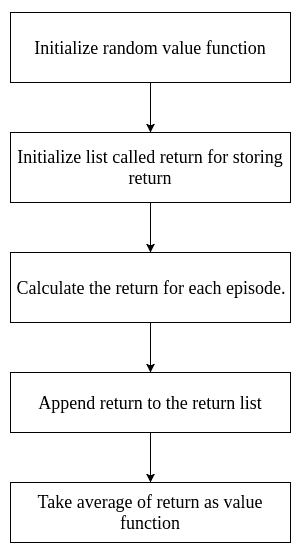
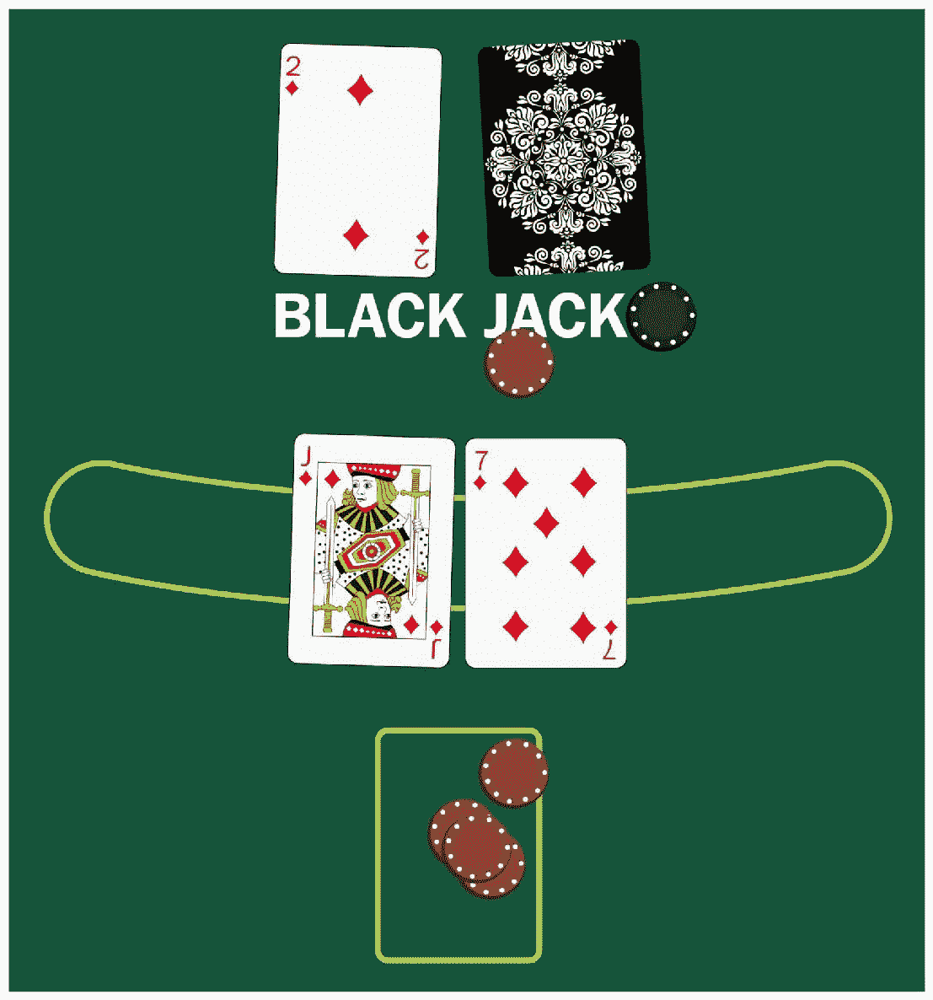
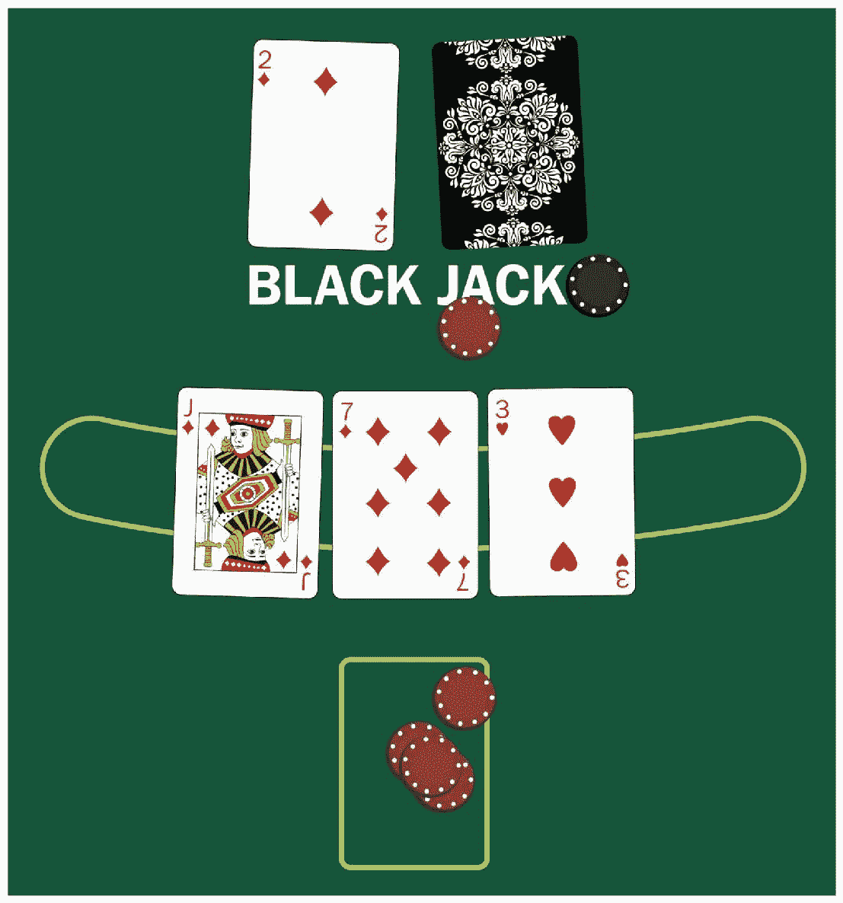
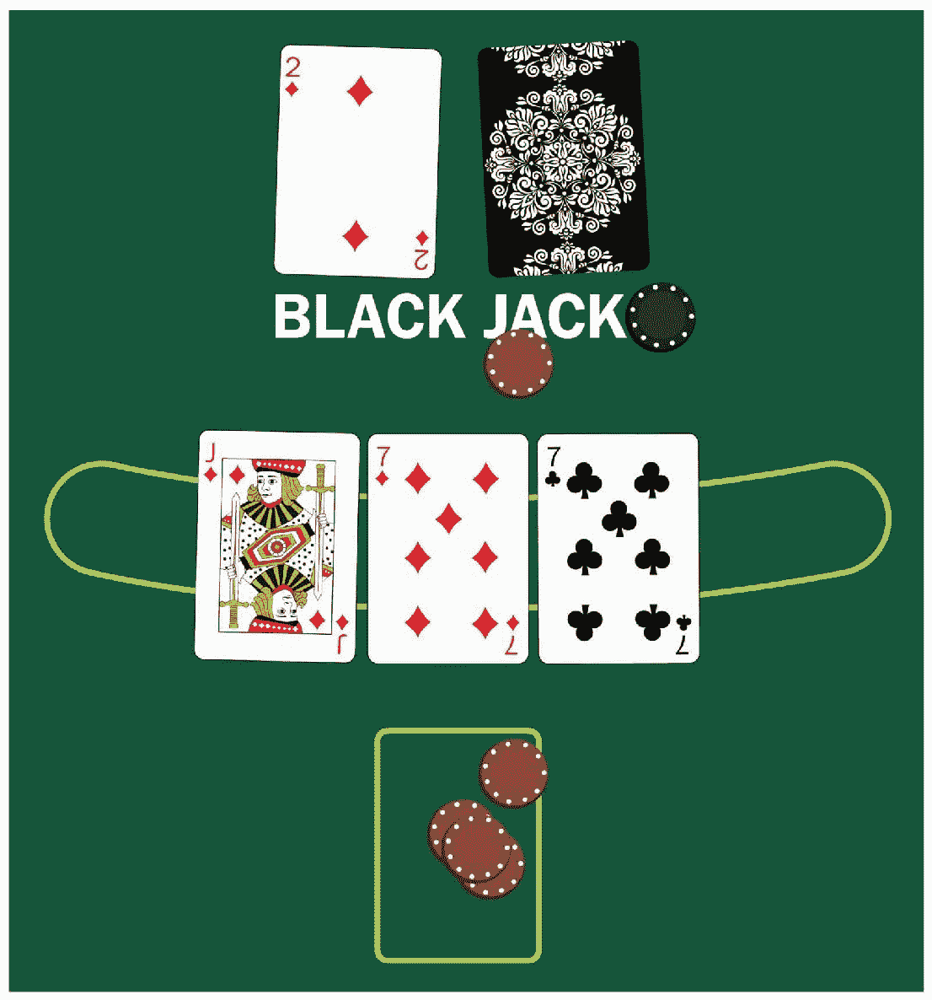
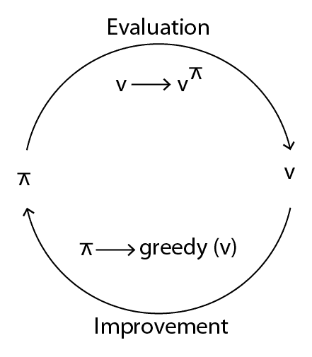
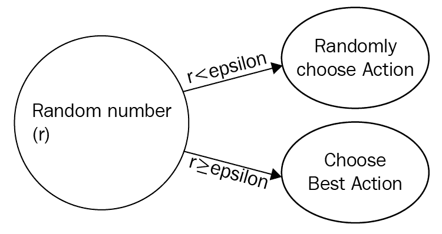
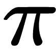

# 蒙特卡洛方法进行游戏

蒙特卡洛算法是从物理，机械到计算机科学的各个领域中最受欢迎和最常用的算法之一。 当未知环境模型时，在**强化学习**（**RL**）中使用 Monte Carlo 算法。 在上一章第 3 章，“马尔可夫决策过程和动态规划”中，我们着眼于使用**动态规划**（**DP**）查找 我们了解模型动态的最佳策略，即过渡和奖励概率。 但是，当我们不知道模型动态时，如何确定最佳策略？ 在这种情况下，我们使用蒙特卡洛算法； 当我们不了解环境时，它对于找到最佳策略非常有用。

在本章中，您将了解以下内容：

*   蒙特卡洛方法
*   蒙特卡洛预测
*   和蒙特卡洛一起玩二十一点
*   卡洛控制模型
*   蒙特卡洛开始勘探
*   策略性蒙特卡洛控制
*   脱离政策的蒙特卡洛控制

# 蒙特卡洛方法

蒙特卡洛方法通过随机采样找到近似解，也就是说，它通过运行多个踪迹来近似结果的概率。 通过抽样找到近似答案是一种统计技术。 让我们通过一个示例更好地直观地了解蒙特卡洛。

**有趣的事实：**蒙特卡洛以斯坦尼斯瓦夫·乌兰的叔叔的名字命名，他经常从亲戚那里借钱在蒙特卡洛赌场赌博。

# 使用蒙特卡洛估算 pi 的值

想象一下，将一个圆的象限放置在正方形内，如下所示，然后我们在正方形内生成一些随机点。 您会看到一些点落在圆内，而另一些点在圆外：


我们可以这样写：


我们知道一个圆的面积是`πr^2`，一个正方形的面积是`a^2`：


让我们考虑一个圆的半径是一半，而正方形的边是`1`，因此我们可以替换为：


现在我们得到以下内容：


估计π的步骤非常简单：

1.  首先，我们在正方形内生成一些随机点。
2.  然后，我们可以使用公式计算落入圆内的点数。
3.  然后，我们通过将圆内的点数除以平方内的点数的四倍来计算π的值。
4.  如果我们增加样本数（随机点数），则可以更好地近似

让我们逐步了解如何在 Python 中执行此操作。 首先，我们导入必要的库：

```py
import numpy as np
import math
import random
import matplotlib.pyplot as plt
%matplotlib inline
```

现在，我们初始化圆和正方形内的正方形大小和点数。 我们还初始化了样本大小，该样本大小表示要生成的随机点数。 我们定义`arc`，它基本上是圆象限：

```py
square_size = 1
points_inside_circle = 0
points_inside_square = 0
sample_size = 1000
arc = np.linspace(0, np.pi/2, 100)
```

然后，我们定义一个名为`generate_points()`的函数，该函数在正方形内部生成随机点：

```py
def generate_points(size):
    x = random.random()*size
    y = random.random()*size
    return (x, y)
```

我们定义了一个名为`is_in_circle()`的函数，该函数将检查生成的点是否在圆内：

```py
def is_in_circle(point, size):
    return math.sqrt(point[0]**2 + point[1]**2) <= size
```

然后定义一个用于计算π值的函数：

```py
def compute_pi(points_inside_circle, points_inside_square):
    return 4 * (points_inside_circle / points_inside_square) 
```

然后对于样本数，我们在正方形内生成一些随机点，并增加`points_inside_square`变量，然后我们将检查所生成的点是否位于圆内。 如果是，那么我们增加`points_inside_circle`变量：

```py
plt.axes().set_aspect('equal')
plt.plot(1*np.cos(arc), 1*np.sin(arc))

for i in range(sample_size):
    point = generate_points(square_size)
    plt.plot(point[0], point[1], 'c.')
    points_inside_square += 1
    if is_in_circle(point, square_size):
        points_inside_circle += 1
```

现在，我们使用`compute_pi()`函数计算π的值，该函数将打印出大约π的值：

```py
print("Approximate value of pi is {}" .format(calculate_pi(points_inside_circle, points_inside_square)))
```

如果运行该程序，将得到如下所示的输出：

```py
Approximate value of pi is 3.144
```


完整的程序如下所示：

```py
import numpy as np
import math
import random
import matplotlib.pyplot as plt
%matplotlib inline

square_size = 1
points_inside_circle = 0
points_inside_square = 0
sample_size = 1000
arc = np.linspace(0, np.pi/2, 100)

def generate_points(size):
    x = random.random()*size
    y = random.random()*size
    return (x, y)

def is_in_circle(point, size):
    return math.sqrt(point[0]**2 + point[1]**2) <= size

def compute_pi(points_inside_circle, points_inside_square):
    return 4 * (points_inside_circle / points_inside_square) 

plt.axes().set_aspect('equal')
plt.plot(1*np.cos(arc), 1*np.sin(arc))

for i in range(sample_size):
    point = generate_points(square_size)
    plt.plot(point[0], point[1], 'c.')
    points_inside_square += 1
    if is_in_circle(point, square_size):
        points_inside_circle += 1

print("Approximate value of pi is {}" .format(calculate_pi(points_inside_circle, points_inside_square)))
```

因此，蒙特卡洛方法通过使用随机采样来近似`pi`的值。 我们使用正方形内部生成的随机点（样本）估算`pi`的值。 采样量越大，我们的近似值越好。 现在，我们将看到如何在 RL 中使用蒙特卡洛方法。

# 蒙特卡洛预测

在 DP 中，我们通过使用值迭代和策略迭代来解决**马尔可夫决策过程**（**MDP**）。 这两种技术都需要转换和奖励概率才能找到最佳策略。 但是，当我们不知道过渡和奖励概率时，如何解决 MDP？ 在这种情况下，我们使用蒙特卡洛方法。 蒙特卡洛方法仅需要状态，动作和奖励的样本序列。 蒙特卡罗方法仅适用于情节任务。 由于 Monte Carlo 不需要任何模型，因此称为无模型学习算法。

蒙特卡洛方法的基本思想非常简单。 您还记得我们在上一章第 3 章，“马尔可夫决策过程和动态规划”中如何定义最佳值函数以及如何得出最佳策略吗？

值函数基本上是状态`S`与策略`π`的预期收益。 在这里，我们使用均值回报代替预期回报。

因此，在蒙特卡洛预测中，我们通过取均值回报而不是期望回报来近似值函数。

使用蒙特卡洛预测，我们可以估计任何给定策略的价值函数。 蒙特卡洛预测中涉及的步骤非常简单，如下所示：

1.  首先，我们将随机值初始化为我们的值函数
2.  然后我们初始化一个称为 return 的空列表来存储我们的退货
3.  然后针对情节中的每个州，我们计算收益
4.  接下来，我们将退货附加到退货清单中
5.  最后，我们将收益平均值作为我们的价值函数

以下流程图使其更简单：



蒙特卡洛预测算法有两种类型：

*   第一次访问蒙特卡洛
*   每次访问蒙特卡洛

# 第一次访问蒙特卡洛

如我们所见，在蒙特卡洛方法中，我们通过取平均收益来近似值函数。 但是在首次访问 MC 方法中，我们仅在情节中首次访问状态时才对返回值进行平均。 例如，假设一个代理正在玩蛇和梯子游戏，那么如果该代理被蛇咬伤，它很有可能会返回到该状态。 当代理商重新访问状态时，我们不考虑平均回报。 我们仅在代理商首次访问该州时才考虑平均回报。

# 每次访问蒙特卡洛

在蒙特卡洛的每次访问中，我们平均将情节中每次访问州的收益均值化。 考虑相同的蛇和梯子游戏示例：如果特工在蛇咬之后返回到相同的状态，尽管特工正在重新访问状态，但我们可以将其视为平均收益。 在这种情况下，我们平均每次代理商访问该州时的回报。

# 让我们和蒙特卡洛一起玩二十一点

现在，让我们通过二十一点游戏更好地了解蒙特卡洛。 二十一点，也称为 21，是在赌场玩的一种流行的纸牌游戏。 游戏的目标是使您的所有牌的总和接近 21 并且不超过 21。牌 J，K 和 Q 的值为 10。王牌的值为 1 或 11；王牌的值为 1 或 11。 这取决于玩家的选择。 其余卡（1 至 10）的值与它们显示的数字相同。

游戏规则非常简单：

*   可以与一个或多个玩家和一个发牌人一起玩游戏。
*   每个玩家仅与庄家竞争，而不与其他玩家竞争。
*   最初，给玩家一张两张牌。 这两个卡都面朝上，即对其他人可见。
*   庄家也得到了两张牌。 一张卡面朝上，另一张面朝下。 也就是说，发牌人只显示他的一张牌。

*   如果在收到两张牌后，一张牌的总和为 21（例如，一位牌手已收到 10 + 11 = 21 的杰克和王牌），则称其为**自然**或 **Blackjack [** ，玩家获胜。
*   如果发牌人在收到两张卡后立即的总卡数也为 21，则称为**开奖**，因为它们两张都有 21 张。
*   在每个回合中，玩家决定是否需要另一张纸牌来总计接近 21 张纸牌。
*   如果玩家需要纸牌，则称其为**命中**。
*   如果玩家不需要纸牌，则称为**支架**。
*   如果玩家的纸牌总数超过 21，则称为**胸围**； 那么发牌者将赢得比赛。

让我们通过玩来更好地了解二十一点。 我让你成为玩家，我是经销商：



在上图中，我们有一个参与者和一个庄家。 他们两个都有两张卡。 玩家的两张牌都朝上（可见），而发牌者的一张牌朝上（可见），另一张牌朝下（不可见）。 在第一轮中，您得到了两张卡，例如一个千斤顶和一个数字 7，即（10 + 7 = 17），而我作为发牌人只会向您显示一张数字 2。 面朝下。 现在，您必须决定要击中（需要另一张牌）还是站起来（不需要另一张牌）。 如果您选择击中并接收数字 3，您将获得 10 + 7 + 3 = 20（接近 21），您将获胜：



但是，如果您收到一张卡，说出数字 7，则 10 + 7 + 7 = 24，超过了 21。然后被称为破产，您输了游戏。 如果您决定站立使用初始卡，则只有 10 + 7 =17。然后我们将检查经销商的卡总和。 如果它大于 17 且不超过 21，则经销商赢，否则您赢：



这里的奖励是：

*   如果玩家赢得比赛，则+1
*   如果玩家输了则为-1
*   如果游戏是平局，则为 0

可能的操作是：

*   **命中**：如果玩家需要纸牌
*   **支架**：如果玩家不需要纸牌

玩家必须决定一张王牌的价值。 如果玩家的纸牌总数为 10，并且在击中后获得一张王牌，则可以将其视为 11，而 10 + 11 =21。但是，如果玩家的纸牌总数为 15，并且在击中后，则获得一张王牌。 ，如果他将其视为 11 且 15 + 11 = 26，则表示破产。 如果玩家拥有一张王牌，我们可以将其称为**可用王牌**； 玩家可以将其视为 11，而不会破产。 如果玩家通过将 ace 视为 11 来破产，则称为**不可使用的 ace** 。

现在，我们将看到如何使用首次访问的蒙特卡洛算法来实现二十一点。

首先，我们将导入必要的库：

```py
import gym
from matplotlib import pyplot
import matplotlib.pyplot as plt
from mpl_toolkits.mplot3d import Axes3D
from collections import defaultdict
from functools import partial
%matplotlib inline
plt.style.use('ggplot')
```

现在，我们将使用 OpenAI 的 Gym 创建二十一点环境：

```py
env = gym.make('Blackjack-v0')
```

然后我们定义策略函数，该函数采用当前状态并检查分数是否大于或等于`2o`； 如果是，则返回`0`，否则返回`1`。 也就是说，如果得分大于或等于`20`，我们将保持（0）或达到（1）：

```py
def sample_policy(observation):
    score, dealer_score, usable_ace = observation
    return 0 if score >= 20 else 1
```

现在，我们将了解如何生成情节。 情节是游戏的一个回合。 我们将逐步看到它，然后看完整功能。

我们将状态，动作和奖励定义为列表，并使用`env.reset`初始化环境并存储观察变量：

```py
states, actions, rewards = [], [], []
observation = env.reset()
```

然后，执行以下操作，直到到达最终状态，即直到情节结束为止：

1.  将观察值追加到状态列表：

```py
states.append(observation)
```

2.  现在，我们使用`sample_policy`函数创建一个动作，并将这些动作附加到`action`列表中：

```py
action = sample_policy(observation)
actions.append(action)
```

3.  然后，对于环境中的每个步骤，我们都存储`state`，`reward`和`done`（指定是否达到终端状态），并将奖励添加到`reward`列表中：

```py
observation, reward, done, info = env.step(action)
rewards.append(reward)
```

4.  如果我们到达终端状态，那么我们将中断：

```py
if done:
    break
```

5.  完整的`generate_episode`功能如下：

```py
def generate_episode(policy, env):
    states, actions, rewards = [], [], []
    observation = env.reset()
    while True:
        states.append(observation)
        action = policy(observation)
        actions.append(action)
        observation, reward, done, info = env.step(action)
        rewards.append(reward)
        if done:
            break

    return states, actions, rewards
```

这就是我们生成情节的方式。 我们如何玩游戏？ 为此，我们需要知道每个状态的值。 现在，我们将看到如何使用首次访问蒙特卡洛方法获取每个状态的值。

首先，我们将空值表初始化为用于存储每个状态的值的字典：

```py
value_table = defaultdict(float)
```

然后，对于一定数量的情节，我们执行以下操作：

1.  首先，我们生成情节并存储状态和奖励； 我们将回报初始化为`0`，这是奖励的总和：

```py
states, _, rewards = generate_episode(policy, env)
returns = 0
```

2.  然后，对于每个步骤，我们将奖励存储到变量`R`中，并声明为`S`，然后将收益计算为奖励总和：

```py
for t in range(len(states) - 1, -1, -1):
    R = rewards[t]
    S = states[t]
    returns += R
```

3.  现在，我们进行首次访问蒙特卡洛； 我们会在访问时间内检查是否正在访问该剧集。 如果是的话，我们只取收益的平均值并将状态值指定为收益的平均值：

```py
if S not in states[:t]:
    N[S] += 1
    value_table[S] += (returns - V[S]) / N[S]
```

4.  查看完整功能以更好地理解：

```py
def first_visit_mc_prediction(policy, env, n_episodes):
    value_table = defaultdict(float)
    N = defaultdict(int)

    for _ in range(n_episodes):
        states, _, rewards = generate_episode(policy, env)
        returns = 0
        for t in range(len(states) - 1, -1, -1):
            R = rewards[t]
            S = states[t]
            returns += R
            if S not in states[:t]:
                N[S] += 1
                value_table[S] += (returns - V[S]) / N[S]
    return value_table
```

5.  我们可以得到每个状态的值：

```py
value = first_visit_mc_prediction(sample_policy, env, n_episodes=500000)
```

6.  让我们看看一些状态的值：

```py
print(value)
defaultdict(float,
            {(4, 1, False): -1.024292170184644,
             (4, 2, False): -1.8670191351012455,
             (4, 3, False): 2.211363314854649,
             (4, 4, False): 16.903201033000823,
             (4, 5, False): -5.786238030898542,
             (4, 6, False): -16.218211752577602,
```

我们还可以绘制状态值以查看其收敛方式，如下所示：


完整的代码如下：

```py
import numpy
import gym
from matplotlib import pyplot
import matplotlib.pyplot as plt
from mpl_toolkits.mplot3d import Axes3D
from collections import defaultdict
from functools import partial
%matplotlib inline

plt.style.use('ggplot')

## Blackjack Environment

env = gym.make('Blackjack-v0')

env.action_space, env.observation_space

def sample_policy(observation):
    score, dealer_score, usable_ace = observation
    return 0 if score >= 20 else 1

def generate_episode(policy, env):
    states, actions, rewards = [], [], []
    observation = env.reset()
    while True:
        states.append(observation)
        action = sample_policy(observation)
        actions.append(action)
        observation, reward, done, info = env.step(action)
        rewards.append(reward)
        if done:
            break

    return states, actions, rewards

def first_visit_mc_prediction(policy, env, n_episodes):
    value_table = defaultdict(float)
    N = defaultdict(int)

    for _ in range(n_episodes):
        states, _, rewards = generate_episode(policy, env)
        returns = 0
        for t in range(len(states) - 1, -1, -1):
            R = rewards[t]
            S = states[t]
            returns += R
            if S not in states[:t]:
                N[S] += 1
                value_table[S] += (returns - value_table[S]) / N[S]
    return value_table

def plot_blackjack(V, ax1, ax2):
    player_sum = numpy.arange(12, 21 + 1)
    dealer_show = numpy.arange(1, 10 + 1)
    usable_ace = numpy.array([False, True])

    state_values = numpy.zeros((len(player_sum),
                                len(dealer_show),
                                len(usable_ace)))

    for i, player in enumerate(player_sum):
        for j, dealer in enumerate(dealer_show):
            for k, ace in enumerate(usable_ace):
                state_values[i, j, k] = V[player, dealer, ace]

    X, Y = numpy.meshgrid(player_sum, dealer_show)

    ax1.plot_wireframe(X, Y, state_values[:, :, 0])
    ax2.plot_wireframe(X, Y, state_values[:, :, 1])
    for ax in ax1, ax2:
        ax.set_zlim(-1, 1)
        ax.set_ylabel('player sum')
        ax.set_xlabel('dealer showing')
        ax.set_zlabel('state-value')

fig, axes = pyplot.subplots(nrows=2, figsize=(5, 8), subplot_kw={'projection': '3d'})
axes[0].set_title('value function without usable ace')
axes[1].set_title('value function with usable ace')
plot_blackjack(value, axes[0], axes[1])
```

# 蒙特卡洛控制

在蒙特卡洛预测中，我们已经看到了如何估计值函数。 在蒙特卡洛控制中，我们将看到如何优化值函数，即如何使值函数比估计值更准确。 在控制方法中，我们遵循一种称为通用策略迭代的新型迭代，其中策略评估和策略改进彼此交互。 它基本上是在策略评估和改进之间循环的，也就是说，相对于价值函数而言，策略总是会得到改进，而根据策略，价值函数总是会得到改善。 它继续这样做。 当没有变化时，可以说策略和价值函数已经达到收敛，即发现了最优价值函数和最优策略：



现在，我们将看到如下不同的蒙特卡洛控制算法。

# 蒙特卡洛开始勘探

与 DP 方法不同，这里我们不估计状态值。 相反，我们专注于行动价值。 当我们知道环境模型时，仅状态值就足够了。 由于我们不了解模型动力学，因此这不是单独确定状态值的好方法。

估计动作值比估计状态值更直观，因为状态值根据我们选择的策略而变化。 例如，在二十一点游戏中，假设我们处于某些纸牌为 20 的状态。该状态的价值是什么？ 这完全取决于政策。 如果我们选择政策作为命中目标，那将不是一个好的状态，而且此状态的价值非常低。 但是，如果我们选择我们的政策作为立场，那肯定是一个好的国家。因此，国家的价值取决于我们选择的政策。 因此，估计操作的值而不是状态的值更为重要。

我们如何估算作用值？ 还记得我们在第 3 章，“马尔可夫决策过程和动态规划”中学习的`Q`函数吗？ 表示为`Q(s, a)`的`Q`函数用于确定特定状态下的动作有多好。 它基本上指定了状态-动作对。

但是，这里出现了探索的问题。如果我们还没有处于状态状态值，我们如何知道状态状态值？ 如果我们不采取所有可能的措施探索所有州，我们可能会错过丰厚的回报。

假设在二十一点游戏中，我们处于纸牌总数为 20 的状态。如果我们仅尝试`h`**它**动作，我们将获得负数奖励，我们将学习 处于不佳状态。但是，如果我们尝试**站立**动作，我们将获得积极的回报，这实际上是最好的状态。因此，每次进入此特定状态 ，我们站立而不是受到打击。 为了让我们知道哪个是最佳操作，我们必须探索每种状态下的所有可能操作以找到最佳值。 我们应该怎么做？

让我介绍一个名为**的新概念蒙特卡洛** **探索开始**，这意味着对于每个情节，我们都将随机状态作为初始状态开始并执行操作。 因此，如果我们有大量的情节，我们可能会以所有可能的动作覆盖所有州。 它也称为 **MC-ES** 算法。

MC-ES 算法非常简单，如下所示：

*   我们首先使用一些随机值初始化`Q`函数和策略，然后我们初始化返回到空列表的过程
*   然后，我们以随机初始化的策略开始
*   然后，我们计算该情节中发生的所有唯一状态操作对的收益，并将收益附加到我们的收益清单中
*   我们只为唯一的状态-动作对计算返回值，因为同一状态-动作对多次出现在情节中，并且没有多余的信息点
*   然后，我们对返回列表中的返回值取平均值，然后将该值分配给我们的`Q`函数

*   最后，我们将为一个状态选择一个最佳策略，为该状态选择具有最大`Q(s, a)`的操作
*   我们将永久重复整个过程，或者重复进行多次，以便涵盖所有不同的状态和动作对

这是一个流程图：


# 策略性蒙特卡洛控制

在开始进行蒙特卡洛探索时，我们将探索所有状态-动作对，并选择能给我们带来最大价值的对。 但是考虑一下我们拥有大量状态和行动的情况。 在这种情况下，如果我们使用 MC-ES 算法，则将花费大量时间来探索状态和动作的所有组合并选择最佳状态和动作。 我们如何克服这个问题？ 有两种不同的控制算法。 上政策和下政策。 在基于策略的蒙特卡洛控制中，我们使用ε贪婪策略。 让我们了解什么是贪婪算法。

贪婪的算法会选择当时可用的最佳选择，尽管当您考虑整个问题时，该选择可能不是最佳选择。 考虑您要从数字列表中找到最小的数字。 您可以将列表分为三个子列表，而不是直接从列表中找到最小的数字。 然后，您将在每个子列表中找到最小的数字（局部最优值）。 考虑整个列表时，在一个子列表中找到的最小数目可能不是最小数目（全局最优）。 但是，如果您表现得很贪婪，那么您将仅在当前子列表中看到最小的数字（此刻），然后将其视为最小的数字。

贪婪策略表示在所探索的行动中的最佳行动。 最佳动作是具有最高价值的动作。

假设我们已经探索了状态 1 中的一些动作，如 Q 表所示：

| **状态** | **动作** | **值** |
| 状态 1 | 动作 0 | 0.5 |
| 状态 1 | 动作 1 | 0.1 |
| 状态 1 | 动作 2 | 0.8 |

如果我们表现出贪婪的态度，那么我们将从所有探索的动作中挑选出具有最大价值的动作。 在前面的情况中，我们具有较高价值的动作 2，因此我们选择该动作。 但是状态 1 中可能还有其他我们尚未探讨的动作，可能价值最高。 因此，我们必须在所有探索的动作中寻找最佳动作或利用最佳动作。 这就是所谓的勘探开发困境。 假设您听过爱德·希兰（Ed Sheeran），并且非常喜欢他，所以您因为喜欢音乐而一直只听（探索）爱德·希兰（Ed Sheeran）。 但是，如果您尝试听其他艺术家的音乐，您可能会喜欢比 Ed Sheeran（探索）更好的人。 关于您是否只需要听 Ed Sheeran（开发）还是尝试听不同的艺术家以查看您是否喜欢他们（开发）的这种困惑称为探索开发难题。

因此，为了避免这种困境，我们引入了一种称为 epsilon-greedy 策略的新策略。 在这里，所有动作均以非零概率（ε）进行尝试。 对于概率ε，我们随机地探索不同的动作，而对于概率 1，我们选择具有最大值的动作，即，我们不进行任何探索。 因此，我们不仅会以概率ε始终利用最佳行动，而且还会随机探索不同的行动。 如果 epsilon 的值设置为零，那么我们将不做任何探索。 这只是贪婪的策略，如果将 epsilon 的值设置为 1，则它将始终仅进行探索。 epsilon 的值会随着时间的流逝而衰减，因为我们不想永远探索。 因此，随着时间的流逝，我们的政策会采取良好的行动：



假设我们将 epsilon 的值设置为`0.3`。 在下面的代码中，我们从均匀分布中生成一个随机值，如果该值小于 epsilon 值，即 0.3，则选择一个随机动作（以这种方式，我们搜索一个不同的动作）。 如果来自均匀分布的随机值大于 0.3，则我们选择具有最佳值的操作。 因此，通过这种方式，我们以概率 epsilon 探索了以前从未见过的动作，并从概率为 1-epsilon 的探索动作中选择了最佳动作：

```py
def epsilon_greedy_policy(state, epsilon):
    if random.uniform(0,1) < epsilon:
         return env.action_space.sample()
    else:
         return max(list(range(env.action_space.n)), key = lambda x: q[(state,x)])
```

让我们想象一下，我们已经使用 epsilon-greedy 策略探索了状态 1 中的其他动作（尽管不是所有动作对），并且我们的 Q 表如下所示：

| **状态** | **动作** | **值** |
| 状态 1 | 动作 0 | 0.5 |
| 状态 1 | 动作 1 | 0.1 |
| 状态 1 | 动作 2 | 0.8 |
| 状态 1 | 动作 4 | 0.93 |

在状态 1 中，动作 4 具有比我们之前发现的动作 2 高的值。 因此，在 epsilon-greedy 策略下，我们以概率 epsilon 寻找不同的动作，并以概率为 1-epsilon 寻找最佳动作。

策略性蒙特卡洛方法涉及的步骤非常简单：

1.  首先，我们初始化随机策略和随机 Q 函数。
2.  然后，我们初始化一个称为 return 的列表，用于存储退货。
3.  我们使用随机策略π生成情节。
4.  我们将情节中发生的每个状态操作对的返回存储到返回列表中。

5.  然后，我们对返回列表中的返回值取平均值，然后将该值分配给`Q`函数。
6.  现在，由ε决定由状态`s`选择动作`a`的可能性。
7.  如果概率为 1-ε，我们将选择最大`Q`值的动作。
8.  如果概率为ε，我们将探索不同的动作。

# 脱离政策的蒙特卡洛控制

非政策性蒙特卡洛是另一种有趣的蒙特卡洛控制方法。 在这种方法中，我们有两种策略：一种是行为策略，另一种是目标策略。 在非策略方法中，代理遵循一项策略，但与此同时，它会尝试学习和改进另一种策略。 代理遵循的策略称为行为策略，代理尝试评估和改进的策略称为目标策略。 行为与目标策略完全无关。 行为策略探索所有可能的状态和动作，这就是为什么将行为策略称为软策略，而将目标策略称为贪心策略（它选择具有最大值的策略）的原因。

我们的目标是为目标策略π估计`Q`函数，但我们的代理使用完全不同的策略（称为行为策略）进行操作。 我们现在能做什么？ 我们可以通过使用中发生的常见事件来估计的值。 我们如何估算这两个政策之间的共同点？ 我们使用一种称为重要性抽样的新技术。 这是一种在给定来自另一个分布的样本的情况下从一个分布估计值的技术。

重要抽样有两种类型：

*   普通重要性抽样
*   加权重要性抽样

在普通重要性抽样中，我们基本上采用行为策略和目标策略获得的收益之比，而在加权重要性抽样中，我们采用加权平均值，而`C`是权重的累加和。

让我们一步一步看一下：

1.  首先，我们将`Q(s, a)`初始化为随机值，并将`C(s, a)`初始化为`0`，权重`w`为`1`。
2.  然后我们选择目标策略，这是一个贪婪策略。 这意味着它将从`Q`表中选取具有最大值的策略。

3.  我们选择行为政策。 行为策略不是贪婪的，它可以选择任何状态-行为对。
4.  然后，我们开始我们的情节，并根据我们的行为政策在*或*状态下执行动作`a`，并存储奖励。 我们重复此操作直到情节结束。
5.  现在，对于情节中的每个州，我们执行以下操作：
    1.  我们将计算回报`G`。 我们知道回报是折扣奖励的总和： *G =折扣因子* G +奖励*。
    2.  然后我们将`C(s, a)`更新为`C(s, a) + C(s, a) + w`。
    3.  我们更新`Q(s, a)`：。
    4.  我们更新`w`：的值。

# 概要

在本章中，我们了解了蒙特卡洛方法的工作原理，以及当我们不了解环境模型时如何使用它来解决 MDP。 我们研究了两种不同的方法：一种是用于估计值函数的蒙特卡洛预测，另一种是用于优化值函数的蒙特卡洛控制。

我们在蒙特卡洛预测中研究了两种不同的方法：首次访问蒙特卡洛预测，其中我们仅在情节中首次访问该状态时才对收益进行平均；以及每次访问蒙特卡洛方法，其中我们将每次 在情节中访问州。

在蒙特卡洛控制方面，我们研究了不同的算法。 我们首先遇到了 MC-ES 控件，该控件用于覆盖所有状态-动作对。 我们研究了策略上的 MC 控制（它使用 epsilon-greedy 策略）和策略外的 MC 控制（一次使用两个策略）。

在下一章[，第 5 章](05.html#3CN040-3c5bb317ad314d43ac43a332c0db6f00)，“时间差异学习”中，我们将介绍一种不同的无模型学习算法。

# 问题

问题列表如下：

1.  什么是蒙特卡洛方法？
2.  使用蒙特卡洛方法估计黄金分割率的值。
3.  蒙特卡洛预测的用途是什么？
4.  首次访问 MC 和每次访问 MC 有什么区别？
5.  为什么我们要估算状态作用值？
6.  策略上的 MC 控制和策略外的 MC 控制有什么区别？
7.  编写一些 Python 代码，以使用策略性 MC 控件玩二十一点游戏。

# 进一步阅读

请参考以下链接：

*   [**David Silver 的无模型预测演示**](http://www0.cs.ucl.ac.uk/staff/d.silver/web/Teaching_files/MC-TD.pdf)
*   [**David Silver 的无模型控件演示文稿**](http://www0.cs.ucl.ac.uk/staff/d.silver/web/Teaching_files/control.pdf)