# 时间差异学习

在上一章第四章，“使用蒙特卡洛方法的游戏”中，我们了解了有趣的蒙特卡洛方法，该方法用于解决**马尔可夫决策过程**（**MDP**），而不像动态规划那样预先未知环境的模型动力学。 我们研究了蒙特卡洛预测方法，该方法用于预测值函数，而控制方法用于进一步优化值函数。 但是蒙特卡洛方法存在一些陷阱。 它仅适用于情景任务。 如果情节很长，那么我们必须等待很长时间才能计算价值函数。 因此，我们将使用另一种有趣的算法，称为**时差**（**TD**）学习，这是一种无模型的学习算法：不需要知道模型动力学 先进，它也可以用于非临时性任务。

在本章中，您将学习：

*   TD 学习
*   Q 学习
*   萨尔萨
*   使用 Q 学习和 SARSA 进行出租车调度
*   Q 学习和 SARSA 之间的区别

# TD 学习

TD 学习算法由 Sutton 于 1988 年提出。该算法兼顾了 Monte Carlo 方法和**动态规划**（**DP**）的优点。 像蒙特卡洛方法一样，它不需要模型动力学，而像 DP 一样，它不需要等到情节结束就可以估计值函数。 取而代之的是，它基于先前学习的估算值来估算当前估算值，这也称为自举。 如果您在蒙特卡洛方法中看到没有引导程序，那么我们仅在情节结束时进行估计，但在 TD 方法中我们可以进行引导。

# TD 预测

就像我们在蒙特卡洛预测中所做的一样，在 TD 预测中，我们尝试预测状态值。 在蒙特卡洛预测中，我们仅通过取均值收益来估计值函数。 但是在 TD 学习中，我们通过当前状态更新先前状态的值。 我们应该怎么做？ TD 学习使用一种称为 TD 更新规则的东西来更新状态值，如下所示：


```
先前状态的值 = 先前状态的值 + 学习率（奖励 + 折扣因子（当前状态的值）- 先前状态的值）
```

这个方程实际上是什么意思？

如果您直观地想到此方程，则实际上是实际奖励（）和预期奖励（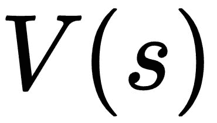）之间的差乘以学习率α。 学习率代表什么？ 学习速率（也称为步长）对于收敛很有用。

你注意到了吗？ 由于我们将实际值和预测值之差作为，因此实际上是一个错误。 我们可以称其为 TD 错误。 在多次迭代中，我们将尝试最小化此错误。

让我们通过前面几章中的冰湖示例来了解 TD 预测。 接下来显示的是冰冻的湖泊环境。 首先，对于所有状态，我们将值函数初始化为`0`，就像在`V(S)`中将其初始化为`0`一样，如以下状态值图所示 ：

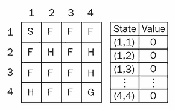

假设我们处于`s = (1, 1)`的初始状态，我们将采取正确的操作并移至下一个状态`s' = (1, 2)`，并获得 -0.3 的奖励（`r`）。 我们如何使用此信息来更新状态的值？

回忆一下 TD 更新公式：


让我们将学习率（`α`）视为`0.1`，将折现率（`γ`）视为 0.5； 我们知道状态`(1, 1)`的值（如`V(S)`中的值）为 0，而下一个状态`(1, 2)`的值与`V(S)`一样，也是`0`。 我们获得的奖励（`r`）为 -0.3。 我们将其替换为 TD 规则，如下所示：

```
V(s) = 0 + 0.1 * (-0.3 + 0.5 (0) - 0)
V(s) = -0.03
```

因此，我们在值表中将状态`(1, 1)`的值更新为`-0.03`，如下图所示：

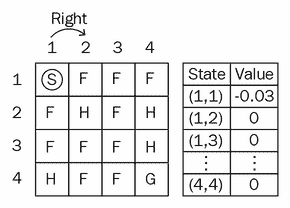

现在我们以`(1, 2)`的状态处于`s`的状态，我们将采取正确的操作并移至下一个状态`s' = (1, 3)`并获得奖励`r = -0.3`。 我们现在如何更新状态`(1, 2)`的值？

像我们之前所做的那样，我们将 TD 更新方程中的值替换为：

```
V(s) = 0 + 0.1 * (-0.3 + 0.5(0) - 0)
V(s) = -0.03
```

因此，我们将状态**（1,2）**的值设置为 **-0.03** ，并在值表中对其进行更新，如下所示：

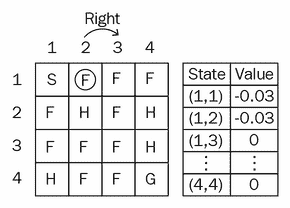

现在我们处于`s = (1, 3)`状态； 假设我们要采取行动了。 我们再次回到该状态`s' = (1, 2)`，我们将获得奖励`r = -0.3`。 此处，状态`(1, 3)`的值为`0`，下一个状态`(1, 2)`的值为值表中的`-0.03`。

现在我们可以更新状态`(1, 3)`的值，如下所示：

```
V(s) = 0 + 0.1 * (-0.3 + 0.5 * (-0.03) - 0))

V(s) = 0.1 * -0.315

V(s) = -0.0315
```

因此，我们在值表中将状态**（1,3）**的值更新为 **-0.0315** ，如下所示：

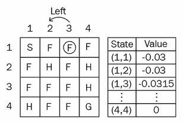

以类似的方式，我们使用 TD 更新规则更新所有状态的值。 TD 预测算法涉及的步骤如下：

1.  首先，我们将`V(S)`初始化为`0`或一些任意值
2.  然后我们开始该情节，并在情节中的每个步骤中，在状态`S`中执行动作`A`，并获得奖励`R`，然后移至下一个状态`s'`
3.  现在，我们使用 TD 更新规则更新先前状态的值
4.  重复步骤`3`和`4`，直到达到终端状态

# TD 控制

在 TD 预测中，我们估计了价值函数。 在 TD 控制中，我们优化了值函数。 对于 TD 控制，我们使用两种控制算法：

*   **脱离策略学习算法**：Q 学习
*   **策略学习算法**：SARSA

# Q 学习

现在，我们将研究称为 Q 学习的非常流行的非政策性 TD 控制算法。 Q 学习是一种非常简单且广泛使用的 TD 算法。 在控制算法中，我们不在乎状态值。 在这里，在 Q 学习中，我们关心的是状态-动作值对-在状态`S`下执行动作`A`的效果。

我们将根据以下公式更新`Q`值：


前面的公式与 TD 预测更新规则相似，只是有一点点差异。 我们将逐步详细介绍这一点。 Q 学习涉及的步骤如下：

1.  首先，我们将`Q`函数初始化为一些任意值
2.  我们使用 epsilon-greedy 策略（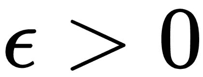）从某个州采取了一项行动，并将其移至新的州
3.  我们通过遵循更新规则来更新先前状态的`Q`值：


4.  重复步骤`2`和`3`，直到达到终端状态

现在，我们将使用不同的步骤来理解算法。

考虑相同的冻湖示例。 假设我们处于状态（3,2），并且有两个动作（左和右）。 现在让我们参考该图，并将其与 epsilon-greedy 策略进行比较：

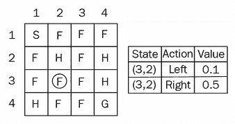

在“ Q 学习”中，我们使用 epsilon-greedy 策略选择一个动作。 我们要么探索概率为ε的新动作，要么选择概率为 1ε的最佳动作。 假设我们选择一个概率ε，并探索一个新的动作**，然后按下**，然后选择该动作：


现在，我们已经对状态`(3, 2)`执行了向下操作，并使用 epsilon-greedy 策略达到了新状态`(4, 2)`，我们如何更新 使用我们的更新规则的先前状态`(3, 2)`的值？ 这很简单。 查看`Q`表，如下所示：

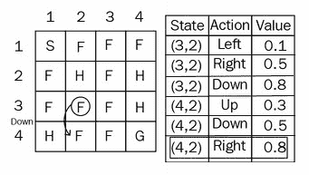

让我们将`alpha`视为`0.1`，并将折现因子视为`1`：


```
Q( (3,2) down) = Q( (3,2), down ) + 0.1 ( 0.3 + 1 max [Q( (4,2) action) ]- Q( (3,2), down)
```

我们可以说具有向下作用的状态`(3, 2)`的值，例如`Q((3, 2), down)`的值为`Q`表中的`0.8`。

状态`(4, 2)`的最大值`Q((4, 2), op)`是什么？ 我们仅研究了三个动作（**向上**，**向下**和**向右**），因此我们将仅基于这些动作来获取最大值。 （此处，我们将不执行 epsilon 贪婪策略；我们仅选择具有最大值的操作。）

因此，基于先前的`Q`表，我们可以将值替换为：

```
Q( (3,2), down) = 0.8 + 0.1 ( 0.3 + 1 max [0.3, 0.5, 0.8] - 0.8 )
    = 0.8 + 0.1 ( 0.3 + 1 (0.8) - 0.8)
    =  0.83
```

因此，我们将`Q((3, 2), down)`的值更新为`0.83`。

请记住，在选择要采取的操作时，我们将执行 epsilon-greedy 策略：我们要么探索具有概率 epsilon 的新操作，要么采取具有最大值的概率 1-epsilon。 在更新 Q 值时，我们不执行 epsilon-greedy 策略，我们仅选择具有最大值的操作。

现在我们处于状态`(4, 2)`，我们必须执行一个动作。 我们应该执行什么动作？ 我们决定基于 epsilon-greedy 策略，要么探索具有概率 epsilon 的新操作，要么选择具有概率 *1-epsilon* 的最佳操作。 假设我们选择概率`1-ε`，然后选择最佳操作。 因此，在`(4, 2)`中，向右的操作具有最大值。 因此，我们将选择**向右**操作：

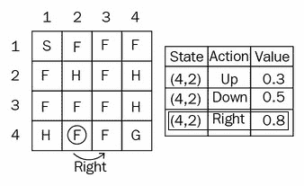

现在我们处于状态`(4, 3)`，因为我们对状态`(4, 2)`采取了**向右**动作。 我们如何更新先前状态的值？ 像这样：

```
Q( (4,2), right) = Q( (4,2), right ) + 0.1 ( 0.3 + 1 max [Q( (4,3) action) ]- Q( (4,2), right)
```

如果您查看下面的`Q`表，对于状态`(4, 3)`，我们仅探讨了两个操作（**向上**和**向下**），因此我们仅根据这些操作得出最大值。 （这里，我们将不执行 epsilon-greedy 策略；我们只选择具有最大值的操作）：

```
Q ( (4,2), right) = Q((4,2),right) + 0.1 (0.3 + 1 max [ (Q (4,3), up) , ( Q(4,3),down) ] - Q ((4,2), right )

Q ( (4,2), right) = 0.8 + 0.1 (0.3 + 1 max [ 0.1,0.3] - 0.8)
    = 0.8 + 0.1 (0.3 + 1(0.3) - 0.8)
    = 0.78
```

查看下面的`Q`表：

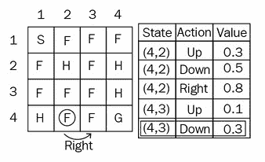

现在我们将状态`Q((4,2), right)`的值更新为`0.78`。

因此，这就是我们在 Q 学习中获得状态作用值的方式。 为了决定采取什么行动，我们使用 epsilon-greedy 策略，并在更新`Q`值时，我们只选择最大的行动； 这是流程图：

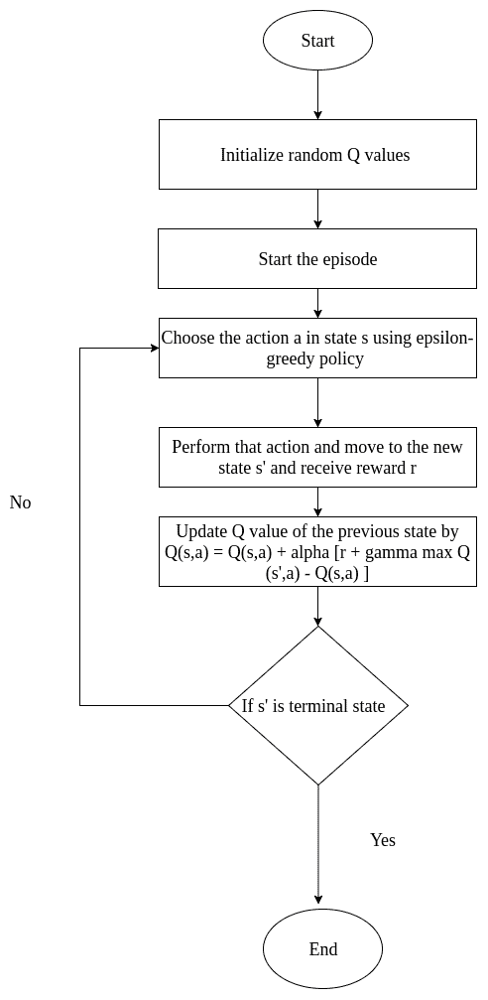

# 使用 Q 学习解决出租车问题

为了演示该问题，我们假设代理是驱动程序。 有四个地点，代理商必须在一个地点接客并在另一地点下车。 座席将获得+20 积分作为成功下车的奖励，而每走一步便获得-1 积分。 该代理商还将因非法取送丢掉-10 分。 因此，我们代理商的目标是学会在短时间内在正确的位置上落客而不增加非法乘客。

这里显示的环境中，字母（`R`，`G`，`Y`，`B`）代表不同的位置，并且是一个小矩形 是驾驶出租车的代理商：

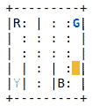

让我们看一下编码部分：

```py
import gym
import random
```

现在，我们使用`gym`创建环境：

```py
env = gym.make("Taxi-v1")
```

这种出租车的环境如何？ 像这样：

```py
env.render()
```

好的，首先让我们初始化学习率`alpha`，`epsilon`值和`gamma`：

```py
alpha = 0.4
gamma = 0.999
epsilon = 0.017
```

然后我们初始化一个 Q 表； 它有一个字典，将状态-操作值对存储为（状态，操作）：

```py
q = {}
for s in range(env.observation_space.n):
    for a in range(env.action_space.n):
        q[(s,a)] = 0.0
```

我们将通过 Q 学习更新规则定义用于更新 Q 表的函数； 如果您看下面的函数，您将看到我们采取的状态/动作对具有最大值的动作并将其存储在`qa`变量中。 然后，我们通过更新规则更新先前状态的`Q`值，如下所示：


```py
def update_q_table(prev_state, action, reward, nextstate, alpha, gamma):
    qa = max([q[(nextstate, a)] for a in range(env.action_space.n)])
    q[(prev_state,action)] += alpha * (reward + gamma * qa -q[(prev_state,action)])
```

然后，我们定义一个函数以执行 epsilon-greedy 策略，并在其中传递状态和 epsilon 值。 我们生成一些均匀分布的随机数，如果该数小于 epsilon，则在状态中探索不同的动作，否则我们将利用具有最大 q 值的动作：

```py

def epsilon_greedy_policy(state, epsilon):
    if random.uniform(0,1) < epsilon:
        return env.action_space.sample()
    else:
        return max(list(range(env.action_space.n)), key = lambda x: q[(state,x)])
```

我们将结合所有这些功能，了解如何进行 Q 学习：

```py
# For each episode
for i in range(8000):

    r = 0
    #first we initialize the environment

    prev_state = env.reset()
    while True:

        #In each state we select action by epsilon greedy policy
        action = epsilon_greedy_policy(prev_state, epsilon)

        #then we take the selected action and move to the next state
        nextstate, reward, done, _ = env.step(action)

        #and we update the q value using the update_q_table() function 
        #which updates q table according to our update rule.

        update_q_table(prev_state, action, reward, nextstate, alpha, gamma)

        #then we update the previous state as next stat
        prev_state = nextstate

        #and store the rewards in r
        r += reward

        #If done i.e if we reached the terminal state of the episode 
        #if break the loop and start the next episode
        if done:
            break

    print("total reward: ", r)

env.close()
```

完整的代码在这里给出：

```py

import random
import gym

env = gym.make('Taxi-v1')

alpha = 0.4
gamma = 0.999
epsilon = 0.017

q = {}
for s in range(env.observation_space.n):
 for a in range(env.action_space.n):
 q[(s,a)] = 0

def update_q_table(prev_state, action, reward, nextstate, alpha, gamma):
 qa = max([q[(nextstate, a)] for a in range(env.action_space.n)])
 q[(prev_state,action)] += alpha * (reward + gamma * qa - q[(prev_state,action)])

def epsilon_greedy_policy(state, epsilon):
 if random.uniform(0,1) < epsilon:
 return env.action_space.sample()
 else:
 return max(list(range(env.action_space.n)), key = lambda x: q[(state,x)])

for i in range(8000):
    r = 0
    prev_state = env.reset()    
    while True:

        env.render()

        # In each state, we select the action by epsilon-greedy policy
        action = epsilon_greedy_policy(prev_state, epsilon)

        # then we perform the action and move to the next state, and 
        # receive the reward
        nextstate, reward, done, _ = env.step(action)

        # Next we update the Q value using our update_q_table function
        # which updates the Q value by Q learning update rule

        update_q_table(prev_state, action, reward, nextstate, alpha, gamma)

        # Finally we update the previous state as next state
        prev_state = nextstate

        # Store all the rewards obtained
        r += reward

        #we will break the loop, if we are at the terminal 
        #state of the episode
        if done:
            break

    print("total reward: ", r)

env.close()
```

# 萨尔萨

**状态-动作-奖励-状态-动作**（**SARSA**）是一种策略上的 TD 控制算法。 就像我们在 Q 学习中所做的一样，这里我们也关注状态-动作值，而不是状态-值对。 在 SARSA 中，我们根据以下更新规则更新 Q 值：


在前面的等式中，您可能会注意到，没有最大的`Q(s', a')`，就像在 Q 学习中一样。 这里只是`Q(s', a')`。 我们可以通过执行一些步骤来详细了解这一点。 SARSA 涉及的步骤如下：

1.  首先，我们将`Q`值初始化为一些任意值
2.  我们通过 epsilon-greedy 策略（）选择一个动作，然后从一种状态转移到另一种状态
3.  我们遵循更新规则来更新`Q`值的先前状态，其中 *a'*是由ε贪婪策略（）选择的操作

现在，我们将逐步了解算法。 让我们考虑相同的冰冻湖的例子。 假设我们处于**（4,2）**状态。 我们根据 epsilon-greedy 政策决定采取的措施。 假设我们使用概率为 1- epsilon 并选择最佳操作，即**对**：


现在，我们在状态`(4, 2)`下执行了**右**动作之后，就处于`(4, 3)`状态。 我们如何更新先前状态`(4, 2)`的值？ 让我们将`alpha`设为`0.1`，将奖励设为`0.3`和折扣系数`1`：


```
Q( (4,2), right) = Q( (4,2),right) + 0.1 ( 0.3 + 1 Q( (4,3), action)) - Q((4,2) , right)
```

我们如何选择`Q((4, 3), action)`的值？ 在这里，与 Q 学习不同，我们不只是获取`max Q((4, 3), action)`。 在 SARSA 中，我们使用 epsilon-greedy 策略。

查看下面的 Q 表。 在状态`(4, 3)`中，我们探索了两个动作。 与 Q 学习不同，我们不会直接选择最大动作：


我们在这里也遵循 epsilon-greedy 政策。 我们要么以概率 epsilon 进行探索，要么以概率 1 epsilon 进行利用。 假设我们选择概率ε并探索新的动作。 我们探索一个新动作**，紧接着**，然后选择该动作：


```
Q ( (4,2), right) = Q((4,2),right) + 0.1 (0.3 + 1 (Q (4,3), right) - Q ((4,2), right )

Q ( (4,2), right) = 0.8 + 0.1 (0.3 + 1(0.9) - 0.8)
    = 0.8 + 0.1 (0.3 + 1(0.9) - 0.8)
    = 0.84
```

因此，这就是我们在 SARSA 中获取状态操作值的方式。 我们使用 epsilon-greedy 策略采取措施，并且在更新 Q 值的同时，我们使用 epsilon-greedy 策略采取措施。

下图说明了 SARSA 算法：


# 使用 SARSA 解决出租车问题

现在，我们将使用 SARSA 解决相同的出租车问题：

```py
import gym
import random
env = gym.make('Taxi-v1')
```

另外，我们将初始化学习率`gamma`和`epsilon`。 Q 表有一个字典：

```py

alpha = 0.85
gamma = 0.90
epsilon = 0.8

Q = {}
for s in range(env.observation_space.n):
    for a in range(env.action_space.n):
        Q[(s,a)] = 0.0
```

和往常一样，我们为勘探定义了`epsilon_greedy`策略：

```py
def epsilon_greedy(state, epsilon):
    if random.uniform(0,1) < epsilon:
        return env.action_space.sample()
    else:
        return max(list(range(env.action_space.n)), key = lambda x: Q[(state,x)])
```

现在，出现了实际的 SARSA 算法：

```py
for i in range(4000):

    #We store cumulative reward of each episodes in r
    r = 0

    #Then for every iterations, we initialize the state,
    state = env.reset()

    #then we pick up the action using epsilon greedy policy
    action = epsilon_greedy(state,epsilon)

    while True:

        #Then we perform the action in the state and move the next state
        nextstate, reward, done, _ = env.step(action)

        #Then we pick up the next action using epsilon greedy policy 
        nextaction = epsilon_greedy(nextstate,epsilon) 

        #we calculate Q value of the previous state using our update rule
        Q[(state,action)] += alpha * (reward + gamma * Q[(nextstate,nextaction)]-Q[(state,action)])

```

```py
        #finally we update our state and action with next action 
        # and next state
        action = nextaction
        state = nextstate
        r += reward

        #we will break the loop, if we are at the terminal 
        #state of the episode
        if done:
            break

env.close()
```

您可以运行该程序，然后查看 SARSA 如何找到最佳路径。

完整的程序在这里给出：

```py
#Like we did in Q learning, we import necessary libraries and initialize environment

import gym
import random
env = gym.make('Taxi-v1')

alpha = 0.85
gamma = 0.90
epsilon = 0.8

#Then we initialize Q table as dictionary for storing the state-action values
Q = {}
for s in range(env.observation_space.n):
    for a in range(env.action_space.n):
        Q[(s,a)] = 0.0

#Now, we define a function called epsilon_greedy for performing action 
#according epsilon greedy policy 
def epsilon_greedy(state, epsilon):
    if random.uniform(0,1) < epsilon:
        return env.action_space.sample()
    else:
        return max(list(range(env.action_space.n)), key = lambda x: Q[(state,x)])

```

```py
for i in range(4000):

    #We store cumulative reward of each episodes in 
    r = 0

    #Then for every iterations, we initialize the state,
    state = env.reset()

    #then we pick up the action using epsilon greedy policy
    action = epsilon_greedy(state,epsilon)

    while True:

        #Then we perform the action in the state and move the next state
        nextstate, reward, done, _ = env.step(action)

        #Then we pick up the next action using epsilon greedy policy 
        nextaction = epsilon_greedy(nextstate,epsilon) 

        #we calculate Q value of the previous state using our update rule
        Q[(state,action)] += alpha * (reward + gamma * Q[(nextstate,nextaction)]-Q[(state,action)])

        #finally we update our state and action with next action 
        #and next state
        action = nextaction
        state = nextstate
        r += reward

        #we will break the loop, if we are at the terminal 
        #state of the episode
        if done:
            break

env.close()
```

# Q 学习和 SARSA 之间的区别

Q 学习和 SARSA 对许多人来说总是很困惑。 让我们分解一下两者之间的差异。 在此处查看流程图：

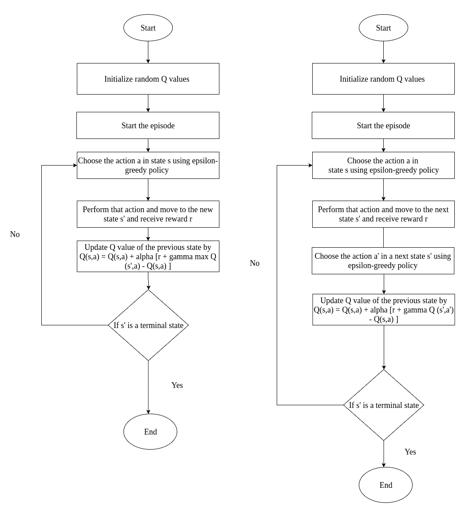

您看得出来差别吗？ 在 Q 学习中，我们使用 epsilon-greedy 策略采取行动，并且在更新 Q 值的同时，我们仅采取最大行动。 在 SARSA 中，我们使用 epsilon-greedy 策略采取措施，并且在更新 Q 值的同时，我们使用 epsilon-greedy 策略采取措施。

# 概要

在本章中，我们学习了一种克服了蒙特卡洛方法局限性的不同的无模型学习算法。 我们看到了预测和控制方法。 在 TD 预测中，我们根据下一个状态更新了状态的状态值。 在控制方法方面，我们看到了两种不同的算法：Q 学习和 SARSA。

# 问题

问题列表如下：

1.  TD 学习与蒙特卡洛方法有何不同？
2.  TD 错误到底是什么？
3.  TD 预测和控制之间有什么区别？
4.  如何使用 Q 学习构建智能代理？
5.  Q learning 和 SARSA 有什么区别？

# 进一步阅读

[**萨顿的原始 TD 论文**](https://pdfs.semanticscholar.org/9c06/865e912788a6a51470724e087853d7269195.pdf)