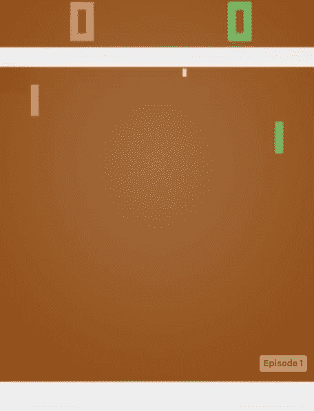
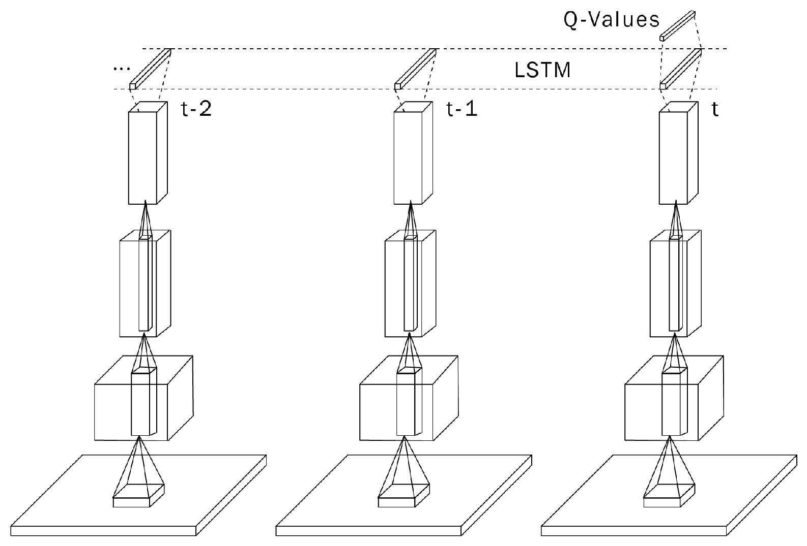
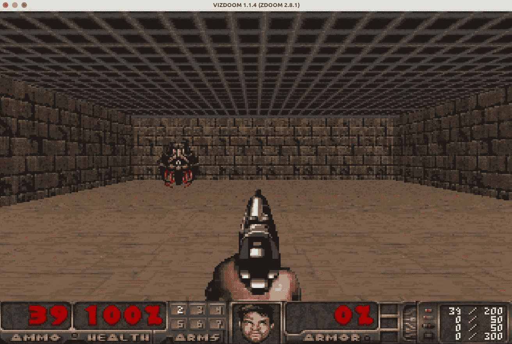
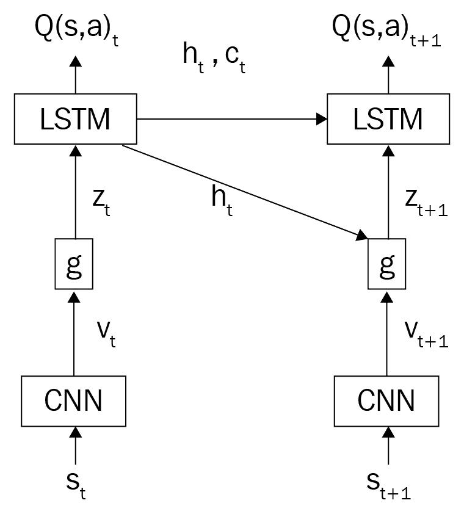

# 用深度循环 Q 网络玩世界末日

在上一章中，我们介绍了如何使用**深度 Q 网络**（**DQN**）构建智能体以玩 Atari 游戏。 我们利用神经网络来近似 Q 函数，使用了**卷积神经网络**（**CNN**）来理解输入游戏画面，并利用过去的四个游戏画面来更好地理解当前的游戏状态。 在本章中，我们将学习如何利用**循环神经网络**（**RNN**）来提高 DQN 的性能。 我们还将研究**马尔可夫决策过程**（**MDP**）的部分可观察之处，以及如何使用**深度循环 Q 网络**（**DRQN**）。 接下来，我们将学习如何构建一个智能体来使用 DRQN 玩《毁灭战士》游戏。 最后，我们将看到 DRQN 的一种变体，称为**深度注意力循环 Q 网络**（**DARQN**），它增强了 DRQN 架构的注意力机制。

在本章中，您将学习以下主题：

*   DRQN
*   部分可观察的 MDP
*   DRQN 的架构
*   如何建立智能体以使用 DRQN 玩《毁灭战士》游戏
*   DARQN

# DRQN

那么，当我们在 Atari 游戏中以人为水平执行 DQN 时，为什么我们需要 DRQN？ 为了回答这个问题，让我们理解**部分可观察的马尔可夫决策过程**（**POMDP**）的问题。 当我们可获得的关于环境的信息有限时，该环境称为部分可观察的 MDP。 到目前为止，在前面的章节中，我们已经看到了一个完全可观察的 MDP，在其中我们了解所有可能的动作和状态-尽管该智能体可能不知道转移和奖励的可能性，但它对环境有完整的了解，例如，冰冻的湖泊环境，我们清楚地知道了环境的所有状态和行为； 我们轻松地将该环境建模为一个完全可观察的 MDP。 但是大多数现实世界环境只能部分观察到。 我们看不到所有状态。 考虑智能体学习如何在现实环境中行走； 显然，智能体将不会完全了解环境，它将无法获得任何信息。 在 POMDP 中，状态仅提供部分信息，但是将有关过去状态的信息保留在内存中可能会帮助智能体更好地了解环境的性质并改善策略。 因此，在 POMDP 中，我们需要保留有关先前状态的信息，以便采取最佳措施。

为了回顾我们在前几章中学到的知识，请考虑以下所示的乒乓游戏。 仅通过查看当前的游戏屏幕，我们就可以知道球的位置，但是我们还需要知道球的运动方向和球的速度，以便采取最佳行动。 但是，仅查看当前的游戏屏幕并不能告诉我们球的方向和速度：



为了克服这个问题，我们将不仅仅考虑当前的游戏屏幕，而将使用过去的四个游戏屏幕来了解球的方向和速度。 这就是我们在 DQN 中看到的。 我们将过去的四个游戏屏幕以及当前的游戏屏幕作为输入输入到卷积层，并接收该状态下所有可能动作的 Q 值。 但是，您认为仅使用过去的四个屏幕将有助于我们了解不同的环境吗？ 在某些环境下，我们甚至可能需要过去的 100 个游戏屏幕来更好地了解当前游戏状态。 但是，堆叠过去的`n`游戏画面会减慢我们的训练过程，而且还会增加我们的经验回放缓冲区的大小。

因此，只要需要，我们就可以利用 RNN 的优势来理解和保留有关先前状态的信息。 在第 7 章“深度学习基础知识”中，我们了解了如何通过保留，忘记和更新所需的信息，将**长短期记忆循环神经网络**（**LSTM RNN**）用于生成文本以及了解文本的上下文。 我们将通过扩展 LSTM 层来修改 DQN 架构，以了解先前的信息。 在 DQN 架构中，我们用 LSTM RNN 替换了第一卷积后全连接层。 这样，我们也可以解决部分可观察性的问题，因为现在我们的智能体可以记住过去的状态并可以改进策略。

# DRQN 的架构

接下来显示 DRQN 的架构。 它类似于 DQN，但是我们用 LSTM RNN 替换了第一卷积后全连接层，如下所示：



因此，我们将游戏屏幕作为卷积层的输入。 卷积层对图像进行卷积并生成特征映射。 然后将生成的特征映射传递到 LSTM 层。 LSTM 层具有用于保存信息的内存。 LSTM 层保留有关重要的先前游戏状态的信息，并根据需要随时间步长更新其内存。 穿过全连接层后，它将输出`Q`值。 因此，与 DQN 不同，我们不直接估计`Q(s[t], a[t])`。 相反，我们估算`Q(h[t], a[t])`，其中`h[t]`是网络在上一个时间步长返回的输入。 即，`h[t] = LSTM(h[t-1], o[t])`。 当我们使用 RNN 时，我们通过时间的反向传播来训练我们的网络。

等待。 经验回放缓冲区如何？ 在 DQN 中，为避免相关的经验，我们使用了经验回放，该经验存储了游戏的转移，并使用了随机的一组经验来训练网络。 对于 DRQN，我们将整个情节存储在经验缓冲区中，并从随机的情节批次中随机采样`n`个步骤。 因此，通过这种方式，我们既可以适应随机化，又可以适应另一种实际的经验。

# 训练特工玩《毁灭战士》

毁灭战士是一款非常受欢迎的第一人称射击游戏。 游戏的目标是杀死怪物。 末日是部分可观察的 MDP 的另一个示例，因为智能体（玩家）的视角限制为 90 度。 该智能体对其余环境一无所知。 现在，我们将看到如何使用 DRQN 来训练我们的经纪人玩《毁灭战士》。

代替 OpenAI Gym，我们将使用 ViZDoom 软件包来模拟 Doom 环境以训练我们的智能体。 要了解有关 ViZDoom 软件包的更多信息，[请访问其官方网站](http://vizdoom.cs.put.edu.pl/)。 我们可以使用以下命令简单地安装 ViZDoom：

```py
pip install vizdoom
```

ViZDoom 提供了许多 Doom 方案，可以在软件包文件夹`vizdoom/scenarios`中找到这些方案。

# 基本 Doom 游戏

在开始之前，让我们通过看一个基本示例来熟悉`vizdoom`环境：

1.  让我们加载必要的库：

```py
from vizdoom import *
import random
import time
```

2.  为`DoomGame`创建一个实例：

```py
game = DoomGame() 
```

3.  众所周知，ViZDoom 提供了很多 Doom 方案，让我们加载基本方案：

```py
game.load_config("basic.cfg")
```

4.  `init()`方法使用场景初始化游戏：

```py
game.init()
```

5.  现在，让我们定义一个带有热编码的`actions`的代码：

```py
shoot = [0, 0, 1]
left = [1, 0, 0]
right = [0, 1, 0]
actions = [shoot, left, right]
```

6.  现在，让我们开始玩游戏：

```py
no_of_episodes = 10

for i in range(no_of_episodes): 

    # for each episode start the game
    game.new_episode()

    # loop until the episode is over
    while not game.is_episode_finished():

        # get the game state
        state = game.get_state()
        img = state.screen_buffer

        # get the game variables
        misc = state.game_variables

```

```py
        # perform some action randomly and receive reward
        reward = game.make_action(random.choice(actions))

        print(reward)

    # we will set some time before starting the next episode
    time.sleep(2)
```

运行程序后，可以看到如下输出：



# DRQN 的 Doom

现在，让我们看看如何利用 DRQN 算法来训练我们的特工玩《毁灭战士》。 我们为成功杀死怪物分配正面奖励，为失去生命，自杀和失去弹药（子弹）分配负面奖励。 您可以在[这里](https://github.com/sudharsan13296/Hands-On-Reinforcement-Learning-With-Python/blob/master/09.%20Playing%20Doom%20Game%20using%20DRQN/9.5%20Doom%20Game%20Using%20DRQN.ipynb)获得 Jupyter 笔记本的完整代码及其解释。 本节中使用的代码的权利归于 [Luthanicus](https://github.com/Luthanicus/losaltoshackathon-drqn)。

首先，让我们导入所有必需的库：

```py
import tensorflow as tf
import numpy as np
import matplotlib.pyplot as plt
from vizdoom import *
import timeit
import math
import os
import sys
```

现在，让我们定义`get_input_shape`函数，以在卷积层卷积后计算输入图像的最终形状：

```py
def get_input_shape(Image,Filter,Stride):
    layer1 = math.ceil(((Image - Filter + 1) / Stride))

    o1 = math.ceil((layer1 / Stride))

    layer2 = math.ceil(((o1 - Filter + 1) / Stride))

    o2 = math.ceil((layer2 / Stride))

    layer3 = math.ceil(((o2 - Filter + 1) / Stride))

    o3 = math.ceil((layer3 / Stride))

    return int(o3)
```

现在，我们将定义`DRQN`类，该类实现了 DRQN 算法。 检查每行代码之前的注释以了解它：

```py
class DRQN():
    def __init__(self, input_shape, num_actions, initial_learning_rate):

        # first, we initialize all the hyperparameters

        self.tfcast_type = tf.float32

        # shape of our input, which would be (length, width, channels)
        self.input_shape = input_shape 

        # number of actions in the environment
        self.num_actions = num_actions

        # learning rate for the neural network
        self.learning_rate = initial_learning_rate

        # now we will define the hyperparameters of the convolutional neural network 

        # filter size
        self.filter_size = 5

        # number of filters
        self.num_filters = [16, 32, 64]

        # stride size
        self.stride = 2

        # pool size
        self.poolsize = 2 

        # shape of our convolutional layer
        self.convolution_shape = get_input_shape(input_shape[0], self.filter_size, self.stride) * get_input_shape(input_shape[1], self.filter_size, self.stride) * self.num_filters[2]

        # now, we define the hyperparameters of our recurrent neural network and the final feed forward layer

        # number of neurons 
        self.cell_size = 100

        # number of hidden layers
        self.hidden_layer = 50

        # drop out probability
        self.dropout_probability = [0.3, 0.2]

        # hyperparameters for optimization
        self.loss_decay_rate = 0.96
        self.loss_decay_steps = 180

        # initialize all the variables for the CNN

        # we initialize the placeholder for input whose shape would be (length, width, channel)
        self.input = tf.placeholder(shape = (self.input_shape[0], self.input_shape[1], self.input_shape[2]), dtype = self.tfcast_type)

        # we will also initialize the shape of the target vector whose shape is equal to the number of actions
        self.target_vector = tf.placeholder(shape = (self.num_actions, 1), dtype = self.tfcast_type)

        # initialize feature maps for our corresponding 3 filters
        self.features1 = tf.Variable(initial_value = np.random.rand(self.filter_size, self.filter_size, input_shape[2], self.num_filters[0]),
                                     dtype = self.tfcast_type)

        self.features2 = tf.Variable(initial_value = np.random.rand(self.filter_size, self.filter_size, self.num_filters[0], self.num_filters[1]),
                                     dtype = self.tfcast_type)

        self.features3 = tf.Variable(initial_value = np.random.rand(self.filter_size, self.filter_size, self.num_filters[1], self.num_filters[2]),
                                     dtype = self.tfcast_type)

        # initialize variables for RNN
        # recall how RNN works from chapter 7

        self.h = tf.Variable(initial_value = np.zeros((1, self.cell_size)), dtype = self.tfcast_type)

        # hidden to hidden weight matrix
        self.rW = tf.Variable(initial_value = np.random.uniform(
                                            low = -np.sqrt(6\. / (self.convolution_shape + self.cell_size)),
                                            high = np.sqrt(6\. / (self.convolution_shape + self.cell_size)),
                                            size = (self.convolution_shape, self.cell_size)),
                              dtype = self.tfcast_type)

        # input to hidden weight matrix
        self.rU = tf.Variable(initial_value = np.random.uniform(
                                            low = -np.sqrt(6\. / (2 * self.cell_size)),
                                            high = np.sqrt(6\. / (2 * self.cell_size)),
                                            size = (self.cell_size, self.cell_size)),
                              dtype = self.tfcast_type)

        # hidden to output weight matrix

        self.rV = tf.Variable(initial_value = np.random.uniform(
                                            low = -np.sqrt(6\. / (2 * self.cell_size)),
                                            high = np.sqrt(6\. / (2 * self.cell_size)),
                                            size = (self.cell_size, self.cell_size)),
                              dtype = self.tfcast_type)
        # bias
        self.rb = tf.Variable(initial_value = np.zeros(self.cell_size), dtype = self.tfcast_type)
        self.rc = tf.Variable(initial_value = np.zeros(self.cell_size), dtype = self.tfcast_type)

        # initialize weights and bias of feed forward network

        # weights
        self.fW = tf.Variable(initial_value = np.random.uniform(
                                            low = -np.sqrt(6\. / (self.cell_size + self.num_actions)),
                                            high = np.sqrt(6\. / (self.cell_size + self.num_actions)),
                                            size = (self.cell_size, self.num_actions)),
                              dtype = self.tfcast_type)

        # bias
        self.fb = tf.Variable(initial_value = np.zeros(self.num_actions), dtype = self.tfcast_type)

        # learning rate
        self.step_count = tf.Variable(initial_value = 0, dtype = self.tfcast_type)
        self.learning_rate = tf.train.exponential_decay(self.learning_rate, 
                                                   self.step_count,
                                                   self.loss_decay_steps,
                                                   self.loss_decay_steps,
                                                   staircase = False)

        # now let us build the network

        # first convolutional layer
        self.conv1 = tf.nn.conv2d(input = tf.reshape(self.input, shape = (1, self.input_shape[0], self.input_shape[1], self.input_shape[2])), filter = self.features1, strides = [1, self.stride, self.stride, 1], padding = "VALID")
        self.relu1 = tf.nn.relu(self.conv1)
        self.pool1 = tf.nn.max_pool(self.relu1, ksize = [1, self.poolsize, self.poolsize, 1], strides = [1, self.stride, self.stride, 1], padding = "SAME")

        # second convolutional layer
        self.conv2 = tf.nn.conv2d(input = self.pool1, filter = self.features2, strides = [1, self.stride, self.stride, 1], padding = "VALID")
        self.relu2 = tf.nn.relu(self.conv2)
        self.pool2 = tf.nn.max_pool(self.relu2, ksize = [1, self.poolsize, self.poolsize, 1], strides = [1, self.stride, self.stride, 1], padding = "SAME")

        # third convolutional layer
        self.conv3 = tf.nn.conv2d(input = self.pool2, filter = self.features3, strides = [1, self.stride, self.stride, 1], padding = "VALID")
        self.relu3 = tf.nn.relu(self.conv3)
        self.pool3 = tf.nn.max_pool(self.relu3, ksize = [1, self.poolsize, self.poolsize, 1], strides = [1, self.stride, self.stride, 1], padding = "SAME")

        # add dropout and reshape the input
        self.drop1 = tf.nn.dropout(self.pool3, self.dropout_probability[0])
        self.reshaped_input = tf.reshape(self.drop1, shape = [1, -1])

        # now we build the recurrent neural network, which takes the input from the last layer of the convolutional network
        self.h = tf.tanh(tf.matmul(self.reshaped_input, self.rW) + tf.matmul(self.h, self.rU) + self.rb)
        self.o = tf.nn.softmax(tf.matmul(self.h, self.rV) + self.rc)

        # add drop out to RNN
        self.drop2 = tf.nn.dropout(self.o, self.dropout_probability[1])

        # we feed the result of RNN to the feed forward layer
        self.output = tf.reshape(tf.matmul(self.drop2, self.fW) + self.fb, shape = [-1, 1])
        self.prediction = tf.argmax(self.output)

        # compute loss
        self.loss = tf.reduce_mean(tf.square(self.target_vector - self.output))

        # we use Adam optimizer for minimizing the error
        self.optimizer = tf.train.AdamOptimizer(self.learning_rate)

        # compute gradients of the loss and update the gradients
        self.gradients = self.optimizer.compute_gradients(self.loss)
        self.update = self.optimizer.apply_gradients(self.gradients)

        self.parameters = (self.features1, self.features2, self.features3,
                           self.rW, self.rU, self.rV, self.rb, self.rc,
                           self.fW, self.fb)

```

现在，我们定义`ExperienceReplay`类以实现经验回放缓冲区。 我们将智能体的所有经验（即状态，动作和奖励）存储在经验回放缓冲区中，并且我们抽取了这一小批量经验来训练网络：

```py
class ExperienceReplay():
    def __init__(self, buffer_size):

        # buffer for holding the transition 
        self.buffer = [] 

        # size of the buffer
        self.buffer_size = buffer_size

    # we remove the old transition if the buffer size has reached it's limit. Think off the buffer as a queue, when the new
    # one comes, the old one goes off

    def appendToBuffer(self, memory_tuplet):
        if len(self.buffer) > self.buffer_size: 
            for i in range(len(self.buffer) - self.buffer_size):
                self.buffer.remove(self.buffer[0]) 
        self.buffer.append(memory_tuplet) 

    # define a function called sample for sampling some random n number of transitions 

    def sample(self, n):
        memories = []

        for i in range(n):
            memory_index = np.random.randint(0, len(self.buffer)) 
            memories.append(self.buffer[memory_index])
        return memories
```

现在，我们定义`train`函数来训练我们的网络：

```py
def train(num_episodes, episode_length, learning_rate, scenario = "deathmatch.cfg", map_path = 'map02', render = False):

    # discount parameter for Q-value computation
    discount_factor = .99

    # frequency for updating the experience in the buffer
    update_frequency = 5
    store_frequency = 50

    # for printing the output
    print_frequency = 1000

    # initialize variables for storing total rewards and total loss
    total_reward = 0
    total_loss = 0
    old_q_value = 0

    # initialize lists for storing the episodic rewards and losses 
    rewards = []
    losses = []

    # okay, now let us get to the action!

    # first, we initialize our doomgame environment
    game = DoomGame()

    # specify the path where our scenario file is located
    game.set_doom_scenario_path(scenario)

    # specify the path of map file
    game.set_doom_map(map_path)

    # then we set screen resolution and screen format
    game.set_screen_resolution(ScreenResolution.RES_256X160) 
    game.set_screen_format(ScreenFormat.RGB24)

    # we can add particles and effects we needed by simply setting them to true or false
    game.set_render_hud(False)
    game.set_render_minimal_hud(False)
    game.set_render_crosshair(False)
    game.set_render_weapon(True)
    game.set_render_decals(False)
    game.set_render_particles(False)
    game.set_render_effects_sprites(False)
    game.set_render_messages(False)
    game.set_render_corpses(False)
    game.set_render_screen_flashes(True)

    # now we will specify buttons that should be available to the agent
    game.add_available_button(Button.MOVE_LEFT)
    game.add_available_button(Button.MOVE_RIGHT)
    game.add_available_button(Button.TURN_LEFT)
    game.add_available_button(Button.TURN_RIGHT)
    game.add_available_button(Button.MOVE_FORWARD)
    game.add_available_button(Button.MOVE_BACKWARD)
    game.add_available_button(Button.ATTACK)

    # okay, now we will add one more button called delta. The preceding button will only 
    # work like keyboard keys and will have only boolean values.

    # so we use delta button, which emulates a mouse device which will have positive and negative values
    # and it will be useful in environment for exploring

    game.add_available_button(Button.TURN_LEFT_RIGHT_DELTA, 90)
    game.add_available_button(Button.LOOK_UP_DOWN_DELTA, 90)

    # initialize an array for actions
    actions = np.zeros((game.get_available_buttons_size(), game.get_available_buttons_size()))
    count = 0
    for i in actions:
        i[count] = 1
        count += 1
    actions = actions.astype(int).tolist()

    # then we add the game variables, ammo, health, and killcount
    game.add_available_game_variable(GameVariable.AMMO0)
    game.add_available_game_variable(GameVariable.HEALTH)
    game.add_available_game_variable(GameVariable.KILLCOUNT)

    # we set episode_timeout to terminate the episode after some time step
    # we also set episode_start_time which is useful for skipping initial events

    game.set_episode_timeout(6 * episode_length)
    game.set_episode_start_time(10)
    game.set_window_visible(render)

    # we can also enable sound by setting set_sound_enable to true
    game.set_sound_enabled(False)

    # we set living reward to 0, which rewards the agent for each move it does even though the move is not useful
    game.set_living_reward(0)

    # doom has different modes such as player, spectator, asynchronous player, and asynchronous spectator

    # in spectator mode humans will play and agent will learn from it.
    # in player mode, the agent actually plays the game, so we use player mode.

    game.set_mode(Mode.PLAYER)

    # okay, So now we, initialize the game environment
    game.init()

    # now, let us create instance to our DRQN class and create our both actor and target DRQN networks
    actionDRQN = DRQN((160, 256, 3), game.get_available_buttons_size() - 2, learning_rate)
    targetDRQN = DRQN((160, 256, 3), game.get_available_buttons_size() - 2, learning_rate)

    # we will also create an instance to the ExperienceReplay class with the buffer size of 1000
    experiences = ExperienceReplay(1000)

    # for storing the models
    saver = tf.train.Saver({v.name: v for v in actionDRQN.parameters}, max_to_keep = 1)

    # now let us start the training process
    # we initialize variables for sampling and storing transitions from the experience buffer
    sample = 5
    store = 50

    # start the tensorflow session
    with tf.Session() as sess:

        # initialize all tensorflow variables

        sess.run(tf.global_variables_initializer())

        for episode in range(num_episodes):

            # start the new episode
            game.new_episode()

            # play the episode till it reaches the episode length
            for frame in range(episode_length):

                # get the game state
                state = game.get_state()
                s = state.screen_buffer

                # select the action
                a = actionDRQN.prediction.eval(feed_dict = {actionDRQN.input: s})[0]
                action = actions[a]

                # perform the action and store the reward
                reward = game.make_action(action)

                # update total reward
                total_reward += reward

                # if the episode is over then break
                if game.is_episode_finished():
                    break

                # store the transition to our experience buffer
                if (frame % store) == 0:
                    experiences.appendToBuffer((s, action, reward))

                # sample experience from the experience buffer 
                if (frame % sample) == 0:
                    memory = experiences.sample(1)
                    mem_frame = memory[0][0]
                    mem_reward = memory[0][2]

                    # now, train the network
                    Q1 = actionDRQN.output.eval(feed_dict = {actionDRQN.input: mem_frame})
                    Q2 = targetDRQN.output.eval(feed_dict = {targetDRQN.input: mem_frame})

                    # set learning rate
                    learning_rate = actionDRQN.learning_rate.eval()

                    # calculate Q value
                    Qtarget = old_q_value + learning_rate * (mem_reward + discount_factor * Q2 - old_q_value) 

                    # update old Q value
                    old_q_value = Qtarget

                    # compute Loss
                    loss = actionDRQN.loss.eval(feed_dict = {actionDRQN.target_vector: Qtarget, actionDRQN.input: mem_frame})

                    # update total loss
                    total_loss += loss

                    # update both networks
                    actionDRQN.update.run(feed_dict = {actionDRQN.target_vector: Qtarget, actionDRQN.input: mem_frame})
                    targetDRQN.update.run(feed_dict = {targetDRQN.target_vector: Qtarget, targetDRQN.input: mem_frame})

            rewards.append((episode, total_reward))
            losses.append((episode, total_loss))

            print("Episode %d - Reward = %.3f, Loss = %.3f." % (episode, total_reward, total_loss))

            total_reward = 0
            total_loss = 0
```

让我们训练`10000`剧集，其中每个剧集的长度为`300`：

```py

train(num_episodes = 10000, episode_length = 300, learning_rate = 0.01, render = True)
```

运行该程序时，可以看到如下所示的输出，还可以看到我们的特工如何通过情节学习：


# DARQN

我们通过添加可捕获时间依赖性的循环层来改进 DQN 架构，我们将其称为 DRQN。 您认为我们可以进一步改善我们的 DRQN 架构吗？ 是。 通过在卷积层之上添加关注层，我们可以进一步改善我们的 DRQN 架构。 那么，关注层的功能是什么？ 注意意味着单词的字面意思。 注意机制广泛用于图像字幕，对象检测等。 考虑神经网络为图像添加字幕的任务； 为了理解图像中的内容，网络必须注意图像中的特定对象以生成字幕。

类似地，当我们在 DRQN 中添加关注层时，我们可以选择并关注图像的小区域，最终这会减少网络中的参数数量，并减少训练和测试时间。 与 DRQN 不同，DARQN 中的 LSTM 层不仅存储了先前的状态信息以采取下一个最佳操作，而且还保留了先前的状态信息。 它还存储用于确定下一个图像焦点的信息。

# DARQN 的架构

DARQN 的架构如下所示：



它由三层组成； 卷积层，注意力层和 LSTM 循环层。 游戏屏幕作为图像被馈送到卷积网络。 卷积网络处理图像并生成特征映射。 然后，要素贴图会进入关注层。 注意层将它们转换为向量，并产生它们的线性组合，称为上下文向量。 然后将上下文向量以及先前的隐藏状态传递到 LSTM 层。 LSTM 层提供两个输出； 一方面，它提供 Q 值来决定在某种状态下要执行的动作；另一方面，它可以帮助注意力网络确定在下一个时间步中要关注的图像区域，从而可以生成更好的上下文向量。 。

注意有两种类型：

*   **软注意力**：我们知道，卷积层产生的特征映射将作为输入提供给关注层，然后生成上下文向量。 轻描淡写地，这些上下文向量只是卷积层产生的所有输出（特征映射）的加权平均值。 根据功能的相对重要性选择权重。
*   **硬注意力**：硬注意力，根据某些位置选择策略`π`，我们仅关注图像在特定时间步长`t`上的特定位置。 该策略由神经网络表示，其权重是策略参数，网络的输出是位置选择概率。 但是，硬注意力不比软注意力好多少。

# 总结

在本章中，我们学习了如何使用 DRQN 记住有关先前状态的信息，以及它如何克服部分可观察的 MDP 问题。 我们已经看到了如何训练我们的特工使用 DRQN 算法玩《毁灭战士》游戏。 我们还了解了 DARQN 作为 DRQN 的改进，它在卷积层的顶部增加了一个关注层。 在此之后，我们看到了两种类型的注意力机制： 即软硬关注。

在下一章第 10 章，“异步优势演员评论家网络”中，我们将学习另一种有趣的深度强化学习算法，称为异步优势演员评论家网络。

# 问题

问题列表如下：

1.  DQN 和 DRQN 有什么区别？
2.  DQN 的缺点是什么？
3.  我们如何在 DQN 中设置经验回放？
4.  DRQN 和 DARQN 有什么区别？
5.  为什么我们需要 DARQN？
6.  注意机制有哪些不同类型？
7.  我们为什么要在《毁灭战士》中设定生存奖励？

# 进一步阅读

考虑以下内容，以进一步了解您的知识：

*   [**DRQN 论文**](https://arxiv.org/pdf/1507.06527.pdf)
*   [**使用 DRQN 玩 FPS 游戏**](https://arxiv.org/pdf/1609.05521.pdf)
*   [**DARQN 论文**](https://arxiv.org/pdf/1512.01693.pdf)