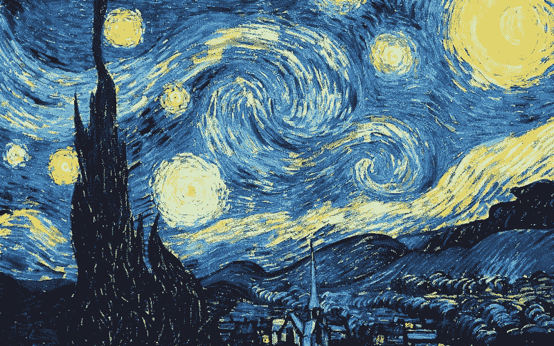
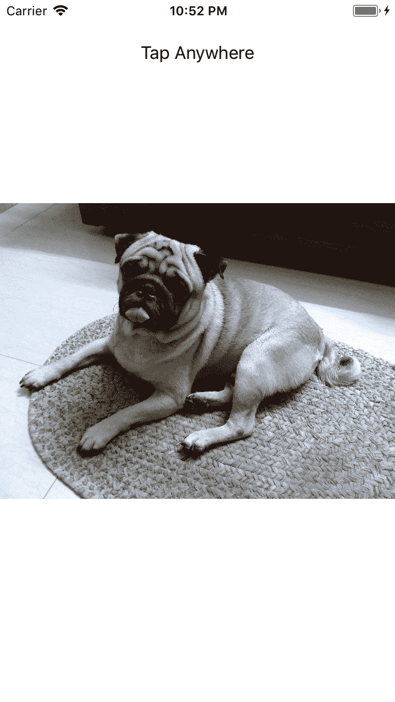
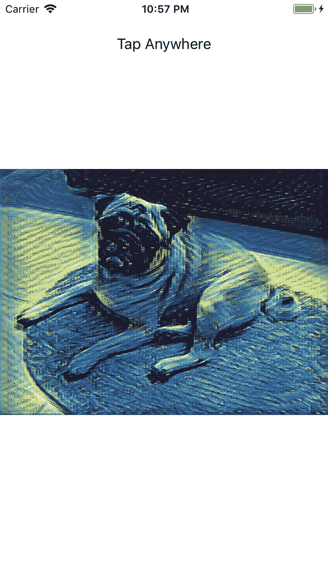
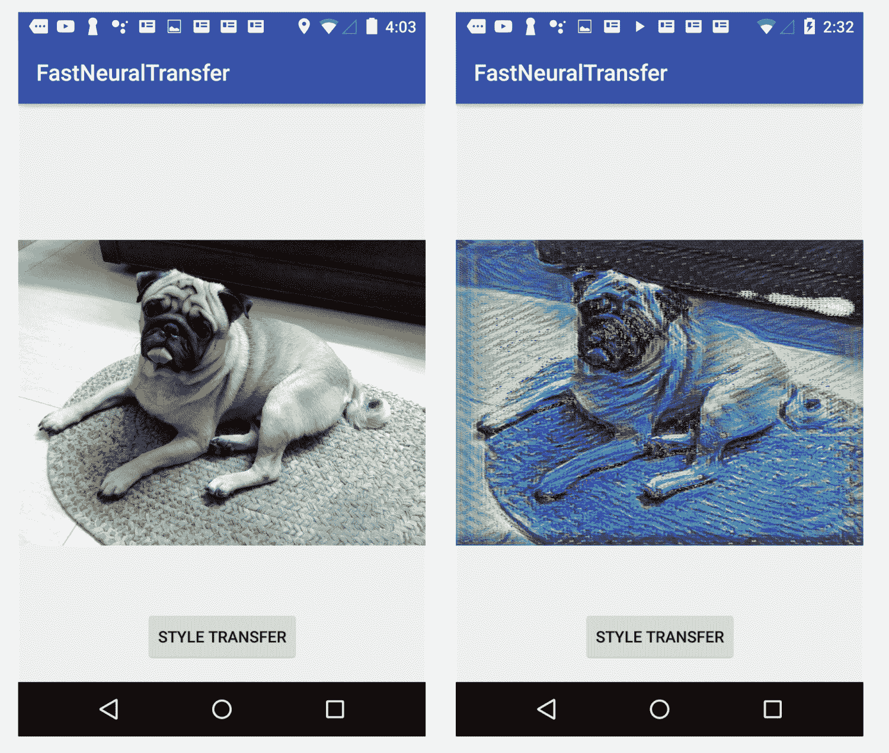
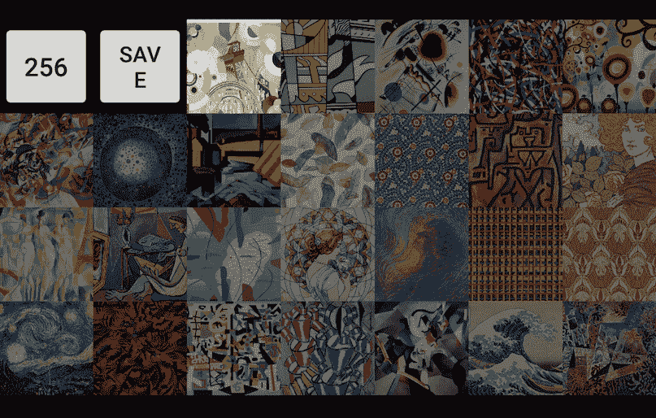
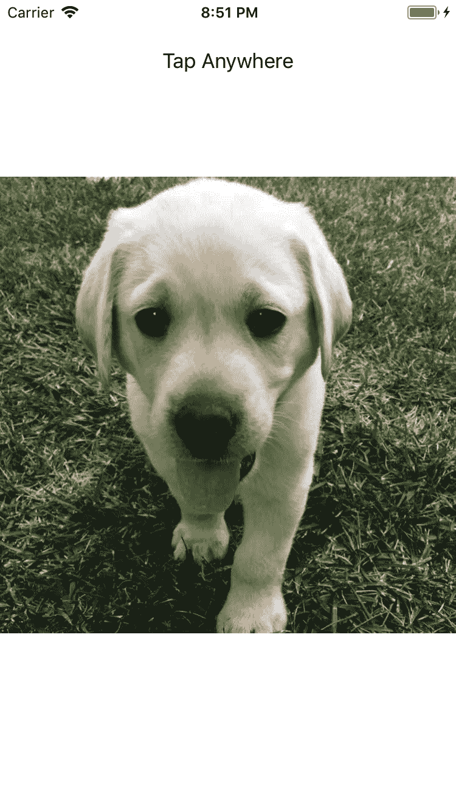
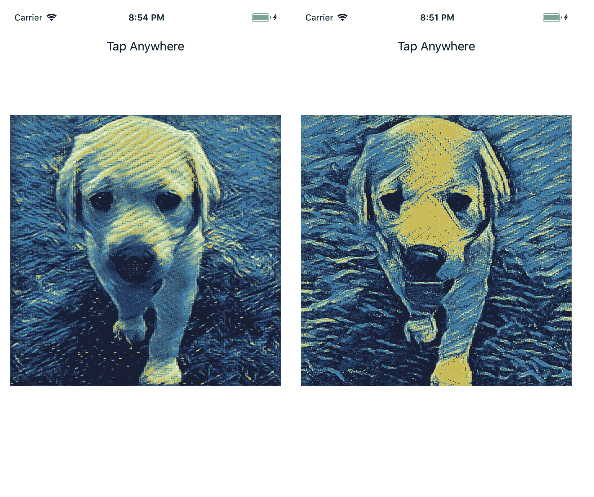
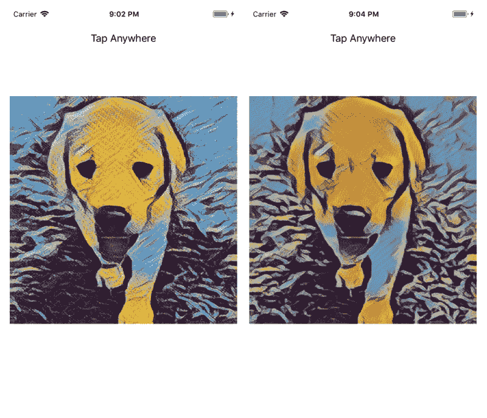
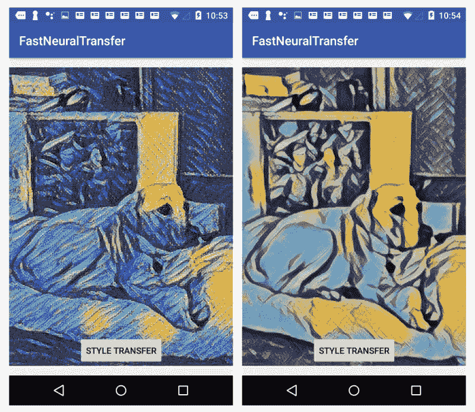

# 以惊人的艺术风格变换图片


自从 2012 年深层神经网络在 AlexNet 赢得 ImageNet 挑战后开始起飞以来，人工智能研究人员一直在将深度学习技术（包括经过预训练的深度 CNN 模型）应用于越来越多的问题领域。 有什么能比创造艺术更有创造力？ 已经提出并实现了  的一种想法，称为神经样式传递，它使您可以利用预先训练的深度神经网络模型并传递图像或任何梵高的样式 或莫奈的杰作），例如另一张图片（例如个人资料图片或您喜欢的狗的图片），从而创建将图片内容与杰作风格融合在一起的图片。 实际上，有一个名为 Prisma 的 iOS 应用程序在 2016 年获得了年度最佳应用程序奖。 在短短几秒钟内，它将以您选择的任何样式转换您的图片。

在本章中，我们将首先概述三种神经样式转换方法，其中一种是原始方法，一种是经过改进的方法，另一种是进一步改进的方法。 然后，我们将详细研究如何使用第二种方法来训练快速神经样式转换模型，该模型可在您的 iOS 和 Android 智能手机中使用，以实现 Prisma 的功能。 接下来，我们将实际在 iOS 应用程序和 Android 应用程序中使用该模型，引导您完成从头开始创建此类应用程序的整个过程。 最后，我们将向您简要介绍 TensorFlow Magenta 开源项目，您可以将其用于基于深度学习构建更多的音乐和艺术生成应用程序，并向您展示如何使用单个预先训练的样式转换模型， 是基于神经样式转换的最新研究进展而创建的，其中包括 26 种很酷的艺术样式，可在您的 iOS 和 Android 应用中获得更快的性能和结果。 总之，本章将涵盖以下主题：

*   神经风格转换-快速概述
*   训练快速的神经风格转换模型
*   在 iOS 中使用快速的神经样式转换模型
*   在 Android 中使用快速的神经样式转换模型

*   在 iOS 中使用 TensorFlow Magenta 多样式模型
*   在 Android 中使用 TensorFlow Magenta 多样式模型


# 神经风格转换-快速概述


使用深度神经网络将图像内容与另一种图像的样式合并的原始思想和算法于 2015 年夏季发表在题为[《艺术风格的神经算法》](https://arxiv.org/abs/1508.06576)的论文中。它是 2014 年 ImageNet 图像识别挑战赛的获胜者，该挑战赛具有 16 个卷积层或特征图，分别代表不同级别的图像内容。 在这种原始方法中，首先将最终传输的图像初始化为与内容图像合并的白噪声图像。 内容损失函数定义为内容图像和结果图像的卷积层`conv4_2`上都被馈入 VGG-19 网络后，特定的一组特征表示形式的平方误差损失。 样式损失函数计算样式图像和所得图像在五个不同卷积层上的总误差差。 然后，将总损失定义为内容损失和样式损失的总和。 在训练期间，损失会降到最低，并生成将一个图像的内容与另一个图像的样式混合在一起的结果图像。

尽管原始神经样式转换算法的结果令人惊叹，但其性能却很差-训练是样式转换图像生成过程的一部分，通常在 GPU 上花费几分钟，在 CPU 上花费约一个小时才能生成良好的图像。 结果。

If you're interested in the details of the original algorithm, you can read the paper along with a well-documented Python implementation, at [https://github.com/log0/neural-style-painting/blob/master/art.py](https://github.com/log0/neural-style-painting/blob/master/art.py). We won't discuss this original algorithm as it's not feasible to run on mobile phone, but it's fun and instrumental to try it to get a better understanding of how to use a pre-trained deep CNN model for different computer vision tasks.

自然地，在 2016 年，论文中发布了一种“快三个数量级”的新算法，即[《实时样式传递和超分辨率的感知损失》](https://cs.stanford.edu/people/jcjohns/eccv16/)，作者是 Justin Johnson 等。 它使用单独的训练过程，并定义了更好的损失函数，这些函数本身就是深度神经网络。 训练后（在下一节中我们将看到，在 GPU 上可能要花费几个小时），使用训练后的模型来生成样式转换的图像在计算机上几乎是实时的，而在智能手机上只需几秒钟。

使用这种快速神经传递算法仍然有一个缺点：只能针对特定样式训练模型，因此，要在您的应用中使用不同的样式，必须逐一训练这些样式以为每种样式生成一个模型 。 2017 年发表了一篇名为[《学习风格的艺术表现形式》](https://arxiv.org/abs/1610.07629)的新论文，它发现一个单一的深度神经网络模型可以 概括许多不同的样式。 [TensorFlow Magenta 项目](https://github.com/tensorflow/magenta/tree/master/magenta/models/image_stylization)包括具有多种样式的预训练模型，我们将在最后一部分中看到 本章的两个部分在 iOS 和 Android 应用程序中使用这种模型来产生强大而神奇的艺术效果是多么容易。


# 训练快速的神经风格转换模型


在本部分中，我们将向您展示如何使用带有 TensorFlow 的快速神经样式传输算法训练模型。 执行以下步骤来训练这样的模型：

1.  在 Mac 的终端上，或者最好在 GPU 驱动的 Ubuntu 上，运行`git clone https://github.com/jeffxtang/fast-style-transfer`，这是 Johnson 的快速样式传输的 TensorFlow 实现的一个很好的分支，已修改为允许在 iOS 或 Android 应用中使用经过训练的模型。
2.  `cd`到快速样式转移目录，然后运行`setup.sh`脚本下载预先训练的 VGG-19 模型文件以及 MS COCO 训练数据集，我们在上一章中提到过-注意 下载大文件可能需要几个小时。
3.  运行以下命令，使用名为`starry_night.jpg`的样式图像和名为`ww1.jpg`的内容图像进行训练，以创建检查点文件：

```py
mkdir checkpoints
mkdir test_dir
python style.py --style images/starry_night.jpg --test images/ww1.jpg --test-dir test_dir --content-weight 1.5e1 --checkpoint-dir checkpoints --checkpoint-iterations 1000 --batch-size 10
```

`images`目录中还有一些其他样式的图像，可用于创建不同的检查点文件。 此处使用的`starry_night.jpg`样式图片是梵高的一幅著名画作，如图 4.1 所示：

Figure 4.1 Using Van Gogh's painting as the style image

在第 1 章， “移动 TensorFlow 入门”中设置的 NVIDIA GTX 1070 GPU 驱动的 Ubuntu 上，整个训练大约需要 5 个小时，并且在 CPU 上肯定要花更长的时间 。

The script was originally written for TensorFlow 0.12 but modified later for TensorFlow 1.1, and has been verified to also run OK in the TensorFlow 1.4 with Python 2.7 environment we set up earlier.

4.  在文本编辑器中打开`evaluate.py`文件，然后取消注释以下两行代码（在 158 和 159 行）：

```py
# saver = tf.train.Saver()
# saver.save(sess, "checkpoints_ios/fns.ckpt")
```

5.  运行以下命令，以输入图像`img_placeholder`和传输的图像`preds`创建新的检查点：

```py
python evaluate.py --checkpoint checkpoints \
 --in-path examples/content/dog.jpg \
 --out-path examples/content/dog-output.jpg
```

6.  运行以下命令以构建一个 TensorFlow 图形文件，该文件将图形定义和检查点中的权重结合在一起。 这将创建一个大约 6.7MB 的`.pb`文件：

```py
python freeze.py --model_folder=checkpoints_ios --output_graph fst_frozen.pb
```

7.  假设您具有`/tf_files`目录，将生成的`fst_frozen.pb`文件复制到`/tf_files`，`cd`直接复制到 TensorFlow 源根目录（可能是`~/tensorflow-1.4.0`），然后运行以下命令以生成量化模型的`.pb`文件（我们在第 2 章，“通过迁移学习对图像进行分类”中介绍了量化）：

```py
bazel-bin/tensorflow/tools/quantization/quantize_graph \
--input=/tf_files/fst_frozen.pb  \
--output_node_names=preds \
--output=/tf_files/fst_frozen_quantized.pb \
--mode=weights
```

这会将冻结的图形文件大小从 6.7MB 减小到 1.7MB，这意味着，如果在您的应用中放置 50 种不同风格的 50 个模型，则增加的大小将约为 85MB。 苹果于 2017 年 9 月宣布，蜂窝无线应用程序下载限制已增加至 150MB，因此用户仍应能够通过蜂窝网络下载具有 50 多种不同样式的应用程序。

这就是使用样式图像和输入图像来训练和量化快速神经传递模型的全部步骤。 您可以在步骤 3 中生成的 `test_dir` 目录中签出生成的图像，以查看样式转换的效果。 如果需要，您可以使用[中记录的超参数 https://github.com/jeffxtang/fast-style-transfer/blob/master/docs.md#style](https://github.com/jeffxtang/fast-style-transfer/blob/master/docs.md#style) 进行查看，以及 希望更好，样式转移效果。

在了解如何在 iOS 和 Android 应用程序中使用这些模型之前，重要的一点是，您需要记下指定为`--in-path` 值的图像的确切图像宽度和高度 ]在第 5 步中使用 参数，并在 iOS 或 Android 代码中使用图像的宽度和高度值（您会看到多久了），否则会出现 `Conv2DCustomBackpropInput: Size of out_backprop doesn't match computed` 错误 在应用中运行模型时。


# 在 iOS 中使用快速的神经样式传输模型


事实证明，在由 TensorFlow 实验性容器构建的 iOS 应用中，使用在步骤 7 中生成的`fst_frozen_quantized.pb`模型文件没有问题，如第 2 章，“通过迁移学习对图像分类”，但 TensorFlow Magenta 项目中的预训练多样式模型文件（我们将在本章的后续部分中使用）将不会随 TensorFlow Pod 一起加载（截至 2018 年 1 月）—尝试加载多样式模型文件时将引发以下错误：

```py
Could not create TensorFlow Graph: Invalid argument: No OpKernel was registered to support Op 'Mul' with these attrs. Registered devices: [CPU], Registered kernels:
  device='CPU'; T in [DT_FLOAT]
   [[Node: transformer/expand/conv1/mul_1 = Mul[T=DT_INT32](transformer/expand/conv1/mul_1/x, transformer/expand/conv1/strided_slice_1)]]
```

在第 3 章，“检测对象及其位置”中，我们讨论了原因以及如何使用手动构建的 TensorFlow 库修复此错误。 由于我们将在同一 iOS 应用程序中使用这两种模型，因此我们将使用功能更强大的手动 TensorFlow 库创建一个新的 iOS 应用程序。


# 使用快速神经传递模型进行添加和测试


如果您尚未手动构建 TensorFlow 库，则需要先回到上一章。 然后执行以下步骤以将 TensorFlow 支持和快速的神经样式传输模型文件添加到您的 iOS 应用并测试运行该应用：

1.  如果您已经具有添加了 TensorFlow 手动库的 iOS 应用，则可以跳过此步骤。 否则，类似于我们在上一章中所做的，创建一个新的基于 Objective-C 的 iOS 应用程序，例如`NeuralStyleTransfer`，或者在现有应用程序中，在`PROJECT`下创建一个新的用户定义设置 使用`$HOME/tensorflow-1.4.0`值命名为`TENSORFLOW_ROOT`的构建设置，假定在那儿已安装 TensorFlow 1.4.0，然后在`TARGET`的构建设置中，将其他链接器标志设置为：

```py
-force_load $(TENSORFLOW_ROOT)/tensorflow/contrib/makefile/gen/lib/libtensorflow-core.a $(TENSORFLOW_ROOT)/tensorflow/contrib/makefile/gen/protobuf_ios/lib/libprotobuf.a $(TENSORFLOW_ROOT)/tensorflow/contrib/makefile/gen/protobuf_ios/lib/libprotobuf-lite.a $(TENSORFLOW_ROOT)/tensorflow/contrib/makefile/downloads/nsync/builds/lipo.ios.c++11/nsync.a
```

然后将标题搜索路径设置为：

```py
$(TENSORFLOW_ROOT) $(TENSORFLOW_ROOT)/tensorflow/contrib/makefile/downloads/protobuf/src $(TENSORFLOW_ROOT)/tensorflow/contrib/makefile/downloads $(TENSORFLOW_ROOT)/tensorflow/contrib/makefile/downloads/eigen $(TENSORFLOW_ROOT)/tensorflow/contrib/makefile/gen/proto
```

2.  将 `fst_frozen_quantized.pb` 文件和一些测试图像拖放到项目的文件夹中。 从以前的 iOS 应用程序中，或从本书源代码仓库中`Ch4/ios`下的`NeuralStyleTransfer`应用程序文件夹中复制我们在前几章中使用过的相同`ios_image_load.mm`和`.h`文件到项目中。
3.  将`ViewController.m`重命名为`ViewController.mm`并将其替换为`Ch4/ios/NeuralStyleTransfer`中的`ViewController.h`和`.mm`文件。 在测试运行该应用程序后，我们将详细介绍核心代码段。

4.  在 iOS 模拟器或 iOS 设备上运行该应用程序，您将看到一张狗图片，如图 4.2 所示：

Figure 4.2 The original dog picture before style applied

5.  点击以选择快速样式转移，几秒钟后，您将在图 4.3 中看到一张新图片，其中已转移了繁星点点的夜色：

Figure 4.3 Like having Van Gogh draw your favorite dog

您只需选择喜欢的图片作为样式图像，然后按照上一节中的步骤操作，即可轻松构建具有不同样式的其他模型。 然后，您可以按照本节中的步骤在 iOS 应用中使用模型。 如果您想了解模型的训练方法，则应在上一节的 GitHub 存储库  中查看代码。 让我们详细看一下使用该模型完成魔术的 iOS 代码。


# 使用快速神经传递模型回顾 iOS 代码


`ViewController.mm`中有几个关键代码段，它们在输入图像的预处理和传输图像的后处理中是唯一的：

1.  在步骤 5 中，将两个常量`wanted_width`和`wanted_height`定义为与存储库图像`examples/content/dog.jpg`的图像宽度和高度相同的值：

```py
const int wanted_width = 300;
const int wanted_height = 400;
```

2.  iOS 的分派队列用于在非 UI 线程中加载和运行我们的快速神经传递模型，并在生成样式转换的图像后，将图像发送到 UI 线程进行显示：

```py
dispatch_async(dispatch_get_global_queue(0, 0), ^{
    UIImage *img = imageStyleTransfer(@"fst_frozen_quantized");
    dispatch_async(dispatch_get_main_queue(), ^{
        _lbl.text = @"Tap Anywhere";
        _iv.image = img;
    });
});
```

3.  定义了一个浮点数的 3 维张量，该张量用于将输入图像数据转换为：

```py
tensorflow::Tensor image_tensor(tensorflow::DT_FLOAT, tensorflow::TensorShape({wanted_height, wanted_width, wanted_channels}));
auto image_tensor_mapped = image_tensor.tensor<float, 3>();
```

4.  发送到 TensorFlow `Session->Run`方法的输入节点名称和输出节点名称定义为与训练模型时相同：

```py
std::string input_layer = "img_placeholder";
std::string output_layer = "preds";
std::vector<tensorflow::Tensor> outputs;
tensorflow::Status run_status = session->Run({{input_layer, image_tensor}} {output_layer}, {}, &outputs);
```

5.  模型完成运行并发送回输出张量（其中包含 0 到 255 范围内的 RGB 值）后，我们需要调用一个名为`tensorToUIImage`的实用函数，以将张量数据首先转换为 RGB 缓冲区：

```py
UIImage *imgScaled = tensorToUIImage(model, output->flat<float>(), image_width, image_height);

static UIImage* tensorToUIImage(NSString *model, const Eigen::TensorMap<Eigen::Tensor<float, 1, Eigen::RowMajor>, Eigen::Aligned>& outputTensor, int image_width, int image_height) {
    const int count = outputTensor.size();
    unsigned char* buffer = (unsigned char*)malloc(count);

    for (int i = 0; i < count; ++i) {
        const float value = outputTensor(i);
        int n;
        if (value < 0) n = 0;
        else if (value > 255) n = 255;
        else n = (int)value;
        buffer[i] = n;
    }
```

6.  然后，我们将缓冲区转换为`UIImage`实例，然后再调整其大小并返回以供显示：

```py
UIImage *img = [ViewController convertRGBBufferToUIImage:buffer withWidth:wanted_width withHeight:wanted_height];
UIImage *imgScaled = [img scaleToSize:CGSizeMake(image_width, image_height)];
return imgScaled;
```

完整的代码和应用程​​序位于`Ch4/ios/NeuralStyleTransfer`文件夹中。


# 在 Android 中使用快速的神经样式传输模型


在第 2 章，“通过迁移学习对图像进行分类”中，我们描述了如何将 TensorFlow 添加到您自己的 Android 应用中，但没有任何 UI。 让我们创建一个新的 Android 应用程序，以使用我们之前训练并在 iOS 中使用的快速样式传输模型。

由于此 Android 应用程序提供了一个很好的机会来使用最少的 TensorFlow 相关代码，Android UI 和线程化代码来运行完整的 TensorFlow 模型驱动的应用程序，因此，我们将从头开始添加每行代码，以帮助您进一步了解 从头开始开发 Android TensorFlow 应用需要什么：

1.  在 Android Studio 中，选择“文件 | 新增 | 新项目...”，然后输入`FastNeuralTransfer`作为应用程序名称； 在单击“完成”之前，接受所有默认设置。

2.  创建一个新的`assets`文件夹，如图 2.13 所示，然后将您训练过的快速神经传递模型从 iOS 应用中拖动（如果您在上一节中尝试过），或者从文件夹`/tf_files`中拖动，如“训练快速神经样式转换模型”部分步骤 7 所示，以及一些测试图像到`assets`文件夹。

3.  在应用程序的`build.gradle` 文件中，在 `dependencies` 的末尾添加一行 `compile 'org.tensorflow:tensorflow-android:+'`和。

4.  打开`res/layout/activity_main.xml`文件，在其中删除默认的`TextView`，然后首先添加一个`ImageView`以显示样式转换前后的图像：

```py
<ImageView
    android:id="@+id/imageview"
    android:layout_width="match_parent"
    android:layout_height="match_parent"
    app:layout_constraintBottom_toBottomOf="parent"
    app:layout_constraintLeft_toLeftOf="parent"
    app:layout_constraintRight_toRightOf="parent"
    app:layout_constraintTop_toTopOf="parent"/>
```

5.  添加一个按钮以启动样式转换操作：

```py
<Button
    android:id="@+id/button"
    android:layout_width="wrap_content"
    android:layout_height="wrap_content"
    android:text="Style Transfer"
    app:layout_constraintBottom_toBottomOf="parent"
    app:layout_constraintHorizontal_bias="0.502"
    app:layout_constraintLeft_toLeftOf="parent"
    app:layout_constraintRight_toRightOf="parent"
    app:layout_constraintTop_toTopOf="parent"
    app:layout_constraintVertical_bias="0.965" />
```

6.  在应用程序的`MainActivity.java`文件中，首先输入我们最重要的导入：

```py
import org.tensorflow.contrib.android.TensorFlowInferenceInterface;    
```

`TensorFlowInferenceInterface`提供 JAVA 接口来访问本机 TensorFlow 推理 API。 然后确保`MainActivity`类实现了`Runnable` 接口，因为我们需要保持我们的应用程序响应速度，并在工作线程上加载并运行 TensorFlow 模型。

7.  在类的开头，定义六个常量，如下所示：

```py
private static final String MODEL_FILE = "file:///android_asset/fst_frozen_quantized.pb";
private static final String INPUT_NODE = "img_placeholder";
private static final String OUTPUT_NODE = "preds";
private static final String IMAGE_NAME = "pug1.jpg";
private static final int WANTED_WIDTH = 300;
private static final int WANTED_HEIGHT = 400;
```

您可以将任何训练有素的模型文件用于`MODEL_FILE`。 `INPUT_NODE`和`OUTPUT_NODE`的值与我们在 Python 训练脚本中设置并在 iOS 应用中使用的值相同。 同样，`WANTED_WIDTH`和`WANTED_HEIGHT`与我们在“训练快速神经风格转换模型”部分的第 5 步中使用的`--in-path`图像的宽度和高度相同。

8.  声明四个实例变量：

```py
private ImageView mImageView;
private Button mButton;
private Bitmap mTransferredBitmap;

private TensorFlowInferenceInterface mInferenceInterface;
```

`mImageView`和`mButton`将使用`onCreate`方法中的简单`findViewById`方法进行设置。 `mTransferredBitmap`将保留已传输图像的位图，以便`mImageView`可以显示它。 `mInferenceInterface`用于加载我们的 TensorFlow 模型，将输入图像输入模型，运行模型，并返回推理结果。

9.  在我们的 TensorFlow 推断线程向`Handler`实例发送消息之后，创建一个`Handler`实例来处理在主线程中显示最终传输的图像的任务，我们还创建一个方便的`Toast`消息：

```py
Handler mHandler = new Handler() {
    @Override
    public void handleMessage(Message msg) {
        mButton.setText("Style Transfer");
        String text = (String)msg.obj;
        Toast.makeText(MainActivity.this, text, 
                   Toast.LENGTH_SHORT).show();
        mImageView.setImageBitmap(mTransferredBitmap);
    } };
```

10.  在`onCreate`方法内部，我们将使用`mImageView`实例变量绑定布局 xml 文件中的`ImageView`，将测试图像的位图加载到`assets`文件夹中，并在`ImageView`中显示 ：

```py
mImageView = findViewById(R.id.imageview);
try {
    AssetManager am = getAssets();
    InputStream is = am.open(IMAGE_NAME);
    Bitmap bitmap = BitmapFactory.decodeStream(is);
    mImageView.setImageBitmap(bitmap);
} catch (IOException e) {
    e.printStackTrace();
}
```

11.  类似地设置`mButton`并设置一个点击侦听器，以便在点击按钮时，创建并启动一个新线程，并调用`run`方法：

```py
mButton = findViewById(R.id.button);
mButton.setOnClickListener(new View.OnClickListener() {
    @Override
    public void onClick(View v) {
        mButton.setText("Processing...");
        Thread thread = new Thread(MainActivity.this);
        thread.start();
    }
});
```

12.  在线程的`run`方法中，我们首先声明三个数组，并为其分配适当的内存：`intValues`数组保存测试图像的像素值，每个像素值代表 32 位 ARGB（Alpha，红，绿，蓝色）值； `floatValues`阵列如模型所预期的那样分别保存每个像素的红色，绿色和蓝色值，因此其大小是`intValues`的三倍，并且`outputValues`的大小与`floatValues`相同 ]，但保留模型的输出值：

```py
public void run() {
    int[] intValues = new int[WANTED_WIDTH * WANTED_HEIGHT];
    float[] floatValues = new float[WANTED_WIDTH * WANTED_HEIGHT * 3];
    float[] outputValues = new float[WANTED_WIDTH * WANTED_HEIGHT * 3];
```

然后，我们获得测试图像的位图数据，对其进行缩放以匹配训练中使用的图像的大小，然后将缩放后的位图的像素加载到`intValues`数组并将其转换为`floatValues`：

```py
Bitmap bitmap = BitmapFactory.decodeStream(getAssets().open(IMAGE_NAME));
Bitmap scaledBitmap = Bitmap.createScaledBitmap(bitmap, WANTED_WIDTH, WANTED_HEIGHT, true);
scaledBitmap.getPixels(intValues, 0, scaledBitmap.getWidth(), 0, 0, scaledBitmap.getWidth(), scaledBitmap.getHeight());

for (int i = 0; i < intValues.length; i++) {
    final int val = intValues[i];
    floatValues[i*3] = ((val >> 16) & 0xFF);
    floatValues[i*3+1] = ((val >> 8) & 0xFF);
    floatValues[i*3+2] = (val & 0xFF);
}
```

注意，`val`或`intValues`像素阵列的每个元素是一个 32 位整数，在其每个 8 位区域中均保留 ARGB。 我们使用向右移位（用于红色和绿色）和按位与运算来提取每个像素的红色，绿色和蓝色值，而忽略`intValues`元素中最左边的 8 位的 Alpha 值。 因此`floatValues[i*3]`，`floatValues[i*3+1]`和`floatValues[i*3+2]`分别保持像素的红色，绿色和蓝色值。

现在，我们创建一个新的`TensorFlowInferenceInterface`实例，并在其中将`AssetManager`实例和模型文件名传递到`assets`文件夹中，然后使用 `TensorFlowInferenceInterface`实例将转换后的[ `floatValues`阵列。 如果模型需要多个输入节点，则可以调用多个`feed`方法。 然后，我们通过传递输出节点名称的字符串数组来运行模型。 在这里，对于我们的快速样式传输模型，我们只有一个输入节点和一个输出节点。 最后，我们通过传递输出节点名称来获取模型的输出值。 如果希望接收多个输出节点，则可以调用多个访存：

```py
AssetManager assetManager = getAssets();
mInferenceInterface = new TensorFlowInferenceInterface(assetManager, MODEL_FILE);
mInferenceInterface.feed(INPUT_NODE, floatValues, WANTED_HEIGHT, WANTED_WIDTH, 3);
mInferenceInterface.run(new String[] {OUTPUT_NODE}, false);
mInferenceInterface.fetch(OUTPUT_NODE, outputValues);
```

模型生成的`outputValues`在每个元素中都保留 0 到 255 之间的 8 位红色，绿色和蓝色值之一，我们首先对红色和绿色值使用左移操作，但是 具有不同的移位大小（16 和 8），然后使用按位或运算将 8 位 Alpha 值（`0xFF`）与 8 位 RGB 值组合，将结果保存在`intValues`数组中：

```py
for (int i=0; i < intValues.length; ++i) {
    intValues[i] = 0xFF000000
                    | (((int) outputValues[i*3]) << 16)
                    | (((int) outputValues[i*3+1]) << 8)
                    | ((int) outputValues[i*3+2]);
```

然后，我们创建一个新的`Bitmap`实例，并使用`intValues`数组设置其像素值，将位图缩放到测试图像的原始大小，并将缩放后的位图保存到`mTransferredBitmap`：

```py
Bitmap outputBitmap = scaledBitmap.copy( scaledBitmap.getConfig() , true);
outputBitmap.setPixels(intValues, 0, outputBitmap.getWidth(), 0, 0, outputBitmap.getWidth(), outputBitmap.getHeight());
mTransferredBitmap = Bitmap.createScaledBitmap(outputBitmap, bitmap.getWidth(), bitmap.getHeight(), true);
```

最后，我们向主线程的处理程序发送一条消息，以使其知道显示样式转换图像的时间：

```py
Message msg = new Message();
msg.obj = "Tranfer Processing Done";
mHandler.sendMessage(msg);
```

因此，总共不到 100 行代码，您就有了一个完整的 Android 应用程序，可以对图像进行惊人的样式转换。 在 Android 设备或虚拟设备上运行该应用程序，首先将看到一个带有按钮的测试图像，点击该按钮，几秒钟后，您将看到样式转换的图像，如图 4.4 所示：

Figure 4.4 The original image and style transferred image on Android

快速神经样式模型存在的一个问题是，即使量化后每个模型只有 1.7MB，我们仍然需要针对每种样式分别进行训练，并且每个训练的模型只能支持一种样式转换。 幸运的是，这个问题有很好的解决方案。


# 在 iOS 中使用 TensorFlow Magenta 多样式模型


[TensorFlow Magenta 项目](https://github.com/tensorflow/magenta)允许您使用 10 多种经过预训练的模型来生成新的音乐和图像。 在本节和下一节中，我们将重点介绍使用 Magenta 的图像样式化模型。 您可以单击链接在计算机上安装 Magenta，尽管要在移动应用程序中使用其炫酷的图像样式传输模型，也不必安装 Magenta。 基于论文《艺术风格的习得表示》实现的 Magenta 预训练风格转换模型，消除了一个模型只能具有一种风格并允许多种风格的限制 包含在单个模型文件中，您可以选择使用这些样式的任意组合。 您可以在[这个页面](https://github.com/tensorflow/magenta/tree/master/magenta/models/image_stylization)上快速浏览该演示，但可以在此处下载两个预先训练的检查点模型。 由于检查点文件中保存了某些`NaN`（不是数字）错误，因此无法直接在您的移动应用中使用。 我们不会详细说明如何删除这些数字并生成可在您的应用中使用的`.pb`模型文件（如果感兴趣，您可以查看 这里](https://github.com/tensorflow/tensorflow/issues/9678)），我们仅使用 TensorFlow Android 示例`tensorflow/examples/android/assets`中包含的经过预训练的`stylize_quantized.pb`模型文件来查看其工作原理。

如果您确实想训练自己的模型，则可以按照前面的`image_stylization`链接中的训练模型下的步骤进行。 但是请注意，您至少需要 500GB 的可用磁盘空间才能下载 ImageNet 数据集，并需要强大的 GPU 来完成训练。 在本节或下一节中看到代码和结果之后，您更有可能对预训练的`stylize_quantized.pb`模型启用的炫酷样式转换效果感到满意。

在本章前面创建的 iOS 应用中，执行以下步骤来使用和运行多样式模型：

1.  将 `stylize_quantized.pb`文件从`tensorflow/examples/android/assets`拖放到 Xcode 中的 iOS `apps`文件夹中。
2.  使用用于加载和处理快速传输样式模型的相同 `dispatch_async` ，向抽头处理程序中添加新的`UIAlertAction` ：

```py
UIAlertAction* multi_style_transfer = [UIAlertAction actionWithTitle:@"Multistyle Transfer" style:UIAlertActionStyleDefault handler:^(UIAlertAction * action) {
    _lbl.text = @"Processing...";
    _iv.image = [UIImage imageNamed:image_name];
    dispatch_async(dispatch_get_global_queue(0, 0), ^{
        UIImage *img = imageStyleTransfer(@"stylize_quantized");
        dispatch_async(dispatch_get_main_queue(), ^{
            _lbl.text = @"Tap Anywhere";
            _iv.image = img;
        });
    });
}];
```

3.  将`input_layer`和`output_layer`值替换为新模型的正确值，并添加一个名为`style_num`的新输入节点名称（这些值来自`StylizeActivity.java`中的示例 Android 代码，但您也可以使用`summarize_graph`工具，TensorBoard 或我们在前几章中显示的代码段中找到它们）：

```py
std::string input_layer = "input";
std::string style_layer = "style_num";
std::string output_layer = "transformer/expand/conv3/conv/Sigmoid";
```

4.  与快速样式传输模型不同，此处的多样式模型期望使用 4 维浮点张量作为图像输入：

```py
tensorflow::Tensor image_tensor(tensorflow::DT_FLOAT, tensorflow::TensorShape({1, wanted_height, wanted_width, wanted_channels}));
auto image_tensor_mapped = image_tensor.tensor<float, 4>();
```

5.  我们还需要将`style_tensor`定义为形状为`[NUM_STYLES * 1]`的另一个张量，其中`NUM_STYLES`在`ViewController.mm`的开头定义为`const int NUM_STYLES = 26;`。 数字 26 是 `stylize_quantized.pb`模型文件中内置的样式数，您可以在其中运行 Android TF 风格化应用并查看 26 种结果，如图 4.5 所示。 请注意，第 20 张图片（左下角的图片）是梵高熟悉的繁星点点的夜晚：

Figure 4.5 The 26 style images in the multi-style model

```py
tensorflow::Tensor style_tensor(tensorflow::DT_FLOAT, tensorflow::TensorShape({ NUM_STYLES, 1}));
auto style_tensor_mapped = style_tensor.tensor<float, 2>();
float* out_style = style_tensor_mapped.data();
for (int i = 0; i < NUM_STYLES; i++) {
    out_style[i] = 0.0 / NUM_STYLES; 
}
out_style[19] = 1.0;
```

`out_style`数组中所有值的总和必须为 1，最终的样式传输图像将是由`out_style`数组中指定的值加权的样式的混合。 例如，前面的代码将仅使用繁星点点的夜晚样式（数组索引 19 对应于图 4.5 中的样式图像列表中的第 20 个图像）。

如果希望将繁星点点的夜景图像和右上角图像均匀混合，则需要用以下代码替换前面代码块中的最后一行：

```py
out_style[4] = 0.5;
out_style[19] = 0.5;
```

如果您希望所有 26 种样式均等地混合使用，请将前面的`for`循环更改为以下样式，并且不要将其他值设置为任何特定的`out_style`元素：

```py
for (int i = 0; i < NUM_STYLES; i++) {
    out_style[i] = 1.0 / NUM_STYLES; 
}
```

稍后，您将在图 4.8 和 4.9 中看到这三种设置的样式转移效果。

6.  将`session->Run`调用更改为以下行，以将图像张量和样式张量都发送到模型：

```py
tensorflow::Status run_status = session->Run({{input_layer, image_tensor}, {style_layer, style_tensor}}, {output_layer}, {}, &outputs);
```

这些就是使用多样式模型运行 iOS 应用所需的全部更改。 现在运行您的应用程序，您将首先看到如图 4.6 所示的内容：

Figure 4.6 Showing the original content image

点击任意位置，您将看到两个样式选择，如图 4.7 所示：

Figure 4.7 Showing the choice of two style models

两张已传输图像的结果，`out_style[19] = 1.0`; 如图 4.8 所示：

Figure 4.8 The style-transferred results with two different models (fast style transfer on the left, multi-style on the right)

图 4.9 显示了在图 4.5 中使用星夜图像和右上角图像的均等混合以及所有 26 种样式的均等混合的结果，如图 4.9 所示：

Figure 4.9 Results of different mixes of multiple styles (half starry night half the other on the left, mix of all 26 styles on the right)

多样式模型在 iPhone 6 上运行大约需要 5 秒钟，比快速样式传输模型运行快大约 2-3 倍。


# 在 Android 中使用 TensorFlow Magenta 多样式模型


尽管 TensorFlow Android 示例应用程序已经具有使用多种样式模型的代码（实际上我们在上一节的 iOS 应用中使用了 Android 示例应用程序中的模型），但示例应用程序中与 TensorFlow 相关的代码却与 超过 600 行的`StylizeActivity.java`文件中包含很多 UI 代码。 您还可以通过 TensorFlow Android 样式转换的 [Codelab](https://codelabs.developers.google.com/codelabs/tensorflow-style-transfer-android/index.html) 进行操作，但是代码 与 TensorFlow Android 示例应用程序大致相同。 由于我们已经使用 TensorFlow 快速样式传输模型实现了 Android 应用程序的简约实现，因此很有趣的是，我们如何仅需更改几行代码就可以拥有一个强大的多样式样式传输应用程序。 这也应该是一种更直观的方法，以了解如何将出色的 TensorFlow 模型添加到现有的 Android 应用中。

因此，这就是在我们之前构建的 Android 应用中使用多样式传输模型所需要的：

1.  将  `stylize_quantized.pb`文件从`tensorflow/examples/android/assets`拖放到我们 Android 应用程序的`assets`文件夹中。

2.  在 Android Studio 中，打开`MainActivity.java`，找到以下三行代码：

```py
private static final String MODEL_FILE = "file:///android_asset/fst_frozen_quantized.pb";
private static final String INPUT_NODE = "img_placeholder";
private static final String OUTPUT_NODE = "preds";
```

然后将它们替换为以下四行：

```py
private static final int NUM_STYLES = 26;
private static final String MODEL_FILE = "file:///android_asset/stylize_quantized.pb";
private static final String INPUT_NODE = "input";
private static final String OUTPUT_NODE = "transformer/expand/conv3/conv/Sigmoid";
```

这些值与我们在上一节中构建的 iOS 应用相同。 如果您仅进行 Android 应用程序开发并跳过了上一个 iOS 部分，请快速阅读上一个 iOS 部分中对步骤 3 的解释。

3.  替换以下代码片段，该片段将输入图像馈送到快速样式传输模型并处理输出图像：

```py
mInferenceInterface.feed(INPUT_NODE, floatValues, WANTED_HEIGHT, WANTED_WIDTH, 3);
mInferenceInterface.run(new String[] {OUTPUT_NODE}, false);
mInferenceInterface.fetch(OUTPUT_NODE, outputValues);
for (int i = 0; i < intValues.length; ++i) {
    intValues[i] = 0xFF000000
            | (((int) outputValues[i * 3]) << 16)
            | (((int) outputValues[i * 3 + 1]) << 8)
            | ((int) outputValues[i * 3 + 2]);
}
```

使用首先设置`styleVals`数组的代码段（如果对`styleVals`和如何设置数组的值感到困惑，请查看上一节第 5 步中的注释）：

```py
final float[] styleVals = new float[NUM_STYLES];
for (int i = 0; i < NUM_STYLES; ++i) {
    styleVals[i] = 0.0f / NUM_STYLES;
}
styleVals[19] = 0.5f;
styleVals[4] = 0.5f;
```

然后将输入图像张量和样式值张量同时馈送到模型，并运行模型以获取传输的图像：

```py
mInferenceInterface.feed(INPUT_NODE, floatValues, 1, WANTED_HEIGHT, WANTED_WIDTH, 3);
mInferenceInterface.feed("style_num", styleVals, NUM_STYLES);
mInferenceInterface.run(new String[] {OUTPUT_NODE}, false);
mInferenceInterface.fetch(OUTPUT_NODE, outputValues);
```

最后，它处理输出：

```py
for (int i=0; i < intValues.length; ++i) {
    intValues[i] = 0xFF000000
                    | (((int) (outputValues[i*3] * 255)) << 16)
                    | (((int) (outputValues[i*3+1] * 255)) << 8)
                    | ((int) (outputValues[i*3+2] * 255));
}
```

注意，多样式模型返回浮点数数组 至 `outputValues` ，它们的范围都在 0.0 到 1.0 之间，因此我们需要将它们相乘 在应用左位移操作以获取红色和绿色值之前，先进行 255 乘以 255，然后对 `intValues` 数组的每个元素应用按位“或”设置最终 ARGB 值。

这就是将酷炫的多样式模型添加到独立的 Android 应用程序所需的全部工作。 现在，让我们运行该应用程序，并使用不同的测试图像，但使用与 iOS 应用程序中相同的三种样式值组合。

将第 20 和第 5 种样式图像按步骤 3 中的代码片段进行均等混合后，原始图像和传输的图像如图 4.10 所示：

Figure 4.10 The original content image and the style transferred image with a mix of the 5th image and the starry night image

如果替换以下两行代码：

```py
styleVals[19] = 0.5f;
styleVals[4] = 0.5f;
```

用单行代码`styleVals[19] = 1.5f;`或替换以下代码段：

```py
for (int i = 0; i < NUM_STYLES; ++i) {
    styleVals[i] = 0.0f / NUM_STYLES;
}
styleVals[19] = 0.5f;
styleVals[4] = 0.5f;
```

带有以下代码段：

```py
for (int i = 0; i < NUM_STYLES; ++i) {
    styleVals[i] = 1.0f / NUM_STYLES;
}
```

然后，您将在图 4.11 中看到效果：

Figure 4.11 Images stylized with the starry night style only and with all the 26 styles mixed equally

在一些强大的 TensorFlow 模型的帮助下以及我们如何在移动应用程序中使用它们的知识，看起来我们的移动开发人员也可以成为伟大的艺术家。


# 概要


在本章中，我们首先概述了自 2015 年以来开发的各种神经样式转换方法。然后，我们展示了如何训练第二代样式转换模型，该模型足够快，可以在几秒钟内在移动设备上运行。 之后，我们介绍了如何在 iOS 应用程序和 Android 应用程序中使用该模型，这些方法是从头开始构建的，采用极简方法，总共不到 100 行代码。 最后，我们讨论了如何在 iOS 和 Android 应用程序中使用 TensorFlow Magenta 多样式神经传递模型，该模型在单个小模型中包含 26 种惊人的艺术样式。

在下一章中，我们将探讨另一个在人类或我们最好的朋友演示时被视为智能的任务：能够识别语音命令。 谁不想让我们的狗狗理解“坐下”，“来”，“不”等命令或我们的婴儿对“是”，“停止”或“走”做出回应？ 让我们看看我们如何开发与它们一样的移动应用程序。


