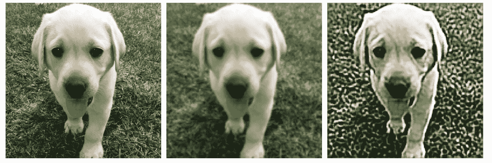
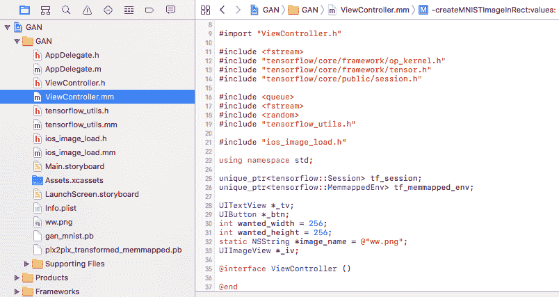
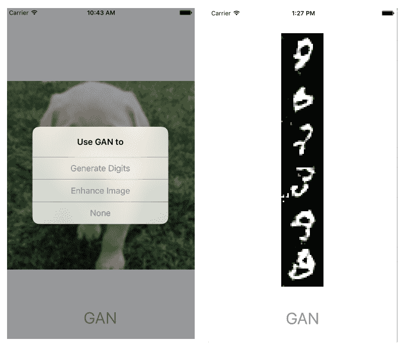
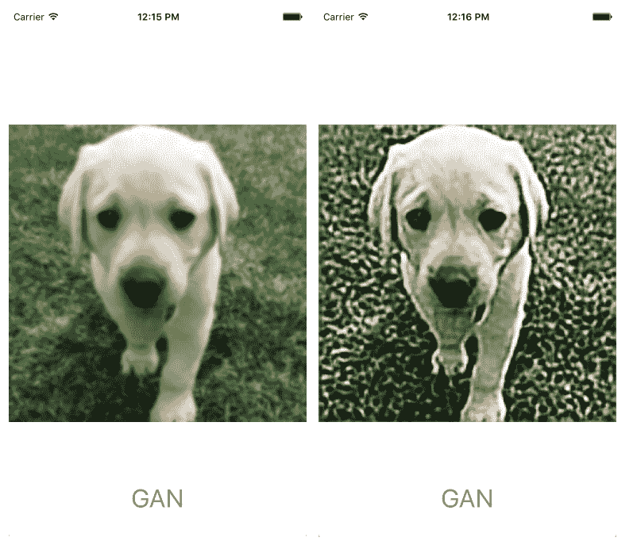
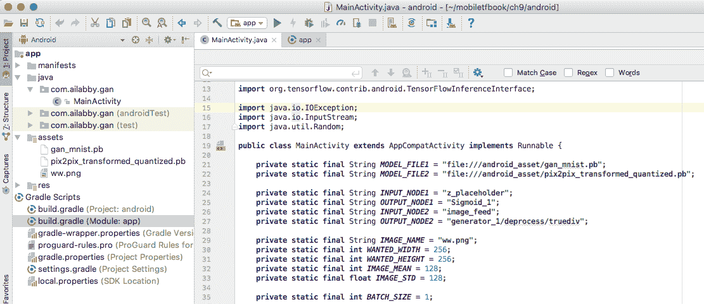
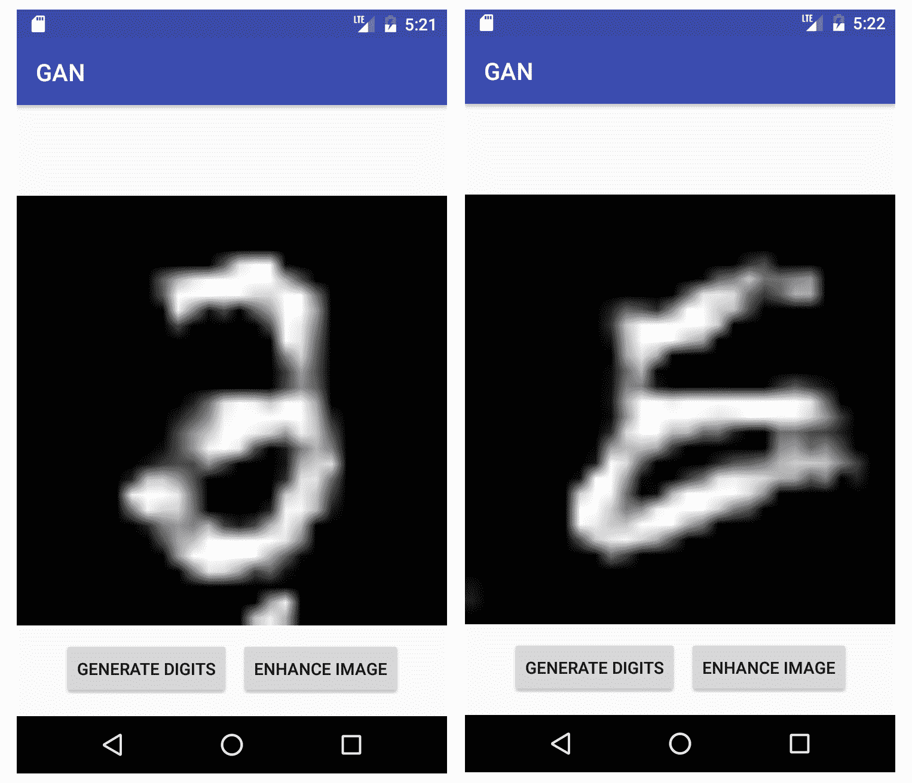
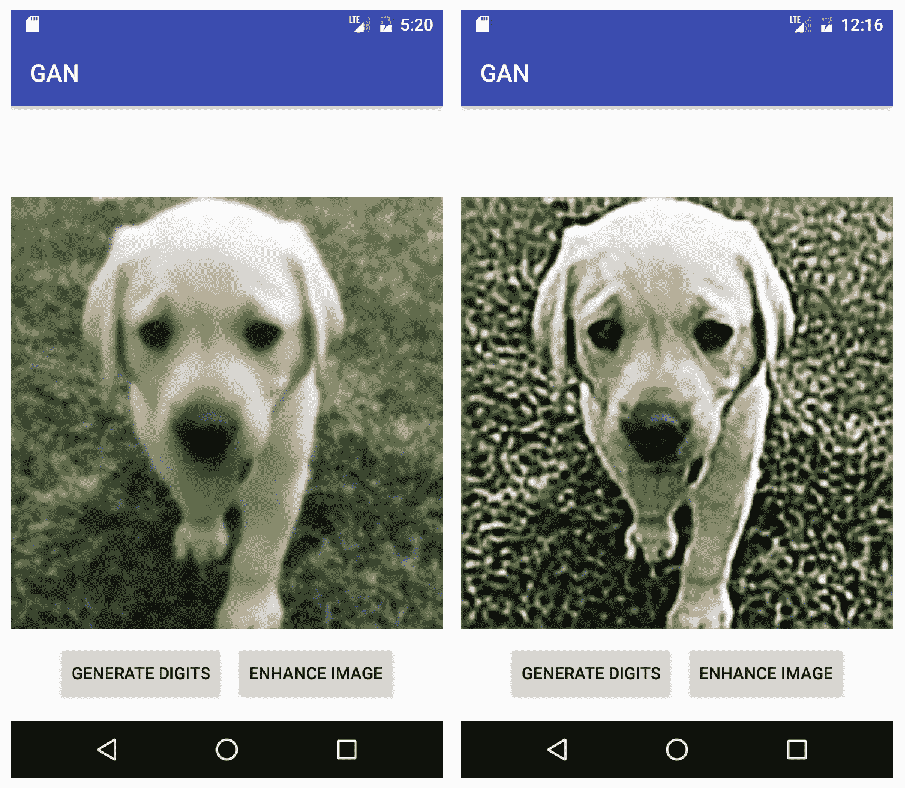

# 使用 GAN 生成和增强图像


自 2012 年深度学习起步以来，有人认为 Ian Goodfellow 在 2014 年提出的[**生成对抗网络**](https://arxiv.org/abs/1406.2661)（**GAN**）比这更有趣或更有前途。 实际上， Facebook AI 研究主管和之一，深度学习研究人员之一的 Yann LeCun 将 GAN 和对抗训练称为*，“这是近十年来机器学习中最有趣的想法。 ”* 因此，我们如何在这里不介绍它，以了解 GAN 为什么如此令人兴奋，以及如何构建 GAN 模型并在 iOS 和 Android 上运行它们？

在本章中，我们将首先概述 GAN 是什么，它如何工作以及为什么它具有如此巨大的潜力。 然后，我们将研究两个 GAN 模型：一个基本的 GAN 模型可用于生成类似人的手写数字，另一个更高级的 GAN 模型可将低分辨率的图像增强为高分辨率的图像。 我们将向您展示如何在 Python 和 TensorFlow 中构建和训练此类模型，以及如何为移动部署准备模型。 然后，我们将提供带有完整源代码的 iOS 和 Android 应用程序，它们使用这些模型来生成手写数字并增强图像。 在本章的最后，您应该准备好进一步探索各种基于 GAN 的模型，或者开始构建自己的模型，并了解如何在移动应用程序中运行它们。

总之，本章将涵盖以下主题：

*   GAN –什么以及为什么
*   使用 TensorFlow 构建和训练 GAN 模型
*   在 iOS 中使用 GAN 模型
*   在 Android 中使用 GAN 模型


# GAN –什么以及为什么


GAN 是学习生成类似于真实数据或训练集中数据的神经网络。 GAN 的关键思想是让生成器网络和鉴别器网络相互竞争：生成器试图生成看起来像真实数据的数据，而鉴别器试图分辨生成的数据是否真实（从已知实数 数据）或伪造（由生成器生成）。 生成器和鉴别器是一起训练的，在训练过程中，生成器学会生成看起来越来越像真实数据的数据，而鉴别器则学会将真实数据与伪数据区分开。 生成器通过尝试使鉴别器的输出概率为真实数据来学习，当将生成器的输出作为鉴别器的输入时，生成器的输出概率尽可能接近 1.0，而鉴别器通过尝试实现两个目标来学习：

*   当以发电机的输出作为输入时，使其输出的可能性为实，尽可能接近 0.0，这恰好是发电机的相反目标
*   当输入真实数据作为输入时，使其输出的可能性为实数，尽可能接近 1.0

In the next section, you'll see a detailed code snippet that matches the given description of the generator and the discriminator networks and their training process. If you feel like understanding more about GANs, in addition to our summary overview here, you can search for *"Introduction to GANs"* on YouTube and watch Ian Goodfellow's introduction and tutorial videos on GAN at NIPS (Neural Information Processing Systems) Conference 2016 and ICCV (International Conference on Computer Vision) 2017\. In fact, there are 7 NIPS 2016 Workshop on Adversarial Training videos and 12 ICCV 2017 GAN Tutorial videos on YouTube that you can immerse yourself in.

在生成者和区分者两个参与者的竞争目标下，GAN 是一个寻求两个对手之间保持平衡的系统。 如果两个玩家都具有无限的能力并且可以进行最佳训练，那么纳什均衡（继 1994 年诺贝尔经济学奖得主约翰·纳什和电影主题 *A Beautiful Mind* 之后） 一种状态，在这种状态下，任何玩家都无法通过仅更改其自己的策略来获利，这对应于生成器生成数据的状态，该数据看起来像真实数据，而鉴别器无法从假数据中分辨真实数据。

If you're interested in knowing more about the Nash Equilibrium, Google *"khan academy nash equilibrium"* and watch the two fun videos on it by Sal Khan. The Wikipedia page on Nash Equilibrium and the article, *"**What is the Nash equilibrium and why does it matter?"* in The Economist explaining economics ([https://www.economist.com/blogs/economist-explains/2016/09/economist-explains-economics](https://www.economist.com/blogs/economist-explains/2016/09/economist-explains-economics)) are also a good read. Understanding the basic intuition and idea behind GANs will help you appreciate more why it has great potential.

生成器能够生成看起来像真实数据的数据的潜力意味着可以使用 GAN 开发各种出色的应用程序，例如：

*   从劣质图像生成高质量图像
*   图像修复（修复丢失或损坏的图像）
*   翻译图像（例如，从边缘草图到照片，或者在人脸上添加或移除诸如眼镜之类的对象）
*   从文本生成图像（在第 6 章，*中以自然语言*描述图像的 Text2Image 相反）
*   撰写看起来像真实新闻的新闻文章
*   生成与训练集中的音频相似的音频波形

基本上，GAN 可以从随机输入生成逼真的图像，文本或音频数据； 如果您具有一组源数据和目标数据的训练集，则 GAN 还可从类似于源数据的输入中生成类似于目标数据的数据。 GAN 模型中的生成器和鉴别器以动态方式工作的这一通用特性，使 GAN 可以生成任何种类的现实输出，这使 GAN 十分令人兴奋。

但是，由于生成器和鉴别器的动态或竞争目标，训练 GAN 达到 Nash 平衡状态是一个棘手且困难的问题。 实际上，这仍然是一个开放的研究问题–伊恩·古德费洛（Ian Goodfellow）在 2017 年 8 月对安德鲁·伍（Andrew Ng）进行的*深度学习英雄*采访中（YouTube 上的搜索 *ian goodfellow andrew ng* ）说，如果我们 可以使 GAN 变得像深度学习一样可靠，我们将看到 GAN 取得更大的成功，否则我们最终将用其他形式的生成模型代替它们。

尽管在 GAN 的培训方面存在挑战，但是在培训期间您已经可以应用[许多有效的已知技巧](https://github.com/soumith/ganhacks) – 我们在这里不会介绍它们，但是如果您有兴趣调整我们将在本章中描述的模型或[许多其他 GAN 模型](https://github.com/eriklindernoren/Keras-GAN) ），或构建自己的 GAN 模型。


# 使用 TensorFlow 构建和训练 GAN 模型


通常，GAN 模型具有两个神经网络：G 用于生成器，D 用于区分器。 x 是来自训练集的一些实际数据输入，z 是随机输入噪声。 在训练过程中，D（x）是 x 为实数的概率，D 尝试使 D（x）接近 1； G（z）是具有随机输入 z 的生成的输出，并且 D 试图使 D（G（z））接近 0，但同时 G 试图使 D（G（z））接近 1。 现在，让我们首先来看一下如何在 TensorFlow 和 Python 中构建基本的 GAN 模型，该模型可以编写或生成手写数字。


# 生成手写数字的基本 GAN 模型


手写数字的训练模型基于[仓库](https://github.com/jeffxtang/generative-adversarial-networks)，这是[这个页面](https://github.com/jonbruner/generative-adversarial-networks)的分支，并添加了显示生成的数字并使用输入占位符保存 TensorFlow 训练模型的脚本，因此我们的 iOS 和 Android 应用程序可以使用该模型。 是的您应该查看[原始仓库的博客](https://www.oreilly.com/learning/generative-adversarial-networks-for-beginners)。在继续之前，需要对具有代码的 GAN 模型有基本的了解。

在研究定义生成器和鉴别器网络并进行 GAN 训练的核心代码片段之前，让我们先运行脚本以在克隆存储库并转到 repo 目录之后训练和测试模型：

```py
git clone https://github.com/jeffxtang/generative-adversarial-networks
cd generative-adversarial-networks
```

该派生向`gan-script-fast.py`脚本添加了检查点保存代码，还添加了新脚本`gan-script-test.py`以使用随机输入的占位符测试和保存新的检查点–因此，新检查点冻结的模型可以在 iOS 和 Android 中使用 应用。

运行命令`python gan-script-fast.py`训练模型，在 Ubuntu 上的 GTX-1070 GPU 上花费不到一小时。 训练完成后，检查点文件将保存在模型目录中。 现在运行`python gan-script-test.py`来查看一些生成的手写数字。 该脚本还从模型目录读取检查点文件，并在运行`gan-script-fast.py`时保存该文件，然后将更新的检查点文件以及随机输入占位符重新保存在`newmodel`目录中：

```py
ls -lt newmodel
-rw-r--r-- 1 jeffmbair staff 266311 Mar 5 16:43 ckpt.meta
-rw-r--r-- 1 jeffmbair staff 65 Mar 5 16:42 checkpoint
-rw-r--r-- 1 jeffmbair staff 69252168 Mar 5 16:42 ckpt.data-00000-of-00001
-rw-r--r-- 1 jeffmbair staff 2660 Mar 5 16:42 ckpt.index
```

`gan-script-test.py`中的下一个代码片段显示了输入节点名称（`z_placeholder`）和输出节点名称（`Sigmoid_1`），如`print(generated_images)`所示：

```py
z_placeholder = tf.placeholder(tf.float32, [None, z_dimensions], name='z_placeholder')
...
saver.restore(sess, 'model/ckpt')
generated_images = generator(z_placeholder, 5, z_dimensions)
print(generated_images)
images = sess.run(generated_images, {z_placeholder: z_batch})
saver.save(sess, "newmodel/ckpt") 
```

在`gan-script-fast.py`脚本中，方法`def discriminator(images, reuse_variables=None)`定义了一个鉴别器网络，该网络使用一个真实的手写图像输入或由生成器生成的一个手写输入，经过一个典型的小型 CNN 网络，该网络具有两层`conv2d`层，每一层都遵循 通过`relu`激活和平均池化层以及两个完全连接的层来输出一个标量值，该标量值将保持输入图像为真或假的概率。 另一种方法`def generator(batch_size, z_dim)`定义了生成器网络，该网络采用随机输入的图像矢量并将其转换为具有 3 个`conv2d`层的 28 x 28 图像。

现在可以使用这两种方法来定义三个输出：

*   `Gz`，即随机图像输入的生成器输出：`Gz = generator(batch_size, z_dimensions)`
*   `Dx`，是真实图像输入的鉴别器输出：`Dx = discriminator(x_placeholder)`
*   `Dg`，`Gz`的鉴别器输出：`Dg = discriminator(Gz, reuse_variables=True)`

和三个损失函数：

*   `d_loss_real`，Dx 和 1 之差：`d_loss_real = tf.reduce_mean(tf.nn.sigmoid_cross_entropy_with_logits(logits = Dx, labels = tf.ones_like(Dx)))`
*   `d_loss_fake`，Dg 和 0 之间的差：`d_loss_fake = tf.reduce_mean(tf.nn.sigmoid_cross_entropy_with_logits(logits = Dg, labels = tf.zeros_like(Dg)))`
*   `g_loss`，Dg 和 1 之差：`g_loss = tf.reduce_mean(tf.nn.sigmoid_cross_entropy_with_logits(logits = Dg, labels = tf.ones_like(Dg)))`

请注意，鉴别器尝试使 `d_loss_fake`最小化，而生成器尝试使`g_loss`最小化，两种情况下`Dg`之间的差分别为 0 和 1。

最后，现在可以为三个损失函数设置三个优化器：`d_trainer_fake`，`d_trainer_real`和`g_trainer`，它们全部是通过`tf.train.AdamOptimizer`的`minimize`方法定义的。

现在，脚本仅创建一个 TensorFlow 会话，通过运行三个优化器将生成器和鉴别器进行 100,000 步训练，将随机图像输入馈入生成器，将真实和伪图像输入均馈入鉴别器。

在运行 `gan-script-fast.py`和`gan-script-test.py`之后，c 将检查点文件从`newmodel`目录运至`/tmp`，然后转到 TensorFlow 源根目录并运行：

```py
python tensorflow/python/tools/freeze_graph.py \
--input_meta_graph=/tmp/ckpt.meta \
--input_checkpoint=/tmp/ckpt \
--output_graph=/tmp/gan_mnist.pb \
--output_node_names="Sigmoid_1" \
--input_binary=true
```

这将创建可用于移动应用程序的冻结模型`gan_mnist.pb`。 但是在此之前，让我们看一下可以增强低分辨率图像的更高级的 GAN 模型。


# 增强图像分辨率的高级 GAN 模型


我们将用于增强低分辨率模糊图像的模型，基于论文[《使用条件对抗网络的图像到图像转换》](https://arxiv.org/abs/1611.07004)及其 TensorFlow 实现 [pix2pix](https://affinelayer.com/pix2pix/)。 [在仓库的分支中](https://github.com/jeffxtang/pix2pix-tensorflow)，我们添加了两个脚本：

*   `tools/convert.py` 从普通图像创建模糊图像
*   `pix2pix_runinference.py`添加了一个用于低分辨率图像输入的占位符和一个用于返回增强图像的操作，并保存了新的检查点文件，我们将冻结这些文件以生成在移动设备上使用的模型文件。

基本上，pix2pix 使用 GAN 将输入图像映射到输出图像。 您可以使用不同类型的输入图像和输出图像来创建许多有趣的图像转换：

*   映射到天线
*   白天到黑夜
*   照片边缘
*   黑白图像到彩色图像
*   图像损坏到原始图像
*   从低分辨率图像到高分辨率图像

在所有情况下，生成器都将输入图像转换为输出图像，试图使输出看起来像真实的目标图像，鉴别器将训练集中的样本或生成器的输出作为输入，并尝试 告诉它是真实图像还是生成器生成的图像。 自然，与模型相比，pix2pix 中的生成器和鉴别器网络以更复杂的方式构建以生成手写数字，并且训练还应用了一些技巧来使过程稳定-有关详细信息，您可以阅读本文或 TensorFlow 实现链接 较早提供。 我们在这里仅向您展示如何设置训练集和训练 pix2pix 模型以增强低分辨率图像。

1.  通过在终端上运行来克隆仓库：

```py
git clone https://github.com/jeffxtang/pix2pix-tensorflow
cd pix2pix-tensorflow
```

2.  创建一个新目录`photos/original`并复制一些图像文件-例如，我们从[斯坦福狗数据集](http://vision.stanford.edu/aditya86/ImageNetDogs)，在第 2 章，*中将带有转移学习*的图像分类到`photos/original`目录
3.  运行脚本`python tools/process.py --input_dir photos/original --operation resize --output_dir photos/resized`调整`photo/original`目录中图像的大小并将调整后的图像保存到`photos/resized`目录中
4.  运行`mkdir photos/blurry`，然后运行`python tools/convert.py`，以使用流行的 ImageMagick 的`convert`命令将调整大小的图像转换为模糊的图像。 `convert.py`的代码如下：

```py
import os
file_names = os.listdir("photos/resized/")
for f in file_names:
    if f.find(".png") != -1:
      os.system("convert photos/resized/" + f + " -blur 0x3 photos/blurry/" + f)
```

5.  将`photos/resized`和`photos/blurry`中的每个文件合并为一个对，并将所有配对的图像（一个调整大小的图像，另一个模糊的版本）保存到`photos/resized_blurry`目录：

```py
python tools/process.py   --input_dir photos/resized   --b_dir photos/blurry   --operation combine   --output_dir photos/resized_blurry
```

6.  运行拆分工具`python tools/split.py --dir photos/resized_blurry`，将文件转换为`train`目录和`val`目录
7.  通过运行以下命令训练`pix2pix`模型：

```py
python pix2pix.py \
 --mode train \
 --output_dir photos/resized_blurry/ckpt_1000 \
 --max_epochs 1000 \
 --input_dir photos/resized_blurry/train \
 --which_direction BtoA
```

方向`BtoA`表示从模糊图像转换为原始图像。 在 GTX-1070 GPU 上进行的培训大约需要四个小时，并且`photos/resized_blurry/ckpt_1000`目录中生成的检查点文件如下所示：

```py
-rw-rw-r-- 1 jeff jeff 1721531 Mar 2 18:37 model-136000.meta
-rw-rw-r-- 1 jeff jeff 81 Mar 2 18:37 checkpoint
-rw-rw-r-- 1 jeff jeff 686331732 Mar 2 18:37 model-136000.data-00000-of-00001
-rw-rw-r-- 1 jeff jeff 10424 Mar 2 18:37 model-136000.index
-rw-rw-r-- 1 jeff jeff 3807975 Mar 2 14:19 graph.pbtxt
-rw-rw-r-- 1 jeff jeff 682 Mar 2 14:19 options.json
```

8.  （可选）您可以在测试模式下运行脚本，然后在`--output_dir`指定的目录中检查图像翻译结果：

```py
python pix2pix.py \
 --mode test \
 --output_dir photos/resized_blurry/output_1000 \
 --input_dir photos/resized_blurry/val \
 --checkpoint photos/resized_blurry/ckpt_1000
```

9.  运行`pix2pix_runinference.py`脚本以恢复在步骤 7 中保存的检查点，为图像输入创建一个新的占位符，为它提供测试图像`ww.png`，将翻译输出为`result.png`，最后将新的检查点文件保存在 `newckpt`目录：

```py
python pix2pix_runinference.py \
--mode test \
--output_dir photos/blurry_output \
--input_dir photos/blurry_test \
--checkpoint photos/resized_blurry/ckpt_1000
```

以下`pix2pix_runinference.py`中的代码段设置并打印输入和输出节点：

```py
    image_feed = tf.placeholder(dtype=tf.float32, shape=(1, 256, 256, 3), name="image_feed")
    print(image_feed) # Tensor("image_feed:0", shape=(1, 256, 256, 3), dtype=float32)
    with tf.variable_scope("generator", reuse=True):
        output_image = deprocess(create_generator(image_feed, 3))
        print(output_image) #Tensor("generator_1/deprocess/truediv:0", shape=(1, 256, 256, 3), dtype=float32)
```

具有`tf.variable_scope("generator", reuse=True):`的行非常重要，因为需要共享`generator`变量，以便可以使用所有训练后的参数值。 否则，您会看到奇怪的翻译结果。

以下代码显示了如何在`newckpt`目录中填充占位符，运行 GAN 模型并保存生成器的输出以及检查点文件：

```py
if a.mode == "test":
    from scipy import misc
    image = misc.imread("ww.png").reshape(1, 256, 256, 3)
    image = (image / 255.0) * 2 - 1
    result = sess.run(output_image, feed_dict={image_feed:image})
    misc.imsave("result.png", result.reshape(256, 256, 3))
    saver.save(sess, "newckpt/pix2pix") 
```

图 9.1 显示了原始测试图像，其模糊版本以及经过训练的 GAN 模型的生成器输出。 结果并不理想，但是 GAN 模型确实具有更好的分辨率而没有模糊效果：

Figure 9.1: The original, the blurry, and the generated

10.  现在，将`newckpt`目录复制到`/tmp`，我们可以如下冻结模型：

```py
python tensorflow/python/tools/freeze_graph.py \
--input_meta_graph=/tmp/newckpt/pix2pix.meta \
--input_checkpoint=/tmp/newckpt/pix2pix \
--output_graph=/tmp/newckpt/pix2pix.pb \
--output_node_names="generator_1/deprocess/truediv" \
--input_binary=true
```

11.  生成的`pix2pix.pb`模型文件很大，约为 217 MB，将其加载到 iOS 或 Android 设备上时会崩溃或导致**内存不足**（**OOM**）错误。 我们必须像在第 6 章，*以自然语言*描述图像的复杂 im2txt 模型中所做的那样，将其转换为 iOS 的映射格式。

```py
bazel-bin/tensorflow/tools/graph_transforms/transform_graph \
--in_graph=/tmp/newckpt/pix2pix.pb \
--out_graph=/tmp/newckpt/pix2pix_transformed.pb \
--inputs="image_feed" \
--outputs="generator_1/deprocess/truediv" \
--transforms='strip_unused_nodes(type=float, shape="1,256,256,3")
 fold_constants(ignore_errors=true, clear_output_shapes=true)
 fold_batch_norms
 fold_old_batch_norms'

bazel-bin/tensorflow/contrib/util/convert_graphdef_memmapped_format \
--in_graph=/tmp/newckpt/pix2pix_transformed.pb \
--out_graph=/tmp/newckpt/pix2pix_transformed_memmapped.pb
```

`pix2pix_transformed_memmapped.pb`模型文件现在可以在 iOS 中使用。

12.  要为 Android 构建模型，我们需要量化冻结的模型，以将模型大小从 217 MB 减少到约 54 MB：

```py
bazel-bin/tensorflow/tools/graph_transforms/transform_graph \
--in_graph=/tmp/newckpt/pix2pix.pb \
--out_graph=/tmp/newckpt/pix2pix_transformed_quantized.pb --inputs="image_feed" \
--outputs="generator_1/deprocess/truediv" \
--transforms='quantize_weights'
```

现在，让我们看看如何在移动应用程序中使用两个 GAN 模型。


# 在 iOS 中使用 GAN 模型


如果您尝试在 iOS 应用中使用 TensorFlow 窗格并加载`gan_mnist.pb`文件，则会收到错误消息：

```py
Could not create TensorFlow Graph: Invalid argument: No OpKernel was registered to support Op 'RandomStandardNormal' with these attrs. Registered devices: [CPU], Registered kernels:
 <no registered kernels>
[[Node: z_1/RandomStandardNormal = RandomStandardNormal[T=DT_INT32, _output_shapes=[[50,100]], dtype=DT_FLOAT, seed=0, seed2=0](z_1/shape)]]
```

将行添加到`tf_op_files.txt`之后，请确保`tensorflow/contrib/makefile/tf_op_files.txt`文件具有`tensorflow/core/kernels/random_op.cc`，该文件实现了`RandomStandardNormal`操作，并且`libtensorflow-core.a`是由 `tensorflow/contrib/makefile/build_all_ios.sh` 构建的。

此外，如果即使在使用 TensorFlow 1.4 构建的自定义 TensorFlow 库中尝试加载`pix2pix_transformed_memmapped.pb`，也会出现以下错误：

```py
No OpKernel was registered to support Op 'FIFOQueueV2' with these attrs. Registered devices: [CPU], Registered kernels:
  <no registered kernels>
   [[Node: batch/fifo_queue = FIFOQueueV2[_output_shapes=[[]], capacity=32, component_types=[DT_STRING, DT_FLOAT, DT_FLOAT], container="", shapes=[[], [256,256,1], [256,256,2]], shared_name=""]()]]
```

您需要将`tensorflow/core/kernels/fifo_queue_op.cc`添加到`tf_op_files.txt`并重建 iOS 库。 但是，如果您使用 TensorFlow 1.5 或 1.6，则`tensorflow/core/kernels/fifo_queue_op.cc`文件已经添加到`tf_op_files.txt`文件中。 在每个新版本的 TensorFlow 中，默认情况下，越来越多的内核被添加到`tf_op_files.txt`。

借助为模型构建的 TensorFlow iOS 库，让我们在 Xcode 中创建一个名为 GAN 的新项目，并像在第 8 章，*中使用 RNN 预测股价*一样在该项目中设置 TensorFlow。 以及其他不使用 TensorFlow 窗格的章节。 然后将两个模型文件`gan_mnist.pb`和`pix2pix_transformed_memmapped.pb`以及一个测试图像拖放到项目中。 另外，将第 6 章，*以自然语言*描述图像的 iOS 项目中的`tensorflow_utils.h`， `tensorflow_utils.mm`，`ios_image_load.h`和 `ios_image_load.mm`文件复制到 GAN 项目。 将`ViewController.m`重命名为`ViewController.mm`。

现在，您的 Xcode 应该类似于图 9.2：

Figure 9.2: Showing the GAN app in Xcode

我们将创建一个按钮，在点击该按钮时，提示用户选择一个模型以生成数字或增强图像：

```py
- (IBAction)btnTapped:(id)sender {
    UIAlertAction* mnist = [UIAlertAction actionWithTitle:@"Generate Digits" style:UIAlertActionStyleDefault handler:^(UIAlertAction * action) {
        _iv.image = NULL;
        dispatch_async(dispatch_get_global_queue(0, 0), ^{
            NSArray *arrayGreyscaleValues = [self runMNISTModel];
            dispatch_async(dispatch_get_main_queue(), ^{
                UIImage *imgDigit = [self createMNISTImageInRect:_iv.frame values:arrayGreyscaleValues];
                _iv.image = imgDigit;
            });
        });        
    }];
    UIAlertAction* pix2pix = [UIAlertAction actionWithTitle:@"Enhance Image" style:UIAlertActionStyleDefault handler:^(UIAlertAction * action) {
        _iv.image = [UIImage imageNamed:image_name];
        dispatch_async(dispatch_get_global_queue(0, 0), ^{
            NSArray *arrayRGBValues = [self runPix2PixBlurryModel];
            dispatch_async(dispatch_get_main_queue(), ^{
                UIImage *imgTranslated = [self createTranslatedImageInRect:_iv.frame values:arrayRGBValues];
                _iv.image = imgTranslated;
            });
        });
    }];

    UIAlertAction* none = [UIAlertAction actionWithTitle:@"None" style:UIAlertActionStyleDefault handler:^(UIAlertAction * action) {}];

    UIAlertController* alert = [UIAlertController alertControllerWithTitle:@"Use GAN to" message:nil preferredStyle:UIAlertControllerStyleAlert];
    [alert addAction:mnist];
    [alert addAction:pix2pix];
    [alert addAction:none];
    [self presentViewController:alert animated:YES completion:nil];
}
```

这里的代码非常简单。 应用的主要功能通过以下四种方法实现： `runMNISTModel` ， `runPix2PixBlurryModel` ， `createMNISTImageInRect` 和 `createTranslatedImageInRect` 。


# 使用基本 GAN 模型


在`runMNISTModel`中，我们调用辅助方法`LoadModel`来加载 GAN 模型，然后将输入张量设置为具有正态分布（均值 0.0 和 std 1.0）的 100 个随机数的 6 批。 该模型期望具有正态分布的随机输入。 您可以将 6 更改为任何其他数字，然后取回该数字的生成位数：

```py
- (NSArray*) runMNISTModel {
    tensorflow::Status load_status;

    load_status = LoadModel(@"gan_mnist", @"pb", &tf_session);
    if (!load_status.ok()) return NULL;

    std::string input_layer = "z_placeholder";
    std::string output_layer = "Sigmoid_1";

    tensorflow::Tensor input_tensor(tensorflow::DT_FLOAT, tensorflow::TensorShape({6, 100}));
    auto input_map = input_tensor.tensor<float, 2>();

    unsigned seed = (unsigned)std::chrono::system_clock::now().time_since_epoch().count();
    std::default_random_engine generator (seed);    
    std::normal_distribution<double> distribution(0.0, 1.0);

    for (int i = 0; i < 6; i++){
        for (int j = 0; j < 100; j++){
            double number = distribution(generator);
            input_map(i,j) = number;
        }
    }
```

`runMNISTModel`方法中的其余代码运行模型，获得 6 * 28 * 28 浮点数的输出，表示每批像素大小为 28 * 28 的图像在每个像素处的灰度值，并调用方法`createMNISTImageInRect` ]，以便在将图像上下文转换为`UIImage`之前，先使用 `UIBezierPath`在图像上下文中呈现数字，然后将其返回并显示在`UIImageView`中：

```py
    std::vector<tensorflow::Tensor> outputs;
    tensorflow::Status run_status = tf_session->Run({{input_layer, input_tensor}},
                                                 {output_layer}, {}, &outputs);
    if (!run_status.ok()) {
        LOG(ERROR) << "Running model failed: " << run_status;
        return NULL;
    }
    tensorflow::string status_string = run_status.ToString();
    tensorflow::Tensor* output_tensor = &outputs[0];

    const Eigen::TensorMap<Eigen::Tensor<float, 1, Eigen::RowMajor>, Eigen::Aligned>& output = output_tensor->flat<float>();
    const long count = output.size();
    NSMutableArray *arrayGreyscaleValues = [NSMutableArray array];

    for (int i = 0; i < count; ++i) {
        const float value = output(i);
        [arrayGreyscaleValues addObject:[NSNumber numberWithFloat:value]];
    }

    return arrayGreyscaleValues;
}
```

`createMNISTImageInRect`的定义如下-我们在第 7 章，*中使用 CNN 和 LSTM* 识别图形使用了类似的技术：

```py
- (UIImage *)createMNISTImageInRect:(CGRect)rect values:(NSArray*)greyscaleValues
{
    UIGraphicsBeginImageContextWithOptions(CGSizeMake(rect.size.width, rect.size.height), NO, 0.0);
    int i=0;
    const int size = 3;
    for (NSNumber *val in greyscaleValues) {
        float c = [val floatValue];
        int x = i%28;
        int y = i/28;
        i++;

        CGRect rect = CGRectMake(145+size*x, 50+y*size, size, size);
        UIBezierPath *path = [UIBezierPath bezierPathWithRect:rect];
        UIColor *color = [UIColor colorWithRed:c green:c blue:c alpha:1.0];
        [color setFill];
        [path fill];
    }

    UIImage *image = UIGraphicsGetImageFromCurrentImageContext();
    UIGraphicsEndImageContext();
    return image;
}
```

对于每个像素，我们绘制一个宽度和高度均为 3 的小矩形，并为该像素返回灰度值。


# 使用高级 GAN 模型


在`runPix2PixBlurryModel`方法中，我们使用`LoadMemoryMappedModel`方法加载`pix2pix_transformed_memmapped.pb`模型文件，并加载测试图像并设置输入张量，其方式与第 4 章 ，*以惊人的艺术风格转换图片*：

```py
- (NSArray*) runPix2PixBlurryModel {
    tensorflow::Status load_status;

    load_status = LoadMemoryMappedModel(@"pix2pix_transformed_memmapped", @"pb", &tf_session, &tf_memmapped_env);
    if (!load_status.ok()) return NULL;

    std::string input_layer = "image_feed";
    std::string output_layer = "generator_1/deprocess/truediv";

    NSString* image_path = FilePathForResourceName(@"ww", @"png");
    int image_width;
    int image_height;
    int image_channels;
    std::vector<tensorflow::uint8> image_data = LoadImageFromFile([image_path UTF8String], &image_width, &image_height, &image_channels); 
```

然后我们运行模型，获得 256 * 256 * 3（图像大小为 256 * 256，RGB 具有 3 个值）浮点数的输出，并调用`createTranslatedImageInRect`将数字转换为`UIImage`：

```py
    std::vector<tensorflow::Tensor> outputs;
    tensorflow::Status run_status = tf_session->Run({{input_layer, image_tensor}},
                                                    {output_layer}, {}, &outputs);
    if (!run_status.ok()) {
        LOG(ERROR) << "Running model failed: " << run_status;
        return NULL;
    }
    tensorflow::string status_string = run_status.ToString();
    tensorflow::Tensor* output_tensor = &outputs[0];

    const Eigen::TensorMap<Eigen::Tensor<float, 1, Eigen::RowMajor>, Eigen::Aligned>& output = output_tensor->flat<float>();

    const long count = output.size(); // 256*256*3
    NSMutableArray *arrayRGBValues = [NSMutableArray array];

    for (int i = 0; i < count; ++i) {
        const float value = output(i);
        [arrayRGBValues addObject:[NSNumber numberWithFloat:value]];
    }

    return arrayRGBValues;

```

最终方法`createTranslatedImageInRect`定义如下，所有这些都很容易解释：

```py
- (UIImage *)createTranslatedImageInRect:(CGRect)rect values:(NSArray*)rgbValues
{
    UIGraphicsBeginImageContextWithOptions(CGSizeMake(wanted_width, wanted_height), NO, 0.0);
    for (int i=0; i<256*256; i++) {
        float R = [rgbValues[i*3] floatValue];
        float G = [rgbValues[i*3+1] floatValue];
        float B = [rgbValues[i*3+2] floatValue];
        const int size = 1;
        int x = i%256;
        int y = i/256;
        CGRect rect = CGRectMake(size*x, y*size, size, size);
        UIBezierPath *path = [UIBezierPath bezierPathWithRect:rect];
        UIColor *color = [UIColor colorWithRed:R green:G blue:B alpha:1.0];        
        [color setFill];
        [path fill];
    }

    UIImage *image = UIGraphicsGetImageFromCurrentImageContext();
    UIGraphicsEndImageContext();
    return image;
}
```

现在，在 iOS 模拟器或设备中运行该应用程序，点击 GAN 按钮，然后选择生成数字，您将看到 GAN 生成的手写数字的结果，如图 9.3 所示：

Figure 9.3: Showing GAN model selection and results of generated handwritten digits

这些数字看起来很像真实的人类手写数字，都是在训练了基本 GAN 模型之后完成的。 如果您返回并查看进行训练的代码，并且停下来思考一下 GAN 的工作原理，一般来说，则生成器和鉴别器如何相互竞争，以及 尝试达到稳定的 Nash 平衡状态，在这种状态下，生成器可以生成区分器无法分辨出真实还是伪造的真实假数据，您可能会更欣赏 GAN 的魅力。

现在，让我们选择 Enhance Image 选项，您将在图 9.4 中看到结果，该结果与图 9.1 中的 Python 测试代码生成的结果相同：

Figure 9.4: The original blurry and enhanced images on iOS

你知道该怎么做。 是时候将我们的爱献给 Android 了。


# 在 Android 中使用 GAN 模型


事实证明，我们不需要使用自定义的 TensorFlow Android 库，就像我们在第 7 章，*通过 CNN 和 LSTM 识别图纸*中所做的那样，即可在 Android 中运行 GAN 模型。 只需创建一个具有所有默认设置的名为 GAN 的新 Android Studio 应用程序，将`compile 'org.tensorflow:tensorflow-android:+'`添加到应用程序的`build.gradle`文件，创建一个新的 Assets 文件夹，然后复制两个 GAN 模型文件和一个测试模糊图像。

现在，您在 Android Studio 中的项目应如图 9.5 所示：

Figure 9.5: Android Studio GAN app overview, showing constant definitions

请注意，为简单起见，我们将`BATCH_SIZE`设置为 1。您可以轻松地将其设置为任何数字，并像在 iOS 中一样获得很多输出。 除了图 9.5 中定义的常量之外，我们还将创建一些实例变量：

```py
private Button mButtonMNIST;
private Button mButtonPix2Pix;
private ImageView mImageView;
private Bitmap mGeneratedBitmap;
private boolean mMNISTModel;

private TensorFlowInferenceInterface mInferenceInterface;
```

应用布局由一个 ImageView 和两个按钮组成，就像我们之前所做的那样，它们在`onCreate`方法中实例化：

```py
protected void onCreate(Bundle savedInstanceState) {
    super.onCreate(savedInstanceState);
    setContentView(R.layout.activity_main);

    mButtonMNIST = findViewById(R.id.mnistbutton);
    mButtonPix2Pix = findViewById(R.id.pix2pixbutton);
    mImageView = findViewById(R.id.imageview);
    try {
        AssetManager am = getAssets();
        InputStream is = am.open(IMAGE_NAME);
        Bitmap bitmap = BitmapFactory.decodeStream(is);
        mImageView.setImageBitmap(bitmap);
    } catch (IOException e) {
        e.printStackTrace();
    }
```

然后，为两个按钮设置两个单击侦听器：

```py
    mButtonMNIST.setOnClickListener(new View.OnClickListener() {
        @Override
        public void onClick(View v) {
            mMNISTModel = true;
            Thread thread = new Thread(MainActivity.this);
            thread.start();
        }
    });
    mButtonPix2Pix.setOnClickListener(new View.OnClickListener() {
        @Override
        public void onClick(View v) {
            try {
                AssetManager am = getAssets();
                InputStream is = am.open(IMAGE_NAME);
                Bitmap bitmap = BitmapFactory.decodeStream(is);
                mImageView.setImageBitmap(bitmap);
                mMNISTModel = false;
                Thread thread = new Thread(MainActivity.this);
                thread.start();
            } catch (IOException e) {
                e.printStackTrace();
            }
        }
    });
}
```

轻按按钮后，`run`方法在辅助线程中运行：

```py
public void run() {
    if (mMNISTModel)
        runMNISTModel();
    else
        runPix2PixBlurryModel();
}
```


# 使用基本 GAN 模型


在`runMNISTModel`方法中，我们首先为模型准备一个随机输入：

```py
void runMNISTModel() {
    float[] floatValues = new float[BATCH_SIZE*100];

    Random r = new Random();
    for (int i=0; i<BATCH_SIZE; i++) {
        for (int j=0; i<100; i++) {
            double sample = r.nextGaussian();
            floatValues[i] = (float)sample;
        }
    }
```

然后将输入提供给模型，运行模型并获得输出值，它们是介于 0.0 到 1.0 之间的缩放灰度值，并将它们转换为 0 到 255 范围内的整数：

```py
    float[] outputValues = new float[BATCH_SIZE * 28 * 28];
    AssetManager assetManager = getAssets();
    mInferenceInterface = new TensorFlowInferenceInterface(assetManager, MODEL_FILE1);

    mInferenceInterface.feed(INPUT_NODE1, floatValues, BATCH_SIZE, 100);
    mInferenceInterface.run(new String[] {OUTPUT_NODE1}, false);
    mInferenceInterface.fetch(OUTPUT_NODE1, outputValues);

    int[] intValues = new int[BATCH_SIZE * 28 * 28];
    for (int i = 0; i < intValues.length; i++) {
        intValues[i] = (int) (outputValues[i] * 255);
    }
```

之后，对于创建位图时设置的每个像素，我们使用返回和转换的灰度值：

```py
    try {
        Bitmap bitmap = Bitmap.createBitmap(28, 28, Bitmap.Config.ARGB_8888);
        for (int y=0; y<28; y++) {
            for (int x=0; x<28; x++) {
                int c = intValues[y*28 + x];
                int color = (255 & 0xff) << 24 | (c & 0xff) << 16 | (c & 0xff) << 8 | (c & 0xff);
                bitmap.setPixel(x, y, color);
            }
        }
        mGeneratedBitmap = Bitmap.createBitmap(bitmap);
    }
    catch (Exception e) {
        e.printStackTrace();
    }
```

最后，我们在主 UI 线程的 ImageView 中显示位图：

```py
    runOnUiThread(
        new Runnable() {
            @Override
            public void run() {
                mImageView.setImageBitmap(mGeneratedBitmap);
            }
        });
}
```

如果现在运行该应用程序，并使用`void runPix2PixBlurryModel() {}`的空白实现来避免生成错误，则在单击 GENERATE DIGITS 后会看到初始屏幕和结果，如图 9.6 所示：

Figure 9.6: Showing the generated digits


# 使用高级 GAN 模型


`runPix2PixBlurryModel`方法类似于前面几章中的代码，在前几章中，我们使用图像输入来馈入模型。 我们首先从图像位图中获取 RGB 值，然后将它们保存到 float 数组中：

```py
void runPix2PixBlurryModel() {
    int[] intValues = new int[WANTED_WIDTH * WANTED_HEIGHT];
    float[] floatValues = new float[WANTED_WIDTH * WANTED_HEIGHT * 3];
    float[] outputValues = new float[WANTED_WIDTH * WANTED_HEIGHT * 3];

    try {
        Bitmap bitmap = BitmapFactory.decodeStream(getAssets().open(IMAGE_NAME));
        Bitmap scaledBitmap = Bitmap.createScaledBitmap(bitmap, WANTED_WIDTH, WANTED_HEIGHT, true);
        scaledBitmap.getPixels(intValues, 0, scaledBitmap.getWidth(), 0, 0, scaledBitmap.getWidth(), scaledBitmap.getHeight());
        for (int i = 0; i < intValues.length; ++i) {
            final int val = intValues[i];
            floatValues[i * 3 + 0] = (((val >> 16) & 0xFF) - IMAGE_MEAN) / IMAGE_STD;
            floatValues[i * 3 + 1] = (((val >> 8) & 0xFF) - IMAGE_MEAN) / IMAGE_STD;
            floatValues[i * 3 + 2] = ((val & 0xFF) - IMAGE_MEAN) / IMAGE_STD;
        } 
```

然后，我们使用输入来运行模型，并获取并将输出值转换为整数数组，该整数数组随后用于设置新位图的像素：

```py
        AssetManager assetManager = getAssets();
        mInferenceInterface = new TensorFlowInferenceInterface(assetManager, MODEL_FILE2);
        mInferenceInterface.feed(INPUT_NODE2, floatValues, 1, WANTED_HEIGHT, WANTED_WIDTH, 3);
        mInferenceInterface.run(new String[] {OUTPUT_NODE2}, false);
        mInferenceInterface.fetch(OUTPUT_NODE2, outputValues);

        for (int i = 0; i < intValues.length; ++i) {
            intValues[i] = 0xFF000000
                    | (((int) (outputValues[i * 3] * 255)) << 16)
                    | (((int) (outputValues[i * 3 + 1] * 255)) << 8)
                    | ((int) (outputValues[i * 3 + 2] * 255));
        }

        Bitmap outputBitmap = scaledBitmap.copy( scaledBitmap.getConfig() , true);
        outputBitmap.setPixels(intValues, 0, outputBitmap.getWidth(), 0, 0, outputBitmap.getWidth(), outputBitmap.getHeight());
        mGeneratedBitmap = Bitmap.createScaledBitmap(outputBitmap, bitmap.getWidth(), bitmap.getHeight(), true);

    }
    catch (Exception e) {
        e.printStackTrace();
    }
```

最后，我们在主 UI 的 ImageView 中显示位图：

```py
    runOnUiThread(
            new Runnable() {
                @Override
                public void run() {
                    mImageView.setImageBitmap(mGeneratedBitmap);
                }
            });
} 
```

再次运行该应用程序，然后立即点击增强图像按钮，您将在几秒钟内看到图 9.7 中的增强图像：

Figure 9.7: The blurry and enhanced images on Android

这使用两个 GAN 模型完成了我们的 Android 应用程序。


# 概要


在本章中，我们快速浏览了 GAN 的美好世界。 我们介绍了 GAN 的含义以及它们为何如此有趣的原因-生成器和鉴别器相互竞争并尝试击败的方式听起来对大多数人来说很有吸引力。 然后，我们详细介绍了如何训练基本 GAN 模型和更高级的图像分辨率增强模型以及如何为移动设备准备它们的详细步骤。 最后，我们向您展示了如何使用这些模型构建 iOS 和 Android 应用程序。 如果您对整个过程和结果感到兴奋，那么您肯定会想进一步探索 GAN，这是一个快速发展的领域，在该领域中，新型 GAN 已经迅速开发出来，以克服先前模型的缺点； 例如，正如我们在*增强图像分辨率*小节的 GAN 高级模型中看到的那样，开发了需要配对图像进行训练的 pix2pix 模型的同一位研究人员提出了一种称为 [CycleGAN](https://junyanz.github.io/CycleGAN) 的模型，删除了图像配对的要求。 如果您对我们生成的数字或增强的图像的质量不满意，则可能还应该进一步探索 GAN，以了解如何改进 GAN 模型。 正如我们之前提到的，GAN 仍很年轻，研究人员仍在努力稳定培训，如果可以稳定的话，将会取得更大的成功。 至少到目前为止，您已经获得了如何在移动应用中快速部署 GAN 模型的经验。 由您决定是关注最新，最出色的 GAN 并在移动设备上使用它们，还是暂时搁置您的移动开发人员的帽子，会全力以赴来构建新的或改进现有的 GAN 模型。

如果 GAN 在深度学习社区中引起了极大的兴奋，那么 AlphaGo 在 2016 年和 2017 年击败最优秀的人类 GO 玩家的成就无疑令所有人都感到惊讶。 此外，在 2017 年 10 月，AlphaGo Zero（一种完全基于自学强化学习而无需任何人类知识的新算法）被推举为击败 AlphaGo 100-0，令人难以置信。 2017 年 12 月，与仅在 GO 游戏中定位的 AlphaGo 和 AlphaGo Zero 不同，AlphaZero（一种可在许多具有挑战性的领域实现*“超人表现”* 的算法）被发布。 在下一章中，我们将看到如何使用最新最酷的 AlphaZero 来构建和训练用于玩简单游戏的模型，以及如何在移动设备上运行该模型。


