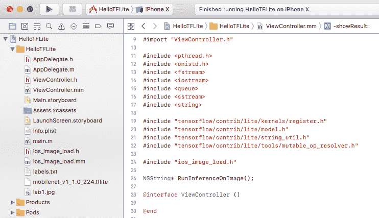
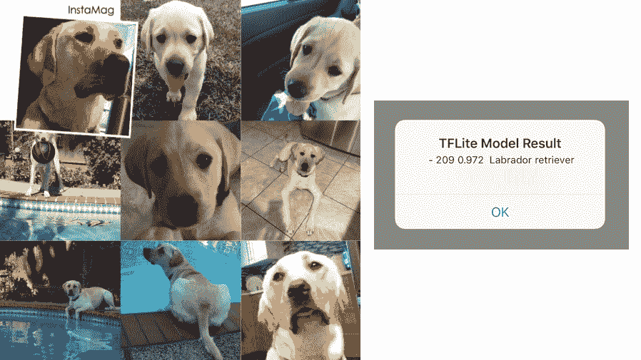
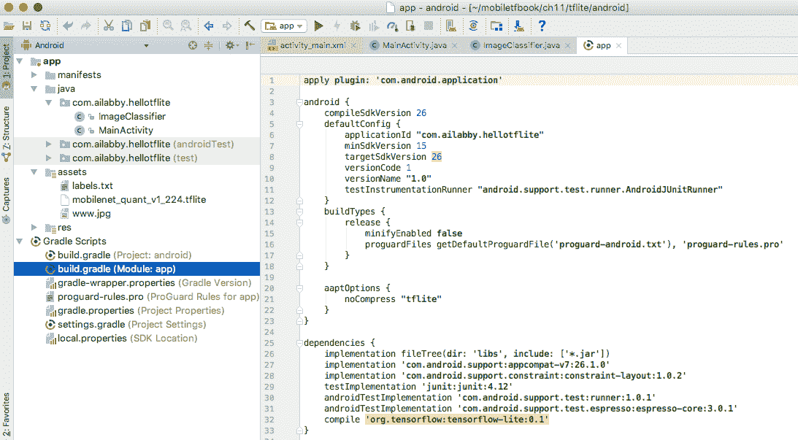
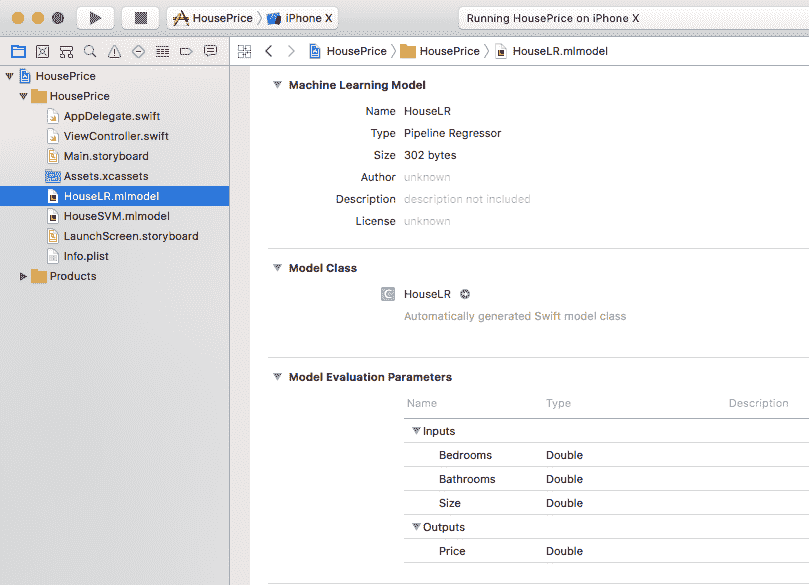

# 在移动设备上使用 TensorFlow Lite 和 Core ML


在前九章中，我们使用 TensorFlow Mobile 在移动设备上运行各种由 TensorFlow 和 Keras 构建的强大的深度学习模型。 正如我们在第 1 章，“移动 TensorFlow 入门”中提到的那样，Google 还提供了 TensorFlow Lite（可替代 TensorFlow Mobile 的版本）在移动设备上运行模型。 尽管自 Google I/O 2018 起它仍在开发人员预览中，但 Google 打算“大大简化开发人员针对小型设备的模型定位的体验。” 因此，值得详细研究 TensorFlow Lite 并为未来做好准备。

如果您是 iOS 开发人员，或者同时使用 iOS 和 Android，则 Apple 一年一度的**全球开发人员大会**（**WWDC**）是您不容错过的活动。 在 WWDC 2017 中，Apple 宣布了新的 Core ML 框架，以支持 iOS（以及所有其他 Apple OS 平台：macOS，tvOS 和 watchOS）上的深度学习模型和标准机器学习模型的运行。 自 iOS 11 起，Core ML 就可用了，截至 2018 年 5 月，Core ML 已占到 80% 的标记份额。至少了解您可以在 iOS 应用中使用 Core ML 的基本知识绝对有意义。

因此，我们将在本章涵盖 TensorFlow Lite 和 Core ML，并通过以下主题展示两者的优势和局限性：

*   TensorFlow Lite-概述
*   在 iOS 中使用 TensorFlow Lite
*   在 Android 中使用 TensorFlow Lite
*   适用于 iOS 的 CoreML-概述
*   结合使用 CoreML 和 Scikit-Learn 机器学习
*   将 CoreML 与 Keras 和 TensorFlow 结合使用


# TensorFlow Lite –概述


[TensorFlow Lite](https://www.tensorflow.org/mobile/tflite) 是一种轻量级解决方案，可在移动和嵌入式设备上运行深度学习模型。 如果可以将 TensorFlow 或 Keras 内置的模型成功转换为 TensorFlow Lite 格式，请基于 [FlatBuffers](https://google.github.io/flatbuffers)，与 ProtoBuffers ProtoBuffers 类似，但速度更快，并且大小要小得多。 “检测对象及其位置” 和，然后可以期望模型以低延迟和较小的二进制大小运行。 在您的移动应用程序中使用 TensorFlow Lite 的基本工作流程如下：

1.  使用 TensorFlow 或 Keras 以 TensorFlow 作为后端来构建和训练（或重新训练）TensorFlow 模型，例如我们在前几章中训练的模型。

您还可以选择一个预先构建的 TensorFlow Lite 模型，例如可从以下位置获得的 [MobileNet 模型](https://github.com/tensorflow/models/blob/master/research/slim/nets/mobilenet_v1.md)，我们在第 2 章，《使用转移学习对图像进行分类》中将其用于再训练。 您可以在此处下载的每个MobileNet 模型`tgz`文件都包含转换后的 TensorFlow Lite 模型。 例如，`MobileNet_v1_1.0_224.tgz`文件包含一个`mobilenet_v1_1.0_224.tflite`文件，您可以直接在移动设备上使用它。 如果使用这样的预构建 TensorFlow Lite 模型，则可以跳过步骤 2 和 3。

2.  构建 TensorFlow Lite 转换器工具。 如果您从[这里](https://github.com/tensorflow/tensorflow/releases)下载 TensorFlow 1.5 或 1.6 版本，则可以从 TensorFlow 源根目录在终端上运行`bazel build tensorflow/contrib/lite/toco:toco`。 如果您使用更高版本或获取最新的 TensorFlow 仓库，您应该可以使用此`build`命令来执行此操作，但如果没有，请查看该新版本的文档。
3.  使用 TensorFlow Lite 转换器工具将 TensorFlow 模型转换为 TensorFlow Lite 模型。 在下一节中，您将看到一个详细的示例。

4.  在 iOS 或 Android 上部署 TensorFlow Lite 模型-对于 iOS，使用 C++ API 加载和运行模型； 对于 Android，请使用 Java API（围绕 C++ API 的包装器）加载和运行模型。 与我们之前在 TensorFlow Mobile 项目中使用的`Session`类不同，C++ 和 Java API 均使用 TensorFlow-lite 特定的`Interpreter`类来推断模型。 在接下来的两个部分中，我们将向您展示 iOS C++ 代码和 Android Java 代码以使用`Interpreter`。

如果您在 Android 上运行 TensorFlow Lite 模型，并且 Android 设备为 Android 8.1（API 级别 27）或更高版本，并且通过专用的神经网络硬件，GPU 或某些其他数字信号处理器支持硬件加速，则`Interpreter`将使用 [Android 神经网络 API](https://developer.android.com/ndk/guides/neuralnetworks/index.html)来加快模型运行。 例如，谷歌的 Pixel 2 手机具有针对图像处理进行了优化的自定义芯片，可以通过 Android 8.1 开启该芯片，并支持硬件加速。

现在让我们看看如何在 iOS 中使用 TensorFlow Lite。


# 在 iOS 中使用 TensorFlow Lite


在向您展示如何创建新的 iOS 应用并向其添加 TensorFlow Lite 支持之前，让我们首先看一下使用 TensorFlow Lite 的几个示例 TensorFlow iOS 应用。


# 运行示例 TensorFlow Lite iOS 应用


有两个用于 iOS 的 TensorFlow Lite 示例应用程序，名为`simple and camera`，类似于 TensorFlow Mobile iOS 应用程序 simple 和 camera，[但在 TensorFlow 1.5-1.8 的官方版本中的 TensorFlow Lite API 中实现](https://github.com/tensorflow/tensorflow/releases)，并且可能也在最新的 TensorFlow 仓库中。 您可以运行以下命令来准备和运行这两个应用，类似地在[“iOS 演示应用”](https://github.com/tensorflow/tensorflow/tree/master/tensorflow/contrib/lite)下进行了记录：

```py
cd tensorflow/contrib/lite/examples/ios
./download_models.sh 
sudo gem install cocoapods
cd camera
pod install
open tflite_camera_example.xcworkspace
cd ../simple
pod install
open simple.xcworkspace
```

现在，您将有两个 Xcode iOS 项目，分别是 simple 和 camera（在 Xcode 中分别命名为 `tflite_simple_example`和 `tflite_camera_example`），并启动了，您可以在其中安装和运行它们 您的 iOS 设备（简单的应用程序也可以在您的 iOS 模拟器上运行）。

`download_models.sh` will download a zip file that contains the `mobilenet_quant_v1_224.tflite` model file and `labels.txt` label file, then copy them to the simple/data and camera/data directories. Notice that somehow this script is not included in the official TensorFlow 1.5.0 and 1.6.0 releases. You'll need to do `git clone https://github.com/tensorflow/tensorflow` and clone the latest source (as of March 2018) to get it.

您可以查看 Xcode `tflite_camera_example`项目的`CameraExampleViewController.mm`文件和`tflite_simple_example` `RunModelViewController.mm`文件中的源代码，以了解如何使用 TensorFlow Lite API 加载和运行 TensorFlow Lite 模型。 在逐步指导您如何创建新的 iOS 应用并向其添加 TensorFlow Lite 支持以运行预先构建的 TensorFlow Lite 模型的逐步教程之前，我们将快速以具体数字向您展示的好处之一 如前所述，使用 TensorFlow Lite-应用程序二进制大小：

位于`tensorflow/examples/ios/camera`文件夹中的`tf_camera_example` TensorFlow Mobile 示例应用程序中使用的`tensorflow_inception.graph.pb`模型文件为 95.7MB，而`mobilenet_quant_v1_224.tflite` TensorFlow Lite 模型文件 位于`tensorflow/contrib/lite/examples/ios/camera` 文件夹中的 `tflite_camera_example` TensorFlow Lite 示例应用程序中使用的仅 4.3MB。 TensorFlow Mobile 重新训练的 Inception 3 模型文件的量化版本，如我们在第 2 章，“通过迁移学习对图像进行分类”的 HelloTensorFlow 应用中所见，约为 22.4MB，并且重新训练的 MobileNet TensorFlow Mobile 模型文件为 17.6MB。 总之，以下列出了四种不同类型的模型的大小：

*   TensorFlow Mobile Inception 3 模型：95.7MB
*   量化和重新训练的 TensorFlow Mobile Inception 3 模型：22.4MB
*   训练有素的 TensorFlow Mobile MobileNet 1.0 224 模型：17.6MB
*   TensorFlow Lite MobileNet 1.0 224 型号：4.3MB

如果在 iPhone 上安装并运行这两个应用程序，则从 iPhone 的设置中将看到 `tflite_camera_example`的应用程序大小约为 18.7MB，`tf_camera_example`的大小约为 44.2MB。

的确，Inception 3 模型的准确性比 MobileNet 模型要高，但是在许多使用情况下，可以忽略很小的准确性差异。 另外，不可否认，如今的移动应用程序很容易占用数十 MB 的空间，在某些用例中，应用程序大小相差 20 或 30MB 听起来并不大，但是在较小的嵌入式设备中，大小会更加敏感，如果 我们可以以更快的速度和更小的尺寸获得几乎相同的精度，而不会遇到太多麻烦，对于用户而言，这永远是一件好事。


# 在 iOS 中使用预构建的 TensorFlow Lite 模型


使用预构建的 TensorFlow Lite 模型进行图像分类，执行以下步骤来创建新的 iOS 应用并向其添加 TensorFlow Lite 支持：

1.  使用 Single View 创建一个名为 HelloTFLite 的新 Xcode iOS 项目，将 Objective-C 设置为语言，然后将`tensorflow/contrib/lite/examples/ios`文件夹中的`ios_image_load.mm`和`ios_image_load.h`文件添加到项目中。

If you prefer Swift as the programming language, you can refer to [Chapter 2](../Text/02.html), *Classifying Images with Transfer Learning*, or [Chapter 5](../Text/05.html), *Understanding Simple Speech Commands*, after following the steps here, to see how to convert the Objective-C app to a Swift app. But be aware that the TensorFlow Lite inference code still needs to be in C++ so you'll end up with a mix of Swift, Objective-C, and C++ code, with your Swift code mainly responsible for the UI and pre- and post-processing of the TensorFlow Lite inference.

2.  将使用`tensorflow/contrib/lite/examples/ios/simple/data`文件夹中的前面的`download_models.sh`脚本生成的模型文件和标签文件，以及第二章源代码文件夹中的测试图像（例如`lab1.jpg`）添加到项目中。

3.  关闭项目并创建一个名为`Podfile`的新文件，其内容如下：

```py
platform :ios, '8.0'

target 'HelloTFLite'
       pod 'TensorFlowLite'
```

运行`pod install`。 然后在 Xcode 中打开 `HelloTFLite.xcworkspace`，将`ViewController.m`重命名为`ViewController.mm`，并添加必要的 C++ 头文件和 TensorFlow Lite 头文件。 您的 Xcode 项目应类似于以下屏幕截图：

Figure 11.1 A new Xcode iOS project using the TensorFlow Lite pod

我们仅向您展示如何在 iOS 应用中使用 TensorFlow Lite Pod。 还有另一种将 TensorFlow Lite 添加到 iOS 的方法，类似于构建自定义 TensorFlow Mobile iOS 库的过程，我们在前几章中已经做过很多次了。 有关如何构建自己的自定义 TensorFlow Lite iOS 库的更多信息，请参阅[以下位置的文档](https://github.com/tensorflow/tensorflow/blob/master/tensorflow/contrib/lite/g3doc/ios.md)。

4.  将第 2 章，“通过迁移学习对图像进行分类”的 iOS 应用中的类似 UI 代码复制到`ViewController.mm`，后者使用`UITapGestureRecognizer`捕获用户的手势 屏幕上，然后调用`RunInferenceOnImage`方法，该方法将加载 TensorFlow Lite 模型文件：

```py
NSString* RunInferenceOnImage() {
    NSString* graph = @"mobilenet_v1_1.0_224"; 
    std::string input_layer_type = "float";
    std::vector<int> sizes = {1, 224, 224, 3};

    const NSString* graph_path = FilePathForResourceName(graph, @"tflite");

    std::unique_ptr<tflite::FlatBufferModel> model(tflite::FlatBufferModel::BuildFromFile([graph_path UTF8String]));
    if (!model) {
        NSLog(@"Failed to mmap model %@.", graph);
        exit(-1);
    }
```

5.  创建`Interpreter`类的实例并设置其输入：

```py
  tflite::ops::builtin::BuiltinOpResolver resolver;
  std::unique_ptr<tflite::Interpreter> interpreter;
  tflite::InterpreterBuilder(*model, resolver)(&interpreter);
  if (!interpreter) {
      NSLog(@"Failed to construct interpreter.");
      exit(-1);
  }
  interpreter->SetNumThreads(1);

  int input = interpreter->inputs()[0];
  interpreter->ResizeInputTensor(input, sizes);

  if (interpreter->AllocateTensors() != kTfLiteOk) {
      NSLog(@"Failed to allocate tensors.");
      exit(-1);
  }
```

与 TensorFlow Mobile 不同，TensorFlow Lite 在馈入 TensorFlow Lite 模型进行推理时使用`interpreter->inputs()[0]`而不是特定的输入节点名称。

6.  在以与在`HelloTensorFlow`应用程序中相同的方式加载`labels.txt`文件后，也以相同的方式加载要分类的图像，但是使用 TensorFlow Lite 的`Interpreter`的`typed_tensor`方法而不是 TensorFlow Mobile 的`Tensor`类及其`tensor`方法。 图 11.2 比较了用于加载和处理图像文件数据的 TensorFlow Mobile 和 Lite 代码：

Figure 11.2 The TensorFlow Mobile (left) and Lite code of loading and processing the image input

7.  在调用`GetTopN`辅助方法以获取前`N`个分类结果之前，调用`Interpreter`上的`Invoke`方法运行模型，并调用`typed_out_tensor`方法以获取模型的输出。 TensorFlow Mobile 和 Lite 之间的代码差异如图 11.3 所示：

Figure 11.3 The TensorFlow Mobile (left) and Lite code of running the model and getting the output

8.  以类似于 HelloTensorFlow 中方法的方式实现`GetTopN`方法，对于 TensorFlow Lite 使用`const float* prediction`类型而不是对于 TensorFlow Mobile 使用`const Eigen::TensorMap<Eigen::Tensor<float, 1, Eigen::RowMajor>, Eigen::Aligned>& prediction`。 TensorFlow Mobile 和 Lite 中`GetTopN`方法的比较如图 11.4 所示：

Figure 11.4 The TensorFlow Mobile (left) and Lite code of processing the model output to return the top results

9.  如果值大于阈值（设置为`0.1f`），则使用简单的`UIAlertController`显示带有 TensorFlow Lite 模型返回的置信度值的最佳结果：

```py
-(void) showResult:(NSString *)result {
    UIAlertController* alert = [UIAlertController alertControllerWithTitle:@"TFLite Model Result" message:result preferredStyle:UIAlertControllerStyleAlert];

    UIAlertAction* action = [UIAlertAction actionWithTitle:@"OK" style:UIAlertActionStyleDefault handler:nil];
    [alert addAction:action];
    [self presentViewController:alert animated:YES completion:nil];
}
-(void)tapped:(UITapGestureRecognizer *)tapGestureRecognizer {
        NSString *result = RunInferenceOnImage();
        [self showResult:result];
}
```

立即运行 iOS 应用，然后点击屏幕以运行模型。 对于`lab1.jpg`测试图像，您将在图 11.5 中看到模型的结果：

Figure 11.5 The test image and model inference result

这就是您可以在新的 iOS 应用程序中使用预构建的 MobileNet TensorFlow Lite 模型的方式。 现在让我们看看如何使用经过重新训练的 TensorFlow 模型。


# 在 iOS 中为 TensorFlow Lite 使用经过重新训练的 TensorFlow 模型


在第 2 章，”通过迁移学习对图像进行分类“中，我们重新训练了 MobileNet TensorFlow 模型来进行狗的品种识别任务，并且要在 TensorFlow Lite 中使用这种模型，我们首先需要进行转换 使用 TensorFlow Lite 转换工具将其转换为 TensorFlow Lite 格式：

```py
bazel build tensorflow/contrib/lite/toco:toco

bazel-bin/tensorflow/contrib/lite/toco/toco \
 --input_file=/tmp/dog_retrained_mobilenet10_224_not_quantized.pb \
 --input_format=TENSORFLOW_GRAPHDEF --output_format=TFLITE \
 --output_file=/tmp/dog_retrained_mobilenet10_224_not_quantized.tflite --inference_type=FLOAT \
 --input_type=FLOAT --input_array=input \
 --output_array=final_result --input_shape=1,224,224,3
```

我们必须使用`--input_array`和`--output_array`指定输入节点名称和输出节点名称。 有关转换器工具的详细命令行参数，请参阅[这里](https://github.com/tensorflow/tensorflow/blob/master/tensorflow/contrib/lite/toco/g3doc/cmdline_examples.md)。

添加转换后的`dog_retrained_mobilenet10_224_not_quantized.tflite` TensorFlow Lite 模型文件，以及相同的`dog_retrained_labels.txt` 标签文件 `HelloTensorFlow`到 Xcode 项目，只需将步骤 4 中的行从 `NSString* graph = @"mobilenet_v1_1.0_224";` 更改为 `NSString* graph = @"dog_retrained_mobilenet10_224_not_quantized";` 和 `const int output_size = 1000;` 更改为 `const int output_size = 121;` （回想一下 MobileNet 模型对 1,000 个对象进行分类，而我们的训练后的狗模型则对 121 个犬种进行了分类），然后使用 TensorFlow Lite 格式的训练后的模型再次运行该应用。 结果将大致相同。

因此，在我们成功将其转换为 TensorFlow Lite 模型之后，使用经过重新训练的 MobileNet TensorFlow 模型非常简单。 那本书和其他地方介绍的所有那些定制模型呢？


# 在 iOS 中使用自定义 TensorFlow Lite 模型


在前面的章节中，我们已经训练了许多定制的 TensorFlow 模型，并将其冻结以供移动使用。 不幸的是，如果您尝试使用上一节中内置的`bazel-bin/tensorflow/contrib/lite/toco/toco` TensorFlow Lite 转换工具 将模型从 TensorFlow 格式转换为 TensorFlow Lite 格式，则它们都会失败，除了第 2 章， “通过迁移学习对图像进行分类”的再训练模型； 大多数错误属于“转换不受支持的操作”类型。 例如，以下命令尝试将第 3 章， “检测对象及其位置” 中的 TensorFlow 对象检测模型转换为 TensorFlow Lite 格式：

```py
bazel-bin/tensorflow/contrib/lite/toco/toco \
 --input_file=/tmp/ssd_mobilenet_v1_frozen_inference_graph.pb \
 --input_format=TENSORFLOW_GRAPHDEF  --output_format=TFLITE \
 --output_file=/tmp/ssd_mobilenet_v1_frozen_inference_graph.tflite --inference_type=FLOAT \
 --input_type=FLOAT --input_arrays=image_tensor \
 --output_arrays=detection_boxes,detection_scores,detection_classes,num_detections \
 --input_shapes=1,224,224,3
```

但是 TensorFlow 1.6 中会出现很多错误，包括：

```py
Converting unsupported operation: TensorArrayV3
Converting unsupported operation: Enter
Converting unsupported operation: Equal
Converting unsupported operation: NonMaxSuppressionV2
Converting unsupported operation: ZerosLike
```

以下命令尝试将第 4 章的神经风格迁移模型转换为 TensorFlow Lite 格式：

```py
bazel-bin/tensorflow/contrib/lite/toco/toco \
 --input_file=/tmp/stylize_quantized.pb \
 --input_format=TENSORFLOW_GRAPHDEF --output_format=TFLITE \
 --output_file=/tmp/stylize_quantized.tflite --inference_type=FLOAT \
 --inference_type=QUANTIZED_UINT8 \
 --input_arrays=input,style_num \
 --output_array=transformer/expand/conv3/conv/Sigmoid \
 --input_shapes=1,224,224,3:26
```

以下命令尝试转换第 10 章中的模型：

```py
bazel-bin/tensorflow/contrib/lite/toco/toco \
 --input_file=/tmp/alphazero19.pb \
 --input_format=TENSORFLOW_GRAPHDEF --output_format=TFLITE \
 --output_file=/tmp/alphazero19.tflite --inference_type=FLOAT \
 --input_type=FLOAT --input_arrays=main_input \
 --output_arrays=value_head/Tanh,policy_head/MatMul \
 --input_shapes=1,2,6,7
```

但是，您还将收到许多“转换不受支持的操作”错误。

截至 2018 年 3 月以及 TensorFlow 1.6 中，TensorFlow Lite 仍在开发人员预览版中，但将来的发行版将支持更多操作，因此如果您想在 TensorFlow 1.6 中尝试 TensorFlow Lite，则应该将自己限制在 训练和重新训练的 Inception 和 MobileNet 模型，同时关注将来的 TensorFlow Lite 版本。 本书前面和其他章节中介绍的更多 TensorFlow 模型有可能会在 TensorFlow 1.7 或阅读本书时成功转换为 TensorFlow Lite 格式。

但是至少到目前为止，对于使用 TensorFlow 或 Keras 构建的自定义复杂模型，很可能您将无法成功进行 TensorFlow Lite 转换，因此您应该继续使用 TensorFlow Mobile，如前几章所述 现在，除非您致力于使它们与 TensorFlow Lite 一起使用，并且不介意帮助添加更多由 TensorFlow Lite 支持的操作-毕竟 TensorFlow 是一个开源项目。

在完成 TensorFlow Lite 的介绍之前，我们将看一下如何在 Android 中使用 TensorFlow Lite。


# 在 Android 中使用 TensorFlow Lite


为简单起见，我们将仅演示如何在新的 Android 应用程序中将 TensorFlow Lite 与预构建的 TensorFlow Lite MobileNet 模型一起添加，并在此过程中发现一些有用的技巧。 有一个使用 TensorFlow Lite 的示例 Android 应用程序，[您可能希望首先在具有 API 级别的 Android 设备上与 Android Studio 一起运行](https://www.tensorflow.org/mobile/tflite/demo_android)。在执行以下步骤在新的 Android 应用中使用 TensorFlow Lite 之前，至少需要 15 个（版本至少为 4.0.3）。 如果您成功构建并运行了演示应用程序，则在 Android 设备上移动时，应该能够通过设备摄像头和 TensorFlow Lite MobileNet 模型看到识别出的对象。

现在执行以下步骤来创建一个新的 Android 应用程序，并添加 TensorFlow Lite 支持以对图像进行分类，就像我们在第 2 章，“通过迁移学习对图像进行分类”中的 HelloTensorFlow Android 应用程序一样：

1.  创建一个新的 Android Studio 项目，并将应用命名为`HelloTFLite`。 将最低 SDK 设置为 API 15：Android 4.0.3，并接受所有其他默认设置。
2.  创建一个新的`assets`文件夹，从演示应用程序`tensorflow/contrib/lite/java/demo/app/src/main/assets`文件夹中拖放`mobilenet_quant_v1_224.tflite` TensorFlow Lite 文件和`labels.txt`文件，以及测试图像 到 HelloTFLite 应用程序的`assets`文件夹中。
3.  将`ImageClassifier.java`文件从`tensorflow/contrib/lite/java/demo/app/src/main/java/com/example/android/tflitecamerademo`文件夹拖放到 Android Studio 中的 HelloTFLite 应用。 `ImageClassifier.java`包含使用 TensorFlow Lite Java API 加载和运行 TensorFlow Lite 模型的所有代码，我们将在稍后详细介绍。

4.  打开应用的`build.gradle`文件，在 `dependencies` 部分的末尾添加`compile 'org.tensorflow:tensorflow-lite:0.1'` ，然后在 `buildTypes` 部分的以下三行中添加[ `android` ：

```py
    aaptOptions {
        noCompress "tflite"
    }
```

这是必需的，以避免在运行应用程序时出现以下错误：

```py
10185-10185/com.ailabby.hellotflite W/System.err: java.io.FileNotFoundException: This file can not be opened as a file descriptor; it is probably compressed
03-20 00:32:28.805 10185-10185/com.ailabby.hellotflite W/System.err: at android.content.res.AssetManager.openAssetFd(Native Method)
03-20 00:32:28.806 10185-10185/com.ailabby.hellotflite W/System.err: at android.content.res.AssetManager.openFd(AssetManager.java:390)
03-20 00:32:28.806 10185-10185/com.ailabby.hellotflite W/System.err: at com.ailabby.hellotflite.ImageClassifier.loadModelFile(ImageClassifier.java:173)
```

现在，Android Studio 中的 HelloTFLite 应用程序应类似于图 11.6：

Figure 11.6 New Android app using TensorFlow Lite and the prebuilt MobileNet image classification model

5.  像以前一样，在`activity_main.xml`中添加`ImageView`和`Button`，然后在`MainActivity.java`的`onCreate`方法中，将`ImageView`设置为测试图像的内容，然后单击 `Button`的侦听器以启动新线程，并实例化名为`classifier`的`ImageClassifier`实例：

```py
private ImageClassifier classifier;

@Override
protected void onCreate(Bundle savedInstanceState) {
...

    try {
        classifier = new ImageClassifier(this);
    } catch (IOException e) {
        Log.e(TAG, "Failed to initialize an image classifier.");
    }
```

6.  线程的`run`方法将测试图像数据读入`Bitmap`，调用`ImageClassifier`的`classifyFrame`方法，并将结果显示为`Toast`：

```py
Bitmap bitmap = BitmapFactory.decodeStream(getAssets().open(IMG_FILE));
Bitmap croppedBitmap = Bitmap.createScaledBitmap(bitmap, INPUT_SIZE, INPUT_SIZE, true);
if (classifier == null ) {
    Log.e(TAG, "Uninitialized Classifier or invalid context.");
    return;
}
final String result = classifier.classifyFrame(croppedBitmap);
runOnUiThread(
        new Runnable() {
            @Override
            public void run() {
                mButton.setText("TF Lite Classify");
                Toast.makeText(getApplicationContext(), result, Toast.LENGTH_LONG).show();
            }
        });
```

如果立即运行该应用程序，您将看到测试图像和一个标题为“TF Lite 分类”的按钮。 轻按它，您将看到分类结果，例如“拉布拉多犬：0.86 哈巴狗：0.05 达尔马提亚狗：0.04”。

`ImageClassifier`中与 TensorFlow Lite 相关的代码使用核心`org.tensorflow.lite.Interpreter`类及其`run`方法来运行模型，如下所示：

```py
import org.tensorflow.lite.Interpreter;

public class ImageClassifier {

    private Interpreter tflite;
    private byte[][] labelProbArray = null;

    ImageClassifier(Activity activity) throws IOException {
        tflite = new Interpreter(loadModelFile(activity));
        ...
    }

    String classifyFrame(Bitmap bitmap) {
        if (tflite == null) {
          Log.e(TAG, "Image classifier has not been initialized; 
                                                        Skipped.");
          return "Uninitialized Classifier.";
        }
        convertBitmapToByteBuffer(bitmap);
        tflite.run(imgData, labelProbArray);
        ...
    }
```

并定义了`loadModelFile`方法：

```py
private MappedByteBuffer loadModelFile(Activity activity) throws IOException {
    AssetFileDescriptor fileDescriptor = activity.getAssets().openFd(MODEL_PATH);
    FileInputStream inputStream = new FileInputStream(fileDescriptor.getFileDescriptor());
    FileChannel fileChannel = inputStream.getChannel();
    long startOffset = fileDescriptor.getStartOffset();
    long declaredLength = fileDescriptor.getDeclaredLength();
    return fileChannel.map(FileChannel.MapMode.READ_ONLY, startOffset, declaredLength);
}
```

回想一下，在步骤 4 中，我们必须在`build.gradle`文件中添加`noCompress "tflite"`，否则`openFd`方法将导致错误。 该方法返回模型的映射版本，我们在第 6 章，“使用自然语言描述图像”时使用`convert_graphdef_memmapped_format`工具将 TensorFlow Mobile 模型转换为映射格式。 和第 9 章，“使用 GAN 生成和增强图像”。

这就是在新的 Android 应用程序中加载并运行预构建的 TensorFlow Lite 模型所需的一切。 如果您有兴趣使用经过重新训练和转换的 TensorFlow Lite 模型（如我们在 iOS 应用程序，Android 应用程序中所做的那样），或者自定义 TensorFlow Lite 模型（如果您成功获得了转换后的模型），则可以在 HelloTFLite 应用程序。 我们将暂时保留最先进的 TensorFlow Lite，并继续为 iOS 开发人员介绍另一个非常酷的 WWDC 重量级主题。


# 适用于 iOS 的 Core ML –概述


苹果的 [Core ML 框架](https://developer.apple.com/documentation/coreml)使 iOS 开发人员可以轻松地在运行 iOS 11 或更高版本的 iOS 应用中使用经过训练的机器学习模型，并构建 Xcode 9 或更高版本。 您可以下载并使用 Apple 已在[这里](https://developer.apple.com/machine-learning)提供的 Core ML 格式的经过预先训练的模型，也可以使用称为 coremltools 的 Python 工具，[Core ML 社区工具](https://apple.github.io/coremltools)来将其他机器学习和深度学习模型转换为 Core ML 格式。

Core ML 格式的预训练模型包括流行的 MobileNet 和 Inception V3 模型，以及更新的 ResNet50 模型（我们在第 10 章中简要讨论了残差网络）。 可以转换为 Core ML 格式的模型包括使用 Caffe 或 Keras 构建的深度学习模型，以及传统的机器学习模型，例如线性回归，支持向量机和通过 [Scikit Learn](http://scikit-learn.org) 构建的决策树，这是一个非常流行的 Python 机器学习库。

因此，如果您想在 iOS 中使用传统的机器学习模型，那么 Scikit Learn 和 Core ML 绝对是必经之路。 尽管这是一本有关移动 TensorFlow 的书，但构建智能应用程序有时不需要深度学习。 在某些用例中，经典机器学习完全有意义。 此外，Core ML 对 Scikit Learn 模型的支持是如此流畅，以至于我们不能拒绝快速浏览，因此您将在必要时知道何时短暂使用移动 TensorFlow 技能。

如果要使用 Apple 预先训练的 MobileNet Core ML 模型，请在[这个页面](https://developer.apple.com/documentation/vision/classifying_images_with_vision_and_core_ml)上查看 Apple 不错的示例代码项目，它使用 Vision 和 Core ML 对图像进行分类，还观看[这个页面](https://developer.apple.com/machine-learning)上列出的有关核心 ML 的 WWDC 2017 视频。

在接下来的两个部分中，我们将向您展示两个教程，该教程以 TensorFlow 为后端，在 Keras 中如何转换和使用 Scikit Learn 模型和股票预测 RNN 模型，它们是在第 8 章， “使用 RNN 预测股票价格”。 您将在 Objective-C 和 Swift 中看到使用源代码从头开始构建的完整 iOS 应用程序，以使用转换后的 Core ML 模型。 如果短语“从头开始”使您兴奋并使您想起 AlphaZero，则您可能喜欢上一章第 10 章，“构建类似 AlphaZero 的移动游戏应用程序”。


# 将 Core ML 与 Scikit-Learn 机器学习结合使用


线性回归和支持向量机是 Scikit Learn 当然支持的两种最常见的经典机器学习算法。 我们将研究如何使用这两种算法为房价预测建立模型。


# 建立和转换 Scikit Learn 模型


首先，让我们获取房价数据集，该数据集可从[这里](http://wiki.csc.calpoly.edu/datasets/attachment/wiki/Houses/RealEstate.csv?format=raw)下载。 下载的 `RealEstate.csv`文件如下所示：

```py
MLS,Location,Price,Bedrooms,Bathrooms,Size,Price/SQ.Ft,Status
132842,Arroyo Grande,795000.00,3,3,2371,335.30,Short Sale
134364,Paso Robles,399000.00,4,3,2818,141.59,Short Sale
135141,Paso Robles,545000.00,4,3,3032,179.75,Short Sale
...
```

我们将使用流行的开源 Python 数据分析库 [Pandas](https://pandas.pydata.org) 来解析 csv 文件。 要安装 Scikit Learn 和 Pandas，只需运行以下命令，最好从您之前创建的 TensorFlow 和 Keras 虚拟环境中运行以下命令：

```py
pip install scikit-learn
pip install pandas 
```

现在，输入以下代码以读取并解析`RealEstate.csv`文件，将第 4 到第 6 列（卧室，浴室和大小）下的所有行用作输入数据，并使用第 3 列（价格）的所有行作为目标 输出：

```py
from sklearn.linear_model import LinearRegression
from sklearn.svm import LinearSVR
import pandas as pd
import sklearn.model_selection as ms

data = pd.read_csv('RealEstate.csv')
X, y = data.iloc[:, 3:6], data.iloc[:, 2]
```

将数据集分为训练集和测试集，并使用标准`fit`方法使用 Scikit Learn 的线性回归模型训练数据集：

```py
X_train, X_test, y_train, y_test = ms.train_test_split(X, y, test_size=0.25)

lr = LinearRegression()
lr.fit(X_train, y_train)
```

使用`predict`方法，使用经过训练的模型测试三个新输入（3 个卧室，2 个浴室，1,560 平方英尺，等等）：

```py
X_new = [[ 3, 2, 1560.0],
         [3, 2, 1680],
         [5, 3, 2120]]

print(lr.predict(X_new))
```

这将输出三个值作为预测房价：`[319289.9552276 352603.45104977 343770.57498118]`。

要训​​练支持向量机模型并使用`X_new`输入对其进行测试，类似地添加以下代码：

```py
svm = LinearSVR(random_state=42)
svm.fit(X_train, y_train)

print(svm.predict(X_new))
```

这将使用支持向量机模型作为`[298014.41462535 320991.94354092 404822.78465954]`输出预测的房价。 我们不会讨论哪种模型更好，如何使线性回归或支持向量机模型更好地工作，或者如何在 Scikit Learn 支持的所有算法中选择更好的模型-有很多不错的书籍和在线资源介绍了这些内容。 话题。

要将两个 Scikit Learn 模型`lr`和`svm`转换为可在您的 iOS 应用中使用的 Core ML 格式，您需要首先安装 [Core ML 工具](https://github.com/apple/coremltools)。 我们建议您在我们在第 8 章，“用 RNN 预测股价”和第 10 章“构建支持 AlphaZero 的手机游戏应用程序”中创建的 TensorFlow 和 Keras 虚拟环境中使用`pip install -U coremltools`安装这些软件，因为我们还将在下一部分中使用它来转换 Keras 模型。

现在，只需运行以下代码即可将两个 Scikit Learn 模型转换为 Core ML 格式：

```py
import coremltools
coreml_model = coremltools.converters.sklearn.convert(lr, ["Bedrooms", "Bathrooms", "Size"], "Price")
coreml_model.save("HouseLR.mlmodel")

coreml_model = coremltools.converters.sklearn.convert(svm, ["Bedrooms", "Bathrooms", "Size"], "Price")
coreml_model.save("HouseSVM.mlmodel")
```

有关转换器工具的更多详细信息，请参见其[在线文档](https://apple.github.io/coremltools/coremltools.converters.html)。 现在，我们可以将这两个模型添加到 Objective-C 或 Swift iOS 应用程序中，但是我们仅在此处显示 Swift 示例。 您将在下一节中看到使用从 Keras 和 TensorFlow 模型转换而来的股票预测 Core ML 模型得到的 Objective-C 和 Swift 示例。


# 在 iOS 中使用转换后的 Core ML 模型


在将两个 Core ML 模型文件`HouseLR.mlmodel`和`HouseSVM.mlmodel`添加到新的基于 Swift 的 Xcode iOS 项目中之后， `HouseLR.mlmodel`如图 11.7 所示：

Figure 11.7 Showing the Swift iOS project and the Linear Regression Core ML model

其他`HouseSVM.mlmodel` 模型 看起来完全一样，只是机器学习模型名称和模型类从`HouseLR`更改为`HouseSVM`。

将以下代码添加到`ViewController.swift`中的`class ViewController`中：

```py
private let lr = HouseLR()
private let svm = HouseSVM()

override func viewDidLoad() {
    super.viewDidLoad()

    let lr_input = HouseLRInput(Bedrooms: 3, Bathrooms: 2, Size: 1560)
    let svm_input = HouseSVMInput(Bedrooms: 3, Bathrooms: 2, Size: 1560)

    guard let lr_output = try? lr.prediction(input: lr_input) else {
        return
    } 
    print(lr_output.Price)

    guard let svm_output = try? svm.prediction(input: svm_input) else {
        return
    }
    print(svm_output.Price)
}
```

这应该非常简单。 运行该应用程序将打印：

```py
319289.955227601 298014.414625352
```

它们与最后一部分中 Python 脚本输出的两个数组中的前两个数字相同，因为我们将 PythonLR 代码的`X_new`值中的第一个输入用于 HouseLR 和 HouseSVM 的预测输入。


# 将 Core ML 与 Keras 和 TensorFlow 结合使用


coremltools 工具还正式支持转换使用 Keras 构建的模型（请参见[`keras.convert`链接](https://apple.github.io/coremltools/coremltools.converters.html)）。 截至 2018 年 3 月，最新版本的 coremltools 0.8 的版本可与 TensorFlow 1.4 和 Keras 2.1.5 配合使用，我们在第 8 章，“使用 RNN 预测股票价格”中使用了 Keras 股票预测模型。 您可以使用两种方法使用 coremltools 生成模型的 Core ML 格式。 首先是在训练模型后，直接在 Python Keras 代码中调用 coremltools 的`convert`和`save`方法。 例如，将下面的最后三行代码添加到`model.fit`之后的`ch8/python/keras/train.py`文件中：

```py
model.fit(
    X_train,
    y_train,
    batch_size=512,
    epochs=epochs,
    validation_split=0.05)

import coremltools
coreml_model = coremltools.converters.keras.convert(model)
coreml_model.save("Stock.mlmodel")
```

对于我们的模型转换，您可以在运行新脚本时忽略以下警告：

`WARNING:root:Keras version 2.1.5 detected. Last version known to be fully compatible of Keras is 2.1.3`。

将生成的`Stock.mlmodel`文件拖放到 Xcode 9.2 iOS 项目中时，它将使用默认的输入名称`input1`和默认的输出名称`output1`，如图 11.8 所示。 基于 Objective-C 和 Swift 的 iOS 应用：

Figure 11.8 Showing the stock prediction Core ML model converted from Keras and TensorFlow in an Objective-C app

使用 coremltools 生成模型的 Core ML 格式的另一种方法是，首先将 Keras 构建的模型保存为 Keras HDF5 模型格式，这是我们在第 10 章，“构建类似 AlphaZero 的移动游戏应用程序”中，在转换为 AlphaZero TensorFlow 检查点文件之前使用的格式。 为此，只需运行`model.save('stock.h5')`。

然后，您可以使用以下代码片段将 Keras `.h5`模型转换为 Core ML 模型：

```py
import coremltools
coreml_model = coremltools.converters.keras.convert('stock.h5',    
 input_names = ['bidirectional_1_input'], 
output_names = ['activation_1/Identity']) 
coreml_model.save('Stock.mlmodel')
```

请注意，此处使用与冻结 TensorFlow 检查点文件相同的输入和输出名称。 如果将`Stock.mlmodel`拖放到 Objective-C 项目，则自动生成的`Stock.h`中将出现错误，因为 Xcode 9.2 中的错误无法正确处理代码中的`/`字符`activation_1/Identity`输出名称。 如果它是 Swift iOS 对象，则自动生成的`Stock.swift`文件会正确地将`/`字符更改为`_`，从而避免了编译器错误，如图 11.9 所示。

Figure 11.9 Showing the stock prediction Core ML model converted from Keras and TensorFlow in a Swift app

要在 Objective-C 中使用该模型，请创建具有指定数据类型和形状的`Stock`对象和`MLMultiArray`对象，然后使用一些输入数据填充数组对象，并使用`StockInput`调用`predictionFromFeatures`方法 用 `MLMultiArray`数据初始化的实例：

```py
#import "ViewController.h"
#import "Stock.h"

@interface ViewController ()
@end

@implementation ViewController

- (void)viewDidLoad {
    [super viewDidLoad];

    Stock *stock = [[Stock alloc] init];
    double input[] = {
        0.40294855,
        0.39574954,
        0.39789235,
        0.39879138,
        0.40368535,
        0.41156033,
        0.41556879,
        0.41904324,
        0.42543786,
        0.42040193,
        0.42384258,
        0.42249741,
        0.4153998 ,
        0.41925279,
        0.41295281,
        0.40598363,
        0.40289448,
        0.44182321,
        0.45822208,
        0.44975226};

    NSError *error = nil;
    NSArray *shape = @[@20, @1, @1];
    MLMultiArray *mlMultiArray = [[MLMultiArray alloc] initWithShape:(NSArray*)shape dataType:MLMultiArrayDataTypeDouble error:&error] ;

    for (int i = 0; i < 20; i++) {
        [mlMultiArray setObject:[NSNumber numberWithDouble:input[i]] atIndexedSubscript:(NSInteger)i];
    }

    StockOutput *output = [stock predictionFromFeatures:[[StockInput alloc] initWithInput1:mlMultiArray] error:&error];
    NSLog(@"output = %@", output.output1 );
}
```

我们在这里使用了硬编码的规范化输入和 NSLog 只是为了演示如何使用 Core ML 模型。 如果立即运行该应用程序，您将看到 0.4486984312534332 的输出值，该值在非规范化后显示了预测的第二天股价。

前面代码的 Swift 版本如下：

```py
import UIKit
import CoreML

class ViewController: UIViewController {
    private let stock = Stock()

    override func viewDidLoad() {
        super.viewDidLoad()

        let input = [
            0.40294855,
            0.39574954,
            ...
            0.45822208,
            0.44975226]

        guard let mlMultiArray = try? MLMultiArray(shape:[20,1,1], dataType:MLMultiArrayDataType.double) else {
            fatalError("Unexpected runtime error. MLMultiArray")
        }
        for (index, element) in input.enumerated() {
            mlMultiArray[index] = NSNumber(floatLiteral: element)
        }

        guard let output = try? stock.prediction(input: StockInput(bidirectional_1_input:mlMultiArray)) else {
            return
        }        
        print(output.activation_1_Identity)
    }
}
```

请注意，就像使用 TensorFlow Mobile iOS 应用程序一样，我们使用`bidirectional_1_input`和`activation_1_Identity`来设置输入并获取输出。

如果尝试转换在第 10 章，“构建类似 AlphaZero 的移动游戏应用程序”中在 Keras 中构建和训练的 AlphaZero 模型，则会收到错误消息`ValueError: Unknown loss function:softmax_cross_entropy_with_logits`。 如果您尝试转换我们在本书中构建的其他 TensorFlow 模型，则可以使用的最佳非官方工具是`https://github.com/tf-coreml/tf-coreml`上的 TensorFlow 到核心 ML 转换器。 不幸的是，类似于 TensorFlow Lite，它仅支持有限的 TensorFlow 操作集，其中一些原因是 Core ML 的限制，另一些原因是 tf-coreml 转换器的限制。 我们不会详细介绍将 TensorFlow 模型转换为 Core ML 模型的细节。 但是至少您已经了解了如何转换和使用 Scikit Learn 构建的传统机器学习模型以及基于 Keras 的 RNN 模型，该模型有望为您提供构建和使用 Core ML 模型的良好基础。 当然，如果您喜欢 Core ML，则应留意其将来的改进版本，以及 coremltools 和 tf-coreml 转换器的将来版本。 关于 Core ML，我们还没有涉及很多内容-要了解其确切功能，请参阅[完整的 API 文档](https://developer.apple.com/documentation/coreml/core_ml_api)。


# 概要


在本章中，我们介绍了在移动和嵌入式设备上使用机器学习和深度学习模型的两个前沿工具：TensorFlow Lite 和 Core ML。 尽管 TensorFlow Lite 仍在开发人员预览版中，但对 TensorFlow 操作的支持有限，但其未来版本将支持越来越多的 TensorFlow 功能，同时保持较低的延迟和较小的应用程序大小。 我们提供了有关如何开发 TensorFlow Lite iOS 和 Android 应用程序以从头开始对图像进行分类的分步教程。 Core ML 是 Apple 为移动开发人员提供的将机器学习集成到 iOS 应用程序中的框架，它对转换和使用 Scikit Learn 构建的经典机器学习模型提供了强大的支持，并为基于 Keras 的模型提供了良好的支持。 我们还展示了如何将 Scikit Learn 和 Keras 模型转换为 Core ML 模型，以及如何在 Objective-C 和 Swift 应用程序中使用它们。 TensorFlow Lite 和 Core ML 现在都有一些严重的限制，导致它们无法转换我们在书中构建的复杂的 TensorFlow 和 Keras 模型。 但是他们今天已经有了用例，他们的未来会变得更好。 我们能做的最好的事情就是了解它们的用途，局限性和潜力，因此我们可以为现在或将来选择最合适的工具来完成不同的任务。 毕竟，我们不仅拥有锤子，而且并非所有东西都看起来像钉子。

在本书的下一章，最后一章中，我们将选择一些以前构建的模型，并添加强化学习的力量-强化学习的成功背后的关键技术，以及 2017 年 10 项突破性技术之一。 麻省理工学院评论–很酷的 Raspberry Pi 平台，一个小巧，价格合理但功能强大的计算机–谁不喜欢这三个的组合？ 我们将看到有多少智能-，聆听，步行，平衡，当然还有学习，我们可以在一章中添加到小型 Raspberry-Pi 驱动的机器人中。 如果自动驾驶汽车是当今最热门的 AI 技术之一，那么自动行走机器人可能是我们家里最酷的玩具之一。


