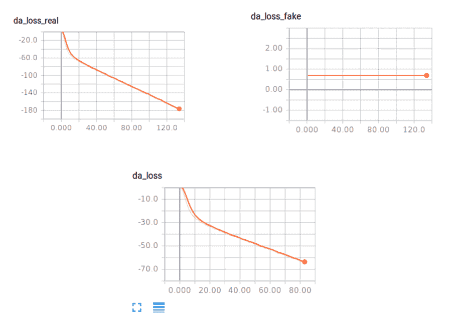
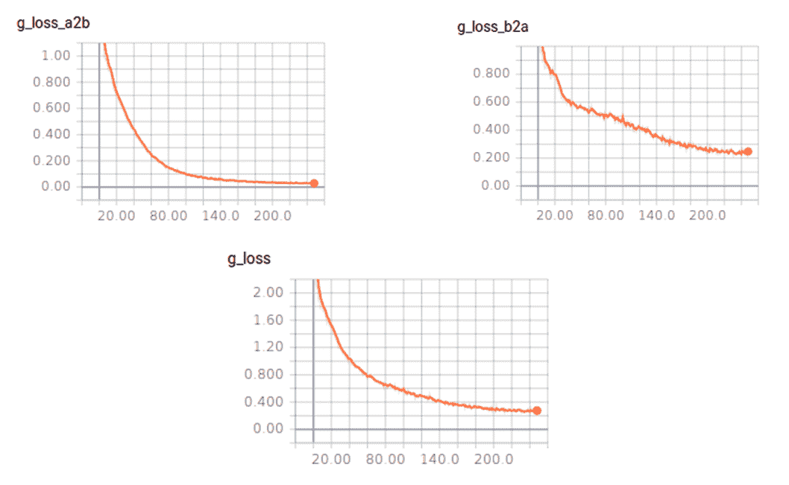
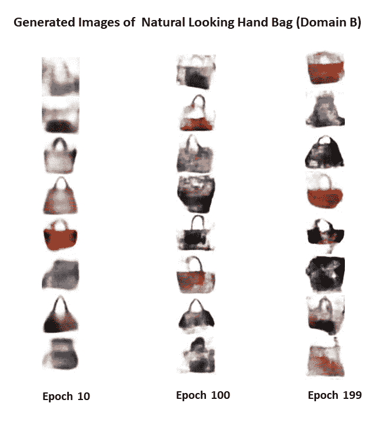

# 使用 GAN 的时尚行业样式迁移

**样式迁移**的概念是指将产品样式渲染为另一种产品的过程。 想象一下，您的一位时尚狂朋友买了一个蓝色的手袋，想买一双类似印花的鞋子。 直到 2016 年，这还是不可能实现的，除非他们与一位时装设计师成为朋友，他们必须首先设计一款鞋子，然后才能批准生产。 然而，随着生成对抗网络的最新进展，这种设计过程可以很容易地进行。

生成对抗网络是通过在生成器网络和判别器网络之间进行零和游戏来学习的网络。 假设一位时装设计师想要设计一种特定结构的手袋，并且正在探索不同的印花。 设计人员可以绘制手提包的结构草图，然后将草图图像输入到生成的对抗网络中，以得出手提包的几种可能的最终印刷品。 这种样式迁移过程可以使客户自己绘制产品设计和图案，而无需征集大量设计师的意见，从而对时尚行业产生巨大影响。 通过推荐具有类似设计和风格的产品来补充客户已经拥有的产品，时装屋也可以从中受益。

在这个项目中，我们将构建一个智能人工智能系统，该系统将生成与给定手提袋样式相似的鞋子，反之亦然。 我们之前讨论的原始 GAN 不足以实现这个项目。 我们需要的是 GAN 的定制版本，例如 DiscoGAN 和 CycleGAN。

在本章中，我们将介绍以下主题：

*   我们将讨论 DiscoGAN 背后的工作原理和数学基础
*   我们将比较和对比 DiscoGAN 与 CycleGAN，后者在架构和工作原理上非常相似
*   我们将训练一个 DiscoGAN，该系统学习从给定的袋子素描中生成袋子的图像
*   最后，我们将讨论与训练 DiscoGAN 有关的复杂性

# 技术要求

读者应具有 Python 3 和人工智能的基础知识，才能完成本章中的项目。

[本章的代码文件可以在 GitHub 上找到](https://github.com/PacktPublishing/Intelligent-Projects-using-Python/tree/master/Chapter04)

[观看以下视频，查看运行中的代码](http://bit.ly/2CUZLQb)

# DiscoGAN

**DiscoGAN** 是一个生成的对抗网络，它在给定域`A`中的图像的情况下生成域`B`中产品的图像。下图说明了 DisoGAN 网络的架构图：


图 4.1：DiscoGAN 的架构图

域`B`中生成的图像在样式和样式上都类似于域`A`中的图像。 无需在训练过程中显式配对来自两个域的图像就可以学习这种关系。 鉴于项目的配对是一项耗时的任务，因此这是一项非常强大的功能。 在较高的水平上，它尝试学习神经网络`G[AB]`和`G[BA]`形式的两个生成器函数。 图像`x[A]`，当通过发生器馈入时`G[AB]`，产生图像`x[AB]`，在域`B`中看起来很真实。此外，当此图像`x[AB]`通过其他生成器网络`G[BA]`馈送时，它应产生图像`x[ABA]`，理想情况下应与原始图像`x[A]`相同。 关于生成器功能，以下关系应成立：


但是实际上，生成器函数`G[AB]`和`G[BA]`不可能彼此相反，因此我们尝试通过选择 L1 或 L2 归一化的损失来尽量减少重建图像和原始图像之间的损失。 L1 规范损耗基本上是每个数据点的绝对误差之和，而 L2 规范损耗表示每个数据点的平方误差的和。 我们可以如下表示单个图像的 L2 范数损失：


仅使前面的损失最小化是不够的。 我们必须确保在域`B`中创建的图像`x[B]`看起来逼真。例如，如果我们将域`A`中的衣服映射到域`B`中的鞋子，我们将确保`x[B]`类似于鞋子。 如果图像不够真实，则在域`B`侧的鉴别符`D[B]`将检测为`x[B]`为假。 鞋子，因此也要考虑与此有关的损失。 通常，在训练过程中，向判别器提供生成的域`B`图像`x[AB] = G[AB](X[A])`，我们选择在这里用`y[B]`表示，以便它学习从假图像中对真实图像进行分类。 您可能还记得，在 GAN 中，生成器和判别器相互进行*零和最小最大值游戏*，以便不断变得更好，直到达到平衡为止。 如果伪造的图像看起来不够逼真，则判别器将对其进行惩罚，这意味着生成器必须学习产生更好的图像`x[AB]`，如果输入图像`x[A]`。 考虑到所有这些因素，我们可以将我们希望最小化的生成器损耗公式化为重建损耗，以及判别器将`x[AB]`识别为假冒的损耗。 第二种损失将试图使生成器在域`B`中生成逼真的图像。将域`A`中的图像`x[A]`映射到域`B`中的图像的生成器损失可以表示如下：


L2 范数下的重建损失可以表示为：


由于我们正在处理图像，因此可以假设`x[A]`是所有像素的扁平向量，以符合 L2 规范术语。 如果我们假设`x[A]`是矩阵，则最好将`||·||_2^2`称为 **Frobenius 范数**。 但是，这些只是数学术语，实质上，我们只是将原始图像和重建图像之间的像素值差的平方和求和。

让我们考虑一下生成器在使变换后的图像`x[AB]`追求时要尽量降低成本的做法。 鉴别者将尝试将图像标记为伪图像，因此生成器`G[AB]`应当在这种情况下产生`x[AB]`使其成为假图片的对数丢失的方式尽可能小。 如果域`B`中的鉴别符`D[B]`将真实图像标记为`1`，将伪图像标记为`0`，则图像真实的概率由`D[B](.)`，则发生器应使`x[AB]`在判别器网络下极有可能出现，从而使`D[B](x[B]) = D[B](G[AB](x[A]))`接近`1`）。 就对数损失而言，生成器应使先前概率的负对数最小化，这基本上使我们得到`C[D(AB)]`，如下所示：


结合`(3)`和`(4)`，我们可以获得将镜像从域`A`映射到域`A`的总生成器成本`C_G[AB]`域`B`，如下所示：

 

最大的问题是，我们可以在这里停下来吗？ 由于我们有来自两个域的图像，因此要获得更好的映射，我们也可以从域`B`拍摄图像，并通过生成器`G[BA]`将它们映射到域`A`。 如果我们在域`B`中拍摄`x[B]`图像，并通过生成器`G[BA]`将其转换为图像`x[BA]`，而域`A`上的标识符由`D[A]`给出，则与这种转换相关的成本函数由以下给出：

 

如果我们对两个域中的全部图像总数求和，则生成器损耗将由`(5)`和`(6)`之和给出，如下所示：

 

现在，让我们构建成本函数，这些判别器将尝试最小化以建立零和最小/最大游戏。 每个域中的鉴别符都会尝试将真实图像与伪图像区分开，因此鉴别符`G[B]`会尝试将成本降到最低`C_D[B]`，如下所示：


同样，鉴别符`D[A]`会尝试将成本降到最低。`C_D[A]`如下所示：


结合`(8)`和`(9)`的总判别器成本由`C[D]`给出，如下：


如果我们表示`G[AB]`的参数，则`G[BA]`，`D[A]`和`D[B]`设为`θ[GAB]`，`θ[GBA]`，`θ[DA]`和`θ[DB]`，则网络的优化参数可以表示为：


对成本函数执行随机梯度下降（例如 Adam），以得出最优解。 请注意，如前所述，生成对抗网络的解决方案是优化成本函数的一个障碍。

# CycleGAN

**CycleGAN** 从根本上类似于 DiscoGAN，但有一个小的修改。 在 CycleGAN 中，我们可以灵活地确定相对于 GAN 损失或归因于判别器的损失，为重建损失分配多少权重。 该参数有助于根据眼前的问题按正确比例平衡损失，以帮助网络在训练时更快地收敛。 CycleGAN 的其余实现与 DiscoGAN 相同。

# 学习从草绘的轮廓生成自然手袋

在本章中，我们将使用草绘的轮廓生成手袋，而无需使用 DiscoGAN 进行显式配对。 我们将草图图像表示为属于域`A`，而将自然手袋图像表示为属于域`B`。将有两种生成器：一种生成器，用于获取域`A`的图像并将其映射到在域`B`下看起来逼真的图像，以及另一个与此相反：将域`B`中的手袋图像映射到在域`A`下看起来很逼真的图像。鉴别者将尝试从每个域中真实图像的生成器中识别生成器生成的虚假图像。 生成器和判别器将相互进行 minimax 零和游戏。

要训​​练该网络，我们将需要两套图像，手袋的草图或轮廓以及手袋的自然图像。 [可以从以下链接下载图像](https://people.eecs.berkeley.edu/~tinghuiz/projects/pix2pix/datasets/edges2handbags.tar.gz)。

在接下来的几节中，我们将完成在 TensorFlow 中定义 DiscoGAN 网络的过程，然后训练它使用充当图像边缘的手提包草图来生成逼真的手提包图像。 我们将从定义生成器网络的架构开始。

# 预处理图像

`edges2handbags`数据集文件夹中的每个图像在同一图像中包含`bag`的图片和`bag edges`的图片。 为了训练网络，我们需要将它们分离为属于我们在 DiscoGAN 架构中讨论过的两个域`A`和 B 的图像。 通过使用以下代码（`image_split.py`），可以将图像分为域`A`和域`B`图像：

```py
# -*- coding: utf-8 -*-
"""
Created on Fri Apr 13 00:10:12 2018

@author: santanu
"""

import numpy as np
import os
from scipy.misc import imread
from scipy.misc import imsave
import fire
from elapsedtimer import ElapsedTimer
from pathlib import Path
import shutil 
'''
Process the images in Domain A and Domain and resize appropriately
Inputs contain the Domain A and Domain B image in the same image
This program will break them up and store them in their respecective folder

'''

def process_data(path,_dir_):
    os.chdir(path)
    try: 
        os.makedirs('trainA')
    except:
        print(f'Folder trainA already present, cleaning up and recreating empty folder trainA')
        try:
            os.rmdir('trainA')
        except:
            shutil.rmtree('trainA')

        os.makedirs('trainA')

    try: 
        os.makedirs('trainB')
    except:
        print(f'Folder trainA already present, cleaning up and recreating empty folder trainB')
        try:
            os.rmdir('trainB')
        except:
            shutil.rmtree('trainB')
        os.makedirs('trainB')
    path = Path(path) 
    files = os.listdir(path /_dir_)
    print('Images to process:', len(files))
    i = 0
    for f in files:
        i+=1 
        img = imread(path / _dir_ / str(f))
        w,h,d = img.shape
        h_ = int(h/2)
        img_A = img[:,:h_]
        img_B = img[:,h_:]
        imsave(f'{path}/trainA/{str(f)}_A.jpg',img_A)
        imsave(f'{path}/trainB/{str(f)}_B.jpg',img_A)
        if ((i % 10000) == 0 & (i >= 10000)):
            print(f'the number of input images processed : {i}')
    files_A = os.listdir(path / 'trainA')
    files_B = os.listdir(path / 'trainB')
    print(f'No of images written to {path}/trainA is {len(files_A)}')
    print(f'No of images written to {path}/trainA is {len(files_B)}')

with ElapsedTimer('process Domain A and Domain B Images'):
    fire.Fire(process_data)

```

`image_split.py`代码可以按以下方式调用：

```py
python image_split.py --path /media/santanu/9eb9b6dc-b380-486e-b4fd-c424a325b976/edges2handbags/ --_dir_ train
```

输出日志如下：

```py
Folder trainA already present, cleaning up and recreating empty folder trainA
Folder trainA already present, cleaning up and recreating empty folder trainB
Images to process: 138569 the number of input images processed : 10000
the number of input images processed : 20000
the number of input images processed : 30000

.....
```

# DiscoGAN 的生成器

DiscoGAN 的生成器是前馈卷积神经网络，其中输入和输出是图像。 在网络的第一部分中，图像在空间维度上按比例缩小，而输出要素图的数量随图层的进展而增加。 在网络的第二部分中，图像沿空间维度按比例放大，而输出特征映射的数量则逐层减少。 在最终输出层中，将生成具有与输入相同的空间尺寸的图像。 如果生成器将图像`x[A]`转换为`x[AB]`从域`A`到域`B`表示为`G[AB]`，则我们有`x[AB] = G[AB](x[A])`。

此处显示的是`build_generator`函数，我们可以使用它来构建 DiscoGAN 网络的生成器：

```py
def build_generator(self,image,reuse=False,name='generator'):
    with tf.variable_scope(name):
        if reuse:
            tf.get_variable_scope().reuse_variables()
        else:
            assert tf.get_variable_scope().reuse is False

            """U-Net generator"""
        def lrelu(x, alpha,name='lrelu'):
            with tf.variable_scope(name):
                return tf.nn.relu(x) - alpha * tf.nn.relu(-x)

    """Layers used during downsampling"""
        def common_conv2d(layer_input,filters,f_size=4,
                          stride=2,padding='SAME',norm=True,
                          name='common_conv2d'):
            with tf.variable_scope(name):
                if reuse:
                    tf.get_variable_scope().reuse_variables()

                else:
                    assert tf.get_variable_scope().reuse is False

                d = 
               tf.contrib.layers.conv2d(layer_input,filters,
                                        kernel_size=f_size,
                                        stride=stride,padding=padding)
                if norm:
                    d = tf.contrib.layers.batch_norm(d)

                d = lrelu(d,alpha=0.2)
                return d

         """Layers used during upsampling"""

       def common_deconv2d(layer_input,filters,f_size=4,
                           stride=2,padding='SAME',dropout_rate=0,
                           name='common_deconv2d'):
            with tf.variable_scope(name):
                if reuse:
                    tf.get_variable_scope().reuse_variables()

                else:
                    assert tf.get_variable_scope().reuse is False

                u = 
                tf.contrib.layers.conv2d_transpose(layer_input,
                                                   filters,f_size,
                                                   stride=stride,
                                                   padding=padding)
                if dropout_rate:
                    u = tf.contrib.layers.dropout(u,keep_prob=dropout_rate)

                u = tf.contrib.layers.batch_norm(u)
                u = tf.nn.relu(u)
                return u 

        # Downsampling
        #  64x64 -> 32x32
        dwn1 = common_conv2d(image,self.gf,stride=2,norm=False,name='dwn1') 
        #  32x32 -> 16x16
       dwn2 = common_conv2d(dwn1,self.gf*2,stride=2,name='dwn2')           
        #  16x16   -> 8x8
       dwn3 = common_conv2d(dwn2,self.gf*4,stride=2,name='dwn3')           
        #  8x8   -> 4x4 
       dwn4 = common_conv2d(dwn3,self.gf*8,stride=2,name='dwn4')            
        #  4x4   -> 1x1 
       dwn5 = common_conv2d(dwn4,100,stride=1,padding='valid',name='dwn5') 

        # Upsampling
        #  4x4    -> 4x4
        up1 = 
       common_deconv2d(dwn5,self.gf*8,stride=1,
                       padding='valid',name='up1')      
        #  4x4    -> 8x8
        up2 = common_deconv2d(up1,self.gf*4,name='up2')                  
        #  8x8    -> 16x16
        up3 = common_deconv2d(up2,self.gf*2,name='up3')                  
        #  16x16    -> 32x32 
        up4 = common_deconv2d(up3,self.gf,name='up4')                    
       out_img = tf.contrib.layers.conv2d_transpose(up4,self.channels,
                                                    kernel_size=4,stride=2,                                                                                                                                      
                                                    padding='SAME',
                                                    activation_fn=tf.nn.tanh) 
       # 32x32 -> 64x64
        return out_img
```

在生成器函数中，我们定义了 LReLU 激活函数，并使用`0.2`的泄漏因子。 我们还定义了卷积层生成函数`common_conv2d`（用于对图像进行下采样）和`common_deconv2d`（用于将经降采样的图像上采样至其原始空间尺寸）。

我们通过使用`tf.get_variable_scope().reuse_variables()`使用`reuse`选项定义生成器功能。 当多次调用同一个生成器函数时，重用选项可确保我们重用特定生成器使用的相同变量。 当我们删除重用选项时，我们为生成器创建了一组新的变量。

例如，我们可能使用生成器函数创建了两个生成器网络，因此在第一次创建这些网络时不会使用`reuse`选项。 如果再次引用该生成器功能，则使用`reuse`选项。 卷积（下采样）和解卷积（上采样）期间的激活函数是 LReLU，然后进行批量归一化，以实现稳定和快速的收敛。

网络不同层中的输出要素图的数量可以是`self.gf` 或其倍数。 对于我们的 DiscoGAN 网络，我们选择了`self.gf`作为`64`。

生成器中要注意的一件事是输出层的`tanh`激活函数。 这样可以确保生成器生成的图像的像素值在`[-1, +1]`的范围内。 这对于输入图像具有`[-1, +1]`范围内的像素强度非常重要，这可以通过对像素强度进行简单的逐元素变换来实现，如下所示：


同样，要将图像转换为可显示的 0-255 像素强度格式，我们需要应用逆变换，如下所示：


# DiscoGAN 的判别器

DiscoGAN 的判别器将学会在特定域中将真实图像与假图像区分开。 我们将有两个鉴别符：一个用于域`A`，一个用于域`B`。这些判别器也是可以执行二进制分类的卷积网络。 与传统的基于分类的卷积网络不同，判别器没有任何全连接层。 使用步长为 2 的卷积对输入图像进行下采样，直到最终层（输出为`1 x 1`）为止。同样，我们使用 LReLU 作为激活函数并使用批量归一化以实现稳定和快速的收敛。 以下代码显示了 TensorFlow 中判别器构建函数的实现：

```py
def build_discriminator(self,image,reuse=False,name='discriminator'):
    with tf.variable_scope(name):
        if reuse:
            tf.get_variable_scope().reuse_variables()
        else:
            assert tf.get_variable_scope().reuse is False

        def lrelu(x, alpha,name='lrelu'):

            with tf.variable_scope(name):
                if reuse:
                    tf.get_variable_scope().reuse_variables()
                else:
                    assert tf.get_variable_scope().reuse is False

            return tf.nn.relu(x) - alpha * tf.nn.relu(-x)

                """Discriminator layer"""

        def d_layer(layer_input,filters,f_size=4,stride=2,norm=True,
                    name='d_layer'):
            with tf.variable_scope(name):
                if reuse:
                    tf.get_variable_scope().reuse_variables()
                else:
                    assert tf.get_variable_scope().reuse is False

                d = 
                tf.contrib.layers.conv2d(layer_input,
                                         filters,kernel_size=f_size,
                                         stride=2, padding='SAME')
                if norm:
                    d = tf.contrib.layers.batch_norm(d)

                d = lrelu(d,alpha=0.2)
                return d

        #64x64 -> 32x32        
        down1 = d_layer(image,self.df, norm=False,name='down1')  
        #32x32 -> 16x16
        down2 = d_layer(down1,self.df*2,name='down2')         
        #16x16 -> 8x8
        down3 = d_layer(down2,self.df*4,name='down3')         
        #8x8 -> 4x4
        down4 = d_layer(down3,self.df*8,name='down4')        
        #4x4 -> 1x1
        down5  = 
       tf.contrib.layers.conv2d(down4,1,kernel_size=4,stride=1,
                                padding='valid')

        return down5
```

判别器网络不同层中输出特征映射的数量为`self.df`或其倍数。 对于我们的网络，我们将`self.df`设为`64`。

# 建立网络并定义成本函数

在本节中，我们将使用生成器和鉴别函数来构建整个网络，并定义在训练过程中要优化的成本函数。 TensorFlow 代码如下：

```py
def build_network(self):
    def squared_loss(y_pred,labels):
        return tf.reduce_mean((y_pred - labels)**2)
   def abs_loss(y_pred,labels):
        return tf.reduce_mean(tf.abs(y_pred - labels))  
   def binary_cross_entropy_loss(logits,labels):
        return tf.reduce_mean(tf.nn.sigmoid_cross_entropy_with_logits(
                                        labels=labels,logits=logits))
     self.images_real = tf.placeholder(tf.float32,[None,self.image_size,self.image_size,self.input_dim + self.output_dim])

    self.image_real_A = self.images_real[:,:,:,:self.input_dim]
    self.image_real_B = 
    self.images_real[:,:,:,self.input_dim:self.input_dim + self.output_dim]
    self.images_fake_B = 
    self.build_generator(self.image_real_A,
                         reuse=False,name='generator_AB')
    self.images_fake_A = 
    self.build_generator(self.images_fake_B,
                         reuse=False,name='generator_BA')
    self.images_fake_A_ = 
    self.build_generator(self.image_real_B,
                         reuse=True,name='generator_BA')
    self.images_fake_B_ = 
    self.build_generator(self.images_fake_A_,
                         reuse=True,name='generator_AB')

    self.D_B_fake = 
    self.build_discriminator(self.images_fake_B ,
                             reuse=False, name="discriminatorB")
    self.D_A_fake = 
    self.build_discriminator(self.images_fake_A_,
                             reuse=False, name="discriminatorA") 

    self.D_B_real = 
    self.build_discriminator(self.image_real_B,
                             reuse=True, name="discriminatorB")
    self.D_A_real = 
    self.build_discriminator(self.image_real_A,
                             reuse=True, name="discriminatorA")
    self.loss_GABA = 
    self.lambda_l2*squared_loss(self.images_fake_A,self.image_real_A) +
    binary_cross_entropy_loss(labels=tf.ones_like(self.D_B_fake),
    logits=self.D_B_fake)
    self.loss_GBAB = 
    self.lambda_l2*squared_loss(self.images_fake_B_,
    self.image_real_B) + 
    binary_cross_entropy_loss(labels=tf.ones_like(self.D_A_fake),
    logits=self.D_A_fake)
    self.generator_loss = self.loss_GABA + self.loss_GBAB

    self.D_B_loss_real =     
    binary_cross_entropy_loss(tf.ones_like(self.D_B_real),self.D_B_real)
    self.D_B_loss_fake = 
    binary_cross_entropy_loss(tf.zeros_like(self.D_B_fake),self.D_B_fake)
    self.D_B_loss = (self.D_B_loss_real + self.D_B_loss_fake) / 2.0

    self.D_A_loss_real = 
    binary_cross_entropy_loss(tf.ones_like(self.D_A_real),self.D_A_real)
    self.D_A_loss_fake = 
    binary_cross_entropy_loss(tf.zeros_like(self.D_A_fake),self.D_A_fake)
    self.D_A_loss = (self.D_A_loss_real + self.D_A_loss_fake) / 2.0

    self.discriminator_loss = self.D_B_loss + self.D_A_loss
    self.loss_GABA_sum = tf.summary.scalar("g_loss_a2b", self.loss_GABA)
    self.loss_GBAB_sum = tf.summary.scalar("g_loss_b2a", self.loss_GBAB)
    self.g_total_loss_sum = tf.summary.scalar("g_loss", self.generator_loss)
    self.g_sum = tf.summary.merge([self.loss_GABA_sum,
                                   self.loss_GBAB_sum,self.g_total_loss_sum])
    self.loss_db_sum = tf.summary.scalar("db_loss", self.D_B_loss)
    self.loss_da_sum = tf.summary.scalar("da_loss", self.D_A_loss)
    self.loss_d_sum = tf.summary.scalar("d_loss",self.discriminator_loss)

    self.db_loss_real_sum = tf.summary.scalar("db_loss_real", self.D_B_loss_real)
    self.db_loss_fake_sum = tf.summary.scalar("db_loss_fake", self.D_B_loss_fake)
    self.da_loss_real_sum = tf.summary.scalar("da_loss_real", self.D_A_loss_real)
    self.da_loss_fake_sum = tf.summary.scalar("da_loss_fake", self.D_A_loss_fake)
    self.d_sum = tf.summary.merge(
            [self.loss_da_sum, self.da_loss_real_sum, self.da_loss_fake_sum,
             self.loss_db_sum, self.db_loss_real_sum, self.db_loss_fake_sum,
             self.loss_d_sum]
        )

    trainable_variables = tf.trainable_variables()
    self.d_variables = 
    [var for var in trainable_variables if 'discriminator' in var.name]
    self.g_variables =
    [var for var in trainable_variables if 'generator' in var.name]

    print ('Variable printing start :'  )
    for var in self.d_variables: 
        print(var.name)

    self.test_image_A = 
    tf.placeholder(tf.float32,[None, self.image_size,
                   self.image_size,self.input_dim], name='test_A')
    self.test_image_B =
    tf.placeholder(tf.float32,[None, self.image_size,
                   self.image_size,self.output_c_dim], name='test_B')
    self.saver = tf.train.Saver()
```

在构建网络中，我们首先定义 L2 范数误差和二进制交叉熵误差的成本函数。 L2 范数误差将用作重建损失，而二元互熵将用作判别器损失。 然后，我们使用生成器函数为两个域中的图像定义占位符，并为每个域中的伪图像定义 TensorFlow 操作。 我们还通过传递特定于域的伪造和真实图像来定义判别器输出的操作。 除此之外，我们为两个域中的每个域中的重建图像定义 TensorFlow 操作。

一旦定义了操作，我们就可以使用它们来计算损失函数，同时考虑图像的重建损失和归因于判别器的损失。 请注意，我们使用了相同的生成器函数来定义域`A`到`B`的生成器，也定义了从`B`到`A`的生成器。唯一不同的是为这两个网络提供了不同的名称：`generator_AB`和 `generator_BA`。 由于变量作用域定义为`name`，所以这两个生成器都将具有不同的权重集，并以提供的名称为前缀。

下表显示了我们需要跟踪的不同损耗变量。 就发生器或判别器的参数而言，所有这些损失都需要最小化：

| **不同损失的变量** | **说明** |
| --- | --- |
| `self.D_B_loss_real` | 在对域`B`中的真实图像进行分类时，鉴别符`D[B]`的二进制交叉熵损失。（相对于判别器`D[B]`的参数，该损失应最小化） |
| `self.D_B_loss_fake` | 在对域`B`中的伪造图像进行分类时，鉴别符`D[B]`的二进制交叉熵损失。（相对于判别器`D[B]`的参数，该损失应最小化） |
| `self.D_A_loss_real` | 在对域`A`中的真实图像进行分类时，鉴别符`D[A]`的二进制交叉熵损失。（相对于判别器`D[A]`的参数，该损失应最小化） |
| `self.D_A_loss_fake` | 在对域`A`中的伪造图像进行分类时，鉴别符`D[A]`的二进制交叉熵损失。（相对于判别器`D[A]`的参数，该损失应最小化） |
| `self.loss_GABA` | 通过两个生成器`G[AB]`和`G[BA]`将域`A`中的图像映射到`B`，然后再映射回`A`的重建损失，加上假图片`G[AB](x[A])`的二进制交叉熵，由域`B`中的判别器标记为真实图像。（相对于生成器`G[AB]`和`G[BA]`的参数，该损失应最小化） |
| `self.loss_GBAB` | 通过两个生成器`G[BA]`和`G[AB]`将域`B`中的图像映射到`A`，然后再映射回`B`的重建损失，加上伪图片`G[BA](x[B])`的二元交叉熵，由域`A`中的判别器标记为真实图像。（相对于生成器`G[AB]`和`G[BA]`的参数，该损失应最小化） |

前四个损耗组成了判别器损耗，需要根据判别器的参数将其最小化。 ]。 最后两个损耗组成了生成器损耗，需要根据生成器的参数将其最小化。 。

损失变量通过`tf.summary.scaler` 与 TensorBoard 绑定，以便可以在训练过程中监控这些损失，以确保以期望的​​方式减少损失。 稍后，我们将在训练进行时在 TensorBoard 中看到这些损失痕迹。

# 建立训练流程

在`train_network`函数中，我们首先为生成器和判别器损失函数定义优化器。 我们将 Adam 优化器用于生成器和判别器，因为这是随机梯度下降优化器的高级版本，在训练 GAN 方面非常有效。 亚当使用梯度的衰减平均值（非常类似于稳定梯度的动量）和平方梯度的衰减平均值，以提供有关成本函数曲率的信息。 与`tf.summary`定义的不同损失有关的变量将写入日志文件，因此可以通过 TensorBoard 进行监视。 以下是`train`功能的详细代码：

```py
def train_network(self):

        self.learning_rate = tf.placeholder(tf.float32)
        self.d_optimizer = tf.train.AdamOptimizer(self.learning_rate,beta1=self.beta1,beta2=self.beta2).minimize(self.discriminator_loss,var_list=self.d_variables)
        self.g_optimizer = tf.train.AdamOptimizer(self.learning_rate,beta1=self.beta1,beta2=self.beta2).minimize(self.generator_loss,var_list=self.g_variables) 

        self.init_op = tf.global_variables_initializer()
        self.sess = tf.Session()
        self.sess.run(self.init_op)
        #self.dataset_dir = '/home/santanu/Downloads/DiscoGAN/edges2handbags/train/'
        self.writer = tf.summary.FileWriter("./logs", self.sess.graph)
        count = 1
        start_time = time.time()

        for epoch in range(self.epoch):
            data_A = os.listdir(self.dataset_dir + 'trainA/')
            data_B = os.listdir(self.dataset_dir + 'trainB/')
            data_A = [ (self.dataset_dir + 'trainA/' + str(file_name)) for file_name in data_A ] 

            data_B = [ (self.dataset_dir + 'trainB/' + str(file_name)) for file_name in data_B ] 
            np.random.shuffle(data_A)
            np.random.shuffle(data_B)
            batch_ids = min(min(len(data_A), len(data_B)), self.train_size) // self.batch_size
            lr = self.l_r if epoch < self.epoch_step else self.l_r*(self.epoch-epoch)/(self.epoch-self.epoch_step)

            for id_ in range(0, batch_ids):
                batch_files = list(zip(data_A[id_ * self.batch_size:(id_ + 1) * self.batch_size],
                                      data_B[id_ * self.batch_size:(id_ + 1) * self.batch_size]))
                batch_images = [load_train_data(batch_file, self.load_size, self.fine_size) for batch_file in batch_files]
                batch_images = np.array(batch_images).astype(np.float32)

                    # Update G network and record fake outputs
                fake_A, fake_B, _, summary_str = self.sess.run(
                        [self.images_fake_A_,self.images_fake_B,self.g_optimizer,self.g_sum],
                        feed_dict={self.images_real: batch_images, self.learning_rate:lr})
                self.writer.add_summary(summary_str, count)
                [fake_A,fake_B] = self.pool([fake_A, fake_B])

                    # Update D network
                _, summary_str = self.sess.run(
                        [self.d_optimizer,self.d_sum],
                        feed_dict={self.images_real: batch_images,
                               # self.fake_A_sample: fake_A,
                               # self.fake_B_sample: fake_B,
                                   self.learning_rate: lr})
                self.writer.add_summary(summary_str, count)

                count += 1
                print(("Epoch: [%2d] [%4d/%4d] time: %4.4f" % (
                        epoch, id_, batch_ids, time.time() - start_time)))

                if count % self.print_freq == 1:
                    self.sample_model(self.sample_dir, epoch, id_)

                if count % self.save_freq == 2:
                    self.save_model(self.checkpoint_dir, count)
```

正如我们在代码末尾看到的那样，在训练期间会不时调用`sample_model`函数，以根据来自另一个域的输入图像来检查在一个域中生成的图像的质量。 还基于`save_freq`定期保存模型。

我们在前面的代码中引用了`sample_model`函数和`save_model`函数，以供参考：

```py
def sample_model(self, sample_dir, epoch, id_):
    if not os.path.exists(sample_dir):
        os.makedirs(sample_dir)
    data_A = os.listdir(self.dataset_dir + 'trainA/')
    data_B = os.listdir(self.dataset_dir + 'trainB/') 
    data_A = [ (self.dataset_dir + 'trainA/' + str(file_name)) for 
              file_name in data_A ]
    data_B = [ (self.dataset_dir + 'trainB/' + str(file_name)) for 
              file_name in data_B ]
   np.random.shuffle(data_A)
    np.random.shuffle(data_B)
    batch_files = 
    list(zip(data_A[:self.batch_size], data_B[:self.batch_size]))
    sample_images = 
    [load_train_data(batch_file, is_testing=True) for 
     batch_file in batch_files]
    sample_images = np.array(sample_images).astype(np.float32)

    fake_A, fake_B = self.sess.run(
            [self.images_fake_A_,self.images_fake_B],
            feed_dict={self.images_real: sample_images}
        )
    save_images(fake_A, [self.batch_size, 1],
                    './{}/A_{:02d}_{:04d}.jpg'.format(sample_dir, epoch, id_))
    save_images(fake_B, [self.batch_size, 1],
                    './{}/B_{:02d}_{:04d}.jpg'.format(sample_dir, epoch, id_))
```

在此`sample_model`函数中，从域`A`随机选择的图像被拍摄并馈送到生成器`G[AB]`，以在域`B`中生成图像。类似地，从域`B`随机选择的图像馈送到生成器`G[BA]`中，以在域`A`中生成图像。这些输出图像由两个生成器在不同时期生成，并将批量保存在样本文件夹中，来查看生成器在训练过程中是否随着时间的推移而不断改进，以产生更好的图像质量。

使用 TensorFlow 保存器功能保存模型的`save_model`函数如下所示：

```py
def save_model(self,checkpoint_dir,step):
    model_name = "discogan.model"
    model_dir = "%s_%s" % (self.dataset_dir, self.image_size)
    checkpoint_dir = os.path.join(checkpoint_dir, model_dir)

    if not os.path.exists(checkpoint_dir):
        os.makedirs(checkpoint_dir)

    self.t(self.sess,
                    os.path.join(checkpoint_dir, model_name),
                    global_step=step)
```

# GAN 训练的重要参数值

在本节中，我们将讨论用于训练 DiscoGAN 的不同参数值。 下表中列出了这些：

| **参数名称** | **变量名称和值集** | **原理** |
| Adam 优化器的学习率 | `self.l_r = 2e-4` | 我们应该始终训练学习率较低的 GAN 网络以获得更好的稳定性，而 DiscoGAN 也不例外。 |
| Adam 优化器的衰减率 | `self.beta1 = 0.5` `self.beta2 = 0.99` | 参数`beta1`定义梯度的衰减平均值，而参数`beta2`定义梯度平方的衰减平均值。 |
| 时代 | `self.epoch = 200` | 在此实现中，`200`时期足以满足 DiscoGAN 网络的收敛要求。 |
| 批量大小 | `self.batch_size = 64` | `64`的批量大小非常适合此实现。 但是，由于资源限制，我们可能不得不选择较小的批量大小。 |
| 学习率线性下降的时期 | `epoch_step = 10` | 在`epoch_step`指定的时期数之后，学习率呈线性下降，由以下方案确定：`lr = self.l_r if epoch < self.epoch_step else self.l_r*(self.epoch-epoch)/(self.epoch-self.epoch_step)` |

# 调用训练

我们前面说明的所有函数都是在`DiscoGAN()`类内创建的，并在`__init__` 函数中声明了重要的参数值，如以下代码块所示。 训练网络时仅需要传递的两个参数是`dataset_dir`和需要对其进行训练的`epochs`的数量

```py
   def __init__(self,dataset_dir,epochs=200):
        # Input shape
        self.dataset_dir = dataset_dir
        self.lambda_l2 = 1.0
        self.image_size = 64
        self.input_dim = 3
        self.output_dim = 3
        self.batch_size = 64 
        self.df = 64
        self.gf = 64
        self.channels = 3
        self.output_c_dim = 3
        self.l_r = 2e-4
        self.beta1 = 0.5
        self.beta2 = 0.99
        self.weight_decay = 0.00001
        self.epoch = epochs
        self.train_size = 10000
        self.epoch_step = 10
        self.load_size = 64
        self.fine_size = 64 
        self.checkpoint_dir = 'checkpoint'
        self.sample_dir = 'sample'
        self.print_freq = 5
        self.save_freq = 10 
        self.pool = ImagePool()

        return None
```

现在我们已经定义了训练模型所需的所有内容，我们可以通过`process_main `函数调用训练，如下所示：

```py
   def process_main(self):
        self.build_network()
        self.train_network()
```

我们之前为训练所展示的端到端代码在脚本`cycledGAN_edges_to_bags.py`中。 我们可以通过运行 python 脚本`cycledGAN_edges_to_bags.py`来训练模型，如下所示：

```py
python cycledGAN_edges_to_bags.py process_main  --dataset_dir /media/santanu/9eb9b6dc-b380-486e-b4fd-c424a325b976/edges2handbags/ epochs 100
```

脚本`cycledGAN_edges_to_bags.py`执行的输出日志如下：

```py
Epoch: [ 0] [ 0/ 156] time: 3.0835
Epoch: [ 0] [ 1/ 156] time: 3.9093
Epoch: [ 0] [ 2/ 156] time: 4.3661
Epoch: [ 0] [ 3/ 156] time: 4.8208
Epoch: [ 0] [ 4/ 156] time: 5.2821
Epoch: [ 0] [ 5/ 156] time: 6.2380
Epoch: [ 0] [ 6/ 156] time: 6.6960
Epoch: [ 0] [ 7/ 156] time: 7.1528
Epoch: [ 0] [ 8/ 156] time: 7.6138
Epoch: [ 0] [ 9/ 156] time: 8.0732
Epoch: [ 0] [ 10/ 156] time: 8.8163
Epoch: [ 0] [ 11/ 156] time: 9.6669
Epoch: [ 0] [ 12/ 156] time: 10.1256
Epoch: [ 0] [ 13/ 156] time: 10.5846
Epoch: [ 0] [ 14/ 156] time: 11.0427
Epoch: [ 0] [ 15/ 156] time: 11.9135
Epoch: [ 0] [ 16/ 156] time: 12.3712
Epoch: [ 0] [ 17/ 156] time: 12.8290
Epoch: [ 0] [ 18/ 156] time: 13.2899
Epoch: [ 0] [ 19/ 156] time: 13.7525
.......
```

# 监控生成器和判别器损失

可以在 TensorBoard 仪表板中监控损失。 TensorBoard 仪表板可以按以下方式调用：

1.  在终端上，运行以下命令：

```py
 tensorboard --logdir=./logs
```

`./logs`是特定于该程序的 Tensorboard 日志的存储目标，应在程序中定义如下：

```py
      self.writer = tf.summary.FileWriter("./logs", self.sess.graph)

```

2.  执行完步骤 1 中的命令后，导航到 TensorBoard 的`localhost:6006`站点：

以下屏幕快照中展示了在项目中实现的 DiscoGAN 训练期间在 TensorBoard 中查看的一些生成器和判别器损耗的痕迹：


图 4.2：Tensorboard `Scalars`部分包含不同损耗的迹线

以下屏幕截图显示了随着训练的进行，域`A`中判别器的损耗成分：



图 4.3：域`A`中的判别器丢失

从前面的屏幕截图中，我们可以看到不同批量中域`A`中判别器的损失。 `da_loss`是`da_loss_real`和`da_loss_fake`损失的总和。 `da_loss_real`稳步下降，这是因为判别器易于学会识别域`A`中的真实图像，而虚假图像的损失则稳定在 0.69 左右，这是二进制分类器输出时您可以期望的`logloss` 具有`1/2`概率的类。 发生这种情况是因为生成器也在同时学习以使伪图像看起来逼真，因此使鉴别人员很难轻松地将生成器图像分类为伪图像。 域`B`上的判别器的损耗曲线看起来与域`A`的上一幅屏幕快照所示的相似。

现在让我们看一下生成器的损耗曲线，如下所示：



图 4.4：DiscoGAN 生成器的损耗曲线

`g_loss_a2b` 是从域`A`到域`B`以及从域`B`反向重构图像的组合生成器损耗，也是与使变换后的图像在`B`域中看起来逼真相关的二进制交叉熵损耗。 `g_loss_b2a`是从域`B`到域`A`以及从域`A`重建图像的组合生成器损耗，也是与使变换后的图像在`A`域中看起来逼真相关的二进制交叉熵损耗。这两种损耗曲线及其总和随着批量的进行不断减少，正如我们从上一个屏幕快照中的 TensorBoard 视觉图中看到的那样。

由于训练生成对抗网络通常非常棘手，因此监视其损失概况的进度以了解训练是否按预期进行是有意义的。

# DiscoGAN 生成的样本图像

在本章结束时，让我们看一下 DiscoGAN 在两个域中生成的一些图像：



图 4.5：根据草图生成的手提包图像

以下屏幕截图包含**手提包草图的生成图像（域`A`）**：


图 4.6：根据手提包图像生成的草图

我们可以看到 DiscoGAN 在将任一域中的图像转换为另一域中的高质量逼真的图像方面做得非常出色。

# 总结

现在，我们到了本章的结尾。 您现在应该精通 DiscoGAN 的技术知识和实现复杂性。 我们在本章中探讨的概念可用于实现各种生成性对抗性网络，这些网络具有适合当前问题的细微变化。 DiscoGAN 网络的端到端实现位于 GitHub 存储库中，位于[这里](https://github.com/PacktPublishing/Intelligent-Projects-using-Python/tree/master/Chapter04)。

在第 5 章，“视频字幕应用程序”中，我们将研究视频到文本翻译应用程序，它们属于人工智能领域的专家系统。