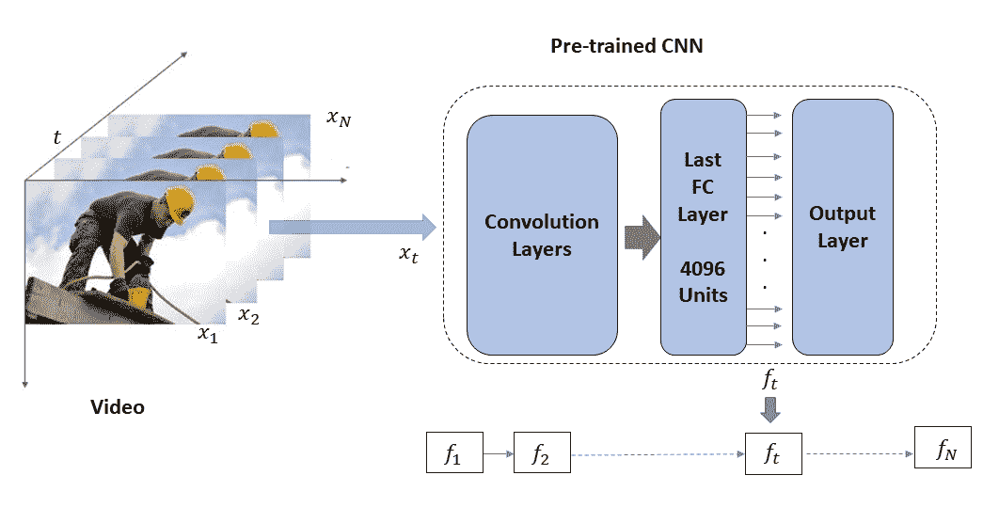
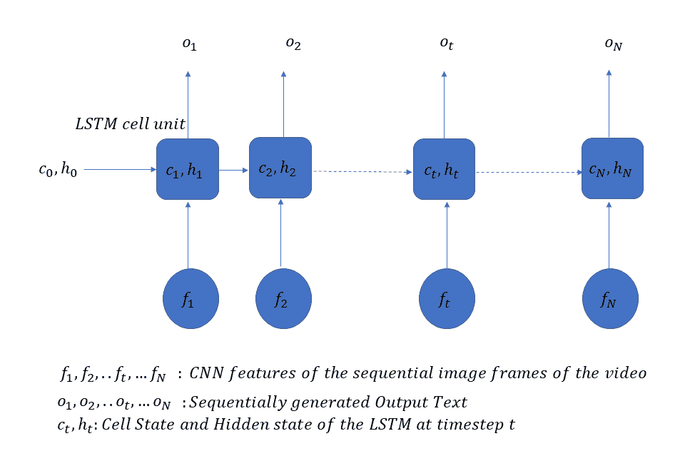
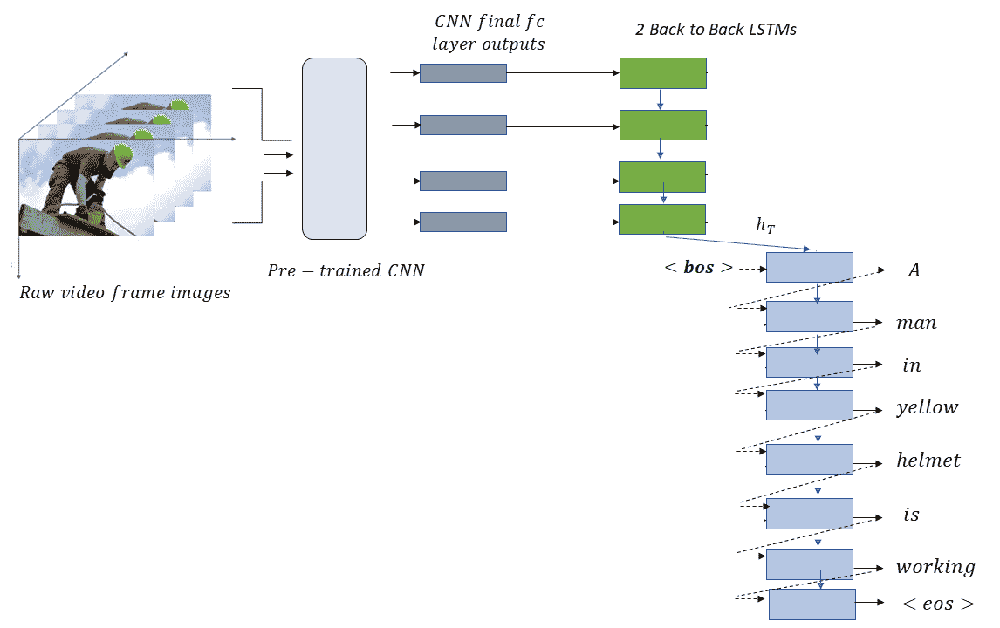
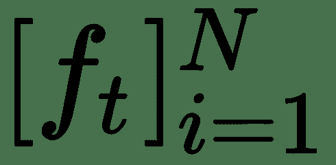
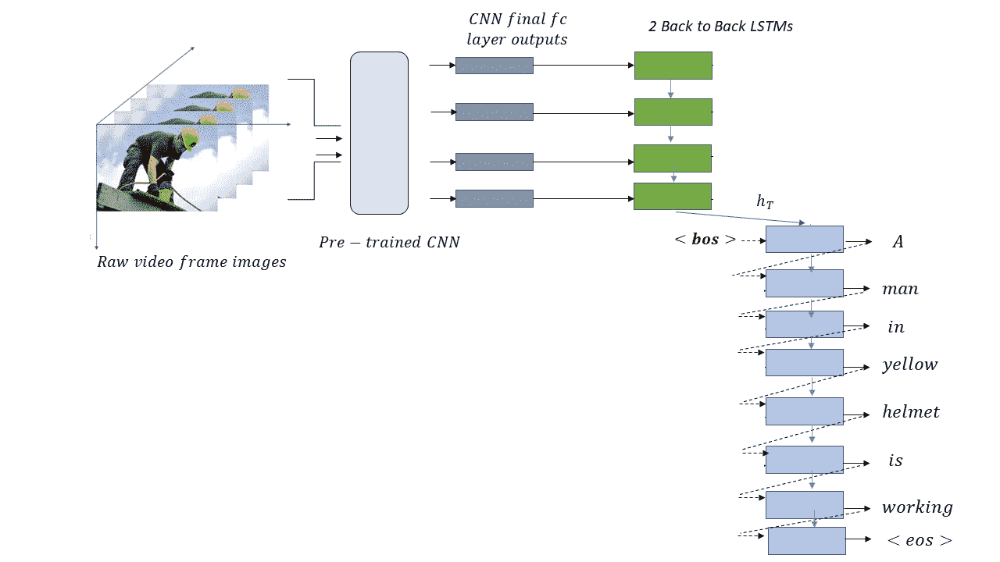
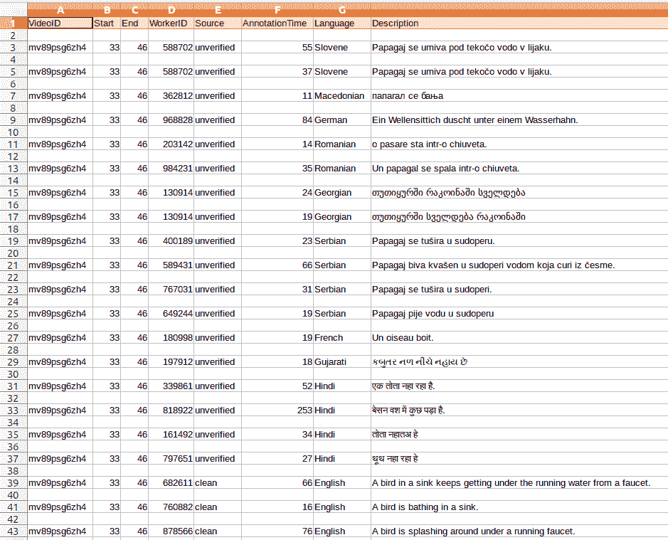
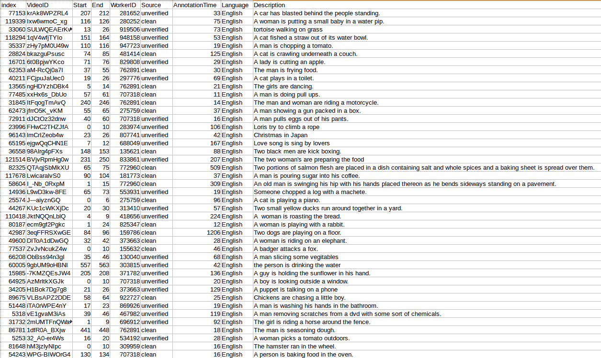
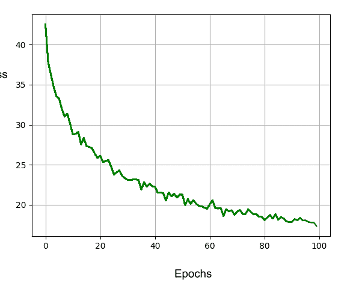
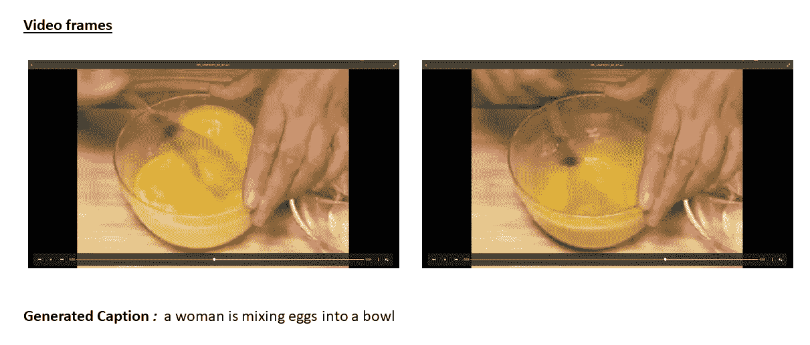
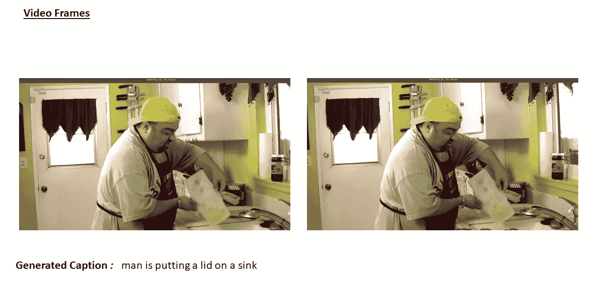

# 视频字幕应用

随着视频制作速度成倍增长，视频已成为一种重要的沟通媒介。 但是，由于缺乏适当的字幕，视频仍无法吸引更多的观众。

视频字幕（翻译视频以生成有意义的内容摘要的艺术）在计算机视觉和机器学习领域是一项具有挑战性的任务。 传统的视频字幕制作方法并没有成功。 但是，随着最近借助深度学习在人工智能方面的发展，视频字幕最近引起了极大的关注。 卷积神经网络以及循环神经网络的强大功能使得构建端到端企业级视频字幕系统成为可能。 卷积神经网络处理视频中的图像帧以提取重要特征，这些特征由循环神经网络依次处理以生成有意义的视频摘要。 视频字幕系统的一些重要应用如下：

*   自动监控工厂安全措施
*   根据通过视频字幕获得的内容对视频进行聚类
*   银行，医院和其他公共场所的更好的安全系统
*   网站中的视频搜索，以提供更好的用户体验

通过深度学习构建智能视频字幕系统主要需要两种类型的数据：视频和文本字幕，它们是用于训练端到端系统的标签。

作为本章的一部分，我们将讨论以下内容：

*   讨论 CNN 和 LSTM 在视频字幕中的作用
*   探索序列到序列视频字幕系统的架构
*   利用*序列到序列的架构*，构建视频到文本的视频字幕系统

在下一节中，我们将介绍如何使用卷积神经网络和循环神经网络的 LSTM 版本来构建端到端视频字幕系统。

# 技术要求

您将需要具备 Python 3，TensorFlow，Keras 和 OpenCV 的基础知识。

[本章的代码文件可以在 GitHub 上找到](https://github.com/PacktPublishing/Intelligent-Projects-using-Python/tree/master/Chapter05)

[观看以下视频，查看运行中的代码](http://bit.ly/2BeXK1c)

# 视频字幕中的 CNN 和 LSTM

视频减去音频后，可以认为是按顺序排列的图像集合。 可以使用针对特定图像分类问题训练的卷积神经网络（例如 **ImageNet**）从这些图像中提取重要特征。 预训练网络的最后一个全连接层的激活可用于从视频的顺序采样图像中得出特征。 从视频顺序采样图像的频率速率取决于视频中内容的类型，可以通过训练进行优化。

下图（“图 5.1”）说明了用于从视频中提取特征的预训练神经网络：



图 5.1：使用预训练的神经网络提取视频图像特征

从上图可以看出，从视频中顺序采样的图像经过预训练的卷积神经网络，并且输出最后一个全连接层中的`4,096`单元的激活。 如果将`t`时的视频图像表示为`x[t]`，并且最后一个全连接层的输出表示为`f[t] ∈ R^4096`，然后`f[t] = f[w](x[t])`。 此处，`W`表示直到最后一个全连接层的卷积神经网络的权重。

这些系列的输出功能`f[1], f[2], ..., f[t], ..., f[n]`可以作为循环神经网络的输入，该神经网络学习根据输入特征生成文本标题，如下图所示（“图 5.2”）：



图 5.2：处理来自 CNN 的顺序输入特征时的 LSTM

从上图可以看出，来自预训练卷积神经的生成的特征`f[1], f[2], ..., f[t], ..., f[n]`由 LSTM 依次处理，产生文本输出`o[1], o[2], ..., o[t], ..., o[n]`，它们是给定视频的文本标题。 例如，上图中的视频标题可能是“一名戴着黄色头盔的人正在工作”：

```
o1, o2, . . . . . ot . . . oN = { "A ","man" "in" "a" "yellow" "helmet" "is" "working"}
```

既然我们对视频字幕在深度学习框架中的工作方式有了一个很好的了解，让我们在下一部分中讨论一个更高级的视频字幕网络，称为*逐序列视频字幕*。 在本章中，我们将使用相同的网络架构来构建*视频字幕系统*。

# 序列到序列的视频字幕系统

序列到序列的架构基于 Subhashini Venugopalan，Marcus Rohrbach，Jeff Donahue，Raymond Mooney，Trevor Darrell 和 Kate Saenko 撰写的名为《序列到序列-视频到文本》的论文。 该论文可以在[这个页面](https://arxiv.org/pdf/1505.00487.pdf)中找到。

在下图（“图 5.3”）中，说明了基于先前论文的*序列到字幕视频字幕*神经网络架构：



图 5.3：序列到序列视频字幕网络架构

序列到序列模型通过像以前一样通过预训练的卷积神经网络处理视频图像帧，最后一个全连接层的输出激活被视为要馈送到后续 LSTM 的特征。 如果我们在时间步`t`表示预训练卷积神经网络的最后一个全连接层的输出激活为`f[t] ∈ R^4096`，那么我们将为视频中的`N`个图像帧使用`N`个这样的特征向量。 这些`N`个特征向量`f[1], f[2], ..., f[t], ..., f[n]`依次输入 LSTM，以生成文本标题。

背靠背有两个 LSTM，LSTM 中的序列数是来自视频的图像帧数与字幕词汇表中文本字幕的最大长度之和。 如果在视频的`N`个图像帧上训练网络，并且词汇表中的最大文本标题长度为`M`，则 LSTM 在`N + M`时间步长上训练。 在`N`个时间步中，第一个 LSTM 依次处理特征向量`f[1], f[2], ..., f[t], ..., f[n]`，并将其生成的隐藏状态馈送到第二 LSTM。 在这些`N`个时间步中，第二个 LSTM 不需要文本输出目标。 如果我们将第一个 LSTM 在时间步`t`的隐藏状态表示为`h[t]`，则第二个 LSTM 在前`N`个时间步长的输入为`h[t]`。 请注意，从`N + 1`时间步长开始，第一个 LSTM 的输入是零填充的，因此该输入对`t > N`的`h[t]`没有隐藏状态的影响。。 请注意，这并不保证`t > N`的隐藏状态`h[t]`总是相同的。 实际上，我们可以选择在任何时间步长`t > N`中将`h[t]`作为`h[T]`送入第二个 LSTM。

从`N + 1`时间步长开始，第二个 LSTM 需要文本输出目标。 在任何时间步长`t > N`的输入是`h[t], w[t-1]`，其中`h[t]`是第一个 LSTM 在时间步`t`的隐藏状态，而`w[t-1]`是时间步`t-1`中的文本标题词。

在`N + 1`时间步长处，馈送到第二 LSTM 的单词`w[N]`是由`<bos>`表示的句子的开头。 一旦生成句子符号`<eos>`的结尾，就训练网络停止生成标题词。 总而言之，两个 LSTM 的设置方式是，一旦它们处理完所有视频图像帧特征 ，它们便开始产生文本标题词。

处理时间步`t > N`的第二个 LSTM 输入的另一种方法是只喂`w[t-1]`而不是`h[t], w[t-1]`，并在时间步`T`传递第一个 LSTM 的隐藏状态和单元状态`h[T], c[T]`，到第二个 LSTM 的初始隐藏和细胞状态。 这样的视频字幕网络的架构可以说明如下（请参见“图 5.4”）：



图 5.4：序列到序列模型的替代架构

预训练的卷积神经网络通常具有通用架构，例如`VGG16`，`VGG19`，`ResNet`，并在 ImageNet 上进行了预训练。 但是，我们可以基于从我们要为其构建视频字幕系统的域中的视频中提取的图像来重新训练这些架构。 我们还可以选择一种全新的 CNN 架构，并在特定于该域的视频图像上对其进行训练。

到目前为止，我们已经介绍了使用本节中说明的序列到序列架构开发视频字幕系统的所有技术先决条件。 请注意，本节中建议的替代架构设计是为了鼓励读者尝试几种设计，并查看哪种设计最适合给定的问题和数据集。

从下一部分开始，我们致力于构建智能视频字幕系统。

# 视频字幕系统的数据

我们通过在`MSVD dataset`上训练模型来构建视频字幕系统，该模型是 Microsoft 的带预字幕的 YouTube 视频存储库。 [可以从以下链接下载所需的数据](http://www.cs.utexas.edu/users/ml/clamp/videoDescription/YouTubeClips.tar)。[可通过以下链接获得视频的文本标题](https://github.com/jazzsaxmafia/video_to_sequence/files/387979/video_corpus.csv.zip)。

`MSVD dataset`中大约有`1,938`个视频。 我们将使用它们来训练*逐序列视频字幕系统*。 还要注意，我们将在“图 5.3”中所示的序列到序列模型上构建模型。 但是，建议读者尝试在“图 5.4”中介绍的架构上训练模型，并了解其表现。

# 处理视频图像以创建 CNN 功能

从指定位置下载数据后，下一个任务是处理视频图像帧，以从预训练的卷积神经网络的最后全连接层中提取特征。 我们使用在 ImageNet 上预训练的`VGG16`卷积神经网络。 我们将激活从`VGG16`的最后一个全连接层中取出。 由于`VGG16`的最后一个全连接层具有`4096`单位，因此每个时间步`t`的特征向量`f[t]`为`4096`维向量，`f[t] ∈ R^4096`。

在通过`VGG16`处理视频中的图像之前，需要从视频中对其进行采样。 我们从视频中采样图像，使每个视频具有`80`帧。 处理来自`VGG16`的`80`图像帧后，每个视频将具有`80`特征向量`f[1], f[2], ..., f[80]`。 这些功能将被馈送到 LSTM 以生成文本序列。 我们在 Keras 中使用了预训练的`VGG16`模型。 我们创建一个`VideoCaptioningPreProcessing`类，该类首先通过函数`video_to_frames`从每个视频中提取`80`视频帧作为图像，然后通过功能`extract_feats_pretrained_cnn`中的预训练`VGG16`卷积神经网络处理这些视频帧。 。

`extract_feats_pretrained_cnn`的输出是每个视频帧尺寸为`4096`的 CNN 特征。 由于我们正在处理每个视频的`80`帧，因此每个视频将具有`80`这样的`4096`维向量。

`video_to_frames`功能可以编码如下：

```py
    def video_to_frames(self,video):

        with open(os.devnull, "w") as ffmpeg_log:
            if os.path.exists(self.temp_dest):
                print(" cleanup: " + self.temp_dest + "/")
                shutil.rmtree(self.temp_dest)
            os.makedirs(self.temp_dest)
            video_to_frames_cmd = ["ffmpeg",'-y','-i', video, 
                                       '-vf', "scale=400:300", 
                                       '-qscale:v', "2", 
                                       '{0}/%06d.jpg'.format(self.temp_dest)]
            subprocess.call(video_to_frames_cmd,
                            stdout=ffmpeg_log, stderr=ffmpeg_log)

```

从前面的代码中，我们可以看到在`video_to_frames`功能中，`ffmpeg`工具用于将 JPEG 格式的视频图像帧转换。 为图像帧指定为`ffmpeg`的尺寸为`300 x 400`。 有关`ffmpeg`工具的更多信息，[请参考以下链接](https://www.ffmpeg.org/)。

在`extract_feats_pretrained_cnnfunction`中已建立了从最后一个全连接层中提取特征的预训练 CNN 模型。 该函数的代码如下：

```py
# Extract the features from the pre-trained CNN 
    def extract_feats_pretrained_cnn(self):

        model = self.model_cnn_load()
        print('Model loaded')

        if not os.path.isdir(self.feat_dir):
            os.mkdir(self.feat_dir)
        #print("save video feats to %s" % (self.dir_feat))
        video_list = glob.glob(os.path.join(self.video_dest, '*.avi'))
        #print video_list 

        for video in tqdm(video_list):

            video_id = video.split("/")[-1].split(".")[0]
            print(f'Processing video {video}')

            #self.dest = 'cnn_feat' + '_' + video_id
            self.video_to_frames(video)

            image_list = 
            sorted(glob.glob(os.path.join(self.temp_dest, '*.jpg')))
            samples = np.round(np.linspace(
                0, len(image_list) - 1,self.frames_step))
            image_list = [image_list[int(sample)] for sample in samples]
            images = 
            np.zeros((len(image_list),self.img_dim,self.img_dim,
                     self.channels))
            for i in range(len(image_list)):
                img = self.load_image(image_list[i])
                images[i] = img
            images = np.array(images)
            fc_feats = model.predict(images,batch_size=self.batch_cnn)
            img_feats = np.array(fc_feats)
            outfile = os.path.join(self.feat_dir, video_id + '.npy')
            np.save(outfile, img_feats)
            # cleanup
            shutil.rmtree(self.temp_dest)
```

我们首先使用`model_cnn_load`函数加载经过预训练的 CNN 模型，然后针对每个视频，根据`ffmpeg.`指定的采样频率，使用`video_to_frames`函数将多个视频帧提取为图像。 图像通过`ffmpeg`创建的视频中的图像帧，但是我们使用`np.linspace`功能拍摄了`80`等距图像帧。 使用`load_image`功能将`ffmpeg`生成的图像调整为`224 x 224`的空间尺寸。 最后，将这些调整大小后的图像通过预训练的 VGG16 卷积神经网络（CNN），并提取输出层之前的最后一个全连接层的输出作为特征。 这些提取的特征向量存储在`numpy`数组中，并在下一阶段由 LSTM 网络进行处理以产生视频字幕。 本节中定义的功能`model_cnn_load`功能定义如下：

```py
   def model_cnn_load(self):
         model = VGG16(weights = "imagenet", include_top=True,input_shape = 
                                  (self.img_dim,self.img_dim,self.channels))
         out = model.layers[-2].output
         model_final = Model(input=model.input,output=out)
         return model_final
```

从前面的代码可以看出，我们正在加载在 ImageNet 上经过预训练的`VGG16`卷积神经网络，并提取第二层的输出（索引为`-2`）作为维度为`4096`的特征向量 ]。

图像读取和调整大小功能`load_image`定义为在馈入 CNN 之前处理原始`ffmpeg`图像，其定义如下：

```py
    def load_image(self,path):
        img = cv2.imread(path)
        img = cv2.resize(img,(self.img_dim,self.img_dim))
        return img 
```

可以通过调用以下命令来运行预处理脚本：

```py
 python VideoCaptioningPreProcessing.py process_main --video_dest '/media/santanu/9eb9b6dc-b380-486e-b4fd-c424a325b976/Video Captioning/data/' --feat_dir '/media/santanu/9eb9b6dc-b380-486e-b4fd-c424a325b976/Video Captioning/features/' --temp_dest '/media/santanu/9eb9b6dc-b380-486e-b4fd-c424a325b976/Video Captioning/temp/' --img_dim 224 --channels 3 --batch_size=128 --frames_step 80
```

该预处理步骤的输出是大小为`4096`的`80`特征向量，被写为扩展名`npy`的 numpy 数组对象。 每个视频将在`feat_dir`中存储自己的`numpy`数组对象。 从日志中可以看到，预处理步骤大约运行 28 分钟：

```py
Processing video /media/santanu/9eb9b6dc-b380-486e-b4fd-c424a325b976/Video Captioning/data/jmoT2we_rqo_0_5.avi
100%|████████████████████████████████████████████████████████████████████████████████████████████████████████████████████████████████████████████████████████████████████████████████████████████▋| 1967/1970 [27:57<00:02, 1.09it/s]Processing video /media/santanu/9eb9b6dc-b380-486e-b4fd-c424a325b976/Video Captioning/data/NKtfKR4GNjU_0_20.avi
100%|████████████████████████████████████████████████████████████████████████████████████████████████████████████████████████████████████████████████████████████████████████████████████████████▊| 1968/1970 [27:58<00:02, 1.11s/it]Processing video /media/santanu/9eb9b6dc-b380-486e-b4fd-c424a325b976/Video Captioning/data/4cgzdXlJksU_83_90.avi
100%|████████████████████████████████████████████████████████████████████████████████████████████████████████████████████████████████████████████████████████████████████████████████████████████▉| 1969/1970 [27:59<00:01, 1.08s/it]Processing video /media/santanu/9eb9b6dc-b380-486e-b4fd-c424a325b976/Video Captioning/data/0IDJG0q9j_k_1_24.avi
100%|█████████████████████████████████████████████████████████████████████████████████████████████████████████████████████████████████████████████████████████████████████████████████████████████| 1970/1970 [28:00<00:00, 1.06s/it]
28.045 min: VideoCaptioningPreProcessing
```

在下一部分中，我们将处理视频中带标签的字幕的预处理。

# 处理带标签的视频字幕

`corpus.csv`文件以文本标题的形式包含视频的描述（请参见“图 5.5”）。 以下屏幕快照显示了数据片段。 我们可以删除一些`[VideoID,Start,End]`组合记录，并将它们视为测试文件，以便稍后进行评估：



图 5.5：字幕文件格式的快照

`VideoID`，`Start`和`End`列组合以形成以下格式的视频名称：`VideoID_Start_End.avi`。 基于视频名称，来自卷积神经网络`VGG16`的特征已存储为`VideoID_Start_End.npy`。 以下代码块中所示的功能是处理视频的文本标题并创建来自`VGG16`的视频图像特征的路径交叉引用：

```py
def get_clean_caption_data(self,text_path,feat_path):
        text_data = pd.read_csv(text_path, sep=',')
        text_data = text_data[text_data['Language'] == 'English']
        text_data['video_path'] =
        text_data.apply(lambda row: 
         row['VideoID']+'_'+str(int(row['Start']))+'_'+str(int(row['End']))+'.npy',    
         axis=1)
        text_data['video_path'] = 
        text_data['video_path'].map(lambda x: os.path.join(feat_path, x))
        text_data = 
        text_data[text_data['video_path'].map(lambda x: os.path.exists(x))]
        text_data = 
        text_data[text_data['Description'].map(lambda x: isinstance(x, str))]

        unique_filenames = sorted(text_data['video_path'].unique())
        data =
        text_data[text_data['video_path'].map(lambda x: x in unique_filenames)]
        return data
```

在已定义的`get_data`函数中，我们从`video_corpus.csv`文件中删除了所有非英语的字幕。 完成后，我们首先通过构建视频名称（作为`VideoID`，`Start`和`End`功能的串联）并在功能目录名称前添加前缀来形成视频功能的链接。 然后，我们删除所有未指向`features`目录中任何实际视频特征向量或具有无效非文本描述的视频语料库文件记录。

数据如下图所示输出（“图 5.6”）：



图 5.6：预处理后的字幕数据

# 建立训练和测试数据集

训练模型后，我们想评估模型的运行情况。 我们可以根据测试集中的视频内容验证为测试数据集生成的字幕。 可以使用以下功能创建列车测试集数据集。 我们可以在训练期间创建测试数据集，并在训练模型后将其用于评估：

```py
   def train_test_split(self,data,test_frac=0.2):
        indices = np.arange(len(data))
        np.random.shuffle(indices)
        train_indices_rec = int((1 - test_frac)*len(data))
        indices_train = indices[:train_indices_rec]
        indices_test = indices[train_indices_rec:]
        data_train, data_test = 
        data.iloc[indices_train],data.iloc[indices_test]
        data_train.reset_index(inplace=True)
        data_test.reset_index(inplace=True)
        return data_train,data_test
```

通常保留 20% 的数据用于评估是一种公平的做法。

# 建立模型

在本节中，说明了核心模型构建练习。 我们首先为文本标题的词汇表中的单词定义一个嵌入层，然后是两个 LSTM。 权重`self.encode_W`和`self.encode_b`用于减少卷积神经网络中特征`f[t]`的尺寸。 对于第二个 LSTM（LSTM 2），在任何时间步长`t > N`处的其他输入之一是前一个单词`w[t-1]`，以及来自第一个 LSTM（LSTM 1）的输出`h[t]`。 将`w[t-1]`的词嵌入送入 LSTM 2，而不是原始的单热编码矢量。 对于前`N`个`(self.video_lstm_step)`，LSTM 1 处理来自 CNN 的输入特征`f[t]`，并且输出的隐藏状态`h[t]`（输出 1）被馈送到 LSTM2。在此编码阶段，LSTM 2 不会接收任何单词`w[t-1]`作为输入。

从`N + 1`时间步长，我们进入解码阶段，在此阶段，连同来自 LSTM 1 的`h[t]`（输出 1），先前的时间步的词嵌入矢量`w[t-1]`被馈送到 LSTM2。在这一阶段，没有到 LSTM 1 的输入，因为所有特征`f[t]`在时间步`N`耗尽。 解码阶段的时间步长由`self.caption_lstm_step`确定。

现在，如果我们用函数`f[2]`表示 LSTM 2 的活动，则`f[2](h[t], w[t-1]) = h[2t]`，其中`h[2t]`是 LSTM 2 在时间步`t`的隐藏状态。 该隐藏状态`h[2t]`在时间`t`时，通过 *softmax* 函数转换为输出单词的概率分布， 选择最高概率的单词作为下一个单词`o_hat[t]`：

 = 


这些权重`W[ho]`和`b`在以下代码块中定义为`self.word_emb_W`和`self.word_emb_b`。 有关更多详细信息，请参考`build_model`功能。 为了方便解释，构建功能分为三部分。 构建模型有 3 个主要单元

*   **定义阶段**：定义变量，标题词的嵌入层和序列到序列模型的两个 LSTM。
*   **编码阶段**：在这一阶段中，我们将视频帧图像特征传递给 LSTM1 的时间步长，并将每个时间步长的隐藏状态传递给 LSTM2。此活动一直进行到时间步长`N`其中`N`是从每个视频中采样的视频帧图像的数量。
*   **解码阶段**：在解码阶段，LSTM 2 开始生成文本字幕。 关于时间步骤，解码阶段从步骤`N + 1`开始。 从 LSTM 2 的每个时间步生成的单词将作为输入与 LSTM 1 的隐藏状态一起输入到下一个状态。

# 模型变量的定义

视频字幕模型的变量和其他相关定义可以定义如下：

```py
 Defining the weights associated with the Network
        with tf.device('/cpu:0'):
            self.word_emb = 
            tf.Variable(tf.random_uniform([self.n_words, self.dim_hidden],
                        -0.1, 0.1), name='word_emb')

        self.lstm1 = 
        tf.nn.rnn_cell.BasicLSTMCell(self.dim_hidden, state_is_tuple=False)
        self.lstm2 = 
        tf.nn.rnn_cell.BasicLSTMCell(self.dim_hidden, state_is_tuple=False)
        self.encode_W = 
        tf.Variable( tf.random_uniform([self.dim_image,self.dim_hidden],
                    -0.1, 0.1), name='encode_W')
        self.encode_b = 
        tf.Variable( tf.zeros([self.dim_hidden]), name='encode_b')

        self.word_emb_W =
        tf.Variable(tf.random_uniform([self.dim_hidden,self.n_words], 
        -0.1,0.1), name='word_emb_W')
        self.word_emb_b = 
        tf.Variable(tf.zeros([self.n_words]), name='word_emb_b')

        # Placeholders 
        video = 
       tf.placeholder(tf.float32, [self.batch_size, 
       self.video_lstm_step, self.dim_image])
        video_mask = 
        tf.placeholder(tf.float32, [self.batch_size, self.video_lstm_step])

        caption = 
        tf.placeholder(tf.int32, [self.batch_size, self.caption_lstm_step+1])
        caption_mask = 
        tf.placeholder(tf.float32, [self.batch_size, self.caption_lstm_step+1])

        video_flat = tf.reshape(video, [-1, self.dim_image])
        image_emb = tf.nn.xw_plus_b( video_flat, self.encode_W,self.encode_b )
        image_emb = 
        tf.reshape(image_emb, [self.batch_size, self.lstm_steps, self.dim_hidden])

        state1 = tf.zeros([self.batch_size, self.lstm1.state_size])
        state2 = tf.zeros([self.batch_size, self.lstm2.state_size])
        padding = tf.zeros([self.batch_size, self.dim_hidden])
```

所有相关变量以及占位符均由先前的代码定义。

# 编码阶段

在编码阶段，我们通过使它们经过 LSTM 1 的时间步长，依次处理每个视频图像帧特征（来自 CNN 最后一层）。视频图像帧的维数为`4096.`，然后再将这些高维视频帧特征向量馈入 LSTM 1，它们缩小为较小的`512.`

LSTM 1 在每个时间步长处理视频帧图像并将隐藏状态传递给 LSTM 2，此过程一直持续到时间步长`N`（`self.video_lstm_step`）。 编码器的代码如下：

```py
probs = []
        loss = 0.0

        # Encoding Stage 
        for i in range(0, self.video_lstm_step):
            if i > 0:
                tf.get_variable_scope().reuse_variables()

            with tf.variable_scope("LSTM1"):
                output1, state1 = self.lstm1(image_emb[:,i,:], state1)

            with tf.variable_scope("LSTM2"):
                output2, state2 = self.lstm2(tf.concat([padding, output1],1), state2)

```

# 解码阶段

在解码阶段，产生用于视频字幕的单词。 没有更多输入到 LSTM1。但是 LSTM 1 前滚，并且所产生的隐藏状态像以前一样馈送到 LSTM 2 时间步长。 在每个步骤中，LSTM 2 的另一个输入是标题中前一个单词的嵌入向量。 因此，在每个步骤中，LSTM 2 都会生成一个新的字幕词，该词以在前一个时间步中预测的单词为条件，并带有该时间步的 LSTM 1 的隐藏状态。 解码器的代码如下：

```py
# Decoding Stage to generate Captions 
        for i in range(0, self.caption_lstm_step):

            with tf.device("/cpu:0"):
                current_embed = tf.nn.embedding_lookup(self.word_emb, caption[:, i])

            tf.get_variable_scope().reuse_variables()

            with tf.variable_scope("LSTM1"):
                output1, state1 = self.lstm1(padding, state1)

            with tf.variable_scope("LSTM2"):
                output2, state2 = 
                 self.lstm2(tf.concat([current_embed, output1],1), state2)
```

# 为每个迷你批次建立损失

在 LSTM 2 的每个时间步长上，优化的损失是关于从字幕单词的整个语料库中预测正确单词的分类交叉熵损失。 对于批量中的所有数据点，在解码阶段的每个步骤中都会累积相同的内容。 与解码阶段的损耗累积相关的代码如下：

```py
            labels = tf.expand_dims(caption[:, i+1], 1)
            indices = tf.expand_dims(tf.range(0, self.batch_size, 1), 1)
            concated = tf.concat([indices, labels],1)
            onehot_labels = 
            tf.sparse_to_dense(concated, tf.stack
                              ([self.batch_size,self.n_words]), 1.0, 0.0)

            logit_words = 
            tf.nn.xw_plus_b(output2, self.word_emb_W, self.word_emb_b)
        # Computing the loss 
            cross_entropy =   
            tf.nn.softmax_cross_entropy_with_logits(logits=logit_words,
            labels=onehot_labels)
            cross_entropy = 
            cross_entropy * caption_mask[:,i]
            probs.append(logit_words)

            current_loss = tf.reduce_sum(cross_entropy)/self.batch_size
            loss = loss + current_loss
```

可以使用任何合理的梯度下降优化器（例如 Adam，RMSprop 等）来优化损耗。 我们将选择`Adam`进行实验，因为它对大多数深度学习优化都表现良好。 我们可以使用 Adam 优化器定义火车操作，如下所示：

```py
with tf.variable_scope(tf.get_variable_scope(),reuse=tf.AUTO_REUSE):
    train_op = tf.train.AdamOptimizer(self.learning_rate).minimize(loss) 
```

# 为字幕创建单词词汇

在本节中，我们为视频字幕创建单词词汇。 我们创建了一些其他单词，要求如下：

```py
eos => End of Sentence
bos => Beginning of Sentence 
pad => When there is no word to feed,required by the LSTM 2 in the initial N time steps
unk => A substitute for a word that is not included in the vocabulary

```

其中一个单词是输入的 LSTM 2 将需要这四个附加符号。 对于`N + 1`时间步长，当我们开始生成字幕时，我们将前一个时间步长`w[t-1]`的单词送入。 对于要生成的第一个单词，没有有效的上一个时间步长单词，因此我们输入了伪单词`<bos>`，它表示句子的开头。 同样，当我们到达最后一个时间步时， `w[t-1]`是字幕的最后一个字。 我们训练模型以将最终单词输出为`<eos>`，它表示句子的结尾。 当遇到句子结尾时，LSTM 2 停止发出任何其他单词。

为了举例说明，我们以句子`The weather is beautiful`。 以下是从时间步`N + 1`开始的 LSTM 2 的输入和输出标签：

| **时间步长** | **输入** | **输出** |
| --- | --- | --- |
| `N + 1` | `<bos>`， `h[N + 1]` | `The` |
| `N + 2` | `The`，`h[N + 2]` | `weather` |
| `N + 3` | `weather`，`h[N + 3]` | `is` |
| `N + 4` | `is`，`h[N + 4]` | `beautiful` |
| `N + 5` | `beautiful`，`h[N + 5]` | `<eos>` |

用来详细说明单词的`create_word_dict`功能如下所示：

```py
    def create_word_dict(self,sentence_iterator, word_count_threshold=5):

        word_counts = {}
        sent_cnt = 0

        for sent in sentence_iterator:
            sent_cnt += 1
            for w in sent.lower().split(' '):
               word_counts[w] = word_counts.get(w, 0) + 1
        vocab = [w for w in word_counts if word_counts[w] >= word_count_threshold]

        idx2word = {}
        idx2word[0] = '<pad>'
        idx2word[1] = '<bos>'
        idx2word[2] = '<eos>'
        idx2word[3] = '<unk>'

        word2idx = {}
        word2idx['<pad>'] = 0
        word2idx['<bos>'] = 1
        word2idx['<eos>'] = 2
        word2idx['<unk>'] = 3

        for idx, w in enumerate(vocab):
            word2idx[w] = idx+4
            idx2word[idx+4] = w

        word_counts['<pad>'] = sent_cnt
        word_counts['<bos>'] = sent_cnt
        word_counts['<eos>'] = sent_cnt
        word_counts['<unk>'] = sent_cnt

        return word2idx,idx2word

```

# 训练模型

在本节中，我们将所有部分放在一起以构建用于训练视频字幕模型的功能。

首先，我们结合培训和测试数据集中的视频字幕，创建单词词汇词典。 完成此操作后，我们将结合两个 LSTM 调用`build_model`函数来创建视频字幕网络。 对于每个带有特定*开始*和*结束*的视频，都有多个输出视频字幕。 在每个批次中，从开始和结束的特定视频的输出视频字幕是从多个可用的视频字幕中随机选择的。 调整 LSTM 2 的输入文本标题，使其在时间步`N + 1`处的起始词为`<bos>`，而输出文本标题的结束词被调整为最终文本标签`<eos>`。 每个时间步长上的分类交叉熵损失之和被视为特定视频的总交叉熵损失。 在每个时间步中，我们计算完整单词词汇上的分类交叉熵损失，可以表示为：


此处，`y^(t) = [y1^(t), y2^(t), ..., y[V]^(t)]`是时间步长`t`时实际目标单词的一个热编码矢量，而`p^(t) = [p1^(t), p2^(t), ..., p[V]^(t)]`是模型预测的概率矢量。

在训练期间的每个时期都会记录损失，以了解损失减少的性质。 这里要注意的另一件事是，我们正在使用 TensorFlow 的`tf.train.saver`函数保存经过训练的模型，以便我们可以恢复模型以进行推理。

`train`功能的详细代码在此处说明以供参考：

```py
     def train(self):
        data = self.get_data(self.train_text_path,self.train_feat_path)
        self.train_data,self.test_data = self.train_test_split(data,test_frac=0.2)
        self.train_data.to_csv(f'{self.path_prj}/train.csv',index=False)
        self.test_data.to_csv(f'{self.path_prj}/test.csv',index=False)

        print(f'Processed train file written to {self.path_prj}/train_corpus.csv')
        print(f'Processed test file written to {self.path_prj}/test_corpus.csv')

        train_captions = self.train_data['Description'].values
        test_captions = self.test_data['Description'].values

        captions_list = list(train_captions) 
        captions = np.asarray(captions_list, dtype=np.object)

        captions = list(map(lambda x: x.replace('.', ''), captions))
        captions = list(map(lambda x: x.replace(',', ''), captions))
        captions = list(map(lambda x: x.replace('"', ''), captions))
        captions = list(map(lambda x: x.replace('\n', ''), captions))
        captions = list(map(lambda x: x.replace('?', ''), captions))
        captions = list(map(lambda x: x.replace('!', ''), captions))
        captions = list(map(lambda x: x.replace('\\', ''), captions))
        captions = list(map(lambda x: x.replace('/', ''), captions))

        self.word2idx,self.idx2word = self.create_word_dict(captions, 
                                      word_count_threshold=0)

        np.save(self.path_prj/ "word2idx",self.word2idx)
        np.save(self.path_prj/ "idx2word" ,self.idx2word)
        self.n_words = len(self.word2idx)

        tf_loss, tf_video,tf_video_mask,tf_caption,tf_caption_mask, tf_probs,train_op= 
        self.build_model()
        sess = tf.InteractiveSession()

        saver = tf.train.Saver(max_to_keep=100, write_version=1)
        tf.global_variables_initializer().run()

        loss_out = open('loss.txt', 'w')
        val_loss = []

        for epoch in range(0,self.epochs):
            val_loss_epoch = []

            index = np.arange(len(self.train_data))

            self.train_data.reset_index()
            np.random.shuffle(index)
            self.train_data = self.train_data.loc[index]

            current_train_data = 
            self.train_data.groupby(['video_path']).first().reset_index()

            for start, end in zip(
                    range(0, len(current_train_data),self.batch_size),
                    range(self.batch_size,len(current_train_data),self.batch_size)):

                start_time = time.time()

                current_batch = current_train_data[start:end]
                current_videos = current_batch['video_path'].values

                current_feats = np.zeros((self.batch_size, 
                                self.video_lstm_step,self.dim_image))
                current_feats_vals = list(map(lambda vid: np.load(vid),current_videos))
                current_feats_vals = np.array(current_feats_vals) 

                current_video_masks = np.zeros((self.batch_size,self.video_lstm_step))

                for ind,feat in enumerate(current_feats_vals):
                    current_feats[ind][:len(current_feats_vals[ind])] = feat
                    current_video_masks[ind][:len(current_feats_vals[ind])] = 1

                current_captions = current_batch['Description'].values
                current_captions = list(map(lambda x: '<bos> ' + x, current_captions))
                current_captions = list(map(lambda x: x.replace('.', ''), 
                                    current_captions))
                current_captions = list(map(lambda x: x.replace(',', ''), 
                                   current_captions))
                current_captions = list(map(lambda x: x.replace('"', ''), 
                                   current_captions))
                current_captions = list(map(lambda x: x.replace('\n', ''), 
                                   current_captions))
                current_captions = list(map(lambda x: x.replace('?', ''), 
                                   current_captions))
                current_captions = list(map(lambda x: x.replace('!', ''), 
                                   current_captions))
                current_captions = list(map(lambda x: x.replace('\\', ''), 
                                   current_captions))
                current_captions = list(map(lambda x: x.replace('/', ''), 
                                   current_captions))

                for idx, each_cap in enumerate(current_captions):
                    word = each_cap.lower().split(' ')
                    if len(word) < self.caption_lstm_step:
                        current_captions[idx] = current_captions[idx] + ' <eos>'
                    else:
                        new_word = ''
                        for i in range(self.caption_lstm_step-1):
                            new_word = new_word + word[i] + ' '
                        current_captions[idx] = new_word + '<eos>'

                current_caption_ind = []
                for cap in current_captions:
                    current_word_ind = []
                    for word in cap.lower().split(' '):
                        if word in self.word2idx:
                            current_word_ind.append(self.word2idx[word])
                        else:
                            current_word_ind.append(self.word2idx['<unk>'])
                    current_caption_ind.append(current_word_ind)

                current_caption_matrix = 
                sequence.pad_sequences(current_caption_ind, padding='post', 
                                       maxlen=self.caption_lstm_step)
                current_caption_matrix = 
                np.hstack( [current_caption_matrix, 
                          np.zeros([len(current_caption_matrix), 1] ) ] ).astype(int)
                current_caption_masks =
                np.zeros( (current_caption_matrix.shape[0], 
                           current_caption_matrix.shape[1]) )
                nonzeros = 
                np.array( list(map(lambda x: (x != 0).sum() + 1, 
                         current_caption_matrix ) ))

                for ind, row in enumerate(current_caption_masks):
                    row[:nonzeros[ind]] = 1

                probs_val = sess.run(tf_probs, feed_dict={
                    tf_video:current_feats,
                    tf_caption: current_caption_matrix
                    })

                _, loss_val = sess.run(
                        [train_op, tf_loss],
                        feed_dict={
                            tf_video: current_feats,
                            tf_video_mask : current_video_masks,
                            tf_caption: current_caption_matrix,
                            tf_caption_mask: current_caption_masks
                            })
                val_loss_epoch.append(loss_val)

                print('Batch starting index: ', start, " Epoch: ", epoch, " loss: ", 
                loss_val, ' Elapsed time: ', str((time.time() - start_time)))
                loss_out.write('epoch ' + str(epoch) + ' loss ' + str(loss_val) + '\n')

            # draw loss curve every epoch
            val_loss.append(np.mean(val_loss_epoch))
            plt_save_dir = self.path_prj / "loss_imgs"
            plt_save_img_name = str(epoch) + '.png'
            plt.plot(range(len(val_loss)),val_loss, color='g')
            plt.grid(True)
            plt.savefig(os.path.join(plt_save_dir, plt_save_img_name))

            if np.mod(epoch,9) == 0:
                print ("Epoch ", epoch, " is done. Saving the model ...")
                saver.save(sess, os.path.join(self.path_prj, 'model'), global_step=epoch)

        loss_out.close()

```

从前面的代码中我们可以看到，我们通过根据`batch_size.`随机选择一组视频来创建每个批次

对于每个视频，标签是随机选择的，因为同一视频已被多个标记器标记。 对于每个选定的字幕，我们都会清理字幕文本，并将它们中的单词转换为单词索引。 字幕的目标移动了 1 个时间步，因为在每一步中，我们都根据字幕中的前一个单词来预测单词。 针对指定的时期数训练模型，并在指定的时期间隔（此处为`9`）对模型进行检查。

# 训练结果

可以使用以下命令训练模型：

```py
python Video_seq2seq.py process_main --path_prj '/media/santanu/9eb9b6dc-b380-486e-b4fd-c424a325b976/Video Captioning/' --caption_file video_corpus.csv --feat_dir features --cnn_feat_dim 4096 --h_dim 512 --batch_size 32 --lstm_steps 80 --video_steps=80 --out_steps 20 --learning_rate 1e-4--epochs=100 
```

| **参数** | **值** |
| --- | --- |
| `Optimizer` | `Adam` |
| `learning rate` | `1e-4` |
| `Batch size` | `32` |
| `Epochs` | `100` |
| `cnn_feat_dim` | `4096` |
| `lstm_steps` | `80` |
| `out_steps` | `20` |
| `h_dim` | `512` |

培训的输出日志如下：

```py
Batch starting index: 1728 Epoch: 99 loss: 17.723186 Elapsed time: 0.21822428703308105
Batch starting index: 1760 Epoch: 99 loss: 19.556421 Elapsed time: 0.2106935977935791
Batch starting index: 1792 Epoch: 99 loss: 21.919321 Elapsed time: 0.2206578254699707
Batch starting index: 1824 Epoch: 99 loss: 15.057275 Elapsed time: 0.21275663375854492
Batch starting index: 1856 Epoch: 99 loss: 19.633915 Elapsed time: 0.21492290496826172
Batch starting index: 1888 Epoch: 99 loss: 13.986136 Elapsed time: 0.21542596817016602
Batch starting index: 1920 Epoch: 99 loss: 14.300303 Elapsed time: 0.21855640411376953
Epoch 99 is done. Saving the model ...
24.343 min: Video Captioning

```

我们可以看到，使用 GeForce Zotac 1070 GPU 在 100 个时间段上训练模型大约需要 24 分钟。

每个时期的训练损失减少表示如下（“图 5.7”）：



图 5.7 训练期间的损失概况

从前面的图表（“图 5.7”）可以看出，损耗减少在最初的几个时期中较高，然后在时期`80`处逐渐减小。 在下一节中，我们将说明该模型在为看不见的视频生成字幕时的性能。

# 用看不见的测试视频推断

为了进行推理，我们构建了一个生成器函数`build_generator`，该函数复制了`build_model`的逻辑以定义所有模型变量，以及所需的 TensorFlow 操作来加载模型并在同一模型上进行推理：

```py
    def build_generator(self):
        with tf.device('/cpu:0'):
            self.word_emb = 
            tf.Variable(tf.random_uniform([self.n_words, self.dim_hidden],
                        -0.1, 0.1), name='word_emb')

        self.lstm1 =
        tf.nn.rnn_cell.BasicLSTMCell(self.dim_hidden, state_is_tuple=False)
        self.lstm2 = 
        tf.nn.rnn_cell.BasicLSTMCell(self.dim_hidden, state_is_tuple=False)

        self.encode_W = 
        tf.Variable(tf.random_uniform([self.dim_image,self.dim_hidden], 
                    -0.1, 0.1), name='encode_W')
        self.encode_b = 
        tf.Variable(tf.zeros([self.dim_hidden]), name='encode_b')

        self.word_emb_W = 
        tf.Variable(tf.random_uniform([self.dim_hidden,self.n_words],
                     -0.1,0.1), name='word_emb_W')
        self.word_emb_b = 
         tf.Variable(tf.zeros([self.n_words]), name='word_emb_b')
        video = 
        tf.placeholder(tf.float32, [1, self.video_lstm_step, self.dim_image])
        video_mask = 
         tf.placeholder(tf.float32, [1, self.video_lstm_step])

        video_flat = tf.reshape(video, [-1, self.dim_image])
        image_emb = tf.nn.xw_plus_b(video_flat, self.encode_W, self.encode_b)
        image_emb = tf.reshape(image_emb, [1, self.video_lstm_step, self.dim_hidden])

        state1 = tf.zeros([1, self.lstm1.state_size])
        state2 = tf.zeros([1, self.lstm2.state_size])
        padding = tf.zeros([1, self.dim_hidden])

        generated_words = []

        probs = []
        embeds = []

        for i in range(0, self.video_lstm_step):
            if i > 0:
                tf.get_variable_scope().reuse_variables()

            with tf.variable_scope("LSTM1"):
                output1, state1 = self.lstm1(image_emb[:, i, :], state1)

            with tf.variable_scope("LSTM2"):
                output2, state2 = 
                self.lstm2(tf.concat([padding, output1],1), state2)

        for i in range(0, self.caption_lstm_step):
            tf.get_variable_scope().reuse_variables()

            if i == 0:
                with tf.device('/cpu:0'):
                    current_embed = 
                    tf.nn.embedding_lookup(self.word_emb, tf.ones([1], dtype=tf.int64))

            with tf.variable_scope("LSTM1"):
                output1, state1 = self.lstm1(padding, state1)

            with tf.variable_scope("LSTM2"):
                output2, state2 = 
                self.lstm2(tf.concat([current_embed, output1],1), state2)

            logit_words = 
            tf.nn.xw_plus_b( output2, self.word_emb_W, self.word_emb_b)
            max_prob_index = tf.argmax(logit_words, 1)[0]
            generated_words.append(max_prob_index)
            probs.append(logit_words)

            with tf.device("/cpu:0"):
                current_embed =
                tf.nn.embedding_lookup(self.word_emb, max_prob_index)
                current_embed = tf.expand_dims(current_embed, 0)

            embeds.append(current_embed)

        return video, video_mask, generated_words, probs, embeds
```

# 推理功能

在推理过程中，我们调用`build_generator`定义模型以及推理所需的其他 TensorFlow 操作，然后使用`tf.train.Saver.restoreutility`从训练后的模型中保存已保存的权重，以加载定义的模型。 一旦加载了模型并准备对每个测试视频进行推理，我们就从 CNN 中提取其对应的视频帧图像预处理特征并将其传递给模型进行推理：

```py
   def inference(self):
        self.test_data = self.get_test_data(self.test_text_path,self.test_feat_path)
        test_videos = self.test_data['video_path'].unique()

        self.idx2word = 
        pd.Series(np.load(self.path_prj / "idx2word.npy").tolist())

        self.n_words = len(self.idx2word)
        video_tf, video_mask_tf, caption_tf, probs_tf, last_embed_tf =           
        self.build_generator()

        sess = tf.InteractiveSession()

        saver = tf.train.Saver()
        saver.restore(sess,self.model_path)

        f = open(f'{self.path_prj}/video_captioning_results.txt', 'w')
        for idx, video_feat_path in enumerate(test_videos):
            video_feat = np.load(video_feat_path)[None,...]
            if video_feat.shape[1] == self.frame_step:
                video_mask = np.ones((video_feat.shape[0], video_feat.shape[1]))
            else:
                continue

            gen_word_idx = 
            sess.run(caption_tf, feed_dict={video_tf:video_feat, 
                     video_mask_tf:video_mask})
            gen_words = self.idx2word[gen_word_idx]

            punct = np.argmax(np.array(gen_words) == '<eos>') + 1
            gen_words = gen_words[:punct]

            gen_sent = ' '.join(gen_words)
            gen_sent = gen_sent.replace('<bos> ', '')
            gen_sent = gen_sent.replace(' <eos>', '')
            print(f'Video path {video_feat_path} : Generated Caption {gen_sent}')
            print(gen_sent,'\n')
            f.write(video_feat_path + '\n')
            f.write(gen_sent + '\n\n')

```

可以通过调用以下命令来运行推理：

```py
python Video_seq2seq.py process_main --path_prj '/media/santanu/9eb9b6dc-b380-486e-b4fd-c424a325b976/Video Captioning/' --caption_file '/media/santanu/9eb9b6dc-b380-486e-b4fd-c424a325b976/Video Captioning/test.csv' --feat_dir features --mode inference --model_path '/media/santanu/9eb9b6dc-b380-486e-b4fd-c424a325b976/Video Captioning/model-99'
```

# 评估结果

评估结果很有希望。 来自测试集`0lh_UWF9ZP4_82_87.avi`和`8MVo7fje_oE_139_144.avi`的两个视频的推断结果显示如下：

在以下屏幕截图中，我们说明了对视频`video0lh_` `UWF9ZP4_82_87.avi`的推断结果：



使用经过训练的模型对视频`0lh_UWF9ZP4_82_87.avi`进行推断

在以下屏幕截图中，我们说明了对另一个`video8MVo7fje_oE_139_144.avi`的推断结果：



使用训练后的模型推断视频/8MVo7fje_oE_139_144.avi

从前面的屏幕截图中，我们可以看到训练后的模型为提供的测试视频提供了很好的字幕，表现出色。

该项目的代码可以在 [GitHub](https://github.com/PacktPublishing/Python-Artificial-Intelligence-Projects/tree/master/Chapter05) 中找到。 `VideoCaptioningPreProcessing.py`模块可用于预处理视频并创建卷积神经网络功能，而`Video_seq2seq.py`模块可用于训练端到端视频字幕系统和运行推断。

# 概要

现在，我们已经完成了令人兴奋的视频字幕项目的结尾。 您应该能够使用 TensorFlow 和 Keras 构建自己的视频字幕系统。 您还应该能够使用本章中介绍的技术知识来开发其他涉及卷积神经网络和循环神经网络的高级模型。 下一章将使用受限玻尔兹曼机构建智能的推荐系统。 期待您的参与！