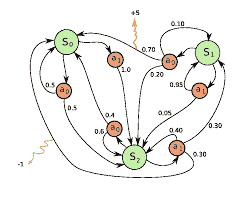
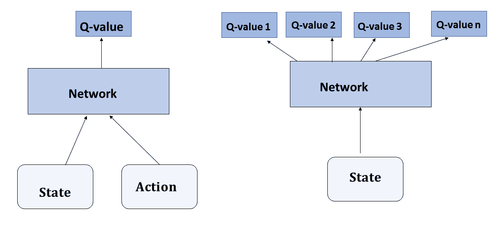
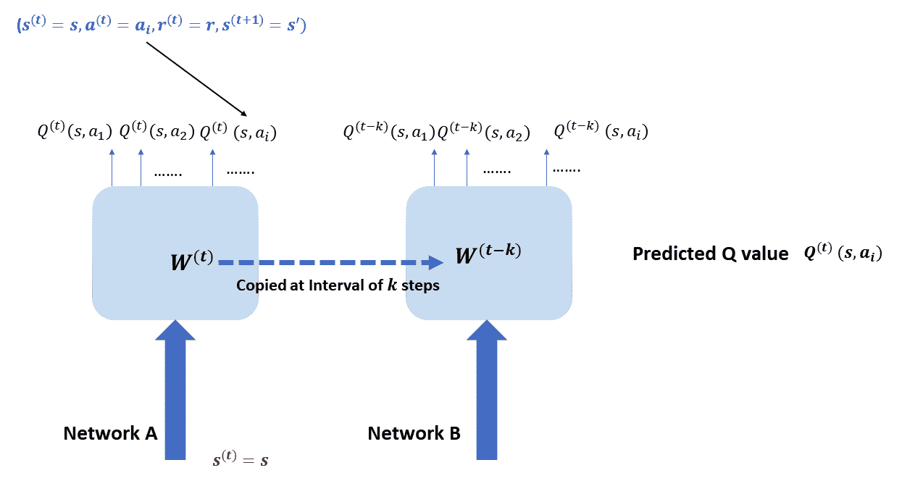
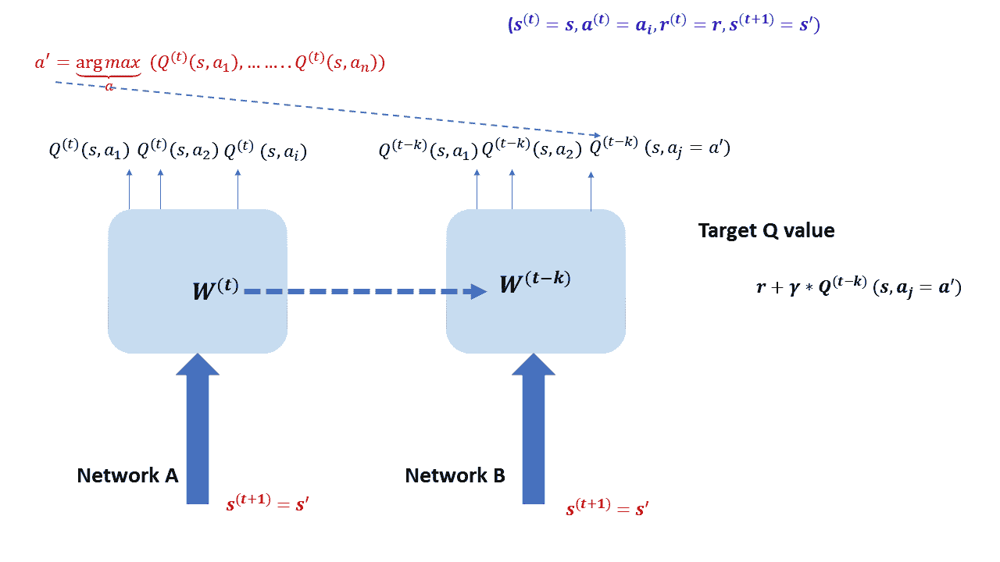
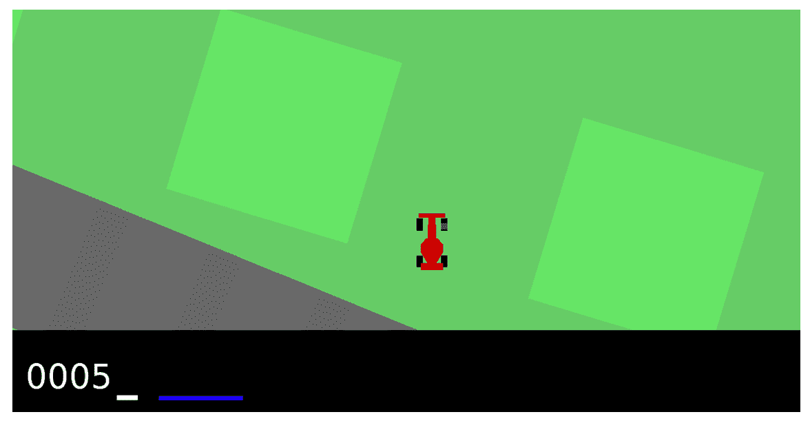
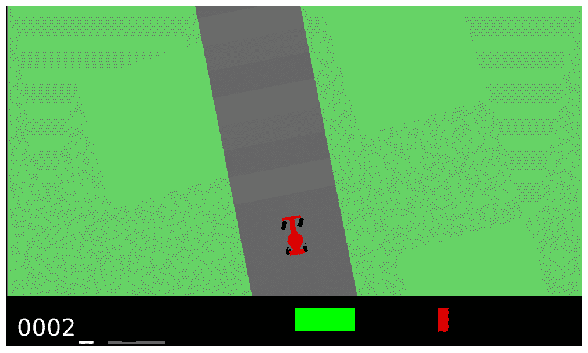

# 通过强化学习的自主无人驾驶汽车

在过去的几年中，增强学习已经真正兴起，在增强学习中，代理通过与环境的交互来学习决策。 这是当今人工智能和机器学习中最热门的主题之一，并且这一领域的研究正在快速发展。 在**强化学习**（**RL**）中，代理将他们的行动和经验转化为学习，以便将来做出更好的决策。

增强学习不属于有监督或无监督的机器学习范式，因为它本身就是一个领域。 在监督学习中，我们尝试学习一个映射`F: X → Y`，将输入`X`映射到输出`Y`，而在强化学习中，主体学习 通过反复试验采取最佳行动。 当业务代表执行任务出色时，将分配奖励，而当业务代表执行不好时，则要支付罚款。 代理试图吸收这些信息，并学会在类似的情况下不重复这些错误。 代理人所处的这些条件称为状态。 “图 9.1”显示了强化学习框架中环境中代理的交互作用：


图 9.1：代理与环境交互的图示

# 技术要求

您将需要具备 Python 3，TensorFlow，Keras 和 OpenCV 的基础知识。

[可以在 GitHub 上找到本章的代码文件](https://github.com/PacktPublishing/Intelligent-Projects-using-Python/tree/master/Chapter09)

[观看以下视频，查看运行中的代码](http://bit.ly/2WxfwpF)

# 马尔可夫决策过程

任何强化学习问题都可以看作是**马尔可夫决策过程**，我们在第 1 章“基于人工智能的系统基础”中进行了简要介绍。 为了您的利益，我们将再次详细研究。 在马尔可夫决策过程中，我们有一个与环境交互的主体。 在任何给定的情况下，`t`代理处于多种状态之一：`s[t] = s ∈ S`。 根据主体的动作`a[t] = a ∈ A`处于状态`s[t]`具有新状态`s[t + 1] = s' ∈ S`。 在这里，`S`表示代理可能会暴露的所有状态，而`A`则表示代理可以参与的可能动作。

您现在可能想知道智能体如何采取行动。 应该是随机的还是基于启发式的？ 好吧，这取决于代理与相关环境的交互程度。 在初始阶段，代理可能会采取随机行动，因为他们不了解环境。 但是，一旦代理与环境进行了足够的交互（基于奖励和惩罚），代理就会了解在给定状态下采取哪种适当的措施。 类似于人们倾向于采取有益于长期奖励的行动一样，RL 代理商也采取行动，最大限度地提高了长期奖励。

数学上，代理尝试为每个状态动作对`s ∈ S， a ∈ A`学习 Q 值`Q(s, a)`。 对于给定状态`s[t]`，RL 代理选择动作`a`，该动作给出最大 Q 值。 代理采取的动作`a[t]`可以表示如下：


一旦代理在状态`s[t]`采取行动`a[t]`，新状态`s[t + 1]`会呈现给代理来处理。 这个新状态`s[t + 1]`通常不是确定性的，通常表示为当前状态`s[t]`和动作`a[t]`的条件概率分布。这些概率称为**状态转移概率**，可以表示为：


每当代理在状态`s[t]`采取行动`a[t]`并达到新状态`s[t + 1]`时，即时奖励会奖励给代理商，可以表示为：


现在，我们拥有定义马尔可夫决策过程所需的一切。 马尔可夫决策过程是一个系统，其特征在于以下四个要素：

*   一组状态`S`
*   一组动作`A`
*   一组奖励`R`
*   状态转移概率`P(s[t + 1] = s' | s[t] = s, a[t] = a)`：



图 9.2：具有三个状态的马尔可夫决策过程的图示

# 学习 Q 值功能

对于 RL 代理做出决定，重要的是代理学习 Q 值函数。 可以通过**贝尔曼方程**迭代地学习 Q 值函数。 当代理开始与环境交互时，它以随机状态`s[0]`和每个状态动作对的 Q 值的随机状态开始。 代理的动作在某种程度上也是随机的，因为它没有状态 Q 值来做出明智的决策。 对于每个采取的行动，环境将根据哪个代理开始建立 Q 值表并随着时间的推移而改善而返回奖励。

在任何暴露状态`s[t]`处于迭代状态`t`时，代理会采取行动`a[t]`，以最大化其长期回报。 Q 表保存长期奖励值，因此选择的`a[t]`将基于以下启发式：


Q 值表也通过迭代`t`进行索引，因为代理只能查看到目前为止的 Q 表构建，随着代理与环境的交互作用会越来越大。

根据动作`a[t]`，环境呈现给代理奖励`r[t]`和新状态`s[t + 1]`。 代理将更新 Q 表，以使其长期预期总收益最大化。 长期奖励`r'[t]`可以写成如下：


在这里，`γ`是折扣因子。 如我们所见，长期奖励结合了即时奖励`r[t]`和基于所展示的下一状态`s[t + 1]`的累积未来奖励。

根据计算出的长期奖励，状态动作对`(s[t], a[t])`的现有 Q 值更新如下：


# 深度 Q 学习

**深度 Q 学习**利用深度学习网络来学习 Q 值功能。 如下图所示，“图 9.3，”是深度 Q 学习网络的架构：



图 9.3：深度 Q 网络的图示

该图学习将每对状态`(s, a)`和动作映射到输出 Q 值输出`Q(s, a)`，而在右侧图中，对于每个状态`s`，我们学习与每个动作`a`有关的 Q 值。 如果每个状态都有`n`个可能的动作，则网络的输出会产生`n`输出`Q(s, a[1]), Q(s, a[2]), ..., Q(s, a[n])`。

深度 Q 学习网络的训练方法很简单，称为经验回放。 让 RL 代理与环境交互并将经验以`(s, a, r, s')`的元组形式存储在回放缓冲区中。 可以从此回放缓冲区采样迷你批量以训练网络。 首先，回放缓冲区是随机存储的。

# 制定成本函数

使用架构比较容易，在该架构中，可以获取网络馈给的给定状态的所有动作的 Q 值。 在图 9.3 的右侧中也进行了说明。 我们将让代理与环境交互并收集状态和奖励，以此为基础我们将学习 Q 函数。 实际上，网络会通过将给定状态`s`的所有动作`[a[i]], i = 1 -> n`的预测 Q 值与目标 Q 值的预测 Q 值最小化来学习 Q 函数。 每个训练记录都是一个元组`s[t], a[t], r[t], s[t + 1]`。

请记住，要根据网络本身计算目标 Q 值。 让我们考虑一个事实，即网络是由`W ∈ R^d`重参数化的，对于给定状态的每个动作，我们学习从状态到 Q 值的映射。 对于`n`组动作`[a[i]], i = 1 -> n`，网络将预测与每个动作有关的`i`Q 值。 映射函数可以表示如下：


在给定状态`s[t]`的情况下，此映射用于预测 Q 值，并且此预测`p_hat(t)`用于我们要最小化的成本函数。 这里要考虑的唯一技术是，我们只需要获取与实例`t`上观察到的动作`a[t]`相对应的预测 Q 值。

我们可以基于下一个状态`s[t + 1]`使用相同的映射来构建目标 Q 值。 如上一节所述，对 Q 值的候选更新如下：


因此，目标 Q 值可以这样计算：


要了解从状态到 Q 值的函数映射，我们就神经网络的权重最小化平方损失或其他相关损失：


# 双重深度 Q 学习

深度 Q 学习的问题之一是我们使用相同的网络权重`W`估计目标和 Q 值。 结果，我们预测的 Q 值与目标 Q 值之间存在很大的相关性，因为它们都使用相同的权重变化。 这会使预测的 Q 值和目标 Q 值在训练的每个步骤中均发生偏移，从而导致振荡。

为了稳定这一点，我们使用原始网络的副本来估算目标 Q 值，并在步骤中以特定间隔从原始网络复制目标网络的权重。 深度 Q 学习网络的这种变体称为**双重深度 Q 学习**，通常会导致稳定的训练。 下图“图 9.4A”和“图 9.4B”说明了双重深度 Q 学习的工作机制：



图 9.4A：双重深度 Q 学习的图示



图 9.4B：双重深度 Q 学习的图示

在上图中，我们可以看到两个网络：网络`A`，可以学习预测给定状态下的实际 Q 值；以及网络`B`，可以帮助计算目标 Q 值。 网络`A`通过最小化目标的损失函数和预测的 Q 值来进行改进。 由于 Q 值通常本质上是连续的，因此一些有效的损失函数为`mean squared error`，`mean absolute error`，`Huber Loss`和`log-cosh loss`等。

网络`B`基本上是网络`A`的副本，因此它们共享相同的架构。 通常以指定的时间间隔将网络`A`的权重复制到网络`B`。 这是为了确保不使用同一组网络权重来预测 Q 值，也不会制定目标 Q 值，因为这会导致不稳定的训练。 给定单个训练元组`(s[t] = s, a[t] = a, r[r] = r, s[t + 1] = s')`，网络`A`对所有可能的动作给出状态`s[t] = s`。 由于我们知道实际动作`a[t] = a`，因此我们选择 Q 值`Q[t](s[t] = a, a[t] = a)`。 这将充当我们的预测 Q 值`y_hat`。

现在，计算目标要困难一些，因为它涉及到两个网络。 我们知道在步骤`t`的任何状态`s[t]`的候选 Q 值是时间`t`的即时奖励`r[t]`，加上给定新状态`s[t + 1]`的在下一步`t + 1`的最大 Q 值。 候选 Q 值可以表示为：


当`γ`是恒定折扣因子时就是这种情况。 奖励`r`已经是训练元组的一部分。 因此，我们唯一需要计算目标的是动作`a'`，该动作给出最大 Q 值，并将相应的 Q 值赋予相应的动作`a'`。 这个计算问题`max[a'] Q[t](s', a)`分为两个部分：

*   网络`A`确定动作`a'`，该动作在状态`s'`下给出最大 Q 值。 但是，我们**不会**从网络`A`中获取与`a'`和状态`s'`对应的 Q 值。
*   网络`B`用于提取 Q 值`Q[tk](s', a')`对应于状态`s'`和动作`a'`。

与基本的`DQN`相比，这导致稳定得多的训练。

# 实施自动驾驶汽车

现在，我们将研究实现一种自动驾驶的无人驾驶赛车，该赛车使用深度 Q 网络学习如何在赛道上自行驾驶。 驾驶员和汽车将充当代理，赛车场及其周围环境将充当环境。 我们将使用 OpenAI Gym `CarRacing-v0`框架作为环境。 状态和奖励将由环境呈现给代理，而代理将通过采取适当的行动对代理采取行动。 这些状态采用从汽车前面的摄像头拍摄的图像的形式。 环境接受的动作为三维矢量`a ∈ R^3`的形式，其中第一个分量用于左移，第二个分量用于前移，第三部分用于右移。 该代理将与环境交互并将交互转换为`(s, a, r, s'), i = 1 -> m`形式的元组。 这些交互元组将用作我们的训练数据。

该架构将类似于我们在图右侧所示的架构（“图 9.4A”和“图 9.4B”）。

# 离散化深度 Q 学习的动作

离散化动作对于深度 Q 学习非常重要，因为三维连续动作空间可以具有无限的 Q 值，并且在深度 Q 网络的输出层中不可能为每个动作单独设置单位。 动作空间的三个维度如下：

**Steering**：`[-1, 1]`

**Gas**：`[0, 1]`

**Brake**：`[0, 1]`

我们将此三维动作空间转换为我们感兴趣的四个动作，如下所示：

```py
Brake : [0.0, 0.0, 0.0]    
Sharp Left:  [-0.6, 0.05, 0.0]  
Sharp Right: [0.6, 0.05, 0.0]   
Straight:    [0.0, 0.3, 0.0]  
```

# 实施双重深度 Q 网络

**双重深度 Q 网络**的网络架构如下所示。 网络具有 CNN 架构，可将状态处理为图像并输出所有可能动作的 Q 值。 详细代码（`DQN.py`）如下：

```py
import keras
from keras import optimizers
from keras.layers import Convolution2D
from keras.layers import Dense, Flatten, Input, concatenate, Dropout
from keras.models import Model
from keras.utils import plot_model
from keras import backend as K
import numpy as np

'''
Double Deep Q Network Implementation
'''

learning_rate = 0.0001
BATCH_SIZE = 128

class DQN:

    def __init__(self,num_states,num_actions,model_path):

        self.num_states = num_states
        print(num_states)
        self.num_actions = num_actions
        self.model = self.build_model() # Base Model 
        self.model_ = self.build_model() 
       # target Model (copy of Base Model)
        self.model_chkpoint_1 = model_path +"CarRacing_DDQN_model_1.h5"
        self.model_chkpoint_2 = model_path +"CarRacing_DDQN_model_2.h5"

        save_best = keras.callbacks.ModelCheckpoint(self.model_chkpoint_1,
                                                monitor='loss',
                                                verbose=1,
                                                save_best_only=True,
                                                mode='min',
                                                period=20)
        save_per = keras.callbacks.ModelCheckpoint(self.model_chkpoint_2,
                                                monitor='loss',
                                                verbose=1,
                                                save_best_only=False,
                                                mode='min',
                                                period=400)

        self.callbacks_list = [save_best,save_per]

    # Convolutional Neural Network that takes in the state and outputs the Q values for all the possible actions. 
    def build_model(self):

        states_in = Input(shape=self.num_states,name='states_in')
        x = Convolution2D(32,(8,8),strides=(4,4),activation='relu')(states_in)
        x = Convolution2D(64,(4,4), strides=(2,2), activation='relu')(x)
        x = Convolution2D(64,(3,3), strides=(1,1), activation='relu')(x)
        x = Flatten(name='flattened')(x)
        x = Dense(512,activation='relu')(x)
        x = Dense(self.num_actions,activation="linear")(x)

        model = Model(inputs=states_in, outputs=x)
        self.opt = optimizers.Adam(lr=learning_rate, beta_1=0.9, beta_2=0.999, epsilon=None,decay=0.0, amsgrad=False)
        model.compile(loss=keras.losses.mse,optimizer=self.opt)
        plot_model(model,to_file='model_architecture.png',show_shapes=True)

        return model

    # Train function
    def train(self,x,y,epochs=10,verbose=0):
        self.model.fit(x,y,batch_size=(BATCH_SIZE), epochs=epochs, verbose=verbose, callbacks=self.callbacks_list)

   #Predict function
    def predict(self,state,target=False):
        if target:
            # Return the Q value for an action given a state from thr target Network
            return self.model_.predict(state)
        else:
            # Return the Q value from the original Network
            return self.model.predict(state)

    # Predict for single state function
    def predict_single_state(self,state,target=False):
        x = state[np.newaxis,:,:,:]
        return self.predict(x,target)

    #Update the target Model with the Base Model weights
    def target_model_update(self):
        self.model_.set_weights(self.model.get_weights())

```

正如我们在前面的代码中看到的，我们有两个模型，其中一个是另一个的副本。 基本模型和目标模型另存为`CarRacing_DDQN_model_1.h5 `和`CarRacing_DDQN_model_2.h5`。

通过调用`target_model_update `，目标模型将更新为具有与基础模型相同的权重。

# 设计代理

该代理将与环境交互，并在给定状态的情况下，尝试执行最佳操作。 代理最初将执行随机动作，并且随着训练的进行，动作将更多地基于给定状态的 Q 值。 `epsilon`参数的值确定操作是随机的概率。 最初，将`ε`设置为`1`，以使操作随机。 当代理已收集指定数量的训练样本时，在每个步骤中都会减少ε，从而减少了随机动作的可能性。 这种基于ε值的作用的方案称为`epsilon`贪婪算法。 我们定义两个代理类，如下所示：

*   `Agent`：基于给定状态的 Q 值执行动作
*   `RandomAgent`：执行随机动作

代理类具有三个功能，具有以下功能：

*   `act`：代理根据状态决定要采取的措施
*   `observe`：代理捕获状态和目标 Q 值
*   `replay`：代理根据观察结果训练模型

代理程序（`Agents.py`）的详细代码如下所示：

```py
import math
from Memory import Memory
from DQN import DQN
import numpy as np
import random
from helper_functions import sel_action,sel_action_index

# Agent and Random Agent implementations 

max_reward = 10
grass_penalty = 0.4
action_repeat_num = 8
max_num_episodes = 1000
memory_size = 10000 
max_num_steps = action_repeat_num * 100
gamma = 0.99 
max_eps = 0.1
min_eps = 0.02 
EXPLORATION_STOP = int(max_num_steps*10) 
_lambda_ = - np.log(0.001) / EXPLORATION_STOP 
UPDATE_TARGET_FREQUENCY = int(50) 
batch_size = 128

class Agent:
    steps = 0
    epsilon = max_eps
    memory = Memory(memory_size)

    def __init__(self, num_states,num_actions,img_dim,model_path):
        self.num_states = num_states
        self.num_actions = num_actions
        self.DQN = DQN(num_states,num_actions,model_path)
        self.no_state = np.zeros(num_states)
        self.x = np.zeros((batch_size,)+img_dim)
        self.y = np.zeros([batch_size,num_actions]) 
        self.errors = np.zeros(batch_size)
        self.rand = False

        self.agent_type = 'Learning'
        self.maxEpsilone = max_eps

    def act(self,s):
        print(self.epsilon)
        if random.random() < self.epsilon:
            best_act = np.random.randint(self.num_actions)
            self.rand=True
            return sel_action(best_act), sel_action(best_act)
        else:
            act_soft = self.DQN.predict_single_state(s)
            best_act = np.argmax(act_soft)
            self.rand=False
            return sel_action(best_act),act_soft

    def compute_targets(self,batch):

        # 0 -> Index for current state
        # 1 -> Index for action 
        # 2 -> Index for reward
        # 3 -> Index for next state

        states = np.array([rec[1][0] for rec in batch])
        states_ = np.array([(self.no_state if rec[1][3] is None else rec[1][3]) for rec in batch])

        p = self.DQN.predict(states)

        p_ = self.DQN.predict(states_,target=False)
        p_t = self.DQN.predict(states_,target=True)
        act_ctr = np.zeros(self.num_actions)

        for i in range(len(batch)):
            rec = batch[i][1]
            s = rec[0]; a = rec[1]; r = rec[2]; s_ = rec[3]

            a = sel_action_index(a)
            t = p[i]
            act_ctr[a] += 1

            oldVal = t[a]
            if s_ is None: 
                t[a] = r
            else:
                t[a] = r + gamma * p_t[i][ np.argmax(p_[i])] # DDQN

            self.x[i] = s
            self.y[i] = t

            if self.steps % 20 == 0 and i == len(batch)-1:
                print('t',t[a], 'r: %.4f' % r,'mean t',np.mean(t))
                print ('act ctr: ', act_ctr)

            self.errors[i] = abs(oldVal - t[a])

        return (self.x, self.y,self.errors)

    def observe(self,sample): # in (s, a, r, s_) format
        _,_,errors = self.compute_targets([(0,sample)])
        self.memory.add(errors[0], sample)

        if self.steps % UPDATE_TARGET_FREQUENCY == 0:
            self.DQN.target_model_update()
        self.steps += 1
        self.epsilon = min_eps + (self.maxEpsilone - min_eps) * np.exp(-1*_lambda_ * self.steps)

    def replay(self): 
        batch = self.memory.sample(batch_size)
        x, y,errors = self.compute_targets(batch)
        for i in range(len(batch)):
            idx = batch[i][0]
            self.memory.update(idx, errors[i])

        self.DQN.train(x,y)

class RandomAgent:
    memory = Memory(memory_size)
    exp = 0
    steps = 0

    def __init__(self, num_actions):
        self.num_actions = num_actions
        self.agent_type = 'Learning'
        self.rand = True

    def act(self, s):
        best_act = np.random.randint(self.num_actions)
        return sel_action(best_act), sel_action(best_act)

    def observe(self, sample): # in (s, a, r, s_) format
        error = abs(sample[2]) # reward
        self.memory.add(error, sample)
        self.exp += 1
        self.steps += 1

    def replay(self):
        pass
```

# 自动驾驶汽车的环境

自动驾驶汽车的环境是 **OpenAI Gym** 的`CarRacing-v0`。 从此 OpenAI 环境呈现给代理的状态是`CarRacing-v0`中来自仿真汽车正面的图像。 环境也会根据代理在给定状态下采取的行动来返回奖励。 如果汽车踩在草地上，我们将对奖励进行处罚，并将奖励标准化为`(-1,1)`以进行稳定训练。 环境的详细代码如下

```py
import gym
from gym import envs
import numpy as np
from helper_functions import rgb2gray,action_list,sel_action,sel_action_index
from keras import backend as K 

seed_gym = 3
action_repeat_num = 8
patience_count = 200
epsilon_greedy = True
max_reward = 10
grass_penalty = 0.8
max_num_steps = 200 
max_num_episodes = action_repeat_num*100

'''
Enviroment to interact with the Agent
'''

class environment:

    def __init__(self, environment_name,img_dim,num_stack,num_actions,render,lr):
        self.environment_name = environment_name
        print(self.environment_name)
        self.env = gym.make(self.environment_name)
        envs.box2d.car_racing.WINDOW_H = 500
        envs.box2d.car_racing.WINDOW_W = 600
        self.episode = 0
        self.reward = [] 
        self.step = 0
        self.stuck_at_local_minima = 0
        self.img_dim = img_dim
        self.num_stack = num_stack
        self.num_actions = num_actions
        self.render = render
        self.lr = lr
        if self.render == True:
            print("Rendering proeprly set")
        else:
            print("issue in Rendering")

    # Agent performing its task 
    def run(self,agent):
        self.env.seed(seed_gym) 
        img = self.env.reset()
        img = rgb2gray(img, True)
        s = np.zeros(self.img_dim)
        #Collecting the state
        for i in range(self.num_stack):
            s[:,:,i] = img

        s_ = s 
        R = 0
        self.step = 0

        a_soft = a_old = np.zeros(self.num_actions)
        a = action_list[0]
        #print(agent.agent_type)
        while True: 
            if agent.agent_type == 'Learning' : 
                if self.render == True :
                    self.env.render("human")

            if self.step % action_repeat_num == 0:

                if agent.rand == False:
                    a_old = a_soft

                #Agent outputs the action
                a,a_soft = agent.act(s)

                # Rescue Agent stuck at local minima
                if epsilon_greedy:
                    if agent.rand == False:
                        if a_soft.argmax() == a_old.argmax():
                            self.stuck_at_local_minima += 1
                            if self.stuck_at_local_minima >= patience_count:
                                print('Stuck in local minimum, reset learning rate')
                                agent.steps = 0
                                K.set_value(agent.DQN.opt.lr,self.lr*10)
                                self.stuck_at_local_minima = 0
                        else:
                            self.stuck_at_local_minima = 
                            max(self.stuck_at_local_minima -2, 0)
                            K.set_value(agent.DQN.opt.lr,self.lr)
                #Perform the action on the environment 
                img_rgb, r,done,info = self.env.step(a)

                if not done:
                    # Create the next state
                    img = rgb2gray(img_rgb, True)
                    for i in range(self.num_stack-1):
                        s_[:,:,i] = s_[:,:,i+1]
                    s_[:,:,self.num_stack-1] = img

                else:
                   s_ = None
                # Cumulative reward tracking 
                R += r
                # Normalize reward given by the gym environment 
                r = (r/max_reward) 
                if np.mean(img_rgb[:,:,1]) > 185.0:
                # Penalize if the car is on the grass
                    r -= grass_penalty 
                # Keeping the value of reward within -1 and 1 
                r = np.clip(r, -1 ,1)
           #Agent has a whole state,action,reward,and next state to learn from
                agent.observe( (s, a, r, s_) )
                agent.replay() 
                s = s_

            else:
                img_rgb, r, done, info = self.env.step(a)
                if not done:

                    img = rgb2gray(img_rgb, True)
                    for i in range(self.num_stack-1):
                        s_[:,:,i] = s_[:,:,i+1]
                    s_[:,:,self.num_stack-1] = img
                else:
                   s_ = None

                R += r
                s = s_

            if (self.step % (action_repeat_num * 5) == 0) and 
               (agent.agent_type=='Learning'):
                print('step:', self.step, 'R: %.1f' % R, a, 'rand:', agent.rand)

            self.step += 1

            if done or (R <-5) or (self.step > max_num_steps) or 
             np.mean(img_rgb[:,:,1]) > 185.1:
                self.episode += 1
                self.reward.append(R)
                print('Done:', done, 'R<-5:', (R<-5), 'Green 
                      >185.1:',np.mean(img_rgb[:,:,1]))
                break

        print("Episode ",self.episode,"/", max_num_episodes,agent.agent_type) 
        print("Average Episode Reward:", R/self.step, "Total Reward:", 
              sum(self.reward))

    def test(self,agent):
        self.env.seed(seed_gym)
        img= self.env.reset()
        img = rgb2gray(img, True)
        s = np.zeros(self.img_dim)
        for i in range(self.num_stack):
            s[:,:,i] = img

        R = 0
        self.step = 0
        done = False
        while True :
            self.env.render('human')

            if self.step % action_repeat_num == 0:
                if(agent.agent_type == 'Learning'):
                    act1 = agent.DQN.predict_single_state(s)
                    act = sel_action(np.argmax(act1))
                else:
                    act = agent.act(s)

                if self.step <= 8:
                    act = sel_action(3)

                img_rgb, r, done,info = self.env.step(act)
                img = rgb2gray(img_rgb, True)
                R += r

                for i in range(self.num_stack-1):
                    s[:,:,i] = s[:,:,i+1]
                s[:,:,self.num_stack-1] = img

            if(self.step % 10) == 0:
                print('Step:', self.step, 'action:',act, 'R: %.1f' % R)
                print(np.mean(img_rgb[:,:,0]), np.mean(img_rgb[:,:,1]), 
                      np.mean(img_rgb[:,:,2]))
            self.step += 1

            if done or (R< -5) or (agent.steps > max_num_steps) or 
              np.mean(img_rgb[:,:,1]) > 185.1:
                R = 0
                self.step = 0
                print('Done:', done, 'R<-5:', (R<-5), 'Green> 
                 185.1:',np.mean(img_rgb[:,:,1]))
                break

```

上面代码中的`run`函数表示代理在环境中的活动。

# 全部放在一起

`main.py`脚本适当地汇总了环境逻辑`DQN`和`agent`，使汽车可以通过强化学习来学习驾驶。 详细代码如下：

```py
import sys
#sys.path.append('/home/santanu/ML_DS_Catalog-/Python-Artificial-Intelligence-Projects_backup/Python-Artificial-Intelligence-Projects/Chapter09/Scripts/')
from gym import envs
from Agents import Agent,RandomAgent
from helper_functions import action_list,model_save
from environment import environment
import argparse
import numpy as np
import random
from sum_tree import sum_tree
from sklearn.externals import joblib

'''
This is the main module for training and testing the CarRacing Application from gym
'''

if __name__ == "__main__":
    #Define the Parameters for training the Model

    parser = argparse.ArgumentParser(description='arguments')
    parser.add_argument('--environment_name',default='CarRacing-v0')
    parser.add_argument('--model_path',help='model_path')
    parser.add_argument('--train_mode',type=bool,default=True)
    parser.add_argument('--test_mode',type=bool,default=False)
    parser.add_argument('--epsilon_greedy',default=True)
    parser.add_argument('--render',type=bool,default=True)
    parser.add_argument('--width',type=int,default=96)
    parser.add_argument('--height',type=int,default=96)
    parser.add_argument('--num_stack',type=int,default=4)
    parser.add_argument('--lr',type=float,default=1e-3)
    parser.add_argument('--huber_loss_thresh',type=float,default=1.)
    parser.add_argument('--dropout',type=float,default=1.)
    parser.add_argument('--memory_size',type=int,default=10000)
    parser.add_argument('--batch_size',type=int,default=128)
    parser.add_argument('--max_num_episodes',type=int,default=500)

    args = parser.parse_args()

    environment_name = args.environment_name
    model_path = args.model_path
    test_mode = args.test_mode
    train_mode = args.train_mode
    epsilon_greedy = args.epsilon_greedy
    render = args.render
    width = args.width
    height = args.height
    num_stack = args.num_stack
    lr = args.lr
    huber_loss_thresh = args.huber_loss_thresh
    dropout = args.dropout
    memory_size = args.memory_size
    dropout = args.dropout
    batch_size = args.batch_size
    max_num_episodes = args.max_num_episodes
    max_eps = 1
    min_eps = 0.02 
    seed_gym = 2 # Random state
    img_dim = (width,height,num_stack)
    num_actions = len(action_list)

if __name__ == '__main__':

    environment_name = 'CarRacing-v0'
    env = environment(environment_name,img_dim,num_stack,num_actions,render,lr)
    num_states = img_dim
    print(env.env.action_space.shape)
    action_dim = env.env.action_space.shape[0] 
    assert action_list.shape[1] == 
    action_dim,"length of Env action space does not match action buffer"
    num_actions = action_list.shape[0]
    # Setting random seeds with respect to python inbuilt random and numpy random
    random.seed(901)
    np.random.seed(1)
    agent = Agent(num_states, num_actions,img_dim,model_path)
    randomAgent = RandomAgent(num_actions)

    print(test_mode,train_mode)

    try:
        #Train agent
        if test_mode:
            if train_mode:
                print("Initialization with random agent. Fill memory")
                while randomAgent.exp < memory_size:
                    env.run(randomAgent)
                    print(randomAgent.exp, "/", memory_size)

                agent.memory = randomAgent.memory
                randomAgent = None

                print("Starts learning")

                while env.episode < max_num_episodes:
                    env.run(agent)

                model_save(model_path, "DDQN_model.h5", agent, env.reward)

            else:
                # Load train Model 

                print('Load pre-trained agent and learn')
                agent.DQN.model.load_weights(model_path+"DDQN_model.h5")
                agent.DQN.target_model_update()
                try :
                    agent.memory = joblib.load(model_path+"DDQN_model.h5"+"Memory")
                    Params = joblib.load(model_path+"DDQN_model.h5"+"agent_param")
                    agent.epsilon = Params[0]
                    agent.steps = Params[1]
                    opt = Params[2]
                    agent.DQN.opt.decay.set_value(opt['decay'])
                    agent.DQN.opt.epsilon = opt['epsilon']
                    agent.DQN.opt.lr.set_value(opt['lr'])
                    agent.DQN.opt.rho.set_value(opt['rho'])
                    env.reward = joblib.load(model_path+"DDQN_model.h5"+"Rewards")
                    del Params, opt
                except:
                    print("Invalid DDQL_Memory_.csv to load")
                    print("Initialization with random agent. Fill memory")
                    while randomAgent.exp < memory_size:
                        env.run(randomAgent)
                        print(randomAgent.exp, "/", memory_size)

                    agent.memory = randomAgent.memory
                    randomAgent = None

                    agent.maxEpsilone = max_eps/5

                print("Starts learning")

                while env.episode < max_num_episodes:
                    env.run(agent)

                model_save(model_path, "DDQN_model.h5", agent, env.reward)
        else:
            print('Load agent and play')
            agent.DQN.model.load_weights(model_path+"DDQN_model.h5")

            done_ctr = 0
            while done_ctr < 5 :
                env.test(agent)
                done_ctr += 1

            env.env.close()
    #Graceful exit 
    except KeyboardInterrupt:
        print('User interrupt..gracefule exit')
        env.env.close()

        if test_mode == False:
            # Prompt for Model save
             print('Save model: Y or N?')
             save = input()
             if save.lower() == 'y':
                 model_save(model_path, "DDQN_model.h5", agent, env.reward)
             else:
                print('Model is not saved!')
```

# 辅助功能

以下是在此强化学习框架中用于进行动作选择，存储用于训练的观察值，状态图像处理以及节省训练后模型权重的一些辅助功能：

```py
"""
Created on Thu Nov  2 16:03:46 2017

@author: Santanu Pattanayak
"""
from keras import backend as K
import numpy as np
import shutil, os
import numpy as np
import pandas as pd
from scipy import misc
import pickle
import matplotlib.pyplot as plt
from sklearn.externals import joblib

huber_loss_thresh = 1 
action_list = np.array([
                    [0.0, 0.0, 0.0],     #Brake
                    [-0.6, 0.05, 0.0],   #Sharp left
                    [0.6, 0.05, 0.0],    #Sharp right
                    [0.0, 0.3, 0.0]] )   #Staight

rgb_mode = True

num_actions = len(action_list)

def sel_action(action_index):
    return action_list[action_index]

def sel_action_index(action):
    for i in range(num_actions):
        if np.all(action == action_list[i]):
            return i
    raise ValueError('Selected action not in list')

def huber_loss(y_true,y_pred):
    error = (y_true - y_pred)

    cond = K.abs(error) <= huber_loss_thresh
    if cond == True:
        loss = 0.5 * K.square(error)
    else:
        loss = 0.5 *huber_loss_thresh**2 + huber_loss_thresh*(K.abs(error) - huber_loss_thresh)
    return K.mean(loss)

def rgb2gray(rgb,norm=True):

    gray = np.dot(rgb[...,:3], [0.299, 0.587, 0.114])

    if norm:
        # normalize
        gray = gray.astype('float32') / 128 - 1 

    return gray

def data_store(path,action,reward,state):

    if not os.path.exists(path):
        os.makedirs(path)
    else:
        shutil.rmtree(path)
        os.makedirs(path)

    df = pd.DataFrame(action, columns=["Steering", "Throttle", "Brake"])
    df["Reward"] = reward
    df.to_csv(path +'car_racing_actions_rewards.csv', index=False)

    for i in range(len(state)):
        if rgb_mode == False:
            image = rgb2gray(state[i])
        else:
            image = state[i]

    misc.imsave( path + "img" + str(i) +".png", image)

def model_save(path,name,agent,R):
    ''' Saves actions, rewards and states (images) in DataPath'''
    if not os.path.exists(path):
        os.makedirs(path)
    agent.DQN.model.save(path + name)
    print(name, "saved")
    print('...')

    joblib.dump(agent.memory,path+name+'Memory')
    joblib.dump([agent.epsilon,agent.steps,agent.DQN.opt.get_config()], path+name+'AgentParam')
    joblib.dump(R,path+name+'Rewards')
    print('Memory pickle dumped')
```

可以如下调用自动驾驶汽车强化学习过程的培训

```py
 python main.py --environment_name 'CarRacing-v0' --model_path '/home/santanu/Autonomous Car/train/' --train_mode True --test_mode False --epsilon_greedy True --render True --width 96 --height 96 --num_stack 4 --huber_loss_thresh 1 --dropout 0.2 --memory_size 10000 --batch_size 128 --max_num_episodes 500
```

# 培训结果

最初，自动驾驶汽车会犯错误，但一段时间后，汽车会通过训练从错误中吸取教训，因此会变得更好。 此屏幕快照显示了在训练的最初阶段以及随后从训练的后期（当从先前的错误中获悉）后汽车的活动图像。 在以下屏幕截图中对此进行了说明（图 9.5A 和图 9.5B）：



图 9.5（A）：汽车在训练的最初阶段出现错误

以下结果显示经过足够的训练后汽车成功驾驶：



图 9.5（B）：经过充分培训后，汽车成功驾驶

# 概要

至此，我们到了本章的结尾。 本章中讨论的主题将帮助您快速掌握强化学习范例，并使您能够构建智能 RL 系统。 另外，希望读者将在该项目中学到的技术应用于其他基于 RL 的问题。

在下一章中，我们将从深度学习的角度看待验证码，并围绕它构建一些有趣的项目。 期待您的参与。