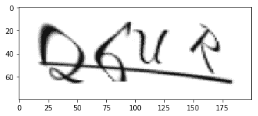
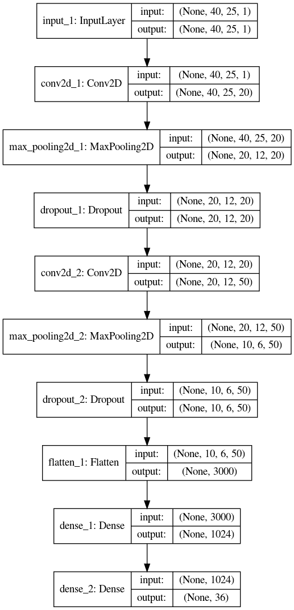
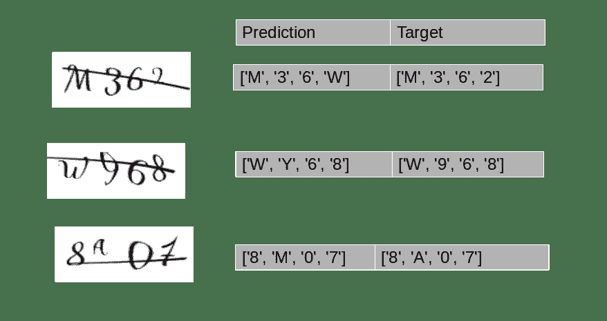
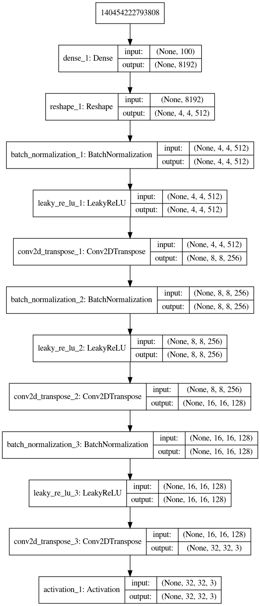
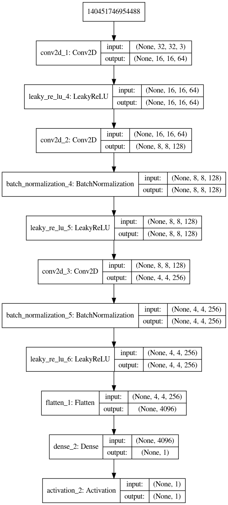
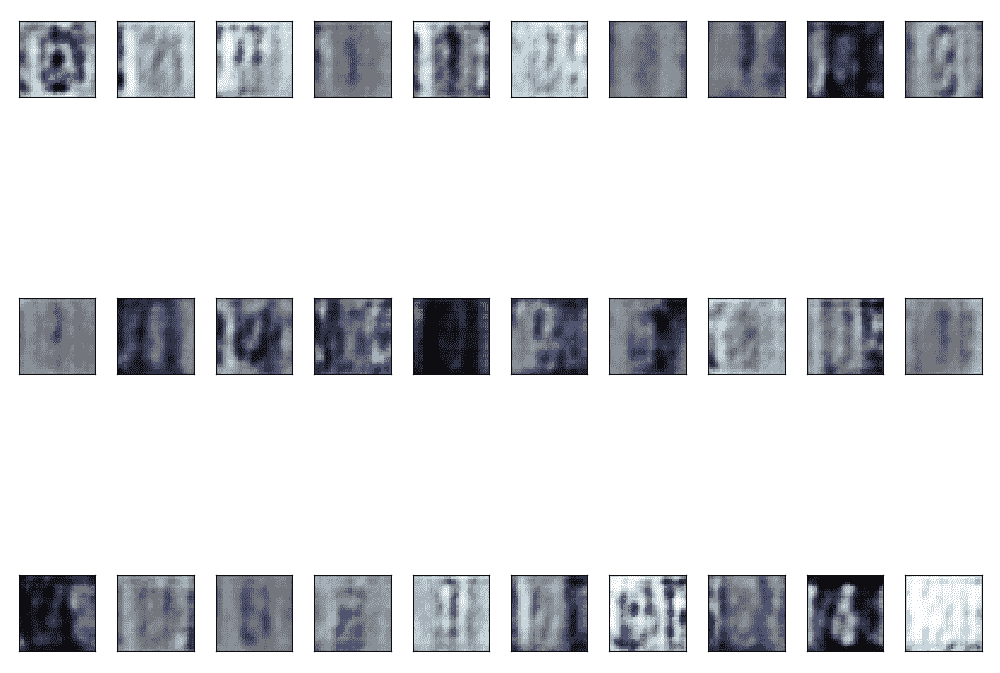
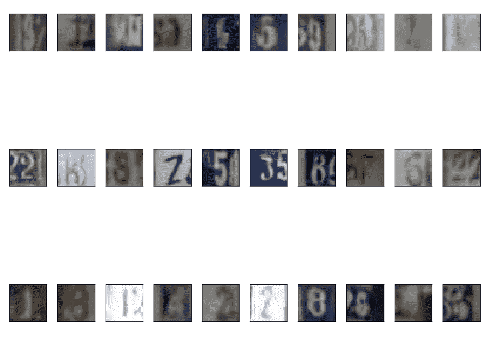
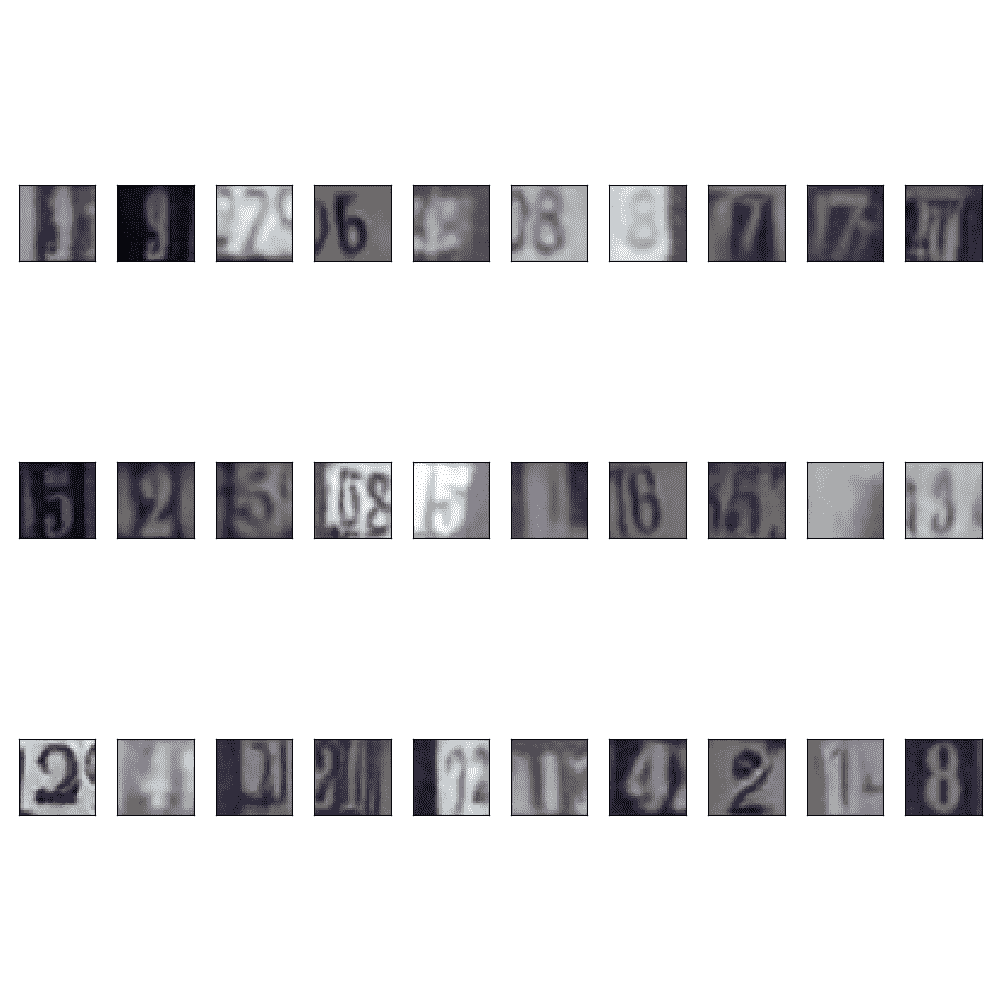
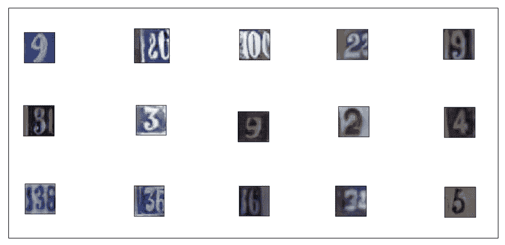

# 深度学习视角的验证码

术语 **CAPTCHA** 是**用于区分计算机和人类的完全自动化的公共图灵测试**的缩写。 这是一种旨在区分人类用户与机器或机器人的计算机程序，通常是一种安全措施，可防止垃圾邮件和数据滥用。 早在 1997 年就引入了 CAPTCHA 的概念，当时互联网搜索公司 AltaVista 试图阻止向该平台歪曲其搜索引擎算法的自动 URL 提交。 为了解决这个问题，AltaVista 的首席科学家安德烈·布罗德（Andrei Broder）提出了一种算法，该算法可以随机生成文本图像，这些图像很容易被人识别，但不能被机器人识别。 后来，在 2003 年，Luis von Ahn，Manuel Blum，Nicholas J Hopper 和 John Langford 完善了这项技术，并将其称为 CAPTCHA。 验证码最常见的形式要求用户识别变形图像中的字母和数字。 进行此测试是为了希望人类能够轻松地区分变形图像中的字符，而自动化程序或漫游器将无法区分它们。 验证码测试有时称为反向图灵测试，因为它是由计算机而非人工执行的。

截至最近，CAPTCHA 已开始发挥更大的作用，而不仅仅是防止机器人欺诈。 例如，当 Google 数字化《纽约时报》的档案和 Google 图书中的某些图书时，他们使用了 CAPTCHA 及其变体之一 reCAPTCHA。 通常，通过要求用户正确输入多个验证码的字符来完成此操作。 实际上只有 CAPTCHA 之一被标记并用于验证用户是否为人类。

其余的验证码由用户标记。 目前，Google 使用基于图像的 CAPTCHA 来帮助标记其自动驾驶汽车数据集，如以下屏幕截图所示：


图 10.1：各个网站上的一些常见验证码

在本章中，我们将介绍以下主题：

*   什么是 CAPTCHA
*   使用深度学习打破 CAPTCHA 暴露其脆弱性
*   使用对抗学习生成验证码

# 技术要求

您将需要具备 Python 3，TensorFlow，Keras 和 OpenCV 的基础知识。

[可以在 GitHub 上找到本章的代码文件](https://github.com/PacktPublishing/Intelligent-Projects-using-Python/tree/master/Chapter10)

[观看以下视频，查看运行中的代码](http://bit.ly/2SgwR6P)

# 通过深度学习破解验证码

随着**卷积神经网络**（**CNN**）在计算机视觉任务中的最新成功，在几分钟内打破基本的验证码是相对容易的任务。 因此，CAPTCHA 需要比过去有更多的发展。 在本章的第一部分中，我们将介绍使用具有深度学习框架的机器人自动检测到的基本验证码的漏洞。 我们将通过利用 GAN 创建更难以被机器人检测到的 CAPTCHA 进行跟进。

# 生成基本的验证码

可以使用 Python 中的`Claptcha`包生成验证码。 我们使用它来生成由数字和文本组成的四个字符的验证码图像。 因此，每个字符可以是`26`字母和`10`数字中的任何一个。 以下代码可用于生成具有随机选择的字母和数字的验证码：

```py
alphabets = 'abcdefghijklmnopqrstuvwxyz'
alphabets = alphabets.upper()
font = "/home/santanu/Android/Sdk/platforms/android-28/data/fonts/DancingScript-Regular.ttf"
# For each of the 4 characters determine randomly whether its a digit or alphabet
char_num_ind = list(np.random.randint(0,2,4))
text = ''
for ind in char_num_ind:
    if ind == 1:
    # for indicator 1 select character else number 
        loc = np.random.randint(0,26,1)
        text = text + alphabets[np.random.randint(0,26,1)[0]]

    else:
        text = text + str(np.random.randint(0,10,1)[0])

c = Claptcha(text,font)
text,image = c.image
plt.imshow(image)

```

以下屏幕截图（“图 10.2”）是上述代码生成的随机验证码：



图 10.2：字符为 26UR 的随机验证码

与文本一起，`Claptcha`工具要求使用打印字体作为输入的字体。 如我们所见，它以横轴上有些扭曲的线的形式给图像增加了噪点。

# 生成数据来训练 CAPTCHA 破解器

在本节中，我们将使用`Claptcha`工具生成多个验证码，以训练 CNN 模型。 CNN 模型将通过监督训练来学习识别 CAPTCHA 中的字符。 我们将生成用于训练 CNN 模型的训练和验证集。 除此之外，我们将生成一个单独的测试集，以评估其概括未见数据的能力。 可以对`CaptchaGenerator.py`脚本进行如下编码以生成验证码数据：

```py
from claptcha import Claptcha
import os
import numpy as np
import cv2
import fire 
from elapsedtimer import ElasedTimer

def generate_captcha(outdir,font,num_captchas=20000):
    alphabets = 'abcdefghijklmnopqrstuvwxyz'
    alphabets = alphabets.upper()
    try:
        os.mkdir(outdir)
    except:
        'Directory already present,writing captchas to the same'
    #rint(char_num_ind)
    # select one alphabet if indicator 1 else number 
    for i in range(num_captchas):
        char_num_ind = list(np.random.randint(0,2,4))
        text = ''
        for ind in char_num_ind:
            if ind == 1:
                loc = np.random.randint(0,26,1)
                text = text + alphabets[np.random.randint(0,26,1)[0]]
            else:
                text = text + str(np.random.randint(0,10,1)[0])
        c = Claptcha(text,font)
        text,image = c.image
        image.save(outdir + text + '.png')

def main_process(outdir_train,num_captchas_train,
                 outdir_val,num_captchas_val,
                 outdir_test,num_captchas_test,
                font):

    generate_captcha(outdir_train,font,num_captchas_train)
    generate_captcha(outdir_val,font,num_captchas_val)
    generate_captcha(outdir_test,font,num_captchas_test)

if __name__ == '__main__':
    with ElasedTimer('main_process'):
        fire.Fire(main_process)
```

需要注意的一件事是，大多数 CAPTCHA 生成器都使用`ttf`文件来获取 CAPTCHA 的字体模式。

我们可以通过使用`CaptchaGenerator.py`脚本来生成大小为`16000`，`4000`和`4000`的训练集，验证和测试集：

```py
python CaptchaGenerator.py --outdir_train '/home/santanu/Downloads/Captcha Generation/captcha_train/' --num_captchas_train 16000 --outdir_val '/home/santanu/Downloads/Captcha Generation/captcha_val/' --num_captchas_val 4000 
--outdir_test '/home/santanu/Downloads/Captcha Generation/captcha_test/' --num_captchas_test 4000 --font "/home/santanu/Android/Sdk/platforms/android-28/data/fonts/DancingScript-Regular.ttf"
```

脚本使用了`3.328 mins`来生成`16000`训练 CAPTCHA，`4000`验证 CAPTCHA 和`4000`测试 CAPTCHA，如我们从脚本的以下日志中所见：

```py
3.328 min: main_process
```

在下一节中，我们将讨论 CAPTCHA 破解器的卷积神经网络架构。

# 验证码破解器 CNN 架构

我们将使用 CNN 架构来识别 CAPTCHA 中的字符。 CNN 在密集层之前将具有两对卷积和池化。 我们将把验证码分为四个字符，然后将它们分别输入模型，而不是将整个验证码输入网络。 这要求 CNN 的最终输出层预测与`26`字母和`10`数字有关的`36`类之一。

可以通过函数`_model_`如以下代码所示定义模型：

```py
def _model_(n_classes):
    # Build the neural network
    input_ = Input(shape=(40,25,1)) 

    # First convolutional layer with max pooling
    x = Conv2D(20, (5, 5), padding="same",activation="relu")(input_)
    x = MaxPooling2D(pool_size=(2, 2), strides=(2, 2))(x)
    x = Dropout(0.2)(x)
    # Second convolutional layer with max pooling
    x = Conv2D(50, (5, 5), padding="same", activation="relu")(x)
    x = MaxPooling2D(pool_size=(2, 2), strides=(2, 2))(x)
    x = Dropout(0.2)(x)
    # Hidden layer with 1024 nodes
    x = Flatten()(x)
    x = Dense(1024, activation="relu")(x)
    # Output layer with 36 nodes (one for each possible alphabet/digit we predict)
    out = Dense(n_classes,activation='softmax')(x)
    model = Model(inputs=[input_],outputs=out)

    model.compile(loss="sparse_categorical_crossentropy", optimizer="adam", metrics=
    ["accuracy"])
    return model 

```

可以如下图所示图示 CAPTCHA 破解器 CNN 模型（“图 10.3”）：



图 10.3：CAPTCHA 破解器 CNN 架构

# 预处理 CAPTCHA 图像

图像的原始像素无法与 CNN 架构配合使用。 标准化图像以使 CNN 更快收敛始终是一个好主意。 通常用作规范化方案的两种方法是平均像素减法或通过将像素值除以`255`将像素缩放到`[0,1]`范围内。 对于我们的 CNN 网络，我们将图像标准化为`[0,1]`。 我们还将处理 CAPTCHA 的灰度图像，这意味着我们将只处理一个颜色通道。 `load_img`函数可用于加载和预处理 CAPTCHA 图像，如以下代码所示：

```py
def load_img(path,dim=(100,40)):
    img = cv2.imread(path,cv2.IMREAD_GRAYSCALE)
    img = cv2.resize(img,dim)
    img = img.reshape((dim[1],dim[0],1))
    #print(img.shape)
    return img/255.
```

# 将验证码字符转换为类

为了训练目的，需要将 CAPTCHA 的原始字符转换为数字类。 `create_dict_char_to_index`函数可用于将原始字符转换为类标签：

```py
def create_dict_char_to_index():
    chars = 'abcdefghijklmnopqrstuvwxyz0123456789'.upper()
    chars = list(chars)
    index = np.arange(len(chars))
    char_to_index_dict,index_to_char_dict = {},{}
    for v,k in zip(index,chars):
        char_to_index_dict[k] = v 
        index_to_char_dict[v] = k 

    return char_to_index_dict,index_to_char_dict
```

# 数据产生器

动态生成一批训练和验证数据对于有效训练 CNN 至关重要。 在训练开始之前将所有数据加载到内存中可能会导致数据存储问题，因此在训练期间读取 CAPTCHA 并动态构建批量是有意义的。 这导致资源的最佳利用。

我们将使用一个可用于构建训练和验证批量的数据生成器。 生成器将在初始化期间存储 CAPTCHA 文件的位置，并在每个周期动态构建批量。 在每个文件之后，文件的顺序会随机打乱，以免在每个周期中都不能以相同的顺序遍历验证码图像。 这通常可以确保模型在训练期间不会卡在不良的局部最小值上。 数据生成器类可以如下编码：

```py
class DataGenerator(keras.utils.Sequence):
    'Generates data for Keras'
    def __init__(self,dest,char_to_index_dict,batch_size=32,n_classes=36,dim=(40,100,1),shuffle=True):
        'Initialization'
        self.dest = dest
        self.files = os.listdir(self.dest)
        self.char_to_index_dict = char_to_index_dict
        self.batch_size = batch_size
        self.n_classes = n_classes
        self.dim = (40,100)
        self.shuffle = shuffle
        self.on_epoch_end()

    def __len__(self):
        'Denotes the number of batches per epoch'
        return int(np.floor(len(self.files) / self.batch_size))

    def __getitem__(self, index):
        'Generate one batch of data'
        # Generate indexes of the batch
        indexes = self.indexes[index*self.batch_size:(index+1)*self.batch_size]

        # Find list of files to be processed in the batch
        list_files = [self.files[k] for k in indexes]

        # Generate data
        X, y = self.__data_generation(list_files)

        return X, y

    def on_epoch_end(self):
        'Updates indexes after each epoch'
        self.indexes = np.arange(len(self.files))
        if self.shuffle == True:
            np.random.shuffle(self.indexes)

    def __data_generation(self,list_files):
        'Generates data containing batch_size samples' # X : 
         (n_samples, *dim, n_channels)
        # Initialization
        dim_h = dim[0]
        dim_w = dim[1]//4
        channels = dim[2]
        X = np.empty((4*len(list_files),dim_h,dim_w,channels))
        y = np.empty((4*len(list_files)),dtype=int)
       # print(X.shape,y.shape)

        # Generate data
        k = -1
        for f in list_files:
            target = list(f.split('.')[0])
            target = [self.char_to_index_dict[c] for c in target]
            img = load_img(self.dest + f)
            img_h,img_w = img.shape[0],img.shape[1]
            crop_w = img.shape[1]//4
            for i in range(4):
                img_crop = img[:,i*crop_w:(i+1)*crop_w]
                k+=1
                X[k,] = img_crop
                y[k] = int(target[i])

        return X,y
```

# 训练 CAPTCHA 破解器

可以通过调用`train`函数来训练 CAPTCHA 破解器模型，如下所示：

```py
def train(dest_train,dest_val,outdir,batch_size,n_classes,dim,shuffle,epochs,lr):
    char_to_index_dict,index_to_char_dict = create_dict_char_to_index()
    model = _model_(n_classes)
    train_generator =  DataGenerator(dest_train,char_to_index_dict,batch_size,n_classes,dim,shuffle)
    val_generator =  DataGenerator(dest_val,char_to_index_dict,batch_size,n_classes,dim,shuffle)
    model.fit_generator(train_generator,epochs=epochs,validation_data=val_generator)
    model.save(outdir + 'captcha_breaker.h5')
```

对于批量中的 CAPTCHA，将考虑所有四个字符进行训练。 我们使用`DataGenerator`类定义`train_generator`和`val_generator`对象。 这些数据生成器动态地提供了用于训练和验证的批量。

可以通过使用`train`参数运行`captcha_solver.py`脚本来调用训练，如下所示：

```py
python captcha_solver.py train --dest_train '/home/santanu/Downloads/Captcha Generation/captcha_train/' --dest_val '/home/santanu/Downloads/Captcha Generation/captcha_val/' --outdir '/home/santanu/ML_DS_Catalog-/captcha/model/' --batch_size 16 --lr 1e-3 --epochs 20 --n_classes 36 --shuffle True --dim '(40,100,1)'

```

在仅`20`个训练周期内，该模型就可以使 CAPTCHA 的每个字符级别的验证准确率达到 98.3%，如以下输出日志所示：

```py
Epoch 17/20
1954/1954 [==============================] - 14s 7ms/step - loss: 0.0340 - acc: 0.9896 - val_loss: 0.0781 - val_acc: 0.9835
Epoch 18/20
1954/1954 [==============================] - 13s 7ms/step - loss: 0.0310 - acc: 0.9904 - val_loss: 0.0679 - val_acc: 0.9851
Epoch 19/20
1954/1954 [==============================] - 13s 7ms/step - loss: 0.0315 - acc: 0.9904 - val_loss: 0.0813 - val_acc: 0.9822
Epoch 20/20
1954/1954 [==============================] - 13s 7ms/step - loss: 0.0297 - acc: 0.9910 - val_loss: 0.0824 - val_acc: 0.9832
4.412 min: captcha_solver
```

使用 GeForce GTX 1070 GPU，大约`16000` 98.3s（即`64000` CAPTCHA 字符）的`20`周期的训练时间约为`4.412 min`。 建议读者使用基于 GPU 的机器进行更快的训练。

# 测试数据集的准确率

可以通过调用`evaluate`函数来运行测试数据的推断。 `evaluate`函数如下所示，以供参考。 请注意，评估程序的设计应从整体验证码的角度看待准确率，而不是在验证码的字符级别上。 因此，只有当 CAPTCHA 目标的所有四个字符都与预测匹配时，我们才能将 CAPTCHA 标记为被 CNN 正确识别。

用于在测试验证码上运行推理的`evaluate`函数可以编码如下：

```py
def evaluate(model_path,eval_dest,outdir,fetch_target=True):
    char_to_index_dict,index_to_char_dict = create_dict_char_to_index()
    files = os.listdir(eval_dest)
    model = keras.models.load_model(model_path)
    predictions,targets = [],[]

    for f in files:
        if fetch_target == True:
            target = list(f.split('.')[0])
            targets.append(target)

        pred = []
        img = load_img(eval_dest + f)
        img_h,img_w = img.shape[0],img.shape[1]
        crop_w = img.shape[1]//4
        for i in range(4):
            img_crop = img[:,i*crop_w:(i+1)*crop_w]
            img_crop = img_crop[np.newaxis,:]
            pred_index  = np.argmax(model.predict(img_crop),axis=1)
            #print(pred_index)
            pred_char   = index_to_char_dict[pred_index[0]]
            pred.append(pred_char)
        predictions.append(pred)

    df = pd.DataFrame()
    df['files'] = files
    df['predictions'] = predictions

    if fetch_target == True:
        match = []

        df['targets'] = targets

        accuracy_count = 0 
        for i in range(len(files)):
            if targets[i] == predictions[i]:
                accuracy_count+= 1
                match.append(1)
            else:
                match.append(0)
        print(f'Accuracy: {accuracy_count/float(len(files))} ')

        eval_file = outdir + 'evaluation.csv'
        df['match'] = match
        df.to_csv(eval_file,index=False)
        print(f'Evaluation file written at: {eval_file} ')
```

可以运行以下命令来调用`captcha_solver.py`脚本的`evaluate`函数进行推断：

```py
python captcha_solver.py evaluate  --model_path  /home/santanu/ML_DS_Catalog-/captcha/model/captcha_breaker.h5 --eval_dest '/home/santanu/Downloads/Captcha Generation/captcha_test/' --outdir /home/santanu/ML_DS_Catalog-/captcha/ --fetch_target True 
```

在`4000` CAPTCHA 的测试数据集上实现的准确率约为 93%。 运行`evaluate`函数的输出如下：

```py
Accuracy: 0.9320972187421699 
Evaluation file written at: /home/santanu/ML_DS_Catalog-/captcha/evaluation.csv 
13.564 s: captcha_solver
```

我们还可以看到，对那些`4000` CAPTCHA 的推断花费了大约 14 秒，并且评估的输出写入了`/home/santanu/ML_DS_Catalog-/captcha/evaluation.csv`文件中。

在下面的屏幕快照中，我们将查看一些模型做得不好的目标和预测（“图 10.4”）：



图 10.4：CAPTCHA 求解器模型失败的 CAPTCHA

# 通过对抗学习生成验证码

在本节中，我们将通过生成的对抗网络来创建验证码。 我们将生成类似于**街景门牌号码**数据集（**SVHN** 数据集）中的图像。 想法是将这些 GAN 生成的图像用作验证码。 仅当我们训练 GAN 时，它们才容易从噪声分布中采样。 这将减轻通过更复杂的方法创建验证码的需要。 它也将为验证码中使用的 SVHN 街道号提供一些变化。

SVHN 是一个现实世界的数据集，由于它在对象识别算法中的使用而在机器学习和深度学习领域中非常受欢迎。 顾名思义，该数据集包含从 Google Street View Images 获得的门牌号码的真实图像。 [可以从以下链接下载数据集](http://ufldl.stanford.edu/housenumbers/)。

我们将使用调整后的门牌号数据集，其中图像已调整为大小`(32,32)`。 我们感兴趣的数据集是`train_32x32.mat`。

通过这个**生成对抗网络**（**GAN**），我们将根据随机噪声生成房屋编号图像，并且生成的图像将与 SVHN 数据集中的图像非常相似。

回顾一下，在 GAN 中，我们有一个生成器（`G`）和一个判别器（`D`），它们针对损失函数彼此玩零和极小极大游戏。 随着时间的流逝，生成器和判别器的工作都会越来越好，直到我们到达一个固定点为止，两者都无法进一步改善。 该固定点是相对于损失函数的鞍点。 对于我们的应用，生成器`G`会将给定分布`P(z)`的噪声`z`转换​​为门牌号图像`x`，以使`x = G(z)`。

生成的图像通过判别器`D`传递，判别器`D`尝试检测此生成的图像`x`为伪造，并从 SVHN 数据集中检测真实的门牌号码图像为真实。 同时，生成器将尝试创建图像`x = G(z)`，以使判别器发现图像是真实的。 如果我们将真实图像标记为`1`，而将生成器生成的伪图像标记为`0`，则判别器将尝试在给定两个类别的分类器网络中最小化二进制交叉熵损失。 鉴别符`D`所导致的损失可以写成如下：


在前面的表达式中`D(.)`是鉴别函数，其输出表示将图像标记为实数的可能性。`P[z](z)`表示随机变量噪声`z`的分布，而`P[X](x)`表示真实门牌号图像的分布。`G(.)`和`D(.)`分别表示生成器网络函数和判别器网络函数。 这些参数可以通过网络的权重进行参数化，而网络的权重是我们为表示法的混乱而方便地跳过的。 如果我们用`θ`表示生成器网络权重的参数，用`φ`表示判别器网络的权重，则判别器将学会使`(1)`相对于`φ`的损失最小化，而生成器将旨在使`(1)`与`θ`的损失相同。 我们可以将`(1)`中优化的损失称为效用函数，生成器和判别器都在参数方面进行了优化。 实用函数`U`可以根据生成器和判别器的参数来编写，如下所示：


从博弈论的角度来看，生成器`G`和判别器`D`相互之间具有效用函数`U(θ, φ)`的零和最小极大值游戏，并且最小极大值游戏的优化问题可以表示为：


在参数空间中的某个点上，如果某个函数相对于某些参数而言是局部最大值，而对于其余参数而言是局部最小值，则该点称为**鞍点**。 因此，`(θ_hat, φ_hat)`给出的点将成为效用函数`U(θ, φ)`的鞍点。 该鞍点是极小极大零和博弈的纳什均衡，对于生成器和判别器正在优化的效用，`(θ_hat, φ_hat)`参数是最佳的。 就当前问题而言，生成器`G`会产生最困难的验证码，供判别器以`θ_hat`作为其参数进行检测。 同样，判别器最适合以`φ`作为参数来检测伪造的验证码。

具有鞍点的最简单函数是`x^2 - y^2`，鞍点是原点：`(0,0)`。

# 优化 GAN 损失

在上一节中，我们已经看到，生成器和判别器相对于它们各自网络的参数的最佳状态由以下公式给出：


为了最大化目标函数，我们通常使用梯度上升，而为了最小化成本函数，我们使用梯度下降。 前面的优化问题可以分为两部分：生成器和判别器分别通过梯度上升和梯度下降依次优化效用函数。 在优化过程中的任何步骤`t`上，判别器都将通过使工具最小化来尝试移至新状态，如下所示：


替代地，生成器将尝试最大化相同的效用。 由于鉴别符`D`没有生成器的任何参数，因此工具的第二项不会影响生成器的优化。 可以这样表示：


我们已经将生成器和判别器优化目标都转换为最小化问题。 判别器和生成器的优化都是使用梯度下降进行的，直到我们达到目标函数的鞍点。

# 生成器网络

生成器网络将吸收随机噪声，并尝试输出类似于 SVHN 图像的图像作为输出。 随机噪声是`100`维输入向量。 每个维度都是遵循标准正态分布的随机变量，平均值为`0`，标准偏差为`1`。

最初的致密层具有`8192`单元，将其重塑为形状为`4 x 4 x 512`的三维张量。 使用`512`滤镜可以将张量视为`4 x 4`图像。 为了增加张量的空间大小，我们进行了一系列转置 2D 卷积，步幅为`2`，内核滤波器大小为`5 x5`。步幅大小决定了转置卷积的缩放比例。 例如，跨度为 2 的跨度将输入图像的每个空间大小加倍，然后进行转置卷积，通常会进行批归一化，以实现更好的收敛性。 除了激活层，网络使用`LeakyReLU`作为激活函数。 网络的最终输出是大小为`32 x 32 x 3`的图像。

在最后一层中使用`tanh`激活，以便对`[-1,1]`范围内的图像像素值进行标准化。

生成器可以按如下所示进行编码：

```py
def generator(input_dim,alpha=0.2):
    model = Sequential()
    model.add(Dense(input_dim=input_dim, output_dim=4`4`512))
    model.add(Reshape(target_shape=(4,4,512)))
    model.add(BatchNormalization())
    model.add(LeakyReLU(alpha))
    model.add(Conv2DTranspose(256, kernel_size=5, strides=2,
                              padding='same'))
    model.add(BatchNormalization())
    model.add(LeakyReLU(alpha))
    model.add(Conv2DTranspose(128, kernel_size=5, strides=2, 
                              padding='same')) 
    model.add(BatchNormalization())
    model.add(LeakyReLU(alpha))
    model.add(Conv2DTranspose(3, kernel_size=5, strides=2,
                              padding='same')) 
    model.add(Activation('tanh'))
    return model

```

下图（“图 10.5”）中描述了生成器的网络架构，以供参考：



图 10.5：生成器组网络图

# 判别器网络

判别器将是一个经典的二元分类卷积神经网络，可以将生成器图像分类为伪图像，将实际 SVHN 数据集图像分类为真实图像。

判别器网络可以编码如下：

```py
def discriminator(img_dim,alpha=0.2):
    model = Sequential()
    model.add(
            Conv2D(64, kernel_size=5,strides=2,
            padding='same',
            input_shape=img_dim)
            )
    model.add(LeakyReLU(alpha))
    model.add(Conv2D(128,kernel_size=5,strides=2,padding='same'))
    model.add(BatchNormalization())
    model.add(LeakyReLU(alpha))
    model.add(Conv2D(256,kernel_size=5,strides=2,padding='same'))
    model.add(BatchNormalization())
    model.add(LeakyReLU(alpha))
    model.add(Flatten())
    model.add(Dense(1))
    model.add(Activation('sigmoid'))
    return model
```

在上一个代码块中定义的判别器网络将伪造的生成器图像和真实的 SVHN 图像作为输入，并将它们传递到最终输出层之前的`3` 2D 卷积集。 在该网络中的卷积之后没有合并，而是通过批量规范化和`LeakyReLU`激活。

下图显示了判别器的网络架构（“图 10.6”）：



图 10.6：判别器网络图

判别器的输出激活函数为 Sigmoid。 这有助于对来自真实 SVHN 图像的伪生成图像进行二分类。

# 训练 GAN

为生成对抗网络建立训练流程并非一帆风顺，因为这需要很多技术方面的考虑。 我们定义了以下三个训练网络：

*   带有参数`θ`的生成器网络`g`
*   带有参数`φ`的判别器网络`d`
*   权重为`θ`和`φ`的以`g_d`表示的组合生成器判别器网络

生成器`g`创建`d`判别器将评估的伪造图像，并尝试将其标记为伪造。

在`g_d`网络中，`g`生成器创建伪造的图像，然后尝试欺骗`d`判别器，使其相信它们是真实的。 判别器网络使用二进制交叉熵损失进行编译，并且针对判别器参数`φ`优化了损失，而`g_d`网络则针对`g`生成器的参数`θ`进行了编译，以便欺骗判别器。 因此，`g_d`网络损失是与判别器将所有伪造图像标记为真实图像有关的二进制交叉熵损失。 在每个小型批量中，基于与`g_d`和`d`网络相关的损失的优化来更新生成器和判别器权重：

```py
def train(dest_train,outdir,
        gen_input_dim,gen_lr,gen_beta1,
        dis_input_dim,dis_lr,dis_beta1,
        epochs,batch_size,alpha=0.2,smooth_coef=0.1):

    #X_train,X_test = read_data(dest_train),read_data(dest_test)
    train_data = loadmat(dest_train + 'train_32x32.mat')
    X_train, y_train = train_data['X'], train_data['y']
    X_train = np.rollaxis(X_train, 3) 
    print(X_train.shape)
    #Image pixels are normalized between -1 to +1 so that one can use the tanh activation function
    #_train = (X_train.astype(np.float32) - 127.5)/127.5
    X_train = (X_train/255)*2-1
    g = generator(gen_input_dim,alpha)
    plot_model(g,show_shapes=True, to_file='generator_model.png')
    d = discriminator(dis_input_dim,alpha)
    d_optim = Adam(lr=dis_lr,beta_1=dis_beta1)
    d.compile(loss='binary_crossentropy',optimizer=d_optim)
    plot_model(d,show_shapes=True, to_file='discriminator_model.png')
    g_d = generator_discriminator(g, d)
    g_optim = Adam(lr=gen_lr,beta_1=gen_beta1)
    g_d.compile(loss='binary_crossentropy', optimizer=g_optim)
    plot_model(g_d,show_shapes=True, to_file=
    'generator_discriminator_model.png')
    for epoch in range(epochs):
        print("Epoch is", epoch)
        print("Number of batches", int(X_train.shape[0]/batch_size))
        for index in range(int(X_train.shape[0]/batch_size)):
            noise = 
            np.random.normal(loc=0, scale=1, size=(batch_size,gen_input_dim))
            image_batch = X_train[index*batch_size:(index+1)*batch_size,:]
            generated_images = g.predict(noise, verbose=0)
            if index % 20 == 0:
                combine_images(generated_images,outdir,epoch,index)
                # Images converted back to be within 0 to 255 

            print(image_batch.shape,generated_images.shape)
            X = np.concatenate((image_batch, generated_images))
            d1 = d.train_on_batch(image_batch,[1 - smooth_coef]*batch_size)
            d2 = d.train_on_batch(generated_images,[0]*batch_size)

            y = [1] * batch_size + [0] * batch_size
            # Train the Discriminator on both real and fake images 
            make_trainable(d,True)
            #_loss = d.train_on_batch(X, y)
            d_loss = d1 + d2

            print("batch %d d_loss : %f" % (index, d_loss))
            noise = 
            np.random.normal(loc=0, scale=1, size=(batch_size,gen_input_dim))
            make_trainable(d,False)
            #d.trainable = False
            # Train the generator on fake images from Noise 
            g_loss = g_d.train_on_batch(noise, [1] * batch_size)
            print("batch %d g_loss : %f" % (index, g_loss))
            if index % 10 == 9:
                g.save_weights('generator', True)
                d.save_weights('discriminator', True)
```

`Adam`优化器用于两个网络的优化。 要注意的一件事是，仅需要对网络`g_d`进行编译，以仅针对生成器`G`的参数来优化损失。 因此，我们需要禁用网络`g_d`中判别器`D`的参数训练。

我们可以使用以下函数来禁用或启用对网络参数的学习：

```py
def make_trainable(model, trainable):
    for layer in model.layers:
        layer.trainable = trainable
```

我们可以通过将可训练变量设置为`False`来禁用参数的学习，而如果要启用这些参数的训练，则需要将其设置为`True`。

# 噪音分布

输入到 GAN 的噪声需要遵循特定的概率分布。 通常使用均匀分布`U[-1,1]`或标准正态分布，即均值`0`和标准偏差`1`的正态分布对噪声向量的每个维度进行采样。 从经验上可以看出，从标准正态分布中采样噪声似乎比从均匀分布中采样噪声更好。 在此实现中，我们将使用标准正态分布来采样随机噪声。

# 数据预处理

如前所述，我们将使用大小为`32 x 32 x 3`的 SVHN 数据集图像。

数据集图像易于以矩阵数据形式获得。 图像的原始像素在`[-1,1]`范围内进行归一化，以实现更快，更稳定的收敛。 由于这种转换，生成器的最终激活保持在`tanh`，以确保生成的图像的像素值在`[-1,1]`之内。

`read_data`可用于处理输入数据。 `dir_flag`用于确定我们是否具有原始处理的数据矩阵文件或图像目录。 例如，当我们使用 SVHN 数据集时，`dir_flag`应该设置为`False`，因为我们已经有一个名为`train_32x32.mat`的预处理数据矩阵文件。

但是，最好保持`read_data`函数的通用性，因为这使我们可以将脚本重用于其他数据集。 `scipy.io`中的`loadmat`函数可用于读取`train_32x32.mat`。

如果输入是放置在目录中的原始图像，那么我们可以读取目录中可用的图像文件并通过`opencv`读取它们。 `load_img`函数可用于使用`opencv`读取原始图像。

最后，为了更好地融合网络，将像素强度归一化为`[-1,1]`范围：

```py
def load_img(path,dim=(32,32)):

    img = cv2.imread(path)
    img = cv2.resize(img,dim)
    img = img.reshape((dim[1],dim[0],3))
    return img

def read_data(dest,dir_flag=False):

 if dir_flag == True:
 files = os.listdir(dest)
 X = []
 for f in files:
 img = load_img(dest + f)
 X.append(img)
 return X
 else:
 train_data = loadmat(path)
 X,y = train_data['X'], train_data['y']
 X = np.rollaxis(X,3) 
 X = (X/255)*2-1
 return X
```

# 调用训练

可以通过使用以下参数运行`captcha_gan.py`脚本的`train`函数来调用 GAN 的训练：

```py
python captcha_gan.py train --dest_train '/home/santanu/Downloads/train_32x32.mat' --outdir '/home/santanu/ML_DS_Catalog-/captcha/SVHN/' --dir_flag False --batch_size 100 --gen_input_dim 100 --gen_beta1 0.5 --gen_lr 0.0001 --dis_input_dim '(32,32,3)' --dis_lr 0.001 --dis_beta1 0.5 --alpha 0.2 --epochs 100 --smooth_coef 0.1
```

前面的脚本使用`fire` Python 包来调用用户指定的函数，本例中为`train`。 关于`fire`的好处是，函数的所有输入都可以由用户作为参数提供，正如我们从上一条命令中看到的那样。

众所周知，GAN 很难训练，因此需要调整这些参数，以使模型正常运行。 以下是一些重要参数：

| **参数** | **值** | **注释** |
| --- | --- | --- |
| `batch_size` | `100` | 小型批量随机梯度下降的批量大小。 |
| `gen_input_dim` | `100` | 输入随机噪声向量维。 |
| `gen_lr` | `0.0001` | 生成器学习率。 |
| `gen_beta1` | `0.5` | `beta_1`是生成器的 Adam 优化器的参数。 |
| `dis_input_dim` | `(32,32,3)` | 辨别真假房屋号码图像的形状。 |
| `dis_lr` | `0.001` | 判别器网络的学习率。 |
| `dis_beta1` | `0.5` | `beta_1`是用于判别器的 Adam 优化器的参数。 |
| `alpha` | `0.2` | 这是`LeakyReLU`激活的泄漏因子。 当`activation`函数的输入为负时，这有助于提供一个梯度（此处为`0.2`）。 它有助于解决垂死的`ReLU`问题。 如果输入小于或等于`0`，则 ReLU 函数的输出相对于其输入的梯度为`0`。 来自较后层的反向传播误差被此`0`乘以，尽管与该`ReLU.` ReLU 相关的神经元死亡，但没有误差传递至较早层。ReLU 已死亡，许多此类死亡`ReLUs`会影响训练 。 `LeakyReLU`通过甚至为负输入值提供小的梯度来克服了这个问题，从而确保训练不会由于缺乏梯度而停止。 |
| `epochs` | `100` | 这是要运行的周期数。 |
| `smooth_coef` | `0.1` | 设计该平滑系数的目的是减少真实样本对判别器的损失。 例如，`0.1`的`smooth_coef`可以将归因于真实图像的损失减少到原始损失的 90%。 这有助于 GAN 更好地融合。 |

使用 GeForce GTX 1070 GPU，用这些参数训练 GAN 大约需要 3.12 小时。 建议读者使用 GPU 进行更快的训练。

# 训练期间的验证码的质量

现在，让我们研究训练期间各个周期生成的验证码的质量。 以下是历时`5`（请参阅“图 10.7a”），历时`51`（请参阅“图 10.7b”）和历时`100`之后的 CAPTCHA 图像。 “图 10.7c”）。 我们可以看到，随着训练的进行，CAPTCHA 图像的质量有所提高。 以下屏幕快照显示了在第 5 阶段生成的示例验证码的结果：



图 10.7a：在第 5 阶段生成的示例验证码

以下屏幕截图显示了在周期 51 生成的示例验证码的结果：



图 10.7b：在周期 51 生成的样本验证码

以下屏幕截图显示了在周期 100 生成的示例验证码的结果：



图 10.7c：在周期 100 生成的示例验证码

# 使用训练好的生成器来创建验证码供使用

可以在运行时加载经过训练的 GAN 网络，以生成街景房屋编号（例如 CAPTCHA）以供使用。 `generate_captcha`函数可用于生成供使用的验证码，如下所示：

```py
def generate_captcha(gen_input_dim,alpha,
             num_images,model_dir,outdir):

    g = generator(gen_input_dim,alpha)
    g.load_weights(model_dir + 'generator')
    noise = 
    np.random.normal(loc=0, scale=1, size=(num_images,gen_input_dim))
    generated_images = g.predict(noise, verbose=1)
    for i in range(num_images):
        img = generated_images[i,:]
        img = np.uint8(((img+1)/2)*255)
        img = Image.fromarray(img)
        img.save(outdir + 'captcha_' + str(i) + '.png') 

```

您可能想知道如何为这些生成的验证码添加标签，因为需要使用验证码来验证用户是人类还是机器人。 这个想法非常简单：将未标记的验证码与一些标记的验证码一起发送，以便用户不知道将要评估哪个 CAPTCHA。 一旦有足够的标签用于生成的验证码，则将多数标签作为实际标签，并从此用于评估。

可以通过调用以下命令从`captcha_gan.py`脚本中调用`generate_captcha`函数：

```py
python captcha_gan.py generate-captcha --gen_input_dim 100 --num_images 200 --model_dir '/home/santanu/ML_DS_Catalog-/captcha/' --outdir '/home/santanu/ML_DS_Catalog-/captcha/captcha_for_use/' --alpha 0.2
```

以下屏幕截图（“图 10.8”）描述了通过调用`generate_captcha`函数生成的一些验证码。 我们可以看到图像足够不错，可以用作验证码：



图 10.8：使用经过训练的 GAN 网络的生成器生成的验证码

# 总结

这样，我们到了本章的结尾。 与本章相关的所有代码都可以[在 GitHub 链接中找到](https://github.com/PacktPublishing/Intelligent-Projects-using-Python/tree/master/Chapter10)。 现在，您将对深度学习如何影响验证码有一个清晰的认识。 在频谱的一端，我们可以看到使用具有深度学习的 AI 应用的机器人如何轻松地解决 CAPTCHA。 但是，另一方面，我们看到了如何使用深度学习来利用给定的数据集并根据随机噪声创建新的验证码。 您可以在本章中扩展有关生成对抗网络的技术知识，以使用深度学习构建智能的验证码生成系统。 现在，我们到本书的结尾。 我希望通过九个基于人工智能的实用应用的旅程是一次充实的旅程。 祝一切顺利！