# 用于计算机视觉的云计算平台

云计算使用互联网从远程硬件普遍访问数据。 此类数据存储是使用云平台完成的。 对于计算机视觉，数据主要是图像，注释文件和结果模型。 云平台不仅存储数据，而且还执行培训，部署和分析。 云计算与边缘计算的不同之处在于，我们无需在基础设施上进行投资，而几乎 瞬时分析速度。

在本章中，您将学习如何在 **Google Cloud Platform**（**GCP**）， **Amazon Web Services**（**AWS）中打包应用程序以进行培训和部署**）和 **Microsoft Azure 云平台**。 您将学习如何准备数据，上传到云数据存储以及如何监视培训。 您还将学习如何将图像或图像矢量发送到云平台进行分析并获得 JSON 响应。 本章讨论单个应用程序以及如何在计算引擎上运行分布式 TensorFlow。 培训结束后，本章将讨论如何评估模型并将其集成到应用程序中以进行大规模操作。

本章分为以下几节：

*   在 GCP 中训练对象检测器
*   在 AWS SageMaker 云平台中训练对象检测器
*   在 Microsoft Azure 云平台中训练对象检测器
*   大规模培训和包装
*   基于云的视觉搜索背后的总体思路
*   分析各种云平台中的图像和搜索机制

# 在 GCP 中训练对象检测器

在前两章中，我们学习了如何设置 Google Colab 以使用 SSD，R-CNN 和 R-FCN 以及 Inception 和 MobileNet 作为骨干预训练网络来训练自定义对象检测器。 我们的网络用于检测汉堡和薯条。 在本节中，我们将学习如何使用 GCP 执行相同的任务。 您也可以在[这里](https://medium.com/tensorflow/training-and-serving-a-realtime-mobile-object-detector-in-30-minutes-with-cloud-tpus-b78971cf1193)。

我从上一篇文章开始，但是发现必须精简许多部分，并且需要添加其他详细信息才能使其在我的 Ubuntu PC 上运行。 以下小节提供了使用 GCP 训练目标探测器的分步过程。

请注意，本节涉及许多将本地终端连接到 GCP 的大步骤，有时信息流可能会造成混乱。建议您在本节开始之前仔细阅读本节结尾处提供的流程图。 在 AWS Sagemaker 云平台上训练对象检测器，以了解一般的信息流。

# 在 GCP 中创建项目

在本节中，将在 GCP 中创建一个项目。 一个项目包括账单，数据存储，API，身份验证和团队成员信息，以开始您的培训工作。 GCP 是 Google 的机器学习平台，用于存储，构建，训练和部署模型。 通过转到[这里](https://accounts.google.com/signin/v2/identifier?service=cloudconsole&passive=1209600&osid=1&continue=https%3A%2F%2Fconsole.cloud.google.com%2F%3Fref%3Dhttps%3A%2F%2Fwww.google.com%2F&followup=https%3A%2F%2Fconsole.cloud.google.com%2F%3Fref%3Dhttps%3A%2F%2Fwww.google.com%2F&flowName=GlifWebSignIn&flowEntry=ServiceLogin)登录到 GCP 控制台。

首先，使用您的 Gmail ID 和密码登录，您将看到以下控制台：

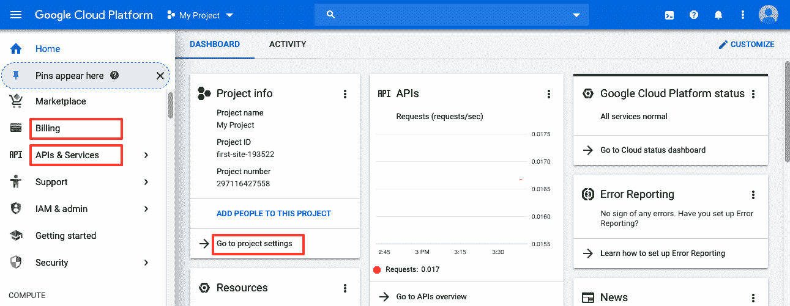

进入控制台后，请花一些时间来熟悉各种选项。 特别是，您必须填写有关帐单，API 和项目设置的信息。 以下小节概述了详细的说明。

# GCP 设置

转到[这里](https://console.cloud.google.com/home/dashboard?project=first-site-193522)设置 GCP 并使用您的 Gmail 帐户登录。 在上一节的屏幕快照中，有三个矩形框，它们是您需要设置的三个主要部分。 步骤概述如下：

1.  首先，单击“转到项目设置”，为项目命名，然后分配团队成员（如果要由多个人从事该项目）。
2.  然后，点击左侧的帐单并提供您的信用卡信息。 在撰写本文时，Google 提供了$ 300 的免费试用额度，但您仍需要提供信用卡信息。
3.  完成此操作后，单击“ API 和服务”，然后单击“启用 API 和服务”，然后在“机器学习”下选择“ AI 平台培训和预测 API”。

4.  单击启用，将启用 API。 以下屏幕截图显示了启用后的 AI Platform Training＆Prediction API：

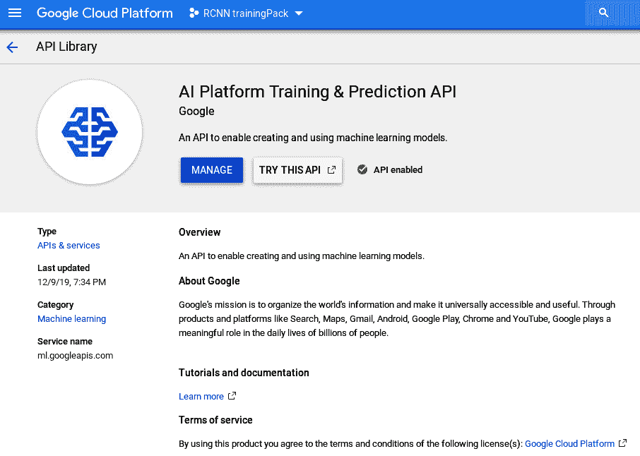

# Google Cloud Storage 存储桶设置

存储桶是保存数据的容器。 所有云服务提供商都有存储桶。 存储桶的格式与 PC 的目录结构相同。 存储桶可以包含图像（`.jpg`文件），批注，TFRecord，检查点文件和模型输出。 在本部分中，我们将学习如何安装 **Google Cloud Storage**（**GCS**）存储桶以存储训练和测试数据。

# 使用 GCP API 设置存储桶

要使用 GCP API 设置存储桶，请按照以下步骤操作：

1.  注册帐单后，向下滚动左侧菜单，单击“存储”，然后单击“创建桶”，并为其命名：

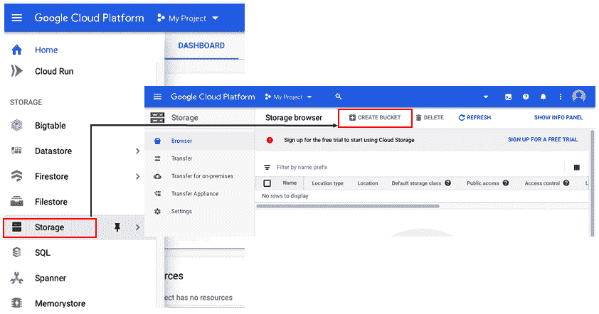

2.  创建存储桶后，下一个任务是在存储桶中创建一个名为`data`的文件夹，然后将文件上传到其中。 请看以下屏幕截图，了解如何执行此操作：

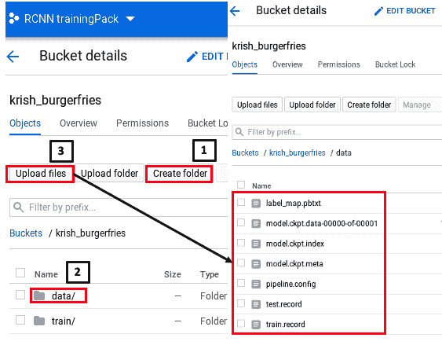

如前面的屏幕快照所示，首先创建一个名为`data`的文件夹。 然后，单击数据，单击上载文件，然后上载`test.record`，`train.record`，`label_map.pbtxt`，`pipeline.config`和`model.ckpt*`（三个文件）。 我们将在下一节中介绍如何获取这些文件。

# 使用 Ubuntu Terminal 设置存储桶

此过程涉及到设置 Google Cloud SDK，然后将 Google Cloud 项目和存储桶链接到您的终端，以便您可以在那里上传文件。 请记住，培训将由终端命令启动，因此，即使您使用前面的 API 进行了设置，您仍然需要执行以下部分中显示的步骤（从*开始设置 Google Cloud SDK* 部分）以将终端链接到 GCP。

# 设置 Google Cloud SDK

Google Cloud SDK 是一组命令行工具，使您的 PC 可以与 Google Cloud 进行交互。 由于在本节中，我们将使用 Ubuntu Terminal 与 Google Cloud 进行交互，因此我们需要首先设置 SDK。 在终端中输入以下命令：

```py
$ echo "deb [signed-by=/usr/share/keyrings/cloud.google.gpg] http://packages.cloud.google.com/apt cloud-sdk main" | sudo tee -a /etc/apt/sources.list.d/google-cloud-sdk.list
$ curl https://packages.cloud.google.com/apt/doc/apt-key.gpg | sudo apt-key --keyring /usr/share/keyrings/cloud.google.gpg add -
$ sudo apt-get update && sudo apt-get install google-cloud-sdk
$ gcloud init
```

在前面的代码的前三行中，我们获得了 SDK 列表，然后使用`apt-key`对程序包进行身份验证，然后安装 SDK。 在第四行中，我们将使用`gcloud.init`设置`gcloud`配置。

同样，如前所述，如果您在遵循本节时遇到任何困难，可以查看本节末尾提供的流程图，以了解一般的信息流。

接下来，我们将您的本地 PC 链接到 Google Cloud 项目。

# 将您的终端链接到 Google Cloud 项目和存储桶

在上一节的步骤中，我们设置了 Google Cloud SDK。 现在，我们需要执行最重要的步骤，这是将 Ubuntu Terminal 链接到 Google Cloud 项目以及您之前创建的存储桶。

为什么需要将 Ubuntu Terminal 链接到 Google Cloud 项目？ 答案是我们使用本地 PC 上的终端启动训练命令，但是我们的数据存储在 GCP 的存储桶中，并且模型将在 GCP 中生成。 因此，我们需要将 PC 终端连接到 GCP 以完成培训任务。

在终端中按顺序输入以下步骤：

1.  设置项目，在本例中为`rcnn-trainingpack`：

```py
$ gcloud config set project rcnn-trainingpack
```

2.  要打开存储桶，请输入`gsutil` Python 命令，如下所示：

```py
$ gsutil mb gs://krish_burgerfries
```

3.  接下来，我们设置环境变量以定义存储桶和文件所属的项目：

```py
$ export PROJECT="rcnn-trainingpack"
$ export YOUR_GCS_BUCKET="krish_burgerfries"
```

4.  通过输入以下命令来添加特定于 TPU 的服务帐户：

**张量处理单元**（**TPU**）是 Google 开发的一种 AI 加速器，用于快速处理大量数据以训练神经网络。

```py
$ curl -H "Authorization: Bearer $(gcloud auth print-access-token)"      
https://ml.googleapis.com/v1/projects/${PROJECT}:getConfig
```

前面的命令会将以下输出返回到“终端”窗口。 请注意，服务名称和项目名称将与您的应用程序不同：

```py
{"serviceAccount": "service-444444444444@cloud-ml.google.com.iam.gserviceaccount.com",
"serviceAccountProject": "111111111111",
 "config": {"tpuServiceAccount": "service-111111111111@cloud-tpu.iam.gserviceaccount.com" }}

{"serviceAccount": "service-444444444444@cloud-ml.google.com.iam.gserviceaccount.com",
"serviceAccountProject": "111111111111",
"config": {
"tpuServiceAccount": "service-111111111111@cloud-tpu.iam.gserviceaccount.com" }}
```

5.  通过键入整个`tpuServiceAccount`路径，将 TPU 帐户导出为环境变量，如下所示：

```py
$ export TPU_ACCOUNT="service-111111111111@cloud-tpu.iam.gserviceaccount.com"
```

6.  将`ml.serviceAgent`角色授予 TPU 帐户：

```py
$ gcloud projects add-iam-policy-binding $PROJECT      --member serviceAccount:$TPU_ACCOUNT --role roles/ml.serviceAgent
```

这将在 Terminal 中产生一系列注释，从`Updated IAM policy for the project [rcnn-trainingpack]`开始。

# 安装 TensorFlow 对象检测 API

现在我们已经将 Terminal 链接到存储桶和 Google Cloud 项目，下一步是将其链接到 TensorFlow 对象检测 API。 请遵循[这里](https://github.com/tensorflow/models/blob/master/research/object_detection/g3doc/installation.md)提供的一组说明。

前面的安装链接包含许多未在此处列出的代码行。 您将能够正确执行大多数代码。 此过程的最后两行代码描述如下：

```py
# From tensorflow/models/research/
export PYTHONPATH=$PYTHONPATH:'pwd':'pwd'/slim
python object_detection/builders/model_builder_test.py
```

该说明说，前面的步骤对于成功安装至关重要。 但是，如果您的 PC 上安装了 TensorFlow 2.0，则可能会出现以下错误：

```py
 AttributeError: module 'tensorflow' has no attribute 'contrib'
```

即使此错误已解决，也会导致另一个与 TensorFlow 2.0 与 TensorFlow 对象检测 API 不兼容有关的错误。 因此，我们将改为描述替代路径。 另一种选择是使用[这里](https://github.com/tensorflow/models/tree/v1.13.0)，类似于我们在第 10 章“使用 R-CNN，SSD 和 R-FCN 进行对象检测”，和第 11 章“在具有 CPU / GPU 优化功能的边缘设备上进行深度学习”中使用 TensorFlow 1.15 在 Google Colab 中运行它。

# 准备数据集

如*使用 GCP API* 部分设置存储桶中所述，我们需要填充以下`bucket: test.record`，`train.record`，`label_map.pbtxt`，`pipeline.config`和`model.ckpt*`（三个文件 ）。 在下面的小节中，我们将说明如何填充这些内容。

# TF 记录并标记地图数据

TFRecord 文件是高效的 TensorFlow 文件格式，用于以单一二进制格式存储图像和注释文件，以供 TensorFlow 模型超快速读取。 TFRecord 已在“第 10 章”，*使用 R-CNN，SSD 和 R-FCN* 的对象检测中引入。 在本节中，我们将描述如何准备数据然后上传。

# 资料准备

首先，从“第 10 章”，*使用 R-CNN，SSD 和 R-FCN 进行对象检测的 Google Colab 项目中复制 TFRecord 文件（即`train.record`和`test.record`）[* 和“第 11 章”，*通过 CPU / GPU 优化*在边缘设备上进行深度学习，并将其放入 PC 上的目录中。 同样，将`label_map.pbtxt`复制到同一目录中的`pbtxt`文件中。

# 资料上传

在这里，我们将看一下使用终端的数据上传方法：

1.  借助以下命令，我们将`train.record`上传到 GCP。 这将使用`gsutil` Python 命令将文件从本地目录复制到 GCS 存储桶。 确保还包括该子目录。 例如，在这种情况下，`YOUR_GCS_BUCKET`将是您的存储桶的名称； 如果为`burgerfries`，则命令将为`$burgerfries/data`，其中`data`是`burgerfries`下的子目录，文件存储在其中：

```py
$ gsutil -m cp -r /Documents/chapter12_cloud_computing/burgerfries/annotation/train.record gs://${YOUR_GCS_BUCKET}/data/
Copying file:///Documents/chapter12_cloud_computing/burgerfries/annotation/train.record [Content-Type=application/octet-stream]...
\ [1/1 files][  2.6 MiB/  2.6 MiB] 100% Done
```

2.  接下来，以下命令将用于将`test.record`上传到 GCP：

```py
$ gsutil -m cp -r /Documents/chapter12_cloud_computing/burgerfries/annotation/test.record gs://${YOUR_GCS_BUCKET}/data/
Copying file:///Documents/chapter12_cloud_computing/burgerfries/annotation/test.record [Content-Type=application/octet-stream]...
\ [1/1 files][  1.1 MiB/  1.1 MiB] 100% Done                                    
Operation completed over 1 objects/1.1 MiB.
```

3.  以下命令将帮助我们将`label_map.pbtxt`上传到 GCP：

```py
$ gsutil -m cp -r /Documents/chapter12_cloud_computing/burgerfries/annotation/label_map.pbtxt gs://${YOUR_GCS_BUCKET}/data/
Copying file:///Documents/chapter12_cloud_computing/burgerfries/annotation/label_map.pbtxt [Content-Type=application/octet-stream]...
/ [1/1 files][   75.0 B/   75.0 B] 100% Done                                   
Operation completed over 1 objects/75.0 B.    
```

如果您不使用终端，则只需使用 Google Cloud 存储桶中的 Upload 命令上传文件，如*中使用 GCP API* 部分的屏幕截图所示。

# model.ckpt 文件

在本节中，我们将学习如何下载预训练模型的检查点文件。 检查点是模型的权重。 这些权重将被上传到 GCS 存储桶，以使用转移学习来开始训练：

1.  [转到 TensorFlow Model Zoo GitHub 页面并下载适当的`model.tar`文件](https://github.com/tensorflow/models/blob/master/research/object_detection/g3doc/detection_model_zoo.md)。

2.  以下是我们下载的相应文件的解压缩版本：

```py
ssd_mobilenet_v1_0.75_depth_300x300_coco14_sync_2018_07_03.tar.gz
```

检查点捕获模型使用的所有参数的确切值。 解压缩文件时，您会注意到文件类型如下：

*   `model.ckpt.data-00000-of-00001`：一个二进制数据文件，其中包含训练变量权重，渐变等的值
*   `model.ckpt.index`：描述每个检查点的索引值的二进制文件
*   `model.ckpt.meta`：描述保存的图形结构； 它是一个协议缓冲区
*   `Checkpoint`：记录最新的检查点文件

# 模型配置文件

模型`config`文件是一个文本文件，定义了模型的以下重要特征：

*   型号名称
*   班数
*   图像最小/最大尺寸
*   模型参数
*   检查点，TFRecord 和`map.pbtxt`的位置

在训练期间，模型使用`config`文件输入和设置参数。 您可以在 TensorFlow 目录中的以下路径下找到`config`文件的列表：

```py
models-master/research/object-detection/samples/configs
```

请注意，在撰写本文时，仅在 TensorFlow 1.x 中提供了先前的目录，而在 2.x 中则没有。 因此，如果您的 PC 上安装了 TensorFlow 2.0，请使用下面讨论的替代步骤来获取`config`文件。

或者，您可以转到[这里](https://github.com/tensorflow/models/tree/master/research/object_detection/samples/configs)，然后在文本编辑器中复制`config`文件。 也可以从前面的链接下载相应的`.config`文件。

以下列表显示了`config`文件中需要进行的更改：


在前面的列表中，所有更改都用矩形标记。 左侧列表显示原始`config`文件，右侧列表显示更改的`config`文件。 这里，假设`TFRecord`文件名是`train.record`和`test.record`，`pbtxt`文件名是`label_map.pbtxt`，并且 Google 存储驱动器中的路径是`krish_burgerfries/data`。 如果文件名或路径不同，则可以进行相应更改。

现在，通过在终端中键入以下命令转到 TensorFlow `research`目录：

```py
$cd models-master/research
```

有关包对象检测 API，`pycocotools`和`tf-slim`的信息，请参见以下命令：

```py
models-master/research$ bash object_detection/dataset_tools/create_pycocotools_package.sh /tmp/pycocotools
models-master/research$ python setup.py sdist
models-master/research$ (cd slim && python setup.py sdist)
```

# 在云端训练

完成上述所有步骤后，我们将准备进行培训。 如前所述，通过执行以下命令在终端中开始训练：

1.  该命令很长，但是将其复制到文本编辑器，仅将`{YOUR_GCS_BUCKET}`更改为`burgerfries`（在您的情况下，如果名称不同，则将其更改为该名称）。 完成后，将其粘贴到终端中并点击*输入*：

```py
$ gcloud ml-engine jobs submit training `whoami`_object_detection_`date +%s` --job-dir=gs://${YOUR_GCS_BUCKET}/train --packages dist/object_detection-0.1.tar.gz,slim/dist/slim-0.1.tar.gz,/tmp/pycocotools/pycocotools-2.0.tar.gz --module-name object_detection.model_tpu_main --runtime-version 1.15 --scale-tier BASIC_TPU --region us-central1 -- --model_dir=gs://${YOUR_GCS_BUCKET}/train --tpu_zone us-central1 --pipeline_config_path=gs://${YOUR_GCS_BUCKET}/data/pipeline.config
```

2.  与培训一样，在以下命令的帮助下执行验证。 该命令又很长，但是将其复制到文本编辑器，仅将`{YOUR_GCS_BUCKET}`更改为`burgerfries`（在您的情况下，如果名称不同，则将其更改为该名称）。 完成此操作后，将其粘贴到终端中，然后单击*在键盘上输入*：

```py
$ gcloud ml-engine jobs submit training `whoami`_object_detection_eval_validation_`date +%s` --job-dir=gs://${YOUR_GCS_BUCKET}/train --packages dist/object_detection-0.1.tar.gz,slim/dist/slim-0.1.tar.gz,/tmp/pycocotools/pycocotools-2.0.tar.gz --module-name object_detection.model_main --runtime-version 1.15 --scale-tier BASIC_GPU --region us-central1 -- --model_dir=gs://${YOUR_GCS_BUCKET}/train --pipeline_config_path=gs://${YOUR_GCS_BUCKET}/data/pipeline.config --checkpoint_dir=gs://${YOUR_GCS_BUCKET}/train
```

3.  培训开始后，您可以通过执行以下命令来评估培训工作：

```py
$ gcloud ai-platform jobs describe krishkar_object_detection_1111111111
```

在此，末尾的数字对于您的应用程序将有所不同，并将在终端中显示出来。 键入前面的命令后，您可以在[这个页面](https://console.cloud.google.com/mlengine/jobs/xxxxx_eval_validation_1111111111?project=rcnn-trainingpack)中检查训练作业。

请注意，URL 的`xxxxx`和`1111111111`部分只是示例； 您的价值将有所不同，并会在终端中显示出来。

# 在 TensorBoard 中查看模型输出

在“第 10 章”，*使用 R-CNN，SSD 和 R-FCN* 进行对象检测中，我们学习了如何使用 Google Colab 在 TensorBoard 中查看 TensorFlow 模型输出结果。 在本节中，我们将向您展示如何通过在终端中执行命令从云平台启动 TensorBoard：

1.  让我们从终端中输入以下命令开始：

```py
tensorboard --logdir=gs://${YOUR_GCS_BUCKET}/train
```

运行上述命令后，如果遇到错误，例如`ValueError: Duplicate plugins for name projector`，则从[这里](https://raw.githubusercontent.com/tensorflow/tensorboard/master/tensorboard/tools/diagnose_tensorboard.py)并将其保存到您的目录中。

2.  在终端中，转到`diagnose_tensorboard.py`的安装目录并执行以下命令：

```py
$ python diagnose_tensorboard.py
```

它将运行并提供可能的修复建议。 就我而言，它要求以下修复：

```py
### Suggestion: Fix conflicting installations

 “Conflicting package installations found. Depending on the order of installations and uninstallations, behavior may be undefined. Please uninstall ALL versions of TensorFlow and TensorBoard, then reinstall ONLY the desired version of TensorFlow, which will transitively pull
 in the proper version of TensorBoard. (If you use TensorBoard without TensorFlow, just reinstall the appropriate version of TensorBoard directly.)

 Namely:

 pip uninstall tb-nightly tensorboard tensorflow-estimator tensorflow-estimator-2.0-preview tensorflow-gpu tf-nightly-gpu-2.0-preview

 pip install tensorflow # or `tensorflow-gpu`, or `tf-nightly`, ...”
```

3.  根据建议执行命令，TensorBoard 将正常工作。
4.  导航到`localhost:6006`以查看 TensorBoard 结果。

在 TensorBoard 中，您将看到所用神经网络的图形以及在测试图像上显示边界框的图像。 请注意，在 TensorFlow 中，我们没有上传图像，但是它是从`TFRecord`文件获取图像的。 TensorBoard 还显示准确性和精度数据，如下所示：

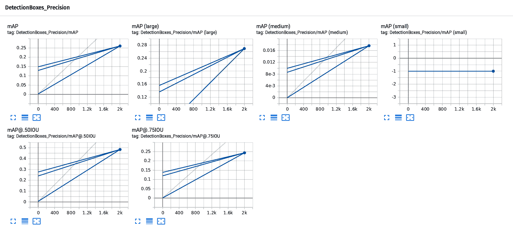

精度数据不高，但可以通过添加更多图像来改进-在我们的示例示例中，我们仅使用 68 张图像进行训练。

现在我们已经创建了模型并观察了其输出，在下一部分中，我们将描述如何打包模型，以便您可以将其部署在边缘设备（例如手机）上以进行实时显示。 在此处打包模型意味着冻结模型，这意味着该模型不再受训练。

# 模型输出并转换为冻结图

到目前为止，我们已经学习了如何将 TFRecord 格式的图像上传到 GCP，然后使用 SSD MobileNet 模型来训练针对汉堡和薯条的自定义模型。 在本节中，我们将回顾模型输出的组成部分，并学习如何冻结模型。 冻结模型涉及以某种格式保存 TensorFlow 图和权重，以后可用于推断。 模型输出存储在`train`文件夹中，并且包含以下文件：

*   `graph.pbtxt`：这是一个文本文件，描述了 TensorFlow 图上每个节点的值，列表和形状
*   `model.ckpt-xxxx.data-00000-of-00001`：这是一个二进制文件，指示所有变量文件的值
*   `model.ckpt-xxxx.index`：这是一个代表表的二进制文件，其中每个键是张量的名称及其值
*   `model.ckpt-xxxx.meta`：这描述了保存的图形结构
*   `train_pipeline.config`：此文本文件描述了模型参数-在模型配置文件的前两个部分中也有说明

请注意，在前面的步骤中，我仅以`xxxx`为例。 您的价值将有所不同。 输入该信息而不是`xxxx`。

抓取最新的数据文件（单击鼠标右键并下载），因此，在本示例中，抓取包含`-2000`的文件。

下一个任务是将检查点输出转换为冻结的推理图。 下节介绍了三种方法：

1.  从 TensorFlow Core 执行`freeze_graph.py`：

```py
   $ python freeze_graph.py --input_graph=train_graph.pbtxt --                             input_checkpoint=train_model.ckpt-2000 --                                    output_graph=frozen_graph.pb --output_node_name=softmax
```

2.  从 TensorFlow Python 工具执行`freeze_graph`：

```py
    import tensorflow as tf
    from tensorflow.python.tools import freeze_graph
    checkpoint_path = './'+'train_model'+'.ckpt-2000'
    freeze_graph.freeze_graph('train_graph.pbtxt', "", False,                 checkpoint_path,    "output/softmax", "save/restore_all",                     "save/Const:0",'frozentensorflowModel.pb', True, "")
```

对于上述两种方法，我们都会得到两种类型的错误：

```py
  IndexError: tuple index out of range
  AttributeError: module 'tensorflow_core.python.pywrap_tensorflow' has no    attribute   'NewCheckpointReader'
```

3.  从终端在`tflite graph.py`上执行`export`功能，然后下载相关文件：

```py
    $export CONFIG_FILE=gs://${YOUR_GCS_BUCKET}/data/pipeline.config
    $export CHECKPOINT_PATH=gs://${YOUR_GCS_BUCKET}/train/model.ckpt-2000
    $export OUTPUT_DIR=/tmp/tflite
```

4.  然后，根据[这个页面](https://github.com/tensorflow/models/tree/master/research/object_detection/dockerfiles/android)中的描述，从 Docker 文件在终端中执行以下命令。

Docker 是一种虚拟机，使开发人员可以将应用程序及其所有组件打包在一起。 对于 TensorFlow，使用 Docker 的优势是将 TensorFlow 安装与 PC 操作系统隔离。 这种隔离消除了我们之前观察到的许多与 TensorFlow 相关的错误：

```py
    $python object_detection/export_tflite_ssd_graph.py \
    --pipeline_config_path=$CONFIG_FILE \
    --trained_checkpoint_prefix=$CHECKPOINT_PATH \
    --output_directory=$OUTPUT_DIR \
    --add_postprocessing_op=true
```

在以下部分中，我们将描述“第 11 章”，*在具有 CPU / GPU 优化功能的边缘设备上进行深度学习*提及的`tflite`转换过程。

# 从 Google Colab 执行导出 tflite graph.py

在“第 10 章”，*使用 R-CNN，SSD 和 R-FCN 的对象检测*和“第 11 章”，*在具有 CPU 的边缘设备上进行深度学习 / GPU 优化*，我们使用 Google Colab 将检查点转换为冻结图。 我们将在此处使用相同的方法，除了我们将导入配置，检查点和输出目录，如下所示：

```py
CONFIG_FILE = '/content/sample_data/train_pipeline.config'
CHECKPOINT_PATH = '/content/sample_data/train_model.ckpt-2000'
OUTPUT_DIR = '/content/sample_data'
```

将文件上传到 Google 云端硬盘，然后将其拖到 Google Colab 中名为`sample_data`的文件夹中。 您可以创建一个不同的名称来代替`sample_data`。 之后，执行以下代码：

请注意，如果您没有通过将文件拖到 Google Colab 中来携带文件，而是将 Google Colab 链接到文件所在的 Google 云端硬盘，则可能会产生错误，因为在此期间无法找到文件 执行。

```py
import re
import numpy as np
!python /content/models/research/object_detection/export_tflite_ssd_graph.py \
    --input_type=image_tensor \
    --pipeline_config_path={CONFIG_FILE} \
    --output_directory={OUTPUT_DIR} \
    --trained_checkpoint_prefix={CHECKPOINT_PATH} \
    --add_postprocessing_op=true

```

[可以在以下 GitHub 链接中找到此转换的代码](https://github.com/PacktPublishing/Mastering-Computer-Vision-with-TensorFlow-2.0/blob/master/Chapter12/Chapter12_Gcloud_Tensorflow_TrainedModelConvert.ipynb)。

因此，总而言之，下图表示在 GCP 上训练自定义对象检测器的流程图：

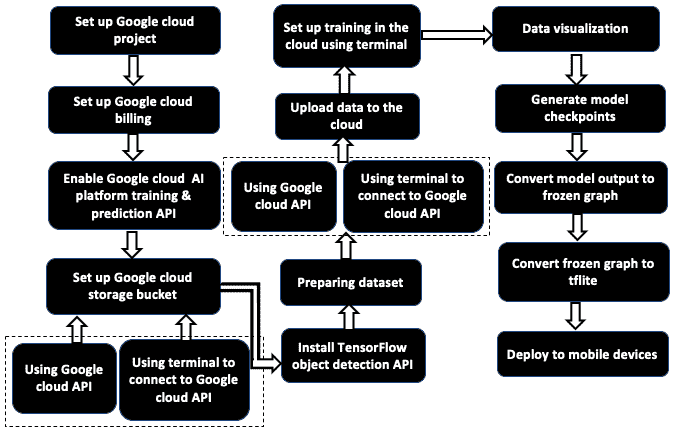

首先创建一个项目，然后创建账单，设置 API 和存储桶，准备 TensorFlow 对象检测 API，准备和上传数据集，然后开始培训。 虚线矩形内的两个圆角矩形表示完成同一任务的两种不同方法。 训练完成后，涉及的步骤包括生成冻结图，转换`tflite`表单并部署到移动设备。 部署到移动设备的过程与“第 11 章”，*具有 CPU / GPU 优化功能的边缘设备上的深度学习*中的方法相同，因此在此不进行描述。

# 在 AWS SageMaker 云平台中训练对象检测器

[AWS](https://aws.amazon.com) 是用于在云中执行各种任务的 Amazon 云平台。 AWS SageMaker 是机器学习平台，用于使用 AWS 交互式平台训练和部署模型。 AWS SageMaker 与 AWS S3 存储桶进行交互以存储和检索数据。 下一节将介绍训练对象检测器的分步过程。

# 设置一个 AWS 账户，账单和限额

通过与 AWS 支持联系，将服务限制增加到`ml.p3.2xlarge`或类似的值。 请注意，实例类型最多可能需要两个工作日才能获得批准，因此请进行相应的计划。 如果不这样做，则会出现以下错误：

```py
ResourceLimitExceeded
```

用于训练作业使用情况的帐户级别服务限制`ml.p3.2xlarge`为零实例，当前利用率为零实例，请求增量为一个实例。 请联系 AWS 支持以请求增加此限制。

# 将.xml 文件转换为 JSON 格式

AWS SageMaker 批注数据使用 JSON 格式而不是我们之前使用的`.xml`。 通过以下步骤将`.xml`文件转换为 COCO JSON 格式：

1.  从[这里](https://github.com/yukkyo/voc2coco)下载或克隆存储库。
2.  克隆存储库并下载后，进入终端
    `voc2coco.py` Python 文件所在的目录。
3.  创建一个名为`trainxml`的目录，其中包含所有`.xml`文件。 该目录应与`voc2coco.py`位于相同的主目录中。
4.  在同一主目录中，创建一个名为`trainlist.txt`的文件，该文件应列出所有`.xml`文件名。 您可以在终端中复制此文件，然后将所有`.xml`文件复制并粘贴到文本文件中以创建此类文件。

5.  接下来，创建一个`classname.txt`文件，该文件应列出`training`文件夹中的所有类。 在此示例中，它将有两行-`burger`和`fries`。
6.  然后，从主目录下的终端运行 Python 代码，如下所示：

```py
$ python voc2coco.py  --ann_dir trainxml  --ann_ids trainlist.txt  --labels classname.txt  --output train_cocoformat.json
```

最终输出是`cocoformat.JSON`文件，它是所有`.xml`文件的一个组合 JSON 文件。

7.  将`COCO JSON`文件转换为单个 JSON 文件。
8.  然后，使用`Chapter12_cocojson_AWSJSON_train.ipynb` Jupyter Notebook 将`COCO JSON`文件转换为单个 JSON 文件。 可以在[这个页面](https://github.com/PacktPublishing/Mastering-Computer-Vision-with-TensorFlow-2.0/blob/master/Chapter12/Chapter12_cocojson_AWSJSON_train.ipynb)上找到此文件。 这是对 Amazon 提供的对象检测代码的修改。 此代码不是从 GitHub 页面获取`COCO JSON`文件，而是从本地驱动器获取上一步中创建的`cocoformat.JSON`文件，然后将其转换为生成的文件夹中的多个`.JSON`文件。

# 将数据上传到 S3 存储桶

S3 存储桶是用于在 AWS 中存储数据的云存储容器。 本节介绍如何将数据从我们的 PC 上传到 S3 存储桶：

1.  创建一个主文件夹以指示项目数据。
2.  在该文件夹中，上传四个文件和一个输出文件夹，如下所示：

*   `train_channel`：`train`图片`.jpg`文件
*   `train_annotation_channel`：`train`批注`.JSON`文件。 每个文件对应于每个`train`图像。
*   `validation_channel`：`validation`图片`.jpg`文件
*   `validation_annotation_channel`：`validation`批注`.JSON`文件。 每个文件对应于每个`validation`图像。

3.  创建一个输出文件夹来存储检查点和输出模型文件。

# 创建笔记本实例并开始培训

让我们按照以下步骤操作：

1.  选择实例类型（选择用于加速计算的实例，例如`ml.p2.nxlarge`，其中`n`可以为 1、2、8，依此类推）。 请注意，如果实例类型是标准类型（例如`ml.m5.nxlarge`）或计算优化型（例如`ml.c5.nxlarge`），则训练将失败。 因此，如前所述，请求增加服务限制。
2.  选择最大运行时间-从 1 小时开始，对于非常大的作业，增加它。
3.  为前面描述的四个通道中的每个通道分配一个到 S3 存储桶的路径，以便算法知道从何处提取数据。
4.  将路径分配到前面提到的输出文件夹。 在前面的代码块中显示了输出路径的示例。 在这种情况下，`sample1`是 S3 存储桶名称，`DEMO`是其中包含`sample1`的文件夹，其中有六个文件夹-两个数据文件夹，其中包括`.jpg`图像，两个注释文件夹 由`.json`文件，输出和检查点文件组成。 请注意，路径必须正确； 否则，可能会产生错误：

```py
s3://sample1/DEMO/s3_train_data/
s3:// sample1/DEMO/s3_train_annotation/
s3:// sample1/DEMO/s3_validation_data/
s3:// sample1/DEMO/s3_validation_annotation/
s3:// sample1/DEMO/s3_checkpoint/
s3:// sample1/DEMO/s3_output_location/
```

5.  [通过 Python 笔记本](https://console.aws.amazon.com/sagemaker/home?region=us-east-1#/notebook-instances)或通过[培训 API](https://console.aws.amazon.com/sagemaker/home?region=us-east-1#/jobs/create) 设置培训。
6.  训练结束后，输出将存储在先前代码中定义的`s3_output_location`中，作为`model.tar.gz`文件。 检查点将存储在前面代码中定义的`s3_checkpoint`位置。
7.  下一步将是建立推理模型。 AWS 拥​​有详细的推理分步说明，可在[这个页面](https://console.aws.amazon.com/sagemaker/home?region=us-east-1#/models/create)中找到。

# 修复培训中的一些常见故障

以下是一些在训练过程中失败的原因及其解决方法：

*   **故障 1-s3 存储桶相关问题**：在输入数据源中给定的`s3://DEMO-ObjectDetection/s3_train_data/` S3 URL 上找不到 S3 对象。 请确保存储桶位于所选区域（`us-east-1`）中，对象存在于该 S3 前缀下，并且`arn:aws:iam::11111111:role/service-role/AmazonSageMaker-ExecutionRole-xxxxxxx`角色对`DEMO-ObjectDetection`存储桶具有`s3:ListBucket`权限。 或者，来自 S3 的`The specified bucket does not exist`错误消息。 **解决方案**：更改 S3 存储桶路径，如前所述。 对`train`，`validation`，`annotation`和`image`数据文件各重复一个。

*   **故障 2-批处理大小问题**：`ClientError`：`validation`集没有足够的带注释文件。 请确保带有有效批注的文件数量大于`mini_batch_size`，并且实例中的 GPU 数量更大。 **解决方案**：要记住的重要一点是批处理大小必须小于`validation`文件的数量。 因此，如果`validation`文件的数量为 32，批处理大小为 32，则将微型批处理大小从 32 更改为 12，以解决此错误。
*   **故障 3-内容类型问题**：`ClientError`：无法初始化算法。 `train_annotation`通道的`ContentType`为空。 请为`train_annotation`频道设置内容类型（由`KeyError`引起）。 由`u'train_annotation'`引起。 **解决方案**：确保内容类型不为空白。 将内容类型更改为`application/x-image`。
*   **故障 4-通道命名问题**：`ClientError`：无法初始化算法。 无法验证输入数据配置（由`ValidationError`引起）。 由`u'train'`引起的是必需属性。 无法验证架构中的`u'required'`：`{u'$schema'`：`u'http://json-schema.org/draft-04/schema#', u'additionalProperties':` `False`，`u'definitions': {u'data_channel': {u'properties': {u'ContentType': {u'type': u'string'}`，`u'RecordWrapperType': {u'enum': [u'None', u'RecordIO'], u'type': u'string'}, u'S3DistributionType': {u'enum': [u'FullyReplicated', u'ShardedByS3Key'], u'type': u'string'}`。 **解决方案**：AWS 希望通道名称为`train_validation`，`train_annotation`和`validation_annotation`。 如果您附加了`_channel`（`train_channel`，`validation_channel`，`train_annotation_channel`和`validation_annotation_channel`），则将导致错误。 因此，要解决此问题，请从文件名中删除`_channel`。

如果在此过程中遇到问题，请通过创建故障单来联系 AWS 支持人员。 解决所有错误后，成功的培训将具有以下参数：

*   `base_network`是`resnet-50`
*   `early_stopping`是`false`
*   `early_stopping_min_epochs`是`10`
*   `early_stopping_patience`是`5`
*   `early_stopping_tolerance`是`0.0`
*   `epochs`是`30`
*   `freeze_layer_pattern`是`false`
*   `image_shape`是`300`
*   `label_width`是`350`
*   `learning_rate`是`0.001`
*   `lr_scheduler_factor`是`0.1`
*   `mini_batch_size`是`12`
*   `momentum`是`0.9`
*   `nms_threshold`是`0.45`
*   `num_classes`是``2``
*   `num_training_samples`是`68`
*   `optimizer`是`sgd`
*   `overlap_threshold`是`0.5`
*   `use_pretrained_model`是`1`
*   `weight_decay`是`0.0005`

请注意，训练的输出将与检查点一起保存在 S3 输出位置。

完成上述练习后，您将熟悉在 GCP 和 AWS 中训练神经网络模型。 接下来，我们将使用 Microsoft Azure 云平台进行培训。

# 在 Microsoft Azure 云平台中训练对象检测器

在本节中，我们将使用 Azure 自定义视觉来训练对象检测器。 可以在[中找到有关使用 Microsoft Azure 云平台训练对象检测器的详细说明：https：//docs.microsoft.com/zh-cn/azure/cognitive-services/custom-vision-service/get-started -build-detector](https://docs.microsoft.com/en-us/azure/cognitive-services/custom-vision-service/get-started-build-detector) 。

下一节将详细介绍训练对象检测器时的各种过程。

# 创建一个 Azure 帐户并设置自定义愿景

在本节中，我们将设置一个 Azure 帐户和一个 Azure 自定义愿景平台。 以下步骤将帮助您配置 Azure 帐户并注册 Custom Vision 平台。 如针对 GCP 所述，此过程对于任何云平台都是相同的-设置帐单信息并设置项目-如以下屏幕快照所示：

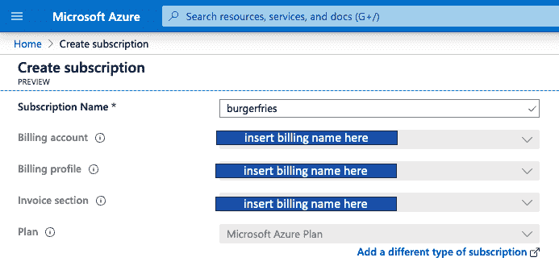

设置培训的具体步骤如下：

1.  注册一个 Microsoft 帐户并设置帐单信息。 在撰写本文时，Microsoft 将免费为美国地区的首次用户提供$ 200 的赠金（请针对您所在的地区进行检查）。
2.  设置订阅。 在“订阅”选项卡中，单击“添加”，然后为您的订阅命名并设置帐单信息。
3.  设置项目，然后选择并创建项目，并为其命名。
4.  设置资源，然后从菜单中选择“资源”组。
5.  选择“对象检测”，然后完成所有这些操作，然后使用“ Custom Vision”创建对象检测。

设置帐户设置是非常重要的部分，如果操作不正确，将花费相当长的时间。 设置帐户后，接下来的步骤实际上将很快进行。

# 上传训练图像并标记它们

在本节中，我们将训练图像上传到 Azure Custom Vision 平台。 按着这些次序：

1.  单击添加图像，然后添加所有`train`和`validation`图像。
2.  添加它们后，您的图像将显示在未标记的部分。

3.  请注意，您将无处上载在先前项目中创建的注释`.xml`或`.JSON`文件，但不要担心，Azure 使标记图像非常简单。
4.  首先，请注释大约 10％（或大约 20）的图像。 您会注意到，即使在此之前，边界框也会自动转到感兴趣的对象，您要做的就是调整其大小。 如果找不到对象，请添加边界框并编写相应的类。 以下屏幕截图显示了智能标签选项：

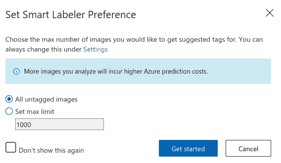

5.  标记图像后，它们将移至标记的部分。 在标记了 10％（或大约 20）张图像后，请对这些图像进行快速训练。 训练完成后，返回未加标签的图像，然后使用智能贴标签器选项标记所有未加标签的图像。
6.  执行上一步后，您会注意到许多图像将被自动标记。 如果您认为标签正确无误，请接受更改，然后调整边界框的大小和位置。 如果图像具有多个类别，并且智能标签仅捕获其中的几个类别，请手动标记其他类别。 用这种方法注释大约 100 张图像后，就可以开始训练（如果有更多图像，则进行快速训练，如果最大图像数为 100，则进行高级训练），然后使用新生成的模型来训练其他图像。

7.  继续前面的过程，直到所有图像都被标记。 然后，开始训练并使用高级训练选项。 以小时为单位设置时间（从 1 小时开始），以后再根据需要增加时间。 在云端的训练非常快-在不到 10 分钟的时间内即可训练约 100 张图像。

培训完成后，您将能够看到性能指标。 请注意，在上述快速培训之后，您将能够看到此内容。 以下屏幕截图显示了针对新训练的模型的精度，召回率和 mAP 方面的性能参数：

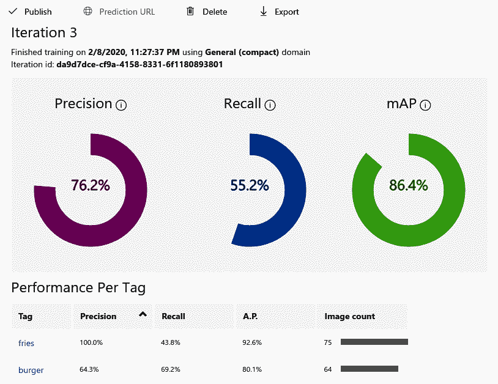

请注意，随着模型看到的图像越来越多，上一个屏幕快照中显示的 Precision 值可能会降低。 因此，在 20 张图像上开发的模型比在 100 张图像上开发的模型具有更高的精度。 这是因为在 20 张图像上开发的模型具有较少的训练错误，但具有较高的测试错误（在`test`图像中，无法识别汉堡-仅识别薯条）。 mAP 数是 11 个等距召回级别（0、0.1，…1）上的平均平均精度。 mAP 值不受图像添加的影响。 Performance 参数显示`burger`和`fries`的值。

8.  现在，让我们带回旧的`validation`图像并查看结果。 为此，请单击顶部的“预测”，然后插入`validation`图像。 它将在类周围绘制一个边界框，如下所示：

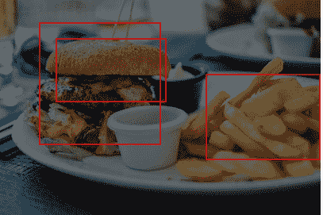

9.  如图所示，预测是正确的。 接下来，我们将导出模型。 为此，请单击“导出”，如以下屏幕截图所示。 请注意，如果单击 TF，则可以选择导出为 TensorFlow Lite 或 TensorFlow。 同样，如果您单击 iOS，则可以选择导出为 CoreML：

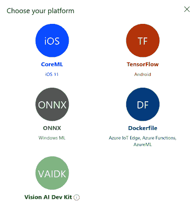

上面的屏幕截图显示了 TensorFlow Lite 中可用的各种导出选项。

# 大规模培训和包装

TensorFlow 有一个名为`tf.distribute.Strategy`的 API，可在多个 GPU 之间分配训练。 在[这个页面](https://cloud.google.com/ai-platform/training/docs/training-at-scale)上详细介绍了针对 Google Cloud 的大规模培训。

使用`tf.distribute.Strategy` API 涵盖了使用 TensorFlow 进行分布式培训。 使用此 API，可以使用多个 GPU 或 TPU 分发 TensorFlow 培训。 有关分布式培训的详细概述（包括示例），请访问[这里](https://www.tensorflow.org/guide/distributed_training)。

也可以在云计算引擎中设置分布式培训。 为了启用此功能，请在 GCP 中启用 Cloud Shell。 在 TensorFlow 集群中，设置一个主服务器和多个工作程序的虚拟机实例，并在每个这些计算机上执行培训作业。 有关详细信息，您可以转到[这里](https://cloud.google.com/solutions/running-distributed-tensorflow-on-compute-engine)。

# 应用包装

应用程序打包涉及将代码，`TFRecord`文件和模型`.confg`文件上传到 GCP，模型在训练期间可以访问。 在*在 GCP* 中训练对象检测器的部分中，我们通过使用`gcloud`打包应用程序在 GCP 中进行了训练，如下所示：

```py
$ gcloud ml-engine jobs submit training `whoami`_object_detection_`date +%s` --job-dir=gs://${YOUR_GCS_BUCKET}/train --packages dist/object_detection-0.1.tar.gz,slim/dist/slim-0.1.tar.gz,/tmp/pycocotools/pycocotools-2.0.tar.gz --module-name object_detection.model_tpu_main --runtime-version 1.15 --scale-tier BASIC_TPU --region us-central1 -- --model_dir=gs://${YOUR_GCS_BUCKET}/train --tpu_zone us-central1 --pipeline_config_path=gs://${YOUR_GCS_BUCKET}/data/pipeline.config
```

请注意，在前面的培训中，我们使用了`gcloud ml-engine`，它可以让您管理 AI 平台作业和培训模型。 还有另一个名为`gcloud ai-platform`的平台，也可以用来打包您的应用程序，如下所示：

```py
gcloud ai-platform jobs submit training $JOB_NAME \
   --staging-bucket $PACKAGE_STAGING_PATH \
   --job-dir $JOB_DIR  \
   --package-path $TRAINER_PACKAGE_PATH \
   --module-name $MAIN_TRAINER_MODULE \
   --region $REGION \
   -- \

   --user_first_arg=first_arg_value \
   --user_second_arg=second_arg_value
```

前面的代码的解释如下：

*   `--staging-bucket`：这是暂存`training`程序包的云存储路径
*   `--job-dir`：这是输出文件位置的云存储路径
*   `--package-path`：这指定应用程序目录的本地路径
*   `--module-name`：这指定应用程序模块的名称
*   `--job-dir`标志：这是作业目录

# 基于云的视觉搜索背后的总体思路

在 “第 6 章”，*使用转移学习*的视觉搜索中，我们学习了如何在本地 PC 上进行视觉搜索。 该方法使用通过神经网络（例如 VGG16 或 ResNet）传递图像，并通过删除最后一个全连接层然后将其与数据库中已知类别的其他图像进行比较以将其转换为图像矢量，以找到最近的邻居。 匹配，然后显示结果。

在示例中，我们从 200 张图像开始，但是如果图像数量达到 100 万张并且必须从网页访问结果，则在本地存储图像将毫无意义。 在这些情况下，云存储是最佳的。 在那种情况下，我们可以将图像向量存储，而不是将图像存储在云中，然后在用户上传图像时，将图像转换为向量并将其发送到云中进行处理。 在云中，我们执行 k 近邻搜索以找到并显示最接近的匹配项。 使用 REST API 或**消息队列遥测传输**（**MQTT**）服务将图像矢量上传到云中。 每个服务都有自己的安全性验证。

在这里，我们将讨论将图像发送到云服务并以 JSON 消息形式接收的基本编码基础架构：

*   **客户端请求基础结构**：以下代码描述了如何将图像 URL 作为 POST 请求发送到外部 Web 服务器。 此处，`api_host`是 Web 服务器地址。 `headers`文件是操作参数，在这种情况下为图像。 `image_url`是实际的图像位置：

```py
api_host = 'https://…/'
headers = {'Content-Type' : 'image/jpeg'}
image_url = 'http://image.url.com/sample.jpeg'
img_file = urllib2.urlopen(image_url)
response = requests.post(api_host, data=img_file.read(), 
headers=headers, verify=False)
print(json.loads(response.text))
```

*   **服务器端请求基础结构**：以下代码描述了典型的服务器端代码。 数据库侧的服务器将使用`request.files.get`方法请求图像（图片），并且`picture.save`用于保存图像：

```py
@app.route('/', methods=['POST'])
def index():
 picture = request.files.get('file')
 picture.save('path/to/save')
 return 'ok', 200
```

前面的代码体系结构展示了 REST API 方法从云发送和接收图像的基础。 GCP，AWS 和 Azure 具有适当的 API，可以执行视觉搜索，面部识别和许多其他任务。 在以下部分中，将对此进行详细描述。 每个云平台都有自己的向云发送图像数据的方式，这可能彼此不同，但是基本原理与前一个相同。 云网页将以 JSON 格式包含具有可视搜索结果的图像信息，该图像信息可以使用云服务器 URL 和身份验证方法从本地 PC 访问。

# 分析各种云平台中的图像和搜索机制

在本节中，我们将讨论使用三种不同的云平台（GCP，AWS 和 Azure）的可视搜索任务。 我们已经在“第 6 章”，*中使用转移学习*进行了视觉搜索，其中我们学习了如何将图像向量与 PC 目录中的大量图像进行比较以查找 基于欧几里得距离的最接近的匹配。 在本部分中，您将学习如何使用 REST API 从 PC 上载图像到云，云搜索引擎将搜索最接近的图像并将其显示。 因此，所有繁重的工作将由云引擎来完成。

请注意，在本节中，介绍了视觉搜索的基本概念。 内容可以更深入，您可以从 GCP，AWS 或 Azure 获取云 API，并将其插入用 Python，C ++或 JavaScript 编写的应用程序中，以调用云引擎并执行搜索。

# 使用 GCP 进行视觉搜索

GCP 具有视觉 API，可以执行基于云的图像信息，包括面部检测和图像内容分析。 有关更多详细信息，请访问[这里](https://cloud.google.com/vision)。 在以下屏幕截图中查看为沙发上传的示例结果； 检测连同视觉上类似图像的几个示例一起进行：

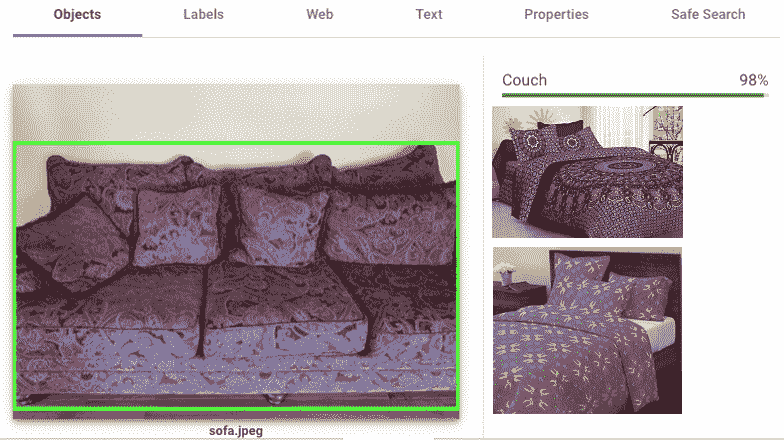

正如我们在“第 6 章”，*中使用转移学习*进行视觉搜索时一样，对于视觉上相似的图像，必须在图像类内进行搜索。 如果图像不是来自网络，则很可能会检测到不同类别的相似视觉图像，如此处的沙发示例所示。 但是，如果图像是从网上获取的，则匹配是精确的或非常接近的。

在上一节中，我们学习了如何使用 GCP 进行训练。 AutoML Vision 是轻松完成此任务的另一种方法。 有关详细的分步说明，请转到[这里](https://cloud.google.com/vision/automl/docs/quickstart)。

要进行视觉搜索，请转到[这里](https://cloud.google.com/vision/product-search/docs/quickstart)。

当您尝试使用 Python 脚本中的 API 时，您将需要以下内容：

*   一个 Google Cloud 帐户，用于设置项目并启用计费。
*   启用 Cloud Vision 产品搜索 API。
*   Google 应用程序凭据-密钥文件。
*   选择一个服务帐户并创建它，以便将密钥下载到您的 PC。
*   通过导出以下三个项目在终端中设置环境变量：
*   `GOOGLE_APPLICATION_CREDENTIAL`：PC 中的关键路径
*   `PROJECT_ID`
*   `LOCATION_ID`
*   创建`request.json`，然后您将收到一个`response.json`文件。

# 使用 AWS 进行视觉搜索

AWS 有许多用于计算机视觉的工具。 其中，两个主要工具是 [Amazon Rekognition](https://aws.amazon.com/rekognition) 和 [AWS SageMaker](https://aws.amazon.com/sagemaker)。访问 AWS 网站以获取更多满足您需求的工具。 AWS Rekognition 是用于图像和视频分析的基于云的**软件即服务**（**SaaS**）平台。 它具有许多功能，例如面部检测和分析，面部搜索和验证以及名人识别。 就像 Google Cloud Vision API 一样，您可以上传图像，它可以提供图像信息的详细信息，如下所示：


在前面的屏幕截图中，正确检测了沙发以及不同的类别以及边界框和图像信息的相应 JSON。 您还可以上传面部图像，它可以提供有关面部表情，年龄和性别的详细信息，以及两个角度不同的面部是否属于同一个人，如下所示：

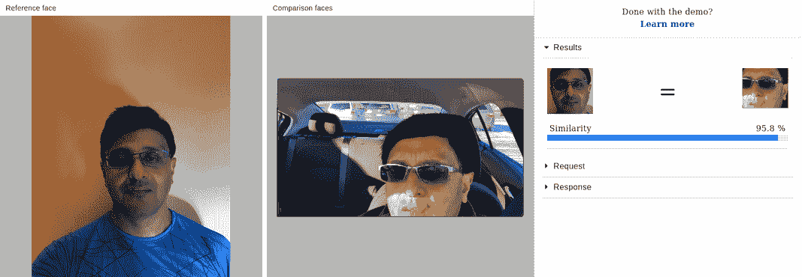

请注意，面部识别系统能够检测到属于同一个人的两张脸，无论有无太阳镜，它们都是从不同角度拍摄的。

AWS Rekognition 还可以使用`boto`分析本地 PC 上的图像，如[这里](https://docs.aws.amazon.com/rekognition/latest/dg/images-bytes.html)所述。

培训期间引入了 AWS SageMaker。 通过将图像转换为矢量，它也可以用于执行视觉搜索。 有关详细练习，请参阅[这个页面](https://github.com/awslabs/visual-search/blob/master/notebooks/visual-search-feature-generation.ipynb)中描述的 Python 笔记本。

请注意，执行此操作的最佳方法是从 AWS SageMaker 笔记本实例运行此操作。 将此文件（在上一链接中列出）上载到 Jupyter Notebook，然后选择 MXNet Python 软件包。 引用您的 S3 存储桶并执行单元。 分析代码并将其与我们在“第 6 章”，*使用转移学习*的视觉搜索中学到的内容进行比较。 您将看到基本原理是相同的，只是分析是在云平台上完成的，因此它将具有在“第 6 章”，*中不必处理的多个身份验证级别。 使用转移学习的视觉搜索* [。](https://cdp.packtpub.com/mastering_computer_vision_with_tensorflow_2_0/wp-admin/post.php?post=27&action=edit)

# 使用 Azure 进行视觉搜索

Azure 是 Microsoft 的云机器学习平台，用于构建，管理和部署应用程序。 与 GCP 和 AWS 一样，Azure 具有许多功能，但我们对计算机视觉工作感兴趣的功能是 [Azure AI 和 Azure 机器学习](https://azure.microsoft.com/en-us/services/)。 在 AI 和机器学习中，与计算机视觉相关的应用程序是 Azure Bot 服务，Azure 认知搜索，Bing 图像搜索，Bing 视觉搜索和计算机视觉。 例如，如果要执行视觉搜索，请转到[这里](https://docs.microsoft.com/en-us/azure/cognitive-services/bing-visual-search/visual-search-sdk-python)。

在 Azure 云平台中进行可视搜索的基本步骤如下：

1.  获取一个 Azure 帐户，然后选择定价信息。
2.  获取您的订阅密钥。
3.  选择 PC 上`test`图像的路径。
4.  以`request.post`的形式发送搜索请求：

```py
response = requests.post(BASE_URI, headers=HEADERS, files=file)
response.raise_for_status()
```

在前面的代码中，`raise_for_status`方法表示如果请求不成功，则会引发异常，例如`404 Client Error: NOT FOUND`。

注意-由于必须提供信用卡详细信息进行计费，因此云平台的使用可能会变得昂贵。 要注意的关键是，即使您完成了培训工作并关闭了 PC，除非完全关闭云平台中的项目，否则您将继续产生费用。

# 概要

在本章中，您学习了如何将图像数据发送到云平台进行分析。 在之前的章节中，我们学习了如何在本地 PC 上进行培训，但是在本章中，您学习了如何使用云平台执行相同的任务，以及如何使用 Google Cloud Shell for distribution 在多个实例中触发培训 训练。

本章包含许多示例和链接，通过查看这些链接并进行练习，您将获得更多知识。 然后，我们学习了如何将图像发送到云平台进行实例分析。 图像内容分析已扩展到可以在云平台中执行可视搜索。 我们还学习了如何使用所有三个云平台-GCP，AWS 和 Azure。 请记住，即使您尚未接受培训，也要确保在完成任务后关闭项目，以免产生不必要的费用。