# 三、使用 OpenCV 和 CNN 的人脸检测

面部检测是计算机视觉的重要组成部分，并且是近年来发展迅速的领域。 在本章中，您将从 Viola-Jones 面部和关键特征检测的简单概念开始，然后继续介绍基于神经网络的面部关键点和面部表情检测的高级概念。 本章将以 3D 人脸检测的高级概念作为结尾。

本章将涵盖以下主题：

*   应用 Viola-Jones AdaBoost 学习和 Haar 级联分类器进行人脸识别
*   使用深度神经网络预测面部关键点
*   使用 CNN 预测面部表情
*   3D 人脸检测概述

# 应用 Viola-Jones AdaBoost 学习和 Haar 级联分类器进行人脸识别

2001 年，微软研究院的保罗·维奥拉和三菱电机的迈克尔·琼斯通过开发名为 [**Haar 级联分类器**](https://www.face-rec.org/algorithms/Boosting-Ensemble/16981346.pdf) 的分类器，开发了一种检测图像中人脸的革命性方法。Haar 级联分类器基于 Haar 特征，这些特征是矩形区域中像素值差异的总和。 校准差值的大小以指示面部给定区域（例如，鼻子，眼睛等）的特征。 最终的检测器具有 38 个级联分类器，这些分类器具有 6,060 个特征，包括约 4,916 个面部图像和 9,500 个非面部图像。 总训练时间为数月，但检测时间非常快。

首先，将图像从 RGB 转换为灰度，然后应用图像过滤和分割，以便分类器可以快速检测到对象。 在以下各节中，我们将学习如何构造 Haar 级联分类器。

# 选择类似 Haar 的特征

Haar 级联分类器算法基于这样的思想，即人脸的图像在脸部的不同区域具有强度的独特特征，例如，脸部的眼睛区域比眼睑底部暗，鼻子区域比旁边的两个面部区域更亮。 类似于 Haar 的特征由黑色和白色的相邻矩形表示，如下图所示。 在此图像中，存在几个潜在的类似 Haar 的特征（两个矩形，三个矩形和四个矩形）：

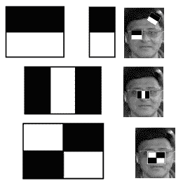

请注意，矩形部分放置在面部的特征上。 由于眼睛区域的强度比脸部暗，因此矩形的黑色区域靠近眼睛，白色区域低于眼睛。 同样，由于鼻子区域比周围的环境明亮，鼻子上出现白色矩形，而两侧则是黑色矩形。

# 创建一个完整的图像

积分图像可用于一次快速计算矩形特征像素值。 为了更好地理解积分图像，让我们看一下其计算的以下细分：

*   可以将 Haar 样特征的值计算为白色区域中的像素值之和与黑色区域中的像素值之和之差。
*   像素`I`的总和（`x`，`y`）可以由当前像素位置左上方和上方所有像素的值[`i`（`x`，`y`），包括当前像素值，可以表示为：


在下图中，`I(x, y)`是由九个像素值组成的最终积分图像值（`62`，`51`，`51`，`111`，`90`，`77`，`90`，`79`和`73`）。 将所有这些总和得出 684 的值：


下图显示了脸部的眼睛区域的像素强度和相应的积分图像：

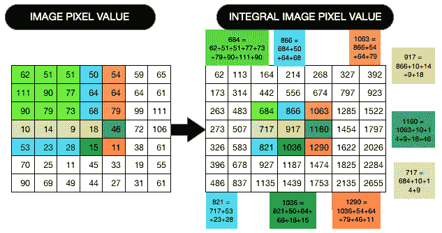

上图显示，矩形区域的像素强度总和是通过将上方和左侧的所有像素值相加得出的，例如，`917`通过将`866`（这是`73, 79, 90, 111, ..., 68`的总和）和`10`，`14`，`9`和`18`。 注意，`917`也可以通过将`717`求和，然后将其加到`50`，`64`和`68`和`18`的总和来获得。

前面的像素方程式的总和可以重写如下：


在积分图像中，可以通过将四个数组（如前面的方程式所示）相加来计算图像中任何矩形区域的面积，而不是针对所有单个像素的总和进行六个内存访问。 Haar 分类器的矩形总和可以从前面的方程式获得，如以下方程式所示：


前面的等式可以重新安排如下：


下图显示了转换为整数图像像素值的图像像素值：

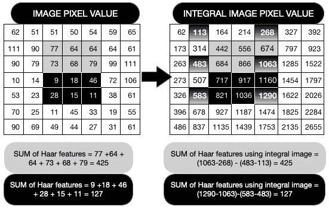

右侧的积分图像就是左侧像素值的总和-所以`113 = 62 + 51`，依此类推。 黑色阴影区域像素值表示黑色 Haar 矩形，如前所述。 为了计算阴影区域的强度值，我们取整数强度值 1,063，然后从中减去 268。

# 进行 AdaBoost 训练

图像被划分为`T`窗口，在其中应用了类似 Haar 的特征，并如前所述计算其值。 AdaBoost 通过迭代`T`窗口的训练集，从大量弱分类器中构建出一个强分类器。 在每次迭代中，基于多个正样本（面部）和多个负样本（非面部）来调整弱分类器的权重，以评估分类错误的项目的数量。 然后，对于下一次迭代，将为错误分类的项目的权重分配更高的权重，以增加检测到这些权重的可能性。 最终的强分类器`h`（`x`）是根据弱分类器的误差加权的组合。

*   **弱分类器**：每个弱分类器都具有一个特征`f`。 它具有极性`p`和阈值`θ`：


*   **强分类器**：最终的强分类器`h`（`x`）具有最小的误差，`E[t]`，并由以下给出：


在此，`E[t] = log(1 / E[t])`和`E[t] = E[t] / (1 - E[t])`：


权重（`W[t]`）初始化如下：

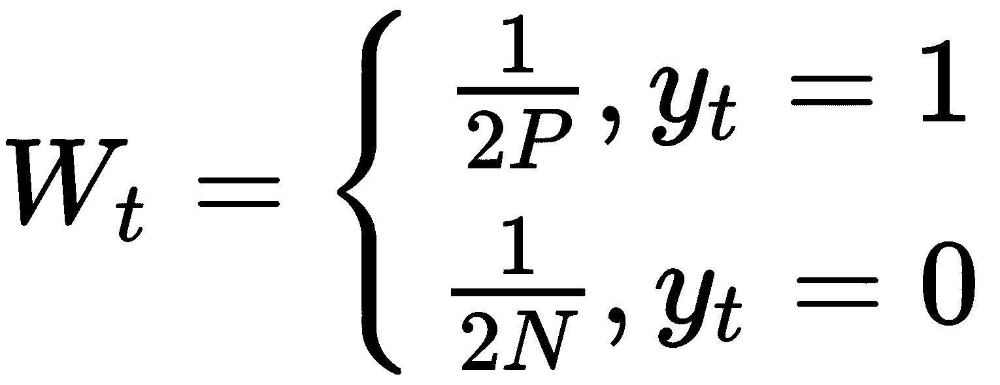

在此，`P`和`N`分别是正样本和负样本的数量。 权重值更新如下：


每个弱分类器都会计算一个特征。 请注意，弱分类器无法单独进行分类，但是将其中几个组合在一起可以很好地进行分类。

# 注意级联分类器

前面描述的每个强分类器形成一个级联，其中每个弱分类器代表一个阶段，可以快速删除负子窗口并保留正子窗口。 来自第一个分类器的肯定响应表示已检测到脸部区域（例如，眼睛区域），然后算法继续进行下一个特征（例如，鼻子区域）以触发第二个区域的分类器的评估，依此类推。 任何时候的负面结果都会导致该阶段立即被拒绝。 下图说明了这一点：

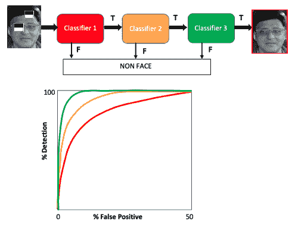

此图显示负特征已被立即消除。 随着分类从左向右移动，其准确率会提高。

# 训练级联检测器

开发了整个训练系统，以最大程度地提高检测率并最大程度地降低假阳性率。 Viola 和 Jones 通过为级联检测器的每个阶段设置目标检测率和假阳性率，实现了以下目标：

*   级联检测器每一层中的特征数量都会增加，直到达到该层的目标检测率和假阳性目标为止。
*   如果总体假阳性率不够低，则添加另一个阶段。
*   矩形特征将添加到当前阶段，直到达到其目标速率。
*   当前阶段的假阳性目标被用作下一阶段的阴性训练集。

下图显示了 OpenCV Python Haar 级联分类器，用于分类正面和眼睛以检测面孔和眼睛。 左图和右图均显示它可以正确检测到脸部； 然而，在第一图像中，由于左眼的眩光而仅检测到右眼，而在第二图像中检测到双眼。 Viola-Jones 级联检测方法查找强度梯度（眼睛区域比下面的区域暗），在这种情况下，由于眼镜右镜片的眩光，它无法在右眼中检测到 ：

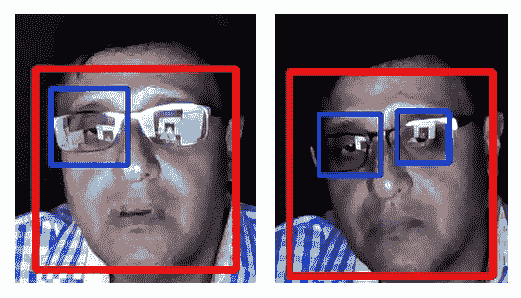

可在[这个页面](https://github.com/PacktPublishing/Mastering-Computer-Vision-with-TensorFlow-2.0/blob/master/Chapter03/Chapter3_opencv_face%26eyedetection_video.ipynb)中找到用于摄像头视频中的面部和眼睛检测的 OpenCV Python 代码。 请注意，为了使代码起作用，您需要在文件夹中指定 Haar 级联检测器所在的路径。

到目前为止，我们已经了解了 Haar 级联分类器，以及如何使用内置的 OpenCV 代码将 Haar 级联分类器应用于面部和眼睛检测。 前述概念基于使用积分图像检测类似 Haar 的特征。 该方法非常适合面部，眼睛，嘴巴和鼻子的检测。 但是，可以将不同的面部表情和皮肤纹理用于情感（快乐与悲伤）或年龄确定等。 Viola-Jones 方法不适用于处理这些不同的面部表情，因此我们需要使用 Viola-Jones 方法进行面部检测，然后应用神经网络确定面部边界框内的面部关键点。 在下一节中，我们将详细学习此方法。

# 使用深度神经网络预测面部关键点

在本节中，我们将讨论面部关键点检测的端到端管道。 面部关键点检测对于计算机视觉来说是一个挑战，因为它要求系统检测面部并获取有意义的关键点数据，将这些数据绘制在面部上，并开发出神经网络来预测面部关键点。 与对象检测或图像分类相比，这是一个难题，因为它首先需要在边界框内进行面部检测，然后再进行关键点检测。 正常的对象检测仅涉及检测代表对象周围矩形边界框的四个角的四个点，但是关键点检测需要在不同方向上的多个点（超过 10 个）。 可以在[这个页面](https://www.kaggle.com/c/facial-keypoints-detection)上找到大量的关键点检测数据及其使用教程。 Kaggle 关键点检测挑战涉及一个 CSV 文件，该文件包含指向 7,049 个图像（`96 x 96`）的链接，每个图像包含 15 个关键点。

在本部分中，我们将不使用 Kaggle 数据，但将向您展示如何准备自己的数据以进行关键点检测。 有关该模型的详细信息，请参见[这里](https://github.com/PacktPublishing/Mastering-Computer-Vision-with-TensorFlow-2.0/blob/master/Chapter03/Chapter3_face%20keypoint_detection.ipynb)。

# 准备用于关键点检测的数据集

在本节中，您将学习如何创建自己的数据。 这涉及编写代码并执行代码，以使 PC 中的网络摄像头点亮。 将您的脸部移动到不同的位置和方向，然后按空格键，在裁剪掉图像中的所有其他内容后，它将保存您的脸部图像。 此过程的关键步骤如下：

1.  首先，我们从指定 Haar 级联分类器的路径开始。 它应该位于您的`OpenCV/haarcascades`目录中。 那里将有很多`.xml`文件，因此请包含`frontalface_default.xml`的路径：

```py
face_cascade = cv2.CascadeClassifier('path tohaarcascade_frontalface_default.xml')
```

2.  接下来，我们将使用`videoCapture(0)`语句定义网络摄像头操作。 如果您的计算机已插入外部摄像机，则可以使用`videoCapture(1)`：

```py
  cam = cv2.VideoCapture(0)
```

3.  相机帧使用`cam.read()`读取数据，然后在每个帧内，使用“步骤 1”中定义的 Haar 级联检测器检测面部。 使用`(x,y,w,h)`参数在检测到的面部周围绘制一个边框。 使用`cv2.imshow`参数，屏幕上仅显示检测到的面部：

```py
while(True):
    ret, frame = cam.read()
    faces = face_cascade.detectMultiScale(frame, 1.3, 5)
    for (x,y,w,h) in faces:
        if w >130:
            detected_face = frame[int(y):int(y+h), int(x):int(x+w)]
            cv2.imshow("test", detected_face)
    if not ret:
        break
    k = cv2.waitKey(1)
```

4.  接下来，将图像调整为`img_size`，将其定义为`299`，并将结果图像保存在数据集目录中。 注意，在本练习中我们使用`299`的图像大小，但是可以更改。 但是，如果您决定更改它，请确保在标注文件的创建以及最终模型中进行更改，以避免标注和图像之间的不匹配。 现在，在此 Python 代码所在的目录中创建一个名为`dataset`的文件夹。 请注意，每次按空格键时，图像文件号都会自动增加：

```py
faceresize = cv2.resize(detected_face, (img_size,img_size))
        img_name = "dataset/opencv_frame_{}.jpg".format(img_counter)
        cv2.imwrite(img_name, faceresize)
```

为不同面部表情的不同人创建约 100 幅或更多图像（对于该测试，我总共拍摄了 57 张图像）。 如果您有更多图像，则检测会更好。 请注意，Kaggle 面部点检测使用 7,049 张图像。 拍摄所有图像并使用 VGG 标注器执行面部关键点标注，您可以从[这里](http://www.robots.ox.ac.uk/~vgg/software/via/)获得该标注器。 您可以使用其他选择的标注工具，但是我发现此工具（免费）非常有用。 它绘制边界框以及不规则形状和绘制点。 在本练习中，我加载了所有图像，并使用点标记在图像中绘制了 16 个点，如下图所示：

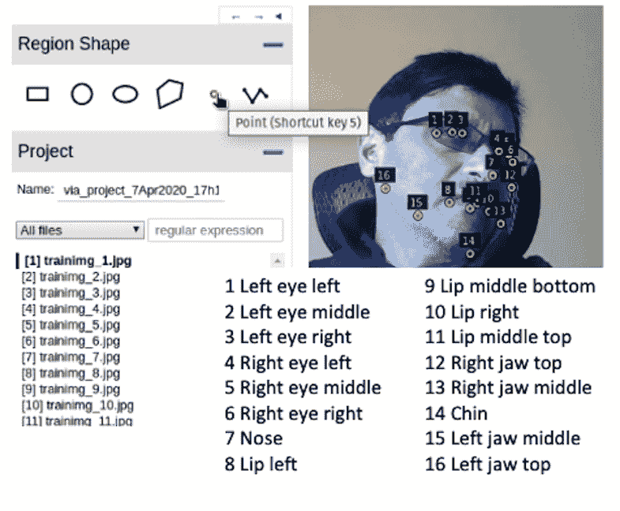

上图中的 16 个点代表左眼（1-3），右眼（4-6），鼻子（7），嘴唇（8-11）和外面（12-16）。 请注意，当我们以数组形式显示图像关键点时，它们将被表示为 0–15 而不是 1–16。 为了获得更高的准确率，您只能捕获面部图像，而不是任何周围环境。

# 处理关键点数据

VGG 标注器工具会生成一个输出 CSV 文件，该文件需要进行两次预处理才能为每个图像的 16 个关键点分别生成`(x, y)`坐标。 对于大数据处理来说，这是一个非常重要的概念，您可以将其用于其他计算机视觉任务，主要有以下三个原因：

*   我们的 Python 代码不会直接在目录中搜索大量图像文件，而是会在输入 CSV 中搜索数据路径。
*   对于每个 CSV 文件，有 16 个相应的关键点需要处理。
*   这是使用 Keras `ImageDataGenerator`和`flow_from_directory`方法浏览目录中每个文件的替代方法。

为了澄清此内容，本节分为以下两个小节：

*   在输入 Keras-Python 代码之前进行预处理
*   Keras–Python 代码中的预处理

让我们详细讨论每个。

# 输入 Keras-Python 代码之前的预处理

VGG 标注器工具会生成一个输出 CSV 文件，该文件需要以我们的 TensorFlow 代码可接受的格式进行预处理。 标注的输出是一个 CSV 文件，该 CSV 文件以行格式显示每个关键点，每个图像有 16 行。 我们需要对该文件进行预处理，以便每个图像有一行。 共有 33 列，指示 32 个关键点值和`1`图像值，如下所示：

`(x0, y0), (x1, y1), (x2, y2), …, (x15, y15)`，图像文件名

您可以使用自定义 Python 程序对此进行转换，尽管此处未显示。 GitHub 页面包含已处理的 CSV 文件，在[这里](https://github.com/PacktPublishing/Mastering-Computer-Vision-with-TensorFlow-2.0/blob/master/Chapter03/testimgface.csv)供您参考。

# Keras–Python 代码中的预处理

在本节中，我们将以`X`和`Y`数据的形式读取 CSV 文件，其中`X`是与每个文件名相对应的图像，而`Y`具有 16 个关键点坐标的 32 个值。 然后，我们将每个关键点的`Y`数据切片为 16 `Yx`和`Yy`坐标。 详细步骤如下所示：

1.  使用标准 Python 命令阅读上一部分的 CSV 文件。 在此，我们使用位于`faceimagestrain`目录中的两个 CSV `trainimgface.csv`和`testimgface.csv`。 如果需要，可以使用其他文件夹：

```py
train_path = 'faceimagestrain/trainimgface.csv'
test_path = 'faceimagestrain/testimgface.csv'
train_data = pd.read_csv(train_path) 
test_data = pd.read_csv(test_path)
```

2.  接下来，我们在 CSV 文件中找到与图像文件相对应的列。 在以下代码中，图像文件的列名称为`'image'`：

```py
coltrn = train_data['image']
print (coltrn.shape[0])
```

3.  接下来，我们初始化两个图像数组`imgs`和`Y_train`。 我们读取`train_data`数组以向`image`列添加路径，并在`for`循环中读取`coltrn.shape[0]`定义的 50 个图像文件中的每个图像文件，并将其附加到图像数组中。 使用`OpenCV BGR2GRAY`命令将读取的每个图像转换为灰度。 在同一`for`循环中，我们还使用`training.iloc[i,:]`命令读取 32 列中的每一列，并将其附加到`Y_train`的数组中：

```py
imgs = []
training = train_data.drop('image',axis = 1)
Y_train = []
for i in range (coltrn.shape[0]):
    p = os.path.join(os.getcwd(), 'faceimagestrain/'+str(coltrn.iloc[i]))
    img = cv2.imread(p, 1)
    gray_img = cv2.cvtColor(img, cv2.COLOR_BGR2GRAY)
    imgs.append(gray_img)
       y = training.iloc[i,:]
    Y_train.append(y)
```

4.  最后，使用以下代码将图像转换为称为`X_train`的 NumPy 数组，这是输入 Keras 模型所必需的：

```py
X_train = np.asarray(imgs)
Y_train = np.array(Y_train,dtype = 'float') 
print(X_train.shape, Y_train.shape)
```

5.  对测试数据重复相同的过程。 现在我们已经准备好训练和测试数据。 在继续之前，我们应该可视化图像中的关键点，以确保它们看起来不错。 使用以下命令完成此操作：

```py
x0=Y_trainx.iloc[0,:]
y0=Y_trainy.iloc[0,:]
plt.imshow(np.squeeze(X_train[0]),cmap='gray')
plt.scatter(x0, y0,color ='red')
plt.show()
```

在前面的代码中，`np.squeeze`用于删除最后一个尺寸，因此图像中只有`x`和`y`值。 `plt.scatter`在图像顶部绘制关键点。 输出如下图所示：

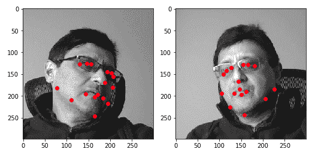

上图显示了叠加在图像顶部的 16 个关键点，表示图像和关键点对齐。 左图和右图表示训练和测试图。 此视觉检查对于确保所有预处理步骤都不会导致不正确的面对点对齐至关重要。

# 定义模型架构

该模型涉及使用**卷积神经网络**（**CNN**）处理面部图像及其 16 个关键点。 有关 CNN 的详细信息，请参阅“第 4 章”，“图像深度学习”。 CNN 的输入是训练图像和测试图像及其关键点，其输出将是与新图像相对应的关键点。 CNN 将学习预测关键点。 下图显示了模型架构的详细信息：


先前模型的代码如下：

```py
model = Sequential()
model.add(Conv2D(32, (3, 3), input_shape=(299,299,1), padding='same', activation='relu'))
model.add(MaxPooling2D(pool_size=(2, 2)))
model.add(Conv2D(64, (3, 3), activation='relu'))
model.add(Conv2D(64, (3, 3), activation='relu'))
model.add(MaxPooling2D(pool_size=(2, 2)))
model.add(Dropout(0.2))
model.add(Conv2D(128, (3, 3), activation='relu'))
model.add(Conv2D(128, (3, 3), activation='relu'))
model.add(MaxPooling2D(pool_size=(2, 2)))
model.add(Dropout(0.2))
model.add(Conv2D(256, (3, 3), activation='relu'))
model.add(Conv2D(256, (3, 3), activation='relu'))
model.add(MaxPooling2D(pool_size=(2, 2)))
model.add(Dropout(0.2))
model.add(Flatten())
model.add(Dense(500, activation='relu'))
model.add(Dense(500, activation='relu'))
model.add(Dense(32))
```

该代码拍摄一张图像，并应用 32 个大小为`(3, 3)`的卷积过滤器，然后激活和最大池化层。 它重复相同的过程多次，并增加过滤器的数量，然后是平坦且密集的层。 最终的密集层包含 32 个元素，分别代表我们要预测的关键点的`x`和`y`值。

# 为关键点预测训练模型

现在我们已经定义了模型，在本小节中，我们将编译模型，重塑模型的输入，并通过执行以下步骤开始训练：

1.  我们将从定义模型损失参数开始，如下所示：

```py
adam = Adam(lr=0.001)
model.compile(adam, loss='mean_squared_error', metrics=['accuracy'])
```

2.  然后，对数据进行整形以输入到 Keras 模型。 重塑数据很重要，因为 Keras 希望以 4D 形式显示数据-数据数（50），图像宽度，图像高度 1（灰度）：

```py
batchsize = 10
X_train= X_train.reshape(50,299,299,1)
X_test= X_test.reshape(7,299,299,1)
print(X_train.shape, Y_train.shape, X_test.shape, Y_test.shape)
```

模型`X`和`Y`参数说明如下：

*   `X_train (50, 299, 299, 1)` 1 的训练数据，图像宽度，图像高度，灰度
*   `Y_train (50, 32)`＃训练数据，关键点数-在这里，我们有`x`和`y`值的 16 个关键点，使其成为 32
*   `X_test (7, 299, 299, 1)` 1 个测试数据，图像宽度，图像高度，灰度
*   `Y_test (7, 32)`＃测试数据，＃关键点-在这里，我们为`x`和`y`值有 16 个关键点，使其成为 32

3.  训练是通过`model.fit`命令启动的，如下所示：

```py
history = model.fit(X_train, Y_train, validation_data=(X_test, Y_test), epochs=20, batch_size=batchsize)
```

训练步骤的输出如下图所示：

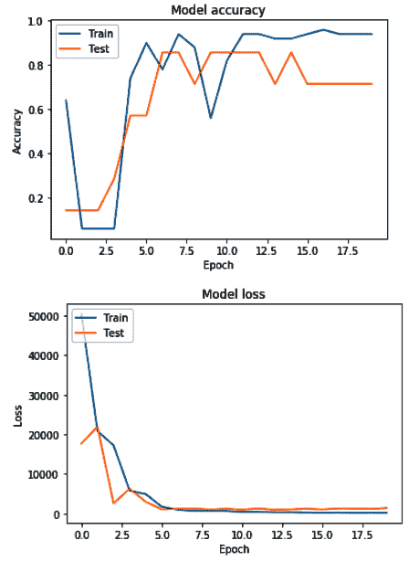

该模型在大约 10 个时间周期内获得了相当好的准确率，但损失项约为 7000。我们需要收集更多的图像数据，以将损失项降至 1 以下：

1.  我们将使用`model.predict`根据测试数据`X_test`预测模型输出`y_val`。 测试数据`X_test`是图像，但是它们已经以模型可以理解的数组形式进行了预处理：

```py
y_val = model.predict(X_test)
```

2.  请注意，此处`y_val`对于每个预处理的图像数组输入都有 32 个点。 接下来，我们将 32 个点细分为代表 16 个关键点的`x`和`y`列：

```py
yvalx = y_val[::1,::2]
yvaly = y_val[:, 1::2]
```

3.  最后，使用以下代码在图像上方绘制预测的 16 个关键点：

```py
plt.imshow(np.squeeze(X_test[6]),cmap='gray')
plt.scatter(yvalx[6], yvaly[6], color = 'red')
plt.show()
```

请注意，对于 50 张图片，模型预测效果不是很好； 这里的想法是向您展示该过程，以便您随后可以通过收集更多图像在此代码的基础上进行构建。 随着图像数量的增加，模型精度将提高。 尝试为不同的人和不同的方向拍摄图像。 如“第 9 章”，“使用多任务深度学习的动作识别”中所述，可以将此处描述的技术扩展为与身体关键点检测一起使用。 此外，“第 11 章”，“通过 CPU/GPU 优化在边缘设备上进行深度学习”，在 Raspberry Pi 上针对 OpenVINO 提供了一个部分，其中提供了 Python 代码，基于 OpenVINO 工具包预训练模型的集成来预测和显示 35 个面部关键点 。

# 使用 CNN 预测面部表情

面部表情识别是一个具有挑战性的问题，因为面部，光线和表情（嘴巴，眼睛睁开的程度等）各不相同，并且还需要开发一种架构并选择可以持续获得较高对比度的参数。 准确率。 这意味着挑战不仅在于在一个照明条件下为一个人正确确定一个面部表情，而且要在所有照明条件下正确识别所有戴着或不戴眼镜，帽子等的人的所有面部表情。 以下 CNN 示例将情感分为七个不同的类别：愤怒，反感，害怕，快乐，悲伤，惊讶和中立。 面部表情识别所涉及的步骤如下：

1.  导入函数-`Sequential`，`Conv2D`，`MaxPooling2D`，`AvgPooling2D`，`Dense`，`Activation`，`Dropout`和`Flatten`。
2.  导入`ImageDataGenerator`-通过实时增强（定向）生成一批张量图像。
3.  确定分类的批量大小和周期。
4.  数据集-训练，测试和调整大小`(48, 48)`。
5.  建立 CNN 架构（如下图所示）。
6.  使用`fit-generator()`函数训练开发的模型。
7.  评估模型。

下图显示了 CNN 架构：


下图显示了模型的结果。 在大多数情况下，它可以正确预测面部表情：

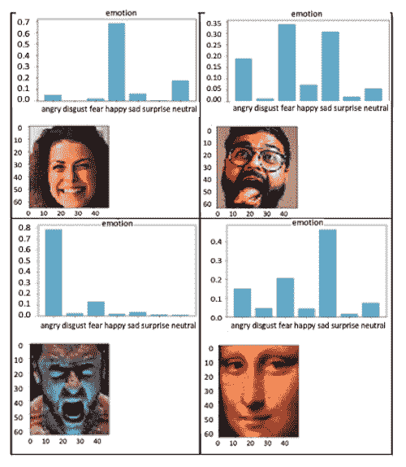

很清楚地检测到强烈的情感（笑脸或生气的脸）。 CNN 模型能够正确预测各种情感，甚至微妙的情感。

# 3D 人脸检测概述

3D 面部识别涉及测量面部中刚性特征的几何形状。 通常是通过使用飞行时间，测距相机生成 3D 图像或从对象的 360 度方向获取多个图像来获得的。 传统的 2D 相机将 3D 空间转换为 2D 图像，这就是为什么深度感应是计算机视觉的基本挑战之一的原因。 基于飞行时间的深度估计基于光脉冲从光源传播到物体再返回到相机所需的时间。 同步光源和图像获取深度。 飞行时间传感器能够实时估计全深度帧。 飞行时间的主要问题是空间分辨率低。 3D 人脸识别可以分为以下三个部分：

*   3D 重建的硬件设计概述
*   3D 重建和跟踪概述
*   参数化跟踪概述

# 3D 重建的硬件设计概述

3D 重建涉及相机，传感器，照明和深度估计。 3D 重建中使用的传感器可以分为三类：

*   **多视图设置**：具有受控照明的经过校准的密集立体摄像机数组。 从每个立体对中，使用三角剖分重构面部几何形状，然后在加强几何一致性的同时进行聚合。
*   **RGB 照相机**：组合多个 RGB 照相机以基于飞行时间方法计算深度。
*   **RGBD 摄像机**：RGBD 摄像机同时捕获颜色和深度-例如 Microsoft Kinect，Primesense Carmine 和 Intel Realsense。

# 3D 重建和跟踪概述

3D 面部重建包括通过构造 CNN 通过使深度回归来从对应的 2D 图像估计 3D 面部的坐标。 下图以图形方式说明了这一点：

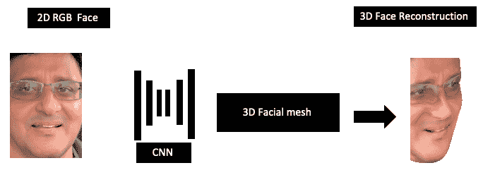

实时 3D 曲面贴图的一些流行算法描述如下：

*   **Kinect Fusion**：使用 Kinect 深度传感器的实时 3D 构造。 Kinect 是一种商品传感器平台，其中包含 30 Hz 的基于结构的飞行时间深度传感器。
*   **动态融合**：使用单个 Kinect 传感器使用体积 TSDF（截断有符号距离融合）技术的动态场景重建系统。 它需要一个嘈杂的深度图，并通过估计体积 6D 运动场来重建实时 3D 运动场景。
*   **Fusion4D**：这使用多个实时 RGBD 摄像机作为输入，并使用体积融合以及使用密集对应字段的非刚性对齐来处理多个图像。 该算法可以处理较大的帧到帧运动和拓扑更改，例如，人们快速脱下外套或从左到右更改其面部方向。
*   **Motion2Fusion**：此方法是用于实时（每秒 100 帧）重建的 360 度表现捕获系统。 它基于具有学习的 3D 嵌入的非刚性对齐策略，快速匹配策略，用于 3D 对应估计的机器学习以及用于复杂拓扑更改的后向/向前非刚性对齐策略。

# 参数化跟踪概述

面部跟踪模型将投影的线性 3D 模型用于摄像机输入。 它执行以下操作：

*   跟踪从前一帧到当前帧的视觉特征
*   对齐 2D 形状来跟踪特征
*   根据深度测量计算 3D 点云数据
*   最小化损失函数

# 总结

尽管由于各种肤色，方向，面部表情，头发颜色和光照条件而引起的复杂性，面部识别仍然是计算机视觉的成功故事。 在本章中，我们学习了面部检测技术。 对于每种技术，您都需要记住，面部检测需要大量训练有素的图像。 人脸检测已在许多视频监控应用中广泛使用，并且 Google，亚马逊，微软和英特尔等公司的基于云的设备和边缘设备均可使用标准 API。 我们将在“第 11 章”，“对具有 CPU/GPU 优化功能的边缘设备进行深度学习”中了解基于云的 API，并在“第 4 章”，“图像深度学习”，和第 5 章，“神经网络架构和模型”。 在本章中，简要介绍了用于面部检测和表情分类的 CNN 模型。

在下一章中，将详细说明 CNN。 这将帮助您了解 CNN 的构造块，为何选择某些功能块以及每个块在最终对象检测指标中的作用。 之后，我们将参考 “第 3 章”，“使用 OpenCV 和 CNN 进行面部检测”的示例，以评估如何优化 CNN 参数以更好地进行面部检测。