# 神经网络架构和模型

**卷积神经网络**（**CNN**）是计算机视觉中用于分类和检测对象的最广泛使用的工具。 CNN 通过堆叠许多不同的线性和非线性函数层，将输入图像映射到输出类别或边界框。 线性函数包括卷积，池化，全连接和 softmax 层，而非线性层是激活函数。 神经网络具有许多不同的参数和权重因子，需要针对给定的问题集进行优化。 随机梯度下降和反向传播是训练神经网络的两种方法。

在“第 4 章”，“图像深度学习”中，您学习了一些基本的编码技巧来构建和训练神经网络，并了解了特征图在不同层次上的视觉转换。 神经网络。 在本章中，您将深入了解神经网络架构和模型背后的理论，并了解诸如神经网络深度饱和，梯度梯度消失，由于大参数集导致的过拟合等关键概念。 这将帮助您为自己的研究目的创建自己的有效模型，并遵循在代码中应用这些理论的下几章的主题。

本章涵盖的主题如下：

*   AlexNet 概述
*   VGG16 概述
*   初始概述
*   ResNet 概述
*   R-CNN 概述
*   快速 R-CNN 概述
*   更快的 R-CNN 概述
*   GAN 概述
*   GNN 概述
*   强化学习概述
*   迁移学习概述

# AlexNet 概述

**AlexNet** 由 Alex Krizhevsky，Ilya Sutskever 和 Geoffrey E. Hinton 于 2012 年在名为《深度卷积神经网络的图像网络分类》中引入。 原始论文可以在[这个页面](http://www.cs.utoronto.ca/~ilya/pubs/2012/imgnet.pdf)中找到。

这是首次成功引入优化的 CNN 模型，以解决有关许多类别（超过 22,000 个）中的大量图像（超过 1,500 万个）的分类的计算机视觉问题。 在 AlexNet 之前，计算机视觉问题主要是通过传统的机器学习方法解决的，该方法通过收集更大的数据集并改进模型和技术以最大程度地减少过拟合来进行逐步改进。

CNN 模型根据前五位错误率对错误率进行分类，前五位错误率是指给定图像的真实类不在前五位预测类中的实例所占的百分比。 AlexNet 以 15.3% 的前五名错误率赢得了 2012 年 ILSVRC（ImageNet 大规模视觉识别挑战赛），与第二名的错误率 26.2% 的前五名遥遥领先。 下图显示了 AlexNet 架构：

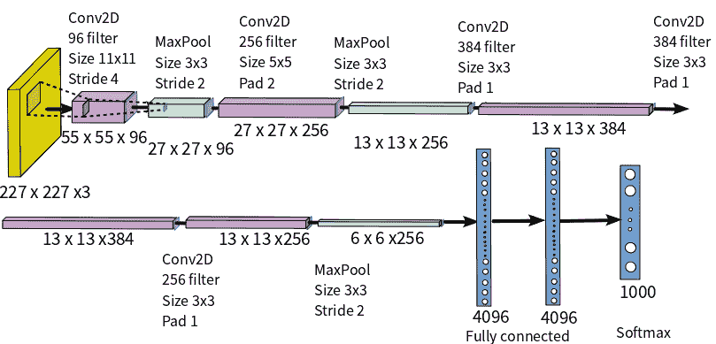

AlexNet 的基本思想总结如下：

*   它包含 8 个学习层-5 个卷积层和 3 个全连接层。
*   它使用大型内核过滤器-第一层有 96 个大小为`11 x 11`的过滤器，第二层有 256 个大小为`11 x 11`的过滤器，第三层和第四层有 384 个大小为`11 x 11`的过滤器，以及第五层有 256 个大小为`3 x 5`的过滤器。
*   ReLU 激活层在每个卷积和全连接层之后应用。 它的训练比 Tanh 快得多。
*   丢弃正则化应用于第一和第二全连接层。
*   两种数据增强技术可减少过拟合：
*   根据`256 x 256`的图像大小创建`256 x 256`的随机色块，并执行平移和水平反射
*   更改训练图像中 RGB 通道的强度
*   训练是在两个 GPU 上进行的，在 5 或 6 天内要进行 90 个时期的训练，以在两个 Nvidia GeForce 高端 GTX 580 GPU 上进行训练。
*   softmax 层的 1,000 个输出映射到 1,000 个 ImageNet 类中的每一个，以预测类的输出。

以下代码导入了运行 TensorFlow 后端所需的所有功能。 此模型导入`Sequential`模型，它是 Keras 中的逐层模型结构：

```py
from __future__ import print_function
import keras
from keras.models import Sequential
from keras.layers import Dense, Dropout, Activation, Flatten
from keras.layers import Conv2D, MaxPooling2D, ZeroPadding2D
from keras.layers.normalization import BatchNormalization
from keras.regularizers import l2
```

以下代码加载 CIFAR 数据集。

[CIFAR 数据集](https://www.cs.toronto.edu/~kriz/cifar.html)具有 10 个不同的类别，每个类别有 6,000 张图像。 这些类别包括飞机，汽车，鸟类，猫，鹿，狗，青蛙，马，船和卡车。 TensorFlow 具有内置的逻辑来导入 CIFAR 数据集。

数据集包含训练和测试图像，这些图像将用于开发模型（训练）并验证其结果（测试）。 每个数据集都有两个参数，`x`和`y`，分别表示图像的宽度（`x`）和高度（`y`）：

```py
from keras.datasets import cifar10
(x_train, y_train), (x_test, y_test) = cifar10.load_data()
```

神经网络具有许多不同的参数，需要对其进行优化-这些参数也称为模型常数。 对于 AlexNet，这些如下：

*   `batch_size`是一次向前或向后通过的`32`训练示例数。
*   `num_classes`是`2`。
*   `epochs`是`100`训练将重复的次数。
*   `data_augmentation`是`True`。
*   `num_predictions`是`20`。

让我们将输入向量转换为二进制类矩阵，因为在此示例中有两个类：

```py
y_train = keras.utils.to_categorical(y_train, num_classes)
y_test = keras.utils.to_categorical(y_test, num_classes)
# Initialize model
model = Sequential()
```

下表描述了不同 AlexNet 模型层的 TensorFlow 代码。 在随后的部分中，将介绍其他模型，但是创建模型的基本思想是相似的：

| **卷积和合并 1** | **卷积和合并 5** |
| 

```py
model.add(Conv2D(96, (11, 11), input_shape=x_train.shape[1:],
padding='same', kernel_regularizer=l2(l2_reg)))
model.add(BatchNormalization())
model.add(Activation('relu'))
model.add(MaxPooling2D(pool_size=(2, 2))
```

 | 

```py
model.add(ZeroPadding2D((1, 1)))
model.add(Conv2D(1024, (3, 3), padding='same'))
model.add(BatchNormalization())
model.add(Activation('relu'))
model.add(MaxPooling2D(pool_size=(2, 2)))
```

 |
| **卷积和合并 2** | **全连接 1** |
| 

```py
model.add(Conv2D(256, (5, 5), padding='same'))
model.add(BatchNormalization())
model.add(Activation('relu'))
model.add(MaxPooling2D(pool_size=(2, 2)))
```

 | 

```py
model.add(Flatten())
model.add(Dense(3072))
model.add(BatchNormalization())
model.add(Activation('relu'))
model.add(Dropout(0.5))
```

 |
| **卷积和合并 3** | **全连接 2** |
| 

```py
model.add(ZeroPadding2D((1, 1)))
model.add(Conv2D(512, (3, 3), padding='same'))
model.add(BatchNormalization())
model.add(Activation('relu'))
model.add(MaxPooling2D(pool_size=(2, 2)))
```

 | 

```py
model.add(Dense(4096))
model.add(BatchNormalization())
model.add(Activation('relu'))
model.add(Dropout(0.5))
```

 |
| **卷积和合并 4** | **全连接 3** |
| 

```py
model.add(ZeroPadding2D((1, 1)))
model.add(Conv2D(1024, (3, 3), padding='same'))
model.add(BatchNormalization())
model.add(Activation('relu'))
```

 | 

```py
model.add(Dense(num_classes))
model.add(BatchNormalization())
model.add(Activation('softmax'))
```

 |

下表描述了关键模型配置参数。 这应该为您概要概述需要优化以训练神经网络模型的参数：

*   **模型编译**：一旦开发了模型，下一步就是使用 TensorFlow 编译模型。 对于模型编译，我们需要定义两个参数：
*   **损失函数**：损失函数确定模型值与实际结果的接近程度。 分类交叉熵是最常见的损失函数，它使用对数值标度来确定损失，其输出值介于 0 到 1 之间，其中小输出表示小差异，大输出表示大差异。 也可以使用的另一个损失函数是 RMS（均方根）损失函数。
*   **优化器**：优化器微调模型的参数以最小化损失函数。 Adadelta 优化器根据过去梯度的移动窗口微调学习率。 常用的其他优化器是 Adam 优化器和 RMSprop 优化器。

以下代码显示了在 Keras 中进行模型编译时如何使用优化器：

```py
model.compile(loss = 'categorical_crossentropy',
              optimizer = keras.optimizers.Adadelta(),
              metrics = ['accuracy'])
```

构建模型后，必须先通过前述方法编译模型，然后才能将其用于预测（`model.predict()`）。

请注意，在本部分中，我们研究了 AlexNet，它在 2012 年赢得了 ILSVRC 竞赛。2013 年，开发了一个名为 ZFNet 的 AlexNet 更新版本，它使用 8 层像 AlexNet 一样，但是使用`7 x 7`滤镜而不是`7 x 7`过滤器。 在接下来的部分中，我们将发现使用较小的滤镜尺寸可以提高模型的准确率，因为保留了输入图像像素信息。

# VGG16 概述

自 2012 年 AlexNet 成功以来，越来越多的研究人员致力于改进 AlexNet 的 CNN 架构以提高准确率。 焦点转移到较小的窗口大小，较小的滤镜和较小的步幅。 VGG16 是由 Karen Simonyan 和 Andrew Zisserman 于 2014 年在《用于大规模图像识别的超深度卷积网络》中引入的。 可以在[这个页面](https://arxiv.org/abs/1409.1556)上阅读该论文。

在 ILSVRC-2014 中，该模型在 ImageNet 中的前五名测试准确率达到 92.7%。

下图显示了 VGG16 架构：

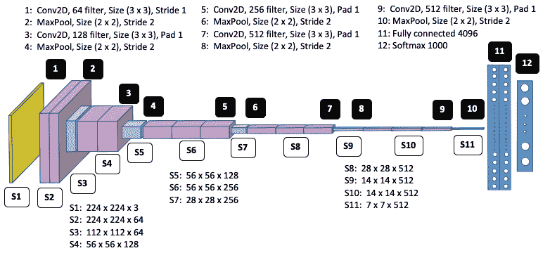

VGG16 的基本思想总结如下：

*   过滤器的最大尺寸为`3 x 3`，最小尺寸为`1 x 1`。这意味着与 AlexNet 的较大过滤器尺寸和较小的数量相比，使用较小的过滤器尺寸和较大的数量。 与 AlexNet 相比，这减少了参数。
*   对于`3 x 3`卷积层，卷积步幅为 1，填充为 1。 最大合并在跨度为 2 的`3 x 3`窗口上执行。
*   使用了三个非线性 ReLU 函数，而不是每一层中的一个，这通过减少消失梯度问题并使网络能够深入学习，使决策函数更具判别力。 在这里深入学习意味着学习复杂的形状，例如边缘，特征，边界等。
*   参数总数为 1.38 亿。

# 初始概述

在引入初始层之前，大多数 CNN 架构都具有标准配置-堆叠（串联）卷积，规范化，最大池化和激活层，然后是全连接 softmax 层。 这种架构导致神经网络的深度不断增加，这具有两个主要缺点：

*   过拟合
*   增加计算时间

初始模型通过从密集网络转移到稀疏矩阵并将它们聚类以形成密集子矩阵来解决了这两个问题。

初始模型也称为 GoogLeNet。 它是由 Christian Szegedy，Wei Liu，贾阳清，Pierre Sermanet，Scott Reed，Dragmir Anguelov，Dumitru Erhan，Vincent Vanhoucke 和 Andrew Rabinovich 在名为《Going Deeper with Convolutions》的论文中介绍的。 Inception 的名称来自 Min Lin，陈强和 Shuicheng Yan 的论文《网络中的网络》和著名的网络模因《We need to go deeper》。 以下是指向 Inception 论文和《网络中的网络》论文的链接：

*   [**Inception**](https://arxiv.org/abs/1409.4842)
*   [**网络中的网络**](https://arxiv.org/abs/1312.4400)

在论文《网络中的网络》中，作者没有在输入图像上使用常规的线性过滤器，而是构造了一个微神经网络，并以类似于 CNN 的方式在输入图像上滑动了该神经网络。 通过将这些层中的一些层堆叠在一起，可以构建一个深度神经网络。 微型神经网络（也称为**多层感知器**）由具有激活功能的多个全连接层组成，如下图所示：

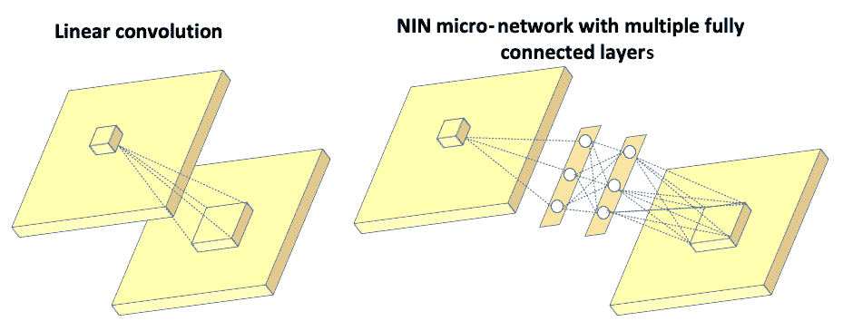

左图显示了传统 CNN 中的线性过滤器，它将输入图像连接到下一层。 右图显示了微网络，该微网络由多个全连接层组成，然后是将输入图像连接到下一层的激活功能。 这里的初始层是 NIN 的逻辑顶点，描述如下：

*   初始架构的主要思想是基于发现如何用易于获得的密集分量（`3 x 3`和`5 x 5`）补充 CNN 中的最佳局部稀疏（并行`1 x 1`多个）结构。 初始论文的作者找到了答案，方法是将`1 x 1`卷积与`3 x 3`、`5 x 5`卷积和池化层并行使用。 可以认为，附加的`1 x 1`卷积和 ReLU 相当于 NIN 微网络。 `1 x 1`卷积可作为降维机制，还有助于增加网络的宽度（通过并排堆叠）以及深度。 在同一层（起始层）中同时并行部署具有多个过滤器和池化层的多个卷积会导致该层是稀疏层，并且宽度增加。 `1 x 1`卷积由于较小的内核大小而遭受了较少的过拟合。
*   目的是让神经网络在训练网络时学习最佳权重，并自动选择更有用的功能。

*   为了进一步减小尺寸，在`3 x 3`和`3 x 3`卷积之前使用`3 x 3`卷积，如下图所示：


上图显示，在`3 x 3`和`3 x 3`层之前使用`3 x 3`层会导致尺寸减小约 30%，从 672（左图（a））减少到 480（右图（b）） 。 下图显示了完整的初始网络。 下图的中间部分中描述的完整的初始层太大，以致无法放入一页中，因此已被压缩。 不要在这里尝试阅读图表的每个元素，而应获得重复内容的整体思路。 初始层的关键重复模块已被放大，如下图的顶部和底部所示：

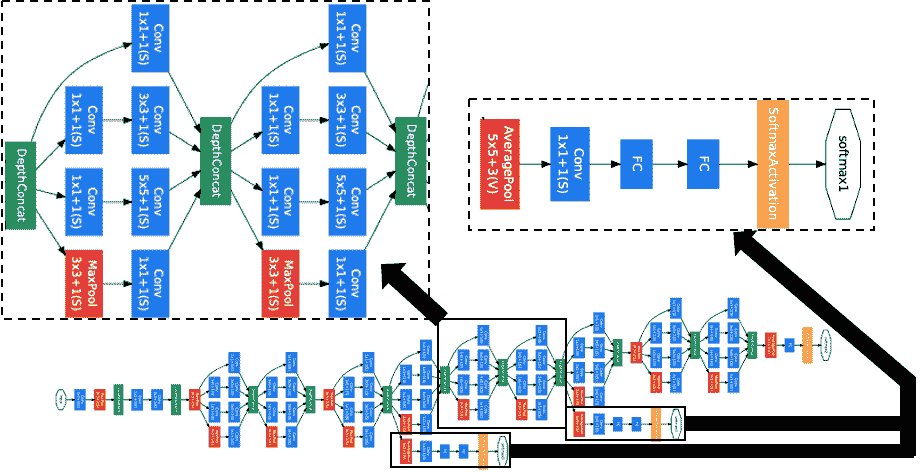

该网络包括以下部分：

*   `1 x 1`卷积，带 128 个滤镜，用于减小尺寸和校正线性激活
*   具有 1,024 个单元和 ReLU 激活的全连接层
*   丢包层，其丢包比率为 70%
*   一个具有 softmax 损失的线性层作为分类器（预测与主分类器相同的 1,000 个分类，但在推理时将其删除）

下图说明了初始网络中的 CNN 过滤器及其对应的连接：

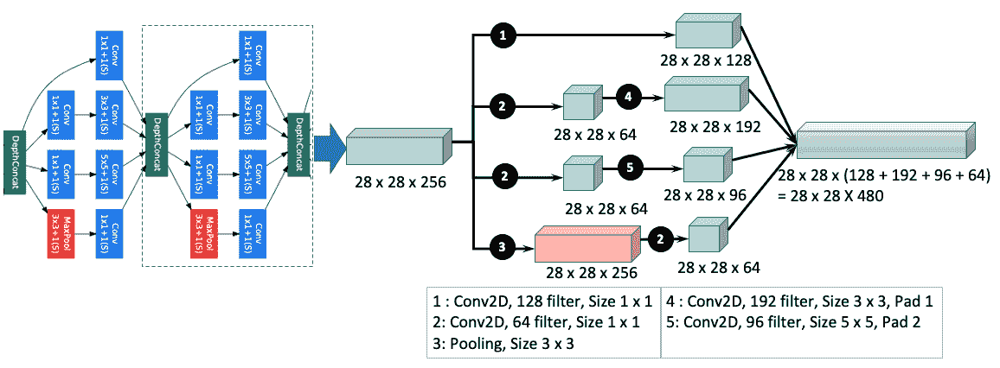

在上图中，深度连接层可以与最大池化层连接，也可以直接与`1 x 1`卷积层连接。 无论哪种方式，随后的计算都遵循与上图所示相同的模式。

# GoogLeNet 检测

初始网络（也称为 **GoogLeNet**）在区域卷积神经网络（R-CNN）的两阶段提议（基于颜色，纹理，大小和形状的区域提议，然后是 CNN 用于分类）的基础上进行了改进。

首先，它以改进的 CNN 替代了 AlexNet。 接下来，通过将选择性搜索（在 R-CNN 中）方法与用于更高对象边界框召回率的多框预测相结合，改进了区域提议步骤。 区域提议书减少了约 60%（从 2,000 减少到 1200），而覆盖率从 92% 增加到 93%，从而使单个模型案例的平均平均精度提高了 1%。 总体而言，准确率从 40% 提高到 43.9%。

# ResNet 概述

ResNet 由何凯敏，张向宇，任少卿和孙健在题为《图像识别的深度残差学习》的论文中介绍，目的是解决深度神经网络的精度下降问题。这种降级不是由过拟合引起的，而是由以下事实造成的：在某个临界深度之后，输出会松散输入的信息，因此输入和输出之间的相关性开始发散，从而导致精度增加。 可以在[这个页面](https://arxiv.org/abs/1512.03385)中找到该论文。

ResNet-34 的前五位验证错误为 5.71%，优于 BN-inception 和 VGG。 ResNet-152 的前五位验证错误为 4.49%。 由六个不同深度的模型组成的集合实现了 3.57% 的前五个验证误差，并在 ILSVRC-2015 中获得了第一名。 ILSVRC 代表 ImageNet 大规模视觉识别竞赛； 它评估了 2010 年至 2017 年的目标检测和图像分类算法。

ResNet 的主要功能描述如下：

*   通过引入深层的残差学习框架来解决降级问题。
*   该框架引入了快捷方式或跳过连接（跳过一个或多个层）的概念。
*   输入和下一层之间的基础映射为`H(x)`。
*   非线性层为`F(x) = H(x) – x`，可以将其重组为`H(x) = F(x) + x`，其中`x`是身份映射。
*   快捷方式连接仅执行身份映射，其输出将添加到堆叠层的输出中（请参见下图）：

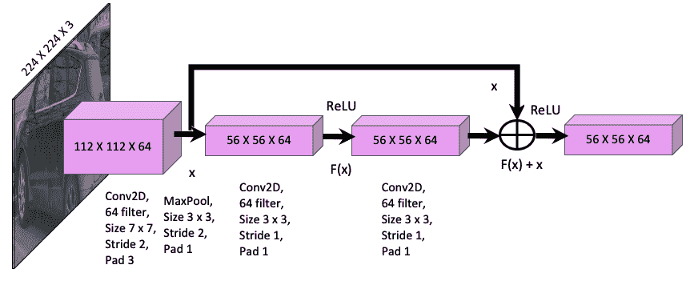

上图具有以下功能：

*   `F(x) + x`操作是通过快捷连接和元素添加来执行的。
*   身份快捷方式连接既不会增加额外的参数，也不会增加计算复杂度。

下图显示了完整的 ResNet 模型：


与**视觉几何组（VGG）**网络相比，此处显示的 ResNet 模型具有更少的过滤器和更低的复杂度。 不使用丢弃。 以下屏幕快照显示了各种神经网络模型之间的性能比较：


上图显示了以下内容：

*   **ImageNet 大规模视觉识别挑战**（**ILSVRC**）的各种 CNN 架构的得分和层数。
*   分数越低，性能越好。
*   AlexNet 的得分比其任何前任都要好得多，然后在随后的每一年中，随着层数越来越大，CNN 的质量不断提高。
*   如此处所述，ResNet 得分最高，比 AlexNet 高出四倍。

# R-CNN 概述

**基于区域的 CNN**（**R-CNN**）由 Ross Girshick，Jeff Donahue，Trevor Darrell 和 Jitendra Malik 在题为《可用于精确的对象检测和语义分割丰富特征层次结构》的论文中进行了介绍。 它是一种简单且可扩展的对象检测算法，与 VOC2012 上的最佳结果相比，其平均平均精度提高了 30% 以上。 可以在[这里](https://arxiv.org/abs/1311.2524)阅读本文。

VOC 代表[视觉对象类](http://host.robots.ox.ac.uk/pascal/VOC)，而 PASCAL 代表模式分析统计建模和计算学习。 从 2005 年到 2012 年，PASCAL VOC 在对象类识别方面面临挑战。 PASCAL VOC 注释广泛用于对象检测，并且使用`.xml`格式。

整个对象检测模型分为图像分割，基于选择性搜索的区域提议，使用 CNN 的特征提取和分类以及使用**支持向量机（SVM）**的包围盒形成，如下图所示 ：

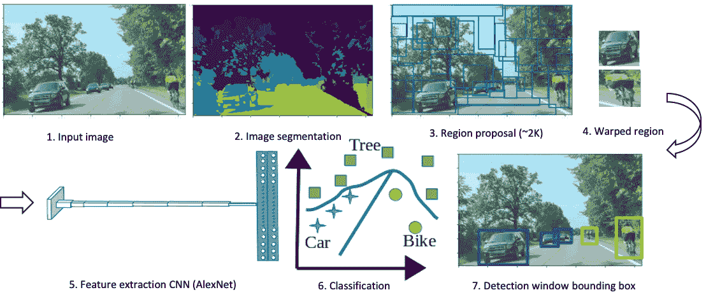

上图显示了将道路上的汽车和自行车的输入图像转换为对象检测边界框的各个步骤。

在以下部分中，将详细描述每个步骤。

# 图像分割

图像分割是图像在多个区域中的表示。 分割图像中的每个区域都具有相似的特征，例如颜色，纹理和强度。

# 基于聚类的细分

K-means 是一种无监督的机器学习技术，它基于质心将相似的数据分为几组。K 均值聚类算法的关键步骤概述如下：

1.  选择`K`数据点作为任意位置的簇的初始数目。
2.  找到每个聚类质心和每个像素之间的距离，并将其分配给最近的聚类。
3.  更新每个群集的平均值。
4.  通过更改群集质心，重复此过程，直到最小化每个像素及其关联群集之间的总距离。

# 基于图的分割

有许多基于图的分割方法可用，但此处为 R-CNN 描述的一种方法是 Pedro Felzenszwalb 和 Daniel Huttenlocher 在题为《基于图的高效图像分割》的论文中介绍的方法。 可以在[这个页面](http://people.cs.uchicago.edu/~pff/papers/seg-ijcv.pdf)上阅读该论文。

此方法涉及将图像表示为图形（在本章的“GNN 概述”部分中提供了详细说明），然后从图形中选择边缘，其中每个像素都链接到图形中的节点，并且 通过边缘连接到相邻像素。 边缘上的权重代表像素之间的差异。 分割标准基于被边界分开的图像的相邻区域的变化程度。 通过评估阈值函数来定义边界，该阈值函数表示与相邻像素之间的强度差相比，沿着边界的像素之间的强度差。 基于区域之间边界的存在，将分割定义为粗略或精细。

# 选择性搜寻

物体检测的主要挑战是在图像中找到物体的精确位置。 图像中多个对象在不同的​​空间方向上很难找到图像中对象的边界。 例如，一个物体可以被遮盖并且只能部分可见。例如，一个人站在汽车后面； 我们可以看到汽车和汽车上方的人的身体。 选择性搜索用于解决此问题。 它将整个图像分为许多分割区域。 然后，它使用自下而上的方法将相似的区域合并为较大的区域。 选择性搜索使用生成的区域来找到对象的位置。 选择性搜索使用贪婪算法，根据大小，颜色和纹理将区域迭代地分组在一起。 选择性搜索中使用的步骤说明如下：

1.  首先，对两个最相似的区域进行评估并分组在一起。
2.  接下来，在所得区域和新区域之间计算新的相似度以形成新的组。
3.  重复对最相似区域进行分组的过程，直到该区域覆盖整个图像为止。

选择搜索之后是区域提议，下面的部分将对此进行描述。

# 区域提议

在此阶段，该算法使用前面描述的选择性搜索方法来提取大约 2,000 个与类别无关的区域提议。 与类别无关的区域提议用于识别图像中的多个区域，以使每个对象都能由图像中的至少一个区域很好地表示。 人类通过在图像中定位对象来自然地做到这一点，但是对于机器而言，需要确定对象的位置，然后将其与图像中的适当区域进行匹配以检测对象。

与图像分类不同，检测涉及图像定位，因此可以创建一个适当的区域来包围对象以检测该区域内的特征。 基于选择性搜索方法选择适当的区域，该方法通过基于颜色进行搜索，然后基于纹理，大小和形状进行搜索来计算相似区域。

# 特征提取

特征提取是将相似特征（例如边，角和线）分组为特征向量。 特征向量将图像的维数从`227 x 227`（约 51,529）降低到 4,096。 每个区域提议，无论其大小如何，都首先通过膨胀和翘曲将其转换为`227 x 227`的大小。 这是必需的，因为 AlexNet 的输入图像大小为`227 x 227`。使用 AlexNet 从每个区域提取 4,096 个特征向量。 特征矩阵为`4,096 x 2,000`，因为每个图像都有 2,000 个区域提议。

原则上，只要修改输入图像的大小以适合网络的图像大小，R-CNN 可以采用任何 CNN 模型（例如 AlexNet，ResNet，Inception 或 VGG）作为输入。 R-CNN 的作者比较了 AlexNet 和 VGG16 作为 R-CNN 的输入，发现 VGG16 的准确率高 8%，但比 AlexNet 的准确率高 7 倍。

# 图像分类

通过 AlexNet 提取特征后，图像的分类包括将特征向量通过特定于类别的线性 SVM 进行分类，以对区域提议中对象的存在进行分类。 使用 SVM 是一种受监督的机器学习方法，该方法将权重和偏差分配给每个特征向量，然后画一条线将对象分成特定的类。 通过确定每个矢量与直线的距离，然后定位直线，使间距最大，从而完成分隔。

# 边界框回归

边界框回归可预测对象在图像中的位置。 在支持向量机之后，建立线性回归模型以预测边界框检测窗口的位置和大小。 对象的边界框由四个锚定值[`x`，`y`，`w`，`h`]定义，其中`x`是边界框原点的`x`坐标，`y`是边界框原点的`y`坐标，`w`是边框的宽度，`h`是边框的高度。

回归技术试图通过调整四个锚定值中的每个锚定值，将预测值与地面真实（目标）值进行比较，以使边界框预测中的误差最小化。

# 快速 R-CNN 概述

R-CNN 在对象检测方面比以前的任何一种方法都有了更显着的改进，但是它很慢，因为它对每个区域提议都对 CNN 进行了前向传递。 此外，训练是一个多阶段流程，包括首先针对区域提议优化 CNN，然后运行 SVM 进行对象分类，然后使用包围盒回归器绘制包围盒。 也是 R-CNN 的创建者的 Ross Girschick 提出了一种称为快速 R-CNN 的模型，以使用单阶段训练方法来改进检测。 下图显示了快速 R-CNN 的架构：

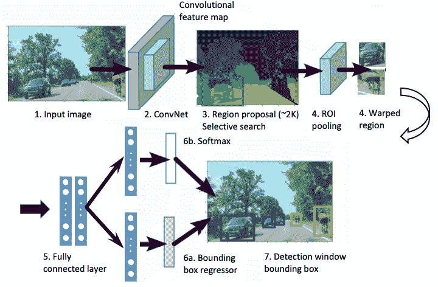

快速 R-CNN 中使用的步骤如下：

1.  快速 R-CNN 网络使用多个卷积和最大池化层处理整个图像，以生成特征图。
2.  将特征图输入到选择性搜索中以生成区域提议。
3.  对于每个区域提议，使用**兴趣区域**（**RoI**）最大池来提取固定长度的特征向量（`h = 7 x w = 7`）。
4.  此特征向量值成为由两个分支分隔的**全连接**（**FC**）层的输入：

*   用于分类概率的 Softmax
*   每个对象类别的边界框位置和大小（`x`，`y`，宽度，高度）。

所有网络权重都使用反向传播进行训练，并且在前向和后向路径之间共享计算和内存，以进行损耗和权重计算； 这将大型网络中的训练时间从 84 小时（R-CNN）减少到 9.5 小时（快速 R-CNN）。 快速 R-CNN 使用 softmax 分类器代替 SVM（R-CNN）。 下表针对小型（S），中型（M）和大型（L）网络显示 softmax 的平均平均精度略胜于 SVM 的平均精度：

| **VOC07​​** |`S`|`M`|`L`|
| **SVM** | 56.3 | 58.7 | 66.8 |
| **Softmax** | 57.1 | 59.2 | 66.9 |

SVM 和 softmax 之间的结果差异很小，这说明与使用 SVM 的多阶段训练相比，使用 softmax 的单次微调就足够了。 提案数量超过 4,000 个时，导致平均平均精度降低了大约 1%，而当提案数量达到 2,000 至 4,000 个时，实际上使精度提高了大约 0.5%。

# 更快的 R-CNN 概述

R-CNN 和 Fast R-CNN 都依赖于选择性搜索方法来开发 2,000 个区域的方案，这导致每幅图像的检测速度为 2 秒，而最有效的检测方法为 0.2 秒。 任少渠，何开明，罗斯·吉尔希克和孙健写了一篇名为 《Faster R-CNN：借助区域提议网络实现实时目标检测》的论文，以提高目标检测的速度和准确率。 您可以在[这里](https://arxiv.org/abs/1506.01497)阅读本文。

下图显示了更快的 R-CNN 的架构：


关键概念显示在以下列表中：

*   将输入图像引入**区域提议网络**（**RPN**），该网络为给定图像输出一组矩形区域提议。
*   RPN 与最新的物体检测网络共享卷积层。
*   RPN 通过反向传播和**随机梯度下降**（**SGD**）进行训练。

快速 R-CNN 中的对象检测网络类似于快速 R-CNN。 下图显示了使用更快的 R-CNN 进行的一些对象检测输出：

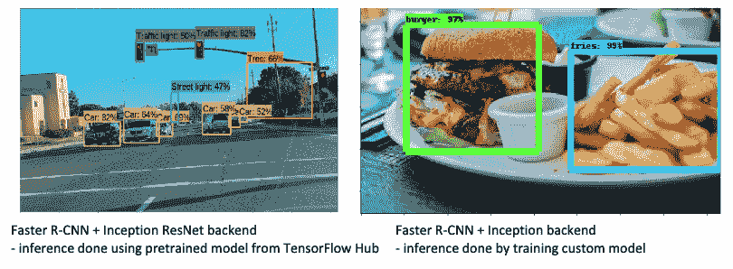

上图显示了使用更快的 R-CNN 模型进行的推理。 在“第 10 章”，“使用 R-CNN，SSD 和 R-FCN”进行对象检测中，您将学习如何自己生成这种类型的图形。 左图是使用 TensorFlow Hub 中的预训练模型生成的，而右图是通过训练自己的图像然后开发自己的模型来生成的。

通过遵循以下列表中概述的技术，可以获得上图中所示的高精度：

*   在两个网络之间共享卷积层：RPN 用于区域提议，快速 R-CNN 用于检测。
*   对于更快的 R-CNN，输入图像大小为`1,000 x 600`。
*   通过在卷积特征图输出上滑动大小为`60 x 40`的小窗口来生成 RPN。
*   每个滑动窗口都映射到 9 个锚点框（3 个比例，框区域分别为 128、256 和 512 像素，而 3 个比例为`1:1`、`1:2`和`2:1`）。
*   每个锚框都映射到一个区域提议。
*   每个滑动窗口都映射到 ZF 的 256-D 特征向量和 VGG 网络的 512-D 特征向量。
*   然后将此向量输入到两个全连接层中-框回归层和框分类层。
*   区域提议总数为 21,500（`60 x 40 x 9`）。

为了训练 RPN，基于与训练数据重叠的**交并比**（**IoU**）为每个锚定框分配一个二进制类别标签。 IoU 用于测量对象检测的准确率。 在“第 7 章”，“使用 YOLO 的对象检测”中详细描述。 现在，您已经足够知道 IoU 是以两个边界框之间的重叠面积与其联合面积之比来衡量的。 这意味着`IOU = 1`，这意味着两个完整的边界框重叠，因此您只能看到一个，而当`IoU = 0`时，这意味着两个边界框彼此完全分开。

二进制类级别具有正样本和负样本，它们具有以下属性：

*   **正样本**：IoU 为最大值或大于 0.7
*   **负样本**：IoU 小于 0.3

用于回归的特征具有相同的空间大小（高度和宽度）。 在实际图像中，特征尺寸可以不同。 通过使用具有不同回归比例和纵横比的可变包围盒大小来考虑到这一点。 RPN 和对象检测之间的卷积功能使用以下原则共享：

*   RPN 使用二进制课程级别进行训练。
*   检测网络通过快速 R-CNN 方法进行训练，并通过使用 RPN 训练的 ImageNet 预训练模型进行初始化。
*   通过保持共享卷积层固定并仅微调 RPN 唯一的层来初始化 RPN 训练。
*   前面的步骤导致两个网络的共享。
*   最后，通过保持共享卷积层固定，可以对快速 R-CNN 的全连接层进行微调。
*   所有上述步骤的组合导致两个网络共享相同的卷积层。

下表显示了 R-CNN，快速 R-CNN 和更快的 R-CNN 之间的比较：

| **参数** | **R-CNN** | **快速 R-CNN** | **更快的 R-CNN** |
| 输入值 | 图片 | 图片 | 图片 |
| 输入图像处理 | 基于像素相似度的图像分割 | 输入图像被馈送到 CNN 以生成卷积特征图。 | 输入图像被馈送到 CNN 以生成卷积特征图。 |
| 区域提议 | 使用选择性搜索在分割的图像上生成 2K 区域提议。 | 使用卷积特征图的选择性搜索生成 2K 区域提议。 | 区域提议是使用**区域提议网络**（**RPN**）生成的。 这个 CNN 使用`60 x 40`的滑动窗口，用于带有 9 个锚点框（3 个比例和 3 个宽高比）的要素地图的每个位置。 |
| 变形为固定大小 | 从区域提议中，每个区域都将变形为固定大小，以输入到 CNN。 | 使用 RoI 池化层中的最大池化，将区域提议扭曲为固定大小的正方形。 | 使用 RoI 池化层将区域提议扭曲为固定大小的正方形。 |
| 特征提取 | 每次将每个图像固定大小的 2K 变形区域提议送入 CNN。 | 2K 扭曲区域被馈送到两个分支，每个分支都包含一个全连接层。 | 2K 扭曲区域被馈送到全连接层。 |
| 侦测 | CNN 的输出传递到 SVM，以分类到边界框回归器以生成边界框。 | 全连接层的一个输出传递到 softmax 层进行分类，另一个输出传递到包围盒回归器以生成包围盒。 | 全连接层的一个输出传递到 softmax 层进行分类，另一个输出传递到包围盒回归器以生成包围盒。 |
| CNN 类型 | AlexNet | VGG 16 | ZFNet 或 VGGNet。 ZFNet 是 AlexNet 的修改版本。 |
| 区域提议 | 选择性搜索用于生成约 2,000 个区域提议。 | 选择性搜索用于生成约 2,000 个区域提议。 | CNN 用于生成约 21,500 个区域提议（`60 x 40 x 9`）。 |
| 卷积运算 | 每个图像进行 2K 次卷积操作。 | 每个图像进行一次卷积操作。 | 每个图像进行一次卷积操作。 |
| 区域提议和检测 | 区域提议和检测是分离的。 | 区域提议和检测是分离的。 | 区域提议和检测是耦合的。 |
| 训练时间 | 84 小时 | 9 小时 | 150 小时 |
| 测试时间 | 49 秒 | 2.43 秒 | 0.2 秒 |
| 地图（VOC 2007） | 66 | 66.9 | 66.9 |

上表清楚地显示了 R-CNN 算法的发展以及用于提高 R-CNN 算法准确率的方法。 这是我们从上表中学到的一些关键点：

*   图像分割和选择性搜索以确定像素相似度是一项耗时的操作，因为该操作是逐像素操作。
*   与选择搜索方法相比，使用滑动窗口的 CNN 操作在生成区域提议时要快得多。
*   将 CNN 应用于整个图像要比将 CNN 应用于图像中的区域，然后对给定图像重复此过程 2,000 次要快得多。

# GAN 概述

**生成对抗网络**（**GAN**）是一类 CNN，可以学习估计数据的概率分布。 GAN 由两个相互竞争的相互连接的神经网络组成，称为生成器和判别器。 生成器基于图像特征的噪声输入生成人工图像，判别器将人工图像与真实图像进行比较，以确定图像真实的可能性。 概率信息将传递到图像输入以在下一阶段学习。 下图说明了 GAN 的机制：


GAN 算法的分步说明如下：

1.  给定训练集`z`，生成器网络会获取代表图像特征的随机矢量，并通过 CNN 运行以生成人工图像`G`（`z`）。
2.  判别器网络是一个二进制分类器。 它获取真实图像和人造图像，并生成创建人造图像的概率`P(Z)`。
3.  判别器将概率信息提供给生成器，生成器使用该信息来改进其对图像`G`（`z`）的预测。

二进制分类器损失函数称为交叉熵损失函数，并表示为`-ylog(p) - (1 - y)log(1 - p)`，其中`p`是概率，`y`是期望值。

*   **判别器目标函数**：


*   **生成器目标函数**：


GAN 已经存在许多类型（超过 20 种），并且几乎每个月都会开发出更多类型的 GAN。 以下列表涵盖了 GAN 的两个主要重要变化：

*   **DCGAN（深度卷积 GAN）**：如原始 GAN 中所述，CNN 既用于判别器，又用于生成器。
*   **CGAN（条件 GAN）**：表示标签的条件向量用作生成网络和区分网络的附加输入。 噪声与标记向量一起被添加到生成网络中，从而检测标记中的变化。

GAN 的一些实际用例如下：

*   生成人造人脸图像和图像数据集
*   合并图像以形成新的数据集
*   生成卡通人物
*   从 2D 图像生成 3D 人脸和对象
*   语义图像翻译
*   从不同的彩色图像生成一组彩色图像
*   文字到图片翻译
*   人体姿势估计
*   照片编辑和修复

# GNN 概述

**图神经网络**（**GNN**）将 CNN 学习扩展到图形数据。 可以将图表示为节点和边的组合，其中节点代表图的特征，边连接相邻节点，如下图所示：


在此图像中，节点用实心白色点表示，边缘用连接点的线表示。

以下方程式描述了图形的关键参数：

*   
*   
*   

将图转换为由节点，边和节点之间的关系组成的向量的过程称为图嵌入。 嵌入向量可以由以下等式表示：


以下列表描述了上述方程式的元素：

*   `h[n]`为当前节点`n`的状态嵌入
*   `h_ne[n]`为节点`n`邻域的状态嵌入
*   `x[n]`为节点`n`的特征
*   `xe[n]`为节点`n`边缘的特征
*   `x_ne[n]`为节点`n`的邻域特征
*   `o[n]`为节点`n`的输出

如果`H`，`X`是通过堆叠所有状态和所有特征而构建的向量，则可以为 GNN 迭代状态写以下方程式：


根据 GNN 的类型，前面的一般等式可以导出为各种形式。 主要有两种分类：频谱 GNN 和非频谱 GNN。

# 光谱神经网络

频谱 GNN 首先由 Joan Bruna，Wojciech Zaremba，Arthus Szlam 和 Yann LeCun 在题为《频谱网络和图上的深局部连接网络》的论文中提出。 您可以在[这个页面](https://arxiv.org/pdf/1312.6203v3.pdf)中找到该论文的详细信息。

频谱 GNN 是傅立叶域中的卷积。 频谱 GNN 可用以下公式表示：


以下列表描述了上述方程式的元素：

*   `g[θ]`为过滤器参数，也可以视为卷积权重
*   `x`为输入信号
*   `U`为标准化图拉普拉斯的特征向量矩阵

Kipf 和 Welling（在其文章《使用图卷积网络进行半监督分类》中）进一步简化了此方法，以解决诸如以下这样的过拟合问题：


使用以下重新规范化，可以进一步简化此操作：


在此，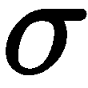代表激活功能。

下图说明了 GNN 的架构：


GNN 层汇总了来自其邻居的特征信息，并应用 ReLU 激活，合并以及全连接层和 s​​oftmax 层对图像中的不同特征进行分类。

# 强化学习概述

强化学习是机器学习的一种类型，其中代理根据当前累积的奖励信号的反馈来预测奖励（或结果），从而学会在当前环境中采取行动。 由克里斯托弗·沃特金斯（Christopher Watkins）在题为《从延迟奖励中学习》的论文中介绍的`Q`-学习是强化学习中最受欢迎的算法之一。`Q`表示质量-这是在产生奖励时特定行为的价值：

*   在每个学习状态下，`Q`表存储状态，操作和相应奖励的值。
*   代理在`Q`表中进行搜索，以执行使长期累积奖励最大化的下一个操作。
*   强化学习与有监督学习和无监督学习的主要不同之处在于：它不需要输入标签（有监督）或基础结构（无监督）就可以将对象分类。

下图说明了强化学习的概念。 代理人在某种状态下行动以产生行动，从而产生奖励。 动作价值会随着时间的推移而不断提高，以最大化回报：

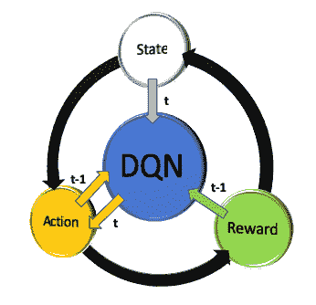

代理以某种状态（`s[t]`）启动，观察一系列观察结果，采取行动（`a[t]`）并接收 一份奖励。

最大化以下累积值函数，以在`Q`-学习方法中找到所需的输出：


以下列表描述了上述方程式的关键特征：

*   是旧值
*   是学习率
*   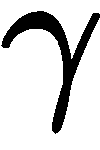是在立即奖励和预期延迟奖励之间进行折衷的折扣因子，α是学习率
*   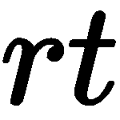是奖励
*   max 是学习值

由于`Q`学习包括对估计的动作值的最大化步长，因此它倾向于高估值。

在强化学习中，可以使用卷积网络来创建能够在复杂情况下获得积极回报的主体行为。 这个概念最早由 Mnih 等人提出，在 2015 年发表在题为《通过深度强化学习进行人为控制》的文章中。该文章可以在[这个页面](https://web.stanford.edu/class/psych209/Readings/MnihEtAlHassibis15NatureControlDeepRL.pdf)中找到本文的详细信息。

这包括三个卷积层和一个全连接隐藏层。 请注意，在强化学习中，卷积网络得出的解释与监督学习中得出的解释不同。 在监督学习中，CNN 用于将图像分类为不同的类别。 在强化学习中，图片代表一种状态，而 CNN 用于创建代理在该状态下执行的动作。

# 迁移学习概述

到目前为止，我们已经学会了通过隔离设计工作来解决特定任务来构造 CNN 架构。 神经网络模型是深度密集型的，需要大量的训练数据，训练运行以及进行调优的专家知识才能获得高精度； 但是，作为人类，我们不会从头开始学习所有内容，而是向他人学习，而从云（互联网）学习。 当数据不足以供我们尝试分析的新课程使用时，迁移学习非常有用，但是在相似课程中存在大量预先存在的数据。 每个 CNN 模型（AlexNet，VGG16，ResNet 和 Inception）都已在 ImageNet ILSVRC 比赛数据集中进行了训练。 ImageNet 是一个数据集，在 22,000 个类别中包含超过 1500 万张带标签的图像。 ILSVRC 使用 ImageNet 的子集，在 1,000 个类别中的每个类别中都有大约 1,000 个图像。

在迁移学习中，可以修改针对其他情况开发的预训练模型，以用于我们的特定情况来预测我们自己的班级。 我们的想法是选择我们已经研究过的 CNN 架构，例如 AlexNet，VGG16，ResNet 和 Inception，冻结一层或两层，更改一些权重，并输入我们自己的数据来对类进行预测。 在“第 4 章”，“图像深度学习”中，我们了解了 CNN 如何查看和解释图像。

这些学习将用于构建迁移学习，因此，让我们在“第 4 章”，“图像深度学习”中总结在 CNN 可视化中学习的一些要点：

*   前几层基本上是汽车的通用特征（例如边缘检测，斑点检测等），中间层将边缘结合起来形成汽车的特征，例如轮胎，门把手，灯，仪表板， 等等，最后几层是非常抽象的，并且对于特定对象非常特定。
*   全连接层将其上一层的输出展平为单个向量，将其乘以不同的权重，然后在其上应用激活系数。 它使用机器学习**支持向量机**（**SVM**）类型的方法进行分类。

现在，我们理解了这些概念，我们将能够理解以下常用的迁移学习方法：

1.  删除并交换 softmax 层：

1.  使用 TensorFlow 取得在 ImageNet 上预先训练的 CNN，例如 VGG16，AlexNet，ResNet 或 Inception。
2.  删除最后一个 softmax 层，并将 CNN 的其余部分视为新数据集的固定特征提取器。
3.  用定义自己的类数的自定义 softmax 替换 softmax 层，并使用数据集训练结果模型。

2.  微调 ConvNet。 为了减少过拟合，请保持一些较早的层固定，并且仅微调网络的较高层部分。 正如我们在“第 4 章”，“图像深度学习”的可视化示例中所看到的那样，最后一层非常抽象，并且针对特定数据集进行了调整，因此冻结了整个模型并进行了更改 将“步骤 1”的 softmax 设置为新的 softmax 可能会导致更高的准确率。 为了提高准确率，最好从 CNN 的中间训练您的自定义图像，这样，在全连接层之前的最后几层将具有特定于您的应用程序的功能，这将导致更高的预测准确率。 在“第 6 章”，“使用迁移学习的视觉搜索”中，我们将对此概念进行编码，并看到从 CNN 中部附近开始训练的准确率提高。

# 概要

在本章中，我们了解了不同卷积网络（ConvNet）的架构，以及如何将 ConvNet 的不同层堆叠在一起以将各种输入分类为预定义的类。 我们了解了不同的图像分类模型，例如 AlexNet，VGGNet，Inception 和 ResNet，它们为何不同，它们解决了哪些问题以及它们的整体相似性。

我们了解了对象检测方法（例如 R-CNN），以及如何将其随时间转换为快速，快速的 R-CNN 用于边界框检测。 本章介绍了两个新模型 GAN 和 GNN，作为两个新的神经网络集。 本章最后介绍了强化学习和迁移学习。 我们了解到，在强化学习中，智能体与环境交互以基于奖励学习最佳策略（例如，在十字路口向左或向右转），而在迁移学习中，预先训练的模型（例如 VGG16）可以 通过优化 CNN 的后续层，可以根据新数据派生新类。

在下一章中，您将学习如何使用迁移学习来训练自己的神经网络，然后使用受过训练的网络进行视觉搜索。