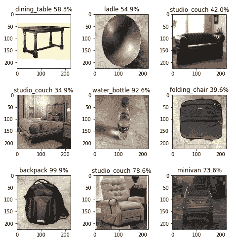
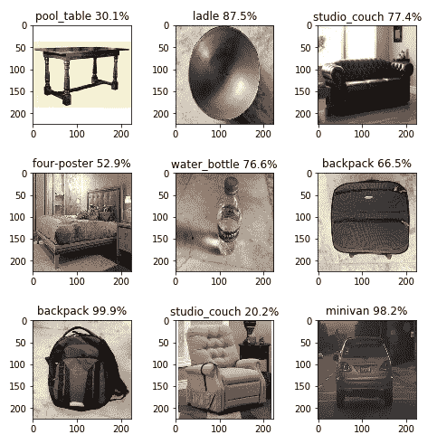
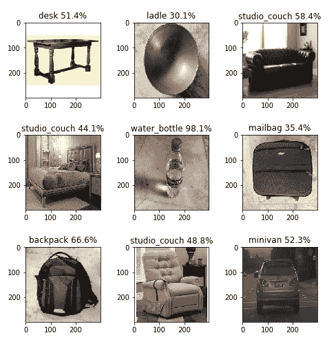
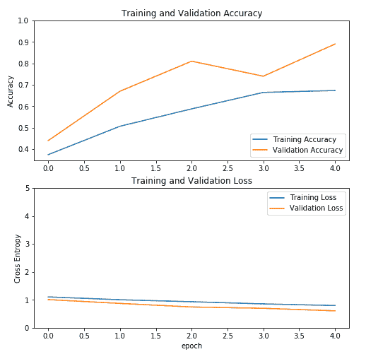
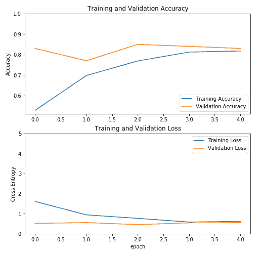
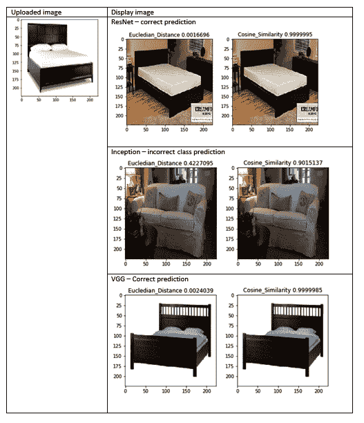
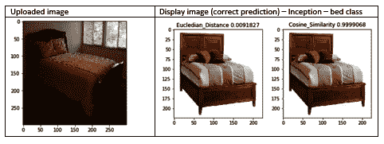
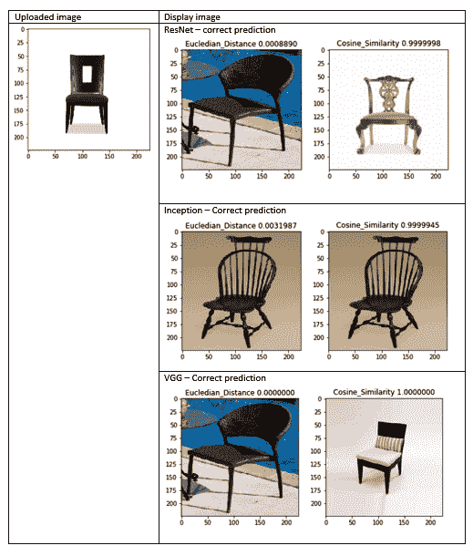
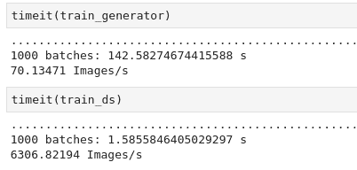

# 使用转移学习的视觉搜索

视觉搜索是一种显示与用户上传到零售网站的图像相似的图像的方法。 通过使用 CNN 将图像转换为特征向量，可以找到相似的图像。 视觉搜索在网上购物中具有许多应用，因为它补充了文本搜索，从而更好地表达了用户对产品的选择，并且更加精致。 购物者喜欢视觉发现，并发现它是传统购物体验所没有的独特东西。

在本章中，我们将使用在[第 4 章](../Text/4.html)，*图像深度学习*和[第 5 章](../Text/5.html)和*神经网络中学习的深度神经网络的概念。 体系结构和模型*。 我们将使用转移学习为图像类别开发神经网络模型，并将其应用于视觉搜索。 本章中的练习将帮助您开发足够的实践知识，以编写自己的神经网络代码和迁移学习。

本章涵盖的主题如下：

*   使用 TensorFlow 编码深度学习模型
*   使用 TensorFlow 开发转移学习模型
*   了解视觉搜索的体系结构和应用
*   使用`tf.data`处理视觉搜索输入数据管道

# 使用 TensorFlow 编码深度学习模型

我们在[第 5 章](../Text/5.html)，*神经网络架构和模型*中了解了各种深度学习模型的架构。 在本节中，我们将学习如何使用 TensorFlow / Keras 加载图像，浏览和预处理数据，然后应用三个 CNN 模型（VGG16，ResNet 和 Inception）的预训练权重来预测对象类别。

请注意，由于我们不是在构建模型，而是将使用已构建的模型（即具有预先训练的权重的模型）来预测图像类别，因此本部分不需要培训。

[本部分的代码可以在以下位置找到](https://github.com/PacktPublishing/Mastering-Computer-Vision-with-TensorFlow-2.0/blob/master/Chapter06/Chapter6_CNN_PretrainedModel.ipynb)。

让我们深入研究代码并了解其每一行的目的。

# 下载砝码

下载权重的代码如下：

```py
from tensorflow.keras.applications import VGG16
from keras.applications.vgg16 import preprocess_input
from tensorflow.keras.applications.resnet50 import ResNet50, preprocess_input
from tensorflow.keras.applications import InceptionV3
from keras.applications.inception_v3 import preprocess_input
```

前面的代码执行以下两个任务：

1.  权重将作为以下代码的输出的一部分按以下方式下载：

*   `Download VGG16 weight, the *.h5 file`
*   `Download Resnet50 weight, the *.h5 file`
*   `Download InceptionV3 weight, the *.h5 file`

2.  它对图像进行预处理，以将当前图像标准化为`ImageNet RGB`数据集。 由于该模型是在`ImageNet`数据集上开发的，因此，如果没有此步骤，该模型可能会导致错误的类预测。

# 解码预测

ImageNet 数据具有 1,000 个不同的类别。 诸如在 ImageNet 上训练的 Inception 之类的神经网络将以整数形式输出该类。 我们需要使用解码将整数转换为相应的类名称。 例如，如果输出的整数值为`311`，则需要解码`311`的含义。 通过解码，我们将知道`311`对应于折叠椅。

用于解码预测的代码如下：

```py
from tensorflow.keras.applications.vgg16 import decode_predictions
from tensorflow.keras.applications.resnet50 import decode_predictions
from tensorflow.keras.applications.inception_v3 import decode_predictions
```

前面的代码使用`decode_predictions`命令将类整数映射到类名称。 没有此步骤，您将无法预测类名。

# 导入其他常用功能

本节是关于导入 Keras 和 Python 的通用包的。 Keras `preprocessing`是 Keras 的图像处理模块。 其他常见导入功能的代码如下所示：

```py
from keras.preprocessing import image
import numpy as np
import matplotlib.pyplot as plt
import os
from os import listdir
```

您可以在前面的代码中观察以下内容：

*   我们加载了 Keras 图像预处理功能。
*   `numpy`是 Python 数组处理功能。
*   `matplotlib`是 Python 绘图功能。
*   需要`os`模块才能访问目录以输入文件。

# 建立模型

在本节中，我们将导入一个模型。 用于模型构建的代码如下所示（每个代码段的说明都在代码下方）：

```py
model = Modelx(weights='imagenet', include_top=True,input_shape=(img_height, img_width, 3))
Modelx = VGG16 or ResNet50 or InceptionV3
```

模型构建具有三个重要参数：

*   `weights` 是我们在以前下载的 ImageNet 图像上使用的预训练模型。
*   `include_top`功能指示是否应包含最终的致密层。 对于预训练模型的类别预测，始终为`True`； 但是，在本章的后面部分（*使用 TensorFlow* 开发转移学习模型）中，我们将学习到，在转移学习期间，此功能设置为`False`仅包含卷积层。
*   `input_shape`是通道的高度，宽度和数量。 由于我们正在处理彩色图像，因此通道数设置为`3`。

# 从目录输入图像

从目录输入图像的代码如下所示：

```py
folder_path = '/home/…/visual_search/imagecnn/'
images = os.listdir(folder_path)
fig = plt.figure(figsize=(8,8))
```

前面的代码指定图像文件夹路径，并定义了图像属性，以便能够在以后的部分中下载图像。 它还将图形尺寸指定为 8 x 8。

# 使用 TensorFlow Keras 导入多个图像并进行处理的循环功能

本节介绍如何批量导入多个图像以一起处理所有图像，而不是一个一个地导入它们。 这是学习的一项关键技能，因为在大多数生产应用程序中，您不会一步一步地导入图像。 使用 TensorFlow Keras 导入和处理多个图像的循环函数的代码如下：

```py
for image1 in images:
 i+=1
 im = image.load_img(folder_path+image1, target_size=(224, 224))
 img_data = image.img_to_array(im) 
img_data = np.expand_dims(img_data, axis=0)
img_data = preprocess_input(img_data)
resnet_feature = model_resnet.predict(img_data,verbose=0)
 label = decode_predictions(resnet_feature)
 label = label[0][0]
 fig.add_subplot(rows,columns,i)
 fig.subplots_adjust(hspace=.5)
 plt.imshow(im)
 stringprint ="%.1f" % round(label[2]*100,1)
 plt.title(label[1] + " " + str(stringprint) + "%")
plt.show()
```

前面的代码执行以下步骤：

1.  以`image1`作为循环的中间值，循环遍历`images`属性。
2.  `image.load`功能将每个新图像添加到文件夹路径。 请注意，对于 VGG16 和 ResNet，目标大小是`224`，对于启动，目标大小是`299`。
3.  使用 NumPy 数组将图像转换为数组函数并扩展其尺寸，然后按照*下载权重*部分中的说明应用`preprocessing`函数。
4.  接下来，它使用`model.predict()`函数计算特征向量。
5.  然后，预测解码类别标签名称。
6.  `label`函数存储为数组，并且具有两个元素：类名和置信度`%`。

7.  接下来的几节涉及使用`matplotlib`库进行绘图：

*   `fig.add_subplot`具有三个元素：`rows`，`columns`和`i` –例如，总共 9 幅图像分为三列三行，`i`术语将从`1`变为[ `1`是第一张图片，`9`是最后一张图片。
*   `fig.subplots_adjust`在图像之间添加垂直空间。
*   `plt.title`将标题添加到每个图像。

请注意，[完整的代码可以在本书的 GitHub 链接中找到](https://github.com/PacktPublishing/Mastering-Computer-Vision-with-TensorFlow-2.0/blob/master/Chapter06/Chapter6_CNN_PretrainedModel.ipynb)。

为了验证模型，将九张不同的图像存储在目录中，并逐个通过每个模型以生成预测。 下表显示了使用三种不同的神经网络模型对每个目标图像的最终预测输出：

| **目标图片** | **VGG16** | **ResNet** | **起始时间** |
| 餐桌 | 餐桌 58％ | 台球桌 30.1％ | 桌子 51％ |
| 炒锅 | 钢包 55％ | 钢包 87％ | 钢包 30％ |
| 沙发 | 单人沙发床 42％ | 单人沙发 77％ | 单人沙发 58％ |
| 床 | 单室沙发 35％ | 四海报 53％ | 单室沙发 44％ |
| 水壶 | 水壶 93％ | 水壶 77％ | 水壶 98％ |
| 行李 | 折叠椅 39％ | 背包 66％ | 邮袋 35％ |
| 背包 | 背包 99.9％ | 背包 99.9％ | 背包 66％ |
| 长椅 | 单人沙发 79％ | 单室沙发 20％ | 单人沙发 48％ |
| 越野车 | 小型货车 74％ | 小型货车 98％ | 小型货车 52％ |

下图显示了九个类的 VGG16 输出：



在上图中，您可以观察到以下内容：

*   每个图形尺寸为 224 x 224，标签的顶部打印有置信度百分比。
*   三种错误的预测：炒锅（预测为钢包），床（预测为工作室沙发）和行李（预测为折叠椅）。

下图显示了这九类的 ResNet 预测输出：



在上图中，您可以观察到以下内容：

*   每个图形尺寸为 224 x 224，标签的顶部打印有置信度百分比。
*   有两个错误的预测：炒锅（预测为钢包）和行李（预测为背包）。

下图显示了这九类的初始预测输出：



由此，您可以观察到以下内容：

*   每个图形尺寸为 224 x 224，标签的顶部打印有置信度百分比。
*   有两个错误的预测：炒锅（预测为钢包）和床（预测为工作室沙发）。

通过本练习，我们现在了解了如何在不训练单个图像的情况下使用预先训练的模型来预测知名的类对象。 我们之所以这样做，是因为每个图像模型都使用 ImageNet 数据库中的 1,000 个类别进行了训练，并且计算机视觉社区可以使用该模型产生的权重，以供其他模型使用。

在下一节中，我们将学习如何使用转移学习为自定义图像训练模型以进行预测，而不是从直接从 ImageNet 数据集开发的模型中进行推断。

# 使用 TensorFlow 开发转移学习模型

我们在[第 5 章](../Text/5.html)，*神经网络架构和模型*中引入了转移学习的概念，并在*编码深层中演示了如何基于预训练模型预测图像类别 TensorFlow* 部分的学习模型。 我们已经观察到，预训练模型在大型数据集上可以获得合理的准确性，但是我们可以通过在自己的数据集上训练模型来对此进行改进。 一种方法是构建整个模型（例如，ResNet）并在我们的数据集上对其进行训练-但是此过程可能需要大量时间才能运行模型，然后为我们自己的数据集优化模型参数。

另一种更有效的方法（称为**转移学习**）是从基本模型中提取特征向量，而无需在 ImageNet 数据集上训练顶层，然后添加我们的自定义完全连接层，包括激活，退出和 softmax，构成我们的最终模型。 我们冻结了基础模型，但是新添加的组件的顶层仍未冻结。 我们在自己的数据集上训练新创建的模型以生成预测。 从大型模型转移学习的特征图，然后通过微调高阶模型参数在我们自己的数据集上对其进行自定义的整个过程称为转移学习。 在接下来的几节中，将从*分析和存储数据*开始，说明迁移学习工作流程以及相关的 TensorFlow / Keras 代码。

# 分析和存储数据

首先，我们将从分析和存储数据开始。 在这里，我们正在构建具有三个不同类别的家具模型：`bed`，`chair`和`sofa`。 我们的目录结构如下。 每个图像都是大小为 224 x 224 的彩色图像。

`Furniture_images`：

*   `train`（2,700 张图像）
    *   `bed`（900 张图像）
    *   `chair`（900 张图像）
    *   `sofa`（900 张图像）

*   `val`（300 张图像）
    *   `bed`（100 张图像）
    *   `chair`（100 张图像）
    *   `sofa`（100 张图像）

注意，图像数量仅是示例； 在每种情况下都是独一无二的。 要注意的重要一点是，为了进行良好的检测，我们每班需要约 1,000 张图像，并且训练和验证的比例为 90％：10％。

# 导入 TensorFlow 库

我们的下一步是导入 TensorFlow 库。 以下代码导入 ResNet 模型权重和预处理的输入，与上一节中的操作类似。 我们在[第 5 章](https://cdp.packtpub.com/mastering_computer_vision_with_tensorflow_2_0/wp-admin/post.php?post=27&action=edit#post_30)，*神经网络架构和模型*中了解了每个概念：

```py
from tensorflow.keras.applications.resnet50 import ResNet50, preprocess_input
from tensorflow.keras.layers import Dense, Activation, Flatten, Dropout
from tensorflow.keras.models import Sequential, Model
from tensorflow.keras.optimizers import SGD, Adam
img_width, img_height = 224, 224
```

该代码还导入了​​几个深度学习参数，例如`Dense`（完全连接的层），`Activation`，`Flatten`和`Dropout`。 然后，我们导入顺序模型 API 以创建逐层模型，并使用**随机梯度下降**（ **SGD** ）和 Adam 优化器。 对于 ResNet 和 VGG，图像的高度和宽度为`224`，对于 Inception 模型，图像的高度和宽度为`299`。

# 设置模型参数

为了进行分析，我们设置模型参数，如以下代码块所示：

```py
NUM_EPOCHS = 5
batchsize = 10
num_train_images = 900
num_val_images = 100
```

然后，基础模型的构建类似于上一节中的示例，不同之处在于，我们不通过设置`include_top=False`来包括顶级模型：

```py
base_model = ResNet50(weights='imagenet',include_top=False,input_shape=(img_height, img_width, 3))
```

在此代码中，我们使用基本模型通过仅使用卷积层来生成特征向量。

# 建立输入数据管道

我们将导入一个图像数据生成器，该图像数据生成器使用诸如旋转，水平翻转，垂直翻转和数据预处理之类的数据增强来生成张量图像。 数据生成器将重复训练和验证数据。

# 训练数据生成器

让我们看一下用于训练数据生成器的以下代码：

```py
from keras.preprocessing.image import ImageDataGenerator
train_dir = '/home/…/visual_search/furniture_images/train'
train_datagen =  ImageDataGenerator(preprocessing_function=preprocess_input,rotation_range=90,horizontal_flip=True,vertical_flip=True)
```

目录 API 的流程-用于从目录导入数据。 它具有以下参数：

*   `Directory`：这是文件夹路径，应设置为存在所有三个类的图像的路径。 在这种情况下，示例为`train`目录的路径。 要获取路径，您可以将文件夹拖到终端，它会向您显示路径，然后可以将其复制并粘贴。
*   `Target_size`：将其设置为等于模型拍摄的图像大小，例如，对于 Inception 为 299 x 299，对于 ResNet 和 VGG16 为 224 x 224。
*   `Color_mode`：将黑白图像设置为`grayscale`，将彩色图像设置为`RGB`。
*   `Batch_size`：每批图像的数量。
*   `class_mode`：如果只有两个类别可以预测，则设置为二进制；否则，请设置为二进制。 如果不是，则设置为`categorical`。
*   `shuffle`：如果要重新排序图像，请设置为`True`； 否则，设置为`False`。
*   `seed`：随机种子，用于应用随机图像增强和混排图像顺序。

以下代码显示了如何编写最终的训练数据生成器，该数据将导入模型中：

```py
train_generator = train_datagen.flow_from_directory(train_dir,target_size=(img_height, img_width), batch_size=batchsize)
```

# 验证数据生成器

接下来，我们将在以下代码中重复验证过程。 该过程与训练生成器的过程相同，除了我们将验证图像目录而不是训练图像目录：

```py
from keras.preprocessing.image import ImageDataGenerator
val_dir = '/home/…/visual_search/furniture_images/val'
val_datagen =  ImageDataGenerator(preprocessing_function=preprocess_input,rotation_range=90,horizontal_flip=True,vertical_flip=True)
val_generator = val_datagen.flow_from_directory(val_dir,target_size=(img_height, img_width),batch_size=batchsize)
```

前面的代码显示了最终的验证数据生成器。

# 使用转移学习构建最终模型

我们首先定义一个名为`build_final_model()`的函数，该函数接收基本模型和模型参数，例如辍学，完全连接的层以及类的数量。 我们首先使用`layer.trainable = False`冻结基本模型。 然后，我们将基础模型输出特征向量展平，以进行后续处理。 接下来，我们添加一个完全连接的图层并将其放置到展平的特征向量上，以使用 softmax 图层预测新类：

```py
def build_final_model(base_model, dropout, fc_layers, num_classes):
 for layer in base_model.layers:
    layer.trainable = False
    x = base_model.output
    x = Flatten()(x)
    for fc in fc_layers:
    # New FC layer, random init
    x = Dense(fc, activation='relu')(x)
    x = Dropout(dropout)(x)
    # New softmax layer
    predictions = Dense(num_classes, activation='softmax')(x)
    final_model = Model(inputs=base_model.input, outputs=predictions)
        return final_model
    class_list = ["bed", "chair", "sofa"]
    FC_LAYERS = [1024, 1024]
    dropout = 0.3
    final_model = build_final_model(base_model,dropout=dropout,fc_layers=FC_LAYERS,num_classes=len(class_list))
```

使用带有分类交叉熵损失的`adam`优化器编译模型：

```py
adam = Adam(lr=0.00001)
final_model.compile(adam, loss='categorical_crossentropy', metrics=['accuracy'])
```

使用`model.fit_generator`命令开发并运行最终模型。 历史记录存储历元，每步时间，损失，准确性，验证损失和验证准确性：

```py
history = final_model.fit(train_dir,epochs=NUM_EPOCHS,steps_per_epoch=num_train_images // batchsize,callbacks=[checkpoint_callback],validation_data=val_dir, validation_steps=num_val_images // batchsize)
```

此处说明`model.fit()`的各种参数。 注意`mode.fit_generator`将来会被弃用，并由`model.fit()`功能代替，如上所示：

*   `train_dir`：输入训练数据； 其操作的详细信息已在上一节中进行了说明。
*   `epochs`：一个整数，指示训练模型的时期数。 时期从`1`递增到`epochs`的值。
*   `steps_per_epoch`：这是整数。 它显示了训练完成和开始下一个纪元训练之前的步骤总数（样本批次）。 其最大值等于（训练图像数/ `batch_size`）。 因此，如果有 900 张训练图像且批处理大小为 10，则每个时期的步数为 90。
*   `workers`：较高的值可确保 CPU 创建足够的批处理供 GPU 处理，并且 GPU 永远不会保持空闲状态。
*   `shuffle`：这是布尔类型。 它指示每个时期开始时批次的重新排序。 仅与`Sequence`（`keras.utils.Sequence`）一起使用。 当`steps_per_epoch`不是`None`时，它无效。
*   `Validation_data`：这是一个验证生成器。
*   `validation_steps`：这是`validation_data`生成器中使用的步骤总数（样品批次），等于验证数据集中的样品数量除以批次大小。

# 使用检查点保存模型

一个 TensorFlow 模型可以运行很长时间，因为每个时期都需要几分钟才能完成。 TensorFlow 有一个名为`Checkpoint`的命令，使我们能够在每个时期完成时保存中间模型。 因此，如果由于损失已经饱和而不得不在中间中断模型或将 PC 用于其他用途，则不必从头开始—您可以使用到目前为止开发的模型进行分析。 下面的代码块显示了对先前代码块的添加，以执行检查点：

```py
from tensorflow.keras.callbacks import ModelCheckpoint
filecheckpath="modelfurn_weight.hdf5"
checkpointer = ModelCheckpoint(filecheckpath, verbose=1, save_best_only=True)

history = final_model.fit_generator(train_generator, epochs=NUM_EPOCHS, workers=0,steps_per_epoch=num_train_images // batchsize, shuffle=True, validation_data=val_generator,validation_steps=num_val_images // batchsize, callbacks = [checkpointer])
```

前面代码的输出如下：

```py
89/90 [============================>.] - ETA: 2s - loss: 1.0830 - accuracy: 0.4011 Epoch 00001: val_loss improved from inf to 1.01586, saving model to modelfurn_weight.hdf5 90/90 [==============================] - 257s 3s/step - loss: 1.0834 - accuracy: 0.4022 - val_loss: 1.0159 - val_accuracy: 0.4800
 Epoch 2/5 89/90 [============================>.] - ETA: 2s - loss: 1.0229 - accuracy: 0.5067 Epoch 00002: val_loss improved from 1.01586 to 0.87938, saving model to modelfurn_weight.hdf5 90/90 [==============================] - 253s 3s/step - loss: 1.0220 - accuracy: 0.5067 - val_loss: 0.8794 - val_accuracy: 0.7300
 Epoch 3/5 89/90 [============================>.] - ETA: 2s - loss: 0.9404 - accuracy: 0.5719 Epoch 00003: val_loss improved from 0.87938 to 0.79207, saving model to modelfurn_weight.hdf5 90/90 [==============================] - 256s 3s/step - loss: 0.9403 - accuracy: 0.5700 - val_loss: 0.7921 - val_accuracy: 0.7900
 Epoch 4/5 89/90 [============================>.] - ETA: 2s - loss: 0.8826 - accuracy: 0.6326 Epoch 00004: val_loss improved from 0.79207 to 0.69984, saving model to modelfurn_weight.hdf5 90/90 [==============================] - 254s 3s/step - loss: 0.8824 - accuracy: 0.6322 - val_loss: 0.6998 - val_accuracy: 0.8300
 Epoch 5/5 89/90 [============================>.] - ETA: 2s - loss: 0.7865 - accuracy: 0.7090 Epoch 00005: val_loss improved from 0.69984 to 0.66693, saving model to modelfurn_weight.hdf5 90/90 [==============================] - 250s 3s/step - loss: 0.7865 - accuracy: 0.7089 - val_loss: 0.6669 - val_accuracy: 0.7700
```

输出显示每个时期的损失和准确性，并且相应的文件另存为`hdf5`文件。

# 绘制训练历史

使用 Python `matplotlib`函数显示了显示训练精度和每个时期的训练损失的折线图。 我们将首先导入`matplotlib`，然后为训练和验证损失以及准确性定义参数：

```py
import matplotlib.pyplot as plt
acc = history.history['accuracy']
val_acc = history.history['val_accuracy']
loss = history.history['loss']
val_loss = history.history['val_loss']
```

以下代码是使用 Keras 和 TensorFlow 绘制模型输出的标准代码。 我们首先定义图形大小（8 x 8），并使用子图函数显示`(2,1,1)`和`(2,1,2)`。 然后，我们定义标签，限制和标题：

```py
plt.figure(figsize=(8, 8))
plt.subplot(2, 1, 1)
plt.plot(acc, label='Training Accuracy')
plt.plot(val_acc, label='Validation Accuracy')
plt.legend(loc='lower right')
plt.ylabel('Accuracy')
plt.ylim([min(plt.ylim()),1])
plt.title('Training and Validation Accuracy')
plt.subplot(2, 1, 2)
plt.plot(loss, label='Training Loss')
plt.plot(val_loss, label='Validation Loss')
plt.legend(loc='upper right')
plt.ylabel('Cross Entropy')
plt.ylim([0,5.0])
plt.title('Training and Validation Loss')
plt.xlabel('epoch')
plt.show()
```

让我们看一下前面代码的输出。 以下屏幕截图显示了不同型号之间的精度比较。 它显示了 Inception 的训练参数：



在前面的屏幕截图中，您可以观察到 Inception 的准确性在五个时期内达到了约 90％。 接下来，我们绘制 VGG16 的训练参数：


上图显示 VGG16 的精度在五个时期内达到了约 80％。 接下来，我们绘制 ResNet 的训练参数：



前面的屏幕截图显示 ResNet 的准确性在四个时期内达到了约 80％。

对于所有三个型号，在四个时期内，精度始终达到至少 80％。 Inception 模型的结果具有最高的准确性。

# 了解视觉搜索的体系结构和应用

视觉搜索使用深度神经网络技术来检测和分类图像及其内容，并使用它在图像数据库内搜索以返回匹配结果列表。 视觉搜索与零售行业特别相关，因为它允许零售商显示大量类似于客户上传图像的图像以增加销售收入。视觉搜索可以与语音搜索结合使用，从而进一步增强搜索效果。 视觉信息比文本信息更相关，这导致视觉搜索更加流行。 许多不同的公司，包括 Google，Amazon，Pinterest，Wayfair，Walmart，Bing，ASOS，Neiman Marcus，IKEA，Argos 等，都建立了强大的视觉搜索引擎来改善客户体验。

# 视觉搜索的架构

诸如 ResNet，VGG16 和 Inception 之类的深度神经网络模型实质上可以分为两个部分：

*   第一个组件标识图像的低级内容，例如特征向量（边缘）。
*   第二部分表示图像的高级内容，例如最终的图像特征，它们是各种低级内容的集合。 下图说明了将七个类别分类的卷积神经网络：


上图显示了整个图像分类神经网络模型可以分为两个部分：卷积层和顶层。 在完全连接的层之前的最后一个卷积层是形状的特征向量（*＃个图像，X，Y，＃个通道*），并且被展平（*＃个图像，X * Y * 通道数*）以生成 n 维矢量。

特征向量形状具有四个分量：

*图像数量*表示训练图像的数量。 因此，如果您有 1,000 个训练图像，则该值为 1,000。
`X`表示层的宽度。 典型值为 14。
`Y`表示层的高度，可以是 14。
*通道数*表示过滤器的数量或深度 Conv2D。 典型值为 512。

在视觉搜索中，我们通过使用欧几里得距离或余弦相似度等工具比较两个特征向量的相似度来计算两个图像的相似度。 视觉搜索的架构如下所示：


此处列出了各个步骤：

1.  通过将顶层与知名模型（例如 ResNet，VGG16 或 Inception）分离，然后添加自定义顶层（包括完全连接的层，退出，激活和 softmax 层），使用转移学习来开发新模型。
2.  使用新的数据集训练新模型。
3.  通过刚刚开发的新模型运行图像，上传图像并找到其特征向量和图像类。
4.  为了节省时间，请仅在与上载图像相对应的目录类中进行搜索。
5.  使用诸如欧几里得距离或余弦相似度的算法进行搜索。
6.  如果余弦相似度> 0.999，则显示搜索结果；否则，显示搜索结果。 如果不是，请使用上传的图像重新训练模型，或者调整模型参数并重新运行该过程。
7.  为了进一步加快搜索速度，请使用生成的边界框检测上载图像内以及搜索图像数据库和目录内对象的位置。

上述流程图包含几个关键组件：

*   **模型开发：**这包括选择一个合适的预训练模型，除去其顶部附近的层，冻结之前的所有层，并添加一个新的顶层以匹配我们的班级。 这意味着，如果我们使用在 1,000 个类的 ImageNet 数据集上训练的预训练模型，我们将删除其顶层，并仅用 3 类`bed`，`chair`和`sofa`替换为新的顶层。 。
*   **模型训练：**这涉及首先编译模型，然后使用`model.fit()`功能开始训练。
*   **模型输出**：将上传的图像和测试图像数据库中的每个图像传递给模型，以生成特征向量。 上载的图像也用于确定模型类别。
*   **搜索算法**：搜索算法在给定类别指定的测试图像文件夹中执行，而不是在整个测试图像集中执行，从而节省了时间。 搜索算法依赖于 CNN 模型选择的正确类别。 如果类匹配不正确，则最终的视觉搜索将导致错误的结果。 要解决此问题，可以采取几个步骤：

1.  使用新的图像集重新运行模型，增加训练图像的大小，或改善模型参数。

2.  但是，无论使用多少数据，CNN 模型都永远不会具有 100％的准确性。 因此，为解决此问题，通常在视觉搜索结果中添加文本关键字搜索。 例如，客户可能会写*，您能找到一张与上图中显示的床相似的床吗？* 在这种情况下，我们知道上载的课程是床。 这是使用**自然语言处理**（ **NLP** ）完成的。
3.  解决该问题的另一种方法是针对多个预先训练的模型运行相同的上载图像，如果类别预测彼此不同，则采用模式值。

接下来，我们将详细说明用于视觉搜索的代码。

# 视觉搜索代码和说明

在本部分中，我们将解释用于视觉搜索的 TensorFlow 代码及其功能：

1.  首先，我们将为上传的图像指定一个文件夹（共有三个文件夹，我们将针对每种图像类型切换文件夹）。 请注意，此处显示的图像仅是示例； 您的图片可能有所不同：

```py
#img_path = '/home/…/visual_search/ test/bed/bed1.jpg'
#img_path ='/home/…/visual_search/test/chair/chair1.jpg'
#img_path ='/home/…/visual_search/test/sofa/sofa1.jpg'
```

2.  然后，我们将上传图像，将图像转换为数组，并像之前一样对图像进行预处理：

```py
img = image.load_img(img_path, target_size=(224, 224))
img_data = image.img_to_array(img)
img_data = np.expand_dims(img_data, axis=0)
img_data = preprocess_input(img_data)
```

前面的代码是在进一步处理之前将图像转换为数组的标准代码。

# 预测上传图像的类别

一旦上传了新图像，我们的任务就是找出它属于哪个类。 为此，我们计算图像可能属于的每个类别的概率，然后选择概率最高的类别。 此处的示例说明了使用 VGG 预训练模型进行的计算，但相同的概念在其他地方也适用：

```py
vgg_feature = final_model.predict(img_data,verbose=0)
vgg_feature_np = np.array(vgg_feature)
vgg_feature1D = vgg_feature_np.flatten()
print (vgg_feature1D)
y_prob = final_model.predict(img_data)
y_classes = y_prob.argmax(axis=-1)
print (y_classes)
```

在前面的代码中，我们使用`model.predict()`函数计算了图像属于特定类别的概率，并使用`probability.argmax`计算了类别名称以指示具有最高概率的类别。

# 预测所有图像的类别

以下函数导入必要的软件包，以从目录和相似度计算中获取文件。 然后，根据上传图像的输入类别指定要定位的文件夹：

```py
import os
from scipy.spatial import distance as dist
from sklearn.metrics.pairwise import cosine_similarity
if y_classes == [0]:
    path = 'furniture_images/val/bed'
elif y_classes == [1]:
    path = 'furniture_images/val/chair'
else:
    path = 'furniture_images/val/sofa'
```

以下函数循环遍历测试目录中的每个图像，并将该图像转换为数组，然后使用训练后的模型将其用于预测特征向量：

```py
mindist=10000
maxcosine =0
i=0
for filename in os.listdir(path):
    image_train = os.path.join(path, filename)
    i +=1
    imgtrain = image.load_img(image_train, target_size=(224, 224))
    img_data_train = image.img_to_array(imgtrain)
    img_data_train = np.expand_dims(img_data_train, axis=0)
    img_data_train = preprocess_input(img_data_train)
    vgg_feature_train = final_model.predict(img_data_train)
    vgg_feature_np_train = np.array(vgg_feature_train)
    vgg_feature_train1D = vgg_feature_np_train.flatten()
    eucldist = dist.euclidean(vgg_feature1D,vgg_feature_train1D)
    if mindist > eucldist:
        mindist=eucldist
        minfilename = filename
        #print (vgg16_feature_np)
    dot_product = np.dot(vgg_feature1D,vgg_feature_train1D)#normalize the results, to achieve     similarity measures independent #of the scale of the vectors
    norm_Y = np.linalg.norm(vgg_feature1D)
    norm_X = np.linalg.norm(vgg_feature_train1D)
    cosine_similarity = dot_product / (norm_X * norm_Y)
    if maxcosine < cosine_similarity:
        maxcosine=cosine_similarity
        cosfilename = filename
    print ("%s filename %f euclediandist %f cosine_similarity" %(filename,eucldist,cosine_similarity))
    print ("%s minfilename %f mineuclediandist %s cosfilename %f maxcosinesimilarity" %(minfilename,mindist, cosfilename, maxcosine))
```

您可以在前面的代码中观察以下内容：

*   将每个特征向量与上传的图像特征向量进行比较，以计算出欧几里得距离和余弦相似度。
*   通过确定欧几里得距离的最小值和余弦相似度的最大值来计算图像相似度。
*   确定并显示与最小距离相对应的图像文件。

[可以在本书的 GitHub 存储库中找到包括迁移学习和可视搜索的完整代码](https://github.com/PacktPublishing/Mastering-Computer-Vision-with-TensorFlow-2.0/blob/master/Chapter06/Chapter6_Transferlearning_VisualSearch.ipynb)。

下图显示了使用三种不同的模型和两种不同的搜索算法（欧几里得距离和余弦相似度）对一张床的上传图像的视觉搜索预测：



在上图中，可以观察到以下内容：

*   Inception 模型预测的类别不准确，这导致可视搜索模型预测了错误的类别。
*   请注意，视觉搜索模型无法捕获预测错误类的神经网络。 我们还可以使用其他模型检查同一张上载图片的类别预测，以查看模式（多数）值-在这种情况下，ResNet 和 VGG 预测为`bed`时为`bed`，而 Inception 预测为`sofa`。
*   综上所述，由于我们不知道给定的模型是否可以正确预测类别，因此建议的方法是同时使用三个或更多不同的模型预测上传图像的类别，然后选择具有多数值的预测类别。 使用这种方法，我们将增加我们预测的信心。

下图显示了使用其他上载图像的预测，这似乎是正确的：



下图显示了使用三种不同的模型和两种不同的搜索算法（欧几里得距离和余弦相似度）对椅子上载图像的视觉搜索预测：



您可以在上图中观察到以下内容：

*   尽管余弦相似度函数显示的图像与欧几里得距离函数的图像不同，但在所有情况下预测都是正确的。
*   两者似乎都非常接近，这两种显示方法为我们提供了一种显示多个图像的方法。 这意味着，如果用户上传一张椅子的图像并希望在在线目录中找到类似的椅子，我们的系统将显示两幅图像供用户选择，而不仅仅是一张图像，这将增加我们的销售机会 椅子。 如果两个图像相同，则算法将仅显示一个图像，否则将显示两个图像。 另一个选择是使用相同算法显示前两个匹配项。

下图显示了使用三种不同的模型和两种不同的搜索算法（欧几里得距离和余弦相似度）对沙发上载图像的视觉搜索预测：


您可以在上图中观察到以下内容：

*   尽管余弦相似度函数显示的图像与欧几里得距离函数的图像不同，但在所有情况下预测都是正确的。
*   两者似乎都非常接近，显示的两种方法为我们提供了一种显示多个图像的方法。 如前所述，对于与上载图像相似的两个图像，用户可以选择更多选项。

# 使用 tf.data 使用可视搜索输入管道

TensorFlow `tf.data` API 是一种高效的数据管道，其处理数据的速度比 Keras 数据输入过程快一个数量级。 它在分布式文件系统中聚合数据并对其进行批处理。 有关更多详细信息，请参阅[这里](https://www.tensorflow.org/guide/data)。

以下屏幕截图显示了`tf.data`与 Keras 图像输入过程的图像上传时间比较：



请注意，一千张图像大约需要 1.58 秒，比 Keras 图像输入过程快 90 倍。

这是`tf.data`的一些常见功能：

*   为了使该 API 起作用，您需要导入`pathlib`库。
*   `tf.data.Dataset.list_files`用于创建与模式匹配的所有文件的数据集。
*   `tf.strings.splot`基于定界符分割文件路径。
*   `tf.image.decode_jpeg`将 JPEG 图像解码为张量（请注意，转换必须没有文件路径）。
*   `tf.image.convert_image_dtype`将图像转换为 dtype float 32。

[以下链接提供了更新的视觉搜索代码](https://github.com/PacktPublishing/Mastering-Computer-Vision-with-TensorFlow-2.0/blob/master/Chapter06/Chapter6_Transferlearning_VisualSearch_tfdata_tensor.ipynb)。

如前所述，该代码包含`tf.data`。 除了`tf.data`以外，它还通过在`build_final_model`中进行以下更改来解冻模型的顶部：

```py
layer.trainable = True
layer_adjust = 100
for layer in base_model.layers[:layer_adjust]:
    layer.trainable = False
```

前面的更改使模型可以在第一百层之后开始训练，而不是仅训练最后几层。 如下图所示，此更改提高了准确性：


训练花费更多时间，但是模型的准确性接近 100％，而不是 90％。

在总结本章之前，让我们回顾一下训练 CNN 的两个重要概念：准确性和损失性。 Keras 将`y-pred`和`y-true`定义为模型预测值和地面真实值。 准确度定义为将`y-pred`与`y-true`进行比较，然后平均差异。 损失项（也称为熵）定义为乘积类别概率与分类指数的负和。 可能还有其他损耗项，例如 rms prop。 通常，如果`accuracy > 0.9`和`loss < 1`，训练会给出正确的输出。

# 概要

在本章中，我们学习了如何使用 TensorFlow / Keras 为上一章研究的深度学习模型开发转移学习代码。 我们学习了如何从包含多个类的目录中导入经过训练的图像，并使用它们来训练模型并进行预测。 然后，我们学习了如何使模型的基础层保持冻结状态，移除顶层并用我们自己的顶层替换它，并使用它来训练结果模型。

我们研究了视觉搜索的重要性以及如何使用转移学习来增强视觉搜索方法。 我们的示例包括三种不同类别的家具-我们了解了模型的准确性以及如何改善由此造成的损失。 在本章中，我们还学习了如何使用 TensorFlow `tf.data`输入管道在训练期间更快地处理图像。

在下一章中，我们将研究 YOLO，以便在图像和视频上绘制边界框对象检测，并将其用于进一步改善视觉搜索。