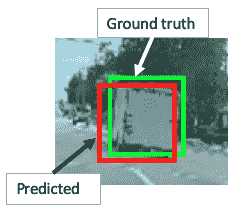
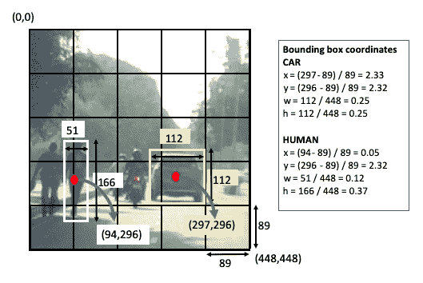
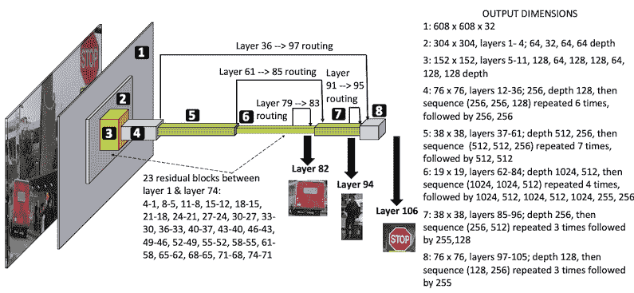
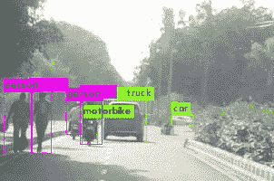
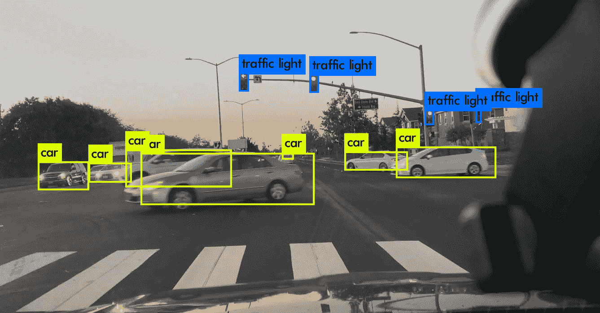
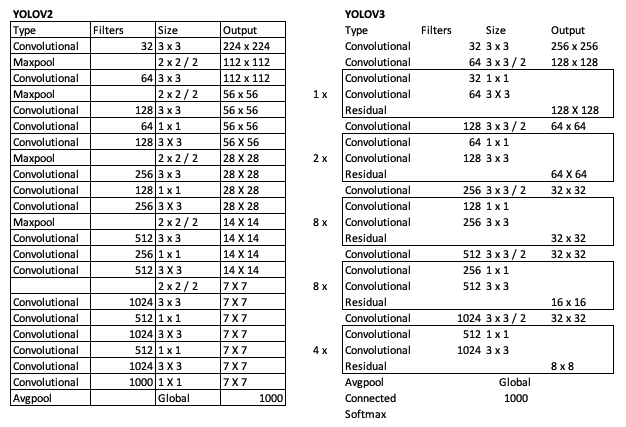
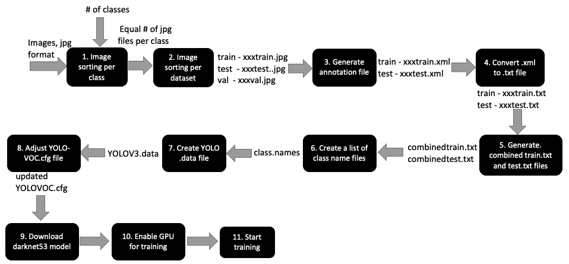
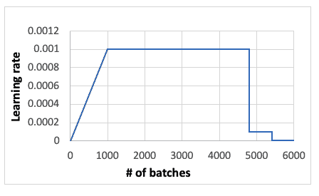
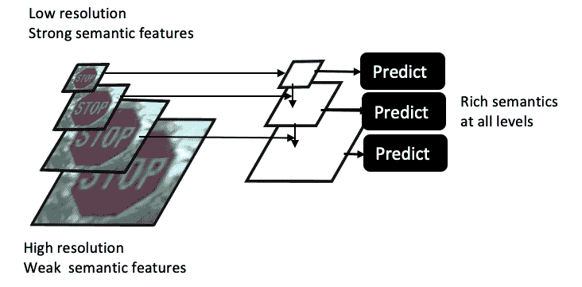

# 使用 YOLO 进行对象检测

在上一章中，我们详细讨论了各种神经网络图像分类和对象检测架构，这些架构利用多个步骤进行对象检测，分类和边界框优化。 在本章中，我们将介绍两种单阶段的快速对象检测方法-**仅查看一次**（**YOLO**）和 RetinaNet。 我们将讨论每个模型的架构，然后使用 YOLO v3 在真实的图像和视频中进行推理。 我们将向您展示如何使用 YOLO v3 优化配置参数和训练自己的自定义映像。

本章涵盖的主题如下：

*   YOLO 概述
*   用于对象检测的 Darknet 简介
*   使用 Darknet 和 Tiny Darknet 进行实时预测
*   比较 YOLO – YOLO 与 YOLO v2 与 YOLO v3
*   什么时候训练模型？
*   使用 YOLO v3 训练自己的图像集以开发自定义模型
*   特征金字塔和 RetinaNet 概述

# YOLO 概述

我们在“第 5 章”，“神经网络架构和模型”中了解到，每个已发布的神经网络架构都通过学习其架构和功能，然后开发一个全新的分类器来改进前一架构，从而改进它的准确率和检测时间。 YOLO 参加了**计算机视觉和模式识别会议（CVPR）**，在 2016 年中，Joseph Redmon，Santosh Divvala，Ross Girshick 和 Ali Farhadi 的论文 [《只看一次：统一的实时对象检测》](https://arxiv.org/pdf/1506.02640.pdf)。 YOLO 是一个非常快速的神经网络，可以以每秒 45 帧（基本 YOLO）到每秒 155 帧（快速 YOLO）的惊人速度一次检测多种物体。 相比之下，大多数手机相机以每秒 30 帧的速度捕获视频，而高速相机以每秒 250 帧的速度捕获视频。 YOLO 的每秒帧数等于大约 6 到 22 ms 的检测时间。 将此与人类大脑检测大约 13 毫秒图像所需的时间进行比较-YOLO 以与人类相似的方式立即识别图像。 因此，它为机器提供了即时目标检测功能。

在进一步研究细节之前，我们将首先讨论**交并比**（**IOU**）的概念。

# 借条的概念

**IOU** 是基于预测边界框和地面真实边界框（手工标记）之间的重叠程度的对象检测评估指标。 让我们看一下 IOU 的以下派生：


下图说明了 IOU，显示了一辆大型货车的预测和地面实况边界框：



在这种情况下，IOU 值接近`0.9`，因为重叠区域非常大。 如果两个边界框不重叠，则 IOU 值为`0`，如果它们确实重叠 100%，则 IOU 值为`1`。

# YOLO 如何如此快速地检测物体？

YOLO 的检测机制基于单个**卷积神经网络**（**CNN**），该预测同时预测对象的多个边界框以及在每个边界框中检测给定对象类别的可能性。 下图说明了这种方法：


前面的照片显示了三个主要步骤，从边界框的开发到使用非最大抑制和最终边界框。 具体步骤如下：

1.  YOLO 中的 CNN 使用整个图像中的特征来预测每个边界框。 因此，预测是全局的，而不是局部的。
2.  整个图像分为`S x S`个网格单元，每个网格单元预测`B`个边界框以及边界框包含对象的概率（`P`）。 因此，总共有`S x S x B`个边界框，每个边界框都有相应的概率。
3.  每个边界框包含五个预测（`x`，`y`，`w`，`h`和`c`），以下内容适用：

*   `o(x, y)`是边界框中心相对于网格单元坐标的坐标。
*   `o(w, h)`是边框相对于图像尺寸的宽度和高度。
*   `o(c)`是置信度预测，表示预测框和地面真实框之间的 IOU。

4.  网格单元包含对象的概率定义为类乘以 IOU 值的概率。 这意味着，如果网格单元仅部分包含一个对象，则其概率将较低，而 IOU 值将保持较低。 这将对该网格单元的边界框产生两个影响：

*   边界框的形状将小于完全包含对象的网格单元的边界框的大小，因为网格单元只能看到对象的一部分并从中推断出其形状。 如果网格单元仅包含对象的一小部分，则它可能根本无法识别该对象。
*   边界框类置信度将很低，因为部分图像产生的 IOU 值将不符合地面真实性预测。

5.  通常，每个网格单元只能包含一个类，但是使用锚框原理，可以将多个类分配给一个网格单元。 锚框是预定义的形状，表示要检测的类的形状。 例如，如果我们检测到三个类别（汽车，摩托车和人），那么我们可能可以通过两个锚框形状来解决-一个代表摩托车和人，另一个代表汽车。 可以通过查看先前图像中最右边的图像来确认。 我们可以通过使用 K 均值聚类等算法分析每个类的形状来确定锚框形状以形成训练 CSV 数据。

让我们以前面的图像为例。 在这里，我们有三类：`car`，`motorcycle`和`human`。 我们假设一个`5 x 5`的网格具有 2 个锚定框和 8 个维度（5 个边界框参数（`x`，`y`，`w`，`h`和`c`）和 3 类（`c1`，`c2`和`c3`））。 因此，输出向量大小为`5 x 5 x 2 x 8`。

我们为每个锚框重复两次`Y = [x, y, w, h, c, c1, c2, c3, x, y, w, h, c, c1, c2, c3]`参数。 下图说明了边界框坐标的计算：



图像的大小为`448 x 448`。此处，出于说明目的，显示了`human`和`car`两类的计算方法。 请注意，每个锚定框的大小为`448/5 ~ 89`。

# YOLO v3 神经网络架构

TYOLO v3 由 Joseph Redmon 和 Ali Farhadi 于 2018 年在论文[《YOLOv3：增量改进》](https://pjreddie.com/media/files/papers/YOLOv3.pdf)中引入。 下图显示了 YOLO v3 神经网络架构。 该网络具有 24 个卷积层和 2 个全连接层。 它没有任何 softmax 层。

下图以图形方式说明了 YOLO v3 架构：



YOLO v3 的最重要的功能是它的检测机制，它是在三种不同的规模上完成的-在第 82、94 和 106 层：

*   该网络由第 1 层和第 74 层之间的 23 个卷积和残差块组成，其中输入图像大小从`608`降低到`19`，深度通过交替的`3 x 3`和`1 x 1`个过滤器从`3`增长到`1,024` 。
*   除 5 种情况下，将步幅值`2`与`3 x 3`过滤器一起用于减小尺寸外，步幅通常保持为`1`。
*   剩余的块之后是交替的`1 x 1`和`1 x 1`过滤器的预卷积块，直到在第 82 层进行第一次检测为止。已经使用了两次短路-一个在第 61 和 85 层之间，另一个在第 36 和 97 层之间 。

# YOLO 与 Faster R-CNN 的比较

下表显示了 YOLO 和 Faster R-CNN 之间的相似之处：

| **YOLO** | **R-CNN** |
| --- | --- |
| 预测每个网格单元的边界框。 | 选择性搜索会为每个区域提议（实际上是一个网格单元）生成边界框。 |
| 使用边界框回归。 | 使用边界框回归。 |

下表显示了 YOLO 和 Faster R-CNN 之间的区别：

| **YOLO** | **R-CNN** |
| --- | --- |
| 分类和边界框回归同时发生。 | 选择性搜索会为每个区域提议生成一个边界框-这些是单独的事件。 |
| 每个图像 98 个边界框。 | 每个图像约有 2,000 个区域提议边界框。 |
| 每个网格单元 2 个锚点。 | 每个网格单元 9 个锚点。 |
| 它无法检测到小物体和彼此相邻的物体。 | 检测小物体和彼此相邻的物体。 |
| 快速算法。 | 更快的 R-CNN 比 YOLO 慢。 |

因此，总而言之，如果您需要生产级的准确率并且不太关心速度，请选择 Faster R-CNN。 但是，如果需要快速检测，请选择 YOLO。 像任何神经网络模型一样，您需要有足够的样本（大约 1,000 个）以不同的角度，不同的颜色和形状定向以做出良好的预测。 完成此操作后，根据我的个人经验，YOLO v3 会给出非常合理且快速的预测。

# 用于对象检测的 Darknet 简介

Darknet 是一个开放的神经网络框架，由 C 编写，并由 YOLO 的第一作者 Joseph Redmon 管理。 有关 Darknet 的详细信息，请访问 [pjreddie.com](https://pjreddie.com/)。 在本节中，我们将讨论用于对象检测的 Darknet 和 Tiny Darknet。

# 使用 Darknet 检测对象

在本节中，我们将从官方 Darknet 站点安装 Darknet，并将其用于对象检测。 请按照以下步骤在您的 PC 上安装 Darknet 并进行推断：

1.  在终端中应输入以下五行。 在每个命令行之后点击`Enter`。 这些步骤将从 GitHub 克隆 Darknet，这将在您的 PC 中创建 Darknet 目录，并获取 YOLO v3 权重，然后检测图像中的对象：

```py
git clone https://github.com/pjreddie/darknet.git
cd darknet
make
wget https://pjreddie.com/media/files/yolov3.weights
./darknet detect cfg/yolov3.cfg yolov3.weights data/carhumanbike.png
```

2.  执行`git clone`命令后，您将在终端中获得以下输出：

```py
 Cloning into 'darknet'...
 remote: Enumerating objects: 5901, done.
 remote: Total 5901 (delta 0), reused 0 (delta 0), pack-reused 5901
 Receiving objects: 100% (5901/5901), 6.16 MiB | 8.03 MiB/s, done.
 Resolving deltas: 100% (3916/3916), done.
```

3.  输入`wget yolov3`权重后，将在终端中获得以下输出：

```py
Resolving pjreddie.com (pjreddie.com)... 128.208.4.108
 Connecting to pjreddie.com (pjreddie.com)|128.208.4.108|:443... connected.
HTTP request sent, awaiting response... 200 OK
Length: 248007048 (237M) [application/octet-stream]
Saving to: 'yolov3.weights'
yolov3.weights                  100%[======================================================>] 236.52M  8.16MB/s    in 29s    
… (8.13 MB/s) - 'yolov3.weights' saved [248007048/248007048]
```

4.  然后，一旦输入`darknet$ ./darknet detect cfg/yolov3.cfg yolov3.weight data/carhumanbike.png`，您将在终端中获得以下输出：

```py
layer filters    size              input                output
 0 conv     32  3 x 3 / 1   608 x 608 x   3   ->   608 x 608 x  32  0.639 BFLOPs --> image size 608x608
 1 conv     64  3 x 3 / 2   608 x 608 x  32   ->   304 x 304 x  64  3.407 BFLOPs
 2 conv     32  1 x 1 / 1   304 x 304 x  64   ->   304 x 304 x  32  0.379 BFLOPs
 3 conv     64  3 x 3 / 1   304 x 304 x  32   ->   304 x 304 x  64  3.407 BFLOPs
 4 res    1                 304 x 304 x  64   ->   304 x 304 x  64 --> this implies residual block connecting layer 1 to 4
 5 conv    128  3 x 3 / 2   304 x 304 x  64   ->   152 x 152 x 128  3.407 BFLOPs
 6 conv     64  1 x 1 / 1   152 x 152 x 128   ->   152 x 152 x  64  0.379 BFLOPs
 7 conv    128  3 x 3 / 1   152 x 152 x  64   ->   152 x 152 x 128  3.407 BFLOPs
 8 res    5                 152 x 152 x 128   ->   152 x 152 x 128 --> this implies residual block connecting layer 5 to 8
 ...
 ...
 ...
 83 route 79 --> this implies layer 83 is connected to 79, layer 80-82 are prediction layers
 84 conv 256 1 x 1 / 1 19 x 19 x 512 -> 19 x 19 x 256 0.095 BFLOPs
 85 upsample 2x 19 x 19 x 256 -> 38 x 38 x 256 --> this implies image size increased by 2X
 86 route 85 61 --> this implies shortcut between layer 61 and 85
 87 conv 256 1 x 1 / 1 38 x 38 x 768 -> 38 x 38 x 256 0.568 BFLOPs
 88 conv 512 3 x 3 / 1 38 x 38 x 256 -> 38 x 38 x 512 3.407 BFLOPs
 89 conv 256 1 x 1 / 1 38 x 38 x 512 -> 38 x 38 x 256 0.379 BFLOPs
 90 conv 512 3 x 3 / 1 38 x 38 x 256 -> 38 x 38 x 512 3.407 BFLOPs
 91 conv 256 1 x 1 / 1 38 x 38 x 512 -> 38 x 38 x 256 0.379 BFLOPs
 92 conv 512 3 x 3 / 1 38 x 38 x 256 -> 38 x 38 x 512 3.407 BFLOPs
 93 conv 255 1 x 1 / 1 38 x 38 x 512 -> 38 x 38 x 255 0.377 BFLOPs
 94 yolo --> this implies prediction at layer 94
 95 route 91 --> this implies layer 95 is connected to 91, layer 92-94 are prediction layers
 96 conv 128 1 x 1 / 1 38 x 38 x 256 -> 38 x 38 x 128 0.095 BFLOPs
 97 upsample 2x 38 x 38 x 128 -> 76 x 76 x 128 à this implies image size increased by 2X
 98 route 97 36\. --> this implies shortcut between layer 36 and 97
 99 conv 128 1 x 1 / 1 76 x 76 x 384 -> 76 x 76 x 128 0.568 BFLOPs
 100 conv 256 3 x 3 / 1 76 x 76 x 128 -> 76 x 76 x 256 3.407 BFLOPs
 101 conv 128 1 x 1 / 1 76 x 76 x 256 -> 76 x 76 x 128 0.379 BFLOPs
 102 conv 256 3 x 3 / 1 76 x 76 x 128 -> 76 x 76 x 256 3.407 BFLOPs
 103 conv 128 1 x 1 / 1 76 x 76 x 256 -> 76 x 76 x 128 0.379 BFLOPs
 104 conv 256 3 x 3 / 1 76 x 76 x 128 -> 76 x 76 x 256 3.407 BFLOPs
 105 conv 255 1 x 1 / 1 76 x 76 x 256 -> 76 x 76 x 255 0.754 BFLOPs
 106 yolo --> this implies prediction at layer 106
```

执行代码后，您将看到完整的模型。 为简便起见，我们仅在前面的代码段中显示了模型的开头。

上面的输出描述了 YOLO v3 的详细神经网络构建块。 花一些时间来了解所有 106 个卷积层及其目的。 上一节提供了所有唯一代码行的说明。 前面的代码导致图像的以下输出：

```py
Loading weights from yolov3.weights...Done!
data/carhumanbike.png: Predicted in 16.140244 seconds.
car: 81%
truck: 63%
motorbike: 77%
car: 58%
person: 100%
person: 100%
person: 99%
person: 94%
```

预测输出如下所示：



YOLO v3 模型在预测方面做得很好。 即使是很远的汽车也能正确检测到。 前面的汽车分为汽车（在图中看不到标签）和卡车。 所有四个人（两个步行摩托车和两个骑摩托车）被检测到。 在两辆摩托车中，检测到一辆摩托车。 请注意，尽管汽车的颜色是黑色，但模型不会错误地将阴影检测为汽车。

# 使用 Tiny Darknet 检测对象

Tiny Darknet 是一个小型且快速的网络，可以非常快速地检测到对象。 它的大小为 4 MB，而 Darknet 的大小为 28 MB。 您可以在[这个页面](https://pjreddie.com/darknet/tiny-darknet/)中找到其实现的详细信息。

完成上述步骤后，Darknet 应该已经安装在您的 PC 上。 在终端中执行以下命令：

```py
$ cd darknet
darknet$ wget https://pjreddie.com/media/files/tiny.weights
```

前面的命令会将 Darknet 权重安装在`darknet`文件夹中。 您还应该在`cfg`文件夹中包含`tiny.cfg`。 然后，执行以下命令以检测对象。 在这里，我们将使用与参考 Darknet 模型相同的图像进行检测。 我们只是将权重和`cfg`文件从 Darknet 更改为 Tiny Darknet：

```py
darknet$ ./darknet detect cfg/tiny.cfg tiny.weights data /carhumanbike.png
```

与 Darknet 一样，前面的命令将显示 Tiny Darknet 模型的所有 21 层（Darknet 则为 106 层），如下所示：

```py
layer filters size input output
 0 conv 16 3 x 3 / 1 224 x 224 x 3 -> 224 x 224 x 16 0.043 BFLOPs
 1 max 2 x 2 / 2 224 x 224 x 16 -> 112 x 112 x 16
 2 conv 32 3 x 3 / 1 112 x 112 x 16 -> 112 x 112 x 32 0.116 BFLOPs
 3 max 2 x 2 / 2 112 x 112 x 32 -> 56 x 56 x 32
 4 conv 16 1 x 1 / 1 56 x 56 x 32 -> 56 x 56 x 16 0.003 BFLOPs
 5 conv 128 3 x 3 / 1 56 x 56 x 16 -> 56 x 56 x 128 0.116 BFLOPs
 6 conv 16 1 x 1 / 1 56 x 56 x 128 -> 56 x 56 x 16 0.013 BFLOPs
 7 conv 128 3 x 3 / 1 56 x 56 x 16 -> 56 x 56 x 128 0.116 BFLOPs
 8 max 2 x 2 / 2 56 x 56 x 128 -> 28 x 28 x 128
 9 conv 32 1 x 1 / 1 28 x 28 x 128 -> 28 x 28 x 32 0.006 BFLOPs
 10 conv 256 3 x 3 / 1 28 x 28 x 32 -> 28 x 28 x 256 0.116 BFLOPs
 11 conv 32 1 x 1 / 1 28 x 28 x 256 -> 28 x 28 x 32 0.013 BFLOPs
 12 conv 256 3 x 3 / 1 28 x 28 x 32 -> 28 x 28 x 256 0.116 BFLOPs
 13 max 2 x 2 / 2 28 x 28 x 256 -> 14 x 14 x 256
 14 conv 64 1 x 1 / 1 14 x 14 x 256 -> 14 x 14 x 64 0.006 BFLOPs
 15 conv 512 3 x 3 / 1 14 x 14 x 64 -> 14 x 14 x 512 0.116 BFLOPs
 16 conv 64 1 x 1 / 1 14 x 14 x 512 -> 14 x 14 x 64 0.013 BFLOPs
 17 conv 512 3 x 3 / 1 14 x 14 x 64 -> 14 x 14 x 512 0.116 BFLOPs
 18 conv 128 1 x 1 / 1 14 x 14 x 512 -> 14 x 14 x 128 0.026 BFLOPs
 19 conv 1000 1 x 1 / 1 14 x 14 x 128 -> 14 x 14 x1000 0.050 BFLOPs
 20 avg 14 x 14 x1000 -> 1000
 21 softmax 1000
Loading weights from tiny.weights...Done!
data/carhumanbike.png: Predicted in 0.125068 seconds.
```

但是，该模型无法检测图像中的对象。 我将检测更改为分类，如下所示：

```py
darknet$ ./darknet classify cfg/tiny.cfg tiny.weights data/dog.jpg
```

前面的命令生成的结果类似于 Tiny YOLO 链接中发布的结果（`wget https://pjreddie.com/media/files/tiny.weights`）：

```py
Loading weights from tiny.weights...Done!
data/dog.jpg: Predicted in 0.130953 seconds.
14.51%: malamute
 6.09%: Newfoundland
 5.59%: dogsled
 4.55%: standard schnauzer
 4.05%: Eskimo dog
```

但是，同一图像在通过对象检测时不会返回边界框。

接下来，我们将讨论使用 Darknet 对视频进行实时预测。

# 使用 Darknet 进行实时预测

涉及 Darknet 的预测都可以使用终端中的命令行来完成。 有关更多详细信息，请参阅[这里](https://pjreddie.com/darknet/yolo/)。

到目前为止，我们已经在图像上使用 Darknet 进行了推断。 在以下步骤中，我们将学习如何在视频文件上使用 Darknet 进行推理：

1.  通过在终端中键入`cd darknet`转到`darknet`目录（已在前面的步骤中安装）。
2.  确保已安装 OpenCV。 即使您已安装 OpenCV，它仍可能会创建一个错误标志。 使用`sudo apt-get install libopencv-dev`命令将 OpenCV 安装在`darknet`目录中。
3.  在`darknet`目录中，有一个名为`Makefile`的文件。 打开该文件，设置`OpenCV = 1`并保存。
4.  通过转到[这里](https://pjreddie.com/media/files/yolov3.weights)从终端下载权重。
5.  此时，由于更改了`Makefile`，因此必须重新编译。 您可以通过在终端中键入`make`来执行此操作。

6.  然后，通过在终端中键入以下命令来下载视频文件：

```py
./darknet detector demo cfg/coco.data cfg/yolov3.cfg yolov3.weights data/road_video.mp4
```

7.  如前所述，这里将编译具有 106 层的 YOLO 模型，并播放视频。 您会注意到视频播放非常慢。 可以通过以下两个步骤解决此问题。 它们应该一一执行，因为每个步骤都会产生影响。
8.  再次打开`Makefile`。 将`GPU`更改为`1`，保存`Makefile`，然后重复步骤 4 至 6。此时，我注意到步骤 6 提供了以下 CUDA `out of memory`错误：

```py
 …….
 57 conv    512  3 x 3 / 1    38 x  38 x 256   ->    38 x  38 x 512  3.407 BFLOPs
 58 res   55                  38 x  38 x 512   ->    38 x  38 x 512
 59 conv    256  1 x 1 / 1    38 x  38 x 512   ->    38 x  38 x 256  0.379 BFLOPs
 60 CUDA Error: out of memory
 darknet: ./src/cuda.c:36: check_error: Assertion `0' failed.
 Aborted (core dumped)
```

通过两种机制解决了该错误：

*   更改图像尺寸。
*   将 NVIDIA CUDA 版本从 9.0 更改为 10.1。 [请访问 NVIDIA 网站以更改 NVIDIA 版本](https://docs.nvidia.com/deploy/cuda-compatibility/index.html)。

首先，尝试更改图像尺寸。 如果这不起作用，则检查 CUDA 版本并更新（如果您仍在使用 9.0 版）。

9.  在`darknet`目录中，在`cfg`目录下有一个名为`yolov3.cfg`的文件。 打开该文件，并将宽度和高度从`608`更改为`416`或`288`。 我发现当将该值设置为`304`时，它仍然会失败。 保存文件并重复步骤 5 和 6。

这是将图像尺寸设置为`304`时将得到的错误代码：

```py
 .....
 80 conv   1024  3 x 3 / 1    10 x  10 x 512   ->    10 x  10 x1024  0.944 BFLOPs
 81 conv    255  1 x 1 / 1    10 x  10 x1024   ->    10 x  10 x 255  0.052 BFLOPs
 82 yolo
 83 route  79
 84 conv    256  1 x 1 / 1    10 x  10 x 512   ->    10 x  10 x 256  0.026 BFLOPs
 85 upsample            2x    10 x  10 x 256   ->    20 x  20 x 25
 86 route  85 61
 87 Layer before convolutional layer must output image.: File exists
 darknet: ./src/utils.c:256: error: Assertion `0' failed.
 Aborted (core dumped)
```

下图显示了带有交通标志标签和汽车检测的视频文件的屏幕截图：



请注意，所有汽车均被正确检测，甚至主交通灯和侧面交通灯也被检测到。

我们之前讨论了默认大小为`608`的 YOLO v3 层。 以下是相同的输出，其大小更改为`416`，以便正确显示视频文件：

```py
 layer     filters    size              input                output
 0 conv     32  3 x 3 / 1   416 x 416 x   3   ->   416 x 416 x  32  0.299 BFLOPs
 1 conv     64  3 x 3 / 2   416 x 416 x  32   ->   208 x 208 x  64  1.595 BFLOPs
 2 conv     32  1 x 1 / 1   208 x 208 x  64   ->   208 x 208 x  32  0.177 BFLOPs
 3 conv     64  3 x 3 / 1   208 x 208 x  32   ->   208 x 208 x  64  1.595 BFLOPs
 4 res    1                 208 x 208 x  64   ->   208 x 208 x  64
 5 conv    128  3 x 3 / 2   208 x 208 x  64   ->   104 x 104 x 128  1.595 BFLOPs
 6 conv     64  1 x 1 / 1   104 x 104 x 128   ->   104 x 104 x  64  0.177 BFLOPs
 7 conv    128  3 x 3 / 1   104 x 104 x  64   ->   104 x 104 x 128  1.595 BFLOPs
 8 res    5                 104 x 104 x 128   ->   104 x 104 x 128
 ...
 ...
 ...
 94 yolo
 95 route  91
 96 conv    128  1 x 1 / 1    26 x  26 x 256   ->    26 x  26 x 128  0.044 BFLOPs
 97 upsample            2x    26 x  26 x 128   ->    52 x  52 x 128
 98 route  97 36
 99 conv    128  1 x 1 / 1    52 x  52 x 384   ->    52 x  52 x 128  0.266 BFLOP
 100 conv    256  3 x 3 / 1    52 x  52 x 128   ->    52 x  52 x 256  1.595 BFLOPs
 101 conv    128  1 x 1 / 1    52 x  52 x 256   ->    52 x  52 x 128  0.177 BFLOPs
 102 conv    256  3 x 3 / 1    52 x  52 x 128   ->    52 x  52 x 256  1.595 BFLOPs
 103 conv    128  1 x 1 / 1    52 x  52 x 256   ->    52 x  52 x 128  0.177 BFLOPs
 104 conv    256  3 x 3 / 1    52 x  52 x 128   ->    52 x  52 x 256  1.595 BFLOPs
 105 conv    255  1 x 1 / 1    52 x  52 x 256   ->    52 x  52 x 255  0.353 BFLOPs
 106 yolo
 Loading weights from yolov3.weights...Done!
 video file: data/road_video.mp4
```

执行前面的代码后，您将看到完整的模型。 为简便起见，我们仅在前面的代码段中显示了模型的开头。

下表总结了两种不同图像尺寸的输出：

| **层** | **608 尺寸** | **416 尺寸** |
| --- | --- | --- |
| 82 | `19 x 19` | `13 x 13` |
| 94 | `38 x 38` | `26 x 26` |
| 106 | `76 x 76` | `52 x 52` |

注意，原始图像尺寸和第 82 层输出尺寸之间的比率保持为 32。 到目前为止，我们已经比较了使用 Darknet 和 Tiny Darknet 的推论。 现在，我们将比较不同的 YOLO 模型。

# YOLO 与 YOLO v2 与 YOLO v3

下表显示了三种 YOLO 版本的比较：

|  | **YOLO** | **YOLO v2** | **YOLO v3** |
| --- | --- | --- | --- |
| 输入尺寸 | `224 x 224` | `448 x 448` | |
| 构架 | Darknet 在 ImageNet-1,000 上接受了训练。 | Darknet-19，19 个卷积层和 5 个最大池化层。 | Darknet-53，53 个卷积层。 为了进行检测，增加了 53 层，总共有 106 层。 |
| 小尺寸检测 | 它找不到小图像。 | 在检测小图像方面比 YOLO 更好。 | 在小图像检测方面优于 YOLO v2。 |
|  |  | 使用锚框。 | 使用残差块。 |

下图比较了 YOLO v2 和 YOLO v3 的架构：



基本卷积层相似，但是 YOLO v3 在三个独立的层上执行检测：82、94 和 106。

您应该从 YOLO v3 中获取的最关键的项目是在三个不同的层级和三个不同的级别进行对象检测：82（最大），94（中级）和 106（最小）。

# 什么时候训练模型？

在迁移学习中，通过训练大量数据来开发训练模型。 因此，如果您的课程属于以下课程之一，则无需为这些课程训练模型。 为 YOLO v3 训练的 80 个课程如下：

```py
Person, bicycle, car, motorbike, airplane, bus, train, truck, boat, traffic light, fire hydrant, stop sign, parking meter, bench, bird, cat, dog, horse, sheep, cow, elephant, bear, zebra, giraffe, backpack, umbrella, handbag, tie, suitcase, frisbee, skis, snowboard, sports ball, kite, baseball bat, baseball glove, skateboard, surfboard. tennis racket, bottle, wine glass, cup, fork, knife, spoon, bowl, banana, apple, sandwich, orange, broccoli, carrot, hot dog, pizza, donut, cake, chair, sofa, potted plant, bed, dining table, toilet, tv monitor, laptop, mouse, remote, keyboard, cell phone, microwave, oven, toaster, sink, refrigerator, book, clock, vase, scissors, teddy bear, hair drier, toothbrush
```

因此，如果您要检测食物的类型，YOLO v3 会很好地检测`banana`，`apple`，`sandwich`，`orange`，`broccoli`，`carrot`，`hot dog`， `pizza`，`donut`和`cake`，但无法检测到`hamburger`。

同样，在 PASCAL VOC 数据集上训练的 YOLO v3 将能够检测所有 20 个类别，即`airplane`，`bicycle`，`bird`，`boat`，`bottle`，`bus`和`car` ，`cat`，`chair`，`cow`，`dining table`，`dog`，`horse`，`motorbike`，`person`，`potted plant`，`sheep`，`sofa`，`train`和 `tv monitor`，但它无法检测到新类别`hot dog`。

因此，这就是训练您自己的图像集的地方，下一节将对此进行介绍。

# 使用 YOLO v3 训练自己的图像集以开发自定义模型

在本节中，我们将学习如何使用 YOLO v3 训练您自己的自定义检测器。 训练过程涉及许多不同的步骤。 为了清楚起见，以下流程图中显示了每个步骤的输入和输出。 YOLO 的《YOLOv3：Incremental Improvement》由 Redmon，Joseph，Farhadi 和 Ali 于 2018 年在 arXiv 上发布，其中包含许多训练步骤。这些训练步骤也包含在 [VOC 的“训练 YOLO”部分](https://pjreddie.com/darknet/yolo/)。

下图显示了如何使用 YOLO v3 训练 VOC 数据集。 在我们的案例中，我们将使用我们自己的自定义家具数据，该数据用于在“第 6 章”，“使用迁移学习的视觉搜索”中使用 Keras 对图像进行分类：



在此描述第 1 至 11 部分的详细说明。

# 准备图像

请按照以下步骤准备图像：

1.  研究您要检测的类数-在此示例中，我们将考虑在第 6 章“使用迁移学习的视觉搜索”中讨论的`bed`，`chair`和`sofa`类。
2.  确保每个类的图像数量相同。
3.  确保您的班级名称中没有空格； 例如，使用`caesar_salad`代替`caesar salad`。
4.  每个班级至少收集 100 张图像以开始初始训练（因此，请完成步骤 1 至 10 以开发模型），然后随着图像数量的增加而增加数量。 理想情况下，1,000 张图像是训练的不错数目。

5.  将所有图像批量调整为`416 x 416` — 您可以在 macOS 预览窗格中选择选项，然后选择多个图像，然后批量调整大小，或者可以使用 Ubuntu 中的 ImageMagick 等程序在终端中批量调整大小。 之所以需要执行此步骤，是因为 YOLO v3 希望图像的尺寸为`416 x 416`，因此会自行调整图像的尺寸，但这可能会导致该图像的边界框出现不同的外观，从而在某些情况下无法检测到。

# 生成注释文件

此步骤涉及为数据集中每个图像中的每个对象创建边界框坐标。 此边界框坐标通常由四个参数表示：`(x, y)`用于确定初始位置以及宽度和高度。 边界框可以表示为`.xml`或`.txt`形式。 该坐标文件也称为注释文件。 请按照以下步骤完成本节：

1.  许多图像注释软件应用都用于标记图像。 在面部关键点检测期间，我们已经在“第 3 章”，“使用 OpenCV 和 CNN 进行面部检测”中介绍了 VGG 图像注释器。 在“第 11 章”，“具有 CPU/GPU 优化功能的边缘设备深度学习”中，我们将介绍用于自动图像注释的 CVAT 工具。 在本章中，我们将介绍一个称为`labelImg`的注释工具。
2.  从[这里](https://pypi.org/project/labelImg/)下载`pypi`的`labelImg`注释软件。 您可以按照此处的说明为操作系统安装`labelImg`-如果有任何问题，一种简单的安装方法是在终端中键入`pip3 install lableImg`。 然后，要运行它，只需在终端中键入`labelImg`。
3.  在`labelImg`中，在“打开目录”框中单击图像目录。 选择每个图像并通过单击`Create/RectBox` 创建一个包围框，然后为包围框添加一个类名，例如`bed`，`chair`或`sofa`。 保存注释，然后单击右箭头转到下一张图像。
4.  如果图片中图像中有多个类别或同一类别的多个位置，请在每个类别周围绘制矩形。 多个类别的示例是同一图像中的汽车和行人。 同一类别内多个位置的示例是同一图像中不同位置的不同汽车。 因此，如果图像由多把椅子和一张沙发组成，则在每把椅子周围绘制矩形，并在类名称中为每张沙发分别键入`chair`，在其周围绘制一个矩形并键入`sofa`。 如果图像仅由沙发组成，则在沙发周围绘制一个矩形，并输入`sofa`作为类名。 下图说明了这一点：


此图显示了如何标记属于同一类的多个图像。

# 将`.xml`文件转换为`.txt`文件

YOLO v3 需要将注释文件另存为`.txt`文件而不是`.xml`文件。 本节介绍如何转换和排列`.txt`文件以输入模型。 有许多工具可用于此类转换-我们将在此处提及两个工具：

*   `RectLabel`：具有内置的转换器，可将`.xml`文件转换为`.txt`文件。
*   命令行`xmltotxt`工具：您可以在 [GitHub 页面](https://github.com/Isabek/XmlToTxt)上找到此工具。

该过程的输出将是一个包含`.jpg`，`.xml`和`.txt`文件的目录。 每个图像`.jpg`文件将具有一个对应的`.xml`和`.txt`文件。 您可以从目录中删除`.xml`文件，因为我们将不再需要这些文件。

# 创建合并的`train.txt`和`test.txt`文件

顾名思义，此步骤涉及一个表示所有图像的`.txt`文件。 为此，我们将运行一个简单的 Python 文件（每个文件用于训练和测试图像）以创建`combinedtrain.txt`和`combinedtest.txt`文件。 转到[这里](https://github.com/PacktPublishing/Mastering-Computer-Vision-with-TensorFlow-2.0/blob/master/Chapter07/Chapter7_yolo_combined_text.py)获取 Python 文件。

以下屏幕快照显示了 Python 代码的示例输出：


每个文本文件由几行组成-每行包括图像文件的路径，如前所示。

# 创建类名文件列表

该文件包含所有类的列表。 因此，在我们的例子中，它是一个扩展名为`.names`的简单文本文件，如下所示：

```py
bed
chair
sofa
```

# 创建一个 YOLO `.data`文件

这些步骤涉及`train`和`valid`文件夹的路径。 开始之前，请将合并的`train`，合并的`test`和`.names`文件复制到`darknet`目录。 以下代码块显示了典型的`.data`文件（在本示例中为`furniture.data`）的外观：

```py
classes= 3
train = /home/krishkar/darknet/furniture_train.txt
valid = /home/krishkar/darknet/furniture_test.txt
names = /home/krishkar/darknet/furniture_label.names
backup = backup
```

这里，我们有三个类（`bed`，`chair`和`sofa`），因此`classes`的值设置为 3。`train`，`valid`和`names`文件夹显示了合并训练，合并测试和标签`.names`文件。 将此文件保存在`cfg`目录中。

# 调整 YOLO 配置文件

完成这些步骤后，文件排列部分完成，我们现在将致力于优化 YOLO 配置文件中的参数。 为此，请在 Darknet `cfg`目录下打开`YOLO-VOC.cfg`并进行以下更改。 生成的代码也可以从[这里](https://github.com/PacktPublishing/Mastering-Computer-Vision-with-TensorFlow-2.0/blob/master/Chapter07/yolov3-furniture.cfg)下载：

请注意，在以下部分中，我们将描述各种行号和要更改的值–这些行号对应于`YOLO-VOC.cfg`文件。

1.  第 6 行-批量大小。 将此设置为`64`。 这意味着在每个训练步骤中将使用 64 张图像来更新 CNN 参数。
2.  第 7 行-`subdivisions`。 这将按批量大小/细分划分批量，然后将其馈送到 GPU 中进行处理。 将对细分的数量重复该过程，直到完成批量大小（`64`）并开始新的批量为止。 因此，如果`subdivisions`设置为`1`，则所有 64 张图像都将发送到 GPU，以在给定批量中同时进行处理。 如果批量大小设置为`8`，则将 8 张图像发送到 GPU 进行处理，并在开始下一个批量之前重复此过程 8 次。 将该值设置为`1`可能会导致 GPU 出现故障，但可能会提高检测的准确率。 对于初始运行，将值设置为`8`。
3.  第 11 行-`momentum`。 这用于最小化批量之间的较大重量变化，因为在任何时间点都只处理少量图像（在此示例中为 64）。 `0.9`的默认值是 OK。
4.  第 12 行-`decay`。 通过控制权重值以获取较大的值，可以将过拟合程度降至最低。 `0.005`的默认值是 OK。

5.  第 18 行-`learning_rate`。 这表明了解当前批量的速度。 下图显示了学习率与批量的关系，下面将对其进行说明。 `0.001`的默认值是一个合理的开始，如果值是**不是数字**（**NaN**），则可以减小默认值：



6.  第 19 行-`burn_in`。这表示学习率上升的初始时间。 将其设置为`1000`，如果减小`max_batches`，则将其降低。

请注意，如果您按照前面的步骤设置代码，并且注意到当纪元在`200`至`300`左右时，您没有学到太多，原因可能是您当时的学习率很低。 您将开始看到学习率逐渐超过`1000`时代。

7.  第 20 行-`max_batches`。 最大批量数。 将其设置为 2,000 乘以类数。 对于`3`类，`6000`的值是合理的。 请注意，默认值为`500200`，该值非常高，如果保持不变，则训练将持续数天。
8.  第 22 行-`steps`。 这是将学习率乘以第 23 行中的标度之后的步骤。将其设置为`max_batches`的 80% 和 90%。 因此，如果批量大小为`6000`，则将值设置为`4800`和`5400`。
9.  第 611、695、779 行。将`classes`值从其默认值[`20`或`80`）更改为您的类值（在此示例中为`3`）。
10.  605、689、773 行。这些是 YOLO 预测之前的最后卷积层。 将`filters`值从其默认值`255`设置为`(5+ # of classes)x3`。 因此，对于 3 个类别，过滤器值应为 24。

11.  线 610、694、778。这是锚点，是具有高宽比的预设边界框，如此处所示。 锚点的大小由（宽度，高度）表示，它们的值不需要更改，但是了解其上下文很重要。 `(10, 13)`，`(16, 30)`，`(32, 23)`，`(30, 61)`，`(62, 45)`，`(59, 119)`，`(116, 90)`，`(156, 198)`，（373 （326）。 总共有九个锚点，范围从`10`的高度到`373`的高度。 这表示从最小到最大的图像检测。 对于此练习，我们不需要更改锚点。
12.  609、693、777 行。这些是蒙版。 他们指定我们需要选择哪些锚框进行训练。 如果较低级别的值为`0, 1, 2`，并且您在区域`94`和`106`的输出中继续观察到`NaN`，请考虑增加该值。 选择该值的最佳方法是查看训练图像边界框从最小到最大图像的比例，了解它们的下落位置，并选择适当的蒙版来表示。 在我们的测试案例中，最小尺寸的边界框从`62, 45, 40`开始，因此我们选择`5, 6, 7`作为最小值。 下表显示了蒙版的默认值和调整后的值：

| **默认值** | **调整值** |
| --- | --- |
| `6, 7, 8` | `7, 8, 9` |
| `3, 4, 5` | `6, 7, 8` |
| `0, 1, 2` | `6, 7, 8` |

`9`的最大值表示`bed`，并且`6`的最小值表示`chair`。

请注意，如果图像中的边界框不同，则可以调整`mask`值以获得所需的结果。 因此，从默认值开始并进行调整以避免出现`NaN`结果。

# 启用 GPU 进行训练

在您的`darknet`目录中打开`Makefile`并按如下所示设置参数：

```py
GPU = 1
CUDNN = 1
```

# 开始训练

在终端中一一执行以下命令：

1.  下载预训练的`darknet53`模型权重以加快训练速度。 在终端中运行[这个页面](https://pjreddie.com/media/files/darknet53.conv.74)中找到的命令。

2.  完成预训练权重的下载后，在终端中执行以下命令：

```py
./darknet detector train cfg/furniture.data cfg/yolov3-furniture.cfg darknet53.conv.74 -gpus 0
```

训练将开始并将继续，直到使用 82、94 和 106 层写入的值创建最大批量为止。 在下面的代码中，我们将显示两个输出-一个用于一切正常进行时的输出，另一个用于当训练未能正确进行时的输出：

```py
Correct training
Region 82 Avg IOU: 0.063095, Class: 0.722422, Obj: 0.048252, No Obj: 0.006528, .5R: 0.000000, .75R: 0.000000, count: 1
Region 94 Avg IOU: 0.368487, Class: 0.326743, Obj: 0.005098, No Obj: 0.003003, .5R: 0.000000, .75R: 0.000000, count: 1
Region 106 Avg IOU: 0.144510, Class: 0.583078, Obj: 0.001186, No Obj: 0.001228, .5R: 0.000000, .75R: 0.000000, count: 1
298: 9.153068, 7.480968 avg, 0.000008 rate, 51.744666 seconds, 298 images

Incorrect training
Region 82 Avg IOU: 0.061959, Class: 0.404846, Obj: 0.520931, No Obj: 0.485723, .5R: 0.000000, .75R: 0.000000, count: 1
Region 94 Avg IOU: -nan, Class: -nan, Obj: -nan, No Obj: 0.525058, .5R: -nan, .75R: -nan, count: 0
Region 106 Avg IOU: -nan, Class: -nan, Obj: -nan, No Obj: 0.419326, .5R: -nan, .75R: -nan, count: 0
```

在前面的代码中，`IOU`描述联合之上的交集，`Class`表示对象分类-需要接近`1`的`Class`值。 `Obj`是检测到对象的概率，其值应接近`1`。 `NoObj`的值应接近`0\. 0.5`。 `R`是检测到的阳性样本除以图像中实际样本的比率。

到目前为止，我们已经学习了如何使用 Darknet 来对预训练的 YOLO 模型进行推理，并为自定义图像训练了我们自己的 YOLO 模型。 在下一部分中，我们将概述另一个称为 **RetinaNet** 的神经网络模型。

# 特征金字塔网络和 RetinaNet 概述

我们从“第 5 章”，“神经网络架构和模型”了解到，CNN 的每一层本身就是一个特征向量。 与此相关的有两个关键且相互依赖的参数，如下所示：

*   当我们通过各种卷积层将图像的 CNN 提升到全连接层时，我们会确定更多的特征（表面上很强），从简单的边缘到对象的特征再到完整的对象。 但是，这样做时，图像的分辨率会随着特征宽度和高度的减小而深度的增加而降低。
*   不同比例的对象（小到大）受此分辨率和尺寸的影响。 如下图所示，较小的对象在最高层将更难检测，因为其特征将变得非常模糊，以至于 CNN 将无法很好地检测到它：



如前所述，由于小物体的分辨率问题，很难同时检测不同比例的多幅图像。 因此，如上图所示，我们以金字塔形式而不是图像堆叠要素，顶部的尺寸较小，底部的尺寸较大。 这称为要素金字塔。

**特征金字塔网络**（**FPN**）由多个特征金字塔组成，这些特征金字塔由每个 CNN 层之间的较高维度和较低分辨率组成。 FPN 中使用此金字塔特征来检测不同比例的物体。 FPN 使用最后一个全连接层要素，该要素将基于其最近的邻居应用 2x 的上采样，然后将其添加到其先前的要素向量中，然后将`3 x 3`卷积应用于合并的层。 这个过程一直重复到第二个卷积层。 结果是在所有级别上都具有丰富的语义，从而导致不同级别的对象检测。

[RetinaNet](https://arxiv.org/abs/1708.02002) 由林宗义，Priya Goyal，Ross Girshick，Kakaiming He 在《密集对象检测的焦点损失》中引入， 和皮奥特·多拉尔（PiotrDollár）。 RetinaNet 是一个密集的一级网络，由一个基本的 ResNet 型网络和两个特定于任务的子网组成。 基本网络使用 FPN 为不同的图像比例计算卷积特征图。 第一个子网执行对象分类，第二个子网执行卷积包围盒回归。

大多数 CNN 对象检测器可分为两类-一级和二级网络。 在诸如 YOLO 和 SSD 的单阶段网络中，单个阶段负责分类和检测。 在诸如 R-CNN 的两阶段网络中，第一阶段生成对象位置，第二阶段评估其分类。 一级网络以其速度而闻名，而二级网络以其准确率而闻名。

已知由于只有几个候选位置实际包含对象，因此一级网络遭受类不平衡的困扰。 该类不平衡使得训练在图像的大部分部分中无效。 RetinaNet 通过引入**焦距损失**（**FL**）来解决类别不平衡问题，该焦距微调**交叉熵**（**CE**）损失来专注于困难的检测问题。 损耗 CE 的微调是通过对损耗 CE 应用检测概率（`pt`）的调制因子（`g`）来完成的，如下所示：


RetinaNet 通过使用 FL 概念与一级网络的速度相匹配，而与二级网络的精度相匹配。

可以通过以下命令在终端中下载 RetinaNet 的 Keras 版本：

```py
pip install keras-retinanet
```

在精度和速度方面，YOLO v3 保持平均精度超过 50，并且比 RetinaNet 更快。

# 总结

在本章中，我们了解了 YOLO 对象检测方法的基本组成部分，并了解了与其他对象检测方法相比，YOLO 如何能够如此快速，准确地检测到对象。 我们了解了 YOLO 的不同演变（原始版本的 YOLO，YOLO v2 和 YOLO v3）及其差异。 我们使用 YOLO 来检测图像和视频文件中的物体，例如交通标志。

我们学习了如何调试 YOLO v3，以便它可以生成正确的输出而不会崩溃。 我们了解了如何使用预训练的 YOLO 进行推断，并了解了使用我们的自定义图像开发新的 YOLO 模型的详细过程，以及如何调整 CNN 参数以生成正确的结果。 本章还向您介绍了 RetinaNet，以及它如何使用要素金字塔的概念来检测不同比例的对象。

在下一章中，我们将学习有关使用语义分割和图像修复的图像内容填充。