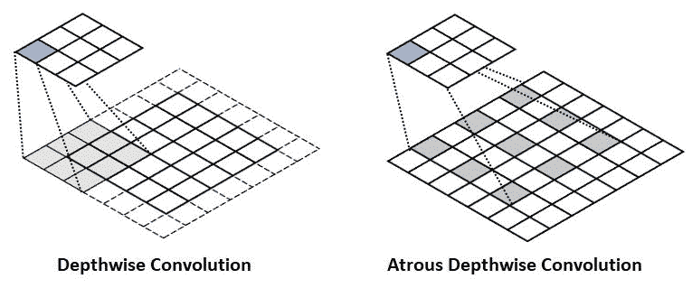
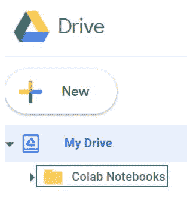
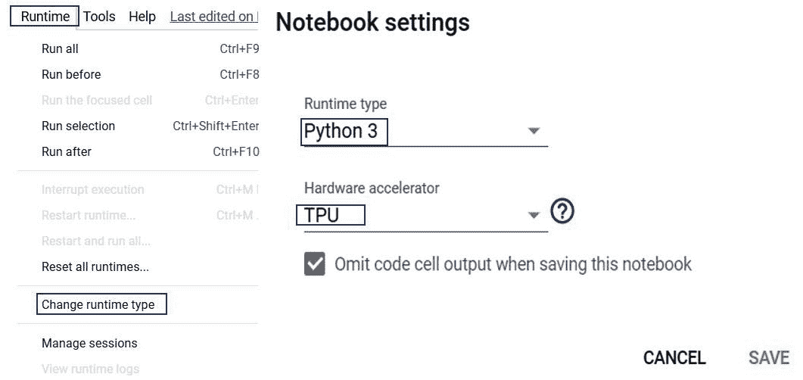
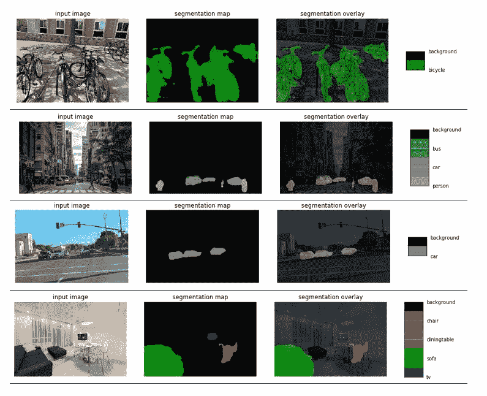
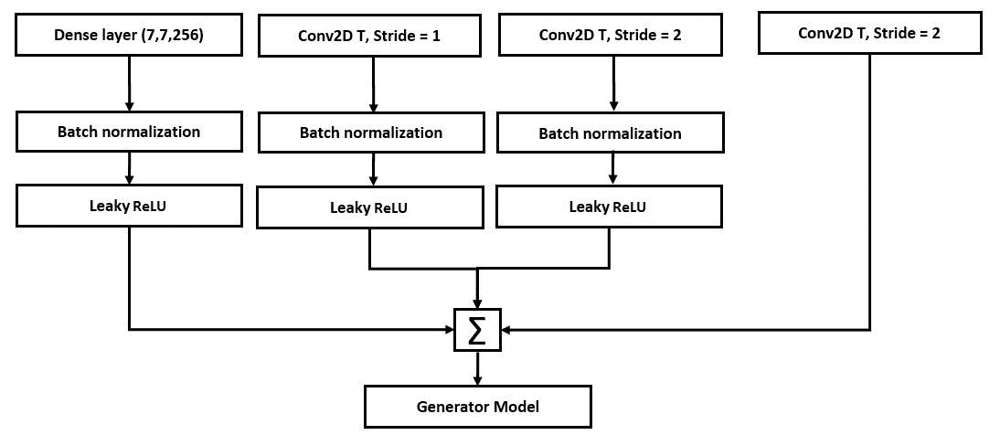
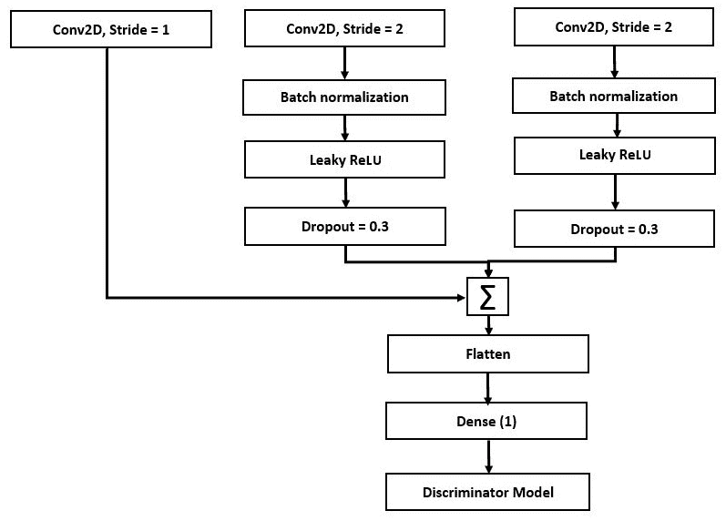
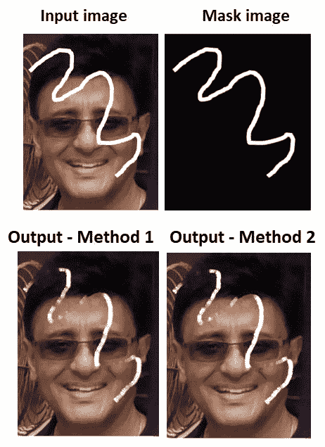
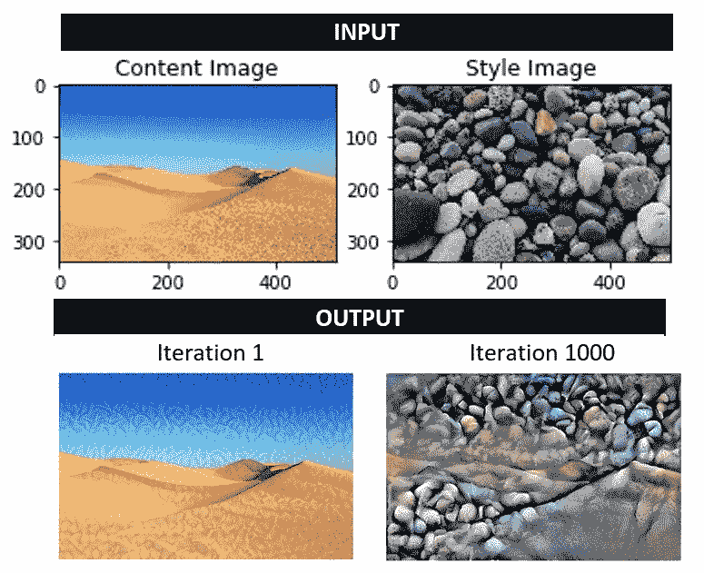

# 语义分割与神经风格转移

深度神经网络的应用不仅限于在图像中找到对象（我们在前面的章节中已经学习过），还可以用于将图像分割成空间区域，从而生成人造图像并从一个图像中转移样式。 形象给另一个。

在本章中，我们将使用 TensorFlow Colab 执行所有这些任务。 语义分割可预测图像的每个像素是否属于某个类别。 这是用于图像叠加的有用技术。 您将了解 TensorFlow DeepLab，以便可以对图像执行语义分割。 **深度卷积生成对抗网络**（**DCGAN**）是强大的工具，可用于生成人造图像，例如人脸和手写数字。 它们也可以用于图像修复。 我们还将讨论如何使用 CNN 将样式从一个图像转移到另一个图像。

在本章中，我们将介绍以下主题：

*   用于语义分割的 TensorFlow DeepLab 概述
*   使用 DCGAN 生成人工图像
*   使用 OpenCV 修复图像
*   了解神经样式转换

# 用于语义分割的 TensorFlow DeepLab 概述

语义分割是在像素级别理解和分类图像内容的任务。 与对象检测不同，在对象检测中，在多个对象类上绘制了一个矩形边界框（类似于我们从 YOLOV3 中学到的知识），语义分割可学习整个图像，并将封闭对象的类分配给图像中的相应像素。 因此，语义分段可以比对象检测更强大。 语义分段的基本体系结构基于编码器-解码器网络，其中编码器创建一个高维特征向量并在不同级别上对其进行聚合，而解码器在神经网络的不同级别上创建一个语义分段掩码。 编码器使用传统的 CNN，而解码器使用解池，解卷积和上采样。 DeepLab 是 Google 引入的一种特殊类型的语义分段，它使用 Atrous 卷积，空间金字塔池而不是常规的最大池以及编码器-解码器网络。 DeepLabV3+ 是由 Liang-Chieh Chen，Yukun Zhu，George Papandreou，Florian Schro 和 Hartwig Adam 在他们的论文[《用于语义图像分割的实用 Atrous 可分离卷积的编码器-解码器》](https://arxiv.org/abs/1802.02611)中提出的。

DeepLab 于 2015 年开始使用 V1，并于 2019 年迅速移至 V3 +。下表列出了不同 DeepLab 版本的比较：

|  | **DeepLab V1** | **DeepLab V2** | **DeepLab V3** | **DeepLab V3 +** |
| **论文** | *具有深度卷积网络和全连接 CRF 的语义图像分割，2015* | *DeepLab：使用深度卷积网络，Atrous 卷积和全连接 CRF 进行语义图像分割，* 2017 | *重新思考原子卷积以进行语义图像分割，* 2017 | *具有可分割卷积的语义语义分割的编解码器，* 2018 |
| **作者** | 陈良杰，乔治·帕潘德里欧，Iasonas Kokkinos，凯文·墨菲和艾伦·尤里 | 陈良杰，乔治·帕潘德里欧，Iasonas Kokkinos，凯文·墨菲和艾伦·尤里 | 陈良杰，乔治·帕潘德里欧，弗洛里安·施罗夫和哈特维格·亚当 | 陈良杰，朱玉坤，乔治·帕潘德里欧，弗洛里安·施罗和哈特维格·亚当 |
| **关键概念** | 原子卷积，全连接**条件随机字段**（**CRF**） | **多孔空间金字塔池**（**ASPP**） | ASPP，图像级功能和批量规范化 | ASPP 和编码器/解码器模块 |

DeepLabV3 +使用**空间金字塔池**（**SPP**）的概念来定义其架构。

# 空间金字塔合并

我们在“第 5 章”，*神经网络体系结构和模型*中介绍的大多数 CNN 模型都需要固定的输入图像大小，这限制了输入图像的纵横比和比例。 固定大小约束不是来自卷积运算； 相反，它来自全连接层，该层需要固定的输入大小。 卷积操作从 CNN 的不同层中的图像的边缘，拐角和不同形状生成特征图。 特征图在不同的层中是不同的，并且是图像中形状的函数。 它们不会随着输入大小的变化而显着变化。 SPP 代替了最后一个合并层，紧接在全连接层之前，由并行排列的空间容器组成，其空间大小与输入图像的大小成正比，但其总数固定为全连接层数。 空间池化层通过保持过滤器大小固定但更改特征向量的大小来消除输入图像的固定大小约束。

DeepLabV3 的架构基于两种神经网络-Atrous 卷积和编码器/解码器网络。

# 原子卷积

我们在“第 4 章”，*图像深度学习*中介绍了卷积的概念，但是我们没有涉及各种 Atrous 卷积。 Atrous 卷积，也称为膨胀卷积，增加了卷积的视野。 传统的 CNN 使用最大池化和跨步来快速减小层的大小，但这样做也会降低要素图的空间分辨率。 Atrous 卷积是一种用于解决此问题的方法。 它通过使用 Atrous 值修改步幅来实现此目的，从而有效地更改了过滤器的值字段，如下图所示：



上图显示了速率= 2 的 Atrous 卷积。与深度卷积相比，它跳过了其他每个像元。 实际上，如果应用 stride = 2，则 3 x 3 内核就是 5 x 5 内核。与简单的深度方向较小的特征图相比，Atrous 卷积增加了视野并捕获了边界信息（与最大池化相比， 缺少对象边界），从而导致图像上下文丰富。 由于其在每个后续层中保持视野相同的特性，Atrous 卷积用于图像分割。

DeepLabV3 执行几个并行的 Atrous 卷积，所有这些卷积以不同的速率运行，就像我们前面描述的空间池层概念一样。 上图说明了 Atrous 卷积模块和并行模块彼此相邻堆叠以形成 SPP。 与传统卷积不同，传统卷积与原始图像相比减少了最终特征向量的深度和宽度，而 Atrous 卷积保留了图像大小。 因此，图像的精细细节不会丢失。 在构建具有丰富图像上下文的分割图时，这很有用。

# 编解码器网络

编码器是获取图像并生成特征向量的神经网络。 解码器执行与编码器相反的操作； 它采用特征向量并从中生成图像。 编码器和解码器一起训练以优化组合损耗函数。

编码器-解码器网络可在编码器路径中实现更快的计算，因为不必在编码器路径中扩张特征，并且在解码器路径中恢复了清晰的物体。 编码器-解码器网络包含一个编码器模块，该模块捕获更高的语义信息，例如图像中的形状。 它通过逐渐缩小特征图来实现。 另一方面，解码器模块保留空间信息和更清晰的图像分割。

编码器和解码器主要在多个比例上使用 1 x 1 和 3 x 3 Atrous 卷积。 让我们更详细地了解它们。

# 编码器模块

编码器模块的主要功能如下：

*   无穷的卷积以提取特征。
*   输出步幅是输入图像分辨率与最终输出分辨率之比。 其典型值为 16 或 8，这会导致特征提取更加密集。
*   在最后两个块中使用速率为 2 和 4 的 Atrous 卷积。
*   ASPP 模块用于在多个尺度上应用卷积运算。

# 解码器模块

解码器模块的主要功能如下：

*   1 x 1 卷积用于减少来自编码器模块的低级特征图的通道。
*   3 x 3 卷积用于获得更清晰的分割结果。
*   向上采样 4。

# DeepLab 中的语义分割-示例

[可在以下由 TensorFlow 管理的 GitHub 页面上找到使用 TensorFlow 训练 DeepLab 的详细代码](https://github.com/tensorflow/models/tree/master/research/deeplab)。

Google Colab 包含基于几个预先训练的模型的内置 DeepLab Python 代码。 可以在[这个页面](https://colab.research.google.com/github/tensorflow/models/blob/master/research/deeplab/deeplab_demo.ipynb)中找到。

# Google Colab，Google Cloud TPU 和 TensorFlow

在深入研究示例代码之前，让我们了解 Google 机器学习的一些基本功能，所有这些功能都是免费提供的，以便我们可以开发强大的计算机视觉和机器学习代码：

*   **Google Colab**：您可以从 Google 云端硬盘打开 Goog​​le Colab，如以下屏幕截图所示。 如果您是第一次使用它，则必须先单击“新建”，然后单击“更多”，才能将 Google Colab 安装到您的云端硬盘。 Google Colab 可让您无需安装即可打开 Jupyter Notebook。 它还内置了 TensorFlow，这意味着处理包含给您的所有 TensorFlow 依赖项要容易得多：



上面的屏幕快照显示了 Google Colab 文件夹相对于 Google 云端硬盘的位置。 它使您可以处理`.ipynb`文件，然后进行存储。

*   **Google Cloud TPU**：这是张量处理单元。 它使您可以更快地运行神经网络代码。 进入 Google Colab 笔记本后，您可以为 Python `.ipynb`文件激活 TPU，如以下屏幕截图所示：



如前面的屏幕快照所示，打开 Cloud TPU 将有助于加快处理神经网络的训练和预测阶段的速度。

Google Colab DeepLab 笔记本包含三个示例图像，还为您提供获取 URL 的选项，以便您可以加载自定义图像。 当您获得图像的 URL 时，请确保 URL 末尾带有`.jpg`。 从互联网上提取的许多图像没有此扩展名，程序会说找不到它。 如果您有自己想要使用的图像，请将其存储在 GitHub 页面上，然后下载 URL。 以下屏幕截图显示了根据`mobilenetv2_coco_voctrainaug`接收到的输出：



上面的屏幕快照显示了四个不同的图像-停放的自行车，繁忙的纽约街道，城市道路和带家具的房间。 在所有情况下检测都非常好。 应当注意，该模型仅检测以下 20 个类别，以及背景类别：*背景*，*飞机*，*自行车*，*鸟* ，*船*，*瓶*，*公共汽车*，*车*，*猫*，*椅子*，*牛*，*餐桌*，*狗*，*马*，*摩托车*，*人*， *盆栽植物*，*绵羊*，*沙发*，*火车*，*电视*。 以下屏幕快照显示了使用不同模型`xception_coco_voctrainval`运行的相同四个图像：


与 MobileNet 模型相比，对象对异常模型的预测显示出更多的改进。 与 MobileNet 模型相比，对于例外模型，可以清楚地检测出自行车，人和桌子的细分。

MobileNet 是一种有效的神经网络模型，可用于手机和边缘设备。 与常规卷积相反，它使用深度卷积。 要详细了解 MobileNet 和深度卷积，请参阅“第 11 章”，*具有 GPU / CPU 优化功能的边缘深度学习*。

# 使用 DCGAN 生成人工图像

在“第 5 章”，*神经网络架构和模型*中，我们了解了 DCGAN。 它们由生成器模型和鉴别器模型组成。 生成器模型采用表示图像特征的随机矢量，并通过 CNN 生成人工图像 *G（z）*。 因此，生成器模型返回生成新图像及其类别的绝对概率 *G（z）*。 **鉴别器**（`D`）网络是二进制分类器。 它从样本概率，图像分布（p 数据）和来自生成器的人造图像中获取真实图像，以生成最终图像 *P（z）*的概率。 从真实图像分布中采样。 因此，鉴别器模型返回条件概率，即最终图像的类别来自给定分布。

鉴别器将生成真实图像的概率信息馈送到生成器，生成器使用该信息来改进其预测，以创建人造图像 *G（z）*。 随着训练的进行，生成器会更好地创建可以欺骗鉴别器的人工图像，并且鉴别器将发现很难将真实图像与人工图像区分开。 这两个模型相互对立，因此命名为对抗网络。 当鉴别器不再能够将真实图像与人工图像分离时，模型收敛。

GAN 训练遵循针对几个时期的鉴别器和生成器训练的替代模式，然后重复进行直到收敛为止。 在每个训练期间，其他组件保持固定，这意味着在训练发电机时，鉴别器保持固定，而在训练鉴别器时，发电机保持固定，以最大程度地减少发电机和鉴别器相互追逐的机会 。

前面的描述应该已经为您提供了 GAN 的高级理解。 但是，为了编码 GAN，我们需要更多地了解模型架构。 让我们开始吧。

# 发电机

下图显示了 DCGAN 的生成器网络的体系结构：



从上图中，我们可以看到以下内容：

*   所有具有跨步但没有最大池化的卷积网络都允许该网络在生成器中学习自己的上采样。 注意，最大池化被跨步卷积代替。
*   第一层从鉴别器获得概率 P（z），通过矩阵乘法连接到下一个卷积层。 这意味着不使用正式的全连接层。 但是，网络可以达到其目的。
*   我们将批量归一化到所有层以重新调整输入，发电机生成器层除外，以提高学习的稳定性。

# 鉴别器

下图显示了 DCGAN 鉴别器网络的体系结构：



从上图中，我们可以看到以下内容：

*   所有具有跨步但没有最大池化的卷积网络都允许网络在鉴别器中学习自己的下采样。
*   我们消除了全连接层。 最后的卷积层被展平并直接连接到单个 S 型输出。
*   我们对除鉴别器输入层以外的所有层应用批归一化，以提高学习的稳定性。

# 训练

培训时要考虑的关键特征如下：

*   激活：Tanh
*   **随机梯度下降**（**SGD**），最小批量为 128
*   泄漏 ReLU：斜率= 0.2
*   学习率为 0.0002 的 Adam 优化器
*   动量项 0.5：值 0.9 引起振荡

下图显示了训练阶段 DCGAN 的损耗项：


当发电机接收到随机输入并且发电机损耗定义为其产生假输出的能力时，训练便开始了。 鉴别器损失定义为其将实际输出与伪输出分离的能力。 渐变用于更新生成器和鉴别器。 在训练过程中，同时对生成器和鉴别器进行训练。 训练过程通常只要我们需要同时训练两个模型即可。 请记住，两个模型是相互同步的。

# 使用 DCGAN 修复图像

图像修补是根据来自相邻点的信息填充图像或视频缺失部分的过程。 图像修补工作流程涉及以下步骤：

1.  图像中缺少零件。
2.  收集相应缺失部分的像素信息。 这称为层蒙版。
3.  向神经网络馈送步骤 1 和 2 中描述的图像，以确定需要填充图像的哪一部分。这意味着，首先对具有缺失部分的图像进行处理，然后对层蒙版进行处理。

4.  输入图像经过类似的 DCGAN，如前所述（卷积和反卷积）。 层蒙版允许网络基于其相邻像素数据仅关注缺失部分，并丢弃图像中已经完成的部分。 生成器网络生成伪造的图像，而鉴别器网络确保最终绘画看起来尽可能真实。

# TensorFlow DCGAN –示例

TensorFlow.org 有一个很好的图像修复示例，您可以在 Google Colab 或您自己的本地计算机上运行。 该示例可以在 [Google Colab](https://colab.research.google.com/github/tensorflow/docs/blob/master/site/en/tutorials/generative/dcgan.ipynb#scrollTo=xjjkT9KAK6H7)。

此示例显示了根据 MNIST 数据集训练 GAN，然后生成人工数字的方法。 使用的模型与前面各节中描述的模型相似。

# 使用 OpenCV 修复图像

OpenCV 提供了两种图像修复方法，如下所示：

*   `cv.INPAINT_TELEA`基于论文*，2004 年由 Alexandru Telea 提出的一种基于快速行进方法*的图像修复技术。该方法用所有图像的归一化加权和替换待修复邻域中的像素。 附近的已知像素。 那些位于该点附近和边界轮廓上的像素将获得更大的权重。 修复像素后，将使用快速行进方法将像素移动到下一个最近的像素：

```py
import numpy as np
import cv2 as cv
img = cv.imread('/home/.../krishmark.JPG')
mask = cv.imread('/home/.../markonly.JPG',0)
dst = cv.inpaint(img,mask,3,cv.INPAINT_TELEA)
cv.imshow('dst',dst)
cv.waitKey(0)
cv.destroyAllWindows()
```

*   `cv.INPAINT_NS`基于 Bertalmio，Marcelo，Andrea L. Bertozzi 和 Guillermo Sapiro 在 2001 年发表的论文 *Navier-Stokes，流体动力学以及图像和视频修补*。它连接具有相同强度的点 同时在修复区域的边界匹配梯度向量。 此方法使用流体动力学算法：

```py
import numpy as np
import cv2 as cv
img = cv.imread('/home/.../krish_black.JPG')
mask = cv.imread('/home/.../krish_white.JPG',0)
dst = cv.inpaint(img,mask,3,cv.INPAINT_NS)
cv.imshow('dst',dst)
cv.waitKey(0)
cv.destroyAllWindows()
```

下图显示了最终输出：



如我们所见，这两个预测都部分成功，但并未完全删除该行。

# 了解神经样式转换

神经样式转移是一种技术，您可以通过匹配内容图像和样式图像的特征分布来混合它们，以生成与内容图像相似但在艺术上以样式化的图像样式绘制的最终图像。 可以在 TensorFlow 中以两种不同方式完成样式转移：

*   在 TensorFlow Hub 中使用预训练的模型。 这是您上传图像和样式的地方，该工具包将生成样式输出。 您可以在[这个页面](https://colab.research.google.com/github/tensorflow/hub/blob/master/examples/colab/tf2_arbitrary_image_stylization.ipynb)上上传图像。 请注意，TensorFlow Hub 是许多预训练网络的来源。
*   通过训练神经网络来开发自己的模型。 为此，请按照下列步骤操作：
    1.  选择 VGG19 网络-它具有五个卷积（Conv2D）网络，每个 Conv2D 具有四层，然后是全连接层。
    2.  通过 VGG19 网络加载内容图像。
    3.  预测前五个卷积。
    4.  加载没有顶层的 VGG19 模型（类似于我们在“第 6 章”，*使用转移学习*的视觉搜索中所做的工作），并列出该层的名称。
    5.  VGG19 中的卷积层具有特征提取功能，而全连接层执行分类任务。 如果没有顶层，则网络将仅具有顶层五个卷积层。 从前面的章节中我们知道，初始层传达原始图像的输入像素，而最终层捕捉图像的定义特征和图案。
    6.  这样，图像的内容就由中间特征图表示–在这种情况下，这是第五个卷积块。

gram 矩阵是向量 G = I <sub>i</sub> <sup>T</sup> I <sub>j</sub> 的内积的矩阵。 在此，I <sub>i</sub> 和 I <sub>j</sub> 是原始图像和样式图像的特征向量。 内积代表向量的协方差，代表相关性。 这可以用样式来表示。

以下代码输入一个 VGG 模型，并从该模型中提取样式和内容层：

```py
vgg = tf.keras.applications.VGG19(include_top=False, weights='imagenet')
vgg.trainable = False
for layer in vgg.layers:
print(layer.name)
```

以下结果显示了卷积块及其顺序：

```py
input_2
 block1_conv1
 block1_conv2
 block1_pool
 block2_conv1
 block2_conv2
 block2_pool
 block3_conv1
 block3_conv2
 block3_conv3
 block3_conv4
 block3_pool
 block4_conv1
 block4_conv2
 block4_conv3
 block4_conv4
 block4_pool
 block5_conv1
 block5_conv2
 block5_conv3
 block5_conv4
 block5_pool
```

我们将使用从前面的输出生成的卷积结果来开发内容层和样式层，如以下代码所示：

```py
#Content layer: content_layers = ['block5_conv2']
#Style layer: style_layers = ['block1_conv1','block2_conv1','block3_conv1', 'block4_conv1', 'block5_conv1']
style_outputs = [vgg.get_layer(name).output for name in style_layers]
content_outputs = [vgg.get_layer(name).output for name in content_layers]
vgg.input = style_image*255
```

输入的四个维度是批量大小，图像的宽度，图像的高度和图像通道的数量。 255 乘数将图像强度转换为 0 到 255 的比例：

```py
model = tf.keras.Model([vgg.input], outputs)
```

如前所述，这种样式可以用克矩阵表示。 在 TensorFlow 中，gram 矩阵可以表示为`tf.linalg.einsum`。

因此，我们可以编写以下代码：

```py
for style_output in style_outputs:
gram_matrix = tf.linalg.einsum(‘bijc,bijd->bcd’, style_outputs,style_outputs)/tf.cast(tf.shape(style_outputs[1]*style_outputs[2]))
```

损失计算如下：

```py
style_loss = tf.add_n([tf.reduce_mean((style_outputs[name]-style_targets[name])**2) for name in style_outputs.keys()])
style_loss *= style_weight / num_style_layers

content_loss = tf.add_n([tf.reduce_mean((content_outputs[name]-content_targets[name])**2) for name in content_outputs.keys()])
content_loss *= content_weight / num_content_layers
loss = style_loss + content_loss
```

可以从 [TensorFlow 教程](https://www.tensorflow.org/tutorials/generative/style_transfer)中获得最终代码。 代码结构如此处所述。 我在以下图像上运行它，其输出如下：



请注意，图像输出如何从沙漠中的少量石粒过渡到完全充满石头，同时又保持了沙漠的某些结构。 最后的迭代（迭代 1,000）确实显示出一种艺术融合。

# 概要

在本章中，我们学习了如何使用 TensorFlow 2.0 和 Google Colab 训练神经网络来执行许多复杂的图像处理任务，例如语义分割，图像修复，生成人工图像和神经样式转移。 我们了解了生成器网络和鉴别器网络的功能，以及如何可以平衡地同时训练神经网络以创建伪造的输出图像。 我们还学习了如何使用 Atrous 卷积，空间池和编码器/解码器网络来开发语义分割。 最后，我们使用 Google Colab 训练了一个神经网络来执行神经样式转换。

在下一章中，我们将使用神经网络进行活动识别。