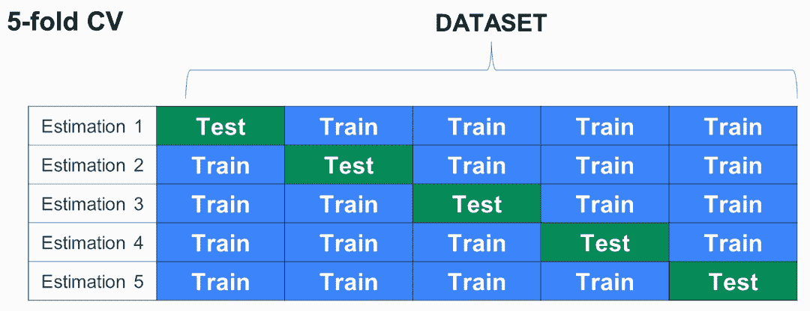
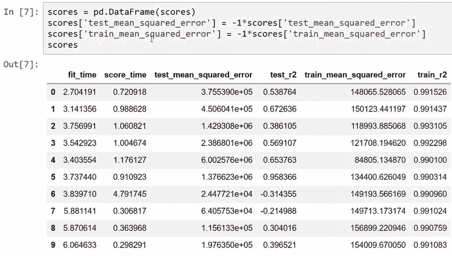
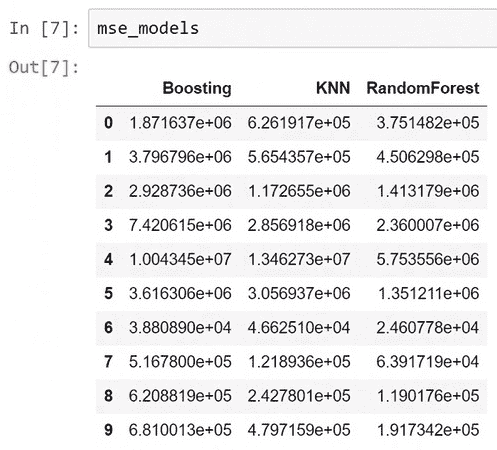
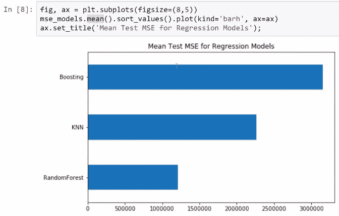
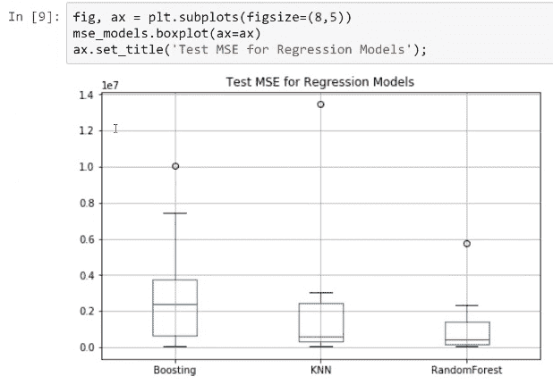
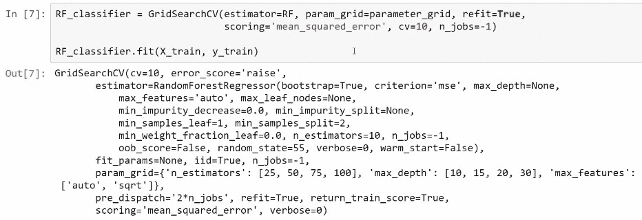
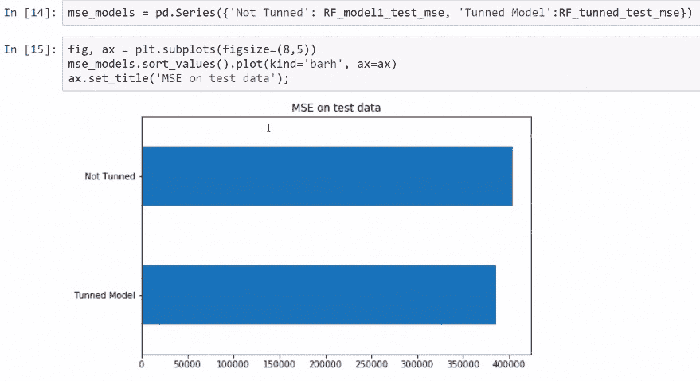

# 交叉验证和参数调整

预测分析涉及对未知事件进行预测。 我们使用它来生成可概括数据的模型。 为此，我们使用一种称为交叉验证的技术。

交叉验证是一种评估技术，用于评估统计分析结果的一种验证技术，该结果可推广到一个独立的数据集，该数据集提供了样本外准确性的度量。 它通过将数据的几个随机分区平均为训练样本和测试样本来完成任务。 它通常通过对参数的几个可能值进行交叉验证并选择给出最低交叉验证平均误差的参数值来进行超参数调整。

交叉验证有两种：穷举性和非穷举性。 K 折是非穷举性交叉验证的一个示例。 这是一种用于对模型性能进行更准确评估的技术。 使用 k 折交叉验证，我们可以进行超参数调整。 这是关于为我们的模型选择最佳的超参数。 k 折交叉验证和超参数调整等技术对于构建出色的预测分析模型至关重要。 交叉验证有很多类型或方法，例如，保持交叉验证和 k 折交叉验证。

在本章中，我们将涵盖以下主题：

*   保持交叉验证
*   K 折交叉验证
*   将模型与 k 倍交叉验证进行比较
*   超参数调整简介

# 保持交叉验证

在保留交叉验证中，我们保留了一定百分比的观察值，因此我们得到了两个数据集。 一个称为训练数据集，另一个称为测试数据集。 在这里，我们使用测试数据集计算评估指标，其余数据用于训练模型。 这是保持交叉验证的过程。

保留交叉验证的主要优点在于，它非常易于实现，并且是一种非常直观的交叉验证方法。

这种交叉验证的问题在于，它为模型的评估指标提供了一个估计。 这是有问题的，因为某些模型依赖于随机性。 因此，原则上，由于随机机会，有时在测试中计算出的评估指标可能会有很大差异。 因此，保持交叉验证的主要问题在于，我们只能获得评估指标的一个估计值。

# K 折交叉验证

在 k 折交叉验证中，我们基本上会进行多次交叉验证。 因此，在 k 倍交叉验证中，我们将数据集划分为`k`个相等大小的样本。 在许多`k`子样本中，保留了一个子样本作为用于测试模型的验证数据，其余`k-1`子样本用作训练数据。 然后，此交叉验证过程重复`k`次，每个`k`子样本中的每一个仅被使用一次作为验证数据。 然后可以将`k`结果平均，以产生单个估计。

以下屏幕截图显示了 5 倍交叉验证的直观示例（`k = 5`）：



在这里，我们看到我们的数据集分为五个部分。 我们将第一部分用于测试，其余部分用于培训。

以下是我们采用 5 倍交叉验证方法执行的步骤：

1.  我们对评估指标进行了首次估算。
2.  我们将第二部分用于测试，其余部分用于培训，然后使用它来获得评估指标的第二估计。
3.  我们将第三部分用于测试，将其余部分用于培训，依此类推。 这样，我们获得了评估指标的五种估计。

在 k 倍交叉验证中，观察到评估矩阵的`k`估计后，取其平均值。 这将使我们可以更好地估计模型的性能。 因此，我们可以通过 k 倍交叉验证获得`n`个估计数，而不是仅对这一评估指标进行一次估计，然后取平均值，以获得对性能的更好估计。 该模型。

如此处所示，k 折交叉验证方法的优势在于它不仅可以用于模型评估，而且还可以用于超参数调整。

在此验证方法中，`k`的公共值为 5 和 10。

以下是 k 折交叉验证的变体：

*   **重复交叉验证：**在重复交叉验证中，我们多次执行 k 倍交叉验证。 因此，如果我们希望对评估指标进行 30 次估算，则可以进行 6 次 5 倍交叉验证。 因此，我们将获得 30 个评估指标的估算值。

*   **留一法（LOO）交叉验证：**在这种方法中，我们将除一点之外的整个数据集用于训练。 我们将这一点用于评估，然后对数据集中的每个数据点重复此过程。

如果我们有数百万个点，则此验证方法的计算量将非常昂贵。 在这种情况下，我们使用重复的 k 倍交叉验证，因为这种验证方法将为我们提供相对较好的结果。

# 实施 k 折交叉验证

让我们以`diamond`数据集为例来了解 k 倍交叉验证的实现。

为了在`scikit-learn`中执行 k 倍交叉验证，我们首先必须导入将要使用的库。 以下代码段显示了用于导入库的代码：

```py
import numpy as np
import matplotlib.pyplot as plt
import pandas as pd
%matplotlib inline
```

第二步是准备在本示例中使用的`diamond`数据集的数据集。 下面显示了用于为此数据集准备数据的代码：

```py
# importing data
data_path= '../data/diamonds.csv'
diamonds = pd.read_csv(data_path)
diamonds = pd.concat([diamonds, pd.get_dummies(diamonds['cut'], prefix='cut', drop_first=True)],axis=1)
diamonds = pd.concat([diamonds, pd.get_dummies(diamonds['color'], prefix='color', drop_first=True)],axis=1)
diamonds = pd.concat([diamonds, pd.get_dummies(diamonds['clarity'], prefix='clarity', drop_first=True)],axis=1)
diamonds.drop(['cut','color','clarity'], axis=1, inplace=True)
```

准备好数据后，我们将创建用于建模的对象。 下面显示了用于创建建模对象的代码：

```py
from sklearn.preprocessing import RobustScaler
target_name = 'price'
robust_scaler = RobustScaler()
X = diamonds.drop('price', axis=1)
X = robust_scaler.fit_transform(X)
y = diamonds[target_name]
# Notice that we are not doing train-test split
#X_train, X_test, y_train, y_test = train_test_split(X, y, test_size=0.2, random_state=55)
```

这与我们在第 1 章，“回归和分类的集成方法”中使用的单元格相同。 此处的区别在于我们不使用`train_test_split`功能。 在这里，我们正在生成`X`矩阵，该矩阵包含所有功能并具有我们的目标功能。 因此，我们有了`X`矩阵和`y`向量。

为了训练模型，我们将实例化`RandomForestRegressor`函数，该函数在此数据集的第 1 章 ，“回归和分类集成方法”中是最佳模型。 。 以下显示了用于实例化`RandomForestRegressor`函数**的代码：**

```py
from sklearn.ensemble import RandomForestRegressor
RF = RandomForestRegressor(n_estimators=50, max_depth=16, random_state=123, n_jobs=-1)
```

为了执行 k 倍交叉验证，我们从`scikit-learn`中的`model_selection`模块导入`cross_validate`函数。 下面显示了用于导入`cross_validate`函数的代码：

```py
# this will work from sklearn version 0.19, if you get an error 
# make sure you upgrade: $conda upgrade scikit-learn
from sklearn.model_selection import cross_validate
```

此`cross_validate`功能的工作方式如下：

*   我们提供了估算器，它将是`RandomForestRegressor`函数。 下面显示了用于应用`RandomForestRegressor`功能的代码：

```py
 scores = cross_validate(estimator=RF,X=X,y=y,
 scoring=['mean_squared_error','r2'],
 cv=10, n_jobs=-1)
```

在这里，我们传递`X`对象和`y`对象。

*   我们提供了一组我们要评估的模型和数据集指标。 在这种情况下，使用`mean_squared_error`函数和`r2`指标进行评估，如前面的代码所示。 在这里，我们在`cv`中传递`k`的值。 因此，在这种情况下，我们将进行十倍交叉验证。

我们从此`cross_validate`函数获得的输出将是带有相应矩阵的字典。 为了更好地理解，将输出转换为数据帧。 以下屏幕快照显示了用于可视化数据框和数据框输出中的分数的代码：



在这里，我们应用`test_mean_squared_error`和`test_r2`，这是我们要评估的两个指标。 经过评估，我们获得了`train_mean_squared_error`值和`test_r2`集。 因此，我们对测试指标感兴趣。

为了更好地评估模型的性能，我们将对所有单个测量值进行平均（均值）。

下面显示了用于获取`Mean test MSE`和`Mean test R-squared`值并显示其值的输出的代码：

```py
print("Mean test MSE:", round(scores['test_mean_squared_error'].mean()))
print("Mean test R-squared:", scores['test_r2'].mean())
```

因此，在平均上，我们看到测试 MSE 的平均值是我们在此处拥有的值以及其他指标的平均值，即 R 平方评估指标。

# 将模型与 k 倍交叉验证进行比较

由于 k 折交叉验证方法被证明是一种更好的方法，因此它更适合于比较模型。 其背后的原因是 k 倍交叉验证对评估指标给出了很多估计，并且对这些估计求平均后，我们可以更好地评估模型性能。

下面显示了用于导入库以比较模型的代码：

```py
import numpy as np
import matplotlib.pyplot as plt
import pandas as pd
%matplotlib inline
```

导入库后，我们将导入`diamond`数据集。 下面显示了用于准备此`diamond`数据集的代码：

```py
# importing data
data_path= '../data/diamonds.csv'
diamonds = pd.read_csv(data_path)
diamonds = pd.concat([diamonds, pd.get_dummies(diamonds['cut'], prefix='cut', drop_first=True)],axis=1)
diamonds = pd.concat([diamonds, pd.get_dummies(diamonds['color'], prefix='color', drop_first=True)],axis=1)
diamonds = pd.concat([diamonds, pd.get_dummies(diamonds['clarity'], prefix='clarity', drop_first=True)],axis=1)
diamonds.drop(['cut','color','clarity'], axis=1, inplace=True)
```

现在，我们必须在准备好要进行模型比较的数据集之后准备要进行建模的对象。 下面显示了用于准备建模对象的代码。 这里，我们有`X`矩阵，显示了特征，以及`y`向量，它是此数据集的目标：

```py
from sklearn.preprocessing import RobustScaler
target_name = 'price'
robust_scaler = RobustScaler()
X = diamonds.drop('price', axis=1)
X = robust_scaler.fit_transform(X)
y = diamonds[target_name]
```

在这里，我们将比较 KNN 模型，随机森林模型和装袋模型。 在这些模型中，使用十倍交叉验证，我们将使用`KNNRegressor`，`RandomForestRegressor`和`AdaBoostRegressor`函数。

然后，我们将导入`cross_validate`函数。 下面显示了用于导入这三个模型的`cross_validate`函数的代码：

```py
from sklearn.neighbors import KNeighborsRegressor
from sklearn.ensemble import RandomForestRegressor
from sklearn.ensemble import AdaBoostRegressor
from sklearn.model_selection import cross_validate
```

下一步是使用`cross_validate`功能比较模型。 下面显示了用于比较这三种模型的代码块：

```py
## KNN
knn = KNeighborsRegressor(n_neighbors=20, weights='distance', metric='euclidean', n_jobs=-1)
knn_test_mse = cross_validate(estimator=knn,X=X,y=y,
 scoring='mean_squared_error', 
 cv=10, n_jobs=-1)['test_score']

## Random Forests
RF = RandomForestRegressor(n_estimators=50, max_depth=16, random_state=55, n_jobs=-1)
RF_test_mse = cross_validate(estimator=RF,X=X,y=y,
 scoring='mean_squared_error', 
 cv=10, n_jobs=-1)['test_score']

## Boosting
boosting = AdaBoostRegressor(n_estimators=50, learning_rate=0.05, random_state=55) 
boosting_test_mse = cross_validate(estimator=boosting,X=X,y=y,
 scoring='mean_squared_error', 
 cv=10, n_jobs=-1)['test_score']
```

在这里，我们看到了将用于每个模型的测试评估指标的结果。 我们使用`mean_squared_error`功能。 对于每个模型，我们使用十倍交叉验证，得到结果后，我们将获得`test_score`变量。 在这种情况下，此`test_score`变量是均方误差，如以下代码所示：

```py
 mse_models = -1*pd.DataFrame({'KNN':knn_test_mse,
 'RandomForest': RF_test_mse,
 'Boosting':boosting_test_mse})
```

以下屏幕截图显示了针对每个模型运行十倍交叉验证后获得的结果代码，并且该表还显示了针对三个模型的评估指标的 10 个估计：



该表显示了每个模型的估计值的许多变化。 要知道任何模型的实际性能，我们取结果的平均值。 因此，在上图中，我们取所有值的平均值，然后将其绘制出来。

以下屏幕截图显示了用于获取均值的代码，并显示了每个模型的平均 MSE 值的图表：



平均而言，随机森林模型在这三个模型中表现最好。 因此，在取平均值之后，第二位进入 KNN 模型，而提升模型则获得最后一位。

下图显示了用于获取这些评估指标的箱形图和三个模型的箱形图的代码：



因此，查看这些评估指标的箱形图，我们看到，随机森林表现最佳。

要检查这些模型的可变程度，我们可以分析回归模型的测试 MSE 的标准偏差。 以下屏幕截图显示了用于检查变异程度的代码，以及显示了这些模型的标准偏差的图：


前面的屏幕截图显示，在这种情况下，最多的模型是 KNN 模型，其次是 boosting 模型，而随机森林模型的变化最小。 因此，随机森林模型是这三种模型中最好的。 即使对于此数据集，随机森林模型也表现最佳。

# 超参数调整简介

用于为特定数据集选择最佳估计量或为所有超参数选择最佳值的方法称为**超参数调整**。 超参数是无法在估算器中直接学习的参数。 它们的价值由建模者决定。

例如，在`RandomForestClassifier`对象中，有很多超参数，例如`n_estimators`，`max_depth`，`max_features`和`min_samples_split`。 建模人员确定这些超参数的值。

# 详尽的网格搜索

执行超参数调整的最重要且最常用的方法之一是**穷举网格搜索**。 这是一种蛮力方法，因为它尝试从参数值网格中尝试所有超参数组合。 然后，对于超参数的每种组合，使用 k 倍交叉验证和任何其他指定的指标来评估模型。 因此，为我们提供最佳度量的组合是我们将在`scikit-learn`中使用的对象返回的组合。

让我们以超参数网格为例。 在这里，我们为`n_estimators`超参数尝试三个不同的值，例如 10、30 和 50。 我们将为`max_features`尝试两个选项，例如 auto 和 square root，并为`max_depth`分配四个值-5、10、20 和 30。 因此，在这种情况下，我们将有 24 个超参数组合。 这 24 个将被评估。 在这种情况下，对于这 24 个组合中的每个组合，我们使用十倍交叉验证，计算机将训练和评估 240 个模型。 网格搜索面临的最大缺点是维数的诅咒，这将在以后的章节中介绍。 维数的诅咒从本质上讲意味着，您评估模型的次数将随着参数的数量呈指数增长。

如果未测试某些超参数组合，则可以将不同的网格传递给`GridSearchCV`对象。 在这里，可以以字典列表的形式传递不同的网格，因为每个网格都是`scikit-learn`中的字典。

永远不要使用整个数据集来调整参数，在调整参数时始终执行火车测试拆分，否则超参数可能适合该特定数据集，并且该模型不能很好地推广到新数据。

因此，我们执行训练测试拆分，并使用数据集的一部分来学习模型的超参数。 我们留给测试的部分应该用于最终的模型评估，然后我们使用整个数据集来拟合模型。

# scikit-learn 中的超参数调整

让我们以`diamond`数据集为例来了解`scikit-learn`中的超参数调整。

要执行超参数调整，我们首先必须导入将要使用的库。 要导入库，我们将使用以下代码：

```py
import numpy as np
import matplotlib.pyplot as plt
import pandas as pd
from sklearn.metrics import mean_squared_error
%matplotlib inline
```

然后，我们将转换为在此示例中使用的`diamond`数据集。 下面显示了用于为此数据集准备数据的代码：

```py
# importing data
data_path= '../data/diamonds.csv'
diamonds = pd.read_csv(data_path)
diamonds = pd.concat([diamonds, pd.get_dummies(diamonds['cut'], prefix='cut', drop_first=True)],axis=1)
diamonds = pd.concat([diamonds, pd.get_dummies(diamonds['color'], prefix='color', drop_first=True)],axis=1)
diamonds = pd.concat([diamonds, pd.get_dummies(diamonds['clarity'], prefix='clarity', drop_first=True)],axis=1)
diamonds.drop(['cut','color','clarity'], axis=1, inplace=True)
```

准备好数据后，我们将创建用于建模的对象。 下面显示了用于创建建模对象的代码：

```py
from sklearn.preprocessing import RobustScaler
from sklearn.model_selection import train_test_split
target_name = 'price'
robust_scaler = RobustScaler()
X = diamonds.drop('price', axis=1)
X = robust_scaler.fit_transform(X)
y = diamonds[target_name]
X_train, X_test, y_train, y_test = train_test_split(X, y, test_size=0.1, random_state=123)
```

执行并创建用于建模的对象后，我们执行`train_test_split`功能。 在前面的代码块中，我们将设置 0.1（10% ）的数据进行测试，因此在调整超参数后，数据集的这一部分将用于模型评估。

我们将使用以下参数调整`RandomForestRegressor`模型：

*   `n_estimators`：此参数表示森林中的树木数量。
*   `max_features`：此参数表示寻找最佳分割时要考虑的功能数量。 可能的选择是`n_features`，它对应于自动超参数，或者是要素数量的`log2`的平方根。
*   `max_depth`：此参数表示树的最大深度。

这些参数将使用带有网格搜索的不同值。 对于`n_estimators`和`max_depth`，我们将使用四个不同的值。 对于`n_estimators`，我们将使用`[25,50,75,100]`作为值，对于`max_depth`，我们将使用`[10,15,20,30]`作为值。 对于`max_features`，我们将使用自动和平方根。

现在，我们将在没有任何超参数的情况下显式实例化`RandomForestRegressor`模型。 下面显示了用于实例化它的代码：

```py
from sklearn.ensemble import RandomForestRegressor
RF = RandomForestRegressor(random_state=55, n_jobs=-1)
```

参数网格基本上是一个字典，我们在其中传递超参数的名称和我们想要尝试的值。 以下代码块显示了具有不同参数的参数网格：

```py
 parameter_grid = {'n_estimators': [25,50,75,100], 
 'max_depth': [10,15,20,30],
 'max_features': ['auto','sqrt']}
```

总共，`n_estimators`有四个值，`max_depth`有四个值，`max_features`有两个值。 因此，在计算中，总共有 32 个超参数组合。

要在`scikit-learn`中执行超参数调整，我们将使用`GridSearchCV`对象。 下面显示了用于从`scikit-learn`导入对象的代码：

```py
from sklearn.model_selection import GridSearchCV
```

在这里，我们传递要调整的估算器，在这种情况下为`RandomForestRegressor`。 以下屏幕截图显示了所使用的代码和我们获得的输出：



然后，我们传递要尝试的参数网格。 在这里，`refit`表示此估算器对象将使用通过网格搜索和交叉验证过程找到的最佳参数进行调整。 这是此对象将用于评估超参数的所有可能组合的评估度量。 在这种情况下，我们将使用十倍交叉验证。 创建完之后，我们可以使用`fit`方法并传递训练对象。 由于我们使用 32 种组合的十倍交叉验证，因此该模型将评估 320 个模型。

我们可以从使用`GridSearchCV`方法创建的对象中使用`cv _results_`属性获得结果。 以下屏幕截图显示了用于获取结果的代码，并显示了结果：


在这里，最重要的是获得`best_params_`。 因此，使用`best_params_`，我们可以看到所有 32 个组合的参数组合。 以下屏幕快照显示了用于获取参数的输入，而输出则显示了可以提供最佳结果的参数组合：


在这里，我们看到可以给出`best_params_`的组合是`max_depth`的值为`20`，`max _features`的值为 auto 和`n_estimators`的值为`100`。 因此，这是参数的最佳组合。

我们还可以获取`best_estimator_`对象，这是超参数的完整列表。 以下屏幕截图显示了用于获取`best_estimator_`的代码，并显示了结果：


因此，当我们调整随机森林模型的超参数时，我们得到的值与之前获得的值不同； 当我们将`n_estimators`的值设置为`50`时，将`max_depth`的值设置为`16`，将`max_features`的值设置为`auto`时，该模型中的参数未调整。

# 比较已调整和未调整的模型

我们可以将调整参数时获得的最佳模型与我们一直使用的最佳模型进行比较，而无需调整`50`值，`max_depth`值`16`和 `max_features`作为`auto`，在两种情况下都是随机森林。 以下代码显示了已调整模型和未调整模型的参数值：

```py
## Random Forests
RF_model1 = RandomForestRegressor(n_estimators=50, max_depth=16, random_state=123, n_jobs=-1)
RF_model1.fit(X_train, y_train)
RF_model1_test_mse = mean_squared_error(y_pred=RF_model1.predict(X_test), y_true=y_test)

## Random Forest with tunned parameters 
RF_tunned_test_mse = mean_squared_error(y_pred=RF_classifier.predict(X_test), y_true=y_test)
```

要实际查看已调整模型和未调整模型之间的比较，我们可以看到均方误差的值。 以下屏幕截图显示了用于获取两个模型的`mean_squared_error`值的代码，以及显示了两个模型的 MSE 值的比较的图：



相比之下，我们可以清楚地观察到，在两个随机森林模型中，这些调整后的参数的性能均优于未调整后的参数。

要查看两个模型之间的实际值差异，我们可以做一些计算。 以下屏幕截图显示了获得改进百分比的计算，并显示了实际百分比值的输出：


在这里，经过调整的模型比未调整的模型提高了 4.6%，这实际上非常好。 在这些模型中，提高 1% -3% 的百分比也可能具有巨大的实际意义。

# 概要

在本章中，我们学习了交叉验证以及各种交叉验证方法，包括保持交叉验证和 k 折交叉验证。 我们知道 k 折交叉验证不过是多次进行保持交叉验证而已。 我们使用`diamond`数据集实施了 k 折交叉验证。 我们还使用 k 倍交叉验证比较了不同的模型，并找到了性能最佳的模型，即随机森林模型。

然后，我们讨论了超参数调整。 我们遇到了详尽的网格搜索方法，该方法用于执行超参数调整。 我们再次使用`diamond`数据集实施了超参数调整。 我们还比较了调整后的模型和未调整的模型，发现调整后的参数使模型的性能优于未调整的模型。

在下一章中，我们将研究特征选择方法，降维和**主成分分析**（**PCA**）以及特征工程。 我们还将学习一种通过特征工程改进模型的方法。