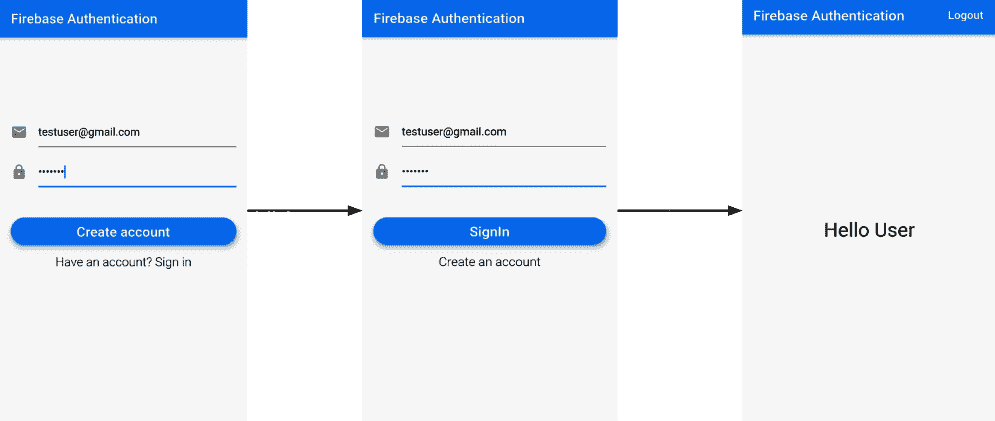
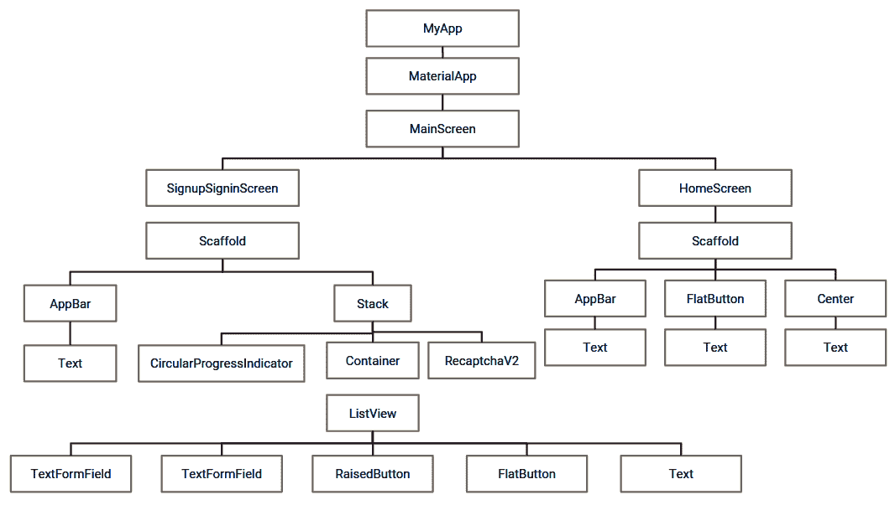
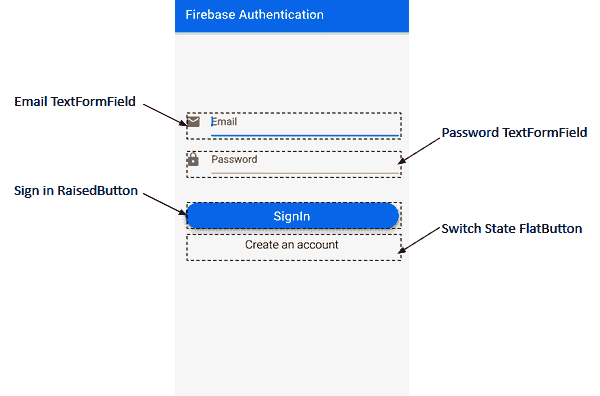
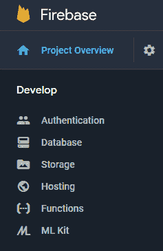
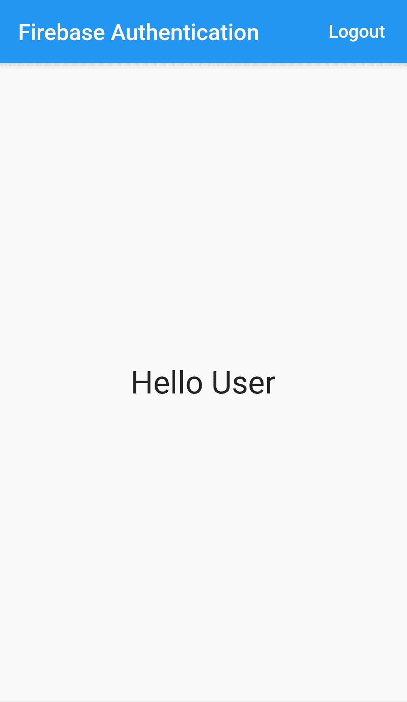
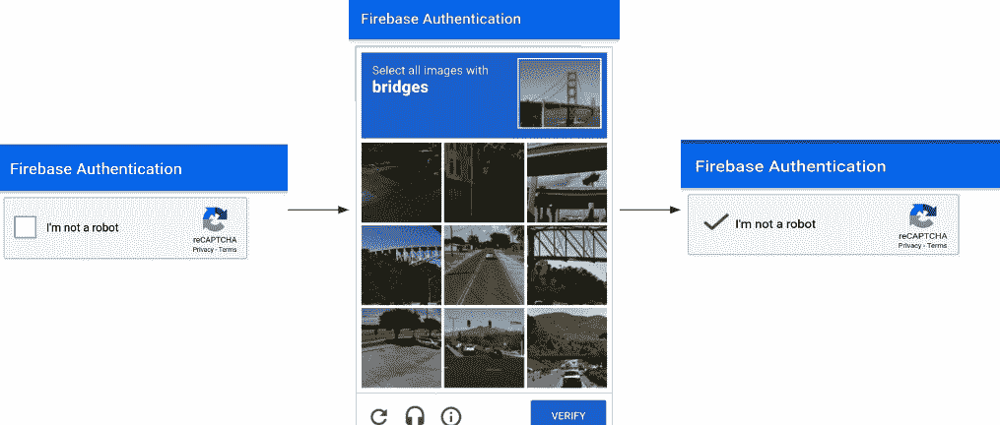
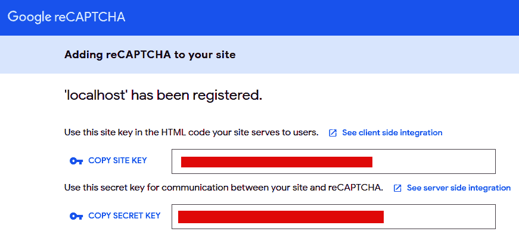

# 构建人工智能认证系统

身份验证是任何应用程序中最突出的功能之一，无论它是本机移动软件还是网站，并且自从保护数据的需求以及与机密有关的隐私需求开始以来，身份验证一直是一个活跃的领域。 在互联网上共享的数据。 在本章中，我们将从基于 Firebase 的简单登录到应用程序开始，然后逐步改进以包括基于人工智能（AI）的身份验证置信度指标和 Google 的 ReCaptcha。 所有这些身份验证方法均以深度学习为核心，并提供了一种在移动应用程序中实现安全性的最新方法。

在本章中，我们将介绍以下主题：

*   一个简单的登录应用程序
*   添加 Firebase 身份验证
*   了解用于身份验证的异常检测
*   用于验证用户的自定义模型
*   实施 ReCaptcha 以保护垃圾邮件
*   在 Flutter 中部署模型

# 技术要求

对于移动应用程序，需要具有 Flutter 的 Visual Studio Code 和 Dart 插件以及 Firebase Console

[GitHub 网址](https://github.com/PacktPublishing/Mobile-Deep-Learning-Projects/tree/master/Chapter6)。

# 一个简单的登录应用程序

我们将首先创建一个简单的身份验证应用程序，该应用程序使用 Firebase 身份验证对用户进行身份验证，然后再允许他们进入主屏幕。 该应用程序将允许用户输入其电子邮件和密码来创建一个帐户，然后使他们随后可以使用此电子邮件和密码登录。

以下屏幕快照显示了应用程序的完整流程：



该应用程序的小部件树如下：



现在让我们详细讨论每个小部件的实现。

# 创建 UI

让我们从创建应用程序的登录屏幕开始。 **用户界面**（**UI**）将包含两个 TextFormField 来获取用户的电子邮件 ID 和密码，RaisedButton 进行注册/登录，以及 FlatButton 进行注册和登录之间的切换 在操作中。

以下屏幕快照标记了将用于应用程序的第一个屏幕的小部件：



现在让我们创建应用程序的 UI，如下所示：

1.  我们首先创建一个名为`signup_signin_screen.dart`的新 dart 文件。 该文件包含一个有状态的小部件– `SignupSigninScreen`。
2.  第一个屏幕中最上面的窗口小部件是`TextField`，用于获取用户的邮件 ID。 `_createUserMailInput()`方法可帮助我们构建窗口小部件：

```py
 Widget _createUserMailInput() {
  return Padding(
     padding: const EdgeInsets.fromLTRB(0.0, 100.0, 0.0, 0.0),
     child: new TextFormField(
       maxLines: 1,
       keyboardType: TextInputType.emailAddress,
       autofocus: false,
       decoration: new InputDecoration(
           hintText: 'Email',
           icon: new Icon(
             Icons.mail,
             color: Colors.grey,
           )),
       validator: (value) => value.isEmpty ? 'Email can\'t be empty' : null,
       onSaved: (value) => _usermail = value.trim(),
     ),
   );
 }
```

首先，我们使用`EdgeInsets.fromLTRB()`为小部件提供了填充。 这有助于我们在四个基本方向的每个方向（即左，上，右和下）上创建具有不同值的偏移量。 接下来，我们使用`maxLines`（输入的最大行数）创建了`TextFormField`，其值为`1`作为子级，它接收用户的电子邮件地址。 另外，根据输入类型`TextInputType.emailAddress`，我们指定了将在属性`keyboardType`中使用的键盘类型。 然后，将`autoFocus`设置为`false`。 然后，我们在装饰属性中使用`InputDecoration`提供`hintText "Email"`和图标`Icons.mail`。 为了确保用户在没有输入电子邮件地址或密码的情况下不要尝试登录，我们添加了一个验证器。 当尝试使用空字段登录时，将显示警告“电子邮件不能为空”。 最后，我们通过使用`trim()`删除所有尾随空格来修剪输入的值，然后将输入的值存储在`_usermail`字符串变量中。

3.  与“步骤 2”中的`TextField`相似，我们定义了下一个方法`_createPasswordInput()`，以创建用于输入密码的`TextFormField()`：

```py
Widget _createPasswordInput() {
   return Padding(
     padding: const EdgeInsets.fromLTRB(0.0, 15.0, 0.0, 0.0),
     child: new TextFormField(
       maxLines: 1,
       obscureText: true,
       autofocus: false,
       decoration: new InputDecoration(
           hintText: 'Password',
           icon: new Icon(
             Icons.lock,
             color: Colors.grey,
           )),
       validator: (value) => value.isEmpty ? 'Password can\'t be empty' : null,
       onSaved: (value) => _userpassword = value.trim(),
     ),
   );
 }
```

我们首先使用`EdgeInsets.fromLTRB()`在所有四个基本方向上提供填充，以在顶部提供`15.0`的偏移量。 接下来，我们创建一个`TextFormField`，其中`maxLines`为`1`，并将`obscureText`设置为`true`，将`autofocus`设置为`false`。 `obscureText`用于隐藏正在键入的文本。 我们使用`InputDecoration`提供`hintText`密码和一个灰色图标`Icons.lock`。 为确保文本字段不为空，使用了一个验证器，当传递空值时，该警告器会发出警告`Password can't be empty`，即用户尝试在不输入密码的情况下登录/注册。 最后，`trim()`用于删除所有尾随空格，并将密码存储在`_userpassword`字符串变量中。

4.  接下来，我们在`_SignupSigninScreenState`外部声明`FormMode`枚举，该枚举在两种模式`SIGNIN`和`SIGNUP`之间运行，如以下代码片段所示：

```py
enum FormMode { SIGNIN, SIGNUP }
```

我们将对该按钮使用此枚举，该按钮将使用户既可以登录又可以注册。 这将帮助我们轻松地在两种模式之间切换。 枚举是一组用于表示常量值的标识符。

使用`enum`关键字声明枚举类型。 在`enum`内部声明的每个标识符都代表一个整数值； 例如，第一标识符具有值`0`，第二标识符具有值`1`。 默认情况下，第一个标识符的值为`0`。

5.  让我们定义一个`_createSigninButton()`方法，该方法返回按钮小部件以使用户注册并登录：

```py
 Widget _createSigninButton() {
   return new Padding(
       padding: EdgeInsets.fromLTRB(0.0, 45.0, 0.0, 0.0),
       child: SizedBox(
         height: 40.0,
         child: new RaisedButton(
           elevation: 5.0,
           shape: new RoundedRectangleBorder(borderRadius: new BorderRadius.circular(30.0)),
           color: Colors.blue,
           child: _formMode == FormMode.SIGNIN
               ? new Text('SignIn',
                   style: new TextStyle(fontSize: 20.0, color: Colors.white))
               : new Text('Create account',
                   style: new TextStyle(fontSize: 20.0, color: Colors.white)),
           onPressed: _signinSignup,
         ),
       ));
 }
```

我们从`Padding`开始，将`45.0`的按钮`offset`置于顶部，然后将`SizedBox`和`40.0`的`height`作为孩子，并将`RaisedButton`作为其孩子。 使用`RoundedRectangleBorder()`为凸起的按钮赋予圆角矩形形状，其边框半径为`30.0`，颜色为`blue`。 作为子项添加的按钮的文本取决于`_formMode`的当前值。 如果`_formMode`的值（`FormMode`枚举的一个实例）为`FormMode.SIGNIN`，则按钮显示`SignIn`，否则创建帐户。 按下按钮时将调用`_signinSignup`方法，该方法将在后面的部分中介绍。

6.  现在，我们将第四个按钮添加到屏幕上，以使用户在`SIGNIN`和`SIGNUP`表单模式之间切换。 我们定义返回`FlatButton`的`_createSigninSwitchButton()`方法，如下所示：

```py
 Widget _createSigninSwitchButton() {
   return new FlatButton(
     child: _formMode == FormMode.SIGNIN
         ? new Text('Create an account',
             style: new TextStyle(fontSize: 18.0, fontWeight: FontWeight.w300))
         : new Text('Have an account? Sign in',
             style:
                 new TextStyle(fontSize: 18.0, fontWeight: FontWeight.w300)),
     onPressed: _formMode == FormMode.SIGNIN
         ? _switchFormToSignUp
         : _switchFormToSignin,
   );
 }
```

如果`_formMode`的当前值为 SIGNIN 并按下按钮，则应更改为 SIGNUP 并显示`Create an account`。 否则，如果`_formMode`将 SIGNUP 作为其当前值，并且按下按钮，则该值应切换为由文本`Have an account? Sign in`表示的 SIGNIN。 使用三元运算符创建`RaisedButton`的`Text`子级时，添加了在文本之间切换的逻辑。 `onPressed`属性使用非常相似的逻辑，该逻辑再次检查`_formMode`的值以在模式之间切换并使用`_switchFormToSignUp`和`_switchFormToSignin`方法更新`_formMode`的值。 我们将在“步骤 7”和`8`中定义`_switchFormToSignUp`和`_switchFormToSignin`方法。

7.  现在，我们定义`_switchFormToSignUp()`如下：

```py
 void _switchFormToSignUp() {
   _formKey.currentState.reset();
   setState(() {
     _formMode = FormMode.SIGNUP;
   });
 }
```

此方法重置`_formMode`的值并将其更新为`FormMode.SIGNUP`。 更改`setState()`内部的值有助于通知框架该对象的内部状态已更改，并且 UI 可能需要更新。

8.  我们以与`_switchFormToSignUp()`非常相似的方式定义`_switchFormToSignin()`：

```py
 void _switchFormToSignin() {
   _formKey.currentState.reset();
   setState(() {
     _formMode = FormMode.SIGNIN;
   });
 }
```

此方法重置`_formMode`的值并将其更新为`FormMode.SIGNIN`。 更改`setState()`内部的值有助于通知框架该对象的内部状态已更改，并且 UI 可能需要更新。

9.  现在，让我们将所有屏幕小部件`Email TextField`，`Password TextFied`，`SignIn Button`和`FlatButton`切换为在单个容器中进行注册和登录。 为此，我们定义了一种方法`createBody()`，如下所示：

```py
 Widget _createBody(){
   return new Container(
       padding: EdgeInsets.all(16.0),
       child: new Form(
         key: _formKey,
         child: new ListView(
           shrinkWrap: true,
           children: <Widget>[
             _createUserMailInput(),
             _createPasswordInput(),
             _createSigninButton(),
             _createSigninSwitchButton(),
             _createErrorMessage(),
           ],
         ),
       )
    );
 }
```

此方法返回一个以`Form`作为子元素的新`Container`并为其填充`16.0`。 表单使用`_formKey`作为其键，并添加`ListView`作为其子级。 `ListView`的元素是我们在前述方法中创建的用于添加`TextFormFields`和`Buttons`的小部件。 `shrinkWrap`设置为`true`，以确保`ListView`仅占用必要的空间，并且不会尝试扩展和填充整个屏幕

`Form`类用于将多个`FormFields`一起分组和验证。 在这里，我们使用`Form`将两个`TextFormFields`，一个`RaisedButton`和一个`FlatButton`包装在一起。

10.  这里要注意的一件事是，由于进行身份验证，因此用户最终将成为网络操作，因此可能需要一些时间来发出网络请求。 在此处添加进度条可防止在进行网络操作时 UI 的死锁。 我们声明`boolean`标志`_loading`，当网络操作开始时将其设置为`true`。 现在，我们定义一种`_createCircularProgress()`方法，如下所示：

```py
 Widget _createCircularProgress(){
   if (_loading) {
     return Center(child: CircularProgressIndicator());
   } return Container(height: 0.0, width: 0.0,);
 }
```

仅当`_loading`为`true`并且正在进行网络操作时，该方法才返回`CircularProgressIndicator()`。

11.  最后，让我们在`build()`方法内添加所有小部件：

```py
 @override
 Widget build(BuildContext context) {
   return new Scaffold(
       appBar: new AppBar(
         title: new Text('Firebase Authentication'),
       ),
       body: Stack(
         children: <Widget>[
           _createBody(),
           _createCircularProgress(),
         ],
       ));
 }
```

从`build()`内部，添加包含应用程序标题的`AppBar`变量后，我们返回一个支架。 支架的主体包含一个带有子项的堆栈，这些子项是`_createBody()`和`_createCircularProgress()` 函数调用返回的小部件。

现在，我们已经准备好应用程序的主要 UI 结构。

可以在[这个页面](https://github.com/PacktPublishing/-Mobile-Deep-Learning-Projects/blob/master/Chapter6/firebase_authentication/lib/signup_login_screen.dart)中找到`SignupSigninScreen`的完整代码。

在下一部分中，我们将介绍将 Firebase 身份验证添加到应用程序中涉及的步骤。

# 添加 Firebase 身份验证

如前所述，在“简单登录应用程序”部分中，我们将使用用户的电子邮件和密码通过 Firebase 集成身份验证。

要在 Firebase 控制台上创建和配置 Firebase 项目，请参考“附录”。

以下步骤详细讨论了如何在 Firebase Console 上设置项目：

1.  我们首先在 Firebase 控制台上选择项目：


2.  接下来，我们将在 Develop 菜单中单击 Authentication 选项：



这将带我们进入身份验证屏幕。

3.  迁移到登录标签并启用登录提供者下的“电子邮件/密码”选项：


这是设置 Firebase 控制台所需的全部。

接下来，我们将 Firebase 集成到代码中。 这样做如下：

1.  迁移到 Flutter SDK 中的项目，然后将`firebase-auth`添加到应用程序级别`build.gradle`文件中：

```py
implementation 'com.google.firebase:firebase-auth:18.1.0'
```

2.  为了使`FirebaseAuthentication`在应用程序中正常工作，我们将在此处使用`firebase_auth`插件。 在`pubspec.yaml`文件的依赖项中添加插件依赖项：

```py
firebase_auth: 0.14.0+4
```

确保运行`flutter pub get`以安装依赖项。

现在，让我们编写一些代码以在应用程序内部提供 Firebase 身份验证功能。

# 创建 auth.dart

现在，我们将创建一个 Dart 文件`auth.dart`。 该文件将作为访问`firebase_auth`插件提供的身份验证方法的集中点：

1.  首先，导入`firebase_auth`插件：

```py
import 'package:firebase_auth/firebase_auth.dart';
```

2.  现在，创建一个抽象类`BaseAuth`，该类列出了所有身份验证方法，并充当 UI 组件和身份验证方法之间的中间层：

```py
abstract class BaseAuth {
 Future<String> signIn(String email, String password);
 Future<String> signUp(String email, String password);
 Future<String> getCurrentUser();
 Future<void> signOut();
}
```

顾名思义，这些方法将使用身份验证的四个主要功能：

*   `signIn()`：使用电子邮件和密码登录已经存在的用户
*   `signUp()`：使用电子邮件和密码为新用户创建帐户
*   `getCurrentUser()`：获取当前登录的用户
*   `signOut()`：注销已登录的用户

这里要注意的重要一件事是，由于这是网络操作，因此所有方法都异步操作，并在执行完成后返回`Future`值。

3.  创建一个实现`BaseAuth`的`Auth`类：

```py
class Auth implements BaseAuth {
    //. . . . . 
}
```

在接下来的步骤中，我们将定义`BaseAuth`中声明的所有方法。

4.  创建`FirebaseAuth`的实例：

```py
final FirebaseAuth _firebaseAuth = FirebaseAuth.instance;
```

5.  `signIn()`方法实现如下：

```py
 Future<String> signIn(String email, String password) async {
     AuthResult result = await _firebaseAuth.signInWithEmailAndPassword(email: email, password: password);
    FirebaseUser user = result.user;
    return user.uid;
}
```

此方法接收用户的电子邮件和密码，然后调用`signInWithEmailAndPassword()`，并传递电子邮件和密码以登录已经存在的用户。 登录操作完成后，将返回`AuthResult`实例。 我们将其存储在`result`中，还使用`result.user`，它返回`FirebaseUser.`。它可用于获取与用户有关的信息，例如他们的`uid`，`phoneNumber`和`photoUrl`。 在这里，我们返回`user.uid`，它是每个现有用户的唯一标识。 如前所述，由于这是网络操作，因此它异步运行，并在执行完成后返回`Future`。

6.  接下来，我们将定义`signUp()`方法以添加新用户：

```py
Future<String> signUp(String email, String password) async {
    AuthResult result = await _firebaseAuth.createUserWithEmailAndPassword(email: email, password: password);
    FirebaseUser user = result.user;
    return user.uid;
 }
```

前面的方法接收在注册过程中使用的电子邮件和密码，并将其值传递给`createUserWithEmailAndPassword`。 类似于上一步中定义的对象，此调用还返回`AuthResult`对象，该对象还用于提取`FirebaseUser`。 最后，`signUp`方法返回新创建的用户的`uid`。

7.  现在，我们将定义`getCurrentUser()`：

```py
 Future<String> getCurrentUser() async {
   FirebaseUser user = await _firebaseAuth.currentUser();
   return user.uid;
 }
```

在先前定义的功能中，我们使用`_firebaseAuth.currentUser()`提取当前登录用户的信息。 此方法返回包装在`FirebaseUser`对象中的完整信息。 我们将其存储在`user`变量中。 最后，我们使用`user.uid`返回用户的`uid`。

8.  接下来，我们执行`signOut()`：

```py
Future<void> signOut() async {
   return _firebaseAuth.signOut();
 }
```

此函数仅在当前`FirebaseAuth`实例上调用`signOut()`并注销已登录的用户。

至此，我们已经完成了用于实现 Firebase 身份验证的所有基本编码。

可以在[这个页面](https://github.com/PacktPublishing/-Mobile-Deep-Learning-Projects/blob/master/Chapter6/firebase_authentication/lib/auth.dart)中查看`auth.dart`中的整个代码。

现在让我们看看如何在应用程序内部使身份验证生效。

# 在 SignupSigninScreen 中添加身份验证

在本节中，我们将在`SignupSigninScreen`中添加 Firebase 身份验证。

我们在`signup_signin_screen.dart`文件中定义了`_signinSignup()`方法。 当按下登录按钮时，将调用该方法。 该方法的主体如下所示：

```py
 void _signinSignup() async {
   setState(() {
     _loading = true;
   });
     String userId = "";     
       if (_formMode == FormMode.SIGNIN) {
         userId = await widget.auth.signIn(_usermail, _userpassword);
       } else {
         userId = await widget.auth.signUp(_usermail, _userpassword);
       }
       setState(() {
         _loading = false;
       });
       if (userId.length > 0 && userId != null && _formMode == FormMode.SIGNIN) {
         widget.onSignedIn();
       }
}
```

在上述方法中，我们首先将`_loading`的值设置为`true`，以便进度条显示在屏幕上，直到登录过程完成。 接下来，我们创建一个`userId`字符串，一旦登录/登录操作完成，该字符串将存储`userId`的值。 现在，我们检查`_formMode`的当前值。 如果等于`FormMode.SIGNIN`，则用户希望登录到现有帐户。 因此，我们使用传递到`SignupSigninScreen`构造器中的实例来调用`Auth`类内部定义的`signIn()`方法。

这将在后面的部分中详细讨论。 否则，如果`_formMode`的值等于`FormMode.SIGNUP`，则将调用`Auth`类的`signUp()`方法，并传递用户的邮件和密码以创建新帐户。 一旦成功完成登录/注册，`userId`变量将用于存储用户的 ID。 整个过程完成后，将`_loading`设置为`false`，以从屏幕上删除循环进度指示器。 另外，如果在用户登录到现有帐户时`userId`具有有效值，则将调用`onSignedIn()`，这会将用户定向到应用程序的主屏幕。

此方法也传递给`SignupSigninScreen`的构造器，并将在后面的部分中进行讨论。 最后，我们将整个主体包裹在`try-catch`块中，以便在登录过程中发生的任何异常都可以捕获而不会导致应用程序崩溃，并可以在屏幕上显示。

# 创建主屏幕

我们还需要确定身份验证状态，即用户在启动应用程序时是否已登录，如果已经登录，则将其定向到主屏幕。如果尚未登录，则应显示`SignInSignupScreen` 首先，在完成该过程之后，将启动主屏幕。 为了实现这一点，我们在新的 dart 文件`main_screen.dart`中创建一个有状态的小部件`MainScreen`，然后执行以下步骤：

1.  我们将从定义枚举`AuthStatus`开始，该枚举表示用户的当前身份验证状态，可以登录或不登录：

```py
enum AuthStatus {
 NOT_SIGNED_IN,
 SIGNED_IN,
}
```

2.  现在，我们创建`enum`类型的变量来存储当前身份验证状态，其初始值设置为`NOT_SIGNED_IN`：

```py
AuthStatus authStatus = AuthStatus.NOT_SIGNED_IN;
```

3.  初始化小部件后，我们将通过覆盖`initState()`方法来确定用户是否已登录：

```py
 @override
 void initState() {
   super.initState();
   widget.auth.getCurrentUser().then((user) {
     setState(() {
       if (user != null) {
         _userId = user;
       }
       authStatus =
           user == null ? AuthStatus.NOT_SIGNED_IN : AuthStatus.SIGNED_IN;
     });
   });
 }
```

使用在构造器中传递的类的实例调用`Auth`类的`getCurrentUser()`。 如果该方法返回的值不为 null，则意味着用户已经登录。因此，`_userId`字符串变量的值设置为返回的值。 另外，将`authStatus`设置为`AuthStatus.SIGNED_IN.`，否则，如果返回的值为`null`，则意味着没有用户登录，因此`authStatus`的值设置为`AuthStatus.NOT_SIGNED_IN`。

4.  现在，我们将定义另外两个方法`onSignIn()`和`onSignOut()`，以确保将身份验证状态正确存储在变量中，并相应地更新用户界面：

```py
void _onSignedIn() {
   widget.auth.getCurrentUser().then((user){
     setState(() {
       _userId = user;
     });
   });
   setState(() {
     authStatus = AuthStatus.SIGNED_IN;
   });
 }
 void _onSignedOut() {
   setState(() {
     authStatus = AuthStatus.NOT_SIGNED_IN;
     _userId = "";
   });
 }
```

`_onSignedIn()`方法检查用户是否已经登录，并将`authStatus`设置为`AuthStatus.SIGNED_IN.`。 `_onSignedOut()`方法检查用户是否已注销，并将`authStatus`设置为`AuthStatus.SIGNED_OUT`。

5.  最后，我们重写`build`方法将用户定向到正确的屏幕：

```py
 @override
 Widget build(BuildContext context) {
   if(authStatus == AuthStatus.SIGNED_OUT) {
     return new SignupSigninScreen(
       auth: widget.auth,
       onSignedIn: _onSignedIn,
     );
   } else {
     return new HomeScreen(
       userId: _userId,
       auth: widget.auth,
       onSignedOut: _onSignedOut,
       );
   }
 }
```

如果`authStatus`为`AuthStatus.SIGNED_OUT`，则返回`SignupSigninScreen`，并传递`auth`实例和`_onSignedIn()`方法。 否则，将直接返回`HomeScreen`，并传递已登录用户的`userId`，`Auth`实例类和`_onSignedOut()`方法。

[可以在此处查看`main_screen.dart`的完整代码](https://github.com/PacktPublishing/-Mobile-Deep-Learning-Projects/blob/master/Chapter6/firebase_authentication/lib/main_screen.dart)。

在下一部分中，我们将为应用程序添加一个非常简单的主屏幕。

# 创建主屏幕

由于我们对身份验证部分更感兴趣，因此主屏幕（即成功登录后指向用户的屏幕）应该非常简单。 它仅包含一些文本和一个注销选项。 正如我们对所有先前的屏幕和小部件所做的一样，我们首先创建一个`home_screen.dart`文件和一个有状态的`HomeScreen`小部件。

主屏幕将显示如下：



此处的完整代码位于重写的`build()`方法内部：

```py
 @override
 Widget build(BuildContext context) {
     return new Scaffold(
         appBar: new AppBar(
             title: new Text('Firebase Authentication'),
             actions: <Widget>[
                 new FlatButton(
                     child: new Text('Logout',
                     style: new TextStyle(fontSize: 16.0, color: Colors.white)),
                     onPressed: _signOut
                 )
             ],
         ),
         body: Center(child: new Text('Hello User', 
         style: new TextStyle(fontSize: 32.0))
         ),
     );
 }
```

我们在此处返回`Scaffold`，其中包含标题为`Text Firebase Authentication`的`AppBar`和`actions`属性的小部件列表。 `actions`用于在应用程序标题旁边添加小部件列表到应用程序栏中。 在这里，它仅包含`FlatButton`，`Logout`，在按下时将调用`_signOut`。

`_signOut()`方法显示如下：

```py
 _signOut() async {
   try {
     await widget.auth.signOut();
     widget.onSignedOut();
   } catch (e) {
     print(e);
   }
 }
```

该方法主要是调用`Auth`类中定义的`signOut()`方法，以将用户从应用程序中注销。 回忆传入`HomeScreen`的`MainScreen`的`_onSignedOut()`方法。 当用户退出时，该方法在此处用作`widget.onSignedOut()`来将`authStatus`更改为`SIGNED_OUT`。 同样，它包装在`try-catch`块中，以捕获并打印此处可能发生的任何异常。

[可以在此处查看`home_screen.dart`的整个代码](https://github.com/PacktPublishing/-Mobile-Deep-Learning-Projects/blob/master/Chapter6/firebase_authentication/lib/main.dart)。

至此，应用程序的主要组件已经准备就绪，现在让我们创建最终的材质应用程序。

# 创建 main.dart

在`main.dart`内部，我们创建`Stateless Widget`，`App`，并覆盖`build()`方法，如下所示：

```py
 @override
 Widget build(BuildContext context) {
   return new MaterialApp(
       title: 'Firebase Authentication',
       debugShowCheckedModeBanner: false,
       theme: new ThemeData(
         primarySwatch: Colors.blue,
       ),
       home: new MainScreen(auth: new Auth()));
 }
```

该方法从主屏幕返回`MaterialApp`，以提供标题，主题。

[可以在此处查看`main.dart`文件](https://github.com/PacktPublishing/-Mobile-Deep-Learning-Projects/blob/master/Chapter6/firebase_authentication/lib/main.dart)。

# 了解用于身份验证的异常检测

异常检测是机器学习的一个备受关注的分支。 该术语含义简单。 基本上，它是用于检测异常的方法的集合。 想象一袋苹果。 识别并挑选坏苹果将是异常检测的行为。

异常检测以几种方式执行：

*   通过使用列的最小最大范围来识别数据集中与其余样本非常不同的数据样本
*   通过将数据绘制为线形图并识别图中的突然尖峰
*   通过围绕高斯曲线绘制数据并将最末端的点标记为离群值（异常）

一些常用的方法是支持向量机，贝叶斯网络和 K 最近邻。 在本节中，我们将重点介绍与安全性相关的异常检测。

假设您通常在家中登录应用程序上的帐户。 如果您突然从数千英里外的位置登录帐户，或者在另一种情况下，您以前从未使用过公共计算机登录帐户，那将是非常可疑的，但是突然有一天您这样做。 另一个可疑的情况可能是您尝试 10-20 次密码，每次在成功成功登录之前每次都输入错误密码。 当您的帐户遭到盗用时，所有这些情况都是可能的行为。 因此，重要的是要合并一个能够确定您的**常规**行为并对**异常**行为进行分类的系统。 换句话说，即使黑客使用了正确的密码，企图破坏您的帐户的尝试也应标记为异常。

这带给我们一个有趣的观点，即确定用户的常规行为。 我们如何做到这一点？ 什么是正常行为？ 它是针对每个用户的还是一个通用概念？ 问题的答案是它是非常特定于用户的。 但是，行为的某些方面对于所有用户而言都可以相同。 一个应用程序可能会在多个屏幕上启动登录。 单个用户可能更喜欢其中一种或两种方法。 这将导致特定于该用户的特定于用户的行为。 但是，如果尝试从未由开发人员标记为登录屏幕的屏幕进行登录，则无论是哪个用户尝试登录，都肯定是异常的。

在我们的应用程序中，我们将集成一个这样的系统。 为此，我们将记录一段时间内我们应用程序的许多用户进行的所有登录尝试。 我们将特别注意他们尝试登录的屏幕以及它们传递给系统的数据类型。 一旦收集了很多这些样本，就可以根据用户执行的任何操作来确定系统对身份验证的信心。 如果系统在任何时候认为用户表现出的行为与他们的惯常行为相差很大，则该用户将未经身份验证并被要求验证其帐户详细信息。

让我们从创建预测模型开始，以确定用户身份验证是常规的还是异常的。

# 用于验证用户的自定义模型

我们将本节分为两个主要子节：

*   建立验证有效性检查的模型
*   托管自定义身份验证验证模型

让我们从第一部分开始。

# 建立验证有效性检查的模型

在本部分中，我们将构建模型来确定是否有任何用户正在执行常规登录或异常登录：

1.  我们首先导入必要的模块，如下所示：

```py
import sys
import os
import json
import pandas
import numpy
from keras.models import Sequential
from keras.layers import LSTM, Dense, Dropout
from keras.layers.embeddings import Embedding
from keras.preprocessing import sequence
from keras.preprocessing.text import Tokenizer
from collections import OrderedDict
```

2.  现在，我们将数据集导入到项目中。 可以在[这里](https://github.com/PacktPublishing/Mobile-Deep-Learning-Projects/blob/master/Chapter6/Model/data/data.csv)中找到该数据集：

```py
csv_file = 'data.csv'

dataframe = pandas.read_csv(csv_file, engine='python', quotechar='|', header=None)
count_frame = dataframe.groupby([1]).count()
print(count_frame)
total_req = count_frame[0][0] + count_frame[0][1]
num_malicious = count_frame[0][1]

print("Malicious request logs in dataset: {:0.2f}%".format(float(num_malicious) / total_req * 100))
```

前面的代码块将 CSV 数据集加载到项目中。 它还会打印一些与数据有关的统计信息，如下所示：


3.  我们在上一步中加载的数据目前尚无法使用，无法进行深度学习。 在此步骤中，我们将其分为功能列和标签列，如下所示：

```py
X = dataset[:,0]
Y = dataset[:,1]
```

4.  接下来，我们将删除数据集中包含的某些列，因为我们不需要所有这些列来构建简单的模型：

```py
for index, item in enumerate(X):
    reqJson = json.loads(item, object_pairs_hook=OrderedDict)
    del reqJson['timestamp']
    del reqJson['headers']
    del reqJson['source']
    del reqJson['route']
    del reqJson['responsePayload']
    X[index] = json.dumps(reqJson, separators=(',', ':'))
```

5.  接下来，我们将在剩余的请求正文上执行标记化。 标记化是一种用于将大文本块分解为较小文本的方法，例如将段落分成句子，将句子分成单词。 我们这样做如下：

```py
tokenizer = Tokenizer(filters='\t\n', char_level=True)
tokenizer.fit_on_texts(X)
```

6.  标记化之后，我们将请求正文中的文本转换为单词向量，如下一步所示。 我们将数据集和`DataFrame`标签分为两部分，即 75%-25%，以进行训练和测试：

```py
num_words = len(tokenizer.word_index)+1
X = tokenizer.texts_to_sequences(X)

max_log_length = 1024
train_size = int(len(dataset) * .75)

X_processed = sequence.pad_sequences(X, maxlen=max_log_length)
X_train, X_test = X_processed[0:train_size], X_processed[train_size:len(X_processed)]
Y_train, Y_test = Y[0:train_size], Y[train_size:len(Y)]
```

7.  接下来，我们基于**长短期记忆**（**LSTM**）创建基于**循环神经网络**（**RNN**）的学习方法 识别**常规**用户行为。 将单词嵌入添加到层中，以帮助维持单词向量和单词之间的关系：

```py
model = Sequential()
model.add(Embedding(num_words, 32, input_length=max_log_length))
model.add(Dropout(0.5))
model.add(LSTM(64, recurrent_dropout=0.5))
model.add(Dropout(0.5))
model.add(Dense(1, activation='sigmoid'))
```

我们的输出是单个神经元，在正常登录的情况下，该神经元保存`0`；在登录异常的情况下，则保存`1`。

8.  现在，我们以精度作为度量标准编译模型，而损失则作为二进制交叉熵来计算：

```py
model.compile(loss='binary_crossentropy', optimizer='adam', metrics=['accuracy'])
print(model.summary())
```

9.  现在，我们准备进行模型的训练：

```py
model.fit(X_train, Y_train, validation_split=0.25, epochs=3, batch_size=128)
```

10.  我们将快速检查模型所达到的准确率。 当前模型的准确率超过 96%：

```py
score, acc = model.evaluate(X_test, Y_test, verbose=1, batch_size=128)
print("Model Accuracy: {:0.2f}%".format(acc * 100))
```

下面的屏幕快照显示了前面代码块的输出：


11.  现在，我们保存模型权重和模型定义。 我们稍后将它们加载到 API 脚本中，以验证用户的身份验证：

```py
model.save_weights('lstm-weights.h5')
model.save('lstm-model.h5')
```

现在，我们可以将身份验证模型作为 API 进行托管，我们将在下一部分中进行演示。

# 托管自定义身份验证验证模型

在本节中，我们将创建一个 API，用于在用户向模型提交其登录请求时对其进行身份验证。 请求标头将被解析为字符串，并且模型将使用它来预测登录是否有效：

1.  我们首先导入创建 API 服务器所需的模块：

```py
from sklearn.externals import joblib
from flask import Flask, request, jsonify
from string import digits

import sys
import os
import json
import pandas
import numpy
import optparse
from keras.models import Sequential, load_model
from keras.preprocessing import sequence
from keras.preprocessing.text import Tokenizer
from collections import OrderedDict
```

2.  现在，我们实例化一个`Flask`应用程序对象。 我们还将从上一节“构建用于身份验证有效性检查的模型”中加载保存的模型定义和模型权重。然后，我们重新编译模型，并使用`_make_predict_function( )`方法创建其预测方法，如以下步骤所示：

```py
app = Flask(__name__)

model = load_model('lstm-model.h5')
model.load_weights('lstm-weights.h5')
model.compile(loss = 'binary_crossentropy', optimizer = 'adam', metrics = ['accuracy'])
model._make_predict_function()
```

3.  然后，我们创建一个`remove_digits()`函数，该函数用于从提供给它的输入中去除所有数字。 这将用于在将请求正文文本放入模型之前清除它：

```py
def remove_digits(s: str) -> str:
    remove_digits = str.maketrans('', '', digits)
    res = s.translate(remove_digits)
    return res
```

4.  接下来，我们将在 API 服务器中创建`/login`路由。 该路由由`login()`方法处理，并响应`GET`和`POST`请求方法。 正如我们对训练输入所做的那样，我们删除了请求标头中的非必要部分。 这可以确保模型将对数据进行预测，类似于对其进行训练的数据：

```py
@app.route('/login', methods=['GET, POST'])
def login():
    req = dict(request.headers)
    item = {}
    item["method"] = str(request.method)
    item["query"] = str(request.query_string)
    item["path"] = str(request.path)
    item["statusCode"] = 200
    item["requestPayload"] = []

    ## MORE CODE BELOW THIS LINE

    ## MORE CODE ABOVE THIS LINE

    response = {'result': float(prediction[0][0])}
    return jsonify(response)
```

5.  现在，我们将代码添加到`login()`方法中，该方法将标记请求正文并将其传递给模型以执行有关登录请求有效性的预测，如下所示：

```py
@app.route('/login', methods=['GET, POST'])
def login():
    ...
    ## MORE CODE BELOW THIS LINE
    X = numpy.array([json.dumps(item)])
    log_entry = "store"

    tokenizer = Tokenizer(filters='\t\n', char_level=True)
    tokenizer.fit_on_texts(X)
    seq = tokenizer.texts_to_sequences([log_entry])
    max_log_length = 1024
    log_entry_processed = sequence.pad_sequences(seq, maxlen=max_log_length)

    prediction = model.predict(log_entry_processed)
    ## MORE CODE ABOVE THIS LINE
    ...
```

最后，应用程序以 JSON 字符串的形式返回其对用户进行身份验证的信心。

6.  最后，我们使用`app`的`run()`方法启动服务器脚本：

```py
if __name__ == '__main__':
    app.run(host='0.0.0.0', port=8000)
```

7.  将此文件另存为`main.py`。 要开始执行服务器，请打开一个新终端并使用以下命令：

```py
python main.py
```

服务器侦听其运行系统的所有传入 IP。 通过在 0.0.0.0 IP 上运行它，可以实现这一点。 如果我们希望稍后在基于云的服务器上部署脚本，则需要这样做。 如果不指定 0.0.0.0 主机，则默认情况下会使它侦听 127.0.0.1，这不适合在公共服务器上进行部署。 [您可以在此处详细了解这些地址之间的区别](https://xprilion.com/difference-between-localhost-127.0.0.1-and-0.0.0.0/)。

在下一节中，我们将看到如何将 ReCaptcha 集成到迄今为止在该项目中构建的应用程序中。 之后，我们将把本节中构建的 API 集成到应用程序中。

# 实施 ReCaptcha 以保护垃圾邮件

为了为 Firebase 身份验证增加另一层安全性，我们将使用 ReCaptcha。 这是 Google 所支持的一项测试，可帮助我们保护数据免受垃圾邮件和滥用行为的自动 bot 攻击。 该测试很简单，很容易被人类解决，但是却阻碍了漫游器和恶意用户的使用。

要了解有关 ReCaptcha 及其用途的更多信息，请访问[这里](https://support.google.com/recaptcha/?hl=en)。

# ReCAPTCHA v2

在本节中，我们将把 ReCaptcha 版本 2 集成到我们的应用程序中。 在此版本中，向用户显示一个简单的复选框。 如果刻度变为绿色，则表明用户已通过验证。

另外，还可以向用户提出挑战，以区分人和机器人。 这个挑战很容易被人类解决。 他们要做的就是根据说明选择一堆图像。 使用 ReCaptcha 进行身份验证的传统流程如下所示：



一旦用户能够验证其身份，他们就可以成功登录。

# 获取 API 密钥

要在我们的应用程序内部使用 ReCaptcha，我们需要在`reCAPTCHA`管理控制台中注册该应用程序，并获取站点密钥和秘密密钥。 为此，请访问[这里](https://www.google.com/recaptcha/admin)并注册该应用程序。 您将需要导航到“注册新站点”部分，如以下屏幕截图所示：


我们可以通过以下两个简单步骤来获取 API 密钥：

1.  首先提供一个域名。 在这里，我们将在 reCAPTCHA v2 下选择 reCAPTCHA Android。
2.  选择 Android 版本后，添加项目的程序包名称。 正确填写所有信息后，单击“注册”。

这将引导您到显示站点密钥和秘密密钥的屏幕，如以下屏幕快照所示：



将**站点密钥**和**秘密密钥**复制并保存到安全位置。 我们将在编码应用程序时使用它们。

# 代码整合

为了在我们的应用程序中包含 ReCaptcha v2，我们将使用 Flutter 软件包`flutter_recaptcha_v2`。 将`flutter_recaptcha_v2:0.1.0`依赖项添加到`pubspec.yaml`文件中，然后在终端中运行`flutter packages get`以获取所需的依赖项。 以下步骤详细讨论了集成：

1.  我们将代码添加到`signup_signin_screen.dart`。 首先导入依赖项：

```py
import 'package:flutter_recaptcha_v2/flutter_recaptcha_v2.dart';
```

2.  接下来，创建一个`RecaptchaV2Controller`实例：

```py
RecaptchaV2Controller recaptchaV2Controller = RecaptchaV2Controller();
```

3.  reCAPTCHA 复选框将添加为小部件。 首先，让我们定义一个返回小部件的`_createRecaptcha()`方法：

```py
 Widget _createRecaptcha() {
   return RecaptchaV2(
     apiKey: "Your Site Key here", 
     apiSecret: "Your API Key here", 
     controller: recaptchaV2Controller,
     onVerifiedError: (err){
       print(err);
     },
     onVerifiedSuccessfully: (success) {
       setState(() {
       if (success) {
         _signinSignup();
       } else {
         print('Failed to verify');
       }
       });
     },
   );
 }
```

在上述方法中，我们仅使用`RecaptchaV2()`构造器，即可为特定属性指定值。 添加您先前在`apiKey`和`apiSecret`属性中注册时保存的站点密钥和秘密密钥。 我们使用先前为属性控制器创建的`recaptcha`控制器`recaptchaV2Controller`的实例。 如果成功验证了用户，则将调用`_signinSignup()`方法以使用户登录。如果在验证期间发生错误，我们将打印错误。

4.  现在，由于在用户尝试登录时应显示`reCaptcha`，因此我们将`createSigninButton()`中的登录凸起按钮的`onPressed`属性修改为`recaptchaV2Controller`：

```py
Widget _createSigninButton() {
    . . . . . . .
    return new Padding(
        . . . . . . .
        child: new RaisedButton(
            . . . . . . 
            //Modify the onPressed property
            onPressed: recaptchaV2Controller.show
        )
    )
}
```

5.  最后，我们将`_createRecaptcha()`添加到`build()`内部的主体堆栈中：

```py
 @override
 Widget build(BuildContext context) {
    . . . . . . .
    return new Scaffold(
        . . . . . . .
        body: Stack(
            children: <Widget>[
                _createBody(),
                _createCircularProgress(),

                //Add reCAPTCHA Widget
                _createRecaptcha()
                 ],
       ));
 }
```

这就是一切！ 现在，我们具有比 Firebase 身份验证更高的安全级别，可以保护应用程序的数据免受自动机器人的攻击。 现在让我们看一下如何集成定制模型以检测恶意用户。

# 在 Flutter 中部署模型

至此，我们的 Firebase 身份验证应用程序与 ReCaptcha 保护一起运行。 现在，让我们添加最后的安全层，该层将不允许任何恶意用户进入应用程序。

[我们已经知道该模型位于以下端点](http://34.67.126.237:8000/login)。 我们只需从应用程序内部进行 API 调用，传入用户提供的电子邮件和密码，并从模型中获取结果值。 该值将通过使用阈值结果值来帮助我们判断登录是否是恶意的。

如果该值小于 0.20，则认为该登录名是恶意的，并且屏幕上将显示以下消息：


现在，让我们看一下在 Flutter 应用程序中部署模型的步骤：

1.  首先，由于我们正在获取数据并且将使用网络调用（即 HTTP 请求），因此我们需要向`pubspec.yaml`文件添加`http`依赖项，并按以下方式导入：

```py
import 'package:http/http.dart' as http;
```

2.  首先在`auth.dart:`内部定义的`BaseAuth`抽象类中添加以下函数声明

```py
 Future<double> isValidUser(String email, String password);
```

3.  现在，让我们在`Auth`类中定义`isValidUser()`函数：

```py
 Future<double> isValidUser(String email, String password) async{
   final response = await http.Client()
       .get('http://34.67.160.232:8000/login?user=$email&password=$password');
     var jsonResponse = json.decode(response.body);
     var val = '${jsonResponse["result"]}';
     double result = double.parse(val);     
     return result;
   }
```

此函数将用户的电子邮件和密码作为参数，并将它们附加到请求 URL，以便为特定用户生成输出。 `get request`响应存储在变量响应中。 由于响应为 JSON 格式，因此我们使用`json.decode()`对其进行解码，并将解码后的响应存储在另一个变量响应中。 现在，我们使用`‘${jsonResponse["result"]}'`访问`jsonResponse`中的结果值，使用`double.parse()`将其转换为双精度类型整数，并将其存储在结果中。 最后，我们返回结果的值。

4.  为了激活代码内部的恶意检测，我们从`SigninSignupScreen`调用了`isValidUser()`方法。 当具有现有帐户的用户选择从`if-else`块内部登录时，将调用此方法：

```py
if (_formMode == FormMode.SIGNIN) {

    var val = await widget.auth.isValidUser(_usermail, _userpassword);

    . . . .
    } else {
      . . . .   
    }
```

`isValidUser`返回的值存储在`val`变量中。

5.  如果该值小于 0.20，则表明登录活动是恶意的。 因此，我们将异常抛出并在 catch 块内抛出`catch`并在屏幕上显示错误消息。 这可以通过创建自定义异常类`MalicousUserException`来完成，该类在实例化时返回一条错误消息：

```py
class MaliciousUserException implements Exception {
  String message() => 'Malicious login! Please try later.';
}
```

6.  现在，我们将在调用`isValidUser()`之后添加`if`块，以检查是否需要抛出异常：

```py
var val = await widget.auth.isValidUser(_usermail, _userpassword);
//Add the if block 
if(val < 0.20) {
    throw new MaliciousUserException();
}
```

7.  现在，该异常已捕获在`catch`块内，并且不允许用户继续登录。此外，我们将`_loading`设置为`false`以表示不需要进一步的网络操作：

```py
catch(MaliciousUserException) {
       setState(() {
         _loading = false;
           _errorMessage = 'Malicious user detected. Please try again later.';
       });

```

这就是一切！ 我们之前基于 Firebase 身份验证创建的 Flutter 应用程序现在可以在后台运行智能模型的情况下找到恶意用户。

# 概要

在本章中，我们了解了如何使用 Flutter 和由 Firebase 支持的身份验证系统构建跨平台应用程序，同时结合了深度学习的优势。 然后，我们了解了如何将黑客攻击尝试归类为一般用户行为中的异常现象，并创建了一个模型来对这些异常现象进行分类以防止恶意用户登录。最后，我们使用了 Google 的 ReCaptcha 来消除对该应用程序的垃圾邮件使用，因此 使其在自动垃圾邮件或脚本化黑客攻击方面更具弹性。

在下一章中，我们将探索一个非常有趣的项目–使用移动应用程序上的深度学习生成音乐成绩单。