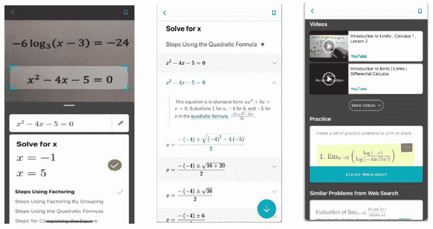
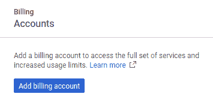
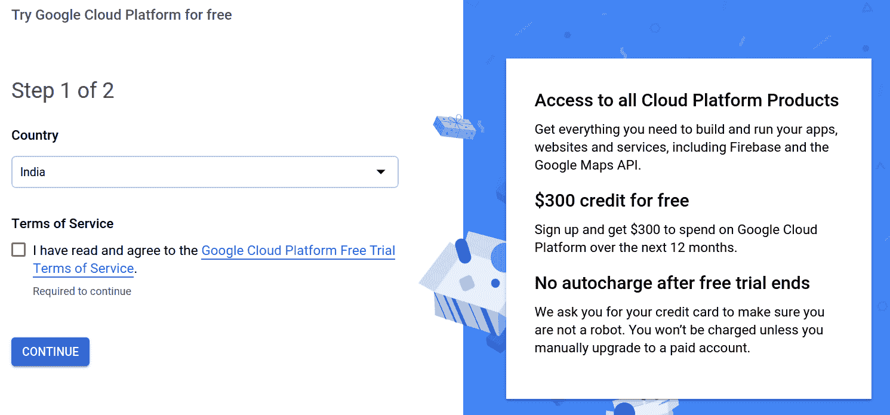
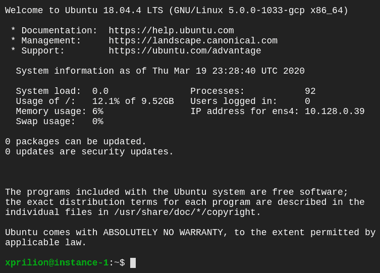
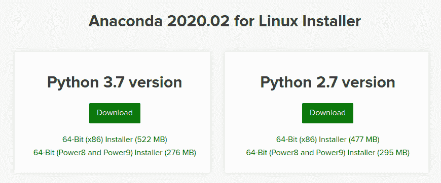
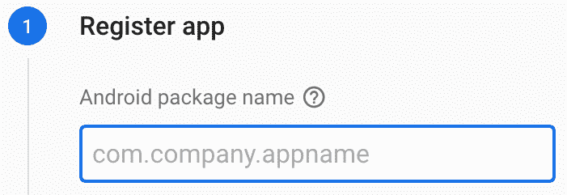
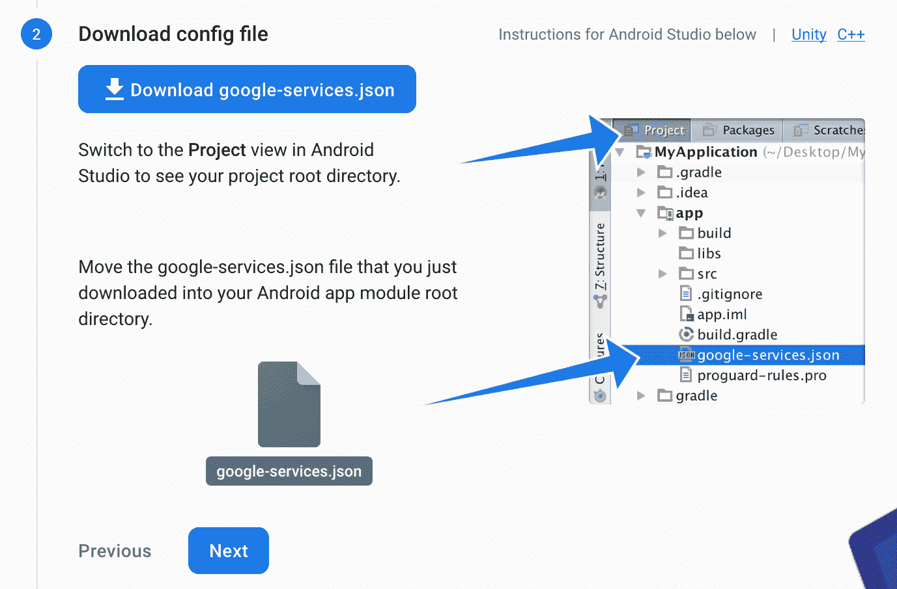
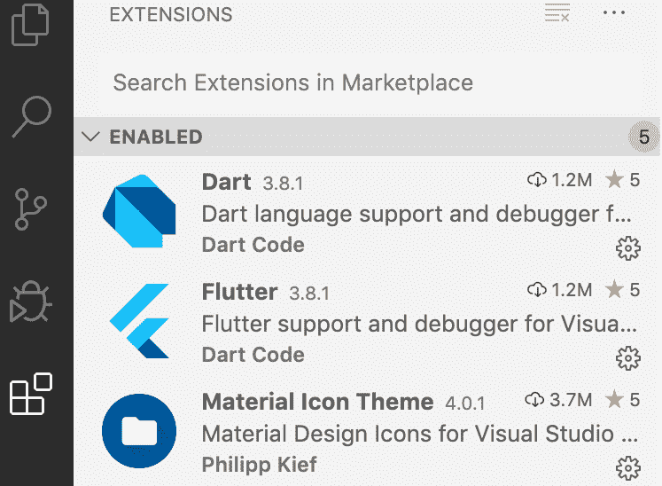
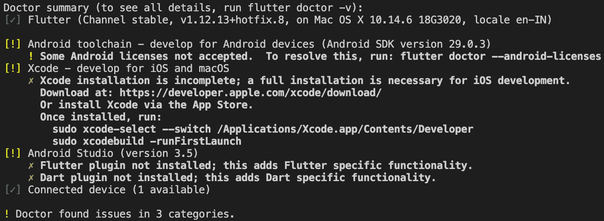
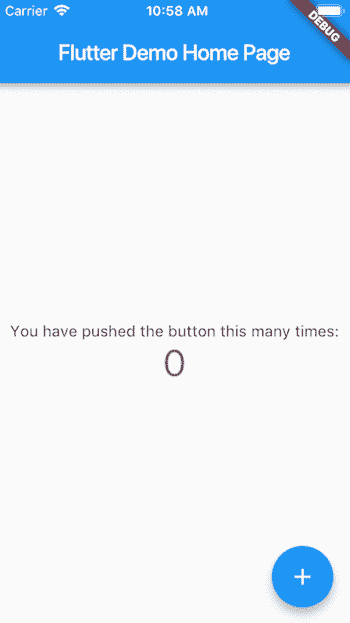

# 前面的路

旅程中最重要的部分是知道结束后要去哪里。 到目前为止，在本系列项目中，我们已经介绍了一些与 Flutter 应用程序相关的独特且功能强大的**深度学习**（**DL**）应用程序，但重要的是，您必须知道在哪里可以找到更多内容 这样的项目，灵感和知识来构建自己的出色项目。 在本章中，我们将简要介绍当今在移动应用程序上使用 DL 的最流行的应用程序，当前趋势以及将来在该领域中将会出现的情况。

在本章中，我们将介绍以下主题：

*   了解移动应用程序中 DL 的最新趋势
*   探索移动设备上 DL 的最新发展
*   探索移动应用中 DL 的当前研究领域

让我们开始研究 DL 移动应用程序世界中的一些趋势。

# 了解移动应用程序中 DL 的最新趋势

特别是 DL，随着最新技术和硬件的发展，**人工智能**（**AI**）变得越来越移动。 组织一直在使用智能算法来提供个性化的用户体验并提高应用程序参与度。 借助人脸检测，图像处理，文本识别，对象识别和语言翻译等技术，移动应用程序已不仅仅是提供静态信息的媒介。 它们能够适应用户的个人偏好和选择以及当前和过去的环境状况，以提供无缝的用户体验。

让我们看一下一些流行的应用程序及其部署的方法，以提供良好的用户体验，同时增加应用程序的参与度。

# 数学求解器

数学求解器应用程序由微软于 2020 年 1 月 16 日启动，可通过简单地单击智能手机上有问题的图片来帮助学生完成数学作业。 该应用程序为基本和高级数学问题提供支持，涵盖了广泛的主题，包括基本算术，二次方程，微积分和统计。 以下屏幕截图显示了该应用程序的工作方式：



用户可以在其智能手机上单击手写或打印问题的图片，或直接在设备上涂鸦或键入图片。 该应用程序利用 AI 来识别问题并准确解决。 此外，它还可以提供分步说明，并提供其他学习资料，例如与问题有关的工作表和视频教程。

# 网飞

Netflix 的推荐系统是在移动应用程序上使用 DL 的最大成功案例之一。 Netflix 利用多种算法来了解用户的偏好，并提供了他们可能感兴趣的推荐列表。所有内容都标记有标签，这些标签提供了可以从中学习算法的初始数据集。 此外，该系统监视着超过 1 亿个用户个人资料，以分析人们观看的内容，以后可能观看的内容，以前观看的内容，一年前观看的内容，等等。 将收集的所有数据汇总在一起，以了解用户可能感兴趣的内容类型。

然后，将使用标签和用户行为收集的数据汇总在一起，并输入到复杂的 ML 算法中。 这些数据有助于解释可能最重要的因素-例如，如果用户一年前观看的电影与上周观看的系列相比应被计数两次。 该算法还可以从用户行为中学习，例如用户喜欢还是不喜欢特定的内容，或者用户在 2 个晚上观看和观看的节目。 将所有因素汇总在一起并进行仔细分析，从而得出用户可能最感兴趣的建议列表。

# 谷歌地图

Google Maps 已帮助通勤者前往新地方，探索新城市并监控每日流量。 在 2019 年 6 月上旬，谷歌地图发布了一项新功能，使用户可以监控印度 10 个主要城市的巴士旅行时间，以及从印度铁路局获得实时更新。 该功能位于班加罗尔，钦奈，哥印拜陀，德里，海得拉巴，勒克瑙，孟买，浦那和苏拉特，它利用 Google 的实时交通数据和公交时刻表来计算准确的出行时间和延误。 支持该功能的算法可从总线位置随时间的顺序中学习。 该数据还与通勤时公交车上的汽车速度结合在一起。 数据还用于捕获特定街道的独特属性。 研究人员还模拟了围绕某个区域弹出查询的可能性，以使该模型更加健壮和准确。

# 火种

作为结识新朋友的全球最受欢迎的应用程序，Tinder 部署了许多学习模型，以增加喜欢特定个人资料的人数。 **智能照片**功能增加了用户找到正确匹配项的可能性。 该功能随机排序特定用户的图片并将其显示给其他人。 支持该功能的算法分析了向左或向右滑动图片的频率。 它使用该知识根据图片的受欢迎程度对其重新排序。 随着越来越多的数据收集，该算法的准确率一直在不断提高。

# Snapchat

Snapchat 使用的过滤器是在图片和视频的顶部添加的设计叠加层，可以跟踪面部移动。 这些过滤器是通过计算机视觉实现的。 应用程序使用的算法的第一步是检测图像中存在的面部。 它输出包围检测到的面部的框。 然后，它为检测到的每个脸部标记面部标志（例如眼睛，鼻子和嘴唇）。 这里的输出通常是一个包含`x`-坐标和`y`-坐标的二维点。 正确检测到面部和面部特征后，它将使用图像处理功能在整个面部上正确放置或应用滤镜。 该算法使用 Active Shape Model 进一步分析了关键的面部特征。 在通过手动标记关键面部特征的边界进行训练后，该模型将创建与屏幕上出现的面部对齐的平均面部。 该模型将创建一个网格，以正确放置滤镜并跟踪其运动。

现在，我们来看看 DL 领域的研究领域。

# 探索移动设备上 DL 的最新发展

随着 DL 和 AI 的复杂性与移动应用程序的结合，正在不断进行软件和硬件优化，以在设备上高效运行模型。 让我们看看其中的一些。

# 谷歌的 MobileNet

Google 的 MobileNet 于 2017 年推出。它是基于 TensorFlow 的一组移动优先计算机视觉模型，经过精心优化以在受限的移动环境中高效运行。 它充当复杂神经网络结构的准确率与移动运行时性能约束之间的桥梁。 由于这些模型具有在设备本身上本地运行的能力，因此 MobileNet 具有安全性，隐私性和灵活的可访问性的优点。 MobileNet 的两个最重要的目标是在处理计算机视觉模型时减小尺寸并降低复杂性。 MobileNet 的第一个版本提供了低延迟模型，该模型能够在受限资源下正常工作。 它们可用于分类，检测，嵌入和分段，支持各种用例。

于 2018 年发布的 MobileNetV2 是对第一个版本的重大增强。 它可以用于语义分割，对象检测和分类。 作为 TensorFlow-Slim 图像分类库的一部分启动的 MobileNetV2，可以从 Colaboratory 直接访问。 也可以在本地下载，使用 Jupyter 进行浏览，也可以从 TF-Hub 和 GitHub 访问。 添加到架构中的两个最重要的功能是层之间的线性瓶颈和瓶颈之间的快捷连接。 瓶颈对中间的输入和输出进行编码，并且内层支持从较低级别的概念转换为较高级别的描述符的功能。 传统的剩余连接和快捷方式有助于减少训练时间并提高准确率。 与第一个版本相比，MobileNetV2 更快，更准确，并且所需的操作和参数更少。 它非常有效地用于对象检测和分割以提取特征。

[您可以在此处阅读有关此研究工作的更多信息](https://arxiv.org/abs/1905.02244)。

# 阿里巴巴移动神经网络

阿里巴巴**移动神经网络**（**MNN**）是开源的轻量级 DL 推理引擎。 阿里巴巴工程副总裁贾阳清说：“与 TensorFlow 和 Caffe2 等通用框架相比，它既涵盖训练又包括推理，MNN 专注于推理的加速和优化，并解决了模型部署过程中的效率问题。 因此可以在移动端更高效地实现模型背后的服务，这实际上与 TensorRT 等服务器端推理引擎中的思想相符在大型机器学习应用中，推理的计算量通常是 10 倍以上 因此，进行推理的优化尤为重要。”

MNN 的主要关注领域是**深层神经网络**（**DNN**）模型的运行和推断。 它专注于模型的优化，转换和推断。 MNN 已被成功用于阿里巴巴公司的许多移动应用程序中，例如 Mobile Tmall，Mobile Taobao，Fliggy，UC，Qianuu 和 Juhuasuan。 它涵盖了搜索推荐，短视频捕获，直播，资产分配，安全风险控制，交互式营销，按图像搜索产品以及许多其他实际场景。 [菜鸟]呼叫机柜等**物联网**（**IoT**）设备也越来越多地使用技术。 MNN 具有很高的稳定性，每天可以运行超过 1 亿次。

MNN 具有高度的通用性，并为市场上大多数流行的框架提供支持，例如 TensorFlow，Caffe 和**开放式神经网络交换**（**ONNX**）。 它与**卷积神经网络**（**CNN**）和**关系神经网络**（**RNN**）等通用神经网络兼容。 MNN 轻巧且针对移动设备进行了高度优化，并且没有依赖关系。 它可以轻松部署到移动设备和各种嵌入式设备。 它还通过**便携式操作系统接口**（**POSIX**）支持主要的 Android 和 iOS 移动操作系统以及嵌入式设备。 MNN 不受任何外部库的影响，可提供非常高的性能。 它的核心操作通过大量的手写汇编代码来实现，以充分利用 **Advanced RISC Machine**（**ARM**）CPU 的优势。 借助高效的**图像处理模块**（**IPM**），无需 libyuv 或 OpenCV 即可加速仿射变换和色彩空间变换，MNN 易于使用。

在积极开发和研究这些产品的同时，现在让我们看一下将来有望变得越来越重要的一些领域。

# 探索移动应用中 DL 的当前研究领域

活跃的研究人员社区要投入时间和精力，对于任何研究领域的健康发展至关重要。 幸运的是，DL 在移动设备上的应用引起了全球开发人员和研究人员的强烈关注，许多手机制造商（例如三星，苹果，Realme 和 Xiaomi）将 DL 直接集成到了系统**用户界面**中 （**UI**）为所有设备生成。 这极大地提高了模型的运行速度，并且通过系统更新定期提高模型的准确率。

让我们看一下该领域中一些最受欢迎的研究领域，以及它们是如何发展的。

# 时尚形象

在 2019 年，DeepFashion2 数据集由葛玉英，张瑞茂等提出。 该数据集是对 DeepFashion 数据集的改进，包括来自卖方和消费者的 491,000 张图像。 数据集可识别 801,000 件服装。 数据集中的每个项目都标有比例，遮挡，放大，视点，类别，样式，边界框，密集的界标和每个像素的蒙版。

数据集在训练集中有 391,000 张图像，在验证集中有 34,000 张图像，在测试集中有 67,000 张图像。 该数据集提供了提出更好的模型的可能性，该模型能够从图像中识别时装和不同的服装。 可以轻松想象此数据集可能会导致的应用范围-包括在线商店根据消费者经常穿的衣服推荐要购买的产品，以及首选品牌和产品的预期价格范围。 仅通过识别他们所穿的服装和品牌，也有可能识别任何人可能从事的职业及其财务，宗教和地理细节。

[您可以在此处阅读有关 DeepFashion2 数据集的更多信息](https://arxiv.org/abs/1901.07973)。

# 自我注意生成对抗网络

我们在“第 9 章”，“构建图像超分辨率应用程序”中讨论了**生成对抗网络**（**GAN**）的应用 低分辨率图像中的高分辨率图像。 GAN 在学习模仿艺术和图案方面做得相当不错。 但是，在需要记住更长的序列的情况下，以及在序列的多个部分对于生成生成的输出很重要的情况下，它们无法很好地执行。 因此，我们期待 Ian Goodfellow 及其团队推出的**自我注意力 GAN**（**SAGAN**），它们是允许对图像进行注意力驱动的远程依赖建模的 GAN 系统 代任务。 该系统在 ImageNet 数据集上具有更好的性能，并有望在将来被广泛采用。

Jason Antic 的 DeOldify 项目是使用 SAGANs 完成的工作的衍生产品。 该项目旨在将色彩带入旧的图像和视频中，从而使它们似乎从来没有缺少色彩。 以下屏幕快照显示了 DeOldify 项目的示例：


**Dorothea Lange（1936）的《移民母亲**》。 图像取自 [DeOldify GitHub 存储库](https://github.com/jantic/DeOldify)。 该项目可通过[这里](https://deoldify.ai/)进行测试和演示。 您可以在[这个页面](https://arxiv.org/abs/1805.08318)上了解有关 SAGAN 的更多信息。

# 图片动画

Facebook 是一个流行的社交媒体平台，具有用于多个平台的专用应用程序，一直在致力于创建工具，使您可以使用普通的相机生成 3D 图像，否则这些相机只会生成 2D 图像。 图像动画是一项类似的技术，可让我们将动画带入静态图像。 可以想象这种技术非常令人兴奋的用法，人们拍摄自拍照，然后从运动库中进行选择以对其图像进行动画处理，就好像他们自己在进行这些运动一样。

图像动画虽然还处于起步阶段，但可以成为流行和有趣的应用程序，考虑到采用 Deepfake 技术的类似应用程序已成功地成为一项业务-例如，中国的 Zao 应用程序。

[您可以在此处阅读图像动画研究论文](https://arxiv.org/abs/2003.00196v1)。

# 概要

在本章中，我们讨论了一些最流行的移动应用程序，这些应用程序因其在业务产品中最前沿地使用 DL 而著称，还讨论了 DL 影响其增长的方式。 我们还讨论了移动应用程序 DL 领域的最新发展。 最后，我们讨论了该领域的一些令人兴奋的研究领域，以及它们将来如何发展成潜在的流行应用程序。 我们相信，到目前为止，您将对如何在移动应用程序上部署 DL 以及如何使用 Flutter 来构建可在所有流行的移动平台上运行的跨平台移动应用程序有一个很好的了解。

我们在本章结束时希望，您将充分利用本项目系列中介绍的思想和知识，并构建出令人敬畏的东西，从而在此技术领域带来一场革命。

# 附录

计算机科学领域令人兴奋的是，它允许多个软件组件组合在一起并致力于构建新的东西。 在这个简短的附录中，我们介绍了在移动设备上进行深度学习之前需要设置的工具，软件和在线服务。

在本章中，我们将介绍以下主题：

*   在 Cloud VM 上设置深度学习环境
*   安装 Dart SDK
*   安装 Flutter SDK
*   配置 Firebase
*   设置 **Visual Studio**（**VS**）代码

# 在 Cloud VM 上设置深度学习环境

在本节中，我们将提供有关如何在 **Google Cloud Platform**（**GCP**）计算引擎**虚拟机**（[HTG6 VM ）实例以执行深度学习。 您也可以轻松地将此处描述的方法扩展到其他云平台。

我们将以快速指南开始，介绍如何创建您的 GCP 帐户并为其启用结算功能。

# 创建 GCP 帐户并启用结算

要创建 GCP 帐户，您需要一个 Google 帐户。 如果您有一个以`@gmail.com`结尾的电子邮件地址或 G Suite 上的帐户，则您已经有一个 Google 帐户。 否则，您可以通过访问[这里](https://accounts.google.com/sigNup)创建一个 Google 帐户。 登录到 Google 帐户后，请执行以下步骤：

1.  在浏览器上访问[这里](https://console.cloud.google.com/)。
2.  接受在弹出窗口中显示给您的所有条款。
3.  您将能够查看 GCP 控制台信息中心。 您可以通过阅读[这个页面](https://support.google.com/cloud/answer/3465889)上的支持文档来快速使用此仪表板。
4.  在左侧导航菜单上，单击“计费”以打开计费管理仪表板。 系统将提示您添加一个计费帐户，如以下屏幕截图所示：



5.  点击添加结算帐户。 如果有资格，您将被重定向到`GCP Free Trial`注册页面。 您可以在[这个页面](https://cloud.google.com/free/docs/gcp-free-tier)上了解有关免费试用的更多信息。 您应该看到类似于以下屏幕截图的屏幕：



6.  根据需要填写表格。 创建完帐单后，请返回 GCP 控制台信息中心。

您已成功创建 GCP 帐户并为其启用了结算功能。 接下来，您将能够在 GCP 控制台中创建一个项目并将资源分配给该项目。 我们将在接下来的部分中对此进行演示。

# 创建一个项目和 GCP Compute Engine 实例

在本部分中，您将在 GCP 帐户上创建一个项目。 GCP 中的所有资源都封装在项目下。 项目可能属于或不属于组织。 一个组织下可以有多个项目，而一个项目中可能有多个资源。 让我们开始创建项目，如以下步骤所示：

1.  在屏幕的左上方，单击“选择项目”下拉菜单。
2.  在出现的对话框中，单击对话框右上方的“新建项目”。

3.  您将看到新的项目创建表单，如以下屏幕截图所示：


4.  填写必要的详细信息后，单击 CREATE 完成创建项目。 创建项目后，将带您到项目的仪表板。 在这里，您将能够查看与当前所选项目相关的一些基本日志记录和监视。 您可以在[这个页面](https://cloud.google.com/docs/overview)上了解有关 GCP 资源组织方式的更多信息。
5.  在左侧导航窗格中，单击 Compute Engine。 系统将提示您创建一个 VM 实例。
6.  点击创建以显示 Compute Engine 实例创建表单。 根据需要填写表格。 我们假设您在创建实例时选择了 Ubuntu 18.04 LTS 发行版。
7.  确保在防火墙设置中启用对 VM 实例的 HTTP 和 HTTPS 连接的访问​​，如以下屏幕快照所示：


8.  单击创建。 GCP 开始为您配置 VM 实例。 您将被带到 VM 实例管理页面。 您应该在此页面上看到您的 VM，如以下屏幕截图所示：


现在，您准备开始配置此 VM 实例以执行深度学习。 我们将在下一部分中对此进行介绍。

# 配置您的 VM 实例以执行深度学习

在本节中，我们将指导您如何安装软件包和模块，以在创建的 VM 实例上执行深度学习。 这些软件包和模块的安装说明在您选择的任何云服务提供商中都是相似的。

您还可以在本地系统上使用类似的命令，以设置本地深度学习环境。

首先调用 VM 的终端：

1.  单击 VM 实例页面上的 SSH 按钮，以启动到 VM 的终端会话。

2.  您应该看到终端会话开始，其中包含一些与系统有关的常规信息以及上次登录的详细信息，如以下屏幕截图所示：



3.  现在，让我们对该新创建的实例的软件包存储库执行更新：

```py
sudo apt update
```

4.  接下来，我们将在此 VM 上安装 **Anaconda**。 Anaconda 是一个受欢迎的软件包集合，用于使用 Python 执行深度学习和与数据科学相关的任务。 它带有`conda`软件包管理器打包在一起，这使得管理系统上安装的 Python 软件包的不同版本非常容易。 要安装它，我们首先需要获取 Anaconda 安装程序下载链接。 前往[这里](https://www.anaconda.com/distribution/#download-section)。 您将转到一个页面，为您提供要安装的 Anaconda 版本的选择，如以下屏幕截图所示：



5.  建议您选择 Python 3.7 版本。 右键单击“下载”按钮，然后在菜单中找到允许您复制链接地址的选项。
6.  切换到您的 VM 实例的终端会话。 使用以下命令将占位符文本粘贴到命令中，从而将其替换为您复制的链接，如下所示：

```py
curl -O <link_you_have_copied>
```

7.  前面的命令会将 Anaconda 安装程序下载到当前用户的主目录中。 要对其进行验证，可以使用`ls`命令。 现在，要将此文件设置为可执行文件，我们将使用以下命令：

```py
chmod +x Anaconda*.sh
```

8.  现在，安装程序文件可以由您的系统执行。 要开始执行，请使用以下命令：

```py
./Anaconda*.sh
```

9.  安装应开始。 应该显示一个提示，询问您是否接受 Anaconda 软件的许可协议，如下所示：


10.  点击`Enter`继续检查许可证。 您会看到许可证文件。
11.  点击向下箭头键以阅读协议。 输入`yes`接受许可证。
12.  系统将要求您确认 Anaconda 安装的位置，如以下屏幕截图所示：


13.  点击`Enter`确认位置。 软件包提取和安装将开始。 完成此操作后，系统将询问您是否要初始化 Anaconda 环境。 在此处输入`yes`，如下所示：


14.  现在，安装程序将完成其任务并退出。 要激活 Anaconda 环境，请使用以下命令：

```py
source ~/.bashrc
```

15.  您已经成功安装了 Anaconda 环境并激活了它。 要检查安装是否成功，请在终端中输入以下命令：

```py
python3
```

如果以下命令的输出在第二行包含单词 Anaconda，Inc.，则表明安装成功。 您可以在以下屏幕截图中看到它：


现在，您可以在此环境上开始运行深度学习脚本。 但是，您将来可能希望向此环境添加更多实用程序库，例如 PyTorch 或 TensorFlow 或任何其他软件包。 由于本书假定读者熟悉 Python，因此我们不会详细讨论`pip`工具。

现在让我们看一下如何在 VM 上安装 TensorFlow。

# 在 VM 上安装 TensorFlow

TensorFlow 是执行深度学习的绝佳框架。

要安装它，可以使用以下命令：

```py
# TensorFlow 1 with CPU only support
python3 -m pip install tensorflow==1.15

# TensorFlow 1 with GPU support
python3 -m pip install tensorflow-gpu==1.15

# TensorFlow 2 with CPU only support
python3 -m pip install tensorflow

# Tensorflow 2 with GPU support
python3 -m pip install tensorflow-gpu

```

Python 中另一个经常安装的流行库是自然语言工具包（NLTK）库。 我们将在接下来的部分中演示其安装过程。

# 在 VM 上安装 NLTK 并下载软件包

要在 VM 上安装 NLTK 并为其下载数据包，请执行以下步骤：

1.  使用`pip`安装 NLTK：

```py
python3 -m pip install nltk
```

2.  NLTK 有几种不同的数据包。 在大多数情况下，您并不需要全部。 要列出 NLTK 的所有可用数据包，请使用以下命令：

```py
python3 -m nltk.downloader
```

前面命令的输出将允许您交互式地查看所有可用的软件包，选择所需的软件包，然后下载它们。

3.  但是，如果您只希望下载一个软件包，请使用以下命令：

```py
python3 -m nltk.downloader stopwords
```

前面的命令将下载 NLTK 的`stopwords`数据包。 在极少数情况下，您可能会发现自己需要或使用 NLTK 中可用的所有数据包。

通过这种设置，您应该能够在云 VM 上运行大多数深度学习脚本。

在下一部分中，我们将研究如何在本地系统上安装 Dart。

# 安装 Dart SDK

Dart 是 Google 开发的一种面向对象的语言。 它用于移动和 Web 应用程序开发。 Flutter 是用 Dart 构建的。 Dart 具有**即时**（**JIT**）开发周期，该状态与有状态的热重载兼容，并且具有提前编译的功能，可以快速启动并提供可预测的性能，这使其成为了可能。 适用于 Flutter。

以下各节讨论如何在 Windows，macOS 和 Linux 上安装 Dart。

# 视窗

在 Windows 中安装 Dart 的最简单方法是使用 Chocolatey。 只需在终端中运行以下命令：

```py
 C:\> choco install dart-sdk
```

接下来，我们将研究如何在 Mac 系统上安装 Dart。

# 苹果系统

要在 macOS 上安装 Dart，请执行以下步骤：

1.  通过在终端中运行以下命令来安装 Homebrew：

```py
$ /usr/bin/ruby -e "$(curl -fsSL https://raw.githubusercontent.com/Homebrew/install/master/install)"
```

2.  运行以下命令以安装 Dart：

```py
$brew tap dart-lang/dart
$brew install dart
```

接下来，我们将研究如何在 Linux 系统上安装 Dart。

# 的 Linux

Dart SDK 可以如下安装在 Linux 中：

1.  执行以下一次性设置：

```py
$sudo apt-get update
$sudo apt-get install apt-transport-https
$sudo sh -c 'wget -qO- https://dl-ssl.google.com/linux/linux_signing_key.pub | apt-key add -'
$sudo sh -c 'wget -qO- https://storage.googleapis.com/download.dartlang.org/linux/debian/dart_stable.list > /etc/apt/sources.list.d/dart_stable.list'
```

2.  安装稳定版本：

```py
$sudo apt-get update
$sudo apt-get install dart
```

接下来，我们将研究如何在本地计算机上安装 Flutter SDK。

# 安装 Flutter SDK

Flutter 是 Google 的一个工具包，用于使用单个代码库构建本地编译的 Android，iOS 和 Web 应用程序。 Flutter 具有热重载的快速开发，易于构建的表达性 UI 和本机性能等功能，这些都使 Flutter 成为应用程序开发人员的首选。

以下各节讨论如何在 Windows，macOS 和 Linux 上安装 Flutter SDK。

# 视窗

以下步骤详细概述了如何在 Windows 上安装 Flutter：

1.  从[这里](https://storage.googleapis.com/flutter_infra/releases/stable/windows/flutter_windows_v1.9.1+hotfix.6-stable.zip)下载最新的 Flutter SDK 稳定版本。
2.  解压缩 ZIP 文件夹，并导航到要安装 Flutter SDK 的目录，以放置`flutter`文件夹。

避免将`flutter`放在可能需要特殊特权的目录中，例如`C:\Program Files\`。

3.  在[开始]搜索栏中输入`env`，然后选择[编辑环境变量]。
4.  使用`;`作为分隔符，将`flutter/bin`的完整路径附加到**用户变量**下的**路径**。

如果缺少 **Path** 条目，只需创建一个新的 Path 变量并将`path`设置为`flutter/bin`作为其值。

5.  在终端中运行`flutter doctor`。

`flutter doctor`分析整个 Flutter 的安装，以检查是否需要更多工具才能在计算机上成功运行 Flutter。

接下来，我们将研究如何在 Mac 系统上安装 Flutter。

# 苹果系统

Flutter 可以如下安装在 macOS 上：

1.  从[这里](https://storage.googleapis.com/flutter_infra/releases/stable/macos/flutter_macos_v1.9.1+hotfix.6-stable.zip)下载最新的稳定 SDK。
2.  将下载的 ZIP 文件夹解压缩到合适的位置，如下所示：

```py
$cd ~/
$unzip ~/Downloads/flutter_macos_v1.9.1+hotfix.6-stable.zip
```

3.  将`flutter`工具添加到路径变量：`$ export PATH=`pwd`/flutter/bin:$PATH`。
4.  打开`bash_profile`以永久更新`PATH`：

```py
$cd ~
$nano .bash_profile
```

5.  将以下行添加到`bash_profile`：

```py
$export PATH=$HOME/flutter/bin:$PATH
```

6.  运行`flutter doctor`。

# 的 Linux

以下步骤概述了如何在 Linux 上安装 Flutter：

1.  从[这里](https://storage.googleapis.com/flutter_infra/releases/stable/linux/flutter_linux_v1.9.1+hotfix.6-stable.tar.xz)下载 SDK 的最新稳定版本。
2.  将文件提取到合适的位置：

```py
 $cd ~/development
 $tar xf ~/Downloads/flutter_linux_v1.9.1+hotfix.6-stable.tar.xz
```

3.  将`flutter`添加到`path`变量中：

```py
$export PATH="$PATH:`pwd`/flutter/bin"
```

4.  运行`flutter doctor`。

接下来，我们将研究如何配置 Firebase 以提供 ML Kit 和自定义模型。

# 配置 Firebase

Firebase 提供了可促进应用程序开发并帮助支持大量用户的工具。 Firebase 可以轻松用于 Android，iOS 和 Web 应用程序。 Firebase 提供的产品（例如 Cloud Firestore，ML Kit，Cloud Functions，Authentication，Crashlytics，Performance Monitoring，Cloud Messaging 和 Dynamic Links）有助于构建应用程序，从而在不断发展的业务中提高应用程序质量。

要集成 Firebase 项目，您需要创建一个 Firebase 项目并将其集成到您的 Android 或 iOS 应用程序中。 以下各节讨论如何创建 Firebase 项目并将其集成到 Android 和 iOS 项目中。

# 创建 Firebase 项目

首先，我们需要创建一个 Firebase 项目并将其链接到我们的 Android 和 iOS 项目。 此链接有助于我们利用 Firebase 提供的功能。

要创建 Firebase 项目，请执行以下步骤：

1.  通过[这里](https://console.firebase.google.com)访问 Firebase 控制台。
2.  单击添加项目以添加新的 Firebase 项目：


3.  为您的项目提供一个名称：


4.  根据您的要求启用/禁用 Google Analytics（分析）。 通常建议您保持启用状态。

**Google Analytics** 是一种免费且不受限制的分析解决方案，可在 Firebase Crashlytics，Cloud Messaging，应用内消息传递，远程配置，A / B 测试，预测和云功能中实现目标定位，报告等功能。

4.  如果您选择 Firebase Analytics，则还需要选择一个帐户：


在 Firebase 控制台上创建项目后，您将需要分别为 Android 和 iOS 平台进行配置。

# 配置 Android 项目

以下步骤讨论了如何配置 Android 项目以支持 Firebase：

1.  导航到 Firebase 控制台上的应用程序。 在项目概述页面的中心，单击 Android 图标以启动工作流程设置：


2.  添加程序包名称以在 Firebase 控制台上注册该应用程序。 此处填写的软件包名称应与您的应用程序的软件包名称匹配。 此处提供的软件包名称用作标识的唯一密钥：



此外，您可以提供昵称和调试签名证书 SHA-1。

3.  下载`google-services.json`文件并将其放在`app`文件夹中：



`google-services.json`文件存储开发人员凭据和配置设置，并充当 Firebase 项目和 Android 项目之间的桥梁。

4.  用于 Gradle 的 Google 服务插件会加载您刚刚下载的`google-services.json`文件。 项目级别的`build.gradle`（`<project>/build.gradle`）应该进行如下修改，以使用该插件：

```py
buildscript {
  repositories {
    // Check that you have the following line (if not, add it):
    google()  // Google's Maven repository
  }
  dependencies {
    ...
    // Add this line
    classpath 'com.google.gms:google-services:4.3.3'
  }
}

allprojects {
  ...
  repositories {
    // Check that you have the following line (if not, add it):
    google()  // Google's Maven repository
    ...
  }
}

```

5.  这是应用程序级别的`build.gradle`（`<p` `roject>/<app-module>build.gradle`）：

```py
apply plugin: 'com.android.application'
// Add this line
apply plugin: 'com.google.gms.google-services'

dependencies {
  // add SDKs for desired Firebase products
  // https://firebase.google.com/docs/android/setup#available-libraries
}
```

现在，您都可以在 Android 项目中使用 Firebase。

# 配置 iOS 项目

以下步骤演示了如何配置 iOS 项目以支持 Firebase：

1.  导航到 Firebase 控制台上的应用程序。 在项目概述页面的中心，单击 iOS 图标以启动工作流程设置：


2.  添加 iOS 捆绑包 ID 名称，以在 Firebase 控制台上注册该应用程序。 您可以在“常规”选项卡中的**捆绑包标识符**中找到应用程序主要目标的 Xcode。 它用作标识的唯一密钥：


此外，您可以提供昵称和 App Store ID。

3.  下载`GoogleService-Info.plist`文件：


4.  将刚刚下载的`GoogleService-Info.plist`文件移到 Xcode 项目的根目录中，并将其添加到所有目标中。

Google 服务使用 CocoaPods 来安装和管理依赖项。

5.  打开一个终端窗口，然后导航到您的应用程序的 Xcode 项目的位置。 如果没有，请在此文件夹中创建一个 Podfile：

```py
pod init
```

6.  打开您的 Podfile 并添加以下内容：

```py
# add pods for desired Firebase products # https://firebase.google.com/docs/ios/setup#available-pods
```

7.  保存文件并运行：

```py
pod install
```

这将为您的应用程序创建一个`.xcworkspace`文件。 使用此文件进行应用程序的所有将来开发。

8.  要在应用启动时连接到 Firebase，请将以下初始化代码添加到主`AppDelegate`类中：

```py
import UIKit
import Firebase

@UIApplicationMain
class AppDelegate: UIResponder, UIApplicationDelegate {

  var window: UIWindow?

  func application(_ application: UIApplication,
    didFinishLaunchingWithOptions launchOptions:
      [UIApplicationLaunchOptionsKey: Any]?) -> Bool {
    FirebaseApp.configure()
    return true
  }
}
```

现在，您都可以在 Android 项目中使用 Firebase。

# 设置 VS 代码

**Visual Studio**（**VS**）Code 是由 Microsoft 开发的轻型代码编辑器。 它的简单性和广泛的插件存储库使其成为开发人员的便捷工具。 凭借其 Dart 和 Flutter 插件，以及应用程序执行和调试支持，Flutter 应用程序非常易于开发。

在接下来的部分中，我们将演示如何设置 VS Code 以开发 Flutter 应用程序。 我们将从[这里](https://code.visualstudio.com/)下载最新版本的 VS Code 开始。

# 安装 Flutter 和 Dart 插件

首先，我们需要在 VS Code 上安装 Flutter 和 Dart 插件。

可以按照以下步骤进行：

1.  在计算机上加载 VS Code。
2.  导航到查看| 命令面板。
3.  开始输入`install`，然后选择扩展：安装扩展。
4.  在扩展搜索字段中键入`flutter`，从列表中选择 Flutter，然后单击**安装**。 这还将安装所需的 Dart 插件。
5.  或者，您可以导航到侧栏以安装和搜索扩展：



成功安装 Flutter 和 Dart 扩展后，我们需要验证设置。 下一节将对此进行描述。

# 用 Flutter Doctor 验证设置

通常建议您验证设置以确保一切正常。

Flutter 安装可以通过以下方式验证：

1.  导航到查看| 命令面板。
2.  输入`doctor`，然后选择`Flutter: Run Flutter Doctor`。
3.  查看“输出”窗格中的输出。 输出中列出了所有错误或缺少库。
4.  另外，您可以在终端上运行`flutter doctor`来检查一切是否正常：



上面的屏幕快照显示，尽管 Flutter 很好用，但其他一些相关的配置却丢失了。 在这种情况下，您可能需要安装所有支持软件并重新运行`flutter doctor`以分析设置。

在 VS Code 上成功设置 Flutter 之后，我们可以继续创建我们的第一个 Flutter 应用。

# 创建第一个 Flutter 应用

创建第一个 Flutter 应用非常简单。 执行以下步骤：

1.  导航到查看| 命令面板。
2.  开始输入`flutter`，然后选择 Flutter：New Project。

3.  输入项目名称，例如`my_sample_app`。
4.  点击 Enter。
5.  创建或选择新项目文件夹的父目录。
6.  等待项目创建完成，然后显示`main.dart`文件。

有关更多详细信息，请参阅[这个页面](https://flutter.dev/docs/get-started/test-drive)上的文档。

在下一节中，我们将讨论如何运行您的第一个 Flutter 应用程序。

# 运行应用

一个新的 Flutter 项目的创建带有一个模板代码，我们可以直接在移动设备上运行它。 创建第一个模板应用程序后，可以尝试如下运行它：

1.  导航至“ VS Code”状态栏（即窗口底部的蓝色栏）：


2.  从设备选择器区域中选择您喜欢的设备：

*   如果没有可用的设备，并且要使用设备模拟器，请单击“无设备”并启动模拟器：


*   您也可以尝试设置用于调试的真实设备。

3.  单击**设置**按钮-位于右上角的齿轮图标齿轮（现已标记为红色或橙色指示器），位于 DEBUG 文本框旁边，显示为 **No Configuration**。 选择 Flutter，然后选择调试配置以创建仿真器（如果已关闭）或运行仿真器或已连接的设备。
4.  导航到调试| 开始调试或按`F5`。
5.  等待应用启动，进度会显示在 **DEBUG CONSOLE** 视图中：


应用程序构建完成后，您应该在设备上看到已初始化的应用程序：



在下一节中，我们将介绍 Flutter 的热重载功能，该功能有助于快速开发。

# 尝试热装

Flutter 提供的快速开发周期使其适合于时间优化的开发。 它支持**有状态热重载**，这意味着您可以重载正在运行的应用程序的代码，而不必重新启动或丢失应用程序状态。 热重装可以描述为一种方法，您可以通过该方法对应用程序源进行更改，告诉命令行工具您要热重装，并在几秒钟内在设备或仿真器上查看更改。

在 VS Code 中，可以按以下方式执行热重装：

1.  打开`lib/main.dart`。
2.  将`You have pushed the button this many times:`字符串更改为`You have clicked the button this many times:`。 不要停止您的应用。 让您的应用程序运行。

3.  保存更改：调用**全部保存**，或单击 **Hot Reload**。