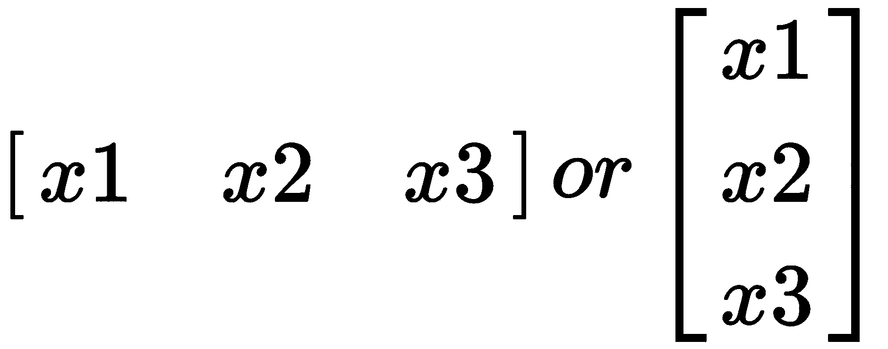
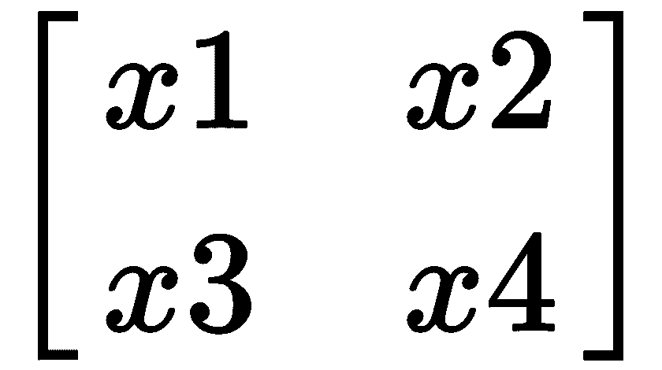
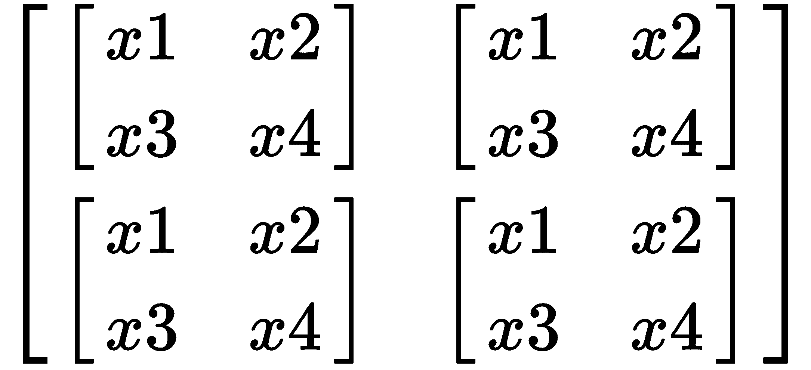

# 使用 PyTorch 使用张量

深度学习是机器学习父领域中的一个子领域，它是受大脑工作启发的一类算法的研究和应用。 给定足够的数据并通过它进行迭代，这些算法可以近似于描述数据的任何函数，并且正确地称为通用函数近似器。 那么 PyTorch 进入这个生态系统的位置是什么？

PyTorch 是 Python 中的一个开源深度学习框架，它使我们能够从研究问题开始，提出原型解决方案，并在开发此解决方案的过程中一直进行到创建分布式计算集群为止。 它使您从研究到生产都可以覆盖。 PyTorch 改编自 Torch，后者是一个科学计算框架，广泛支持机器学习算法，使用 Lua 编写，可为您提供强大的功能（使用 GPU）。 那为什么要用 PyTorch？

PyTorch 与 Python 深度集成，具有命令式风格，使用类似 Python 的语法，并且在 Eager 模式下易于使用且灵活。 它的学习曲线很浅，可以让您专注于功能而不是框架的样板和语法。 Python 命令的纯命令执行将失去很多优化机会，因此，随着**即时**（**JIT**）编译器的引入，PyTorch 允许过渡到图形 C ++运行时环境中用于速度，功能和优化的模式。 它得到了来自不同领域的专业人员的大力社区支持，并且与图书馆打交道。 它具有与框架互操作性的本地**开放神经网络交换**（**ONNX**）支持。 它是分布式的，可扩展到生产环境，与 TensorBoard 集成，并具有出色的文档和 API，您可以轻松编写针对 CPU 和 GPU 的自定义扩展。 我们将在接下来的章节中探索这些以及更多内容。

在本章中，我们将介绍以下食谱：

*   安装 PyTorch
*   在 PyTorch 中创建张量
*   互操作的 NumPy 桥
*   渐变且无渐变
*   在 PyTorch 中查看张量

# 技术要求

要完成本章，您需要安装 Python3。 您还将需要任何现代机器，但本章不需要使用支持 GPU 的设备。 如果要利用 GPU 功能，可以使用支持 NVIDIA CUDA 的 GPU。

# 安装 PyTorch

我们将在本节中安装 PyTorch。

NumPy 是本章必不可少的库，在您安装 PyTorch 时，NumPy 会自动为您安装它的依赖项。 这意味着我们无需显式安装 NumPy。

您可以将 PyTorch 与其他软件包管理器一起安装，例如 conda，如[这个页面](https://pytorch.org/)中所述。

要为 Python3 CPU 安装 PyTorch，我们可以使用以下命令：

*   对于 Linux，我们将使用以下`pip`管理器：

```py
pip3 install torch==1.4.0+cpu -f https://download.pytorch.org/whl/torch_stable.html
```

*   对于 Windows，我们将使用以下`pip`管理器：

```py
pip3 install torch==1.4.0+cpu -f https://download.pytorch.org/whl/torch_stable.html
```

*   对于 MacOS，我们将使用以下`pip`管理器：

```py
pip3 install torch
```

要为启用 Python3 CUDA 的 GPU 版本安装 PyTorch，可以使用以下命令：

*   对于 Linux，我们将使用以下`pip`管理器：

```py
pip3 install torch
```

*   对于 Windows，我们将使用以下`pip`管理器：

```py
pip3 install https://download.pytorch.org/whl/cu90/torch-1.1.0-cp36-cp36m-win_amd64.whl
```

MacOS Binaries 不支持 CUDA，因此如果需要 CUDA，则应从源代码安装它。 您也可以使用其他软件包管理器进行安装，甚至可以从源代码进行构建。 有关其他软件包管理器和 Python 版本，请访问[这个页面](https://pytorch.org/)。

您可以通过转到 Python 终端并键入以下命令来快速验证安装是否正常：

```py
import torch
import numpy
```

如果这些导入效果很好，那就很好了！

# 在 PyTorch 中创建张量

首先让我们了解张量是什么。 **标量**是单个独立值，一维值数组称为**向量**，二维值数组称为**矩阵**，并且任何 大于 2D 的值简称为**张量**。 张量是一个广义的术语，包含标量，向量和矩阵。

标量是第 0 <sup xmlns:epub="http://www.idpf.org/2007/ops">次张量，向量是 1 <sup xmlns:epub="http://www.idpf.org/2007/ops">st</sup> 次张量，矩阵是 2 <sup xmlns:epub="http://www.idpf.org/2007/ops">nd</sup> 次张量。</sup>

以下是各种张量：

*   **标量**：这是一个零阶张量。 标量的示例是 <sub></sub> 。
*   **向量**：这是一阶张量； 以下是向量的示例：



*   **矩阵**：这是一个二阶张量。 以下是矩阵的示例：



*   **张量**：这些高于二阶张量，如以下示例所示：



这样，我们将继续介绍如何使用张量的食谱。

# 怎么做...

在 PyTorch 中有多种创建张量的方法。 我们将在本节中介绍其中一些：

*   我们可以创建一个具有所有张量的张量，如下所示：

1.  让我们从导入库开始：

```py
import torch
```

2.  我们将使用`ones()`方法：

```py
torch.ones((2,3))
```

这将返回一个张量，该张量包含一个张量，并且具有默认的 float 数据类型，如下所示：

```py
tensor([[1., 1., 1.],
 [1., 1., 1.]])
```

*   现在，我们将创建一个仅由整数组成的张量：

1.  我们将执行与上一食谱完全相同的操作，但是将添加数据类型（`dtype`）作为参数：

```py
torch.ones((2,3), dtype=torch.int8)
```

2.  这将返回仅由整数组成的张量：

```py
tensor([[1, 1, 1],
 [1, 1, 1]], dtype=torch.int8)
```

*   接下来，我们将创建一个仅由整数零组成的张量：

1.  我们将执行与之前完全相同的操作，但是使用`zeros()`方法：

```py
torch.zeros((2,3), dtype=torch.int8)
```

2.  这将返回仅由整数零组成的张量：

```py
tensor([[0, 0, 0],
 [0, 0, 0]], dtype=torch.int8)
```

*   现在，我们将创建一个填充有特定值的张量：

1.  我们将使用`full()`方法并传递所需的填充值以及形状：

```py
torch.full((2, 3), 3.141592)
```

2.  这将返回具有给定值的张量：

```py
tensor([[3.1416, 3.1416, 3.1416],
 [3.1416, 3.1416, 3.1416]])
```

请注意，这些值是四舍五入的。

*   现在，我们将创建一个空张量：

1.  我们将为此使用`empty()`方法：

```py
torch.empty((2,3))
```

2.  这将返回一个填充有未初始化数据的张量，该张量每次都随每台机器而变化：

```py
tensor([[2.5620e-01, 4.5773e-41, 2.5620e-01],
 [4.5773e-41, 4.4842e-44, 0.0000e+00]])
```

*   接下来，我们将根据均匀分布创建张量：

1.  我们将使用`rand()`方法：

```py
torch.rand((2,3))
```

2.  这将根据[0，1]的均匀分布绘制具有随机值的张量：

```py
tensor([[0.6714, 0.0930, 0.4395],
 [0.5943, 0.6582, 0.6573]])
```

*   我们将创建一个均值为 0 和方差为 1 的张量：

1.  我们将使用`randn()`方法：

```py
torch.randn((2,3))
```

2.  这将从正态分布（也称为**标准正态分布**）绘制具有平均值为 0 和方差为 1 的随机值的张量：

```py
tensor([[ 0.3470, -0.4741, 1.2870],
 [ 0.8544, 0.9717, -0.2017]])
```

*   接下来，我们将根据给定的值范围创建张量

1.  我们将使用`rand_int()`方法，传入下限，上限和形状：

```py
torch.randint(10, 100, (2,3))
```

2.  这将返回介于 10 和 100 之间的张量，类似于以下内容：

```py
tensor([[63, 93, 68],
 [93, 58, 29]])
```

*   我们现在将根据现有数据创建张量：

1.  我们将为此使用`tensor`类：

```py
torch.tensor([[1, 2 ,3], [4, 5, 6]])
```

这将创建数据的副本并创建张量。 如果要避免进行复制，可以使用`torch.as_tensor([[1, 2 ,3], [4, 5, 6]])`。

2.  这将返回与数据具有相同数据类型的张量，在这种情况下为整数张量：

```py
tensor([[1, 2, 3],
 [4, 5, 6]])
```

另外，请注意，如果数据值之一是浮点数，则所有这些值都将转换为浮点数。 但是，如果值之一是字符串，则将引发错误。

*   接下来，我们将使用另一个张量的属性创建一个张量：

1.  我们首先为此创建一个参考张量：

```py
a = torch.tensor([[1, 2 ,3], [4, 5, 6]])
```

2.  让我们看看张量`a`的数据类型：

```py
a.dtype
torch.int64
```

3.  现在让我们看一下张量的形状：

```py
a.shape
torch.Size([2, 3])
```

4.  数据类型和形状符合我们的期望，所以现在让我们创建一个张量`b`，使其与`a`的属性匹配，并为此使用`torch.*_like`格式：

```py
b = torch.ones_like(a)
b
```

结果为以下输出：

```py
tensor([[1, 1, 1],
 [1, 1, 1]])
```

5.  让我们看看张量`b`的数据类型：

```py
b.dtype
torch.int64
```

6.  我们还要看一下张量`b`的形状：

```py
b.shape
torch.Size([2, 3])
```

*   接下来，我们将创建一个与另一个张量类型相似但大小不同的张量：

1.  我们将使用与上一步相同的张量`a`，并为此使用`torch.new_*`格式：

```py
a.new_full((2,2), 3.)
```

2.  这将返回以下输出：

```py
tensor([[3, 3],
 [3, 3]])
```

这些是在 PyTorch 中创建张量的不同方法。

# 这个怎么运作...

在本食谱中，我们介绍了从各种数据源创建张量的各种方法。 在我们开始探索使用 PyTorch 进行深度学习的概念及其原理之前，必须了解一些最常用的功能来处理数据的基本单位张量。 我们可以使用`torch.tensor()`方法创建具有各种值和形状的张量。 我们甚至可以从均匀分布或标准正态分布中得出张量，这对于初始化神经网络以获得最佳性能和训练时间至关重要，所有这些张量都具有默认的`torch.FloatTensor` 数据类型，并使用`dtype`更新数据类型。 参数。

`.ones()`方法创建一个包含给定形状的张量的张量，`.zeros()`用所有零填充该张量，`full()`方法将给定形状的张量填充。 `.empty()`方法创建一个空张量，`.rand()`从[0，1）的均匀分布中绘制一个具有随机值的张量，`.randn()`从正态分布中绘制均值为 0 和方差 1 的一个具有随机值的张量 ，也称为标准正态分布。

`rand_int()`方法从给定范围绘制随机整数，并以给定形状创建张量。 我们可以创建具有其他张量形状的张量，也可以具有所有张量的张量，但是可以使用`ones_like()`方法创建其他张量的形状和数据类型。 我们可以使用`torch.new_*`格式创建一个张量，其类型与另一个张量相似，但大小不同。

我们还可以从现有源中获取数据并将其转换为张量，并且存在先进的张量创建技术，这些技术可以减少内存占用并使用现有张量的形状和/或张量的数据类型。

# 还有更多...

您可以使用`shape`属性或`size()`方法找到张量的形状，并使用张量的`dtype`属性找到数据类型。 您也可以使用`torch.numel()`来获取张量中的元素总数。

# 也可以看看

要了解更多信息，请在[这个页面](https://pytorch.org/docs/stable/tensors.html#torch.Tensor)上阅读 PyTorch 的官方文档以了解张量创建选项。

# 探索 NumPy 桥

NumPy 是 Python 中科学计算的基本软件包。 它是一个 Python 库，提供多维数组对象和各种派生对象。 除此之外，NumPy 用作通用多维数据的有效容器。 NumPy 允许与各种数据库进行无缝，快速的集成。

NumPy 是标准的 Python 库，用于处理数字数据。 Python 中许多著名的 ML / DS 库，例如 pandas（用于从许多来源读取数据的库）和 scikit-learn（用于读取和写入图像的最重要的 ML 库之一）都使用 NumPy 引擎盖。 例如，在处理表格数据，使用`pandas`库加载表格数据并将`numpy`数组移出数据框时，您将处理很多`numpy`。 读取图像，许多现有库都具有内置的 API，可以将它们读取为`numpy`数组； 并将`numpy`数组转换为图像以及文本和其他形式的数据。 同样，它们都使用`scikit-learn`（机器学习库）支持`numpy`数组。 如您所见，在`numpy`阵列和 PyTorch 张量之间建立桥梁非常重要。

# 怎么做...

让我们从导入`numpy`开始：

1.  我们将从创建一个`numpy`数组开始； 为此，让我们导入`numpy`：

```py
import numpy as np
```

2.我们将创建一个仅由`ones`组成的`numpy`数组：

```py
a = np.ones((2, 3))
a
```

结果为以下输出：

```py
array([[1., 1., 1.],
 [1., 1., 1.]])
```

3.现在，我们将其转换为 PyTorch 张量：

```py
b = torch.from_numpy(a)
b
```

结果为以下输出：

```py
tensor([[1., 1., 1.],
 [1., 1., 1.]], dtype=torch.float64)
```

4.现在，我们将张量转换为`numpy`数组：

```py
b.numpy()
```

结果为以下输出：

```py
array([[1., 1., 1.],
 [1., 1., 1.]]) 
```

有了这个配方，我们现在可以在 NumPy 和 Torch 张量之间来回移动了。

# 这个怎么运作...

我们首先导入`numpy`以创建`numpy`数组。 然后，我们使用`np.ones()`创建了仅包含一个数组的`numpy`数组，并使用`from_numpy()`方法将其转换为 PyTorch 张量。 然后，我们使用`.numpy()`方法将张量转换为`numpy`数组。

在 PyTorch 张量和 NumPy 之间切换非常容易； 实际上，只有两种方法可以实现。 这使得可以获取预测的张量并从 NumPy 转换为图像（使用支持 NumPy 到图像转换的库），并类似地从 NumPy 返回张量。

# 还有更多...

基础内存在 NumPy 数组和 PyTorch 张量之间共享，因此任何一个更改都会影响另一个。

让我们看一下如何在以下代码块中呈现它：

```py
>>a
array([[1., 1., 1.],
 [1., 1., 1.]]) 
>>b = torch.from_numpy(a)
>>b
tensor([[1., 1., 1.],
 [1., 1., 1.]], dtype=torch.float64) 
>>a*=2
>>a
array([[2., 2., 2.],
       [2., 2., 2.]]) 
>>b
tensor([[2., 2., 2.],
 [2., 2., 2.]], dtype=torch.float64)
```

我们可以看到`numpy`的变化也反映在张量中。

# 也可以看看

要了解更多信息，[请单击 NyPy 桥的 PyTorch 官方文档链接](https://pytorch.org/tutorials/beginner/blitz/tensor_tutorial.html#numpy-bridge)。

# 探索渐变

让我们简要介绍一下什么是渐变。 为此，我们需要首先了解什么是梯度下降。 在机器学习问题中，我们提供一个输入和期望的输出对，并要求我们的模型概括给定输入和输出对之间的关​​系。 但是有时模型会得知其预测会与期望的输出相去甚远（这种差异称为**损失**）。 那么什么是梯度下降？

**梯度下降**是一种优化算法，用于通过在梯度的负值所定义的最陡下降方向上反复移动来使函数最小化。 我们在训练模型时会使用它，以使损失最小化。 它用于查找使成本或损失函数最小化的函数参数值（机器学习中的系数或权重）。

那么什么是渐变呢？ 梯度度量的是当输入改变很小的时候给定函数的输出有多少变化，这与微积分中的导数概念相同。 梯度会计算所有权重相对于误差变化的变化。 渐变是函数的斜率。 较高的坡度意味着坡度更陡，并且模型可以更快地学习。 梯度指向最陡的倾斜方向。 PyTorch 中的`Autograd`模块在 PyTorch 中执行所有梯度计算。 它是自动差异化的核心 Torch 软件包。 它使用基于磁带的系统进行自动区分。 在前进阶段，`Autograd`磁带将记住它执行的所有操作，而在倒退阶段，它将重放它们。

# 怎么做...

让我们从创建张量开始。

1.  与我们到目前为止创建的张量不同，我们将添加一个新键，让 PyTorch 知道它需要对以下张量执行梯度计算：

```py
x = torch.full((2,3), 4, requires_grad=True)
x
```

结果为以下输出：

```py
tensor([[4., 4., 4.],
 [4., 4., 4.]], requires_grad=True)
```

2.让我们创建另一个张量`y`，它是从张量`a`中派生的； 我们将看到这个新张量的输出差异，因为它附有一个梯度函数：

```py
y = 2*x+3
y
```

结果为以下输出：

```py
tensor([[11., 11., 11.],
 [11., 11., 11.]], grad_fn=<AddBackward0>) 
```

3.让我们从原始的`x`开始进一步探索 PyTorch 中的渐变：

```py
x
```

结果为以下输出：

```py
tensor([[4., 4., 4.],
 [4., 4., 4.]], requires_grad=True)
```

4.然后，我们将定义`y`，它比上一个示例稍微复杂一些：

```py
y = (2`x`2+3)
y
```

结果为以下输出：

```py
tensor([[35., 35., 35.],
 [35., 35., 35.]], grad_fn=<AddBackward0>)
```

5.接下来，由于`y`是张量，我们将针对`y`上的`x`计算梯度，并且我们要针对该张量计算梯度。 为此，我们将传递`x`的形状，该形状与`y`相同：

```py
y.backward(torch.ones_like(x))
```

6.现在，让我们使用`grad` 属性查看`x`的梯度值：

```py
x.grad
```

结果为以下输出：

```py
tensor([[16., 16., 16.],
 [16., 16., 16.]])
```

7.继续本节的非梯度部分，我们可以通过执行以下步骤来关闭代码中特定位置的梯度计算：首先，如果要重新使用张量，请首先使用张量上的`requires_grad_()`方法 `x`：

```py
>> x.requires_grad

True

>> x.requires_grad_(False) # turning of gradient
>> x.requires_grad

False
```

8.我们可以从`x`开始使用`.no_grad()`方法关闭对梯度计算的跟踪：

```py
>> x = torch.full((2,3), 4,requires_grad=True)
>> x

tensor([[4., 4., 4.],
 [4., 4., 4.]], requires_grad=True)

>> x.requires_grad

True

>> with torch.no_grad():
..         print((x**5+3).requires_grad)

False
```

有了这个，我们探索了`Autograd`包的一些功能。

# 这个怎么运作...

我们可以看到，Autograd 可以跟踪操作。 当我们从`x`，`y=2*x+3`创建张量`y`时，我们会看到一个梯度函数`grad_fn`被附加到张量上。

我们首先创建一种新的张量，将`require_grad`设置为`True`，然后创建一个张量`y`，使得 <sub></sub> 并发现`y`具有一个 附加了不同的梯度函数。 我们还研究了使用`requires_grad_()`，最后使用了`no_grad()`。

PyTorch 有一个名为`autograd`的软件包，可以对张量上的所有操作执行所有跟踪和自动微分。 这是一个按运行定义的框架，这意味着您的反向传播是由代码的运行方式定义的，并且每次迭代都可以不同。 我们利用`torch.Tensor`类的`require_grad`属性来确定梯度计算的状态，并在调用`.backward()`方法后自动计算其`.grad`属性中的所有梯度和张量的梯度。

我们可以禁用代码之间的梯度计算，也可以暂时禁用对张量的跟踪以进行梯度计算，从而提高计算速度。 禁用计算主要在评估期间使用。

# 还有更多...

您可以使用`torch.set_grad_enabled()`方法启用和禁用梯度计算，以及使用`detach()`方法来将来跟踪计算。 使用`grad_fn`属性查看附加到张量的渐变函数。

# 也可以看看

要了解更多信息，可以在[这里](https://pytorch.org/tutorials/beginner/blitz/autograd_tutorial.html)和[这里](https://pytorch.org/docs/stable/autograd.html)查看官方文档。

# 在 PyTorch 中查看张量

在使用张量和处理神经网络时，我们经常需要遍历和重新排列张量中的数据，以使张量的尺寸适合架构的需求。 在本节中，我们将探讨 PyTorch 中常见的重排和重塑技术。

在本食谱中，我们将学习如何使张量看起来像我们想要的样子。

# 怎么做...

让我们看一下如何改变张量的形状：

1.  首先，我们将创建一个张量`a`：

```py
>>a = torch.Tensor([1, 2, 3, 4])
```

2.然后，我们将使用`reshape()`方法：

```py
>>torch.reshape(a, (2, 2))
```

结果为以下输出：

```py
tensor([[1., 2.],
 [3., 4.]])
```

3.接下来，我们将研究`resize_()`方法：

```py
>>a = torch.Tensor([1, 2, 3, 4, 5, 6])
>>a.shape
torch.Size([6])
>>a.resize_((2, 2))
```

结果为以下输出：

```py
tensor([[1., 2.],
 [3., 4.]])
```

4.最常见的方法是`view()`：

```py
>>a = torch.Tensor([1, 2, 3, 4, 5, 6])
>>a.view((2, 3))
```

结果为以下输出：

```py
tensor([[1., 2., 3.],
 [4., 5., 6.]])
```

5.  使用`view()`方法，您可以选择不提及其中一个尺寸，然后排列其余尺寸，PyTorch 将按以下方式计算缺失尺寸：

```py
>>a.view((2, -1))
```

结果为以下输出：

```py
tensor([[1., 2., 3.],
 [4., 5., 6.]])
```

这些是重塑张量的不同方法。

# 这个怎么运作...

在前面的食谱中，我们基于网络架构操纵了张量以改变其形状，研究了三种不同的方法，每种方法都适用于不同的用例：

*   `.reshape()`方法：`.reshape(a, b)`返回一个新张量，该张量具有与原始张量`(a, b)`相同的数据，因为它会将数据复制到内存的另一部分； `.reshape()`可以在连续和非连续张量上运行，并且可以返回原始张量的副本或视图。
*   `.resize()`方法：`.resize_(a, b)`返回相同的张量，而不创建具有新给定形状的副本。 但是我们应该记住，如果新形状产生的元素少于原始张量，那么它将不会引发任何错误，并且某些元素将从张量中删除，但不会从内存中删除。 如果新形状产生的元素多于原始张量，则新元素将在内存中未初始化而不会引发任何错误。
*   `.view()`方法：`.view(a, b)`将返回一个新的张量，其张量与权重为（a，b）的数据相同； `.view()`只能在连续的张量上运行，并返回与输入相同的存储。

# 还有更多...

您可以使用另一个张量的尺寸，并使给定的张量类似于该张量的尺寸，而不会影响其中任何一个的实际尺寸。

看下面的代码块：

```py
>>a = torch.Tensor([[1, 2, 3],
                     [4, 5, 6]])
>>a

tensor([[1., 2., 3.],
 [4., 5., 6.]])

>>b = torch.Tensor([4,5,6,7,8,9])
>>b
tensor([4., 5., 6., 7., 8., 9.])
>>b.view_as(a)

tensor([[4., 5., 6.],
 [7., 8., 9.]])
```

由此可见，张量`b`呈张量`a`的形状。

# 也可以看看

有关更多信息，您可以在[这里](https://pytorch.org/docs/stable/tensors.html#torch.Tensor.view)和[这里](https://pytorch.org/docs/stable/torch.html#torch.reshape)查看文档。