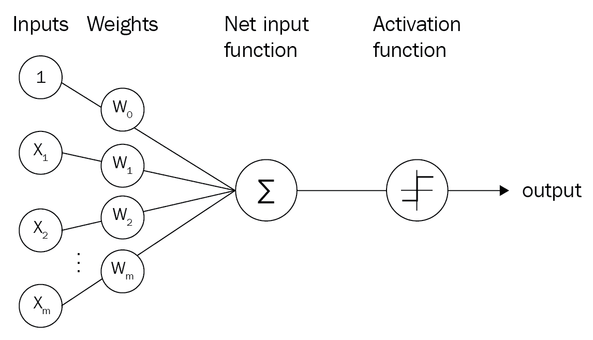
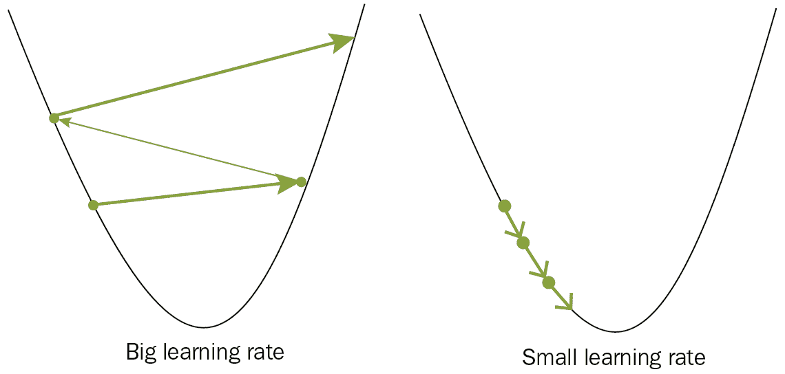

# 与神经网络协作

深度学习是一类机器学习算法，旨在粗略地模拟大脑中的神经元。 神经元从周围神经元的多个输入中获取一个输入并将其求和，如果总和超过某个阈值，则神经元将触发。 每个神经元之间有一个间隙，称为突触。 神经递质化学物质在这些突触中传递信号，这些化学物质的数量和类型将决定神经元输入的强度。 生物神经网络的功能可以通过人工神经网络使用权重，偏差（偏差定义为权重乘以 1 的恒定输入）和激活函数来复制。

以下是神经单元的示意图：



神经网络所看到的只是数字集，它试图识别数据中的模式。 通过训练，神经网络学会识别输入中的模式。 但是，某些特定的架构在应用于特定类别的问题时比其他结构具有更好的表现。 一个简单的神经网络架构由三种层组成：**输入**层，**输出**层和**隐藏**层。 当隐藏层不止一个时，它称为**深度神经网络**。

以下是深度神经网络的表示：


在前面的图中，圆圈代表神经元，或用深度学习的术语代表作为计算单元的节点。 边缘代表节点之间的连接，并保持两个节点之间的连接权重（突触强度）。

在本章中，以下秘籍将使我们开始使用神经网络：

*   定义神经网络类
*   创建一个全连接网络
*   定义损失函数
*   实现优化器
*   实现丢弃
*   实现函数式 API

# 技术要求

在本章中，我们将开始处理图像数据并学习全连接神经网络如何工作。 PyTorch 有一个名为`torchvision`的补充库，我们将在开始秘籍之前进行安装。

您可以对`torchvision`使用以下`pip`安装命令：

```py
pip install torchvision
```

对于其他安装方法，您可以访问[这个页面](https://pypi.org/project/torchvision/)。 上一章“使用 PyTorch 张量”的其余依赖关系保持不变。

# 定义神经网络类

在本秘籍中，我们将从了解`torchvision`的一些重要函数开始，这些函数使它能够处理图像数据并进行处理。 然后，我们将通过定义一个类来定义神经网络的基本架构，并查看可用于此的模块和方法。 在本秘籍中，我们将专注于全连接神经网络类。 它的属性是各个层，其目的是对各种类型的衣服进行分类。

我们将使用 Fashion–MNIST 数据集。 这是 Zalando 文章图片的数据集，包括 6 万个示例的训练集和 10,000 个示例的测试集。 我们将拍摄一张尺寸为`28 x 28`的灰度图像，并将其转换为 784 的向量。

以下是来自数据集的示例：


现在，我们将研究定义网络所需采取的步骤。

# 操作步骤

让我们定义我们的网络：

1.我们将从设置`torch`和`torchvision`导入开始：

```py
>>import torch
>>from torch import nn
>>from torchvision import datasets, transforms
```

2.接下来，我们将定义用于图像数据预处理的转换：

```py
>>transform = transforms.Compose([transforms.ToTensor(),
                  transforms.Normalize((0.5,), (0.5,)),
               ])
```

3.让我们定义`batch_size`，将我们的数据集划分为多个小块，以供输入模型：

```py
>>batch_size = 64
```

4.接下来，我们将从`torchvision`中提取数据集并应用转换并创建批量。 为此，我们将首先创建一个训练数据集：

```py
>>trainset = datasets.FashionMNIST('~/.pytorch/F_MNIST_data/', download=True, train=True, transform=transform)
>>trainloader = torch.utils.data.DataLoader(trainset, batch_size=batch_size, shuffle=True)
```

5.现在，让我们创建`testset`：

```py
>>testset = datasets.FashionMNIST('~/.pytorch/F_MNIST_data/', download=True, train=False, transform=transform)
>>testloader = torch.utils.data.DataLoader(testset, batch_size=batch_size, shuffle=True)
```

6.现在我们的主要任务是定义神经网络类，该类必须是`nn.Module`的子类：

```py
>>class FashionNetwork(nn.Module):
```

7.接下来，我们为该类定义`init`方法：

```py
>>def __init__(self):
      super().__init__()
```

8.我们需要在`init`中为我们的模型定义层。 第一个隐藏层如下所示：

```py
>>self.hidden1 = nn.Linear(784, 256)
```

9.现在，我们将定义第二个隐藏层：

```py
>>self.hidden2 = nn.Linear(256, 128)
```

10.然后，我们将定义输出层：

```py
>>self.output = nn.Linear(128, 10)
```

11.我们将为最后一层定义 softmax 激活：

```py
>>self.softmax = nn.Softmax(dim=1)
```

12.最后，我们将在内层中定义激活函数：

```py
>>self.activation = nn.ReLU()
```

通过这些步骤，我们已经完成了网络单元。

# 工作原理

在本秘籍中，我们开始使用`torchvision`。 `torchvision`中有工具来支持与视觉有关的任务。 有一个名为`transforms`的模块可以帮助完成许多图像预处理任务。 对于我们正在处理的特殊情况，一个由`28 x 28`灰度像素组成的图像，我们首先需要从图像中读取并使用`transforms.ToTensor()`变换将其转换为张量。 然后，我们分别将像素值的平均值和标准差设为 0.5 和 0.5，以便模型更易于训练； 为此，我们使用`transforms.Normalize((0.5,),(0.5,))`。 我们将所有转换与`transform.Compose()`结合在一起。

准备好转换后，我们定义了合适的批量大小。 较高的批量大小意味着该模型具有较少的训练步骤并且学习速度更快，而较高的批量大小会导致对内存的高要求。

TorchVision 的`datasets`模块附带了许多受欢迎的数据集； 如果机器上没有它，它将为您下载，传递转换并将数据转换为所需的格式以供模型训练。 在我们的案例中，数据集带有训练和测试集，并相应地加载它们。 我们使用`torch.utils.data.DataLoader`将处理后的数据分批加载，并进行其他操作，例如改组和加载到正确的设备（CPU 或 GPU）。

我们可以用任何名称定义模型类，但是重要的是它是`nn.Module`的子类并具有`super().__init__()`，该类为模型提供了许多有用的方法和属性，并保留了架构的知识。

我们使用`nn.Linear()`通过输入和输出尺寸来定义全连接层。 我们将 softmax 层用于最后一层输出，因为有 10 个输出类。 我们在输出层之前的层中使用 ReLU 激活来学习数据中的非线性。 `hidden1`层采用 784 个输入单元，并给出 256 个输出单元。 `hidden2`短语输出 128 个单位，输出层有 10 个输出单位，代表 10 个输出类别。 softmax 层将激活转换为概率，以便沿维度 1 加 1。

# 更多

我们可以使用另一种方法来使用`nn.Sequential()`定义模型并传递所需的层，而无需定义类。 还有其他一些可应用于输入图像的转换，我们将在后续章节中进行探讨。

# 另见

您可以在[这个页面](https://pytorch.org/docs/stable/torchvision/transforms.html)上查看有关转换的更多详细信息，还可以在[这个页面](https://pytorch.org/tutorials/beginner/blitz/neural_networks_tutorial.html#sphx-glr-beginner-blitz-neural-networks-tutorial-py)上了解有关定义模型类的更多信息。

# 创建一个全连接网络

在本秘籍中，我们将扩展在先前秘籍“定义神经网络类”中定义的类。 在“定义神经网络类”秘籍中，我们仅创建了所需架构的组件； 现在我们将把所有这些部分捆绑在一起，以建立一个明智的网络。 我们各层的进度将从 784 个单位增加到 256 个，然后是 128 个，最后是 10 个单位的输出层。

在本秘籍中，我们将使用类的构造器中定义的组件来研究网络架构。 然后，我们将完成网络类定义并创建其对象。

# 操作步骤

我们将继续上一节中的类定义，并在其上进行扩展：

1.让我们从类中的`forward()`方法开始，传入输入：

```py
>>def forward(self, x):
```

2.现在，将输入移动到具有 256 个节点的第一个隐藏层：

```py
>>x = self.hidden1(x)
```

3.接下来，我们通过激活函数传递第一个隐藏层的输出，在本例中为 ReLU：

```py
>>x = self.activation(x)
```

4.我们将对第二层（具有 128 个节点）重复相同的操作，并将其传递给 ReLU：

```py
>>x = self.hidden2(x)
>>x = self.activation(x)
```

5.现在，我们传递最后一个输出层，其中包含 10 个输出类：

```py
>>x = self.output(x)
```

6.然后，我们将使用`softmax`函数推送输出：

```py
>>output = self.softmax(x)
```

7.最后，我们返回输出张量：

```py
>>return output
```

8.然后，我们将创建网络对象：

```py
>>model = FashionNetwork()
```

9.让我们快速看一下我们的模型：

```py
>>print(model)
>FashionNetwork(
       (hidden1): Linear(in_features=784, out_features=256, bias=True)
       (hidden2): Linear(in_features=256, out_features=128, bias=True)
       (output): Linear(in_features=128, out_features=10, bias=True)
       (softmax): Softmax()
       (activation): ReLU()
 )
```

现在，我们已经为 Fashion-MNIST 数据集完成了神经网络模型。

# 工作原理

在秘籍中，通过建立前向网络来完成网络，其中我们将构造器中定义的网络组件捆绑在一起。 用`nn.Module`定义的网络需要定义`forward()`方法。 它采用输入张量，并按照正向方法中定义的操作顺序，将其通过网络类中`__init__()`方法中定义的网络组件。

当传递输入时，将引用模型对象的名称自动调用 forward 方法。 `nn.Module`自动创建将在正向方法中使用的权重和偏差张量。 线性单元本身定义了线性函数，例如`xW + B`； 要具有非线性函数，我们需要插入非线性激活函数，在这里我们使用最流行的激活函数之一 ReLU，尽管您可以在 PyTorch 中使用其他可用的激活函数。

我们的输入层有 784 个单位（从`28 x 28`像素开始），第一层具有 ReLU 激活的 256 个单位，然后具有 ReLU 激活的 128 个单位，最后有 softmax 激活的 10 个单位。 我们通过 softmax 压缩最终层输出的原因是因为我们希望有 1 个输出类的概率高于所有其他类，并且输出概率之和应等于 1。softmax 函数的参数`dim=1`是为了确保在输出的各列中采用 softmax。 然后，我们使用模型类创建一个对象，并使用`print(model)`打印该类的详细信息。

# 更多

我们可以在不使用`nn.Sequential`模块定义网络类的情况下定义网络架构，并且尽管`__init__`中的序列无关紧要，但重要的是要确保`forward`方法中的操作顺序正确排序。 。 您可以使用`nn.Tanh`进行 tanh 激活。 您可以使用`model.hidden.weight`和`model.hidden.bias`从模型对象访问权重和偏差张量。

# 另见

您可以在[这个页面](https://pytorch.org/docs/stable/nn.html)上查看`nn.Module`和`nn.Sequential`的官方文档。

# 定义损失函数

机器学习模型在接受训练时，可能会在预测输出和实际输出之间存在一些偏差，这种差异称为模型的**误差**。 让我们计算该误差的函数称为**损失函数**或**误差函数**。 此函数提供了一种度量标准，用于评估所有可能的解决方案并选择最优化的模型。 损失函数必须能够将模型的所有属性减少到一个单一的数字，以便该损失函数值的改善代表更好的模型。

在本秘籍中，我们将使用 PyTorch 中可用的损失函数为我们的时装数据集定义损失函数。

# 操作步骤

让我们定义损失函数：

1.  首先，我们将从网络构造器中的`__init__`方法开始，将现有的网络架构修改为`softmax`而不是`softmax`的输出日志：

```py
>>self.log_softmax = nn.LogSoftmax()
```

2.接下来，我们将对神经网络的`forward`方法进行相同的更改：

```py
>>output = self.log_softmax(x)
```

3.现在，我们的新类如下所示：

```py
>>class FashionNetwork(nn.Module):
      def __init__(self):
          super().__init__()
          self.hidden1 = nn.Linear(784, 256)
          self.hidden2 = nn.Linear(256, 128)
          self.output = nn.Linear(128, 10)
          self.log_softmax = nn.LogSoftmax()
          self.activation = nn.ReLU()
      def forward(self, x):
          x = self.hidden1(x)
          x = self.activation(x)
          x = self.hidden2(x)
          x = self.activation(x)
          x = self.output(x)
          output = self.log_softmax(x)
          return output
```

4.我们定义模型对象如下：

```py
>>model = FashionNetwork()
>>model
>>FashionNetwork(
     (hidden1): Linear(in_features=784, out_features=256, bias=True)
     (hidden2): Linear(in_features=256, out_features=128, bias=True)
     (output): Linear(in_features=128, out_features=10, bias=True)
     (log_softmax): LogSoftmax()
     (activation): ReLU()
 )
```

5.现在，我们将定义损失函数； 我们将为此使用负对数似然损失：

```py
>criterion = nn.NLLLoss()
```

现在我们已经准备好损失函数。

# 工作原理

在此秘籍中，我们用对数 softmax 替换了 softmax，以便随后可以使用概率对数而不是概率的对数，这具有很好的理论解释。 这样做有多种原因，包括改进的数值表现和梯度优化。 在训练可能具有计算挑战性和昂贵成本的模型时，这些优势非常重要。 此外，当它没有预测正确的类别时，它具有很高的惩罚作用。

因此，在处理对数 softmax 时，我们会使用负对数似然率，因为 softmax 不兼容。 在`n`类数之间的分类中很有用。 该对数将确保我们不会处理 0 到 1 之间的非常小的值，而负值将确保小于 1 的概率的对数非零。 我们的目标是减少这种负的对数丢失误差函数。 在 PyTorch 中，损失函数称为**标准**，因此我们将损失函数命名为`criterion`。

# 更多

我们可以提供一个可选参数`weight`，它必须是一维张量，该张量为每个输出类分配权重以处理不平衡的训练集。

# 另见

您可以在[这个页面](https://pytorch.org/docs/master/nn.html#loss-functions)上查看更多损失函数的官方文档。

# 实现优化器

在本秘籍中，我们将学习优化器。 在先前的秘籍“定义损失函数”中，我们谈到了误差和误差函数，并了解到，为了获得一个好的模型，我们需要最小化计算出的误差。 **反向传播**是神经网络从错误中学习的一种方法。 错误用于修改权重，以使错误最小化。 优化函数负责修改权重以减少误差。 优化函数计算相对于权重的误差的偏导数。 导数显示正斜率的方向，因此我们需要反转梯度的方向。 **优化器**函数将模型参数和损失函数结合在一起，以迭代方式修改模型参数以减少模型误差。 可以考虑将优化器摆在模型权重的基础上，根据模型与实际输出的预测差异来获得最佳模型，而损失函数则通过指示优化器是对还是错来充当指导。

学习速率是优化器的超参数，它控制权重的更新量。 学习速度确保了权重不会大量更新，从而使算法根本无法收敛，并且误差越来越大。 然而，与此同时，权重的更新不应太低，以至于永远需要花费成本函数/误差函数的最小值。

下面显示了学习率的影响：



在本秘籍中，我们将学习如何在 PyTorch 中使用优化器函数，以及一些常见的优化函数以及如何处理学习率。

# 操作步骤

在本节中，我们从上一节中保留代码的位置开始，在定义条件的那一点：

1.我们将从导入`optim`模块开始：

```py
>>from torch import optim
```

2.接下来，我们将创建一个`optimizer`对象。 我们将使用`Adam`优化器并传递模型参数：

```py
>>optimizer = optim.Adam(model.parameters())

```

3.要检查优化器的默认设置，可以执行以下操作：

```py
>>optimizer.defaults
>>{'lr': 0.001,
 'betas': (0.9, 0.999),
 'eps': 1e-08,
 'weight_decay': 0,
 'amsgrad': False}
```

4.您还可以将学习率添加为附加参数：

```py
>>optimizer = optim.Adam(model.parameters(), lr=3e-3)
```

5.现在，我们将开始训练我们的模型，从时期数开始：

```py
>>epoch = 10
```

6.然后，我们将开始循环：

```py
>>for _ in range(epoch):
```

7.我们将`running_loss`初始化为`0`：

```py
>>running_loss = 0
```

8.我们将在训练图像加载器中遍历每个图像，这在本章前面的秘籍“定义神经网络类”中定义：

```py
>>for image, label in trainloader:
```

9.然后，我们将梯度重置为零：

```py
>>optimizer.zero_grad()
```

10.接下来，我们将重塑图像：

```py
>>image = image.view(image.shape[0],-1)
```

11.然后，我们从模型中获得预测：

```py
>>pred = model(image)
```

12.然后我们计算损失/错误：

```py
>>loss = criterion(pred, label)
```

13.然后，对损失调用`.backward()`方法：

```py
>>loss.backward()
```

14.然后，在优化器上调用`.step()`方法：

```py
>>optimizer.step()
```

15.然后附加运行损失：

```py
>>running_loss += loss.item()
```

16.最后，我们将在每个时期之后打印损失：

```py
>>else:
    >>print(f'Training loss: {running_loss/len(trainloader):.4f}')
```

以下是示例输出：

```py
Training loss: 0.4978
Training loss: 0.3851
Training loss: 0.3498
Training loss: 0.3278
Training loss: 0.3098
Training loss: 0.2980
Training loss: 0.2871
Training loss: 0.2798
Training loss: 0.2717
Training loss: 0.2596
```

现在我们已经完成了训练。

# 工作原理

在本秘籍中，我们首先使用`Adam`优化器定义优化器，然后为优化器设置学习率，并查看默认参数。 我们设置一个时期`10`，并为每个时期开始迭代，在每次迭代中将`running_loss`设置为 0，并在该时期内对每个图像进行迭代（模型看到数据集的次数）。 我们首先使用`.zero_grad()`方法清除梯度。 PyTorch 在每次反向传播时都会累积梯度，这在某些情况下很有用，因此将其导入以将梯度归零，以正确更新模型参数。

接下来，我们通过将每批 64 幅图像（每幅图像由`28 x 28`像素组成）展平到 784 来重塑图像，从而将张量形状从`64 x 28 x 28`更改为`64 x 784`，因为我们的模型期望这种输入形状。 接下来，我们将此输入发送到模型，并从模型中获得该批量的输出预测，然后将其传递给损失函数，也称为`criterion`； 在那里，它评估了预测类与实际类之间的差异。

`loss.backward()`函数计算了梯度（即，误差相对于权重的偏导数），我们调用了`optimizer.step()`函数来更新模型的权重，以适应评估的误差。 `.item()`方法从单个元素张量中拉出标量，因此使用`loss.item()`从批量中获得`error`的标量值，将其累加到所有批量的损失中，最后在周期末尾打印损失。

# 更多

我们可以使用称为`closure`的回调函数作为`.step(closure)`的参数来计算损失并通过传入函数作为参数来更新权重。 您还可以探索 PyTorch 提供的其他优化器函数，例如 Adadelta，Adagrad，SGD 等。

# 另见

您可以在[这个页面](https://pytorch.org/docs/stable/optim.html#torch.optim.Optimizer)上了解有关优化程序的更多信息。

# 实现丢弃

在本秘籍中，我们将研究实现丢弃。 在训练神经网络模型或一般任何机器学习模型时，我们可能会遇到的一种较常见的现象是过拟合。 当模型学习提供给训练的数据而不是在求解空间上进行泛化时，就会发生过拟合，也就是说，模型学习的是训练数据的细微细节和噪声，而不是掌握全局，因此在效果上表现不佳。 新数据。 正则化是防止模型过拟合的过程。

使用丢弃是神经网络中最流行的正则化技术之一，在这种技术中，训练时会关闭随机选择的神经元，也就是说，神经元的作用会暂时从正向传播中移除，而反向传播不会影响权重 ，因此没有一个神经元或神经元子集能获得模型的所有决定力； 相反，所有神经元都被迫为预测做出积极贡献。

丢弃可以直观地理解为创建大量集成模型，学习在一个模型的大定义下捕获各种特征。

在本秘籍中，我们将研究如何在模型定义中添加缺失，以通过防止过拟合来改善整体模型表现。 应当记住，丢弃仅在训练时才适用； 但是，在测试和实际预测期间，我们希望所有神经元都做出贡献。

# 操作步骤

在本节中，我们将学习如何为我们的初始模型类`FashionNetwork`添加丢弃：

1.我们将从初始模型定义开始：

```py
>>class FashionNetwork(nn.Module):
    def __init__(self):
        super().__init__()
        self.hidden1 = nn.Linear(784, 256)
        self.hidden2 = nn.Linear(256, 128)
        self.output = nn.Linear(128, 10)
        self.log_softmax = nn.LogSoftmax()
        self.activation = nn.ReLU()
    def forward(self, x):
        x = self.hidden1(x)
        x = self.activation(x)
        x = self.hidden2(x)
        x = self.activation(x)
        x = self.output(x)
        output = self.log_softmax(x)
        return output
```

2.然后，我们将为模型`__init__`添加一个丢弃：

```py
>>self.drop = nn.Dropout(p=0.25)
```

我们更新的`__init__()`如下所示：

```py
>>def __init__(self):
        super().__init__()
        self.hidden1 = nn.Linear(784, 256)
        self.hidden2 = nn.Linear(256, 128)
        self.output = nn.Linear(128, 10)
        self.log_softmax = nn.LogSoftmax()
        self.activation = nn.ReLU()
        self.drop = nn.Dropout(p=0.25)
```

3.现在，我们将在`forward()`方法中添加丢弃：

```py
>>def forward(self, x):
        x = self.hidden1(x)
        x = self.activation(x)
        x = self.drop(x)
        x = self.hidden2(x)
        x = self.activation(x)
        x = self.drop(x)
        x = self.output(x)
        output = self.log_softmax(x)
        return output
```

现在，我们有了一个带有丢弃的网络。

# 工作原理

在此秘籍中，我们更改了`__init__()`方法，以 0.25 的丢失率添加了该丢失层，这意味着将应用该丢失的层中 25% 的神经元将被随机关闭。 然后，我们编辑`forward`函数，将其应用于其中具有 256 个单位的第一个隐藏层，然后对第二个层（具有 128 个单位）应用该滤除。 在完成激活函数之后，我们在两个层中都应用了激活。 我们必须牢记，必须仅在隐藏层上应用丢弃，以防止我们丢失输入数据和丢失输出。

# 更多

我们可以通过调用`model.eval()`禁用退出，并使用`model.train().`启用退出

# 另见

您可以在[这个页面](https://arxiv.org/abs/1207.0580)上了解有关丢弃的更多信息。

# 实现函数式 API

在本秘籍中，我们将探索 PyTorch 中的函数式 API。 这样做将使我们能够编写更简洁的网络架构和组件。 我们将研究函数式 API，并使用函数式 API 定义模型或模型的一部分。

# 操作步骤

在以下步骤中，我们使用现有的神经网络类定义，然后使用函数式 API 重写它：

1.我们将首先进行导入：

```py
>>import torch.nn.functional as F
```

2.然后，我们用`F.relu()`和`F.log_softmax()`定义我们的`FashionNetwork`类：

```py
>>class FashionNetwork(nn.Module):
    def __init__(self):
        super().__init__()
        self.hidden1 = nn.Linear(784,256)
        self.hidden2 = nn.Linear(256,128)
        self.output = nn.Linear(128,10)

    def forward(self,x):
        x = F.relu(self.hidden1(x))
        x = F.relu(self.hidden2(x))
        x = F.log_softmax(self.output(x))
        return x

```

我们使用函数式 API 重新定义了模型

# 工作原理

在此秘籍中，我们定义了与以前完全相同的网络，但是用`function.relu`和`function.log_softmax`代替了激活函数和对数 softmax，这使我们的代码看起来更加简洁明了。

# 更多

您可以通过使用`functional.linear()`和`functional.dropout()`来控制丢弃，从而对线性层使用函数式 API，但是必须注意传递模型状态以指示其处于训练还是评估/预测模式。

# 另见

您可以通过[这个页面](https://pytorch.org/docs/stable/nn.html#torch-nn-functional)了解更多有关函数式 API 的信息。