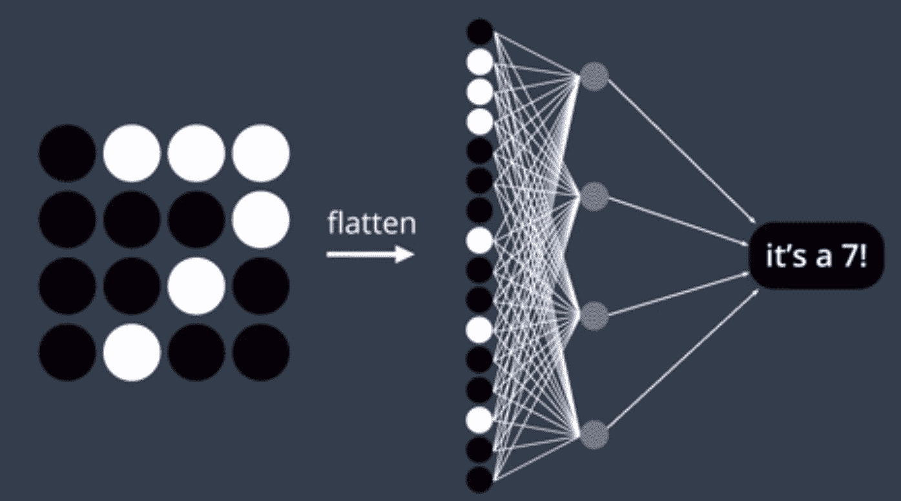
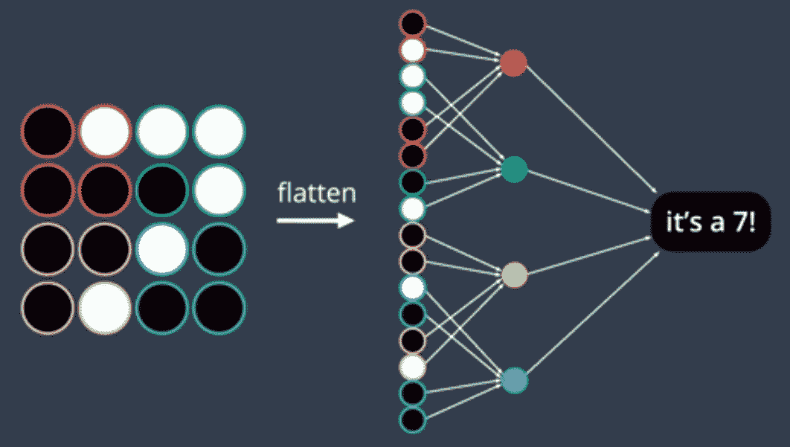
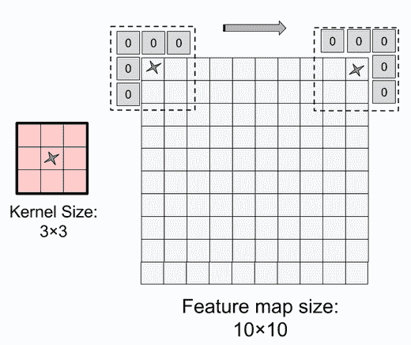
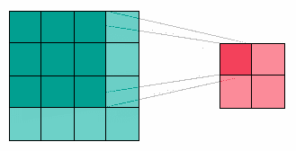
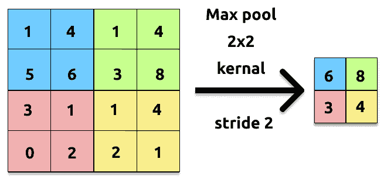

# 用于计算机视觉的卷积神经网络

在本章中，我们将学习**卷积神经网络**（**CNN**）。 这是与前几章讨论的神经网络不同的一类。 CNN 在计算机视觉领域已经取得了巨大的成功，随着我们对它们的了解越来越多，我们将能够理解其中的原因。

CNN 是一种特殊的网络，可以将图像作为张量接收。 彩色图像由红色，绿色和蓝色三个颜色通道组成，称为 RGB。 我们将这些二维矩阵通道堆叠起来以形成彩色图像； 每个通道的值变化会产生不同的颜色。 CNN 将图像作为三个独立的堆叠颜色层，一个层放在另一个层上。

图像从附近的一个设置像素中获得其含义，但是单个像素不能保存有关整个图像的太多信息。 在也称为密集层的全连接神经网络中，一层中的每个节点都连接到下一层中的每个其他节点。 CNN 利用像素之间的空间结构来减少两层之间的连接数，从而显着提高训练速度，同时减少模型参数。

这是显示全连接网络的图像：



将上一张图像与下一张图像进行比较，后者显示了一个卷积网络：



CNN 使用过滤器从输入图像中拾取特征； 具有足够数量的滤镜的 CNN 可以检测图像中的各种特征。 随着我们越来越向后一层移动，这些滤镜在检测复杂特征方面变得越来越复杂。 卷积网络使用这些过滤器并逐一映射它们以创建特征出现的映射。

在本章中，我们将介绍以下食谱：

*   探索卷积
*   探索池
*   探索转换
*   执行数据扩充
*   加载图像数据
*   定义 CNN 架构
*   训练图像分类器

# 技术要求

在本章中，您将需要在上一章中安装的 TorchVision。 您最好在支持 GPU 的计算机上运行这些配方中的代码。

# 探索卷积

卷积是 CNN 中的一个组成部分。 它们被定义为 CNN 中的一层。 在卷积层中，我们将滤镜矩阵从左到右，从上到下在整个图像矩阵上滑动，然后取滤镜的点积，此斑块将滤镜的尺寸跨过图像通道。 如果两个矩阵在相同位置具有较高的值，则点积的输出将较高，反之亦然。 点积的输出是标量值，该标量值标识图像中的像素模式和由滤波器表示的像素模式之间的相关性。 不同的滤镜会以不同的复杂度从图像中检测不同的特征。

我们需要了解 CNN 的另外两个关键元素，如下所示：

*   **跨步**：这是在图像的下一个小块上使用滤镜应用卷积网络之前，我们水平和垂直移动的像素数。
*   **填充**：这是我们在卷积时应用于图像边缘的策略，具体取决于我们是在卷积后要保持张量的尺寸不变还是仅在滤镜适合的情况下应用卷积 与输入图像。 如果要保持尺寸不变，则需要对边缘进行零填充，以使原始尺寸在卷积后与输出匹配。 这称为**相同填充**。 但是，如果我们不想保留原始尺寸，则会将过滤器无法完全容纳的位置截断，这称为**有效填充**。

这是这两个填充的示意图：



下图显示了有效填充的示例：



在本食谱中，我们将学习如何在 PyTorch 中使用卷积神经网络。

# 怎么做...

在此食谱中，我们将探讨卷积：

1.  首先，我们将导入所需的割炬`modules`：

```py
        >>import torch
        >>import torch.nn as nn
```

2.  接下来，我们将 2D 卷积应用于图像：

```py
        >>nn.Conv2d(3, 16, 3)
```

这将创建以下卷积层：

```py
Conv2d(3, 16, kernel_size=(3, 3), stride=(1, 1))
```

3.  然后，我们在图像的边缘添加所需大小的填充：

```py
        >>nn.Conv2d(3, 16, 3, padding=1)
```

这将创建以下卷积层：

```py
Conv2d(3, 16, kernel_size=(3, 3), stride=(1, 1), padding=(1, 1))
```

4.  然后，我们可以使用以下代码创建一个非平方内核（过滤器）：

```py
        >>nn.Conv2d(3, 16, (3,4), padding=1)
```

这将创建以下卷积层：

```py
Conv2d(3, 16, kernel_size=(3, 4), stride=(1, 1), padding=(1, 1))
```

5.  然后，我们可以使用以下代码将步幅添加到卷积中：

```py
        >>nn.Conv2d(3, 16, 3, stride=2)
```

这将创建以下卷积层：

```py
Conv2d(3, 16, kernel_size=(3, 3), stride=(2, 2))
```

6.  我们在水平和垂直方向上的步幅和填充量可能不相等：

```py
>>nn.Conv2d(3, 16, (3,4), stride=(3,3), padding=(1,2))
```

这将创建以下卷积层：

```py
Conv2d(3, 16, kernel_size=(3, 4), stride=(3, 3), padding=(1, 2))
```

通过此食谱，我们学习了如何在 PyTorch 中使用卷积。

# 这个怎么运作...

在本食谱中，我们研究了创建 2D 卷积的多种方法，其中第一个参数是给定输入图像中的通道数，对于彩色图像，通道数将为`3`，对于灰度图像将为`1`。 第二个参数是输出通道的数量，换句话说，就是我们要从给定层获得的滤波器的数量。 第三个参数是内核大小（即内核大小），或者是要使用滤镜卷积的图像的补丁大小。

然后，我们创建了一个`Con2d`对象，并将输入传递到 2D 卷积层以获取输出。 使用`nn.Conv2d(3, 16, 3)`，我们创建了一个卷积层，该卷积层接受 3 个通道的输入并输出 16 个通道。 该层的大小为 3 x 3 的正方形核，其高度和宽度的默认跨度为 1。 我们可以使用`padding`参数添加填充，该参数可以具有整数或元组值。 在这里，整数值将为高度和宽度创建相同的填充，而元组值将为高度和宽度创建不同的填充-这对于内核大小和跨度都是正确的。

# 还有更多...

通过将`padding`参数设置为`0`（默认设置），可以有效填充。 您还可以通过更改`padding_mode`参数将零填充更改为圆形填充。 您可以使用`bias`布尔参数（默认为`True`）添加或删除偏差。

# 也可以看看

您可以在[这个页面](https://pytorch.org/docs/stable/nn.html#torch.nn.Conv2d)了解有关 PyTorch 卷积的其他参数。

# 探索池

现在，我们进入 CNN 的下一个关键层-池化层。 到目前为止，我们一直在处理图像而不改变帧的空间尺寸（考虑相同的填充）； 相反，我们一直在增加通道/过滤器的数量。 池化层用于减小输入的空间尺寸，并保留其深度。 当我们从 CNN 的初始层移到后面的层时，我们希望在图像中识别出比实际逐个像素信息更多的概念意义，因此我们想从输入和抛出中识别并保留关键信息 剩下的。 池化层可以帮助我们做到这一点。

这是最大池化的示意图：



这是使用池化层的主要原因：

*   **减少计算数量**：通过减少输入的空间尺寸而不会损失滤波器，我们可以获得更好的计算性能，因此我们减少了训练所需的时间以及计算资源。
*   **防止过拟合**：随着空间尺寸的减小，我们减少了模型具有的参数数量，从而降低了模型的复杂性并有助于我们更好地概括。
*   **位置不变性**：这使 CNN 可以捕获图像中的特征，而不管特征在给定图像中的位置。 假设我们正在尝试建立一个分类器来检测芒果。 芒果位于图像的中心，左上角，右下角还是图像中的任何位置都没关系-需要对其进行检测。 池化层可以帮助我们。

池的类型很多，例如最大池，平均池，和池等。 但是，最大池化是最受欢迎的。 以与处理卷积层相同的方式，我们将定义一个窗口并在该窗口中应用所需的池化操作。 我们将根据层的跨度水平和垂直地滑动窗口。

# 怎么做...

在此食谱中，我们将研究如何在 PyTorch 中实现池化层：

1.  首先，让我们进行导入：

```py
    >>import torch
    >>import torch.nn as nn
```

2.  然后，我们使用`nn`模块中定义的池类，如下所示：

```py
    >>max_pool = nn.MaxPool2d(3, stride=1)
```

3.  现在，让我们定义一个张量来执行池化：

```py
    >>a = torch.FloatTensor(3,5,5).random_(0, 10)
    >>a
```

这给我们以下输出：

```py

    tensor([[[2., 8., 6., 8., 3.],
 [6., 6., 7., 6., 6.],
 [2., 0., 8., 8., 8.],
 [2., 0., 3., 5., 7.],
 [9., 7., 8., 2., 1.]],

 [[1., 8., 6., 7., 3.],
 [0., 1., 2., 9., 4.],
 [1., 2., 5., 0., 1.],
 [8., 2., 8., 3., 1.],
 [5., 4., 0., 5., 2.]],

 [[1., 6., 2., 6., 1.],
 [4., 0., 0., 6., 6.],
 [4., 2., 2., 3., 2.],
 [1., 0., 1., 7., 1.],
 [8., 1., 0., 5., 4.]]])
```

4.  现在，我们将池应用于张量：

```py
    >>max_pool(a)
```

这给我们以下输出：

```py
 tensor([[[8., 8., 8.],
 [8., 8., 8.],
 [9., 8., 8.]],

 [[8., 9., 9.],
 [8., 9., 9.],
 [8., 8., 8.]],

 [[6., 6., 6.],
 [4., 7., 7.],
 [8., 7., 7.]]])
```

5.  现在，我们可以尝试以类似方式进行平均池化：

```py
    >>avg_pool = nn.AvgPool2d(3, stride=1)
```

6.  然后，我们像以前一样应用平均池化：

```py
     >>avg_pool(a) 
```

这给我们以下输出：

```py
 tensor([[[5.0000, 6.3333, 6.6667],
 [3.7778, 4.7778, 6.4444],
 [4.3333, 4.5556, 5.5556]],

 [[2.8889, 4.4444, 4.1111],
 [3.2222, 3.5556, 3.6667],
 [3.8889, 3.2222, 2.7778]],

 [[2.3333, 3.0000, 3.1111],
 [1.5556, 2.3333, 3.1111],
 [2.1111, 2.3333, 2.7778]]])
```

通过此食谱，我们了解了 PyTorch 中的池化操作。

# 这个怎么运作...

在前面的代码中，我们研究了一个张量的示例，以了解实际的池化层。 我们使用大小为 3 x 3 的方形内核。池的第一个应用发生在[0,0,0]到[0,3,3]的面片上。 由于步幅为 1，因此下一个要操作的音色为[0,0,1]至[0,3,4]。 一旦碰到水平端，就对下面的张量进行运算。 `nn.MaxPool2d(3, stride=1)`和`nn.AvgPool2d(3, stride=1)`都创建了大小为`3x3`的最大和平均池方核，步幅为`1`，将其应用于随机张量`a`。

# 还有更多...

在本食谱中，我们研究了正方形核，但是我们可以选择使用非正方形核并大步前进，就像我们进行卷积一样。 还有另一种流行的池化方法，称为全局平均池化，可以通过输入的维数通过平均池化来实现。 例如`avg_pool2d(a, a.size()[2:]0)`。

# 也可以看看

您可以在[这个页面](https://pytorch.org/docs/stable/nn.html#pooling-layers)上找到有关池和各种池的更多信息。

# 探索变换

PyTorch 无法直接处理图像像素，需要将其内容作为张量。 为了解决这个问题，`torchvision`是一个专门处理视觉和图像相关任务的库，提供了一个名为`transform`的模块，该模块提供了将像素转换为张量，标准化标准缩放等的 API。 在本食谱中，我们将探索转换模块中的各种方法。 因此，您需要安装`torchvision`才能阅读此食谱。

# 怎么做...

在本节中，我们将探讨`torchvision`中的各种转换：

1.  我们将从导入`torchvision`开始：

```py
    >>from torchvision import transforms
```

2.  让我们根据图像创建张量：

```py
    >>transforms.ToTensor()
```

3.  接下来，让我们标准化图像张量：

```py
>>transforms.Normalize((0.5,),(0.5,))
```

4.  要调整图像大小，我们将使用以下方法：

```py
    >>transforms.Resize(10)
```

我们还可以使用以下内容：

```py
>>transforms.Resize((10,10))
```

5.  然后，我们使用转换来裁剪图像：

```py
    >>transforms.CenterCrop(10)
```

我们还可以使用以下内容：

```py
    >>transforms.CenterCrop((10, 10))
```

6.  我们可以使用转换来填充图像张量：

```py
>>transforms.Pad(1, 0)
```

我们还可以使用以下内容：

```py
>>transforms.Pad((1, 2), 1)
```

如果愿意，我们还可以执行以下操作：

```py
>>transforms.Pad((1, 2, 2, 3), padding_mode='reflect')
```

7.  然后，我们链接多个转换：

```py
>>transforms.Compose([
     transforms.CenterCrop(10),
     transforms.ToTensor(),
  ])
```

在此食谱中，我们了解了`torchvision`中使用的一些转换。

# 这个怎么运作...

在前面的代码段中，我们研究了`torchvision`中可用的各种转换。 这些使我们可以获取输入图像并将其格式化为所需尺寸和属性的张量，然后将其输入到割炬模型中。 我们研究的第一种方法是`toTensor()`方法，该方法将给定的输入图像转换为张量。 然后我们可以使用`Normalize()`方法对该输入图像张量进行归一化。 `Normalize()`方法采用两个元组，其中第一个元组是输入图像中每个通道的均值序列，第二个元组是每个通道的标准差序列。

此外，我们可以使用`Resize()`方法将给定图像的大小调整为所需尺寸，如果给定整数，则将其与较小边缘的长度匹配，如果给定元组，则将其与图像的高度和宽度匹配 图片。 在某些情况下，有关图像的关键信息位于其中心，在这种情况下，可以裁剪并仅考虑给定图像的中心； 为此，您可以使用`CenterCrop()`方法。 然后，我们传入一个整数以从中心裁剪一个正方形，或将与高度和宽度匹配的序列传递给`CenterCrop()`。

另一个重要任务是填充图像以匹配特定尺寸。 为此，我们使用`Pad()`方法。 我们将填充大小作为整数表示，用于在所有面上进行均等大小的填充，或者将序列作为由两个元素组成的序列，用于填充大小分别对应于左/右和上/下。 此外，我们可以将左侧，顶部，右侧和底部的填充大小作为由四个元素组成的序列传递。 然后，我们将填充值作为整数提供，如果它是三个元素的元组，则分别用作 R，G 和 B 通道的填充值。 除此之外，`Pad()`方法还具有`padding_mode`参数，该参数具有以下可能性：

*   `constant`：提供填充值的打击垫
*   `edge`：在图像边缘填充数值
*   `reflect`：带有图像反射的填充，边缘像素除外
*   `symmetric`：带有图像反射的焊盘，包括边缘像素

最后，我们研究了`Compose()`转换，该转换通过将一系列转换对象作为参数传递来组合各种转换以构建转换管道。

# 还有更多...

`transforms.functional`模块中有用于转换的功能性 API。 它们通过提供对转换的细粒度控制来帮助我们建立复杂的转换管道。

还有其他有用的转换，例如灰度转换，它使用`Grayscale()`作为输出通道数作为参数。 我们将在下一部分中探索更多的转换。

# 也可以看看

您可以在[这个页面](https://pytorch.org/docs/stable/torchvision/transforms.html#functional-transforms)上了解有关功能转换的更多信息。

# 执行数据扩充

在本食谱中，我们将学习有关使用火炬进行数据增强的知识。 数据扩充是深度学习和计算机视觉中的一项重要技术。 对于任何涉及深度学习或计算机视觉的模型，可用的数据量对于查看模型的性能至关重要。 数据扩充可防止模型记住有限数量的数据，而不是对观察到的数据进行概括。 数据扩充通过从原始图像创建变量而不实际收集新数据来增加用于训练模型的数据的多样性。

通常，光量，亮度，方向或颜色变化不会影响模型所做的推论。 但是，当模型在现实世界中部署时，输入数据可能会有这些变化。 对于模型来说，知道其做出的决定必须相对于输入中的这些变化是不变的，这很有用，因此数据扩充可以提高模型的性能。 在本食谱中，我们将使用 PyTorch 的`transform`模块执行数据增强。

# 怎么做...

为了充分利用此食谱，您应该完成“探索转换”食谱，因为此食谱是我们对转换工作的延续。 在本食谱中，我们将介绍一些我们可以使用`torchvision`中的`transform`模块执行的流行数据增强：

1.  我们将从导入`torchvision`开始：

```py
>>import torchvision
```

2.  然后，我们将随机裁剪图像的一部分：

```py
>>transforms.RandomCrop(10)
```

我们还可以使用以下内容：

```py
>>transforms.RandomCrop((10,20))
```

3.  我们可以使用以下方法水平翻转图像：

```py
>>transforms.RandomHorizontalFlip(p=0.3)
```

4.  我们也可以垂直翻转它：

```py
>>transforms.RandomVerticalFlip(p=0.3)
```

5.  尝试添加亮度，对比度，饱和度和色调变化：

```py
>>transforms.ColorJitter(0.25, 0.25, 0.25, 0.25)
```

6.  接下来，让我们添加旋转变化：

```py
>>transforms.RandomRotation(10)
```

7.  最后，我们将构成所有转换：

```py
>>transforms.Compose([
     transforms.RandomRotation(10),
     transforms.ToTensor(),
])
```

在此配方中，我们在数据上创建了转换以从现有数据创建更多数据。

# 这个怎么运作...

在本食谱中，我们了解了如何通过执行对手头问题有意义的某些转换来为数据添加变化。 选择正确的数据增强以模仿我们在现实生活中会遇到的图像变化时，我们必须小心。 例如，在构建汽车分类器时，有意义的是使用颜色和亮度的变化来增加数据，或者水平翻转汽车图像，等等。 但是，除非我们要解决汽车上下颠倒的问题，否则使用垂直翻转的汽车图像来增强数据是没有意义的。

在此配方中，我们尝试在随机位置裁剪图像，以便如果无法获得对象的整个图像，但无法获得一部分，则我们的模型将能够检测到该对象。 我们应该将裁剪后的图像大小包括为整数或具有特定高度和宽度的元组。 然后，我们水平翻转图像，并随机传递了水平翻转和垂直翻转的概率。 然后，我们使用`ColorJitter()`方法在图像的颜色，对比度，饱和度和色调上创建了变化。

我们通过设置参数来控制每种颜色的变化量，其中颜色，对比度和饱和度在[max（0，1-parameter），1 + parameter]值之间变化，而色相在[-hue， 色调]，其中色调介于 0 到 0.5 之间。 我们还向图像添加了随机旋转，并提供了最大旋转角度。 最后，选择正确的数据扩充策略后，将其添加到`transforms.compose()`中。

# 还有更多...

我们还可以自定义定义图像数据所需的转换。 为此，我们将使用`transforms.Lambda()`并将函数或 lambda 传递给所需的自定义转换。

# 也可以看看

您可以在[这个页面](https://pytorch.org/docs/stable/torchvision/transforms.html)了解有关仿射变换等其他变换的信息。

# 加载图像数据

在本食谱中，我们将研究如何将图像数据从文件加载到张量中。 在本食谱中，我们将使用 CIFAR-10 数据集，该数据集由数据集中 10 个类别中的每个类别的 60,000 个 32 x 32 像素彩色图像组成。 这些类别是飞机，汽车，鸟，猫，鹿，狗，青蛙，马，船和卡车。

# 做好准备

我们将使用`torchvision`加载数据。 CIFAR-10 可以作为`torchvision`中的数据集使用。 您应该已经安装了`torchvision`。 如果没有，则可以使用以下代码进行安装：

```py
pip install torchvision==0.x.x
```

有了这个设置，我们很高兴选择这个食谱。

# 怎么做...

在此配方中，我们将在 PyTorch 中加载 CIFAR-10 数据集：

1.  我们将从`torchvision`导入`datasets`模块：

```py
>>from torchvision import datasets
```

2.  然后，我们将导入`transforms`模块：

```py
>>from torchvision import transforms
```

3.  然后，我们将创建一个转换管道：

```py
>>transformations = transforms.Compose([
    transforms.RandomHorizontalFlip(),
    transforms.RandomRotation(20),
    transforms.ToTensor(),
    transforms.Normalize((0.5, 0.5, 0.5),(0.5, 0.5, 0.5))
])
```

4.  接下来，我们将使用数据集模块创建训练数据集：

```py
>>train_data = datasets.CIFAR10('CIFAR10', train=True, download=True, transform=transformations)
```

5.  同样，我们将创建一个测试数据集：

```py
>>test_data = datasets.CIFAR10('CIFAR10', train=False, download=True, transform=transformations)
```

6.  现在，我们可以检查训练和测试数据集的长度：

```py
>>len(train_data), len(test_data)
(50000, 10000)
```

7.  现在，我们将从训练集中创建一个验证集； 为此，我们将从 Torch 模块进行导入：

```py
>>from torch.utils.data.sampler import SubsetRandomSampler
```

8.  我们将选择 20% 的训练数据作为验证数据：

```py
>>validation_size = 0.2
```

9.  现在，我们将导入`numpy`：

```py
>>import numpy as np
```

10.  然后，我们将获得训练数据的大小：

```py
>>training_size = len(train_data)
```

11.  接下来，我们创建一个索引列表：

```py
>>indices = list(range(training_size))
```

12.  然后，我们将重新整理索引列表：

```py
>>np.random.shuffle(indices)
```

13.  之后，我们将获得索引以拆分验证和训练数据集：

```py
>>index_split = int(np.floor(training_size * validation_size))
```

14.  然后，我们将获得训练和验证集索引：

```py
>>validation_indices, training_indices = indices[:index_split], indices[index_split:]
```

15.  现在，我们将使用来自割炬的子集随机采样器：

```py
>>training_sample = SubsetRandomSampler(training_indices)
>>validation_sample = SubsetRandomSampler(validation_indices)
```

16.  接下来，我们将数据集分成多个批量。 我们将批量大小设置为 16：

```py
>>batch_size = 16
```

17.  然后，我们将在 PyTorch 中使用`dataloader`模块将数据批量加载：

```py
>>from torch.utils.data.dataloader import DataLoader
```

18.  然后，我们将创建训练，验证和测试数据集批量：

```py
>>train_loader = DataLoader(train_data, batch_size=batch_size, sampler=training_sample)
>>valid_loader = DataLoader(train_data, batch_size=batch_size, sampler=validation_sample)
>>test_loader = DataLoader(train_data, batch_size=batch_size)
```

这样，我们已经加载了数据并对其进行了预处理，以便可以将其发送到模型进行训练。

# 这个怎么运作...

在此配方中，我们使用了 PyTorch 中的`datasets`模块来获取 CIFAR10 数据集。 然后，我们定义了对数据集中的图像有意义的转换，这些图像是与 10 个不同类别相对应的动物的图像。 我们对某些图像进行了水平翻转，并随机对某些图像进行了旋转，范围为-20 至 20 度。

但是，我们没有添加垂直翻转，因为我们预计在评估阶段不会有动物的上下颠倒的图像输入到模型中。 之后，我们使用`ToTensor()`变换将图像转换为张量。 准备好张量后，我们使用`Normalize()`变换分别为红色，绿色和蓝色通道中的每一个设置了均值和标准差。 之后，我们在数据集中使用`CIFAR10()`方法来使用 CIFAR10 数据集。 然后，将`download`参数设置为`True`，以便如果根目录`CIFAR10`（第一个参数）中不存在数据集，则将其下载并保存在该目录中。

对于训练数据，我们将`train`参数设置为`True`，并使用`transform`参数传递了要应用于数据的转换。 这使我们能够动态创建图像而无需显式创建新图像。 现在，为了准备测试数据，我们将`train`参数设置为`False`。 我们将训练和测试数据集的大小分别设置为 50,000 和 10,000。 然后，我们使用训练集的 20% （由`validation_size`定义）从训练集准备了验证集。 我们随机选择了 20% 的训练集来创建验证集，以使验证集不会偏向特定类别的动物。 然后，我们使用训练集的大小，并使用 Python 中的`range()`准备了索引列表。

然后，我们使用`numpy`中的`random.shuffle()`方法对索引列表进行混排。 指标列表随机化后，我们将指标的前 20% 移至验证集，将其余 80% 的指标移至训练集。 我们通过将原始训练量乘以原始训练集的百分比用作验证集来找到分割索引。 我们使用`split_index`进行拆分。 然后，我们使用`torch.utils.data`中的`SubsetRandomSampler()`方法从给定的索引列表中随机抽取元素，而不进行替换。 最后，我们使用`DataLoader()`组合了数据集和采样器，以对数据集进行迭代。 然后，我们将数据加载器用于训练，验证和测试集，以在训练模型时对数据进行迭代。

# 还有更多...

`DataLoader()`模块中还有许多功能-例如，`DataLoader()`可用于多进程数据加载，而`num_workers`控制在加载数据时要使用的子进程数。 在我们的示例中，我们使用了默认值`0`，这意味着数据已在主进程中加载​​，这对于小型数据集是理想的选择，并为我们提供了更具可读性的错误跟踪。

# 也可以看看

您可以在[这个页面](https://pytorch.org/docs/stable/data.html#module-torch.utils.data)上了解有关数据加载工具的更多信息。

# 定义 CNN 架构

到目前为止，在本章中，我们一直在研究 CNN 的不同组成部分，以及如何将数据集中的数据加载到可以馈入 CNN 模型的格式中。 在本食谱中，我们将通过到目前为止已经看到的完成模型的组件来定义 CNN 模型架构。 这与我们在第 2 章，“处理神经网络”中介绍的全连接神经网络非常相似。 为了更好地理解此配方，从第 2 章，“处理神经网络”修改全连接神经网络的模型定义将是一个好主意。 我们将在 CIFAR10 数据集上建立图像分类模型，我们在“加载图像数据”配方中对此进行了讨论。

# 怎么做...

我们将在此食谱中完成模型类的定义：

1.首先，我们将导入`nn.Module`和`torch`功能性 API：

```py
>>import torch.nn as nn
>>import torch.nn.functional as F
```

2.然后，我们将编写一个继承自`nn.Module`的类：

```py
>>class CNN(nn.Module):
```

3.然后我们将定义我们的`__init__()`：

```py
>>def __init__(self):
    super().__init__()
```

4.现在，我们将在`__init__()`中定义我们的卷积层：

```py
    self.conv1 = nn.Conv2d(3, 16, 3, padding=1)
    self.conv2 = nn.Conv2d(16, 32, 3, padding=1)
    self.conv3 = nn.Conv2d(32, 64, 3, padding=1)
    self.pool = nn.MaxPool2d(2, 2)
    self.linear1 = nn.Linear(64 * 4 * 4, 512)
    self.linear2 = nn.Linear(512, 10)
    self.dropout = nn.Dropout(p=0.3)
```

5.我们的下一步是编写`forward()`方法：

```py
>>def forward(self, x):
    x = self.pool(F.relu(self.conv1(x)))
    x = self.pool(F.relu(self.conv2(x)))
    x = self.pool(F.relu(self.conv3(x)))
    x = x.view(-1, 64 * 4 * 4)
    x = self.dropout(x)
    x = F.relu(self.linear1(x))
    x = self.dropout(x)
    x = self.linear2(x)
    return x
```

6.现在我们的 CNN 类已经完成，我们可以实例化我们的模型类：

```py
>>model = CNN()
>>model
CNN(
  (conv1): Conv2d(3, 16, kernel_size=(3, 3), stride=(1, 1), padding=(1, 1))
  (conv2): Conv2d(16, 32, kernel_size=(3, 3), stride=(1, 1), padding=(1, 1))
  (conv3): Conv2d(32, 64, kernel_size=(3, 3), stride=(1, 1), padding=(1, 1))
  (pool): MaxPool2d(kernel_size=2, stride=2, padding=0, dilation=1, ceil_mode=False)
  (linear1): Linear(in_features=1024, out_features=512, bias=True)
  (linear2): Linear(in_features=512, out_features=10, bias=True)
  (dropout): Dropout(p=0.3)
)
```

在本食谱中，我们已经完成了模型定义。

# 这个怎么运作...

此食谱的工作方式与第 2 章，“处理神经网络”时非常相似，当我们研究一个全连接神经网络时。 我们从`__init__()`方法和父类的构造函数开始，定义了从 PyTorch 中的`nn.Module`继承的 CNN 类。 之后，我们通过传入与每一层相关的参数来定义 CNN 中的各个层。 对于我们的第一卷积层，输入通道的数量为 3（RGB），输出通道的数量定义为 16，其平方核大小为 3。第二卷积层采用上一层的张量，并具有 16 个输入通道和 32 个输出通道，内核尺寸为 3 x3。类似地，第三卷积层具有 32 个输入通道和 64 个输出通道，内核尺寸为 3 x 3。 我们还需要一个最大池化层，并使用 2 的内核大小和 2 的步幅。我们使用`.view()`将张量的三个维度展平为一个维度，以便可以将其传递到全连接网络中。 `view`函数中的-1 通过确保`view`函数之前和之后的元素数量保持相同（在本例中为批量大小）来确保将正确的尺寸自动分配给该尺寸。

对于第一个全连接层，我们有 1,024 个输入（通过将最大池后的`64 x 4 x 4`张量展平而获得）和 512 个输出。 对于最后一个全连接层，我们有 512 个输入和 10 个输出，代表输出类别的数量。 我们还为全连接层定义了一个辍学层，概率为 0.3。

接下来，我们定义`forward()`方法，将`__init__()`方法中定义的组件连接在一起。 因此，输入批处理的 16 个张量（每个张量为 32 x 32 x 3）经过第一个卷积层，然后经过 ReLU，然后是最大合并层，以形成尺寸为 16 x 16 的输出张量。 x 16，然后通过第二个卷积层，然后是 ReLU 和最大池层，输出的尺寸为 8 x 8 x 32，然后是第三个卷积层，然后是 ReLU 和最大池 层，尺寸为 4 x 4 x64。此后，我们将图像展平为 1,024 个元素的向量，并将其通过辍学层传递到第一个全连接层，提供 512 个输出，然后是 ReLU 和 在最后一个全连接层中删除，以提供所需的输出数量，本例中为 10。

然后，我们从 CNN 类实例化该模型并打印该模型。

# 还有更多...

您可以尝试不同的配置以用于丢失，卷积和池化层，甚至可以更改每种类型的层数。

# 也可以看看

您可以在[这个页面](https://pytorch.org/tutorials/beginner/blitz/cifar10_tutorial.html#define-a-convolutional-neural-network)上看到使用 CNN 训练 CIFAR10 的不同模型。

# 训练图像分类器

现在我们已经定义了模型，接下来的主要步骤是使用手头的数据训练该模型。 这将与我们在第 2 章，“处理神经网络”和我们全连接神经网络中进行的训练非常相似。 在本食谱中，我们将完成训练图像分类器的工作。 如果您在完成本食谱之前，先阅读了第 2 章的“实现优化器”食谱，那将非常有用。

# 怎么做...

让我们通过以下食谱完成模型的训练：

1.首先，我们将导入`torch`和`torch.optim`：

```py
>>import torch
>>import torch.nn as nn
>>import torch.optim as optim
```

2.然后，我们将检查运行模型所需的设备：

```py
>>device = torch.device("cuda" if torch.cuda.is_available() else "cpu")
>>device.type
'cuda'
```

3.然后，我们将模型移至可用设备：

```py
>>model = model.to(device)
```

4.接下来，我们添加交叉熵损失：

```py
>>criterion = nn.CrossEntropyLoss()
```

5.然后，添加优化器：

```py
>>optimizer = optim.SGD(model.parameters(), lr=0.01)
```

6.现在，我们将通过设置时期数来开始训练循环：

```py
>>n_epochs = 30
>>for epoch in range(1, n_epochs+1):
    train_loss = 0.0
    valid_loss = 0.0
```

7.然后，在循环中将模型设置为训练模式：

```py
model.train()
```

8.然后，我们遍历每批：

```py
for batch_idx, (data, target) in enumerate(train_loader):
    data, target = data.to(device), target.to(device)
    optimizer.zero_grad()
```

9.然后，我们在循环中将数据传递给模型：

```py
output = model(data)
```

10.接下来，我们得到了损失：

```py
loss = criterion(output, target)
```

11.然后，我们向后传播：

```py
loss.backward()
```

12.接下来，我们更新模型参数：

```py
optimizer.step()
```

13.然后，我们更新总损失：

```py
train_loss += loss.item()*data.size(0)
```

14.然后，我们将模型切换到评估模式，退出训练批处理循环：

```py
model.eval()
```

15.然后，我们遍历验证集批量：

```py
for batch_idx, (data, target) in enumerate(valid_loader):
    data, target = data.to(device), target.to(device)
```

16.接下来，我们获得模型输出和损失，就像在“步骤 9”，“步骤 10”和“步骤 13”中所做的那样：

```py
 output = model(data)
 loss = criterion(output, target)
 valid_loss += loss.item()*data.size(0)
```

17.然后，我们将计算每个时期的损失：

```py
train_loss = train_loss/len(train_loader.sampler)
valid_loss = valid_loss/len(valid_loader.sampler)
```

18.最后，我们在每个时期打印模型性能：

```py
    print(f'| Epoch: {epoch:02} | Train Loss: {train_loss:.3f} | Val. Loss: {valid_loss:.3f} |')
```

19.这是您将看到的输出示例：

```py

| Epoch: 01 | Train Loss: 2.027 | Val. Loss: 1.784 |
| Epoch: 02 | Train Loss: 1.640 | Val. Loss: 1.507 |
| Epoch: 03 | Train Loss: 1.483 | Val. Loss: 1.383 |
| Epoch: 04 | Train Loss: 1.380 | Val. Loss: 1.284 |
| Epoch: 05 | Train Loss: 1.312 | Val. Loss: 1.235 |
| Epoch: 06 | Train Loss: 1.251 | Val. Loss: 1.170 |
| Epoch: 07 | Train Loss: 1.198 | Val. Loss: 1.144 |
| Epoch: 08 | Train Loss: 1.162 | Val. Loss: 1.090 |
| Epoch: 09 | Train Loss: 1.123 | Val. Loss: 1.047 |
| Epoch: 10 | Train Loss: 1.088 | Val. Loss: 1.075 |
| Epoch: 11 | Train Loss: 1.061 | Val. Loss: 1.010 |
| Epoch: 12 | Train Loss: 1.035 | Val. Loss: 0.966 |
| Epoch: 13 | Train Loss: 1.012 | Val. Loss: 0.950 |
| Epoch: 14 | Train Loss: 0.991 | Val. Loss: 0.912 |
| Epoch: 15 | Train Loss: 0.971 | Val. Loss: 0.912 |
| Epoch: 16 | Train Loss: 0.946 | Val. Loss: 0.883 |
| Epoch: 17 | Train Loss: 0.931 | Val. Loss: 0.906 |
| Epoch: 18 | Train Loss: 0.913 | Val. Loss: 0.869 |
| Epoch: 19 | Train Loss: 0.896 | Val. Loss: 0.840 |
| Epoch: 20 | Train Loss: 0.885 | Val. Loss: 0.847 |
| Epoch: 21 | Train Loss: 0.873 | Val. Loss: 0.809 |
| Epoch: 22 | Train Loss: 0.855 | Val. Loss: 0.835 |
| Epoch: 23 | Train Loss: 0.847 | Val. Loss: 0.811 |
| Epoch: 24 | Train Loss: 0.834 | Val. Loss: 0.826 |
| Epoch: 25 | Train Loss: 0.823 | Val. Loss: 0.795 |
| Epoch: 26 | Train Loss: 0.810 | Val. Loss: 0.776 |
| Epoch: 27 | Train Loss: 0.800 | Val. Loss: 0.759 |
| Epoch: 28 | Train Loss: 0.795 | Val. Loss: 0.767 |
| Epoch: 29 | Train Loss: 0.786 | Val. Loss: 0.789 |
| Epoch: 30 | Train Loss: 0.773 | Val. Loss: 0.754 |
```

有了这个食谱，我们就完成了图像分类器的训练。

# 这个怎么运作...

在此配方中，我们找到并训练了我们的模型。 为此，我们进行了导入，首先要确定模型并将模型分配给我们在计算机上拥有的适当设备。 我们使用`model.to(device)`方法移动模型，这比使用`model.cuda()`或`model.cpu()`更为优雅。

然后，我们定义了损失函数，也称为`criterion`。 由于这是一个分类问题，因此我们使用了交叉熵损失。 然后，我们选择 SGD 优化器在反向传播时更新模型权重，学习速率为 0.01，并使用`model.parameters()`传入模型参数。 然后，我们将模型运行了 30 个纪元，尽管我们可以选择任何合理的数目来执行此操作。 在循环中，我们将训练和验证损失重置为 0，并将模型设置为训练模式，然后遍历训练数据集中的每个批量。 我们首先将批量移至设备，这样，如果我们的 GPU 内存有限，则并非所有数据都不会完全加载到 GPU 内存中。 然后，我们将输入张量传递到模型中，并获取输出，并将其传递到损失函数中，以评估预测标签和真实标签之间的差异。

此后，我们使用`loss.backward()`进行了反向传播，并使用`optimizer.step()`步骤更新了模型权重。 然后，我们使用总历时损失来汇总批量中的损失。 然后，我们使用`model.eval()`将模型转换为评估模型，因为该模型的性能需要在验证集上进行评估，并且该模型在此阶段中不会学习，因此我们也需要关闭退出项。 遍历验证批量，我们获得了模型输出，并在整个时期累积了验证批量之间的损失。 此后，我们格式化了模型性能，以查看每个时期模型的变化。 我们注意到，模型训练和验证损失随时间的推移而减少，这表明模型正在学习。

# 还有更多...

我们已经运行了训练有素的模型，我们需要根据保持数据或测试数据（即该模型尚未看到的数据）评估模型。 通过这样做，我们可以评估模型的真实性能。 为此，您将必须进入模型测试批量，并且对于每个批量，必须执行`_, prediction = torch.max(output, 1)`将 softmax 概率转换为实际预测，并使用`prediction.eq(target.data.view_as(prediction))`将预测与真实输出标签进行比较，其中 我们确保预测张量和输出张量的尺寸相同。 这将返回一个张量，其中匹配的张量为 1，不匹配的张量为 0。 我们可以使用它来计算每个批量中模型的准确率，并将其汇总到整个测试数据集中。

# 也可以看看

您可以在[这个页面](https://pytorch.org/tutorials/beginner/blitz/cifar10_tutorial.html#test-the-network-on-the-test-data)上看到测试模型的示例实现。