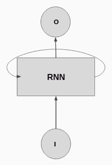
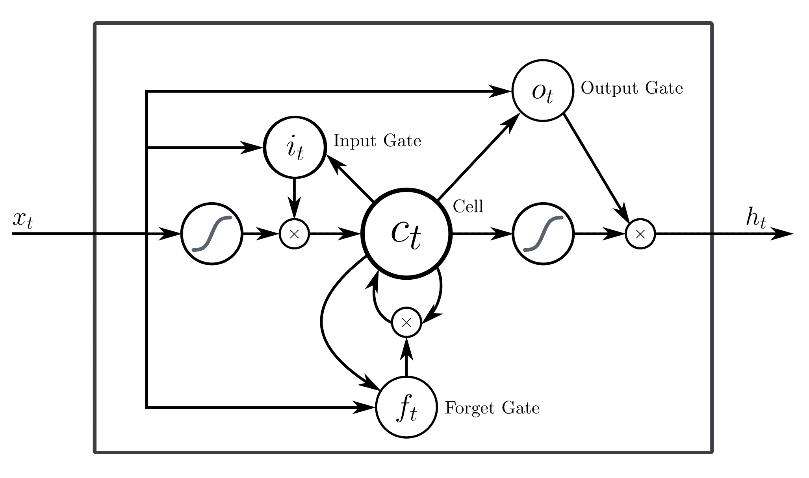
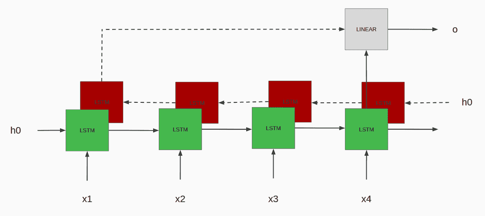
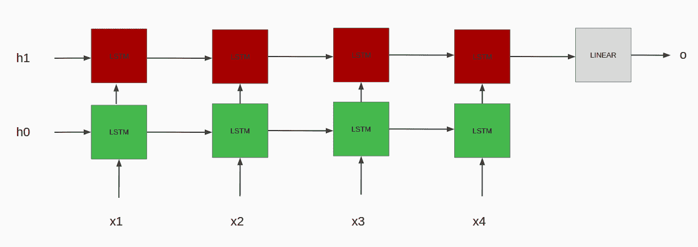

# 用于 NLP 的循环神经网络

在本章中，我们将处理**循环神经网络**（**RNNs**），这是一种专门处理序列数据或时变数据的神经网络。 利用卷积神经网络，我们处理在空间上彼此相关的数据点，其中一组像素值保存有关图像的信息。 但是请考虑一下节奏，节奏是由一段时间内一系列变化的声音信号形成的。 数据点彼此之间具有时间关系。 在循环神经网络中，神经元之间的连接在时间序列上形成有向图，表现出时间动态行为。 传统的前馈网络不存储先前的输入； 但是，RNN 使用存储单元来记住先前的输入，因此根据到目前为止的输入顺序来处理当前输入。

在本章中，我们将介绍以下秘籍：

*   分词
*   创建字段
*   开发数据集
*   开发迭代器
*   探索单词嵌入
*   建立 LSTM 网络
*   多层 LSTM
*   双向 LSTM

# RNN 介绍 

这是 RNN 的示意图：



图 1：循环神经网络

在上图中，我们可以看到 RNN 中的输入，输出和循环本身。 RNN 是为信息的持久性而设计的，而循环组件则可以实现这一点。

这是“图 1”的扩展版本：


图 2：RNN 的展开图

在上图中，我们可以看到 RNN 的展开图，其中一个步骤的信息被馈送到下一个步骤，从而创建同一网络的多个副本，所有这些信息都封装在循环循环中。 循环神经网络接受输入并给出输出，但是该输出不仅取决于给定实例上的输入，还取决于提供给网络的输入的整个历史，网络会在数学上记住这些输入。

循环神经网络能够接收可变大小的输入序列并产生可变大小的输出序列，从而执行与全连接神经网络中固定数量的计算相反的可变数量的计算。 进一步的 RNN 允许信息持久化，并在接收到的输入之间共享该信息。 在给定实例上生成的输出基于到目前为止所看到的所有输入的历史记录。

这是 LSTM 的示意图：



图 3：LSTM

**长短期记忆**（**LSTM**）网络是一种循环神经网络，是 RNN 之上的一种进步。

这是双向 LSTM：



图 4：双向 LSTM

这是多层 LSTM：



图 5：多层 LSTM

双向 LSTM 和多层 LSTM 是对基本 LSTM 网络架构的改进。

# 技术要求

在本章中，我们需要设置 PyTorch。 我们将使用`torchtext`，它是一个专门的库，用于处理与 PyTorch 联合工作的语言任务。

我们可以使用以下`pip`命令安装`torchtext`：

```py
pip install torchtext
```

至此，我们完成了本章所需的设置。

# 分词

在处理自然语言处理任务时，我们采用文本语料库并将其分解为较小的单元。 在本秘籍中，我们将句子分解为单个单词，其中每个单词代表一个意思，其他单词与它附近的其他单词一起表达一个句子的意图。 计算机只能理解数字，因此为这些单词分配了唯一的整数值来表示单词。 将句子分解为标记的过程称为分词。 在本秘籍中，我们将执行单词分词。

# 操作步骤

在本秘籍中，我们将编写一个标记器，将在本章的“创建字段”部分中使用：

1.  我们将首先编写一个简单的 lambda 函数：

```py
>>tokenizer = lambda words: words.split()
```

2.  然后，我们将测试`tokenizer()`函数：

```py
>>tokenizer("This is a test for tokenizer")
['This', 'is', 'a', 'test', 'for', 'tokenizer']
```

在此秘籍中，我们成功实现了单词分词。

# 工作原理

在此秘籍中，我们编写了一个简单的分词器 lambda 函数，该函数可用于英语和类似英语的语言。 我们使用单词之间的空格来标记句子。 然后，我们通过将句子传递给`tokenizer()`函数来测试标记器。 我们将在下一个秘籍中使用此标记生成器来创建字段。

# 更多

我们还可以使用`nltk`库对句子进行分词：

```py
>>from nltk.tokenize import word_tokenize
>>word_tokenize("This is a test for tokenizer")
['This', 'is', 'a', 'test', 'for', 'tokenizer']
```

此外，还有其他类型的分词，例如字符串分词，其中涉及将字符串分词为子字符串。

# 另见

可以在[这个页面](https://www.nltk.org/api/nltk.tokenize.html)上探索使用`nltk`对字符串进行的各种分词。

# 创建字段

在本秘籍中，我们将探索字段，这些字段与`torchvision`中可用的工具一样，使处理自然语言数据变得容易。 字段让我们定义数据类型，并通过指定要对数据执行的一组操作来帮助我们从文本数据中创建张量。 `Field`类使我们可以执行常见的文本处理任务，并掌握手边的数据词汇。

在本秘籍中，我们将研究如何使用`Field`类定义各种文本处理任务。

# 操作步骤

在本秘籍中，我们将探讨使用字段的各种示例：

1.  我们将从导入开始：

```py
>>from torchtext.data import Field
```

2.  为了进行情感分析，我们将为评论定义`Field`对象：

```py
>>Review = Field(sequential=True, tokenize=tokenizer, lower=True)
```

3.  然后，我们为标签定义字段：

```py
>>Label = Field(sequential=False, use_vocab=False)
```

4.  我们可以在输入字符串的开头和结尾添加标记：

```py
>>SequenceField = Field(tokenize=tokenizer, init_token='<sos>', eos_token='<eos>', lower=True)
```

5.  我们可以将序列设置为固定长度：

```py
>>SequenceField = Field(tokenize=tokenizer, init_token='<sos>', eos_token='<eos>', lower=True, fix_length=50)
```

6.  我们可以设置一个未知的标记：

```py
>>SequenceField = Field(tokenize=tokenizer, init_token='<sos>', eos_token='<eos>', unk_token='<unk>')
```

7.  我们可以将批量维度设置为第一维度：

```py
>>SequenceField = Field(tokenize=tokenizer, init_token='<sos>', eos_token='<eos>', unk_token='<unk>', batch_first=True)
```

通过此秘籍，我们探索了可用于在`torchtext`中创建字段的不同方法。

# 工作原理

在此秘籍中，我们根据手头的特定任务，使用`field`类对给定的输入文本执行了各种文本处理任务。 在审阅分类的示例中，在`review`字段中，我们将`sequential`参数设置为`True`，因为它是序列数据。 对于标签字段，我们将其设置为`False`，因为它们不是顺序的。 我们可以将文本设置为小写，这样就不会根据标记的大小写为相同的单词分配单独的标记 ID。 在评论分类的情况下，这不会影响含义； 这可以通过将`lower`设置为`True`来实现。

对于数字字段，我们将`use_vocab`设置为`False`，这是我们为审阅标签所做的，因为我们假设标签的负数值为`0`，正数的值为`1`。 我们从分词部分传递了`tokenizer`函数作为`tokenize`参数； 我们甚至可以通过设置`tokenize="spacy"`使用`spacy`的标记器。 对于某些任务，例如，使用`Sequence`对模型进行排序，我们可能需要特殊的标记来指示序列的开始和结束。 可以通过设置`init_token`和`eos_token`参数轻松完成。 这对于序列到序列的模型是正确的，并且如果在模型评估期间用于训练模型的词汇表中不存在标记（词汇表外），则可以使用自定义标记来替换这些标记， 设置`unk_token`参数。

然后，将`batch_first`设置为`True`，以使输出张量的第一维为批量维，如果`fix_length`参数设置为整​​数值，则使用此字段将对输入设置固定长度。

# 更多

我们可以为特定于某种语言的分词设置用于分词的语言，该语言支持 spacy 支持的语言。 我们可以使用`pad_token`参数设置自定义填充标记。 我们可以在分词之后但在数字化之前使用该字段定义将应用于示例的处理管道，在数字化之后但使用`preprocessing`和`postprocessing`参数将数字转换为张量之前，我们可以执行相同的操作。 `stop_words`参数可用于删除在预处理时需要删除的标记。 此外，还有一种专门用于标签字段的字段类型`LabelField`，它可以代替普通字段使用。

# 另见

您可以通过[这个页面](https://torchtext.readthedocs.io/en/latest/data.html#field)了解更多有关字段的信息。

# 开发数据集

在本秘籍中，我们将研究读取文本数据并使用各种数据源。`torchtext`可以从文本文件，CSV/TSV 文件，JSON 文件和目录中读取数据，并将其转换为数据集。 数据集是已预处理的数据块，可读取到内存中，并可由其他数据结构使用。

# 准备

我们将使用此秘籍的新闻分类数据集，您可以从[这里](https://github.com/jibinmathew69/PyTorch1.0-Tutorial/tree/master/NewsClassification)下载该数据集。

`.csv`文件中包含以下几列：

*   `id`
*   `content`
*   `Business`
*   `SciTech`
*   `Sports`
*   `World`

# 操作步骤

在此秘籍中，我们将读取有毒评论数据集，该数据集存储为一组`.csv`文件：

1.  我们将从导入开始：

```py
>>from torchtext.data import TabularDataset
```

2.  我们将选择训练列：

```py
>>train_datafields = [("id", None),
                 ("content", Review), ("Business", Label),
                 ("SciTech", Label), ("Sports", Label),
                 ("World", Label)]
```

3.  然后，我们将选择测试列：

```py
>>test_datafields = [("id", None),
                  ("content", Review)]
```

4.  然后，我们将阅读训练和验证`.csv`文件：

```py
>>train, valid = TabularDataset.splits(path='NewsClassification', 
                                    train='train.csv',
                                    valid='valid.csv',
                                    format='csv',
                                    skip_header=True,
                                    fields=train_datafields)
```

5.  接下来，我们将读取测试`.csv`文件：

```py
>>test = TabularDataset(path="NewsClassification/test.csv",
                    format='csv',
                    skip_header=True,
                    fields=test_datafields)
```

6.  然后，我们将建立词汇表：

```py
>>Review.build_vocab(train, min_freq=2)
```

通过此秘籍，我们定义了数据集的格式。

# 工作原理

我们使用`torchtext`中的`TabularDataset`模块读取 CSV 文件，该文件也可以用于读取 TSV，JSON 和 Python 字典中的输入，这些字典定义了列的数据集。 然后，我们定义了一个元组数组，其中每个元组都是一对列和`Field`对象（定义要应用的文本转换），但是在最终数据集中不需要特定的列。 然后，我们将在 ID 列中看到的该列的相应`Field`对象设置为`None`。

在此秘籍中，我们使用了新闻分类数据集。 我们在其中一个文本列中应用了`Review`字段，并在其余列中应用了`Label`字段。 对于`test_datafield`，我们将具有新闻内容，因此对于`content`列，我们应用了`Review`字段，并完全删除了`id`列。 然后，我们在`TabularDataset`中使用`splits`方法，并将其传递到训练和验证文件所在的根文件夹路径中。 我们还使用`train`和`valid`参数传入了训练和验证文件的文件名。

我们将文件格式指定为`csv`，并通过将`skip_header`设置为`True`以及`fields`参数中的必需列来删除标题行，并且对数据集进行了相同的测试。 最后，我们在`Fields`对象中调用了`build_vocab()`方法，以建立可能的单词库，在数据集中的出现次数最少为两次。 不在词汇表中的单词将在验证和测试集中分配一个未知标签。

# 更多

您可以使用`Vocab`模块在`torchtext`中构建词汇表。 除了`TabularDataset`之外，还有其他类型的数据集可以使用，具体取决于手头的 NLP 任务-例如，对于语言翻译任务，我们可以使用`TranslationDataset`类。

# 另见

您可以在[这个页面](https://torchtext.readthedocs.io/en/latest/data.html#torchtext-data)上了解有关数据集的更多信息。

# 开发迭代器

迭代器用于从数据集中加载一批数据。 它们提供了使加载数据和将数据移动到适当设备的方法更加容易。 我们可以使用这些迭代器对象遍历历元时对数据进行迭代。 在本秘籍中，我们将从数据集中开发这些迭代器。 您将需要完成“开发数据集”秘籍中的步骤，因为我们将在此处使用该秘籍中的`Dataset`对象。

# 操作步骤

在此秘籍中，我们将数据集转换为迭代器，以便在每个周期准备好要迭代的适当批量：

1.  我们将从导入开始：

```py
>>from torchtext.data import BucketIterator
>>import torch
```

2.  然后，我们将定义批量大小：

```py
>>BATCH_SIZE = 128
```

3.  然后，我们将确定可用的设备：

```py
>>device = torch.device('cuda' if torch.cuda.is_available() else 'cpu')
```

4.  接下来，我们将使用`BucketIterator`创建数据桶。

```py
>>train_iter, valid_iter, test_iter = BucketIterator.splits(
                                     (train, valid, test),
                                     batch_size=BATCH_SIZE,
                                     device=device,
                                     sort_key=lambda x: len(x.comment_text), 
                                     sort_within_batch=False)
```

通过此秘籍，我们为训练，测试和验证数据集创建了迭代器。

# 工作原理

我们使用迭代器来构建训练，测试和验证批量，并将数据集移动到适当的 CPU 或 GPU 设备中。 `Iterators`使执行这些任务变得非常优雅。 我们使用了称为`BucketIterator`的专门迭代器类，该类将输入序列分组为相似长度的序列，并自动对其进行随机排序。 我们定义了批量大小，并找到了机器上可用的设备。

然后，我们使用`BucketIterator`的`splits`方法创建训练，测试和验证迭代器。 我们将`sort_within_batch`参数设置为`False`，如果使用`pack_padded_sequence`则将其设置为`True`，这将阻止 LSTM 看到输入序列的填充部分。 当`True`使用`sort_key`参数时，它将按降序对批量中的序列进行排序。

# 更多

还有其他类型的迭代器可用。 一个简单的迭代器从`Dataset`对象中加载一批数据，而`BPTTIterator`定义了用于语言建模任务的迭代器，其中一对序列彼此相距一个时间步长。

# 另见

您可以在[这个页面](https://torchtext.readthedocs.io/en/latest/data.html?highlight=bucketiter#iterators)上找到有关迭代器参数的更多信息。

# 探索单词嵌入

单词嵌入是单词的学习表示。 它们是单词的密集表示，其中为每个单词分配一个向量，即预定义向量空间中的实值向量，而不是数字标识符。 例如，一个单词将表示为`n`维向量`[x[1], x[2], ..., x[n]]`-例如，语料库中的单词`book`可能表示为`[0.22, 0.242, ..., ..., 1.234]`而不是`[0, 0, 1, ..., 0]`的单引号表示。

数字表示只是单词的表示； 但是，单词嵌入是标记的表示，其中该表示也包含标记/单词的含义。 模型从单词出现的上下文中获悉了此含义。 在词嵌入中，具有相似含义的词具有相似的表示形式，我们可以对这些词向量执行向量算术，如下所示：


在这里，我们能够从`king`向量中减去`man`向量，并将其与`woman`向量相加，所得向量将接近该向量`Queen`的表示形式。 我们将在本秘籍中探讨此实现。

# 操作步骤

在此秘籍中，我们将对`torchtext`使用预训练的嵌入：

1.  我们将从导入开始：

```py
>>from torchtext import vocab
```

2.  然后，我们将继续加载嵌入向量：

```py
>>vec = vocab.Vectors('glove.6B.100d.txt', cache='./vec/glove_embedding/', url='http://nlp.stanford.edu/data/glove.6B.zip')
```

3.  我们可以通过将预训练向量应用于字段对象来构建词汇表：

```py
>>Review.build_vocab(train, min_freq=2, vectors=vec)
```

通过此秘籍，我们已加载了预训练的单词嵌入。

# 工作原理

`torchtext`具有用于处理嵌入的`vocab`模块。 我们可以通过在此秘籍中提及需要的嵌入名称来下载预训练的嵌入。 我们使用了预先训练的 GloVe（GloVe 是词向量技术）模型，该模型使用 60 亿个​​标记和 100 个嵌入维向量`glove.6B.50d`进行训练。

然后，我们从缓存位置加载向量。 如果所需的嵌入不在高速缓存中，那么它将自动从 URL 下载并作为嵌入向量传递。 然后，我们使用`Review`字段对象的`build_vocab`方法从这些预训练的嵌入中建立词汇表，然后将其添加到训练数据的词汇表中。

# 更多

我们还可以使用训练数据中的预训练嵌入词汇表-例如，我们可以使用使用 gensim 创建的嵌入向量作为嵌入向量。 我们还可以使用`torch.nn`模块创建嵌入； 我们将在下一个秘籍中了解如何执行此操作。

# 另见

您可以在[这个页面](https://torchtext.readthedocs.io/en/latest/vocab.html?highlight=embedding#module-torchtext.vocab)上了解有关嵌入的更多信息。

# 构建 LSTM 网络

**长短期记忆**（**LSTM**）网络是一种循环神经网络，具有内部门控，有助于更好地保持信息。 这些门是微小的神经网络，用于控制何时需要保存信息以及何时可以擦除或忘记信息。 RNN 受梯度消失和爆炸的影响，因此很难学习长期依赖关系。 LSTM 可以抵抗爆炸和梯度消失，尽管在数学上仍然可行。

# 操作步骤

在此秘籍中，我们将定义 LSTM 分类器：

1.  我们将从导入开始：

```py
>>import torch.nn as nn
```

2.  我们将命名为`LSTMClassifier`类：

```py
>>class LSTMClassifier(nn.Module):
```

3.  然后，我们添加嵌入层：

```py
>>def __init__(self, embedding_dim, hidden_dim, output_dim, dropout):
            super().__init__()
            self.embedding = nn.Embedding(len(Review.vocab), embedding_dim)
```

4.  然后，我们添加 LSTM 层：

```py
self.rnn = nn.LSTM(embedding_dim, hidden_dim)
```

5.  然后，我们添加一个全连接层：

```py
self.fc = nn.Linear(hidden_dim, output_dim)
```

6.  接下来，我们定义丢弃层：

```py
self.dropout = nn.Dropout(dropout)
```

7.  然后，我们为 LSTM 分类器定义正向方法：

```py
>>def forward(self, x):
```

8.  接下来，我们输入嵌入层：

```py
x = self.embedding(x)
```

9.  然后，我们将嵌入层的输出传递到 LSTM 中：

```py
output, (hidden, cell) = self.rnn(x)
```

0.  然后，我们应用`dropout`：

```py
hidden = self.dropout(hidden)
```

1.  最后，我们将输出传递给线性层：

```py
return self.fc(hidden)
```

2.  我们将定义超参数如下：

```py
>>EMBEDDING_DIM = 100
>>HIDDEN_DIM = 256
>>OUTPUT_DIM = 1
>>DROPOUT = 0.5
```

3.  最后，我们创建一个`model`对象：

```py
>>model = LSTMClassifier(EMBEDDING_DIM, HIDDEN_DIM, OUTPUT_DIM, DROPOUT)
```

通过此秘籍，我们创建了一个 LSTM 模型。

# 工作原理

我们使用`torch.nn`模块创建了从`torch.nn.Module`继承的模型类`LSTMClassifier`，并初始化了基类构造器。 然后，我们定义嵌入层，其中输入维与词汇量大小相同，输出为嵌入维，然后将嵌入层输出传递到 LSTM 层，其中输入维为嵌入维，然后定义隐藏状态维度。

然后，我们定义了全连接层和丢弃层。 接下来，我们定义`forward()`方法，该方法接受输入序列，并将其传递给嵌入层，从而产生尺寸为`embedding_dim`的输出，该输出是输入序列的嵌入向量。 然后将这个字向量传递到 LSTM 层，该层输出三个状态-输出状态，隐藏状态和单元状态。

隐藏状态张量保存了到目前为止 LSTM 所见过的所有序列的信息，因此我们采用了隐藏状态，应用了`dropout`，并将其通过全连接层传递给最终输出向量，其大小等于类数。 例如，对于有毒评论数据集，输出类别的数量为六； 但是，对于具有两个状态（正向和负向）的情感分析器，我们甚至可以考虑只具有一个输出，以便`1`代表积极情感，`0`代表消极情感。

# 更多

对于具有两个以上状态的毒性审查任务，我们将使用`CrossEntropyLoss()`，对于仅具有一个输出的情感分析器，我们将使用`BCEWithLogitsLoss()`。 其余训练与我们在第 3 章，“用于计算机视觉的卷积神经网络”中看到的内容相同，我们在其中训练了卷积神经网络。

# 另见

您可以在[这个页面](https://pytorch.org/docs/stable/nn.html#lstm)上了解有关 LSTM 的更多信息。

您可以在[这个页面](https://www.jefkine.com/general/2018/05/21/2018-05-21-vanishing-and-exploding-gradient-problems/)了解有关消失和梯度爆炸的更多信息。

# 多层 LSTM

我们在先前的秘籍中介绍了简单的 LSTM。 在本秘籍中，我们将为多层 LSTM 升级该简单的 LSTM 定义。 您需要完成“构建 LSTM 网络”秘籍才能了解此秘籍。

# 操作步骤

该秘籍是基于 LSTM 秘籍的修改。

1.  首先，我们将更新该类的`__init__()`：

```py
>>def __init__(self, embedding_dim, hidden_dim, output_dim, dropout, num_layers):
```

2.  然后，我们将`num_layers`参数添加到 LSTM 定义中：

```py
self.rnn = nn.LSTM(embedding_dim, hidden_dim, num_layers=num_layers)
```

我们的类定义应如下所示：

```py
class MultiLSTMClassifier(nn.Module):
    def __init__(self, embedding_dim, hidden_dim, output_dim, dropout, num_layers):
        self.embedding = nn.Embedding(len(Review.vocab), embedding_dim)
        self.rnn = nn.LSTM(embedding_dim, hidden_dim, num_layers=num_layers)
        self.fc = nn.Linear(hidden_dim, output_dim)
        self.dropout = nn.Dropout(dropout)

    def forward(self, x):
        x = self.embedding(x)
        output, (hidden, cell) = self.rnn(x)
        hidden = self.dropout(hidden)
        return self.fc(hidden[-1])
```

3.  接下来，我们向超参数添加层数量：

```py
>>NUM_LAYERS = 2
```

4.  最后，我们创建模型对象：

```py
>>model = MultiLSTMClassifier(EMBEDDING_DIM, HIDDEN_DIM, OUTPUT_DIM, DROPOUT, NUM_LAYERS)
```

通过此秘籍，我们修改了用于多层 LSTM 的网络。

# 工作原理

在此秘籍中，我们在构造器中添加了`num_layers`和参数以控制模型中 LSTM 的层数，并将其作为关键字参数`num_layers`传递给 LSTM 定义。

然后，在`forward()`方法中，由于隐藏状态的形状是`[num_layers * num_directions, batch, hidden_dim]`（默认情况下`num_direction`是`1`），因此我们仅使用`hidden[-1]`从最后一个 LSTM 层获取了隐藏状态。 这意味着`hidden[-1]`给出了最后一层的隐藏状态。 通过这样做，我们可以选择`num_layers`作为超参数。 来自较低层的隐藏状态输出作为较高状态的输入传递。

# 更多

在本秘籍中，我们仅考虑了最后一个 LSTM 层的隐藏状态。 但是，可能存在使用所有隐藏层的复杂架构。 有一个`dropout`参数，可用于在多层 LSTM 的各层之间施加丢弃。

# 另见

您可以在[这个页面](https://pytorch.org/docs/stable/nn.html#lstm)上了解有关多层 LSTM 的更多信息。

# 双向 LSTM

该秘籍以多层 LSTM 秘籍为基础。 在正常的 LSTM 中，LSTM 会从头到尾读取输入序列。 但是，在双向 LSTM 中，有第二个 LSTM 从最后到第一个读取序列，即反向 RNN。 当当前时间戳的预测取决于序列中进一步输入时，这种类型的 LSTM 可以提高模型性能。 考虑示例“我看过漫画”和“我昨天看过漫画”。 在这种情况下，基于将来出现的标记，相同的标记（即`read`）具有不同的含义。 我们将在本秘籍中探讨其实现。

# 准备

该秘籍建立在“多层 LSTM”秘籍的基础上，因此在尝试该秘籍之前，请务必先完成该秘籍。

# 操作步骤

在此秘籍中，我们将修改“多层 LSTM”秘籍中的类定义，使其成为双向 LSTM：

1.  我们将`bidirectional`参数设置为`True`：

```py
self.rnn = nn.LSTM(embedding_dim, hidden_dim, num_layers=num_layers, bidirectional=True)
```

2.  然后，我们将更改全连接层的输入尺寸：

```py
self.fc = nn.Linear(2*hidden_dim, output_dim)
```

3.  然后，将输入更新为全连接层，如下所示：

```py
hidden = self.dropout(torch.cat((hidden[-2,:,:], hidden[-1,:,:]), dim=1))
return self.fc(hidden.squeeze(0))
```

现在，类定义如下所示：

```py
class BiLSTMClassifier(nn.Module):
    def __init__(self, embedding_dim, hidden_dim, output_dim, dropout, num_layers):
        self.embedding = nn.Embedding(len(Review.vocab), embedding_dim)
        self.rnn = nn.LSTM(embedding_dim, hidden_dim, num_layers=num_layers, bidirectional=True)
        self.fc = nn.Linear(2*hidden_dim, output_dim)
        self.dropout = nn.Dropout(dropout)

    def forward(self, x):
        x = self.embedding(x)
        output, (hidden, cell) = self.rnn(x)
        hidden = self.dropout(torch.cat((hidden[-2,:,:], hidden[-1,:,:]), dim=1))
        return self.fc(hidden.squeeze(0))
```

4.  然后，我们创建模型对象：

```py
>>model = BiLSTMClassifier(EMBEDDING_DIM, HIDDEN_DIM, OUTPUT_DIM, DROPOUT, NUM_LAYERS)
```

通过此秘籍，我们修改了网络，使其现在是双向 LSTM。

# 工作原理

在此秘籍中，我们在 LSTM 定义中将`bidirectional`标志设置为`True`。 我们将前向和后向 LSTM 的隐藏状态连接起来，并将它们传递到全连接层中。 因此，全连接层的输入尺寸增加了一倍，以适应前向和后向隐藏状态张量。

在`forward()`方法中，我们使用`torch.cat()`连接了向前和向后隐藏状态，并使用了向前和向后 LSTM 的最后一个隐藏状态。 在 PyTorch 中，隐藏状态堆叠为`[forward_layer_0, backward_layer_0, forward_layer_1, backward_layer_1, ..., forward_layer_n, backward_layer_n]`，因此所需的张量为`hidden[-2,:,:], hidden[-1,:,:]`。 连接后，在挤出额外的尺寸后，我们将隐藏的向量传递到全连接层中。

# 更多

我们选择了最后的前向和后向隐藏状态并将它们连接起来，这就是我们选择的架构。 但是，根据手头的任务，我们可以选择任何或所有隐藏状态。

# 另见

您可以在[这个页面](https://pytorch.org/docs/stable/nn.html#lstm)上了解有关多层 LSTM 的更多信息。