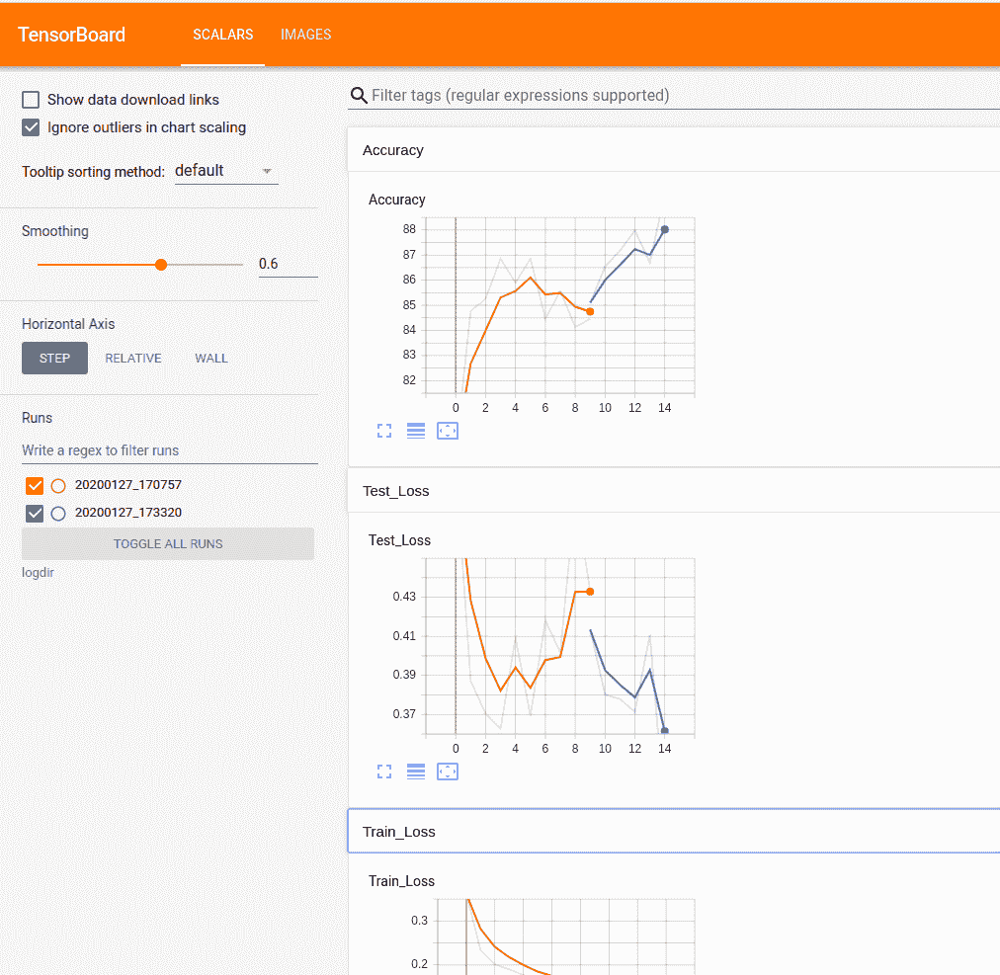
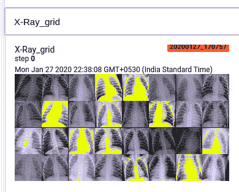
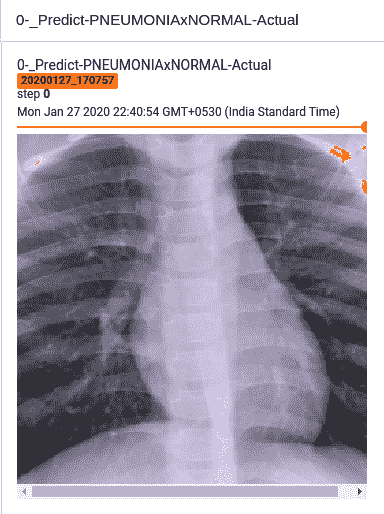
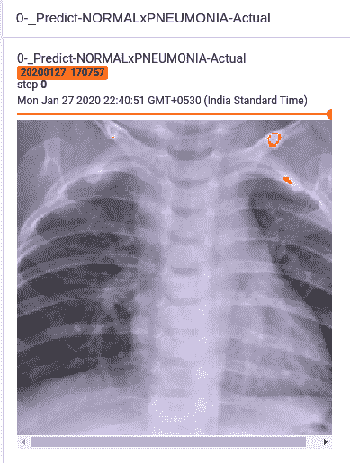
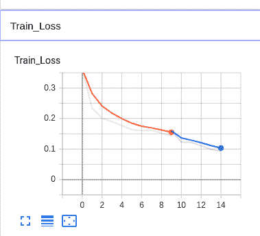
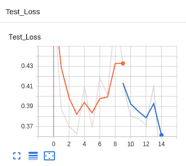
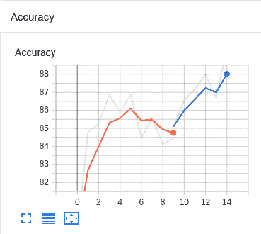

# 迁移学习和 TensorBoard

迁移学习是深度学习中的一个重要概念，它使我们可以将深度学习用于各种日常任务。 这是一种机器学习技术，其中针对任务训练的模型被重用以创建用于类似任务的新模型。 我们采用在大型数据集上训练的模型，并将其知识转移到较小的数据集。 对于具有**卷积神经网络**（**CNN**）的计算机视觉任务，我们冻结了网络的早期卷积层，仅训练了最后几层。 早期的卷积层提取适用于整个图像的通用低级特征，以检测边缘，图案和梯度，而稍后的层识别图像中的特定特征，并且特定于数据集。

在本章中，我们将训练图像分类器以区分正常患者和肺炎患者的胸部 X 光，并使用经过训练的 ResNet-50 模型进行迁移学习。 我们将替换分类器，并有两个输出单元代表正常和肺炎分类。

我们将在以下阶段完成迁移学习任务：

1.  加载在 ImageNet 数据集上训练的预训练的 ResNet-50 模型。
2.  在模型的较低卷积层中冻结参数（权重）。
3.  用多层可训练参数替换分类器。
4.  在可用于任务的训练数据上训练分类器层。
5.  微调超参数并根据需要解冻更多层。

在本章中，我们将介绍以下秘籍：

*   调整预训练模型
*   实现模型训练
*   实现模型测试
*   加载数据集
*   定义 TensorBoard 写入器
*   训练模型和解冻层

# 技术要求

要完成此秘籍，我们需要 Torch 1.2 或更高版本，强烈建议我们使用支持 CUDA 的设备。

# 调整预训练模型

在本秘籍中，我们将采用经过预训练的 ResNet 模型，并修改最后一层以适合我们所需的输出。 与 ImageNet 数据集中用于训练 ResNet-50 模型的类的数量相比，我们只需要两个类。 我们将修改 ResNet 模型的最后一个池化层和全连接分类器。 我们将进一步将模型的训练限制为仅添加新添加的分类器单元，并且将保留所有其余层以免更新权重。 这称为冻结模型。 让我们看一下如何实现秘籍。

# 准备

此秘籍要求我们下载特定的数据集。 我们将从[这里](https://www.kaggle.com/paultimothymooney/chest-xray-pneumonia/download)获取数据集。 为了完成此秘籍，您的 PyTorch 安装应为 1.2 或更高版本，强烈建议您使用支持 CUDA 的设备。

# 操作步骤

在本秘籍中，我们将训练我们的神经网络，并从在 ImageNet 数据集上训练的预训练模型 ResNet-50 开始：

1.  现在，我们将从导入开始编写 Python 代码：

```py
>>import torch
>>import torch.nn as nn
>>import numpy as np
>>import torch.optim as optim
>>from torchvision import transforms, datasets, models, utils
>>import time
>>import numpy as np
>>from torchsummary import summary
>>from torch.utils.data import DataLoader
```

2.定义`AdaptiveConcatPool2d`子模块：

```py
>>class AdaptiveConcatPool2d(nn.Module):
    def __init__(self, sz=None):
        super().__init__()
        sz = sz or (1,1)
        self.ap = nn.AdaptiveAvgPool2d(sz)
        self.mp = nn.AdaptiveMaxPool2d(sz)
    def forward(self, x): 
        return torch.cat([self.mp(x), self.ap(x)], 1)
```

3.定义一个函数以获取模型：

```py
>>def get_model():
    model = models.resnet50(pretrained=True)
```

4.现在，我们将冻结模型：

```py
for param in model.parameters():
    param.requires_grad = False
```

5.现在，我们将替换 ResNet 的最后两层并返回模型：

```py
model.avgpool = AdaptiveConcatPool2d()
model.fc = nn.Sequential(
    nn.Flatten(),
    nn.BatchNorm1d(4096),
    nn.Dropout(0.5),
    nn.Linear(4096, 512),
    nn.ReLU(),
    nn.BatchNorm1d(512),
    nn.Dropout(p=0.5),
    nn.Linear(512, 2),
    nn.LogSoftmax(dim=1)
)
return model
```

有了这个秘籍，我们已经准备好要获取模型的功能。

# 工作原理

在此秘籍中，我们定义了一个子模块`AdaptiveConcatPool2d`，该子模块在平均 2D 池和最大 2D 池之间执行级联，以便从卷积层到具有最大特征信息的全连接层的平滑过渡。

然后，我们定义了`get_model()`函数，该函数首先下载 ResNet-50 模型（本地不可用）并冻结该模型的权重。 通过冻结权重，较低的卷积层不会更新。 然后，我们用`AdaptiveConcatPool2d`层替换了平均池化层，并为两个可用的类添加了具有两个输出单元的全连接分类器。 我们最终返回了带有冻结的 ResNet 层的模型。

# 实现模型训练

在本秘籍中，我们将实现一个在单个时期内训练模型的功能。 此功能进一步记录模型的训练指标并将其绘制到 TensorBoard 上。 我们将传入模型，训练数据，优化器和模型训练准则，并将返回训练损失。

# 操作步骤

我们将在此秘籍中实现训练函数：

1.  定义训练函数：

```py
>>def train(model, device, train_loader, criterion, optimizer, epoch, writer):
    model.train()

    total_loss = 0   
```

2.  迭代训练数据并更新模型权重：

```py

    for batch_id, (data, target) in enumerate(train_loader):
        data, target = data.to(device), target.to(device)

        optimizer.zero_grad()
        preds = model(data)
        loss = criterion(preds, target)
        loss.backward()
        optimizer.step()

        total_loss += loss.item()
```

3.  记录并返回训练损失：

```py

    writer.add_scalar('Train Loss', total_loss/len(train_loader), epoch)
    writer.flush()

    return total_loss/len(train_loader)
```

通过此秘籍，我们完成了训练函数。

# 工作原理

在此秘籍中，我们定义了执行训练时期的功能。 在开始训练过程之前，我们使用`.train()`将模型设置为训练模式，并将训练损失设置为`0`。 然后，我们遍历训练数据并将输入数据点及其对应的标签移到可用设备（CPU 或 GPU）上。

然后，我们清除梯度，进行模型预测，然后将其传递给准则以确定训练损失。 然后，我们对损失进行了反向传播，并更新了模型的权重。 由于模型是冻结的，因此它仅更新模型中分类器的权重。

最后，我们使用 TensorBoard 中`SummaryWriter`对象中的`SummaryWriter`对象中的`add_scalar()`方法在 TensorBoard 中记录了训练指标-我们在其中传递了一个标签，一个标量值和一个计数器，在本例中为历元数 。

# 实现模型测试

在此秘籍中，我们将定义一个函数以在一个时期内根据验证数据测试模型。 此功能还将测试指标记录到 TensorBoard 上。 我们还将添加工具功能，通过绘制图像并以可读的方式标记这些图像来记录模型中的一些错误分类。

# 操作步骤

在本秘籍中，我们将实现模型测试以及工具功能：

1.  首先，我们将定义一个将张量转换为图像的函数：

```py
>>inv_normalize = transforms.Normalize(
        mean=[-0.485/0.229, -0.456/0.224, -0.406/0.225],
        std=[1/0.229, 1/0.224, 1/0.255]
    )
```

2.  然后，我们将定义一个函数来记录错误分类的图像：

```py
>>def misclassified_images(pred, writer, target, data, output, epoch, count=10):
    misclassified = (pred != target.data)
    for index, image_tensor in enumerate(data[misclassified][:count]):
        img_name = '{}->Predict-{}x{}-Actual'.format(
                epoch,
                LABEL[pred[misclassified].tolist()[index]],
                LABEL[target.data[misclassified].tolist()[index]], 
            )

        writer.add_image(img_name, inv_normalize(image_tensor), epoch)
```

3.  现在，我们将具有一个用于记录指标的函数：

```py
>>def test(model, device, test_loader, criterion, epoch, writer):
    model.eval()

    total_loss, correct = 0, 0

    with torch.no_grad():
        for data, target in test_loader:
            data, target = data.to(device), target.to(device)
            output = model(data)
            total_loss += criterion(output, target).item()
            pred = output.data.max(1)[1]
            correct += pred.eq(target.data).cpu().sum()

            misclassified_images(pred, writer, target, data, output, epoch)

    total_loss /= len(test_loader)
    accuracy = 100\. * correct / len(test_loader.dataset)
```

4.  现在，我们在 TensorBoard 上记录测试指标：

```py

    writer.add_scalar('Test Loss', total_loss, epoch)
    writer.add_scalar('Accuracy', accuracy, epoch)
    writer.flush()

    return total_loss, accuracy
```

通过此秘籍，我们完成了测试功能。

# 工作原理

在此秘籍中，我们编写了逆归一化函数以撤消在将图像转换为具有 ImageNet 统计信息的张量时建立的归一化。 我们还定义了`misclassified_images()`方法，用于记录预测错误的图像。 然后使用`SummaryWriter`对象中的`add_image()`方法将分类错误的图像添加到 TensorBoard 中，该方法将输入图像名称，图像和计数器。

然后，我们定义了`test()`方法，该方法在模型的验证数据集上运行验证，并使用`add_scalar()`方法记录测试损失和准确率，就像在训练函数中一样。 最后，我们在验证数据集上返回了测试损失和模型准确率。

# 加载数据集

在此秘籍中，我们将加载肺炎数据集并将其转换为张量。 该模型需要张量形式的数据，因此我们将需要对图像进行预处理以为其提供所需的数据。 我们将执行数据扩充以增加数据集的大小。 在将其输入模型之前，我们还将根据 ImageNet 数据集执行图像归一化。

# 操作步骤

在此秘籍中，我们将加载数据集：

1.  首先，我们将定义转换：

```py
>>image_transforms = {
```

以下代码显示了训练集转换：

```py

    'train':
    transforms.Compose([
        transforms.RandomResizedCrop(size=300, scale=(0.8, 1.1)),
        transforms.RandomRotation(degrees=10),
        transforms.ColorJitter(0.4, 0.4, 0.4),
        transforms.RandomHorizontalFlip(),
        transforms.CenterCrop(size=256), # Image net standards
        transforms.ToTensor(),
        transforms.Normalize([0.485, 0.456, 0.406],
                             [0.229, 0.224, 0.225]) # Imagenet standards
    ]),
```

以下代码显示了验证集转换：

```py

    'val':
    transforms.Compose([
        transforms.Resize(size=300),
        transforms.CenterCrop(size=256),
        transforms.ToTensor(),
        transforms.Normalize([0.485, 0.456, 0.406], [0.229, 0.224, 0.225])
    ]),
```

以下代码显示了测试集转换：

```py

    'test':
    transforms.Compose([
        transforms.Resize(size=300),
        transforms.CenterCrop(size=256),
        transforms.ToTensor(),
        transforms.Normalize([0.485, 0.456, 0.406], [0.229, 0.224, 0.225])
    ]),
}
```

2.  然后，我们将定义图像路径，批量大小，日志路径和保存模型的路径：

```py
>>datadir = '../input/chest-xray-pneumonia/chest_xray/chest_xray/'
>>traindir = datadir + 'train/'
>>validdir = datadir + 'test/'
>>testdir = datadir + 'val/'
>>model_path = "model.pth"
>>batch_size = 128
>>PATH_to_log_dir = 'logdir/'
```

3.  接下来，让我们从文件夹中加载图像：

```py
>>data = {
    'train':
    datasets.ImageFolder(root=traindir, transform=image_transforms['train']),
    'val':
    datasets.ImageFolder(root=validdir, transform=image_transforms['val']),
    'test':
    datasets.ImageFolder(root=testdir, transform=image_transforms['test'])
}
```

4.  现在，我们将创建迭代器：

```py
>>dataloaders = {
    'train': DataLoader(data['train'], batch_size=batch_size, shuffle=True),
    'val': DataLoader(data['val'], batch_size=batch_size, shuffle=True),
    'test': DataLoader(data['test'], batch_size=batch_size, shuffle=True)
}
```

5.  然后，我们将构建类标签：

```py
>>LABEL = dict((v,k) for k,v in data['train'].class_to_idx.items())
```

有了这个秘籍，我们就可以准备好数据集。

# 工作原理

在此秘籍中，我们定义了训练，验证和测试数据集中图像所需的转换。 根据数据集选择变换，并且归一化变换中的值来自 ImageNet 统计信息。 然后，我们定义了数据集路径，模型名称，批量大小和日志目录。 然后，我们使用`datasets.ImageFolder()`方法根据文件夹名称加载数据，并为每个数据集创建一个迭代器。

请注意，我们翻转了验证数据集和测试数据集目录。 这是因为给定数据集的验证数据集确实很小，因此我们将测试数据集用于验证数据集。

我们还使用`DataLoader`为我们的训练，测试和验证数据集创建了迭代器。 然后，我们创建了一个`LABEL`常量，这是一个字典，将分类器输出索引映射到类名。

# 定义 TensorBoard 编写器

在此秘籍中，我们将创建一个写入 TensorBoard 的对象。 我们使用`SummaryWriter`对象写入 TensorBoard。 我们可以使用 TensorBoard 编写标量值，绘图图和绘图图像以及其他功能。 我们将定义一个返回 TensorBoard `SummaryWriter`对象以记录我们的模型指标的函数。

# 准备

此秘籍要求我们安装 TensorBoard 库。

我们需要安装 TensorBoard 夜间版本：

```py
pip install tb-nightly
```

这样，我们准备实现该秘籍。

# 操作步骤

在此秘籍中，我们将创建编写器对象以将数据登录到 TensorBoard。

1.  我们将在命令行中输入以下内容来加载 TensorBoard：

```py
tensorboard --logdir=log_dir/ --port 6006
```

您可以通过转到`http://localhost:6006/`在浏览器上访问 TensorBoard。

2.  接下来，我们将导入 TensorBoard：

```py
>>from torch.utils.TensorBoard import SummaryWriter
```

3.  然后，我们将定义一个函数来获取 TensorBoard 编写器：

```py
>>def tb_writer():
      timestr = time.strftime("%Y%m%d_%H%M%S")
      writer = SummaryWriter(PATH_to_log_dir + timestr)
      return writer
```

4.  然后，我们将创建一个图像网格以可视化数据集中的图像：

```py
>>writer = tb_writer()
>>dataiter = iter(dataloaders['train'])
>>images, labels = dataiter.next()
>>grid = utils.make_grid([inv_normalize(image) for image in images[:32]])
>>writer.add_image('X-Ray grid', grid, 0)
>>writer.flush()
```

这样，我们就为 TensorBoard 做好了准备。

# 工作原理

在本秘籍中，我们首先从命令行加载 TensorBoard 以从`logdir/`目录中读取。 即使目录不存在，TensorBoard 也不抛出错误，而是等待目录出现，因此传递正确的目录很重要。

然后，我们将 TensorBoard 导入代码中，并定义了`tb_writer()`函数，该函数返回一个新的`SummaryWriter`对象。 我们向`writer`对象传递了 TensorBoard 日志要保存到的目录名称，并在时间戳`timestr`的帮助下，确保每个编写器都有一个唯一的目录来写入。

然后，我们使用`utils.make_grid()`创建了一个图像网格以查看训练数据集中的样本图像，并使用`add_image()`方法将其传递给 TensorBoard。 我们使用`iter(dataloaders['train'])`提取了图像，然后选择了 32 个图像的样本并进行反归一化，然后制作了网格。 我们还使用写入器中的`flush()`方法将缓冲区数据写入存储器。

# 训练模型和解冻层

在本秘籍中，我们将为数据集的预定义迭代次数完成模型训练。 我们将在模型训练期间保存最佳模型。 一旦针对给定的时期数训练了模型，我们将使用最佳模型的权重加载模型。 然后，我们将解冻模型的先前冻结的 ResNet 层，并训练模型以较低的学习速率微调权重。

# 操作步骤

在本秘籍中，我们将完成模型训练。

1.  将模型移至可用设备：

```py
>>device = torch.device('cuda' if torch.cuda.is_available() else 'cpu')
>>model = get_model().to(device)
```

2.  定义条件和优化器：

```py
>>criterion = nn.NLLLoss()
>>optimizer = optim.Adam(model.parameters())
```

3.  我们将定义一个函数来跨时期训练我们的模型：

```py
>>def train_epochs(model, device, dataloaders, criterion, optimizer,epochs, writer):
    print('{0:>20} | {1:>20} | {2:>20} | {3:>20} |'.format('Epoch','Training Loss','Test Loss', 'Accuracy'))

    best_score = np.Inf

    for epoch in epochs:

        train_loss = train(model, device, dataloaders['train'], criterion, optimizer, epoch, writer)

       test_loss, accuracy = test(model, device, dataloaders['val'], criterion, epoch, writer)

        if test_loss < best_score:
            best_score = test_loss
            torch.save(model.state_dict(), model_path)

        print('{0:>20} | {1:>20} | {2:>20} | {3:>20.2f}% |'.format(epoch,train_loss,test_loss, accuracy))

        writer.flush()
```

4.  现在，我们将训练冻结模型：

```py
>>train_epochs(model, device, dataloaders, criterion, optimizer, range(0,10), writer)
>>writer.close()
```

这是一个示例输出：

```py
Epoch | Training Loss | Test Loss    | Accuracy |
 0    |  0.3617607994 | 0.4970110774 |  79.17%  |
 1    |   0.233799973 | 0.3870731115 |  84.78%  |
 2    |  0.2014380195 |   0.37044851 |  85.26%  |
 3    |   0.190022166 |  0.362625807 |  86.86%  |
 4    |   0.176903085 |   0.40945090 |  85.90%  |
 5    |   0.163670904 | 0.3690894782 |  86.86%  |
 6    |  0.1607481929 |  0.418265098 |  84.46%  |
 7    |  0.1615160162 | 0.4016072392 |  85.58%  |
 8    |  0.1519727988 |  0.481940734 |  84.13%  |
 9    |  0.1441831755 |  0.433110350 |  84.46%  |
```

5.  我们将定义一个函数来解冻模型：

```py
>>def unfreeze(model):
    for param in model.parameters():
        param.requires_grad = True
```

6.  到目前为止，我们将加载最佳模型并解冻模型：

```py
>>model.load_state_dict(torch.load(model_path))
>>unfreeze(model)
```

7.  我们将更新优化器以降低学习速度：

```py
>>optimizer = optim.Adam(model.parameters(), lr=1e-6)
```

8.  我们将训练未冻结的模型：

```py
>>writer = tb_writer()
>>train_epochs(model, device, dataloaders, criterion, optimizer, range(9,14), writer)
```

这是一个示例输出：

```py
Epoch |        Training Loss |            Test Loss |  Accuracy  |
    9 |  0.15972968554351388 |  0.41342413425445557 |   85.10%   |
   10 |   0.1224460500042613 |   0.3801746487617493 |   86.54%   |
   11 |   0.1217333177422605 |  0.37790409922599794 |   87.18%   |
   12 |  0.11098722713749583 |   0.3712982594966888 |   87.98%   |
   13 |  0.09877484373566581 |  0.41088773012161256 |   86.70%   |
   14 |  0.09256085244620718 |   0.3181425631046295 |   89.42%   |
```

9.  我们最终将关闭 TensorBoard 编写器：

```py
>>writer.close()
```

在以下屏幕截图中，我们可以看到训练 TensorBoard 中查看的模型后生成的图：



图 1：TensorBoard 主仪表板

这是我们创建的图像网格：



图 2：图像网格

这是一个预示肺炎的误分类示例，但这实际上是正常的：



图 3：预计的肺炎，实际上是正常的

这是一个预测正常的误分类示例，但实际上是肺炎：



图 4：预测的正常，实际上是肺炎

这是显示我们的训练损失随时间减少的图：



图 5：训练损失

这是显示我们的测试损失随时间减少的图：



图 6：测试损失

以下图表显示了我们的精度随着时间的推移而提高：



图 7：准确率得分

通过此秘籍，我们已经训练了模型并在 TensorBoard 中可视化了其结果。

# 工作原理

在此秘籍中，我们创建了模型并将其移至可用设备，并分别使用负对数损失和 Adam 作为我们的标准和优化器。 `train_epochs()`方法用于在定义的时期范围内训练模型。 在每个时期结束时，我们使用`writer.flush()`方法来确保所有未决事件已写入磁盘。 最后，我们使用`writer.close()`刷新关闭编写器。 我们还在此功能中保存了最佳模型，以供日后重新加载。

然后，我们从到目前为止的训练中重新加载了最佳模型，并对其进行了冻结以进行微调。 解冻后，所有模型参数均可用于训练。 我们将优化器设置为较低的学习率，对该未冻结的模型进行了更多的训练，并记录了模型的性能。 我们看到，通过微调，我们的模型表现更好。

从 TensorBoard 图中，我们看到冻结模型中的指标为橙色，解冻后的指标为蓝色，这表明模型解冻后的性能有所提高。 然后，我们从训练数据中采样了图像网格图，并从各个时期对分类错误的示例进行了采样。

我们看到训练和测试损失在各个时期都减少了，准确率提高了。

# 更多

在此秘籍中，我们可以进一步编写一个函数来确定测试数据集指标，使用`add_histogram()`方法将直方图添加到 TensorBoard 中，并使用其他预训练的网络训练模型。

# 另见

有关更多详细信息，请参阅以下内容：

*   您可以在[这个页面](https://pytorch.org/tutorials/beginner/finetuning_torchvision_models_tutorial.html)上了解有关微调的更多信息。
*   您可以在[这个页面](https://pytorch.org/tutorials/beginner/transfer_learning_tutorial.html)上了解另一个迁移学习示例。
*   您可以通过[这里](https://pytorch.org/docs/stable/tensorboard.html)探索 TensorBoard 函数。