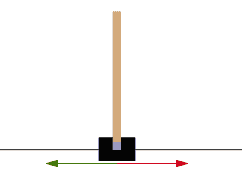
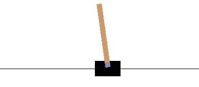

# 深度强化学习

在本章中，我们将探索**神经网络**（ **NNs** ）在使用 PyTorch 进行**强化学习**（ **RL** ）上的应用。

RL 是**人工智能**（ **AI** ）的领域，与我们在前面各章中介绍的其他机器学习格式不同。 RL 是机器学习算法的子类，它通过最大化环境中的奖励来进行学习。 当问题涉及决策或采取行动时，这些算法很有用。

在本章中，我们将介绍以下食谱：

*   OpenAI 健身房简介– CartPole
*   引入 DQN
*   实施 DQN 类
*   训练 DQN
*   引入深度 GA
*   生成代理
*   选择代理商
*   突变剂
*   训练深度 GA

# 深入了解 RL

**代理**是任何 RL 问题的核心。 它是 RL 算法的一部分，它处理输入信息以执行操作。 它探索和利用重复试验中的知识，以学习如何最大化奖励。 代理必须处理的场景称为**环境**，而**动作**是代理可以在给定环境中进行的动作。 采取行动后从环境中获得的回报称为**奖励**，代理根据当前状态决定使用下一行动的行动过程称为**策略**。 相对于短期奖励，带有折扣的预期长期回报称为**值**。 **q** -**值**与该值相似，但具有附加的当前动作参数。

现在，我们已经了解了 RL 的上下文，让我们理解为什么我们应该使用**较深的 RL** （ **DRL** ）而不是 RL。 DRL 将 RL 与深度学习相结合，后者使用 NN 解决 RL 问题。

深度学习算法可以学习抽象出环境状态的细节，然后学习状态的重要特征。 由于深度学习算法仅具有有限数量的参数，因此我们可以使用它将可能的状态压缩为更少的状态，然后使用该新表示形式来选择一个动作。

RL 解决方案涉及将反复试验的结果存储在查找表中，当环境变得越来越复杂时，查找表将变得非常庞大。 深度神经网络可能会学会识别程序员自己必须使用查找表方法手动设计的相同高级功能。

深度学习是 RL 最近取得突破的背后。 它们展现了代表性的功能，效率，灵活性，并为眼前的问题提供了简化的解决方案。

# OpenAI 健身房简介– CartPole

在本食谱中，我们将实现两种不同的 RL 算法。 我们将需要一个环境来运行我们的算法，以便我们创建的模型将获得最大的回报。

我们将使用 OpenAI 的健身房库，该库是我们可以用来训练模型的环境的集合。 我们将专注于称为`Cartpole-v1`的特定环境。

pole 是一个倒立的摆锤，其重心高于其枢轴点。 为了控制倒立摆的不稳定位置，我们必须将枢轴点移动到质心下方。 目的是施加适当的力，以使柱杆在枢轴点上保持平衡。

下图显示了 OpenAI 体育馆的 Cartpole：



图 1：OpenAI 体育馆– Cartpole

撑杆通过未激活的接头连接到推车，该接头在水平轨道上自由移动。 摆锤垂直于水平轨道开始。 目的是通过施加力+1 和-1 来防止跌落。

当杆与垂直位置的夹角超过 15 度时，或者手推车从中心移出的单位超过 2.4 个单位时，则认为手推车未能达到目标。

对于杆保持直立的每个时间步，都会获得+1 的奖励。 现在我们有了上下文，我们将尝试解决 OpenAI Gym 的 Cartpole 问题的代码。

# 做好准备

首先，我们需要安装`gym`。 我们将使用`pip`管理器安装它：

```py
pip install gym
```

现在我们已经安装了`gym`，让我们跳入`gym`库。

# 怎么做...

在本食谱中，我们将了解棘突环境。 请按照以下步骤操作：

1.  我们将从导入`gym`模块开始：

```py
>>import gym
```

2.  接下来，我们将创建环境：

```py
>>env = gym.make('CartPole-v0')
```

3.  接下来，我们将重置环境：

```py
>>env.reset()
```

4.  现在，我们将渲染环境：

```py
>>for _ in range(1000):
    env.render()
    action = env.action_space.sample()
    observation, reward, done, info = env.step(action)
    if done:
        env.reset()
>>env.close()
```

这将为我们提供以下输出：



图 2：柱极环境的输出

5.  获取可以执行的可能动作的数量：

```py
>>env.action_space.n
2
```

6.  获取观察状态参数的数量：

```py
>>env.observation_space.shape[0]
4
```

这样，您将看到一个窗口，该窗口显示不稳定的枢轴，并且枢轴点随机移动。

# 这个怎么运作...

在本食谱中，我们探讨了 OpenAI Gym 的一些功能。 我们首先使用`Cartpole-v0`创建一个环境，该环境的最高可得分为 200，然后环境终止。 我们使用`env.reset()`命令将环境置于初始状态，即线杆处于直立位置。 然后，我们开始执行 1000 个步骤的循环，其中使用`render()`渲染了当前环境的开始，并且使用`env.action_space.sample()`为当前状态选择了一个随机动作。 然后，我们将选定的动作传递到环境的`step`方法中。 `step`方法告诉我们在对环境的当前状态执行当前操作时环境发生了什么。 `step`方法返回以下内容：

*   **观察**：这是一个对象，它告诉我们有关环境的新状态。 该对象特定于我们选择的环境。
*   **奖励**：这给了我们所选动作所获得的奖励。 如果是直杆，则直杆直立时每个时间步长为 1.0，否则为 0.0。
*   **完成**：这是一个布尔值，它告诉我们环境是否已达到最终状态，可能是由于手头的任务失败而导致的（如果是小刀杆，则是当刀杆无法保持直立位置时） ，或者从完成手头的任务开始（对于小偷来说，就是达到最大时间步长 200 的时间）。
*   **信息**：对调试有用的诊断信息。

在循环中，每当极点翻倒时，我们都会将环境重置为其初始状态。

最后，我们关闭了环境。 我们使用`env.action_space.n`查看了环境中可能采取的行动，并使用`env.observation_space.shape[0]`查看了处于观察状态的参数。 现在我们已经了解了环境，我们可以开始实现各种深度 RL 算法。

# 还有更多...

您可以通过更改环境名称来尝试其他环境。 试用`Cartpole-v1`对您来说将是有益的。

# 也可以看看

您可以在 [http://gym.openai.com/docs/](http://gym.openai.com/docs/) 上了解有关 OpenAI 体育馆的更多信息。

# 引入 DQN

在进入下一个食谱之前，让我们快速看一下 DQN。

DQN 是一种 RL 技术，旨在为给定的观察选择最佳的动作。 有一个 q 值，它是与每个可能观察到的每个可能动作相关联的给定移动的质量。 在传统的 RL 算法中，此 q 值来自 q 表，该表是一个查找表，其中是包含 q 值的表。 通过反复玩游戏并使用奖励更新表来迭代更新此查找表。 q 学习算法学习要在此表中填充的最佳值。 我们可以简单地查看给定状态的表并选择具有最大 q 值的动作，以最大程度地赢得游戏。

q 值可以更新如下：


新的 q 值是两个部分的总和。 第一部分是**（1-学习率）*旧 Q 值**，它是多少旧值将被记住。 学习率为 0 时，不会学习任何新内容，学习率为 1 时，所有旧值都将被忘记。

第二部分是**学习率*（即时行动奖励+最优未来价值的折算估算）**，其中学习值是即时奖励加上最优未来价值的折算估算。 未来奖励的重要性由折扣系数决定。

通过深度 Q 学习，我们可以使用深度神经网络来预测动作的 Q 值，并使用深度神经网络来选择动作，而不是使用 Q 表查找给定状态下具有最大可能 q 值的动作。 给定动作的最大 q 值。

# 怎么做...

在本食谱中，我们将为卡特彼勒问题定义神经网络模型。 请按照以下步骤操作：

1.  首先，我们将导入`torch`：

```py
>>import torch
>>import torch.nn as nn
```

2.  接下来，定义一个函数以返回模型：

```py
def cartpole_model(observation_space, action_space):
    return nn.Sequential(
        nn.Linear(observation_space, 24),
        nn.ReLU(),
        nn.Linear(24, 24),
        nn.ReLU(),
        nn.Linear(24, action_space)
    )
```

此函数返回 the 模型。

# 这个怎么运作...

在此配方中，我们定义了一个名为`cartpole_model`的函数，该函数接受`observation_ space`和`action_space`参数，并返回一个神经网络模型。 在这里，我们使用了`torch.nn`，`nn.Linear`和`nn.ReLU`中的`Sequential`模块来完成模型。 给定一个观察值，我们使用该模型来训练和预测每个动作的 q 值。

# 还有更多...

我们还可以训练将状态作为图像并学习从图像预测 q 值的模型。 完成此操作后，我们将使用`nn.Conv2d()`来使用卷积神经网络。

# 也可以看看

您可以在 [https://pytorch.org/tutorials/intermediate/reinforcement_q_learning.html#q-network](https://pytorch.org/tutorials/intermediate/reinforcement_q_learning.html#q-network) 上查看替代架构。

# 实施 DQN 类

在本食谱中，我们将使用神经网络完成 DQN。 为此，我们将执行一些关键任务，包括创建目标和策略网络，损失函数和网络优化器，存储学习过程的状态和奖励，预测行为，体验重播以及控制学习过程。 勘探率。

# 做好准备

在完成本食谱之前，您应该完成本章的 *OpenAI 健身房介绍– Cartpole* 食谱，以便设置`gym`程序包。

# 怎么做...

在本食谱中，我们将研究可用于执行 DQN 的所有关键功能。 按着这些次序：

1.  我们将从必要的导入开始：

```py
>>import random
>>from collections import deque
>>import numpy as np
>>import torch.optim as optim
```

2.  接下来，我们将定义 DQN 类：

```py
>>class DQN:
```

3.  然后，我们将定义构造函数：

```py
>>def __init__(self, observation_space, action_space):
        self.exploration_rate = MAX_EXPLORE
        self.action_space = action_space
        self.observation_space = observation_space
        self.memory = deque(maxlen=MEMORY_LEN)
```

4.  接下来，我们将定义`target_net`和`policy_net`：

```py
self.target_net = cartpole_model(self.observation_space, self.action_space)
self.policy_net = cartpole_model(self.observation_space, self.action_space)
```

5.  现在，我们将复制权重：

```py
self.target_net.load_state_dict(self.policy_net.state_dict())
self.target_net.eval()
```

6.  在这里，我们定义损失函数，优化器和限制标志：

```py
self.criterion = nn.MSELoss()
self.optimizer = optim.Adam(self.policy_net.parameters())

self.explore_limit = False
```

7.  接下来，我们将定义`load_memory`方法：

```py
>>def load_memory(self, state, action, reward, next_state, terminal):
        self.memory.append((state, action, reward, next_state, terminal))
```

8.  现在，我们将定义`predict_action`方法：

```py
>>def predict_action(self, state):
        random_number = np.random.rand()

        if random_number < self.exploration_rate:
            return random.randrange(self.action_space)

        q_values = self.target_net(state).detach().numpy()
        return np.argmax(q_values[0])
```

9.  现在，我们将跳至`experience_replay`方法：

```py
>>def experience_replay(self):
        if len(self.memory) < BATCH_SIZE:
            return

        batch = random.sample(self.memory, BATCH_SIZE)
```

10.  现在，让我们使用批处理更新 q 值：

```py
for state, action, reward, next_state, terminal in batch:
    q_update = reward
    if not terminal:
        q_update = reward + GAMMA * self.target_net(next_state).max(axis=1)[0] 

    q_values = self.target_net(state)
    q_values[0][action] = q_update
```

11.  接下来，我们计算损失并更新权重：

```py
loss = self.criterion(self.policy_net(state), q_values)
self.optimizer.zero_grad()
loss.backward()
self.optimizer.step()
```

12.  我们还将更新探查率：

```py
if not self.explore_limit:
    self.exploration_rate *= EXPLORE_DECAY
    if self.exploration_rate < MIN_EXPLORE:
        self.exploration_rate = MIN_EXPLORE
        self.explore_limit = True
```

至此，我们完成了 DQN 课程。

# 这个怎么运作...

在本食谱中，我们完成了 DQN 类，并添加了所有必需的功能来训练 DQN。 在构造函数中，我们初始化了探索的初始状态，观察空间和动作空间，然后定义了一个存储单元来保存 DQN 的经验。 我们创建了称为`policy_net`和`target_net`的软骨模型的两个实例。 我们需要两个网络，因为在训练的每个步骤中，Q 网络的值都会移动，并且如果我们使用不断变化的目标值来调整我们的网络，则该网络可能会由于陷入此变化的目标与估计的 Q 值之间的反馈回路而变得不稳定。 网络值。 如果发生这种情况，价值估算将失去控制。 因此，我们使用了两个网络并将`target_net`保持在`eval`模式。 然后，我们使用`MSELoss()`作为损失函数以及`Adam`优化器来更新权重。

在`load_memory()`方法中，我们从环境中存储了状态，操作，奖励，下一个状态和终端，以用于训练网络。 我们使用的下一个方法是`predict_action`。 在此方法中，我们使用`np.random.rand()`选择了`random_number`，这为我们提供了`[0,1)`的值。 如果此`random_number`小于当前的`exploration_rate`，则我们选择一个随机动作，该动作由`exploration_rate`控制。 这就是我们合并探索的方式。 但是，如果`random_number`大于`exploration_rate`，则`target_net`会预测`q_values`并选择具有最大 q 值的动作。

最后，我们实现了`experience_replay`方法。 在这里，我们等待数据点的数量至少为`BATCH_SIZE`，然后从内存中随机抽样一批。 这使它可以从一系列不同的观察中学习，而不是从一系列紧密相关的观察中学习。 遍历批处理时，我们使用`target_net`根据 q 值更新公式更新了 q 值。 然后，我们根据新 q 值与`policy_net`预测的 q 值之间的误差训练了`policy_net`。 之后，通过将其乘以勘探衰减量逐渐降低勘探速率，直到获得最低勘探速率。 我们这样做是因为，在培训的初始阶段，我们希望代理人进行更多探索； 但是，随着训练的进行，我们希望算法能够收敛。 至此，我们已经完成了 DQN 类的所有功能。

# 还有更多...

您可以在 DQN 类中添加一种方法，以用策略网络更新目标网络的权重。

# 也可以看看

您可以在 [https://github.com/gsurma/cartpole/blob/master/cartpole.py](https://github.com/gsurma/cartpole/blob/master/cartpole.py) 上的 Keras 中查看此实现。

# 培训 DQN

在此配方中，我们将完成训练 DQN 增强算法的过程，并在训练模型后可视化我们的 cart。 我们将使用 DQN 类来预测操作并将该操作应用于环境以获得奖励。 此食谱的目的是使奖励最大化。 我们将使用经验重播来训练我们的模型以预测 q 值。

# 怎么做...

在本食谱中，我们将继续使用 *DQN 类*食谱。 按着这些次序：

1.  首先，我们需要导入`gym`：

```py
>>import gym
```

2.  接下来，我们需要初始化常量和环境：

```py
>>ENV_NAME = "CartPole-v1"
>>BATCH_SIZE = 20
>>GAMMA = 0.95
>>LEARNING_RATE = 0.001
>>MAX_EXPLORE = 1.0
>>MIN_EXPLORE = 0.01
>>EXPLORE_DECAY = 0.995
>>MEMORY_LEN = 1_000_000
>>UPDATE_FREQ = 10
```

3.  现在，我们需要初始化环境和 DQN：

```py
>>env = gym.make(ENV_NAME)
>>observation_space = env.observation_space.shape[0]
>>action_space = env.action_space.n
>>dqn = DQN(observation_space, action_space)
```

4.  现在，让我们开始训练循环：

```py
>>for i in range(100):
    state = env.reset()
    state = np.reshape(state, [1, observation_space])
    state = torch.from_numpy(state).float()
```

5.  接下来，我们需要逐步了解环境：

```py
score = 0
while True:
    score += 1
    action = dqn.predict_action(state)
    next_state, reward, terminal, info = env.step(action)
```

6.  在这里，我们必须找到下一个状态：

```py
next_state = torch.from_numpy(np.reshape(next_state, [1, observation_space])).float()
dqn.load_memory(state, action, reward, next_state, terminal)
state = next_state
```

7.  我们将使用以下代码结束无限循环：

```py
if terminal:
    print(f'| {i+1:02} | {dqn.exploration_rate:.4f} | {score:03} |')
    break    
```

8.  接下来，我们需要执行一次体验重播：

```py
dqn.experience_replay()
```

9.  接下来，更新权重：

```py
if steps%UPDATE_FREQ == 0:
    dqn.target_net.load_state_dict(dqn.policy_net.state_dict())
```

以下代码块显示了一些示例输出：

```py
| Run | Exploration Rate | Score |
| 001 |       0.9416     | 032   |
| 002 |       0.8956     | 011   |
| 003 |       0.8061     | 022   |
| 004 |       0.7477     | 016   |
| 005 |       0.6936     | 016   |
| 006 |       0.6498     | 014   |
| 007 |       0.5371     | 039   |
.
.
| 072 |       0.0100     | 256   |
| 073 |       0.0100     | 227   |
| 074 |       0.0100     | 225   |
| 075 |       0.0100     | 238   |
| 076 |       0.0100     | 154   |
| 077 |       0.0100     | 285   |
.
.
.
```

10.  现在，我们将定义一个函数，该函数将可视化 cart 的性能：

```py
>>def play_agent(dqn, env):
    observation = env.reset()
    total_reward=0
```

我们需要使用以下代码来迭代最多 500 个步骤：

```py

    for _ in range(500):
        env.render()
        observation = torch.tensor(observation).type('torch.FloatTensor').view(1,-1)
        q_values = dqn.target_net(observation).detach().numpy()
        action = np.argmax(q_values[0])
        new_observation, reward, done, _ = env.step(action)
        total_reward += reward
        observation = new_observation

        if(done):
            break
```

最后，关闭环境：

```py

    env.close()
    print("Rewards: ",total_reward)
```

调用`play_agent()`功能：

```py
>>play_agent(dqn, env)
Rewards: 160.0
```

这样，我们就对 DQN 进行了培训和可视化。

# 这个怎么运作...

在本食谱中，我们首先使用超参数导入并初始化环境。 然后，我们创建了`DQN`类的实例，并开始训练循环，重置环境，并对状态数组进行整形，以便可以将其作为浮点张量输入到模型中。 然后，我们开始了一个无限循环，当`env.step()`方法的返回值将`terminal`设置为`True`时终止。 `predict_action()`方法预测在给定环境当前状态下要采取的措施。 然后，我们使用环境的`step()`方法应用了此操作。 我们采用 step 方法返回的下一个状态，并将其从`numpy`转换为`torch.FloatTensor`，并保存了环境参数。 我们一次又一次地将此新状态传递给模型。 我们还每隔几步就将权重从我们的策略网复制到目标网。

最后，我们编写了一个简单的`play_agent`函数来可视化 the 平衡并在重置环境后运行循环。 我们要求目标网络预测每个可能动作的 q 值，选择具有最高 q 值的动作，并使用`step()`将其导入环境。 之后，我们不断增加奖励。 此函数返回柱状体直立的时间步数和柱状体执行平衡动作的视频。

# 还有更多...

您可以编写一个函数来绘制算法的性能，并且仅在模型的得分始终在 450-500 之间时才停止训练过程。

# 也可以看看

您可以在 [https://github.com/gsurma/cartpole/blob/master/cartpole.py](https://github.com/gsurma/cartpole/blob/master/cartpole.py) 的 Keras 中看到此实现。

您可以在 [https://github.com/pytorch/tutorials/blob/master/intermediate_source/reinforcement_q_learning.py](https://github.com/pytorch/tutorials/blob/master/intermediate_source/reinforcement_q_learning.py) 上看到替代实现。

# Deep GA 简介

在本食谱中，我们将探讨**深层遗传算法**（ **Deep GA** ），并向您展示当将其应用于 RL 时，它是基于梯度方法的竞争替代品。 我们将使用一组随机生成的网络，而不是使用梯度下降来修改其权重的随机生成的网络，而是创建一个一代，然后对其在给定环境中的性能进行评估。 请注意，一代人中的某些网络将比其他人表现更好。 我们将选择性能最佳的网络，并将其保留给下一代网络。 然后，我们将通过复制它们来创建下一代并对其权重进行随机修改。 由于我们将选择权重较小的最佳网络，因此网络的整体性能将不断提高。

在本配方中，我们将定义模型的网络维度，该网络维度将用于预测给定状态时应采取的措施。

# 怎么做...

在本食谱中，我们将完成网络模型定义。 您需要安装 OpenAI 的健身房库。 按着这些次序：

1.  我们将从进口开始：

```py
>>import torch.nn as nn
>>import torch
```

2.  现在，让我们定义一个返回神经网络的函数：

```py
>>def cartpole_model(observation_space, action_space):
    return nn.Sequential(
        nn.Linear(observation_space, 128),
        nn.ReLU(),
        nn.Linear(128, action_space),
        nn.Softmax(dim=1)
    )
```

这样，我们就完成了模型的定义。

# 这个怎么运作...

在此配方中，函数处于观察状态，并通过两个线性层和一个 ReLU 单元（在隐藏层中有 128 个单元）运行它。 最后一层的输出通过 softmax 函数传递，以将激活转换为概率，并选择概率最高的动作。

# 还有更多...

对于复杂模型，您还可以具有多个层和不同数量的单元。

# 也可以看看

您也可以将复杂的网络与卷积层一起使用。 在 [https://github.com/IBM/distributed-evolutionary-ml/blob/master/nn.py](https://github.com/IBM/distributed-evolutionary-ml/blob/master/nn.py) 中显示了一个示例。

# 生成代理

在本食谱中，我们将着眼于创建一组代理以开始我们的进化过程，然后初始化这些代理的权重。 我们将使用这些代理来评估模型的性能并生成下一代代理。

# 怎么做...

在此配方中，我们将创建给定数量的代理。 按着这些次序：

1.  首先，我们将定义一个函数来初始化代理的权重：

```py
>>def init_weight(module):
    if((type(module) == nn.Linear)):
            nn.init.xavier_uniform_(module.weight.data)
            module.bias.data.fill_(0.00)
```

2.  现在，我们将定义一个将创建代理的函数：

```py
>>def create_agents(num_agents, observation_space, action_space):
      agents = []
```

3.  接下来，我们将创建`num_agents`个代理：

```py
for _ in range(num_agents):
    agent = cartpole_model(observation_space, action_space)
    agent.apply(init_weight)
```

4.  我们将关闭每个代理层的渐变：

```py
for param in agent.parameters():
    param.requires_grad = False

agent.eval()
agents.append(agent)
```

5.  最后，我们将退回代理商：

```py
   return agents
```

现在，我们的代理商已准备好进行评估。

# 这个怎么运作...

在此配方中，我们编写了两个函数-第一个函数初始化模型层的权重。 对于模型权重，我们使用`torch.nn.init`中的`xavier_uniform`并用`0`填充偏差。 第二个函数创建`num_agents`个代理，并使用`cartpole_model()`函数返回它们。 我们使用`init_weight`初始化权重。 然后，对于模型的参数，我们禁用梯度计算，将代理设置为`eval()`模式，然后返回所有代理。

# 也可以看看

您可以在 [https://pytorch.org/docs/stable/nn.init.html](https://pytorch.org/docs/stable/nn.init.html) 上找到有关其他初始化方法的信息。

# 选择代理商

在本食谱中，我们将基于适应度函数着眼于代理商选择，在我们的案例中，这意味着在平衡卡特波勒方面得分很高。 这意味着我们将传播得分最高的代理，而忽略其余的代理。 我们将评估给定一代中的每个代理，并多次评估它们，以确保奖励不是偶然的。 最后，我们将使用每个代理商的平均分数来确定表现最佳的代理商。

# 怎么做...

在本食谱中，我们将编写用于评估代理，多次评估以及按给定序列评估所有代理的功能。 按着这些次序：

1.  我们将从进口开始：

```py
>>import numpy as np
```

2.  接下来，我们需要定义一个函数来评估代理的性能：

```py
>>def eval_agent(agent, env):
    observation = env.reset()
```

3.  接下来，我们需要在最大可能的时间步长内运行循环：

```py
total_reward = 0
for _ in range(MAX_STEP):
    observation = torch.tensor(observation).type('torch.FloatTensor').view(1,-1)
    action_probablity = agent(observation).detach().numpy()[0]
    action = np.random.choice(range(env.action_space.n), 1, p=action_probablity).item()
    next_observation, reward, terminal, _ = env.step(action)
    total_reward += reward
    observation = next_observation

    if terminal:
        break
return total_reward
```

4.  然后，我们需要定义平均座席得分：

```py
>>def agent_score(agent, env, runs):
    score = 0
    for _ in range(runs):
        score += eval_agent(agent, env)

    return score/runs 
```

5.  最后，我们评估所有代理商的分数：

```py
>>def all_agent_score(agents, env, runs):
    agents_score = []
    for agent in agents:
        agents_score.append(agent_score(agent, env, runs))

    return agents_score
```

现在，我们的功能已准备好进行评估。

# 这个怎么运作...

在本食谱中，我们完成了深度遗传算法的一些关键功能。 我们研究了三个不同的功能-第一个功能`eval_agent()`与我们在 *Training DQN* 配方中看到的功能非常相似，其中我们使用了代理，该代理是一种神经网络模型，可以预测 并执行直到`MAX_STEP`（对于`cartpole-v1`为 500）或终端为`True`并返回分数的动作。

然后，我们使用第二个函数`agent_score()`返回指定数量`runs`之上的平均分数，并返回该平均分数，以确保模型的随机性能不佳。 最后一个函数`all_agent_score()`仅循环遍历一代中的所有代理，并获得一代中所有代理的平均分数。

# 突变剂

在本食谱中，我们将介绍突变剂。 在从给定的一代中选择性能最佳的模型之后，然后再创建下一代代理，我们将对这些选定代理的权重进行轻微的随机变化，这使代理可以探索更多区域以获得更好的回报，只是 就像生物进化如何运作。

# 怎么做...

在此配方中，我们将识别精英特工并向这些特工添加突变。 按着这些次序：

1.  首先，我们将导入`copy`和`numpy`模块：

```py
>>import copy
>>import numpy
```

2.  接下来，我们将定义`mutation`函数：

```py
>>def mutation(agent):
    child_agent = copy.deepcopy(agent)
```

3.  接下来，我们将遍历代理的参数：

```py
for param in agent.parameters():
    mutation_noise = torch.randn_like(param) * MUTATION_POWER
```

4.  然后，我们将变异噪声添加到参数中：

```py
    param += mutation_noise
return child_agent
```

5.  现在，定义`elite`函数：

```py
>>def elite(agents, top_parents_id, env, elite_id=None, top=10):
    selected_elites = top_parents_id[:top]
    if elite_id:
        selected_elites.append(elite_id)

    top_score = np.NINF
    top_id = None
```

6.  接下来，找到`elite`代理：

```py
for agent_id in selected_elites:
    score = agent_score(agents[agent_id], env, runs=5)
    if score > top_score:
       top_score = score
       top_id = agent_id

return copy.deepcopy(agents[top_id])
```

7.  获取子代理：

```py
>>def child_agents(agents, top_parents_id, env, elite_id=None):
    children = []

    agent_count = len(agents)-1    
    selected_agents_id = np.random.choice(top_parents_id, agent_count)
    selected_agents = [agents[id] for id in selected_agents_id]
    child_agents = [mutate(agent) for agent in selected_agents]

    child_agents.append(elite(agents, top_parents_id, env))
    elite_id = len(child_agents)-1

    return child_agents, elite_id
```

8.  获取顶级父母：

```py
>>def top_parents(scores, num_top_parents):
    return np.argsort(rewards)[::-1][:num_top_parents]
```

在这里，我们定义了识别精英特工的功能和为特工增加噪音的功能。

# 这个怎么运作...

在本食谱中，我们研究了四个不同的函数-`mutation`函数为一个代理创建一个重复项，并为每个参数附加一个受`MUTATION_POWER`限制的小的随机值。 `rand_like`方法从间隔`[0, 1)`上以与`param`相同的大小从均匀分布返回具有随机值的张量。 最后，该函数返回突变的子代理。 接下来，我们看到`elite`函数返回性能最佳的代理中最佳代理的副本。 在`elite`功能中，我们重新评估代理以确保得分最高的代理被选为精英，并作为子代理传递给下一代。

`child_agent`函数生成的子代理数量与上一代相同，其中一个子代理是`elite`函数的精英代理，其余子代理则使用`np.random.choice`随机选择。 `selected_agents`保留了表现最佳的选定代理的列表。 在`[mutate(agent) for agent in selected_agents]`步骤中，使用`mutation`功能对得分最高的代理进行突变。

然后，我们将精英代理附加到下一代代理。 最后，`top_parent`函数返回一代中性能最高的代理的索引。

# 训练深度 GA

在本食谱中，我们将完成深度遗传算法的演化，并可视化执行平衡操作的关键。 我们将使用在本章的食谱中了解到的所有功能，并针对给定的代数运行这些功能。 这将创建代理，获取他们的分数，选择性能最佳的代理，并将其突变为下一代。 在几代人中，我们将看到代理商的分数增加。

# 怎么做...

按着这些次序：

1.  首先，我们将导入`gym`：

```py
>>import gym
```

2.  接下来，我们将声明超参数：

```py
>>ENV_NAME = "CartPole-v1"
>>MAX_STEP = 500
>>MUTATION_POWER = 0.02
>>num_agents = 500
>>num_top_parents = 20
>>generations = 25
>>elite_agent = None
```

3.  之后，我们将创建环境并禁用梯度计算：

```py
>>torch.set_grad_enabled(False)
>>env = gym.make(ENV_NAME)
```

4.  现在，创建代理：

```py
>>agents = create_agents(num_agents, env.observation_space.shape[0], env.action_space.n)
```

5.  接下来，遍历几代人：

```py
>>print(f'| Generation | Score |')
>>for gen in range(generations):
```

现在，我们可以评估代理商：

```py
      rewards = all_agent_score(agents, env, 3)
```

通过这样做，我们得到了最好的代理商：

```py
      top_parents_id = top_parents(rewards, num_top_parents)
```

反过来，这将创建下一代：

```py
      agents, elite_agent = child_agents(agents, top_parents_id, env, elite_agent)
      print(f'| {gen+1:03} | {np.mean([rewards[i] for i in top_parents_id[:5]]):.4f} |')
```

以下代码块显示了示例输出：

```py
| Generation |     Score       |
|    001     |    47.0667      |
|    002     |    47.3333      |
|    003     |    55.7333      |
|    004     |    58.2667      |
|    005     |    65.3333      |
|    006     |    88.0000      |
|    007     |    105.5333     |
|    008     |    117.4000     |
|    009     |    109.4000     |
|    010     |    137.6667     |
|    011     |    150.3333     |
|    012     |    168.6000     |
|    013     |    176.2667     |
|    014     |    248.0667     |
|    015     |    281.6667     |
|    016     |    327.9333     |
|    017     |    363.5333     |
|    018     |    375.4000     |
|    019     |    387.0000     |
|    020     |    432.2000     |
|    021     |    454.6000     |
|    022     |    445.9333     |
|    023     |    463.7333     |
|    024     |    482.1333     |
|    025     |    496.2000     |
```

6.  最后，我们将形象化地表现出：

```py
>>def play_agent(agent, env):

    observation = env.reset()
    total_reward=0

    for _ in range(MAX_STEP):
        env.render()
        observation = torch.tensor(observation).type('torch.FloatTensor').view(1,-1)
        output_probabilities = agent(observation).detach().numpy()[0]
        action = np.random.choice(range(2), 1, p=output_probabilities).item()
        new_observation, reward, done, _ = env.step(action)
        total_reward += reward
        observation = new_observation

        if(done):
            break

    env.close()
    print("Rewards: ",total_reward)

>>play_agent(agents[num_agents-1],env)
Rewards: 350.0
```

至此，我们已经完成了 DGA 的培训和可视化。

# 这个怎么运作...

在此配方中，我们改进了深度遗传算法。 根据论文*深层神经进化：我们将超参数设置为*，将`MUTATION_POWER`设置为`0.02`。遗传算法是用于训练深度神经网络以进行强化学习*的一种竞争选择。 我们不需要使用 PyTorch 来进行梯度计算，因为我们不需要依靠梯度下降来改善模型和创建环境。*

然后，我们创建了一些代理，以开始我们的进化，并通过遍历`generations`将它们运行了预定的代数，在其中我们获得了每一代所有代理的奖励。 然后，我们选择了得分最高的父母，并通过`child_agent`函数传递这些父母指数以获得下一代。 之后，我们打印出前 5 个得分的平均值。

最后，我们使用了与 *Training DQN* 配方中相同的`play_agent`函数，并进行了较小的修改，以补偿模型预测值的差异。 在这里，我们使用精英模型来显示卡特彼勒的性能，每一代之后。 位于代理商列表的末尾。 这是使用`play_agent`功能完成的。

# 还有更多...

您可以控制深度遗传算法的各种超参数，以查看性能差异并将分数存储到图表中。

# 也可以看看

您可以在 [https://arxiv.org/pdf/1712.06567.pdf](https://arxiv.org/pdf/1712.06567.pdf) 和 [https://github.com/uber-research/deep-neuroevolution](https://github.com/uber-research/deep-neuroevolution) 阅读更多有关 DGA 的信息。