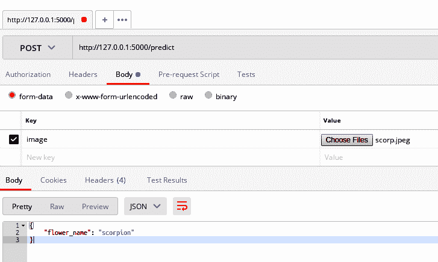

# 在 PyTorch 中生产 AI 模型

在本章中，我们将学习如何将 PyTorch 模型预测用于实际问题。 PyTorch 已从研究工具发展为可用于生产的框架，在本章中，我们将探讨一些使 PyTorch 可用于生产的功能。 部署模型意味着将模型提供给最终用户或系统。 为此，您可能需要满足多个要求，例如能够通过 Web 访问预测，快速进行预测以降低延迟或确保与其他深度学习框架的互操作性，以便开发人员可以使用正确的工具作为目标。 项目在发展。 所有这些确保了从研究到生产的更快过渡。

在本章中，我们将介绍以下秘籍：

*   使用 Flask 部署模型
*   创建一个 TorchScript
*   汇出至 ONNX

# 技术要求

使用 Python 3.6 中的 PyTorch 1.3 已完成了本章的所有秘籍。

# 使用 Flask 部署模型

在本秘籍中，我们将使用 Flask 微框架部署图像分类器。 我们使用 Flask 的原因是因为它是一个易于使用的微框架，可用于构建 RESTful 微服务，它是一个非常流行的框架，并且有据可查。 我们将部署一个使用 Densenet-161 预训练模型构建的图像分类器模型，以完成此秘籍。

# 准备

我们将需要为此秘籍安装 Flask。 使用`pip`管理器安装`flask`：

```py
pip install flask
```

这样，我们就可以开始了。

# 操作步骤

我们将把这个秘籍分成多个文件。 请按照以下步骤操作：

1.  创建一个名为`image_classifier.py`的文件。
2.  现在，我们需要进行导入：

```py
>>import io
>>import torch
>>from torchvision import models
>>from PIL import Image
>>import torchvision.transforms as transforms
>>import json
```

3.  读取包含类名称的`.json`文件：

```py
>>with open('idx_class.json') as f:
    idx_class = json.load(f)
```

4.  定义`create_model`函数：

```py
>>def create_model():

    model_path = "densenet161.pth"
    model = models.densenet161(pretrained=True)
    model.load_state_dict(torch.load(model_path, map_location='cpu'), strict=False)
    model.eval()
    return model
```

5.  定义`image_transformer`函数：

```py
>>def image_transformer(image_data):
    transform = transforms.Compose([
        transforms.Resize(256),
        transforms.CenterCrop(224),
        transforms.ToTensor(),
        transforms.Normalize(mean=[0.485, 0.456, 0.406],
                             std=[0.229, 0.224, 0.225])
    ])

    image = Image.open(io.BytesIO(image_data))
    return transform(image).unsqueeze(0)
```

6.  接下来，我们需要定义`predict_image`函数：

```py
>>def predict_image(model, image_data):

    image_tensor = image_transformer(image_data)
    output = model(image_tensor)
    _, prediction = output.max(1)
    object_index = prediction.item()

    return idx_class[object_index]
```

7.  现在，我们将创建`imageapp.py`。
8.  首先，我们将导入所需的模块和 Flask：

```py
>>from flask import Flask, request, jsonify
>>from image_classifier import create_model, predict_image
```

9.  现在，我们将创建一个 Flask 应用和分类器模型：

```py
>>app = Flask(__name__)
>>model = create_model()
```

0.  现在，让我们创建路线：

```py
>>@app.route('/predict', methods=['POST'])
```

1.  接下来，我们将编写一个将在此路由上调用的函数：

```py
>>@app.route('/predict', methods=['POST'])
>>def predicted():
      if 'image' not in request.files:
          return jsonify({'error': 'Image not found'}), 400

      image = request.files['image'].read()
      object_name = predict_image(model, image)

      return jsonify({'object_name' : object_name})
```

2.  最后，如果运行`imageapp.py`，我们将启动 Flask 应用：

```py
>>if __name__ == '__main__':
    app.run(debug=True)
```

3.  接下来，您需要使用以下命令运行 Flask 应用：

```py
python imageapp.py
```

通过运行此命令，Flask 服务器将启动并运行。 您应该可以通过`http://127.0.0.1:5000/`访问应用的 URL 并发送`POST`请求。

4.  使用邮差工具，您可以检查 API。 这是图像的示例响应：


现在，我们将检查 API 的响应：

```py
{
 "object_name": "scorpion"
 }
```

这将为我们提供以下输出：



在此秘籍中，我们使用 Flask 进行了简单的应用部署。

# 工作原理

在本秘籍中，我们使用 Flask Python 框架部署了使用 RESTful API 进行推理的模型。 我们首先创建`image_classifier.py`并从`idx_class.json`加载类名。

在此文件中，第一个函数加载预先训练的`densenet161`模型，该模型在 ImageNet 数据集中具有 1,000 个类别的模型上进行训练； 我们将模型设置为评估模式，然后返回模型。 第二个函数将给定的输入图像转换为张量并对其进行变换。 我们使用了`PIL`中的`Image`模块来读取图像数据。 第三个功能通过将给定图像转换为张量并将其传递到模型中来进行预测。 这将返回图像中对象的名称。

然后，我们切换到`imageapp.py`文件，在这里我们使用 Flask 创建了 Web 应用。 在这里，我们使用`app = Flask(__name__)`创建了 Flask 应用，并使用`create_model`函数创建了模型。 此后，我们创建了一个名为`/predict`的路由，该路由使用我们创建的应用实例接收了一个`POST`请求。 然后，我们定义了`predicted`函数，该函数将在调用`/predict` URL 时被调用。 `request.files`在 POST 请求中保存文件。 在这里，我们检查了是否使用发布参数名称`image`上传了图像文件。

最后，我们将此图像数据传递到我们先前定义的`predict_image`函数中。 Flask 中的`jsonify`方法可确保响应为`.json`格式。 `app.run(debug=True)`启动 Flask 服务器并处理请求。

# 更多

在本秘籍中，我们使用`debug=True`将调试模式设置为开启，这在生产中不建议使用。 Flask 服务器的功能不足以支持生产负载。 相反，应使用`gunicorn`和`nginx`进行正确的部署。

# 另见

[您可以在以下位置阅读有关 Flask 的更多信息](http://flask.palletsprojects.com/en/1.1.x/)。

[您可以通过以下网址了解有关 gunicorn Nginx 部署的信息](https://www.digitalocean.com/community/tutorials/how-to-serve-flask-applications-with-gunicorn-and-nginx-on-ubuntu-18-04)。

[您可以在以下位置查看替代实现](https://pytorch.org/tutorials/intermediate/flask_rest_api_tutorial.html)。

# 创建一个 TorchScript

TorchScript 为最初用 PyTorch 编写的模型提供中间表示。 这样，您就可以在高性能环境（例如 C++）中运行模型。 TorchScript 通过 PyTorch 代码创建模型的可序列化和优化版本。 使用 TorchScript 编写的代码可以加载到进程中，而无需任何 Python 依赖项。 TorchScript 提供了可用于捕获模型定义的工具，而 PyTorch 具有动态和灵活的特性，因此足以支持此定义。 可以通过两种方式创建 TorchScript：跟踪或使用脚本编译器。 在本秘籍中，我们将使用跟踪和脚本编译器将 PyTorch 模型转换为 TorchScript。

# 操作步骤

在此秘籍中，我们将创建一个 TorchScript。 请按照以下步骤操作：

1.  首先，我们将编写一个简单的网络：

```py
>>import torch
>>import torch.nn as nn
>>class MyCell(torch.nn.Module):
      def __init__(self):
          super(MyCell, self).__init__()
          self.linear = torch.nn.Linear(4, 4)

      def forward(self, x, h):
          new_h = torch.tanh(self.linear(x) + h)
          return new_h
```

2.  接下来，我们将根据模型类创建一个模型：

```py
>>my_cell = MyCell()
```

3.  然后，我们将生成两个随机张量传递给模型：

```py
>>x, h = torch.rand(4, 4), torch.rand(4, 4)
```

4.  接下来，我们可以`jit.trace`：

```py
>>traced_cell = torch.jit.trace(my_cell, (x, h))
>>traced_cell

TracedModule[MyCell](
  original_name=MyCell
  (linear): TracedModule[Linear](original_name=Linear)
)
```

5.  然后，将张量传递给`traced_cell`：

```py
>>traced_cell(x, h)

tensor([[ 0.4238, -0.0524, 0.5719, 0.4747],
        [-0.0059, -0.3625, 0.2658, 0.7130],
        [ 0.4532, 0.6390, 0.6385, 0.6584]],
       grad_fn=<DifferentiableGraphBackward>)
```

6.  我们可以使用以下代码访问图形：

```py
>>traced_cell.graph

graph(%self : ClassType<MyCell>,
      %input : Float(3, 4),
      %h : Float(3, 4)):
  %1 : ClassType<Linear> = prim::GetAttr[name="linear"](%self)
  %weight : Tensor = prim::GetAttr[name="weight"](%1)
  %bias : Tensor = prim::GetAttr[name="bias"](%1)
  %6 : Float(4, 4) = aten::t(%weight), scope: MyCell/Linear[linear] # /home/<user>/.local/lib/python3.6/site-packages/torch/nn/functional.py:1370:0
  %7 : int = prim::Constant[value=1](), scope: MyCell/Linear[linear] # /home/<user>/.local/lib/python3.6/site-packages/torch/nn/functional.py:1370:0
  %8 : int = prim::Constant[value=1](), scope: MyCell/Linear[linear] # /home/<user>/.local/lib/python3.6/site-packages/torch/nn/functional.py:1370:0
  %9 : Float(3, 4) = aten::addmm(%bias, %input, %6, %7, %8), scope: MyCell/Linear[linear] # /home/<user>/.local/lib/python3.6/site-packages/torch/nn/functional.py:1370:0
  %10 : int = prim::Constant[value=1](), scope: MyCell # <ipython-input-2-c6e2cd8665ee>:7:0
  %11 : Float(3, 4) = aten::add(%9, %h, %10), scope: MyCell # <ipython-input-2-c6e2cd8665ee>:7:0
  %12 : Float(3, 4) = aten::tanh(%11), scope: MyCell # <ipython-input-2-c6e2cd8665ee>:7:0
  return (%12)
```

对于可读的版本，我们可以使用以下命令：

```py
>>traced_cell.code

import __torch__
import __torch__.torch.nn.modules.linear
def forward(self,
            input: Tensor,
            h: Tensor) -> Tensor:
    _0 = self.linear
    weight = _0.weight
    bias = _0.bias
    _1 = torch.addmm(bias, input, torch.t(weight), beta=1, alpha=1)
    return torch.tanh(torch.add(_1, h, alpha=1))
```

现在，让我们探索脚本编译器。 按着这些次序：

1.  首先，我们将定义一个具有控制流程的子模块：

```py
>>class MyDecisionGate(torch.nn.Module):
    def forward(self, x):
        if x.sum() > 0:
            return x
        else:
            return -x
```

2.  然后，我们将在模型定义中使用此子模块：

```py
>>class MyCell(torch.nn.Module):
    def __init__(self, dg):
        super(MyCell, self).__init__()
        self.dg = dg
        self.linear = torch.nn.Linear(4, 4)

    def forward(self, x, h):
        new_h = torch.tanh(self.dg(self.linear(x)) + h)
        return new_h
```

3.  根据定义创建模型：

```py
>>my_cell = MyCell(MyDecisionGate())
```

4.  现在，我们将执行跟踪：

```py
>>traced_cell = torch.jit.trace(my_cell, (x, h))
>>traced_cell.code

import __torch__.___torch_mangle_0
import __torch__
import __torch__.torch.nn.modules.linear.___torch_mangle_1
def forward(self,
    input: Tensor,
    h: Tensor) -> Tensor:
  _0 = self.linear
  weight = _0.weight
  bias = _0.bias
  x = torch.addmm(bias, input, torch.t(weight), beta=1, alpha=1)
  _1 = torch.tanh(torch.add(torch.neg(x), h, alpha=1))
  return _1
```

接下来，我们将使用`jit.script`将其转换为 TorchScript：

```py
>>scripted_gate = torch.jit.script(MyDecisionGate())
>>my_cell = MyCell(scripted_gate)
>>traced_cell = torch.jit.script(my_cell)
>>print(traced_cell.code)

import __torch__.___torch_mangle_3
import __torch__.___torch_mangle_2
import __torch__.torch.nn.modules.linear.___torch_mangle_4
def forward(self,
    x: Tensor,
    h: Tensor) -> Tensor:
  _0 = self.linear
  _1 = _0.weight
  _2 = _0.bias
  if torch.eq(torch.dim(x), 2):
    _3 = torch.__isnot__(_2, None)
  else:
    _3 = False
  if _3:
    bias = ops.prim.unchecked_unwrap_optional(_2)
    ret = torch.addmm(bias, x, torch.t(_1), beta=1, alpha=1)
  else:
    output = torch.matmul(x, torch.t(_1))
    if torch.__isnot__(_2, None):
      bias0 = ops.prim.unchecked_unwrap_optional(_2)
      output0 = torch.add_(output, bias0, alpha=1)
    else:
      output0 = output
    ret = output0
  _4 = torch.gt(torch.sum(ret, dtype=None), 0)
  if bool(_4):
    _5 = ret
  else:
    _5 = torch.neg(ret)
  return torch.tanh(torch.add(_5, h, alpha=1))
```

这样，我们研究了创建 TorchScript 的两种不同方法。

# 工作原理

在本秘籍中，我们使用了跟踪方法来创建 TorchScript。 我们定义了一个简单的模块`MyCell`转换为`Torchscript`，并创建了两个采样张量`x`和`h`传递给网络模块的正向方法。 然后，我们使用`jit.trace`跟踪 Python 代码并创建 TorchScript。

我们使用跟踪将`PyTorch`模型转换为 TorchScript，并传递了我们的模型实例。 `jit.trace`通过在模块的前向方法内跟踪模型评估中的操作来创建`torch.jit.ScriptModule`对象。 `jit.trace`运行网络模块，记录运行该模块时发生的操作，并创建`torch.jit.ScriptModule`对象的实例。 TorchScript 以中间表示形式（在深度学习中称为图形）记录其定义。 然后，我们检查了具有`.graph`属性的图形，并使用`.code`生成了更具可读性的版本，这是代码的 Python 语法解释。

然后，我们探索了使用脚本编译器创建 TorchScript 的下一种方法。 为此，我们使用以下代码定义了具有控制流的子模块：

```py
>>class MyDecisionGate(torch.nn.Module):
    def forward(self, x):
        if x.sum() > 0:
            return x
        else:
            return -x
```

我们在`MyCell`模块中使用了以下子模块：

```py
my_cell = MyCell(MyDecisionGate())
```

使用跟踪方法，我们失去了控制流，因为通过跟踪，我们运行了代码，记录了操作，并构造了一个`ScriptModule`对象，该对象擦除了诸如控制流之类的东西。 可以在以下代码中看到：

```py
>>traced_cell = torch.jit.trace(my_cell, (x, h))
>>traced_cell.code
```

因此，我们使用`jit.script`保留了控制流。 首先，我们在子模块对象上运行`jit.script`，如下所示：

```py
>>scripted_gate = torch.jit.script(MyDecisionGate())
```

然后，我们创建`MyCell`对象并使用`jit.script`运行它：

```py
>>my_cell = MyCell(scripted_gate)
>>traced_cell = torch.jit.script(my_cell)
```

当使用`print(traced_cell.code)`打印 TorchScript 代码时，我们看到仍然保留了控制流。

# 更多

我们可以将跟踪和脚本编写方法混合在一起。

# 另见

[您可以在以下网址找到有关混合跟踪和脚本的更多信息](https://pytorch.org/tutorials/beginner/Intro_to_TorchScript_tutorial.html#mixing-scripting-and-tracing)。

# 导出至 ONNX

在本秘籍中，我们将介绍如何将 PyTorch 模型导出到**开放神经网络交换**（**ONNX**），该模型为深度学习和传统机器学习模型提供了一种开源格式。 它定义了一个可扩展的计算图模型，以及内置的运算符和标准数据类型。

ONNX 得到了广泛的支持，可以在许多框架，工具和硬件中找到，因为它可以实现不同框架之间的互操作性，并可以实现从研究到生产的过渡。

# 准备

对于此秘籍，我们需要安装 ONNX，可以使用以下命令进行安装：

```py
pip install onnx
```

这样，我们就可以进行秘籍了。

对于此秘籍，我们还将需要在第 3 章，“用于计算机视觉的卷积神经网络”中在`CIFAR-10`上训练的模型的训练权重。

# 操作步骤

在本秘籍中，我们将 CIFAR-1o 模型导出为 ONNX 格式，并使用`onnxruntime`运行它。 请按照以下步骤操作：

1.  我们将从导入开始：

```py
>>import onnx
>>import onnxruntime
>>import torch.nn as nn
>>import torch
>>import torch.nn.functional as F
>>import numpy as np
```

2.  接下来，我们将定义模型类：

```py
>>class CNN(nn.Module):
    def __init__(self):
        super().__init__()
        self.conv1 = nn.Conv2d(3, 16, 3, padding=1)
        self.conv2 = nn.Conv2d(16, 32, 3, padding=1)
        self.conv3 = nn.Conv2d(32, 64, 3, padding=1)
        self.pool = nn.MaxPool2d(2, 2)
        self.linear1 = nn.Linear(64 * 4 * 4, 512)
        self.linear2 = nn.Linear(512, 10) 
        self.dropout = nn.Dropout(p=0.3)

    def forward(self, x):
        x = self.pool(F.relu(self.conv1(x)))
        x = self.pool(F.relu(self.conv2(x)))
        x = self.pool(F.relu(self.conv3(x)))
        x = x.view(-1, 64 * 4 * 4)
        x = self.dropout(x)
        x = F.relu(self.linear1(x))
        x = self.dropout(x)
        x = self.linear2(x)
        return x
```

3.  然后，我们将创建模型对象并从我们的训练中加载权重：

```py
>>model = CNN()
>>model.load_state_dict(torch.load("cifar10.pth"))
<All keys matched successfully>
```

4.  接下来，我们将模型设置为评估模式：

```py
>>model.eval()

CNN(
  (conv1): Conv2d(3, 16, kernel_size=(3, 3), stride=(1, 1), padding=(1, 1))
  (conv2): Conv2d(16, 32, kernel_size=(3, 3), stride=(1, 1), padding=(1, 1))
  (conv3): Conv2d(32, 64, kernel_size=(3, 3), stride=(1, 1), padding=(1, 1))
  (pool): MaxPool2d(kernel_size=2, stride=2, padding=0, dilation=1, ceil_mode=False)
  (linear1): Linear(in_features=1024, out_features=512, bias=True)
  (linear2): Linear(in_features=512, out_features=10, bias=True)
  (dropout): Dropout(p=0.3, inplace=False)
)
```

5.  现在，我们将创建一个随机变量：

```py
>>x = torch.randn(1, 3, 32, 32, requires_grad=True)
```

6.  接下来，我们将获得随机变量`x`的输出：

```py
>>model_out = model(x)
```

7.  之后，我们将模型及其权重导出到`onnx`模型中：

```py
>torch.onnx.export(model,
                 x,
                 "cifar.onnx",
                 export_params=True,
                 opset_version=10, 
                 do_constant_folding=True, 
                 input_names = ['input'], 
                 output_names = ['output'],
                 dynamic_axes={'input' : {0 : 'batch_size'},
                               'output' : {0 : 'batch_size'}})
```

8.  接下来，我们将加载并检查`onnx`模型：

```py
>>onnx_model = onnx.load("cifar.onnx")
>>onnx.checker.check_model(onnx_model)
```

9.  我们将`onnx`加载到 ONNX 运行时中：

```py
>>ort_session = onnxruntime.InferenceSession("cifar.onnx")
```

0.  现在，定义`to_numpy()`函数：

```py
>>def to_numpy(tensor):
    return tensor.detach().cpu().numpy() if tensor.requires_grad else tensor.cpu().numpy()
```

1.  在这里，我们将把输入变量`x`传递到 ONNX 运行时：

```py
>>ort_inputs = {ort_session.get_inputs()[0].name: to_numpy(x)}
>>ort_outs = ort_session.run(None, ort_inputs)
```

2.  最后，我们将检查模型和`onnx`模型的输出是否相等：

```py
>>np.testing.assert_allclose(to_numpy(model_out), ort_outs[0], rtol=1e-03, atol=1e-05)
```

通过此秘籍，我们已导出为`onnx`格式，并使用 ONNX 运行时以`onnx`格式运行了模型。

# 工作原理

在此秘籍中，我们将正常的 PyTorch 模型导出为 ONNX 格式，并使用 ONNX 运行时运行`onnx`模型。 为此，我们采用了权重模型。 在这里，我们使用了第 3 章“卷积神经网络”的 CIFAR-10 模型，用于计算机视觉*。 我们从训练中使用了模型的权重，并将模型设置为评估模式，以进行快速，轻便的计算。

然后，我们使用了一个随机变量，其形状与输入张量的形状相同，在本例中为三通道`32 x 32`像素图像。 我们将此随机输入传递到模型中并获得输出。 然后，我们使用输出将其与模型的 ONNX 版本中的模型进行比较。

在 PyTorch 中使用跟踪或脚本导出模型。 在本秘籍中，我们在`torch.onnx.export()`的帮助下使用了跟踪。 跟踪跟踪用于获取输出的操作。 这就是为什么我们提供`x`的原因-因此可以进行跟踪。 `x`必须具有正确的类型和大小。 输入尺寸在导出的 ONNX 图形中固定为所有输入尺寸，我们必须指定所有动态轴。 在此秘籍中，我们使用第一维的输入导出模型，将批量大小设置为 1，并在`torch.onnx.export()`的`dynamic_axes`参数中将第一维指定为动态。

第一个参数是 PyTorch 模型，第二个参数是随机变量。 然后，我们有了`onnx`格式的路径； `export_params`用于将训练后的参数权重存储在模型文件中； `opset_version`是`onnx`导出版本； `do_constant_folding`用于执行常量折叠以进行优化； `input_names`是模型的输入名称，`output_names`是模型的输出名称。 然后，我们加载了导出的`onnx`模型，并检查了模型结构并使用`onnx.checker.check_model(onnx_model)`验证了架构。 通过检查模型版本，图形的结构，节点及其输入和输出来验证 ONNX 图形。

然后，我们将模型加载到`onnx`运行时中，并为模型创建一个推理会话。 创建会话后，我们使用`run()` API 评估了模型，其中第一个参数是输出名称的列表，第二个参数是输入字典。 此调用的输出是计算 ONNX 运行时之后模型输出的列表。 最后，我们使用`numpy.testing.assert_allclose()`比较了 PyTorch 模型和`onnx`模型的输出值，如果两个对象不等于期望的公差，则会提高`AssertionError`。

# 更多

我们可以导出`onnx`模型，加载其他受支持的框架，并使用`torch.onnx.export()`中的其他参数配置导出。

# 另见

[您可以在以下位置阅读有关 ONNX 的更多信息](https://pytorch.org/tutorials/advanced/super_resolution_with_onnxruntime.html)。

[您可以在以下位置阅读有关 Python ONNX 运行时的更多信息](https://microsoft.github.io/onnxruntime/python/index.html)。