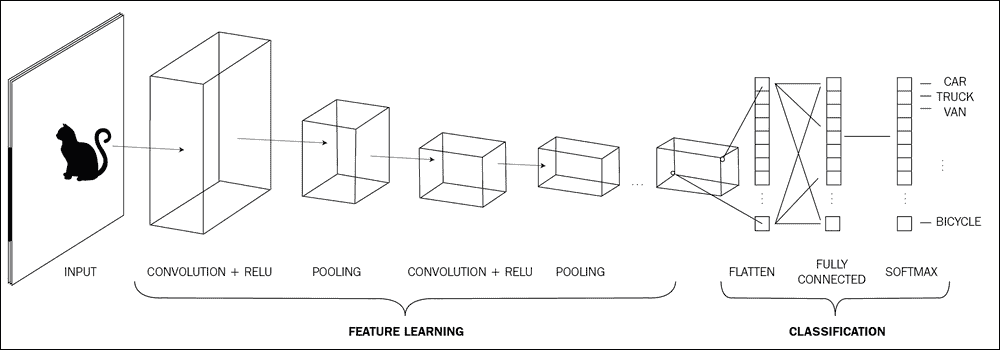
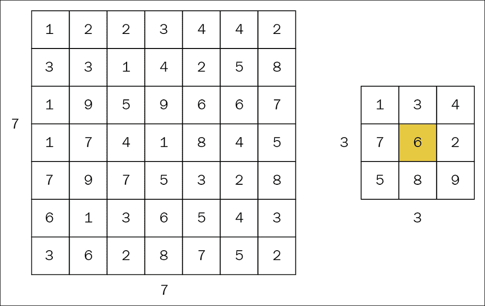
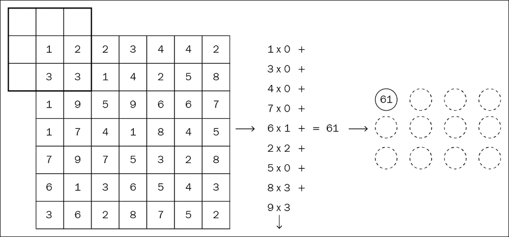
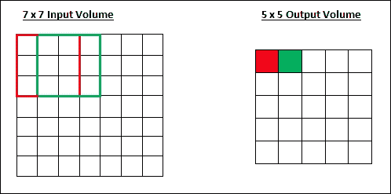
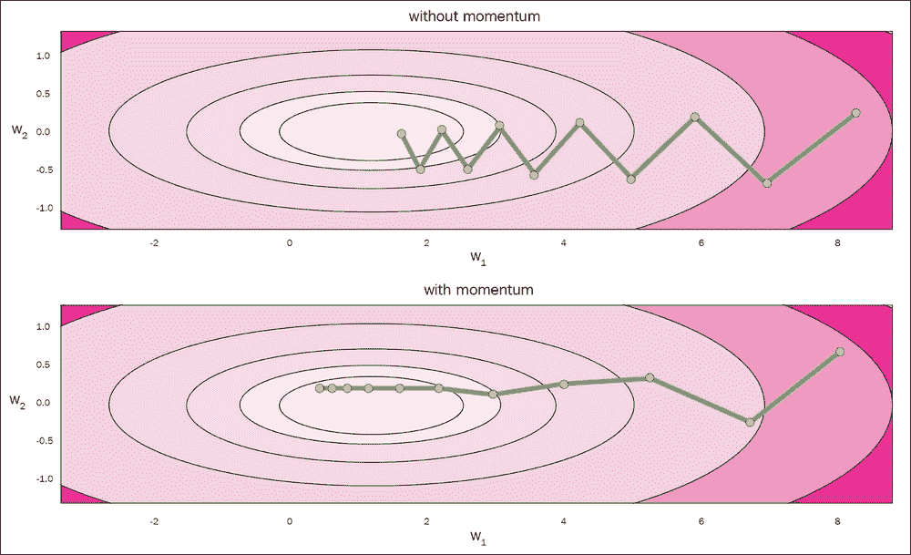
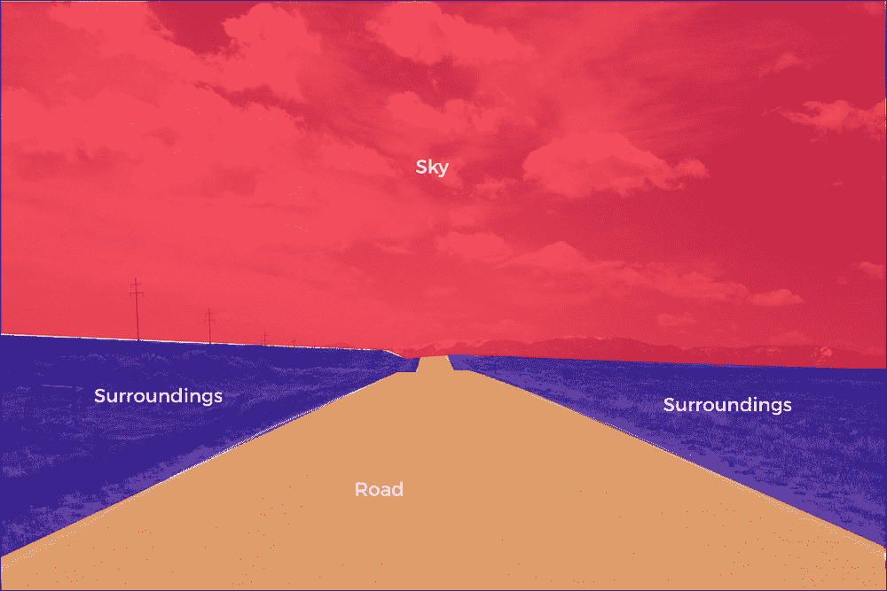
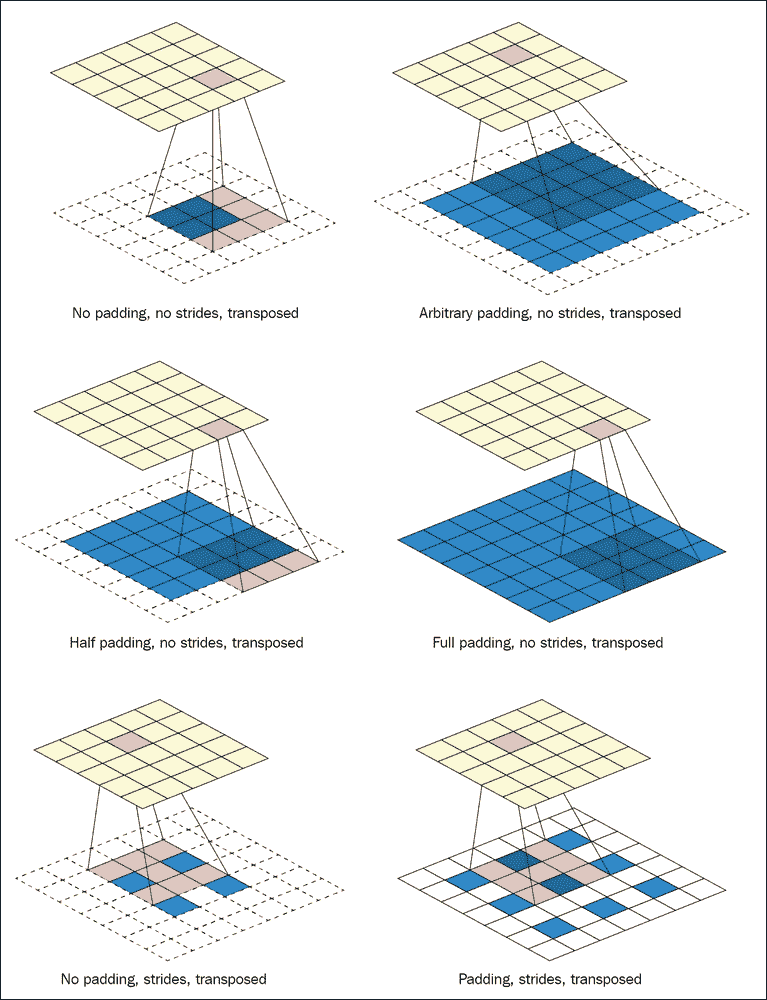
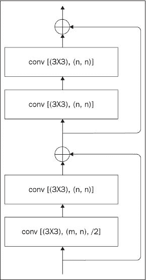

# 第 4 章。计算机视觉

计算机视觉是使计算机具有视觉效果的工程流。 它支持各种图像处理，例如 iPhone，Google Lens 等中的人脸识别。 计算机视觉已经存在了几十年，可能最好在人工智能的帮助下进行探索，这将在本章中进行演示。

几年前，我们在 ImageNet 挑战中达到了计算机视觉的人类准确率。 在过去的十年中，计算机视觉发生了巨大的变化，从以学术为导向的对象检测问题到在实际道路上自动驾驶汽车使用的分割问题。 尽管人们提出了许多不同的网络架构来解决计算机视觉问题，但是**卷积神经网络**（**CNN**）击败了所有这些。

在本章中，我们将讨论基于 PyTorch 构建的基本 CNN，以及它们的变体，它们已经成功地应用于一些为大公司提供支持的最新模型中。

## CNN 简介

CNN 是具有数十年历史的机器学习算法，直到 Geoffrey Hinton 和他的实验室提出 AlexNet 时，才证明其功能强大。 从那时起，CNN 经历了多次迭代。 现在，我们在 CNN 之上构建了一些不同的架构，这些架构为世界各地的所有计算机视觉实现提供了动力。

CNN 是一种基本上由小型网络组成的网络架构，几乎类似于第 2 章，“简单神经网络”中引入的简单前馈网络，但用于解决图像作为输入的问题。 CNN 由神经元组成，这些神经元具有非线性，权重参数，偏差并吐出一个损耗值，基于该值，可以使用反向传播对整个网络进行重新排列。

如果这听起来像简单的全连接网络，那么 CNN 为何特别适合处理图像？ CNN 让开发人员做出适用于图像的某些假设，例如像素值的空间关系。

简单的全连接层具有更大的权重，因为它们存储信息以处理所有权重。 全连接层的另一个功能使其无法进行图像处理：它不能考虑空间信息，因为它在处理时会删除像素值的顺序/排列结构。

CNN 由几个三维内核组成，它们像滑动窗口一样在输入张量中移动，直到覆盖整个张量为止。 核是三维张量，其深度与输入张量的深度（在第一层中为 3；图像的深度在 RGB 通道中）相同。 内核的高度和宽度可以小于或等于输入张量的高度和宽度。 如果内核的高度和宽度与输入张量的高度和宽度相同，则其设置与正常神经网络的设置非常相似。

每次内核通过输入张量移动时，它都可能吐出单个值输出，该输出会经历非线性。 当内核作为滑动窗口移动时，内核从输入图像覆盖的每个插槽都将具有此输出值。 滑动窗口的移动将创建输出特征图（本质上是张量）。 因此，我们可以增加内核数量以获得更多的特征图，并且从理论上讲，每个特征图都能够保存一种特定类型的信息。


图 4.1：不同的层显示不同的信息

来源：《可视化和理解卷积网络》，Matthew D. Zeiler 和 Rob Fergus

由于使用了相同的内核来覆盖整个图像，因此我们正在重用内核参数，从而减少了参数数量。

CNN 实质上会降低`x`和`y`轴（高度和宽度）中图像的尺寸，并增加深度（`z`轴）。`z`轴上的每个切片都是一个如上所述的特征图，由每个多维内核创建。

CNN 中的降级有助于 CNN 的位置不变。 位置不变性可帮助其识别图像不同部分中的对象。 例如，如果您有两只猫的图像，其中一只猫在一张图像的左侧，另一只猫在右侧，那么您希望您的网络从这两幅图像中识别出这只猫，对吗？

CNN 通过两种机制实现位置不变：跨步和合并。 步幅值决定了滑动窗口的运动程度。 池化是 CNN 的固有部分。 我们有三种主要的池化类型：最大池化，最小池化和平均池化。 在最大池化的情况下，池化从输入张量的子块中获取最大值，在最小池化的情况下从池中获取最小值，而在平均池化的情况下，池化将取所有值的平均值。 池化层和卷积内核的输入和输出基本相同。 两者都作为滑动窗口在输入张量上移动并输出单个值。

接下来是 CNN 运作方式的描述。 要更深入地了解 CNN，请查看斯坦福大学的 CS231N。 或者，如果您需要通过动画视频快速介绍 CNN，Udacity [1]提供了很好的资源。



图 4.2：一个 CNN

建立完整的 CNN 网络有四种主要操作类型：

*   卷积层
*   非线性层
*   汇聚层
*   全连接层

## 使用 PyTorch 的计算机视觉

PyTorch 为计算机视觉提供了几个便捷功能，其中包括卷积层和池化层。 PyTorch 在`torch.nn`包下提供`Conv1d`，`Conv2d`和`Conv3d`。 听起来，`Conv1d`处理一维卷积，`Conv2d`处理带有图像之类输入的二维卷积，`Conv3d`处理诸如视频之类的输入上的三维卷积。 显然，这很令人困惑，因为指定的尺寸从未考虑输入的深度。 例如，`Conv2d`处理四维输入，其中第一维将是批量大小，第二维将是图像的深度（在 RGB 通道中），最后两个维将是图像的高度和宽度。 图片。

除了用于计算机视觉的高层功能之外，`torchvision`还具有一些方便的实用程序功能来建立网络。 在本章中，我们将探讨其中的一些。

本章使用两个神经网络应用程序说明 PyTorch：

*   **简单 CNN**：用于对 CIFAR10 图像进行分类的简单神经网络架构
*   **语义分割**：使用来自简单 CNN 的概念进行语义分割的高级示例

### 简单 CNN

我们正在开发 CNN 以执行简单的分类任务。 使用简单 CNN 的想法是为了了解 CNN 的工作原理。 弄清基础知识后，我们将转到高级网络设计，在其中使用高级 PyTorch 函数，该函数与该应用程序具有相同的功能，但效率更高。

我们将使用 CIFAR10 作为输入数据集，它由 10 类 60,000 张`32x32`彩色图像组成，每类 6,000 张图像。 `torchvision`具有更高级别的功能，可下载和处理数据集。 如我们在第 3 章，“深度学习工作流”中看到的示例一样，我们下载数据集，然后使用转换对其进行转换，并将其包装在`get_data()`函数下。

```py
def get_data():
    transform = transforms.Compose(
        [transforms.ToTensor(),
         transforms.Normalize((0.5, 0.5, 0.5), (0.5, 0.5, 0.5))])
    trainset = torchvision.datasets.CIFAR10(
        root='./data', train=True, download=True, transform=transform)
    trainloader = torch.utils.data.DataLoader(
        trainset, batch_size=100, shuffle=True, num_workers=2)

    testset = torchvision.datasets.CIFAR10(
        root='./data', train=False, download=True, transform=transform)
    testloader = torch.utils.data.DataLoader(
        testset, batch_size=100, shuffle=False, num_workers=2)
    return trainloader, testloader
```

函数的第一部分对来自 CIFAR10 数据集的 NumPy 数组进行转换。 首先将其转换为 Torch 张量，然后进行归一化转换。 `ToTensor`不仅将 NumPy 数组转换为 Torch 张量，而且还更改了维度的顺序和值的范围。

PyTorch 的所有更高层 API 都希望通道（张量的深度）成为批量大小之后的第一维。 因此，形状`(高度 x 宽度 x 通道 (RGB))`在`[0, 255]`范围内的输入将转换为形状`(通道 (RGB) x 高度 x 宽度)`在`[0.0, 1.0]`之间的`torch.FloatTensor`。 然后，将每个通道（RGB）的平均值和标准差设置为 0.5，进行标准化。 `torchvision`转换完成的规范化操作与以下 Python 函数相同：

```py
def normalize(image, mean, std):
    for channel in range(3):
        image[channel] = (image[channel] - mean[channel]) / std[channel]
```

`get_data()`返回经过测试的可迭代迭代器和火车装载器。 现在数据已经准备好了，我们需要像建立 *FizBuzz* 网络时那样，设置模型，损失函数和优化器。

##### 型号

`SimpleCNNModel`是从 PyTorch 的`nn.Module`继承的模型类。 这是使用其他自定义类和 PyTorch 类来设置架构的父类。

```py
class SimpleCNNModel(nn.Module):
    """ A basic CNN model implemented with the the basic building blocks """

    def __init__(self):
        super().__init__()
        self.conv1 = Conv(3, 6, 5)
        self.pool = MaxPool(2)
        self.conv2 = Conv(6, 16, 5)
        self.fc1 = nn.Linear(16 * 5 * 5, 120)
        self.fc2 = nn.Linear(120, 84)
        self.fc3 = nn.Linear(84, 10)

    def forward(self, x):
        x = self.pool(F.relu(self.conv1(x)))
        x = self.pool(F.relu(self.conv2(x)))
        x = x.view(-1, 16 * 5 * 5)
        x = F.relu(self.fc1(x))
        x = F.relu(self.fc2(x))
        x = self.fc3(x)
        return x
```

该模型具有由最大池层分隔的两个卷积层。 第二个卷积层连接到三个全连接层，一个接一个，将十个类的分数吐出来。

我们为`SimpleCNNModel`构建了自定义卷积和最大池层。 定制层可能是实现这些层的效率最低的方法，但是它们具有很高的可读性和易于理解性。

```py
class Conv(nn.Module):
    """
    Custom conv layer
    Assumes the image is squre
    """

    def __init__(self, in_channels, out_channels, kernel_size, stride=1, padding=0):
        super().__init__()
        self.kernel_size = kernel_size
        self.stride = stride
        self.padding = padding
        self.weight = Parameter(torch.Tensor(out_channels, in_channels, kernel_size, kernel_size))
        self.bias = Parameter(torch.zeros(out_channels))
```

图像上的卷积运算使用滤波器对输入图像进行乘法和加法运算，并创建单个输出值。 因此，现在我们有了一个输入映像和一个内核。 为简单起见，让我们考虑输入图像为大小为`7x7`的单通道（灰度）图像，并假设内核的大小为`3x3`，如下图所示。 我们将内核的中间值称为锚点，因为我们将锚点保留在图像中的某些值上进行卷积。



图 4.3a



图 4.3b

我们通过将内核锚定在图像的左上像素开始卷积，如图“图 4.3b”所示。 现在，我们将图像中的每个像素值与相应的内核值相乘，然后将所有像素值相加，得到一个值。 但是我们有一个要处理的问题。 内核的顶行和左列将乘以什么？ 为此，我们介绍了填充。

我们在输入张量的外侧添加行和列，其值为零，以便内核中的所有值在输入图像中都有一个对应的值要配对。 我们从乘法中得到的单个值和加法运算是我们对该实例进行的卷积运算的输出。

现在，我们将内核右移一个像素，然后像滑动窗口一样再次执行该操作，并重复此操作，直到覆盖图像为止。 我们可以从每个卷积运算中获得的每个输出一起创建该层的特征图或输出。 下面的代码片段在最后三行中完成了所有这些操作。

PyTorch 支持普通的 Python 索引，我们使用它来为特定迭代查找滑动窗口所在的插槽，并将其保存到名为`val`的变量中。 但是索引创建的张量可能不是连续的内存块。 通过使用`view()`不能更改非连续存储块张量，因此我们使用`contiguous()`方法将张量移动到连续块。 然后，将该张量与内核（权重）相乘，并对其添加偏倚。 然后将卷积运算的结果保存到`out`张量，将其初始化为零作为占位符。 预先创建占位符并向其中添加元素比最后在一组单个通道上进行堆叠要高效一个数量级。

```py
out = torch.zeros(batch_size, new_depth, new_height, new_width)
        padded_input = F.pad(x, (self.padding,) * 4)
        for nf, f in enumerate(self.weight):
            for h in range(new_height):
                for w in range(new_width):
                    val = padded_input[:, :, h:h + self.kernel_size, w:w + self.kernel_size]
                    out[:, nf, h, w] = val.contiguous().view(batch_size, -1) @ f.view(-1)
                    out[:, nf, h, w] += self.bias[nf]
```

PyTorch 中的`functional`模块具有帮助我们进行填充的方法。 `F.pad`接受每一侧的输入张量和填充大小。 在这种情况下，我们需要对图像的所有四个边进行恒定的填充，因此我们创建了一个大小为 4 的元组。 如果您想知道填充的工作原理，下面的示例显示在对大小为`(2, 2, 2, 2)`的大小`(1, 1)`的张量进行`F.pad`后将大小更改为`(5, 5)`。

```py
>>> F.pad(torch.zeros(1,1), (2,) * 4)
Variable containing:
0 0 0 0 0
0 0 0 0 0
0 0 0 0 0
0 0 0 0 0
0 0 0 0 0
[torch.FloatTensor of size (5,5)]

```

如您所知，如果我们使用大小为`1 x 1 x 深度`的内核，则通过对整个图像进行卷积，将获得与输入相同大小的输出。 在 CNN 中，如果我们想减小输出的大小而与内核的大小无关，我们将使用一个不错的技巧通过跨步来对输出的大小进行下采样。 “图 4.4”显示了步幅减小对输出大小的影响。 以下公式可用于计算输出的大小以及内核的大小，填充宽度和步幅。

`W = (WF + 2P) / S + 1`，其中`W`是输入大小，`F`是内核大小，`S`跨步应用`P`填充。



图 4.4：左步幅为 1

我们建立的卷积层没有进行跨步的能力，因为我们使用最大池进行了下采样。 但是在高级示例中，我们将使用 PyTorch 的卷积层，该层在内部处理跨步和填充。

前面的示例使用了一个单通道输入并创建了一个单通道输出。 我们可以将其扩展为使用`n`个输入通道来创建`n`个输出通道，这是卷积网络的基本构建块。 通过进行两次更改，可以推断出相同的概念以处理任意数量的输入通道以创建任意数量的输出通道：

*   由于输入图像具有多个通道，因此用于与相应元素相乘的内核必须为`n`维。 如果输入通道为三个，并且内核大小为五个，则内核形状应为`5 x 5 x 3`。
*   但是，如何创建`n`个输出通道？ 现在我们知道，不管输入通道有多少，一次卷积都会创建一个单值输出，而完整的滑动窗口会话会创建一个二维矩阵作为输出。 因此，如果我们有两个内核做完全相同的事情，那就是：滑动输入并创建二维输出。 然后，我们将获得两个二维输出，并将它们堆叠在一起将为我们提供具有两个通道的输出。 随着输出中需要更多通道，我们增加了内核数量。

我们拥有的自定义卷积层可以完成卷积。 它接受输入和输出通道的数量，内核大小，步幅和填充作为参数。 内核的形状为`[kernel_size, kernel_size, input_channels]`。 我们没有创建`n`个内核并将输出堆叠在一起以获得多通道输出，而是创建了一个大小为`output_channel, input_channel, kernal_size, kernal_size`的单个权重张量，这给出了我们想要的。

在所有池化选项中，人们倾向于使用最大池化。 合并操作采用张量的一个子部分，并获取单个值作为输出。 最大池从概念上讲获取该子部件的突出特征，而平均池则取平均值并平滑该特征。 而且，从历史上看，最大池化比其他池化算法提供更好的结果，可能是因为它从输入中获取最突出的特征并将其传递到下一个级别。 因此，我们也使用最大池。 定制的最大池层具有相同的结构，但是复杂的卷积操作由简单的最大操作代替。

```py
out = torch.zeros(batch_size, depth, new_height, new_width)
for h in range(new_height):
    for w in range(new_width):
        for d in range(depth):
            val = x[:, d, h:h + self.kernel_size, w:w + self.kernel_size]
            out[:, d, h, w] = val.max(2)[0].max(1)[0]
```

PyTorch 的`max()`方法接受尺寸作为输入，并返回具有索引/索引到最大值和实际最大值的元组。

```py
>>> tensor
1 2
3 4
[torch.FloatTensor of size 2x2]
>>> tensor.max(0)[0]
3
4
[torch.FloatTensor of size 2]
>>> tensor.max(0)[1]
1
1
[torch.LongTensor of size 2]

```

例如，前面示例中的`max(0)`返回一个元组。 元组中的第一个元素是张量，其值为 3 和 4，这是第 0 维的最大值；另一个张量，其值为 1 和 1，是该维的 3 和 4 的索引。 最大池层的最后一行通过采用第二维的`max()`和第一维的`max()`来获取子部件的最大值。

卷积层和最大池层之后是三个线性层（全连接），这将维数减小到 10，从而为每个类给出了概率得分。 接下来是 PyTorch 模型存储为实际网络图的字符串表示形式。

```py
>>> simple = SimpleCNNModel()
>>> simple
SimpleCNNModel((conv1): Conv()(pool): MaxPool()(conv2): Conv()
 (fc1): Linear(in_features=400, out_features=120, bias=True)
 (fc2): Linear(in_features=120, out_features=84, bias=True)
 (fc3): Linear(in_features=84, out_features=10, bias=True)
)

```

我们已经按照需要的方式连接了神经网络，以便在看到图像时可以给出班级评分。 现在我们定义损失函数和优化器。

```py
net = SimpleCNNModel()
loss_fn = nn.CrossEntropyLoss()
optimizer = optim.SGD(net.parameters(), lr=0.001, momentum=0.9)
trainloader, testloader = get_data()
```

我们创建神经网络类的实例。 还记得前进功能的工作原理吗？ 网络类将定义`__call__()`函数，并依次调用我们为正向传播定义的`forward()`函数。

在下一行中定义的损失函数也是`torch.nn.Module`的子类，它也具有`forward()`函数，该函数由`__call__()`和向后函数调用。 这使我们可以灵活地创建自定义损失函数。

在以后的章节中，我们将提供示例。 现在，我们将使用一个称为`CrossEntropyLoss()`的内置损失函数。 就像前面几章中的一样，我们将使用 PyTorch 优化程序包来获取预定义的优化程序。 对于此示例，我们将**随机梯度下降**（**SGD**）用于示例，但与上一章不同，我们将使用带有动量的 SGD，这有助于我们向右加速梯度 方向。

##### 注意

动量是当今与优化算法一起使用的一种非常流行的技术。 我们将当前梯度的因数添加到当前梯度本身以获得更大的值，然后将其从权重中减去。 动量在与现实世界动量类似的极小方向上加速损失的运动。



图 4.5：没有动力和有动力的 SGD

现在我们已经准备好训练我们的神经网络。 至此，我们可以使用模板代码进行训练了：

1.  遍历时代。
2.  循环遍历每个时期的数据。
3.  通过调用以下命令使现有的梯度为零：
    *   `optimizer.zero_grad()`
    *   `net.zero_grad()`
4.  运行网络的正向传递。
5.  通过通过网络输出调用损失函数来获取损失。
6.  运行向后传递。
7.  使用优化程序进行梯度更新。
8.  如果需要，可以节省运行损失。

在保存运行损失时要小心，因为 PyTorch 会在变量进行反向传播之前保存整个图形。 增量保存图形只是图形中的另一种操作，其中每次迭代中的图形都使用求和运算将先前的图形附加到图形上，最终导致内存不足。 始终从图形中取出值并将其保存为没有图形历史记录的普通张量。

```py
inputs, labels = data
optimizer.zero_grad()
outputs = net(inputs)
loss = loss_fn(outputs, labels)
loss.backward()
optimizer.step()
running_loss += loss.item()
```

### 语义分割

我们已经了解了 CNN 的工作原理。 现在，我们将进行下一步，并开发 CNN 的高级应用程序，称为语义分段。 顾名思义，该技术将图像的一部分标记为一个类别，例如，将所有树木标记为绿色，将建筑物标记为红色，将汽车标记为灰色，等等。 分割本身意味着从图像中识别结构，区域等。

语义分割是智能的，在我们想要了解图像中的内容而不是仅识别结构或区域时将使用它。 语义分割正在识别和理解像素级图像中的内容。



图 4.6：语义分割示例

语义分割为现实世界中的几个主要应用提供支持，从闭路电视摄像机和自动驾驶汽车到分割不同的对象。 在本章中，我们将实现一种称为 LinkNet [2][7]的最快的语义分割架构。

在本章中，我们将 CamVid 数据集用于我们的 LinkNet 实现。 CamVid 是一个地面真实数据集，由高质量视频组成，这些高质量视频转换为手动分割和标记的帧。 手动标记的输出图像将颜色用作对象的标识。 例如，数据集输出目录中的所有图像都将洋红色用于道路。

#### LinkNet

LinkNet 利用自编码器的思想，该思想曾经是一种数据压缩技术。 自编码器的架构有两个部分：编码器和解码器。 编码器将输入编码到低维空间，而解码器从低维空间解码/重新创建输入。 自编码器被广泛用于减小压缩的尺寸等。


图 4.7：自编码器

LinkNet 由一个初始块，一个最终块，一个带有四个卷积模块的编码器块以及一个带有四个解卷积模块的解码器组成。 初始块使用跨步卷积和最大池化层对输入图像进行两次下采样。 然后，编码器模块中的每个卷积模块都会以大步卷积对输入进行一次下采样。 然后将编码后的输出传递到解码器块，该解码器块会在每个反卷积块中使用步进反卷积对输入进行上采样； 反卷积将在以下部分中说明。

然后，解码器模块的输出通过最终模块，该模块将上采样两次，就像初始模块下采样两次一样。 还有更多：与其他语义分割模型相比，LinkNet 通过使用跳过连接的思想可以减少架构中的参数数量。

在每个卷积块之后，编码器块与解码器块进行通信，这使编码器块在正向传播之后会忘记某些信息。 由于编码器模块的输出不必保留该信息，因此参数的数量可能比其他现有架构的数量少得多。 实际上，该论文的作者使用 ResNet18 作为编码器，并且仍然能够以惊人的性能获得最新的结果。 下面是 LinkNet 的架构：


图 4.8：LinkNet 架构

因此，我们已经看到了某些以前从未见过的东西。 让我们谈谈这些。

##### 反卷积

反卷积可以模糊地描述为卷积运算的逆过程。 Clarifai 的创始人兼首席执行官 Matthew Zeiler 最初在他的 CNN 层可视化论文[3]中使用了去卷积，尽管当时他没有给它起名字。 自从成功以来，反卷积已在几篇论文中使用。

命名操作反卷积很有意义，因为它的作用与卷积相反。 它有许多名称，例如转置卷积（因为之间使用的矩阵已转置）和后向卷积（因为操作是反向传播时卷积的反向传递）。 但是实际上，我们本质上是在进行卷积运算，但是我们更改了像素在输入中的排列方式。

对于具有填充和跨度的反卷积，输入图像将在像素周围具有填充，并且之间将具有零值像素。 在所有情况下，内核滑动窗口的移动将保持不变。

##### 注意

有关反卷积的更多信息，请参见论文《深度学习卷积算法指南》[5]或 GitHub 存储库[6]。



图 4.9：反卷积工作

##### 跳过连接

LinkNet 架构中编码器和解码器之间的平行水平线是跳过连接表示。 跳过连接有助于网络在编码过程中忘记某些信息，并在解码时再次查看。 由于网络解码和生成图像所需的信息量相对较低，因此这减少了网络所需的参数数量。 可以通过不同的操作来实现跳过连接。 使用跳过连接的另一个优点是，梯度梯度流可以容易地流过相同的连接。 LinkNet 将隐藏的编码器输出添加到相应的解码器输入，而另一种语义分割算法 Tiramisu [4]将两者连接在一起，将其发送到下一层。

#### 型号

语义分割模型的编码器是我们在第一个会话中构建的 SimpleCNN 模型的扩展，但具有更多的卷积模块。 我们的主类使用五个次要组件/模块来构建前面描述的架构：

*   `ConvBlock`是自定义的`nn.Module`类，可实现卷积和非线性。
*   `DeconvBlock`是一个自定义`nn.Module`类，可实现解卷积和非线性。
*   `nn.MaxPool2d`是内置的 PyTorch 层，可进行 2D 最大合并。
*   `EncoderBlock`。
*   `DecoderBlock`。

正如在较早的会话中看到的那样，我们通过`forward()`调用主类的`__init__()`中的主类，并像链接一样链接每个主类，但是在这里，我们需要实现一个跳过连接。 我们使用编码器层的输出，并通过将其与正常输入添加到解码器的方式将其传递到解码器层。

##### 转换区块

```py
class ConvBlock(nn.Module):
    """ LinkNet uses initial block with conv -> batchnorm -> relu """

    def __init__(self, inp, out, kernal, stride, pad, bias, act):
        super().__init__()
        if act:
            self.conv_block = nn.Sequential(
                nn.Conv2d(inp, out, kernal, stride, pad, bias=bias),
                nn.BatchNorm2d(num_features=out),
                nn.ReLU())
        else:
            self.conv_block = nn.Sequential(
                nn.Conv2d(inp, out, kernal, stride, pad, bias=bias),
                nn.BatchNorm2d(num_features=out))

    def forward(self, x):
        return self.conv_block(x)
```

LinkNet 中的所有卷积都紧随其后的是批量规范化和 ReLU 层，但是有一些例外，没有 ReLU 层。 这就是`ConvBlock`的目标。 如前所述，`ConvBlock`是`torch.nn.Module`的子类，可以根据正向传递中发生的任何事情进行反向传播。 `__init__`接受输入和输出尺寸，内核大小，步幅值，填充宽度，表示是否需要偏置的布尔值和表示是否需要激活（ReLU）的布尔值。

我们使用`torch.nn.Conv2d`，`torch.nn.BatchNorm2d`和`torch.nn.ReLu`来配置`ConvBlock`。 PyTorch 的`Conv2D`接受`ConvBlock`的`__init__`的所有参数，但表示类似激活要求的布尔值除外。 除此之外，`Conv2D`还接受另外两个用于`dilation`和`group`的可选参数。 `torch.nn`的 ReLU 函数仅接受一个称为`inplace`的可选参数，默认为`False`。 如果`inplace`为`True`，则 ReLU 将应用于原地数据，而不是创建另一个存储位置。 在许多情况下，这可能会稍微节省内存，但会导致问题，因为我们正在破坏输入。 经验法则是：除非您迫切需要内存优化，否则请远离它。

批量规范化用于规范每个批量中的数据，而不是一开始只进行一次。 在开始时，标准化对于获得相等比例的输入至关重要，这反过来又可以提高精度。 但是，随着数据流经网络，非线性和权重和偏差的增加可能导致内部数据规模不同。

标准化每一层被证明是解决此特定问题的一种方法，即使我们提高了学习速度，也可以提高准确率。 批量归一化还可以帮助网络从更稳定的输入分布中学习，从而加快了网络的收敛速度。 PyTorch 对不同尺寸的输入实现了批量归一化，就像卷积层一样。 在这里我们使用`BatchNorm2d`，因为我们有四维数据，其中一维是批量大小，另一维是深度。

`BatchNorm2d`用两个可学习的参数实现：伽玛和贝塔。 除非我们将仿射参数设置为`False`，否则 PyTorch 会在反向传播时处理这些功能的学习。 现在，`BatchNorm2d`接受特征数量，ε 值，动量和仿射作为参数。

ε值将添加到平方根内的分母中以保持数值稳定性，而动量因子决定应从上一层获得多少动量以加快操作速度。

`__init__`检查是否需要激活并创建层。 这是`torch.nn.Sequential`有用的地方。 将三个不同的层（卷积，批量规范化和 ReLU）定义为单个`ConvBlock`层的明显方法是为所有三个层创建 Python 属性，并将第一层的输出传递给第二层，然后将该输出传递给第三层。但是使用`nn.Sequential`，我们可以将它们链接在一起并创建一个 Python 属性。 这样做的缺点是，随着网络的增长，您将为所有小模块提供额外的`Sequential`包装器，这将使解释网络图变得困难。 存储库中的可用代码（带有`nn.Sequential`包装器）将生成类似“图 4.10a”的图形，而没有使用`Sequential`包装器构建的层将生成类似“图 4.10b”的图形。

```py
class ConvBlockWithoutSequential(nn.Module):
    """ LinkNet uses initial block with conv -> batchnorm -> relu """

    def __init__(self, inp, out, kernel, stride, pad, bias, act):
        super().__init__()
        if act:
            self.conv = nn.Conv2d(inp, out, kernel, stride, pad, bias=bias)
            self.bn = nn.BatchNorm2d(num_features=out)
            self.relu = nn.ReLU()
        else:
            self.conv = nn.Conv2d(inp, out, kernel, stride, pad, bias=bias)
            self.bn = nn.BatchNorm2d(num_features=out)

    def forward(self, x):
        conv_r = self.conv(x)
        self.bn_r = self.bn(conv_r)
        if act:
            return self.relu(self.bn_r)
        return self.bn_r
```

##### DeconvBlock

解卷积块是 LinkNet 中解码器的构建块。 就像我们如何制作卷积块一样，解卷积块由三个基本模块组成：转置卷积，`BatchNorm`和 ReLU。 在那种情况下，卷积块和解卷积块之间的唯一区别是将`torch.nn.Conv2d`替换为`torch.nn.ConvTranspose2d`。 正如我们之前所见，转置卷积与卷积执行相同的操作，但给出相反的结果。

```py
class DeconvBlock(nn.Module):
    """ LinkNet uses Deconv block with transposeconv -> batchnorm -> relu """

    def __init__(self, inp, out, kernal, stride, pad):
        super().__init__()
        self.conv_transpose = nn.ConvTranspose2d(inp, out, kernal, stride, pad)
        self.batchnorm = nn.BatchNorm2d(out)
        self.relu = nn.ReLU()

    def forward(self, x, output_size):
        convt_out = self.conv_transpose(x, output_size=output_size)
        batchnormout = self.batchnorm(convt_out)
        return self.relu(batchnormout)
```

`DeconvBlock`的前向调用不使用`torch.nn.Sequential`，并且与`ConvBlock`中对`Conv2d`所做的工作相比，还做了其他工作。 我们将期望的`output_size`传递给转置卷积的前向调用，以使尺寸稳定。 使用`torch.nn.Sequential`将整个反卷积块变成单个变量，可以防止我们将变量传递到转置卷积中。

##### 合并

PyTorch 有几个用于池化操作的选项，我们从其中选择使用`MaxPool`。 正如我们在`SimpleCNN`示例中看到的那样，这是一个显而易见的操作，我们可以通过仅从池中提取突出的特征来减少输入的维数。 `MaxPool2d`接受类似于`Conv2d`的参数来确定内核大小，填充和步幅。 但是除了这些参数之外，`MaxPool2d`接受两个额外的参数，即返回索引和`ciel`。 返回索引返回最大值的索引，可在某些网络架构中进行池化时使用。 `ciel`是布尔参数，它通过确定尺寸的上限或下限来确定输出形状。

##### 编码器块

这将对网络的一部分进行编码，对输入进行下采样，并尝试获得包含输入本质的输入的压缩版本。 编码器的基本构建模块是我们之前开发的`ConvBlock`。



图 4.10：编码器图

如上图所示，LinkNet 中的每个编码器块均由四个卷积块组成。 前两个卷积块被分组为一个块。 然后将其与残差输出（由 ResNet 推动的架构决策）相加。 然后，带有该加法的残差输出将进入第二块，这也与第一块类似。 然后将块 2 的输入添加到块 2 的输出中，而无需通过单独的残差块。

第一个块用因子 2 对输入进行下采样，第二个块对输入的尺寸没有任何作用。 这就是为什么我们需要一个残差网以及第一个模块，而对于第二个模块，我们可以直接添加输入和输出。 实现该架构的代码如下。 `init`功能实际上是在初始化`conv`块和`residue`块。 PyTorch 帮助我们处理张量的加法，因此我们只需要编写我们想做的数学运算，就像您在普通的 Python 变量上执行此操作一样，而 PyTorch 的`autograd`将在上完成 从那里。

```py
class EncoderBlock(nn.Module):
    """ Residucal Block in linknet that does Encoding - layers in ResNet18 """

    def __init__(self, inp, out):
        """
        Resnet18 has first layer without downsampling.
        The parameter ''downsampling'' decides that
        # TODO - mention about how n - f/s + 1 is handling output size in
        # in downsample
        """
        super().__init__()
        self.block1 = nn.Sequential(
            ConvBlock(inp=inp, out=out, kernal=3, stride=2, pad=1, bias=True, act=True),
            ConvBlock(inp=out, out=out, kernal=3, stride=1, pad=1, bias=True, act=True))
        self.block2 = nn.Sequential(
            ConvBlock(inp=out, out=out, kernal=3, stride=1, pad=1, bias=True, act=True),
            ConvBlock(inp=out, out=out, kernal=3, stride=1, pad=1, bias=True, act=True))
        self.residue = ConvBlock(
            inp=inp, out=out, kernal=3, stride=2, pad=1, 
bias=True, act=True)

    def forward(self, x):
        out1 = self.block1(x)
        residue = self.residue(x)
        out2 = self.block2(out1 + residue)
        return out2 + out1
```

###### 解码器块


图 4.11：LinkNet 的解码器图片

解码器是建立在`DeconvBlock`顶部之上的块，并且比`EncoderBlock`简单得多。 它没有与网络一起运行的任何残差，而只是两个卷积块之间通过反卷积块之间的直接链连接。 就像一个编码器块如何以两倍的系数对输入进行下采样一样，`DecoderBlock`以两倍的系数对输入进行上采样。 因此，我们有准确数量的编码器和解码器块来获取相同大小的输出。

```py
class DecoderBlock(nn.Module):
    """ Residucal Block in linknet that does Encoding """

    def __init__(self, inp, out):
        super().__init__()
        self.conv1 = ConvBlock(
            inp=inp, out=inp // 4, kernal=1, stride=1, pad=0, bias=True, act=True)
        self.deconv = DeconvBlock(
            inp=inp // 4, out=inp // 4, kernal=3, stride=2, pad=1)
        self.conv2 = ConvBlock(
            inp=inp // 4, out=out, kernal=1, stride=1, pad=0, bias=True, act=True)

    def forward(self, x, output_size):
        conv1 = self.conv1(x)
        deconv = self.deconv(conv1, output_size=output_size)
        conv2 = self.conv2(deconv)
        return conv2
```

这样，我们的 LinkNet 模型设计就完成了。 我们将所有构造块放在一起以创建 LinkNet 模型，然后在开始训练之前使用`torchvision`预处理输入。 `__init__`将初始化整个网络架构。 它将创建初始块和最大池层，四个编码器块，四个解码器块和两个包装另一个`conv`块的`deconv`块。 四个解码器块对图像进行升采样，以补偿由四个编码器完成的降采样。 编码器块（其中四个）之前的大步卷积和最大池层也对图像进行了下采样两次。 为了弥补这一点，我们有两个`DeconvBlocks`，其中放置在`DeconvBlock`之间的`ConvBlock`完全不影响尺寸。

前向调用只是将所有初始化变量链接在一起，但是需要注意的部分是`DecoderBlock`。 我们必须将预期的输出传递给`DecoderBlock`，然后将其传递给`torch.nn.ConvTranspose2d`。 同样，我们将编码器输出的输出添加到下一步的解码器输入中。 这是我们之前看到的跳过连接。 由于我们将编码器输出直接传递给解码器，因此我们传递了一些重建图像所需的信息。 这就是 LinkNet 即使在不影响速度的情况下也能如此出色运行的根本原因。

```py
class SegmentationModel(nn.Module):
    """
    LinkNet for Semantic segmentation. Inspired heavily by
    https://github.com/meetshah1995/pytorch-semseg
    # TODO -> pad = kernal // 2
    # TODO -> change the var names
    # find size > a = lambda n, f, p, s: (((n + (2 * p)) - f) / s) + 1
    # Cannot have resnet18 architecture because it doesn't do downsampling on first layer
    """

    def __init__(self):
        super().__init__()
        self.init_conv = ConvBlock(
            inp=3, out=64, kernal=7, stride=2, pad=3, bias=True, act=True)
        self.init_maxpool = nn.MaxPool2d(kernel_size=3, stride=2, padding=1)

        self.encoder1 = EncoderBlock(inp=64, out=64)
        self.encoder2 = EncoderBlock(inp=64, out=128)
        self.encoder3 = EncoderBlock(inp=128, out=256)
        self.encoder4 = EncoderBlock(inp=256, out=512)

        self.decoder4 = DecoderBlock(inp=512, out=256)
        self.decoder3 = DecoderBlock(inp=256, out=128)
        self.decoder2 = DecoderBlock(inp=128, out=64)
        self.decoder1 = DecoderBlock(inp=64, out=64)

        self.final_deconv1 = DeconvBlock(inp=64, out=32, kernal=3, stride=2, pad=1)
        self.final_conv = ConvBlock(
            inp=32, out=32, kernal=3, stride=1, pad=1, bias=True, act=True)
        self.final_deconv2 = DeconvBlock(inp=32, out=2, kernal=2, stride=2, pad=0)

    def forward(self, x):
        init_conv = self.init_conv(x)
        init_maxpool = self.init_maxpool(init_conv)
        e1 = self.encoder1(init_maxpool)
        e2 = self.encoder2(e1)
        e3 = self.encoder3(e2)
        e4 = self.encoder4(e3)

        d4 = self.decoder4(e4, e3.size()) + e3
        d3 = self.decoder3(d4, e2.size()) + e2
        d2 = self.decoder2(d3, e1.size()) + e1
        d1 = self.decoder1(d2, init_maxpool.size())

        final_deconv1 = self.final_deconv1(d1, init_conv.size())
        final_conv = self.final_conv(final_deconv1)
        final_deconv2 = self.final_deconv2(final_conv, x.size())

        return final_deconv2
```

### 总结

在过去的十年中，借助人工智能，计算机视觉领域得到了显着改善。 现在，它不仅用于诸如对象检测/识别之类的传统用例，而且还用于提高图像质量，从图像/视频进行丰富的搜索，从图像/视频生成文本，3D 建模等等。

在本章中，我们已经介绍了 CNN，这是迄今为止计算机视觉取得所有成功的关键。 CNN 的许多架构变体已用于不同目的，但是所有这些实现的核心是 CNN 的基本构建块。 关于 CNN 的技术局限性，已经进行了大量研究，尤其是从人类视觉仿真的角度。 已经证明，CNN 不能完全模拟人类视觉系统的工作方式。 这使许多研究小组认为应该有替代方案。 替代 CNN 的一种最流行的方法是使用胶囊网络，这也是杰弗里·欣顿实验室的成果。 但是现在，CNN 正在作为成千上万的实时和关键计算机视觉应用程序的核心。

在下一章中，我们将研究另一种基本的网络架构：循环神经网络。

### 参考

1.  [卷积网络，Udacity](https://www.youtube.com/watch?v=ISHGyvsT0QY)
2.  [LinkNet](https://codeac29.github.io/projects/linknet/)
3.  Matthew D. Zeiler 和 Rob Fergus，[《可视化和理解卷积网络》](https://cs.nyu.edu/~fergus/papers/zeilerECCV2014.pdf)
4.  [《一百层提拉米苏：用于语义分割的完全卷积 DenseNets》](https://arxiv.org/pdf/1611.09326.pdf)
5.  [《深度学习卷积算法指南》](https://arxiv.org/pdf/1603.07285.pdf)
6.  [用于卷积算法的 GitHub 存储库](https://github.com/vdumoulin/conv_arithmetic)
7.  [《LinkNet：利用编码器表示形式进行有效的语义分割》](https://arxiv.org/abs/1707.03718)，Abhishek Chaurasia 和 Eugenio Culurciello，2017 年