# 第 6 章。生成网络

生成网络得到了加州理工学院理工学院本科物理学教授理查德·费曼（Richard Feynman）和诺贝尔奖获得者的名言的支持：“我无法创造，就无法理解”。 生成网络是拥有可以理解世界并在其中存储知识的系统的最有前途的方法之一。 顾名思义，生成网络学习真实数据分布的模式，并尝试生成看起来像来自此真实数据分布的样本的新样本。

生成模型是无监督学习的子类别，因为它们通过尝试生成样本来学习基本模式。 他们通过推送低维潜向量和参数向量来了解生成图像所需的重要特征，从而实现了这一目的。 网络在生成图像时获得的知识本质上是关于系统和环境的知识。 从某种意义上说，我们通过要求网络做某事来欺骗网络，但是网络必须在不了解自己正在学习的情况下学习我们的需求。

生成网络已经在不同的深度学习领域，特别是在计算机视觉领域显示出了可喜的成果。 去模糊或提高图像的分辨率，图像修补以填充缺失的片段，对音频片段进行降噪，从文本生成语音，自动回复消息以及从文本生成图像/视频是一些研究的活跃领域。

在本章中，我们将讨论一些主要的生成网络架构。 更准确地说，我们将看到一个自回归模型和一个**生成对抗网络**（**GAN**）。 首先，我们将了解这两种架构的基本组成部分是什么，以及它们之间的区别。 除此说明外，我们还将介绍一些示例和 PyTorch 代码。

## 定义方法

生成网络现今主要用于艺术应用中。 样式迁移，图像优化，去模糊，分辨率改善以及其他一些示例。 以下是计算机视觉中使用的生成模型的两个示例。


图 6.1：生成模型应用示例，例如超分辨率和图像修复

来源：《具有上下文注意的生成图像修复》，余佳辉等人；《使用生成对抗网络的照片级逼真的单图像超分辨率》，Christian Ledig 等人

GAN 的创建者 Ian Goodfellow 描述了几类生成网络：


图 6.2 生成网络的层次结构

我们将讨论这两个主要类别，它们在过去已经讨论过很多并且仍然是活跃的研究领域：

*   自回归模型
*   GAN

自回归模型是从先前的值推断当前值的模型，正如我们在第 5 章，“序列数据处理”中使用 RNN 所讨论的那样。 **变分自编码器**（**VAE**）是自编码器的一种变体，由编码器和解码器组成，其中编码器将输入编码为低维潜在空间向量， 解码器解码潜向量以生成类似于输入的输出。

整个研究界都同意，GAN 是人工智能世界中的下一个重要事物之一。 GAN 具有生成网络和对抗网络，并且两者相互竞争以生成高质量的输出图像。 GAN 和自回归模型都基于不同的原理工作，但是每种方法都有其自身的优缺点。 在本章中，我们将使用这两种方法开发一个基本示例。

## 自回归模型

自回归模型使用先前步骤中的信息并创建下一个输出。 RNN 为语言建模任务生成文本是自回归模型的典型示例。


图 6.3：用于 RNN 语言建模的自回归模型

自回归模型独立生成第一个输入，或者我们将其提供给网络。 例如，对于 RNN，我们将第一个单词提供给网络，而网络使用我们提供的第一个单词来假设第二个单词是什么。 然后，它使用第一个和第二个单词来预测第三个单词，依此类推。

尽管大多数生成任务都是在图像上完成的，但我们的自回归生成是在音频上。 我们将构建 WaveNet，它是 Google DeepMind 的研究成果，它是当前音频生成的最新实现，尤其是用于文本到语音处理。 通过这一过程，我们将探索什么是用于音频处理的 PyTorch API。 但是在查看 WaveNet 之前，我们需要实现 WaveNet 的基础模块 PixelCNN，它基于自回归**卷积神经网络**（**CNN**）构建。

自回归模型已经被使用和探索了很多，因为每种流行的方法都有其自身的缺点。 自回归模型的主要缺点是它们的速度，因为它们顺序生成输出。 由于正向传播也是顺序的，因此在 PixelRNN 中情况变得更糟。

#### PixelCNN

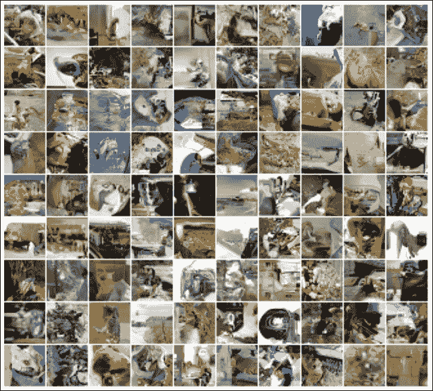

图 6.4：从 PixelCNN 生成的图像

资料来源：《使用 PixelCNN 解码器的条件图像生成》，Aäronvan den Oord 和其他人

PixelCNN 由 DeepMind 引入，并且是 DeepMind 引入的三种自回归模型之一。 在首次引入 PixelCNN 之后，已经进行了多次迭代以提高速度和效率，但是我们将学习基本的 PixelCNN，这是构建 WaveNet 所需要的。

PixelCNN 一次生成一个像素，并使用该像素生成下一个像素，然后使用前两个像素生成下一个像素。 在 PixelCNN 中，有一个概率密度模型，该模型可以学习所有图像的密度分布并从该分布生成图像。 但是在这里，我们试图通过采用所有先前预测的联合概率来限制在所有先前生成的像素上生成的每个像素。

与 PixelRNN 不同，PixelCNN 使用卷积层作为接收场，从而缩短了输入的读取时间。 考虑一下图像被某些东西遮挡了； 假设我们只有一半的图像。 因此，我们有一半的图像，并且我们的算法需要生成后半部分。 在 PixelRNN 中，网络需要像图像中的单词序列一样逐个获取每个像素，并生成一半的图像，而 PixelCNN 则通过卷积层一次获取图像。 但是，无论如何，PixelCNN 的生成都必须是顺序的。 您可能想知道只有一半的图像会进行卷积。 答案是遮罩卷积，我们将在后面解释。

“图 6.5”显示了如何对像素集应用卷积运算以预测中心像素。 与其他模型相比，自回归模型的主要优点是联合概率学习技术易于处理，可以使用梯度下降进行学习。 没有近似值，也没有解决方法。 我们只是尝试在给定所有先前像素值的情况下预测每个像素值，并且训练完全由反向传播支持。 但是，由于生成始终是顺序的，因此我们很难使用自回归模型来实现可伸缩性。 PixelCNN 是一个结构良好的模型，在生成新像素的同时，将各个概率的乘积作为所有先前像素的联合概率。 在 RNN 模型中，这是默认行为，但是 CNN 模型通过使用巧妙设计的遮罩来实现此目的，如前所述。

PixelCNN 捕获参数中像素之间的依存关系分布，这与其他方法不同。 VAE 通过生成隐藏的潜在向量来学习此分布，该向量引入了独立的假设。 在 PixelCNN 中，学习的依赖性不仅在先前的像素之间，而且在不同的通道之间； 在正常的彩色图像中，它是红色，绿色和蓝色（RGB）。

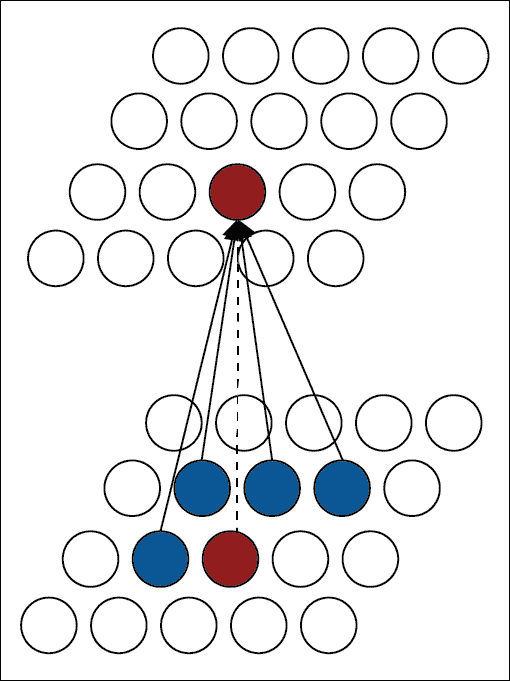

图 6.5：从周围像素预测像素值

有一个基本问题：如果 CNN 尝试使用当前像素或将来的像素来学习当前像素怎么办？ 这也由掩码管理，掩码将**自身**的粒度也提高到了通道级别。 例如，当前像素的红色通道不会从当前像素中学习，但会从先前的像素中学习。 但是绿色通道现在可以使用当前红色通道和所有先前的像素。 同样，蓝色通道可以从当前像素的绿色和红色通道以及所有先前的像素中学习。

整个网络中使用两种类型的掩码，但是后面的层不需要具有这种安全性，尽管它们在进行并行卷积操作时仍需要模拟顺序学习。 因此，PixelCNN 论文[1]引入了两种类型的蒙版：类型 A 和类型 B。

使 PixelCNN 与其他传统 CNN 模型脱颖而出的主要架构差异之一是缺少池化层。 由于 PixelCNN 的目的不是以缩小尺寸的形式捕获图像的本质，并且我们不能承担通过合并丢失上下文的风险，因此作者故意删除了合并层。

```py
fm = 64

net = nn.Sequential(
    MaskedConv2d('A', 1, fm, 7, 1, 3, bias=False),
    nn.BatchNorm2d(fm), nn.ReLU(True),
    MaskedConv2d('B', fm, fm, 7, 1, 3, bias=False),
    nn.BatchNorm2d(fm), nn.ReLU(True),
    MaskedConv2d('B', fm, fm, 7, 1, 3, bias=False),
    nn.BatchNorm2d(fm), nn.ReLU(True),
    MaskedConv2d('B', fm, fm, 7, 1, 3, bias=False),
    nn.BatchNorm2d(fm), nn.ReLU(True),
    MaskedConv2d('B', fm, fm, 7, 1, 3, bias=False),
    nn.BatchNorm2d(fm), nn.ReLU(True),
    MaskedConv2d('B', fm, fm, 7, 1, 3, bias=False),
    nn.BatchNorm2d(fm), nn.ReLU(True),
    MaskedConv2d('B', fm, fm, 7, 1, 3, bias=False),
    nn.BatchNorm2d(fm), nn.ReLU(True),
    MaskedConv2d('B', fm, fm, 7, 1, 3, bias=False),
    nn.BatchNorm2d(fm), nn.ReLU(True),
    nn.Conv2d(fm, 256, 1))
```

前面的代码段是完整的 PixelCNN 模型，该模型包装在顺序单元中。 它由一堆`MaskedConv2d`实例组成，这些实例继承自`torch.nn.Conv2d`，并使用了`torch.nn`中`Conv2d`的所有`*args`和`**kwargs`。 每个卷积单元之后是批量规范层和 ReLU 层，这是与卷积层成功组合的。 作者决定不在普通层上使用线性层，而是决定使用普通的二维卷积，事实证明，该方法比线性层更好。

##### 遮罩卷积

PixelCNN 中使用了遮罩卷积，以防止在训练网络时信息从将来的像素和当前的像素流向生成任务。 这很重要，因为在生成像素时，我们无法访问将来的像素或当前像素。 但是，有一个例外，之前已描述过。 当前绿色通道值的生成可以使用红色通道的预测，而当前蓝色通道的生成可以使用绿色和红色通道的预测。

通过将所有不需要的像素清零来完成屏蔽。 将创建一个与张量相等的掩码张量，其值为 1 和 0，对于所有不必要的像素，其值为 0。 然后，在进行卷积运算之前，此掩码张量与权重张量相乘。

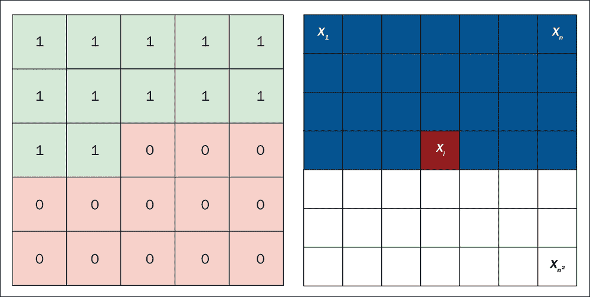

图 6.6：左侧是遮罩，右侧是 PixelCNN 中的上下文

由于 PixelCNN 不使用池化层和反卷积层，因此随着流的进行，通道大小应保持恒定。 遮罩 A 专门负责阻止网络从当前像素学习值，而遮罩 B 将通道大小保持为三（RGB），并通过允许当前像素值取决于本身的值来允许网络具有更大的灵活性。


图 6.7：遮罩 A 和遮罩 B

```py
class MaskedConv2d(nn.Conv2d):
    def __init__(self, mask_type, *args, **kwargs):
        super(MaskedConv2d, self).__init__(*args, **kwargs)
        assert mask_type in ('A', 'B')
        self.register_buffer('mask', self.weight.data.clone())
        _, _, kH, kW = self.weight.size()
        self.mask.fill_(1)
        self.mask[:, :, kH // 2, kW // 2 + (mask_type == 'B'):] = 0
        self.mask[:, :, kH // 2 + 1:] = 0

    def forward(self, x):
        self.weight.data *= self.mask
        return super(MaskedConv2d, self).forward(x)
```

先前的类`MaskedConv2d`从`torch.nn.Conv2d`继承，而不是从`torch.nn.Module`继承。 即使我们从`torch.nn.Module`继承来正常创建自定义模型类，但由于我们试图使`Conv2d`增强带掩码的操作，我们还是从`torch.nn.Conv2D`继承，而`torch.nn.Conv2D`则从`torch.nn.Conv2D`继承 `torch.nn.Module`。 类方法`register_buffer`是 PyTorch 提供的方便的 API 之一，可以将任何张量添加到`state_dict`字典对象，如果尝试将模型保存到磁盘，则该对象随模型一起保存到磁盘。

添加有状态变量（然后可以在`forward`函数中重用）的明显方法是将其添加为对象属性：

```py
self.mask = self.weight.data.clone()
```

但这绝不会成为`state_dict`的一部分，也永远不会保存到磁盘。 使用`register_buffer`，我们可以确保我们创建的新张量将成为`state_dict`的一部分。 然后使用原地`fill_`操作将掩码张量填充为 1s，然后向其添加 0 以得到类似于“图 6.6”的张量，尽管该图仅显示了二维张量， 实际重量张量是三维的。 `forward`函数仅用于通过乘以遮罩张量来遮罩重量张量。 乘法将保留与掩码具有 1 的索引对应的所有值，同时删除与掩码具有 0 的索引对应的所有值。然后，对父级`Conv2d`层的常规调用使用权重张量，并执行二维卷积操作。

网络的最后一层是 softmax 层，该层可预测像素的 256 个可能值中的值，从而离散化网络的输出生成，而先前使用的最先进的自回归模型将在网络的最后一层上继续生成值。

```py
optimizer = optim.Adam(net.parameters())
for epoch in range(25):
    net.train(True)
    for input, _ in tr:
        target = (input[:,0] * 255).long()
        out = net(input)
        loss = F.cross_entropy(out, target)
        optimizer.zero_grad()
        loss.backward()
        optimizer.step()
```

训练使用具有默认动量速率的`Adam`优化器。 另外，损失函数是从 PyTorch 的`Functional`模块创建的。 除了创建`target`变量以外，其他所有操作均与常规训练操作相同。

到目前为止，我们一直在有监督的学习中工作，其中明确给出了标签，但是在这种情况下，目标与输入相同，因为我们试图重新创建相同的输出。 `torchvision`包对像素应用了转换和归一化，并将像素值范围从 0 到 255 转换为 -1 到 1。我们需要转换回 0 到 255 的范围，因为我们在最后一层使用了 softmax，并且会在 0 到 255 之间生成概率分布。

##### 门控 PixelCNN

DeepMind 在 PixelCNN 的一篇迭代论文中成功地使用了门控 PixelCNN ，该方法通过用 Sigmoid 和 tanh 构建的门代替 ReLU 激活函数。 PixelCNN [1]的介绍性论文提供了三种用于解决同一代网络的不同方法，其中具有 RNN 的模型优于其他两种。 DeepMind 仍引入了基于 CNN 的模型来显示与 PixelRNN 相比的速度增益。 但是，随着 PixelCNN 中门控激活的引入，作者能够将表现与 RNN 变体相匹配，从而获得更大的表现增益。 同一篇论文介绍了一种避免盲点并在生成时增加全局和局部条件的机制，这超出了本书的范围，因为对于 WaveNet 模型而言这不是必需的。

### WaveNet

DeepMind 在另一篇针对其自回归生成网络的迭代论文[2]中引入了 WaveNet，其中包括 PixelCNN。 实际上，WaveNet 架构是基于 PixelCNN 的构建的，与 PixelRNN 相比，WaveNet 架构使网络能够以相对更快的方式生成输出。 借助 WaveNet，我们在书中首次探索了针对音频信号的神经网络实现。 我们对音频信号使用一维卷积，这与 PixelCNN 的二维卷积不同，对于初学者而言，这是相当复杂的。

WaveNet 取代了对音频信号使用傅里叶变换的传统方法。 它通过使神经网络找出要执行的转换来做到这一点。 因此，转换可以反向传播，原始音频数据可以使用一些技术来处理，例如膨胀卷积，8 位量化等。 但是人们一直在研究将 WaveNet 方法与传统方法相结合，尽管该方法将损失函数转换为多元回归，而不是 WaveNet 使用的分类。

PyTorch 向后公开了此类传统方法的 API。 以下是对傅立叶变换的结果进行快速傅立叶变换和傅立叶逆变换以获取实际输入的示例。 两种操作都在二维张量上，最后一个维为 2，表示复数的实部和虚部。

PyTorch 提供了用于快速傅里叶变换（`torch.fft`），快速傅里叶逆变换（`torch.ifft`），实数到复杂傅里叶变换（`torch.rfft`），实数到复杂傅里叶变换（`torch.irfft`）的 API。 ），短时傅立叶变换（`torch.stft`）和几个窗口函数，例如 Hann 窗口，Hamming 窗口和 Bartlett 窗口。

```py
>>> x = torch.ones(3,2)
>>> x

 1 1
 1 1
 1 1
[torch.FloatTensor of size (3,2)]

>>> torch.fft(x, 1)

 3 3
 0 0
 0 0
[torch.FloatTensor of size (3,2)]

>>> fft_x = torch.fft(x, 1)
>>> torch.ifft(fft_x, 1)

 1 1
 1 1
 1 1
[torch.FloatTensor of size (3,2)]

```

WaveNet 并不是第一个引入序列数据卷积网络或扩张的卷积网络以加快操作速度的架构。 但是 WaveNet 成功地将两者结合使用，从而产生了可区分的音频。 第一波 WaveNet 的作者发布了另一篇迭代论文，该论文极大地加速了的产生，称为并行 WaveNet。 但是，在本章中，我们将重点关注普通的 WaveNet，这在很大程度上受到了戈尔宾的资料库的启发[3]。

WaveNet 的基本构件是膨胀卷积，它取代了 RNN 的功能来获取上下文信息。

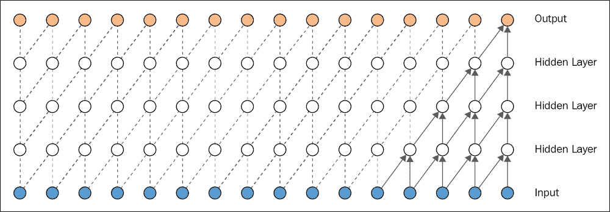

图 6.8：没有卷积卷积的 WaveNet 架构

来源： 《WaveNet：原始音频的生成模型》，Aaron van den Oord 等

“图 6.8”显示了 WaveNet 在进行新值预测时如何提取有关上下文的信息。 输入以蓝色（图片的底部）给出，它是原始音频样本。 例如，一个 16 kHz 的音频样本具有一秒钟音频的 16,000 个数据点，如果与自然语言的序列长度（每个单词将是一个数据点）相比，这是巨大的。 这些长序列是为什么 RNN 对原始音频样本不太有效的一个很好的原因。

LSTM 网络可以记住上下文信息的实际序列长度为 50 到 100。上图具有三个隐藏层，这些隐藏层使用来自上一层的信息。 第一层输入经过一维卷积层以生成第二层的数据。 卷积可以并行完成，这与 RNN 的情况不同，在卷积中，每个数据点都需要先前的输入顺序地传递。 为了使收集更多上下文，我们可以增加层数。 在“图 6.8”中，位于第四层的输出将从输入层中的五个节点获取上下文信息。 因此，每一层将另外一个输入节点添加到上下文中。 也就是说，如果我们有 10 个隐藏层，则最后一层将从 12 个输入节点获取上下文信息。

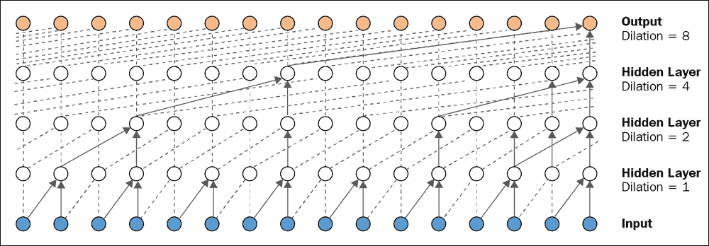

图 6.9：膨胀卷积

来源： 《WaveNet：原始音频的生成模型》，Aaron van den Oord 等

到目前为止，应该很明显，要达到 LSTM 网络的上下文保持能力为 50 到 100 的实际限制，该网络需要 98 层，这在计算上是昂贵的。 这是我们使用膨胀卷积的地方。 使用膨胀卷积，我们将为每个层都有一个膨胀因子，并且以指数方式增加该膨胀因子将以对数形式减少任何特定上下文窗口宽度所需的层数。

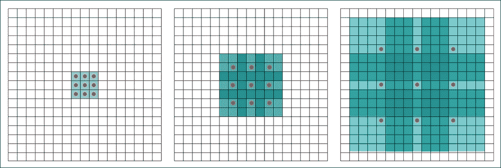

图 6.10：膨胀为 0、2 和 4 的卷积

资料来源：通过扩散卷积进行的多尺度上下文聚合，Fisher Yu 和 Vladlen Koltun

“图 6.9”显示了 WaveNet 中使用的膨胀卷积方案（尽管为了更好地理解膨胀卷积，我们在这里使用的是二维图片； WaveNet 使用一维卷积）。 尽管该实现方案跳过了中参数的日志，但最终节点仍然可以通过这种巧妙设计的方案从上下文中的所有节点获取信息。 在具有扩张卷积和三个隐藏层的情况下，先前的实现覆盖了 16 个输入节点，而先前没有扩张卷积的实现仅覆盖了五个输入节点。

```py
dilatedcausalconv = torch.nn.Conv1d(
									res_channels,
									res_channels,
									kernel_size=2,
									dilation=dilation,
									padding=0,
									bias=False)
```

可以用“图 6.10”中给出的二维图片直观地解释膨胀卷积的实现。 所有这三个示例均使用大小为 3x3 的内核，其中最左边的块显示的是正常卷积或膨胀卷积，其膨胀因子等于零。 中间块具有相同的内核，但膨胀因子为 2，最后一个块的膨胀因子为 4。 扩张卷积的实现技巧是在内核之间添加零以扩展内核的大小，如图“图 6.11”所示：

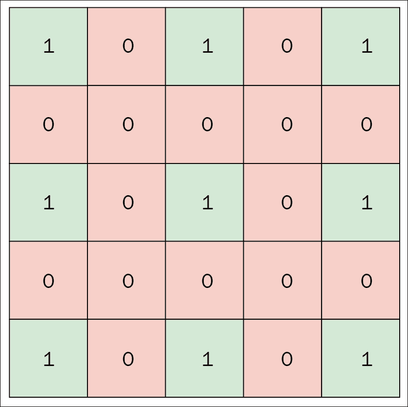

图 6.11：带有内核扩展的膨胀卷积

PyTorch 通过使用户能够将膨胀作为关键字参数传递，从而使进行膨胀卷积变得容易，如先前代码块中的`DilatedCausalConv1d`节点中所给出的。 如前所述，每一层具有不同的扩张因子，并且可以为每一层的扩张卷积节点创建传递该因子。 由于跨步为 1，所以填充保持为 0，目的不是上采样或下采样。 `init_weights_for_test`是通过将权重矩阵填充 1 来进行测试的便捷函数。

PyTorch 提供的灵活性使用户可以在线调整参数，这对于调试网络更加有用。 `forward`传递仅调用 PyTorch `conv1d`对象，该对象是可调用的并保存在`self.conv`变量中：

```py
causalconv = torch.nn.Conv1d(
							in_channels,
							res_channels,
							kernel_size=2,
							padding=1,
							bias=False)
```

WaveNet 的完整架构建立在膨胀卷积网络和卷积后门控激活的基础之上。 WaveNet 中的数据流从因果卷积运算开始，这是一种正常的一维卷积，然后传递到膨胀的卷积节点。 WaveNet 图片中的每个白色圆圈（“图 6.9”）是一个扩展的卷积节点。 然后，将正常卷积的数据点传递到膨胀的卷积节点，然后将其独立地通过 Sigmoid 门和 tanh 激活。 然后，两个运算的输出通过逐点乘法运算符和`1x1`卷积进行。 WaveNet 使用剩余连接和跳跃连接来平滑数据流。 与主流程并行运行的剩余线程通过加法运算与`1x1`卷积的输出合并。

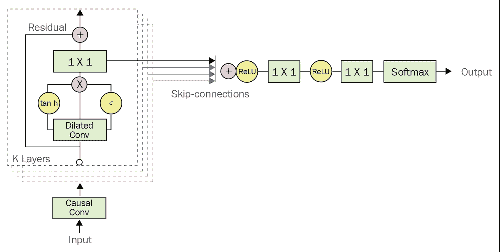

图 6.12：WaveNet 架构

来源： 《WaveNet：原始音频的生成模型》，Aaron van den Oord 等

“图 6.12”中提供的 WaveNet 的结构图显示了所有这些小组件以及它们如何连接在一起。 跳跃连接之后的部分在程序中称为密集层，尽管它不是上一章介绍的密集层。 通常，密集层表示全连接层，以将非线性引入网络并获得所有数据的概览。 但是 WaveNet 的作者发现，正常的致密层可以由一串 ReLU 代替，并且`1x1`卷积可以通过最后的 softmax 层实现更高的精度，该层可以展开为 256 个单位（巨大扇出的 8 位`µ`律量化） 音频）。

```py
class WaveNetModule(torch.nn.Module):
    def __init__(self, layer_size, stack_size,
                        in_channels, res_channels):
        super().__init__()
        self.causal = CausalConv1d(in_channels, res_channels)
        self.res_stack = ResidualStack(layer_size,
                                        stack_size,
                                        res_channels,
                                        in_channels)
        self.convdensnet = ConvDensNet(in_channels)

    def forward(self, x):
        output = self.causal(output)
        skip_connections = self.res_stack(output, output_size)
        output = torch.sum(skip_connections, dim=0)
        output = self.convdensnet(output)
        return output.contiguous()
```

前面的代码块中给出的程序是主要的父 WaveNet 模块，该模块使用所有子组件来创建图形。 `init`定义了三个主要成分，其中是第一个普通卷积，然后是`res_stack`（它是由所有膨胀卷积和 Sigmoid 正切门组成的残差连接块）。 然后，最后的`convdensnet`在`1x1`卷积的顶部进行。 `forward`引入一个求和节点，依次执行这些模块。 然后，将`convdensnet`创建的输出通过`contiguous()`移动到存储器的单个块。 这是其余网络所必需的。

`ResidualStack`是需要更多说明的模块，它是 WaveNet 架构的核心。 `ResidualStack`是`ResidualBlock`的层的堆栈。 WaveNet 图片中的每个小圆圈都是一个残差块。 在正常卷积之后，数据到达`ResidualBlock`，如前所述。 `ResidualBlock`从膨胀的卷积开始，并且期望得到膨胀。 因此，`ResidualBlock`决定了架构中每个小圆节点的膨胀因子。 如前所述，膨胀卷积的输出然后通过类似于我们在 PixelCNN 中看到的门的门。

在那之后，它必须经历两个单独的卷积以进行跳跃连接和残差连接。 尽管作者并未将其解释为两个单独的卷积，但使用两个单独的卷积更容易理解。

```py
class ResidualBlock(torch.nn.Module):
    def __init__(self, res_channels, skip_channels, dilation=1):
super().__init__()
        self.dilatedcausalconv = torch.nn.Conv1d(
           res_channels, res_channels, kernel_size=2,
dilation=dilation,
           padding=0, bias=False)
self.conv_res = torch.nn.Conv1d(res_channels, res_channels, 1)
self.conv_skip = torch.nn.Conv1d(res_channels, skip_channels, 1)
self.gate_tanh = torch.nn.Tanh()
self.gate_sigmoid = torch.nn.Sigmoid()
def forward(self, x, skip_size):
    x = self.dilatedcausalconv(x)
    # PixelCNN Gate
    # ---------------------------
    gated_tanh = self.gate_tanh(x)
    gated_sigmoid = self.gate_sigmoid(x)
    gated = gated_tanh * gated_sigmoid
    # ---------------------------
    x = self.conv_res(gated)
    x += x[:, :, -x.size(2):]
    skip = self.conv_skip(gated)[:, :, -skip_size:]
    return x, skip
```

`ResidualStack`使用层数和堆栈数来创建膨胀因子。 通常，每个层具有`2 ^ l`作为膨胀因子，其中`l`是层数。 从`1`到`2 ^ l`开始，每个堆栈都具有相同数量的层和相同样式的膨胀因子列表。

方法`stack_res_block`使用我们前面介绍的`ResidualBlock`为每个堆栈和每个层中的每个节点创建一个残差块。 该程序引入了一个新的 PyTorch API，称为`torch.nn.DataParallel`。 如果有多个 GPU，则`DataParallel` API 会引入​​并行性。 将模型制作为数据并行模型可以使 PyTorch 知道用户可以使用更多 GPU，并且 PyTorch 从那里获取了它，而没有给用户带来任何障碍。 PyTorch 将数据划分为尽可能多的 GPU，并在每个 GPU 中并行执行模型。

它还负责从每个 GPU 收集回结果，并将其合并在一起，然后再继续进行。

```py
class ResidualStack(torch.nn.Module):
 def __init__(self, layer_size, stack_size, res_channels,
skip_channels):
   super().__init__()
   self.res_blocks = torch.nn.ModuleList()
   for s in range(stack_size):
      for l in range(layer_size):
         dilation = 2 ** l
		 block = ResidualBlock(res_channels, skip_channels,
				 dilation)
         self.res_blocks.append(block)
  def forward(self, x, skip_size):
      skip_connections = []
      for res_block in self.res_blocks:
          x, skip = res_block(x, skip_size)
          skip_connections.append(skip)
return torch.stack(skip_connections)
```

## GAN

在许多深度学习研究人员看来，GAN 是过去十年的主要发明之一。 它们在本质上不同于其他生成网络，尤其是在训练方式上。 Ian Goodfellow 撰写的第一篇有关对抗网络生成数据的论文于 2014 年发表。 GAN 被认为是一种无监督学习算法，其中有监督学习算法学习使用标记数据`y`来推理函数`y' = f(x)`。

这种监督学习算法本质上是判别式的，这意味着它学会对条件概率分布函数进行建模，在此条件函数中，它说明了某事物的概率被赋予了另一事物的状态。 例如，如果购买房屋的价格为 100,000 美元，那么房屋位置的概率是多少？ GAN 从随机分布生成输出，因此随机输入的变化使输出不同。

GAN 从随机分布中获取样本，然后由网络将其转换为输出。 GAN 在学习输入分布的模式时不受监督，并且与其他生成网络不同，GAN 不会尝试明确地学习密度分布。 相反，他们使用博弈论方法来找到两个参与者之间的纳什均衡。 GAN 实现将始终拥有一个生成网络和一个对抗网络，这被视为两个试图击败的参与者。 GAN 的核心思想在于从统一或高斯等数据分布中采样，然后让网络将采样转换为真正的数据分布样。 我们将实现一个简单的 GAN，以了解 GAN 的工作原理，然后转向名为 CycleGAN 的高级 GAN 实现。

### 简单的 GAN

了解 GAN 的直观方法是从博弈论的角度了解它。 简而言之，GAN 由两个参与者组成，一个生成器和一个判别器，每一个都试图击败对方。 发生器从分布中获取一些随机噪声，并尝试从中生成一些输出分布。 生成器总是尝试创建与真实分布没有区别的分布； 也就是说，伪造的输出应该看起来像是真实的图像。

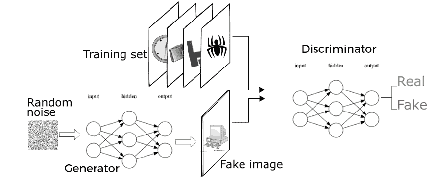

Figure 6.13: GAN architecture

但是，如果没有明确的训练或标签，生成器将无法确定真实图像的外观，并且其唯一的来源就是随机浮点数的张量。 然后，GAN 将第二个玩家介绍给游戏，这是一个判别器。 判别器仅负责通知生成器生成的输出看起来不像真实图像，以便生成器更改其生成图像的方式以使判别器确信它是真实图像。 但是判别器总是可以告诉生成器图像不是真实的，因为判别器知道图像是从生成器生成的。 这就是事情变得有趣的地方。 GAN 将真实，真实的图像引入游戏中，并将判别器与生成器隔离。 现在，判别器从一组真实图像中获取一个图像，并从生成器中获取一个伪图像，并且判别器必须找出每个图像的来源。 最初，判别器什么都不知道，只能预测随机结果。

```py
class DiscriminatorNet(torch.nn.Module):
    """
    A three hidden-layer discriminative neural network
    """
    def __init__(self):
        super().__init__()
        n_features = 784
        n_out = 1

        self.hidden0 = nn.Sequential(
            nn.Linear(n_features, 1024),
            nn.LeakyReLU(0.2),
            nn.Dropout(0.3)
        )
        self.hidden1 = nn.Sequential(
            nn.Linear(1024, 512),
            nn.LeakyReLU(0.2),
            nn.Dropout(0.3)
        )
        self.hidden2 = nn.Sequential(
            nn.Linear(512, 256),
            nn.LeakyReLU(0.2),
            nn.Dropout(0.3)
        )
        self.out = nn.Sequential(
            torch.nn.Linear(256, n_out),
            torch.nn.Sigmoid()
        )

    def forward(self, x):
        x = self.hidden0(x)
        x = self.hidden1(x)
        x = self.hidden2(x)
        x = self.out(x)
        return x
```

但是，可以将辨别器的任务修改为分类任务。 判别器可以将输入图像分类为**原始**或**生成的**，这是二分类。 同样，我们训练判别器网络正确地对图像进行分类，最终，通过反向传播，判别器学会了区分真实图像和生成的图像。

该会话中使用的示例将生成类似 MNIST 的输出。 前面的代码显示了 MNIST 上的鉴别播放器，该播放器总是从真实源数据集或生成器中获取图像。 GAN 众所周知非常不稳定，因此使用`LeakyReLU`是研究人员发现比常规`ReLU`更好工作的黑客之一。 现在，`LeakyReLU`通过它泄漏了负极，而不是将所有内容限制为零到零。 与正常的`ReLU`相比，这有助于使梯度更好地流过网络，对于小于零的值，梯度为零。

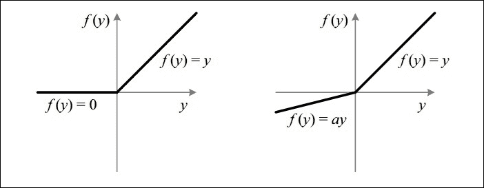

图 6.14：ReLU 和泄漏的 ReLU

我们开发的的简单区分器具有三个连续层。 每个层都有一个线性层，泄漏的 ReLU 和一个夹在中间的漏失层，然后是一个线性层和一个 Sigmoid 门。 通常，概率预测网络使用 softmax 层作为最后一层； 像这样的简单 GAN 最适合 Sigmoid 曲面。

```py
def train_discriminator(optimizer, real_data, fake_data):
    optimizer.zero_grad()

    # 1.1 Train on Real Data
    prediction_real = discriminator(real_data)
    # Calculate error and backpropagate
    error_real = loss(prediction_real,real_data_target(real_data.size(0)))
    error_real.backward()

    # 1.2 Train on Fake Data
    prediction_fake = discriminator(fake_data)
    # Calculate error and backpropagate
    error_fake = loss(prediction_fake,fake_data_target(real_data.size(0)))
    error_fake.backward()

    # 1.3 Update weights with gradients
    optimizer.step()

    # Return error
    return error_real + error_fake, prediction_real, prediction_fake
```

在前面的代码块中定义的函数`train_generator`接受`optimizer`对象，伪数据和实数据，然后将它们传递给判别器。 函数`fake_data_target`（在下面的代码块中提供）创建一个零张量，该张量的大小与预测大小相同，其中预测是从判别器返回的值。 判别器的训练策略是使任何真实数据被归类为真实分布的概率最大化，并使任何数据点被归类为真实分布的概率最小化。 在实践中，使用了来自判别器或生成器的结果的日志，因为这会严重损害网络的分类错误。 然后在应用`optimizer.step`函数之前将错误反向传播，该函数将通过学习速率以梯度更新权重。

接下来给出用于获得真实数据目标和伪数据目标的函数，这与前面讨论的最小化或最大化概率的概念基本一致。 实际数据生成器返回一个张量为 1s 的张量，该张量是我们作为输入传递的形状。 在训练生成器时，我们正在尝试通过生成图像来最大程度地提高其概率，该图像看起来应该是从真实数据分布中获取的。 这意味着判别器应将 1 预测为图像来自真实分布的置信度分数。

```py
def real_data_target(size):
    '''
    Tensor containing ones, with shape = size
    '''
    return torch.ones(size, 1).to(device)

def fake_data_target(size):
    '''
    Tensor containing zeros, with shape = size
    '''
    return torch.zeros(size, 1).to(device)
```

因此，判别器的实现很容易实现，因为它本质上只是分类任务。 生成器网络将涉及所有卷积上采样/下采样，因此有点复杂。 但是对于当前示例，由于我们希望它尽可能简单，因此我们将在全连接网络而不是卷积网络上进行工作。

```py
def noise(size):
    n = torch.randn(size, 100)
    return n.to(device)
```

可以定义一个噪声生成函数，该函数可以生成随机样本（事实证明，这种采样在高斯分布而非随机分布下是有效的，但为简单起见，此处使用随机分布）。 如果 CUDA 可用，我们会将随机产生的噪声从 CPU 内存传输到 GPU 内存，并返回张量，其输出大小为`100`。 因此，生成网络期望输入噪声的特征数量为 100，而我们知道 MNIST 数据集中有 784 个数据点（`28x28`）。

对于生成器，我们具有与判别器类似的结构，但是在最后一层具有 tanh 层，而不是 Sigmoid。 进行此更改是为了与我们对 MNIST 数据进行的归一化同步，以将其转换为 -1 到 1 的范围，以便判别器始终获得具有相同范围内数据点的数据集。 生成器中的三层中的每一层都将输入噪声上采样到 784 的输出大小，就像我们在判别器中下采样以进行分类一样。

```py
class GeneratorNet(torch.nn.Module):
    """
    A three hidden-layer generative neural network
    """
    def __init__(self):
        super().__init__()
        n_features = 100
        n_out = 784

        self.hidden0 = nn.Sequential(
            nn.Linear(n_features, 256),
            nn.LeakyReLU(0.2)
        )
        self.hidden1 = nn.Sequential(
            nn.Linear(256, 512),
            nn.LeakyReLU(0.2)
        )
        self.hidden2 = nn.Sequential(
            nn.Linear(512, 1024),
            nn.LeakyReLU(0.2)
        )

        self.out = nn.Sequential(
            nn.Linear(1024, n_out),
            nn.Tanh()
        )

    def forward(self, x):
        x = self.hidden0(x)
        x = self.hidden1(x)
        x = self.hidden2(x)
        x = self.out(x)
        return x
```

生成器训练器函数比判别器训练器函数简单得多，因为它不需要从两个来源获取输入，也不必针对不同的目的进行训练，而判别器则必须最大化将真实图像分类为真实图像的可能性。 图像，并最小化将噪声图像分类为真实图像的可能性。 此函数仅接受伪图像数据和优化器，其中伪图像是生成器生成的图像。 生成器训练器函数代码可以在 GitHub 存储库中找到。

我们分别创建判别器和生成器网络的实例。 到目前为止，我们所有的网络实现都具有单个模型或单个神经网络，但第一次，我们有两个单独的网络在同一个数据集上工作，并具有不同的优化目标。 对于两个单独的网络，我们还需要创建两个单独的优化器。 从历史上看，`Adam`优化器最适合学习速度非常慢的 GAN。

两个网络都使用判别器的输出进行训练。 唯一的区别是，在训练判别器时，我们尝试使伪造图像被分类为真实图像的可能性最小，而在训练生成器时，我们试图使伪造图像被分类为真实图像的可能性最大。 由于它始终是试图预测 0 和 1 的二分类器，因此我们使用`torch.nn`中的`BCELoss`来尝试预测 0 或 1：

```py
discriminator = DiscriminatorNet().to(device)
generator = GeneratorNet().to(device)
d_optimizer = optim.Adam(discriminator.parameters(), lr=0.0002)
g_optimizer = optim.Adam(generator.parameters(), lr=0.0002)
loss = nn.BCELoss()
```

接下来是简单 GAN 在不同时期生成的输出，该图显示了网络如何学会将输入随机分布映射到输出真实分布。


图 6.15：100 个周期后的输出


图 6.16：200 个周期后的输出


图 6.17：300 个周期后的输出

### CycleGAN

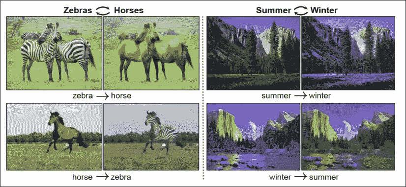

图 6.18：实践中的 CycleGAN

资料来源：《使用周期一致的对抗性网络的不成对图像翻译》，朱俊彦等

CycleGAN 是 GAN 类型的智能变体之一。 在同一架构中，两个 GAN 之间巧妙设计的循环流可教导两个不同分布之间的映射。 先前的方法需要来自不同分布的成对图像，以便网络学习映射。 对于示例，如果目标是建立一个可以将黑白图像转换为彩色图像的网络，则数据集在训练集中需要将同一图像的黑白和彩色版本作为一对。 尽管很难，但在一定程度上这是可能的。 但是，如果要使冬天拍摄的图像看起来像夏天拍摄的图像，则训练集中的这对图像必须是在冬天和夏天拍摄的具有相同对象和相同帧的完全相同的图像。 这是完全不可能的，而那正是 CycleGAN 可以提供帮助的地方。

CycleGAN 学习每种分布的模式，并尝试将图像从一种分布映射到另一种分布。 “图 6.19”中给出了 CycleGAN 的简单架构图。 上面的图显示了如何训练一个 GAN，下面的图显示了如何使用正在工作的 CycleGAN 典型示例：马和斑马来训练另一个。

在 CycleGAN 中，我们不是从分布中随机采样的数据开始，而是使用来自集合 A（在本例中为一组马）的真实图像。 委托生成器 A 到 B（我们称为 A2B）将同一匹马转换为斑马，但没有将成对的马匹转换为斑马的配对图像。 训练开始时，A2B 会生成无意义的图像。 判别器 B 从 A2B 生成的图像或从集合 B（斑马的集合）中获取真实图像。 与其他任何判别器一样，它负责预测图像是生成的还是真实的。 这个过程是正常的 GAN，它永远不能保证同一匹马转换为斑马。 而是将马的图像转换为斑马的任何图像，因为损失只是为了确保图像看起来像集合 B 的分布； 它不需要与集合 A 相关。为了强加这种相关性，CycleGAN 引入了循环。

然后，从 A2B 生成的图像会通过另一个生成器 B2A，以获得`Cyclic_A`。 施加到`Cyclic_A`的损失是 CycleGAN 的关键部分。 在这里，我们尝试减小`Cyclic_A`和`Input_A`之间的距离。 第二个损失背后的想法是，第二个生成器必须能够生成马，因为我们开始时的分布是马。 如果 A2B 知道如何将马匹映射到斑马而不改变图片中的任何其他内容，并且如果 B2A 知道如何将斑马线映射到匹马而不改变图片中的其他任何东西，那么我们对损失所做的假设应该是正确的。

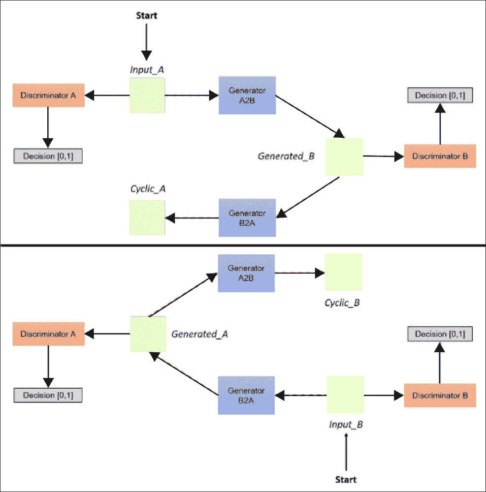

图 6.19：CycleGAN 架构

当判别器 A 获得马的真实图像时，判别器 B 从 A2B 获得斑马的生成图像，当判别器 B 获得斑马的真实图像时，判别器 A 从 B2A 获得马的生成图像。 要注意的一点是，判别器 A 总是能够预测图像是否来自马具，而判别器 B 总是能够预测图像是否来自斑马具。 同样，A2B 始终负责将马集合映射到斑马分布，而 B2A 始终负责将斑马集合映射到马分布。

生成器和判别器的这种周期性训练可确保网络学会使用模式变化来映射图像，但图像的所有其他特征均保持不变。

```py
Generator(
  (model): Sequential(
    (0): ReflectionPad2d((3, 3, 3, 3))
    (1): Conv2d(3, 64, kernel_size=(7, 7), stride=(1, 1))
    (2): InstanceNorm2d(64, eps=1e-05, momentum=0.1, affine=False,track_running_stats=False)
    (3): ReLU(inplace)
    (4): Conv2d(64, 128, kernel_size=(3, 3), stride=(2, 2),padding=(1, 1))
    (5): InstanceNorm2d(128, eps=1e-05, momentum=0.1,affine=False, track_running_stats=False)
    (6): ReLU(inplace)
    (7): Conv2d(128, 256, kernel_size=(3, 3), stride=(2, 2),padding=(1, 1))
    (8): InstanceNorm2d(256, eps=1e-05, momentum=0.1,affine=False, track_running_stats=False)
    (9): ReLU(inplace)
    (10): ResidualBlock()
    (11): ResidualBlock()
    (12): ResidualBlock()
    (13): ResidualBlock()
    (14): ResidualBlock()
    (15): ResidualBlock()
    (16): ResidualBlock()
    (17): ResidualBlock()
    (18): ResidualBlock()
    (19): ConvTranspose2d(256, 128, kernel_size=(3, 3), stride=(2,2), padding=(1, 1), output_padding=(1, 1))
    (20): InstanceNorm2d(128, eps=1e-05, momentum=0.1,affine=False, track_running_stats=False)
    (21): ReLU(inplace)
    (22): ConvTranspose2d(128, 64, kernel_size=(3, 3), stride=(2,2), padding=(1, 1), output_padding=(1, 1))
    (23): InstanceNorm2d(64, eps=1e-05, momentum=0.1,affine=False, track_running_stats=False)
    (24): ReLU(inplace)
    (25): ReflectionPad2d((3, 3, 3, 3))
    (26): Conv2d(64, 3, kernel_size=(7, 7), stride=(1, 1))
    (27): Tanh()
  )
)
```

PyTorch 为用户提供了进入网络并进行操作的完全灵活性。 其中一部分是将模型打印到终端上，以显示其中包含所有模块的地形排序图。

之前我们在 CycleGAN 中看到了生成器的图形。 与我们探讨的第一个简单 GAN 不同，A2B 和 B2A 都具有相同的内部结构，内部具有卷积。 整个生成器都包装在以`ReflectionPad2D`开头的单个序列模块中。

反射填充涉及填充输入的边界，跳过批量尺寸和通道尺寸。 填充之后是典型的卷积模块布置，即二维卷积。

实例归一化分别对每个输出批量进行归一化，而不是像“批量归一化”中那样对整个集合进行归一化。 二维实例归一化确实在 4D 输入上实例化归一化，且批量尺寸和通道尺寸为第一维和第二维。 PyTorch 通过传递`affine=True`允许实例规范化层可训练。 参数`track_running_stats`决定是否存储训练循环的运行平均值和方差，以用于评估模式（例如归一化）。 默认情况下，它设置为`False`； 也就是说，它在训练和评估模式下都使用从输入中收集的统计信息。

下图给出了批量规范化和实例规范化的直观比较。 在图像中，数据表示为三维张量，其中`C`是通道，`N`是批量，`D`是其他维，为简单起见，在一个维中表示。 如图中所示，批量归一化对整个批量中的数据进行归一化，而实例归一化则在两个维度上对一个数据实例进行归一化，从而使批量之间的差异保持完整。

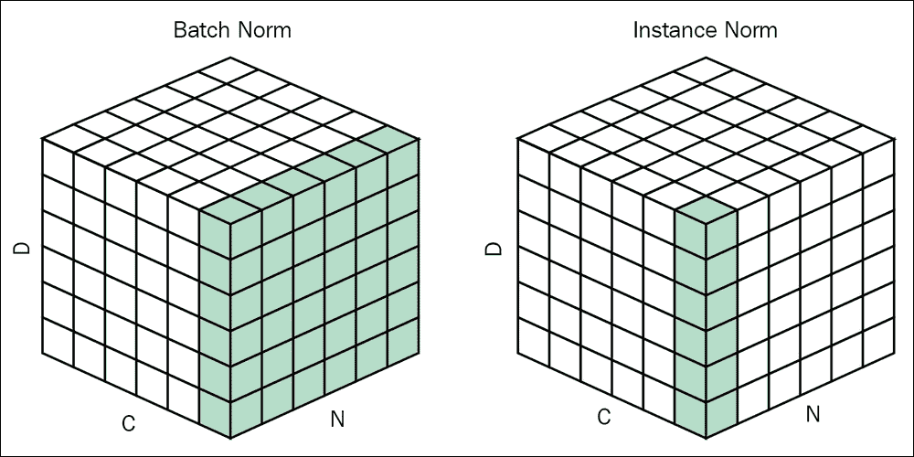

图 6.20：

Source: Group Normalization, Yuxin Wu and Kaiming He

原始 CycleGAN 的生成器在三个卷积块之后使用九个残差块，其中每个卷积块由卷积层，归一化层和激活层组成。 残差块之后是几个转置卷积，然后是最后一层具有 tanh 函数的一个卷积层。 如简单 GAN 中所述，tanh 输出的范围是 -1 至 1，这是所有图像的归一化值范围。

残余块的内部是按顺序排列的另一组填充，卷积，归一化和激活单元。 但是`forward`方法与`residueNet`中的求和操作建立了残余连接。 在以下示例中，所有内部块的顺序包装都保存到变量`conv_block`中。 然后，将经过此块的数据与加法运算符一起输入到网络`x`。 此残留连接通过允许信息更容易地双向流动来帮助网络变得稳定：

```py
class ResidualBlock(nn.Module):
    def __init__(self, in_features):
        super().__init__()

	conv_block = [nn.ReflectionPad2d(1),
                  nn.Conv2d(in_features, in_features, 3),
                  nn.InstanceNorm2d(in_features),
                  nn.ReLU(inplace=True),
                  nn.ReflectionPad2d(1),
                  nn.Conv2d(in_features, in_features, 3),
                  nn.InstanceNorm2d(in_features)]
	self.conv_block = nn.Sequential(*conv_block)
    def forward(self, x):
        return x + self.conv_block(x)
```

## 总结

在本章中，我们学习了一系列全新的神经网络，这些神经网络使人工智能世界发生了翻天覆地的变化。 生成网络对我们始终很重要，但是直到最近我们才能达到人类无法比拟的准确率。 尽管有一些成功的生成网络架构，但在本章中我们仅讨论了两个最受欢迎的网络。

生成网络使用 CNN 或 RNN 之类的基本架构作为整个网络的构建块，但是使用一些不错的技术来确保网络正在学习生成一些输出。 到目前为止，生成网络已在艺术中得到广泛使用，并且由于模型必须学习数据分布以生成输出，因此我们可以轻松地预测生成网络将成为许多复杂网络的基础。 生成网络最有前途的用途可能不是生成，而是通过生成学习数据分发并将该信息用于其他目的。

在下一章中，我们将研究最受关注的网络：强化学习算法。

## 参考

1.  [《使用 PixelCNN 解码器的条件图像生成》](https://arxiv.org/pdf/1606.05328.pdf)，Oord，Aäronvan den，Nal Kalchbrenner，Oriol Vinyals，Lasse Espeholt，Alex Graves 和 Koray Kavukcuoglu，NIPS，2016 年
2.  [《并行 WaveNet：快速高保真语音合成》](https://DeepMind.com/documents/131/Distilling_WaveNet.pdf)，Oord，Aäronvan den，Yazhe Li，Igor Babuschkin，Karen Simonyan，Oriol Vinyals，Koray Kavukcuoglu，George van den Driessche，Edward Lockhart，Luis C. Cobo， Florian Stimberg，Norman Casagrande，Dominik Grewe，Seb Noury，Sander Dieleman，Erich Elsen，Nal Kalchbrenner，Heiga Zen，Alex Graves，Helen King，Tom Walters，Dan Belov 和 Demis Hassabis，ICML，2018
3.  [戈尔宾的 WaveNet 存储库](https://github.com/golbin/WaveNet)