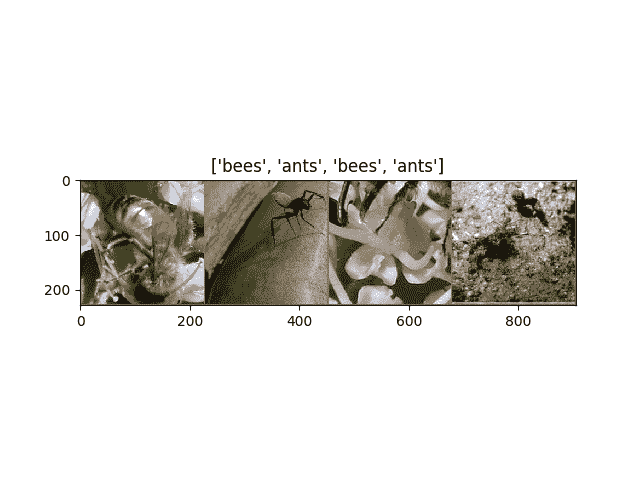
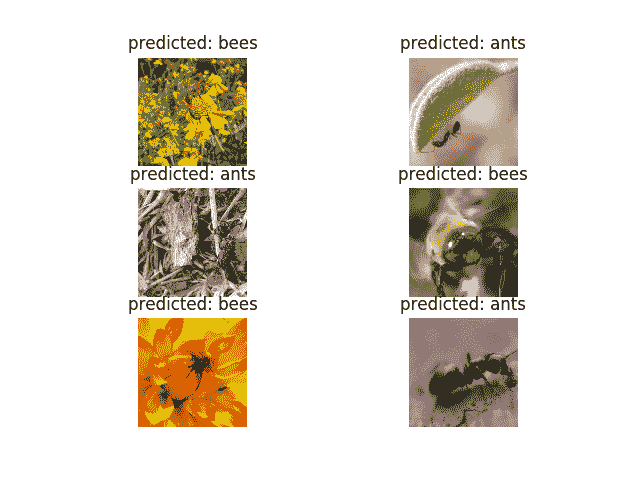
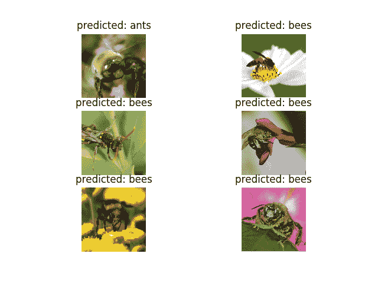

# 计算机视觉教程的转移学习

> 原文：<https://pytorch.org/tutorials/beginner/transfer_learning_tutorial.html>

**作者**： [Sasank Chilamkurthy](https://chsasank.github.io)

在本教程中，您将学习如何使用转移学习训练卷积神经网络进行图像分类。 您可以在 [cs231n 笔记](https://cs231n.github.io/transfer-learning/)中阅读有关转学的更多信息。

引用这些注释，

> 实际上，很少有人从头开始训练整个卷积网络（使用随机初始化），因为拥有足够大小的数据集相对很少。 相反，通常在非常大的数据集上对 ConvNet 进行预训练（例如 ImageNet，其中包含 120 万个具有 1000 个类别的图像），然后将 ConvNet 用作初始化或固定特征提取器以完成感兴趣的任务。

这两个主要的转移学习方案如下所示：

*   **对卷积网络进行微调**：代替随机初始化，我们使用经过预训练的网络初始化网络，例如在 imagenet 1000 数据集上进行训练的网络。 其余的培训照常进行。
*   **作为固定特征提取器的 ConvNet**：在这里，我们将冻结除最终全连接层之外的所有网络的权重。 最后一个全连接层将替换为具有随机权重的新层，并且仅训练该层。

```py
# License: BSD
# Author: Sasank Chilamkurthy

from __future__ import print_function, division

import torch
import torch.nn as nn
import torch.optim as optim
from torch.optim import lr_scheduler
import numpy as np
import torchvision
from torchvision import datasets, models, transforms
import matplotlib.pyplot as plt
import time
import os
import copy

plt.ion()   # interactive mode

```

## 加载数据]（docs / modern-java-zh /

我们将使用 torchvision 和 torch.utils.data 包来加载数据。

我们今天要解决的问题是训练一个模型来对**蚂蚁**和**蜜蜂**进行分类。 我们为蚂蚁和蜜蜂提供了大约 120 张训练图像。 每个类别有 75 个验证图像。 通常，如果从头开始训练的话，这是一个非常小的数据集。 由于我们正在使用迁移学习，因此我们应该能够很好地概括。

该数据集是 imagenet 的很小一部分。

注意

从的下载数据，并将其提取到当前目录。

```py
# Data augmentation and normalization for training
# Just normalization for validation
data_transforms = {
    'train': transforms.Compose([
        transforms.RandomResizedCrop(224),
        transforms.RandomHorizontalFlip(),
        transforms.ToTensor(),
        transforms.Normalize([0.485, 0.456, 0.406], [0.229, 0.224, 0.225])
    ]),
    'val': transforms.Compose([
        transforms.Resize(256),
        transforms.CenterCrop(224),
        transforms.ToTensor(),
        transforms.Normalize([0.485, 0.456, 0.406], [0.229, 0.224, 0.225])
    ]),
}

data_dir = 'data/hymenoptera_data'
image_datasets = {x: datasets.ImageFolder(os.path.join(data_dir, x),
                                          data_transforms[x])
                  for x in ['train', 'val']}
dataloaders = {x: torch.utils.data.DataLoader(image_datasets[x], batch_size=4,
                                             shuffle=True, num_workers=4)
              for x in ['train', 'val']}
dataset_sizes = {x: len(image_datasets[x]) for x in ['train', 'val']}
class_names = image_datasets['train'].classes

device = torch.device("cuda:0" if torch.cuda.is_available() else "cpu")

```

### 可视化一些图像] [docs / modern-java-zh /

让我们可视化一些训练图像，以了解数据扩充。

```py
def imshow(inp, title=None):
    """Imshow for Tensor."""
    inp = inp.numpy().transpose((1, 2, 0))
    mean = np.array([0.485, 0.456, 0.406])
    std = np.array([0.229, 0.224, 0.225])
    inp = std * inp + mean
    inp = np.clip(inp, 0, 1)
    plt.imshow(inp)
    if title is not None:
        plt.title(title)
    plt.pause(0.001)  # pause a bit so that plots are updated

# Get a batch of training data
inputs, classes = next(iter(dataloaders['train']))

# Make a grid from batch
out = torchvision.utils.make_grid(inputs)

imshow(out, title=[class_names[x] for x in classes])

```



## 训练模型]（docs / modern-java-zh /

现在，让我们编写一个通用功能来训练模型。 在这里，我们将说明：

*   安排学习率
*   保存最佳模型

以下，参数`scheduler`是来自`torch.optim.lr_scheduler`的 LR 调度程序对象。

```py
def train_model(model, criterion, optimizer, scheduler, num_epochs=25):
    since = time.time()

    best_model_wts = copy.deepcopy(model.state_dict())
    best_acc = 0.0

    for epoch in range(num_epochs):
        print('Epoch {}/{}'.format(epoch, num_epochs - 1))
        print('-' * 10)

        # Each epoch has a training and validation phase
        for phase in ['train', 'val']:
            if phase == 'train':
                model.train()  # Set model to training mode
            else:
                model.eval()   # Set model to evaluate mode

            running_loss = 0.0
            running_corrects = 0

            # Iterate over data.
            for inputs, labels in dataloaders[phase]:
                inputs = inputs.to(device)
                labels = labels.to(device)

                # zero the parameter gradients
                optimizer.zero_grad()

                # forward
                # track history if only in train
                with torch.set_grad_enabled(phase == 'train'):
                    outputs = model(inputs)
                    _, preds = torch.max(outputs, 1)
                    loss = criterion(outputs, labels)

                    # backward + optimize only if in training phase
                    if phase == 'train':
                        loss.backward()
                        optimizer.step()

                # statistics
                running_loss += loss.item() * inputs.size(0)
                running_corrects += torch.sum(preds == labels.data)
            if phase == 'train':
                scheduler.step()

            epoch_loss = running_loss / dataset_sizes[phase]
            epoch_acc = running_corrects.double() / dataset_sizes[phase]

            print('{} Loss: {:.4f} Acc: {:.4f}'.format(
                phase, epoch_loss, epoch_acc))

            # deep copy the model
            if phase == 'val' and epoch_acc > best_acc:
                best_acc = epoch_acc
                best_model_wts = copy.deepcopy(model.state_dict())

        print()

    time_elapsed = time.time() - since
    print('Training complete in {:.0f}m {:.0f}s'.format(
        time_elapsed // 60, time_elapsed % 60))
    print('Best val Acc: {:4f}'.format(best_acc))

    # load best model weights
    model.load_state_dict(best_model_wts)
    return model

```

### 可视化模型预测]（docs / modern-java-zh /

通用功能，显示一些图像的预测

```py
def visualize_model(model, num_images=6):
    was_training = model.training
    model.eval()
    images_so_far = 0
    fig = plt.figure()

    with torch.no_grad():
        for i, (inputs, labels) in enumerate(dataloaders['val']):
            inputs = inputs.to(device)
            labels = labels.to(device)

            outputs = model(inputs)
            _, preds = torch.max(outputs, 1)

            for j in range(inputs.size()[0]):
                images_so_far += 1
                ax = plt.subplot(num_img//2, 2, images_so_far)
                ax.axis('off')
                ax.set_title('predicted: {}'.format(class_names[preds[j]]))
                imshow(inputs.cpu().data[j])

                if images_so_far == num_images:
                    model.train(mode=was_training)
                    return
        model.train(mode=was_training)

```

## 微调 convnet]（docs / modern-java-zh /

加载预训练的模型并重置最终的全连接层。

```py
model_ft = models.resnet18(pretrained=True)
num_ftrs = model_ft.fc.in_features
# Here the size of each output sample is set to 2.
# Alternatively, it can be generalized to nn.Linear(num_ftrs, len(class_names)).
model_ft.fc = nn.Linear(num_ftrs, 2)

model_ft = model_ft.to(device)

criterion = nn.CrossEntropyLoss()

# Observe that all parameters are being optimized
optimizer_ft = optim.SGD(model_ft.parameters(), lr=0.001, momentum=0.9)

# Decay LR by a factor of 0.1 every 7 epochs
exp_lr_scheduler = lr_scheduler.StepLR(optimizer_ft, step_size=7, gamma=0.1)

```

### 训练和评估]（docs / modern-java-zh /

在 CPU 上大约需要 15-25 分钟。 但是在 GPU 上，此过程不到一分钟。

```py
model_ft = train_model(model_ft, criterion, optimizer_ft, exp_lr_scheduler,
                       num_epochs=25)

```

出：

```py
Epoch 0/24
----------
train Loss: 0.6303 Acc: 0.6926
val Loss: 0.1492 Acc: 0.9346

Epoch 1/24
----------
train Loss: 0.5511 Acc: 0.7869
val Loss: 0.2577 Acc: 0.8889

Epoch 2/24
----------
train Loss: 0.4885 Acc: 0.8115
val Loss: 0.3390 Acc: 0.8758

Epoch 3/24
----------
train Loss: 0.5158 Acc: 0.7992
val Loss: 0.5070 Acc: 0.8366

Epoch 4/24
----------
train Loss: 0.5878 Acc: 0.7992
val Loss: 0.2706 Acc: 0.8758

Epoch 5/24
----------
train Loss: 0.4396 Acc: 0.8279
val Loss: 0.2870 Acc: 0.8954

Epoch 6/24
----------
train Loss: 0.4612 Acc: 0.8238
val Loss: 0.2809 Acc: 0.9150

Epoch 7/24
----------
train Loss: 0.4387 Acc: 0.8402
val Loss: 0.1853 Acc: 0.9281

Epoch 8/24
----------
train Loss: 0.2998 Acc: 0.8648
val Loss: 0.1926 Acc: 0.9085

Epoch 9/24
----------
train Loss: 0.3383 Acc: 0.9016
val Loss: 0.1762 Acc: 0.9281

Epoch 10/24
----------
train Loss: 0.2969 Acc: 0.8730
val Loss: 0.1872 Acc: 0.8954

Epoch 11/24
----------
train Loss: 0.3117 Acc: 0.8811
val Loss: 0.1807 Acc: 0.9150

Epoch 12/24
----------
train Loss: 0.3005 Acc: 0.8770
val Loss: 0.1930 Acc: 0.9085

Epoch 13/24
----------
train Loss: 0.3129 Acc: 0.8689
val Loss: 0.2184 Acc: 0.9150

Epoch 14/24
----------
train Loss: 0.3776 Acc: 0.8607
val Loss: 0.1869 Acc: 0.9216

Epoch 15/24
----------
train Loss: 0.2245 Acc: 0.9016
val Loss: 0.1742 Acc: 0.9346

Epoch 16/24
----------
train Loss: 0.3105 Acc: 0.8607
val Loss: 0.2056 Acc: 0.9216

Epoch 17/24
----------
train Loss: 0.2729 Acc: 0.8893
val Loss: 0.1722 Acc: 0.9085

Epoch 18/24
----------
train Loss: 0.3210 Acc: 0.8730
val Loss: 0.1977 Acc: 0.9281

Epoch 19/24
----------
train Loss: 0.3231 Acc: 0.8566
val Loss: 0.1811 Acc: 0.9216

Epoch 20/24
----------
train Loss: 0.3206 Acc: 0.8648
val Loss: 0.2033 Acc: 0.9150

Epoch 21/24
----------
train Loss: 0.2917 Acc: 0.8648
val Loss: 0.1694 Acc: 0.9150

Epoch 22/24
----------
train Loss: 0.2412 Acc: 0.8852
val Loss: 0.1757 Acc: 0.9216

Epoch 23/24
----------
train Loss: 0.2508 Acc: 0.8975
val Loss: 0.1662 Acc: 0.9281

Epoch 24/24
----------
train Loss: 0.3283 Acc: 0.8566
val Loss: 0.1761 Acc: 0.9281

Training complete in 1m 10s
Best val Acc: 0.934641

```

```py
visualize_model(model_ft)

```



## ConvNet 作为固定特征提取器]（docs / modern-java-zh /

在这里，我们需要冻结除最后一层之外的所有网络。 我们需要设置`requires_grad == False`冻结参数，以便不在`backward()`中计算梯度。

您可以在的文档[中阅读有关此内容的更多信息。](https://pytorch.org/docs/notes/autograd.html#excluding-subgraphs-from-backward)

```py
model_conv = torchvision.models.resnet18(pretrained=True)
for param in model_conv.parameters():
    param.requires_grad = False

# Parameters of newly constructed modules have requires_grad=True by default
num_ftrs = model_conv.fc.in_features
model_conv.fc = nn.Linear(num_ftrs, 2)

model_conv = model_conv.to(device)

criterion = nn.CrossEntropyLoss()

# Observe that only parameters of final layer are being optimized as
# opposed to before.
optimizer_conv = optim.SGD(model_conv.fc.parameters(), lr=0.001, momentum=0.9)

# Decay LR by a factor of 0.1 every 7 epochs
exp_lr_scheduler = lr_scheduler.StepLR(optimizer_conv, step_size=7, gamma=0.1)

```

### 训练和评估]（docs / modern-java-zh /

与以前的方案相比，在 CPU 上将花费大约一半的时间。 这是可以预期的，因为不需要为大多数网络计算梯度。 但是，确实需要计算正向。

```py
model_conv = train_model(model_conv, criterion, optimizer_conv,
                         exp_lr_scheduler, num_epochs=25)

```

出：

```py
Epoch 0/24
----------
train Loss: 0.7258 Acc: 0.6148
val Loss: 0.2690 Acc: 0.9020

Epoch 1/24
----------
train Loss: 0.5342 Acc: 0.7500
val Loss: 0.1905 Acc: 0.9412

Epoch 2/24
----------
train Loss: 0.4262 Acc: 0.8320
val Loss: 0.1903 Acc: 0.9412

Epoch 3/24
----------
train Loss: 0.4103 Acc: 0.8197
val Loss: 0.2658 Acc: 0.8954

Epoch 4/24
----------
train Loss: 0.3938 Acc: 0.8115
val Loss: 0.2871 Acc: 0.8954

Epoch 5/24
----------
train Loss: 0.4623 Acc: 0.8361
val Loss: 0.1651 Acc: 0.9346

Epoch 6/24
----------
train Loss: 0.5348 Acc: 0.7869
val Loss: 0.1944 Acc: 0.9477

Epoch 7/24
----------
train Loss: 0.3827 Acc: 0.8402
val Loss: 0.1846 Acc: 0.9412

Epoch 8/24
----------
train Loss: 0.3655 Acc: 0.8443
val Loss: 0.1873 Acc: 0.9412

Epoch 9/24
----------
train Loss: 0.3275 Acc: 0.8525
val Loss: 0.2091 Acc: 0.9412

Epoch 10/24
----------
train Loss: 0.3375 Acc: 0.8320
val Loss: 0.1798 Acc: 0.9412

Epoch 11/24
----------
train Loss: 0.3077 Acc: 0.8648
val Loss: 0.1942 Acc: 0.9346

Epoch 12/24
----------
train Loss: 0.4336 Acc: 0.7787
val Loss: 0.1934 Acc: 0.9346

Epoch 13/24
----------
train Loss: 0.3149 Acc: 0.8566
val Loss: 0.2062 Acc: 0.9281

Epoch 14/24
----------
train Loss: 0.3617 Acc: 0.8320
val Loss: 0.1761 Acc: 0.9412

Epoch 15/24
----------
train Loss: 0.3066 Acc: 0.8361
val Loss: 0.1799 Acc: 0.9281

Epoch 16/24
----------
train Loss: 0.3952 Acc: 0.8443
val Loss: 0.1666 Acc: 0.9346

Epoch 17/24
----------
train Loss: 0.3552 Acc: 0.8443
val Loss: 0.1928 Acc: 0.9412

Epoch 18/24
----------
train Loss: 0.3106 Acc: 0.8648
val Loss: 0.1964 Acc: 0.9346

Epoch 19/24
----------
train Loss: 0.3675 Acc: 0.8566
val Loss: 0.1813 Acc: 0.9346

Epoch 20/24
----------
train Loss: 0.3565 Acc: 0.8320
val Loss: 0.1758 Acc: 0.9346

Epoch 21/24
----------
train Loss: 0.2922 Acc: 0.8566
val Loss: 0.2295 Acc: 0.9216

Epoch 22/24
----------
train Loss: 0.3283 Acc: 0.8402
val Loss: 0.2267 Acc: 0.9281

Epoch 23/24
----------
train Loss: 0.2875 Acc: 0.8770
val Loss: 0.1878 Acc: 0.9346

Epoch 24/24
----------
train Loss: 0.3172 Acc: 0.8689
val Loss: 0.1849 Acc: 0.9412

Training complete in 0m 34s
Best val Acc: 0.947712

```

```py
visualize_model(model_conv)

plt.ioff()
plt.show()

```



## 进一步学习] [docs / modern-java-zh /

如果您想了解有关迁移学习的更多信息，请查看我们的[计算机视觉教程的量化迁移学习](https://pytorch.org/tutorials/intermediate/quantized_transfer_learning_tutorial.html)。

**脚本的总运行时间：**（1 分钟 56.157 秒）

[`Download Python source code: transfer_learning_tutorial.py`](../_downloads/07d5af1ef41e43c07f848afaf5a1c3cc/transfer_learning_tutorial.py)

[`Download Jupyter notebook: transfer_learning_tutorial.ipynb`](../_downloads/62840b1eece760d5e42593187847261f/transfer_learning_tutorial.ipynb)

[由狮身人面像画廊](https://sphinx-gallery.readthedocs.io)生成的画廊