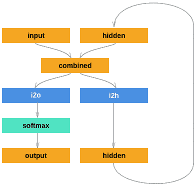
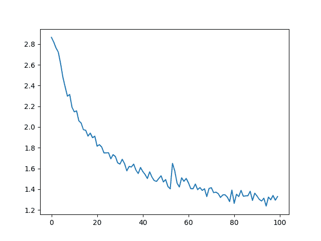
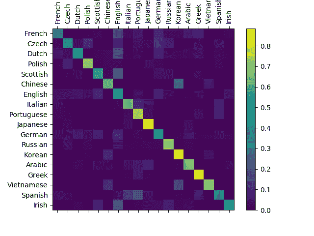

# 从零开始的 NLP：使用字符级 RNN 对名称进行分类¶

> 原文：<https://pytorch.org/tutorials/intermediate/char_rnn_classification_tutorial.html>

**作者**： [Sean Robertson](https://github.com/spro/practical-pytorch)

我们将建立和训练基本的字符级 RNN 对单词进行分类。 本教程与以下两个教程一起，展示了如何“从头开始”进行 NLP 建模的预处理数据，特别是不使用 <cite>torchtext</cite> 的许多便利功能，因此您可以了解如何进行 NLP 建模的预处理 在低水平上工作。

字符级 RNN 将单词作为一系列字符读取-在每个步骤输出预测和“隐藏状态”，将其先前的隐藏状态输入到每个下一步。 我们将最终的预测作为输出，即单词属于哪个类别。

具体来说，我们将训练来自 18 种起源语言的数千种姓氏，并根据拼写方式预测名称的来源：

```py
$ python predict.py Hinton
(-0.47) Scottish
(-1.52) English
(-3.57) Irish

$ python predict.py Schmidhuber
(-0.19) German
(-2.48) Czech
(-2.68) Dutch

```

**推荐读物：**

我假设您至少已经安装了 PyTorch，Python 和 Tensors：

*   [安装说明](https://pytorch.org/)
*   [使用 PyTorch 进行深度学习：60 分钟的闪电战](../beginner/deep_learning_60min_blitz.html)通常开始使用 PyTorch
*   [使用示例](../beginner/pytorch_with_examples.html)学习 PyTorch 进行广泛而深入的概述
*   [PyTorch（以前的 Torch 用户）](../beginner/former_torchies_tutorial.html)（如果您以前是 Lua Torch 用户）

了解 RNN 及其工作方式也将很有用：

*   [循环神经网络的不合理效果](https://karpathy.github.io/2015/05/21/rnn-effectiveness/)显示了许多现实生活中的例子
*   [了解 LSTM 网络](https://colah.github.io/posts/2015-08-Understanding-LSTMs/)特别是关于 LSTM 的，但一般来说也有关 RNN 的

## 准备数据]（docs / modern-java-zh /

注意

从的下载数据，并将其提取到当前目录。

`data/names`目录中包含 18 个文本文件，名称为“ [Language] .txt”。 每个文件包含一堆名称，每行一个名称，大多数是罗马化的（但我们仍然需要从 Unicode 转换为 ASCII）。

我们将得到一个字典，其中列出了每种语言的名称列表`{language: [names ...]}`。 通用变量“类别”和“行”（在本例中为语言和名称）用于以后的扩展。

```py
from __future__ import unicode_literals, print_function, division
from io import open
import glob
import os

def findFiles(path): return glob.glob(path)

print(findFiles('data/names/*.txt'))

import unicodedata
import string

all_letters = string.ascii_letters + " .,;'"
n_letters = len(all_letters)

# Turn a Unicode string to plain ASCII, thanks to https://stackoverflow.com/a/518232/2809427
def unicodeToAscii(s):
    return ''.join(
        c for c in unicodedata.normalize('NFD', s)
        if unicodedata.category(c) != 'Mn'
        and c in all_letters
    )

print(unicodeToAscii('Ślusàrski'))

# Build the category_lines dictionary, a list of names per language
category_lines = {}
all_categories = []

# Read a file and split into lines
def readLines(filename):
    lines = open(filename, encoding='utf-8').read().strip().split('\n')
    return [unicodeToAscii(line) for line in lines]

for filename in findFiles('data/names/*.txt'):
    category = os.path.splitext(os.path.basename(filename))[0]
    all_categories.append(category)
    lines = readLines(filename)
    category_lines[category] = lines

n_categories = len(all_categories)

```

出：

```py
['data/names/French.txt', 'data/names/Czech.txt', 'data/names/Dutch.txt', 'data/names/Polish.txt', 'data/names/Scottish.txt', 'data/names/Chinese.txt', 'data/names/English.txt', 'data/names/Italian.txt', 'data/names/Portuguese.txt', 'data/names/Japanese.txt', 'data/names/German.txt', 'data/names/Russian.txt', 'data/names/Korean.txt', 'data/names/Arabic.txt', 'data/names/Greek.txt', 'data/names/Vietnamese.txt', 'data/names/Spanish.txt', 'data/names/Irish.txt']
Slusarski

```

现在我们有了`category_lines`，这是一个字典，将每个类别（语言）映射到行（名称）列表。 我们还跟踪了`all_categories`（只是语言列表）和`n_categories`，以供以后参考。

```py
print(category_lines['Italian'][:5])

```

出：

```py
['Abandonato', 'Abatangelo', 'Abatantuono', 'Abate', 'Abategiovanni']

```

### 将名称转换为张量]（docs / modern-java-zh /

现在我们已经组织了所有名称，我们需要将它们转换为张量以使用它们。

为了表示单个字母，我们使用大小为`<1 x n_letters>`的“ one-hot vector”。 一个热门向量用 0 填充，但当前字母的索引处的数字为 1，例如 `"b" = <0 1 0 0 0 ...>`。

为了制造一个单词，我们将其中的一些连接成 2D 矩阵`<line_length x 1 x n_letters>`。

额外的 1 维是因为 PyTorch 假定所有内容都是成批的-在这里我们仅使用 1 的批量大小。

```py
import torch

# Find letter index from all_letters, e.g. "a" = 0
def letterToIndex(letter):
    return all_letters.find(letter)

# Just for demonstration, turn a letter into a <1 x n_letters> Tensor
def letterToTensor(letter):
    tensor = torch.zeros(1, n_letters)
    tensor[0][letterToIndex(letter)] = 1
    return tensor

# Turn a line into a <line_length x 1 x n_letters>,
# or an array of one-hot letter vectors
def lineToTensor(line):
    tensor = torch.zeros(len(line), 1, n_letters)
    for li, letter in enumerate(line):
        tensor[li][0][letterToIndex(letter)] = 1
    return tensor

print(letterToTensor('J'))

print(lineToTensor('Jones').size())

```

出：

```py
tensor([[0., 0., 0., 0., 0., 0., 0., 0., 0., 0., 0., 0., 0., 0., 0., 0., 0., 0.,
         0., 0., 0., 0., 0., 0., 0., 0., 0., 0., 0., 0., 0., 0., 0., 0., 0., 1.,
         0., 0., 0., 0., 0., 0., 0., 0., 0., 0., 0., 0., 0., 0., 0., 0., 0., 0.,
         0., 0., 0.]])
torch.Size([5, 1, 57])

```

## 创建网络]（docs / modern-java-zh /

在进行自动分级之前，在 Torch 中创建一个循环神经网络涉及在多个时间步长上克隆层的参数。 层保留了隐藏状态和渐变，这些层现在完全由图形本身处理。 这意味着您可以非常“纯”的方式将 RNN 用作常规前馈层。

该 RNN 模块（主要从 PyTorch for Torch 用户教程的[复制）只有两个线性层，它们在输入和隐藏状态下运行，在输出之后是 LogSoftmax 层。](https://pytorch.org/tutorials/beginner/former_torchies/nn_tutorial.html#example-2-recurrent-net)



```py
import torch.nn as nn

class RNN(nn.Module):
    def __init__(self, input_size, hidden_size, output_size):
        super(RNN, self).__init__()

        self.hidden_size = hidden_size

        self.i2h = nn.Linear(input_size + hidden_size, hidden_size)
        self.i2o = nn.Linear(input_size + hidden_size, output_size)
        self.softmax = nn.LogSoftmax(dim=1)

    def forward(self, input, hidden):
        combined = torch.cat((input, hidden), 1)
        hidden = self.i2h(combined)
        output = self.i2o(combined)
        output = self.softmax(output)
        return output, hidden

    def initHidden(self):
        return torch.zeros(1, self.hidden_size)

n_hidden = 128
rnn = RNN(n_letters, n_hidden, n_categories)

```

要运行此网络的步骤，我们需要传递输入（在本例中为当前字母的张量）和先前的隐藏状态（首先将其初始化为零）。 我们将返回输出（每种语言的概率）和下一个隐藏状态（我们将其保留用于下一步）。

```py
input = letterToTensor('A')
hidden =torch.zeros(1, n_hidden)

output, next_hidden = rnn(input, hidden)

```

为了提高效率，我们不想为每个步骤创建一个新的 Tensor，因此我们将使用`lineToTensor`而不是`letterToTensor`并使用切片。 这可以通过预先计算一批张量来进一步优化。

```py
input = lineToTensor('Albert')
hidden = torch.zeros(1, n_hidden)

output, next_hidden = rnn(input[0], hidden)
print(output)

```

出：

```py
tensor([[-2.8934, -2.7991, -2.8549, -2.8915, -2.9122, -2.9010, -2.8979, -2.8875,
         -2.8256, -2.8792, -2.8712, -2.8465, -2.9582, -3.0171, -2.8308, -2.9629,
         -2.9233, -2.8979]], grad_fn=<LogSoftmaxBackward>)

```

如您所见，输出为`<1 x n_categories>`张量，其中每个项目都是该类别的可能性（可能性更大）。

## 训练] [docs / modern-java-zh /

### 准备训练]（docs / modern-java-zh /

在接受训练之前，我们应该做一些辅助功能。 首先是解释网络的输出，我们知道这是每个类别的可能性。 我们可以使用`Tensor.topk`获得最大值的索引：

```py
def categoryFromOutput(output):
    top_n, top_i = output.topk(1)
    category_i = top_i[0].item()
    return all_categories[category_i], category_i

print(categoryFromOutput(output))

```

出：

```py
('Czech', 1)

```

我们还将希望有一种快速的方法来获取训练示例（名称及其语言）：

```py
import random

def randomChoice(l):
    return l[random.randint(0, len(l) - 1)]

def randomTrainingExample():
    category = randomChoice(all_categories)
    line = randomChoice(category_lines[category])
    category_tensor = torch.tensor([all_categories.index(category)], dtype=torch.long)
    line_tensor = lineToTensor(line)
    return category, line, category_tensor, line_tensor

for i in range(10):
    category, line, category_tensor, line_tensor = randomTrainingExample()
    print('category =', category, '/ line =', line)

```

出：

```py
category = Chinese / line = Jia
category = Korean / line = Son
category = Czech / line = Matocha
category = Dutch / line = Nifterik
category = German / line = Dreschner
category = Irish / line = Names
category = French / line = Charpentier
category = Italian / line = Carboni
category = Irish / line = Shannon
category = German / line = Adam

```

### 训练网络]（docs / modern-java-zh /

现在，训练该网络所需要做的就是向它展示大量示例，进行猜测，并告诉它是否错误。

对于损失函数，`nn.NLLLoss`是适当的，因为 RNN 的最后一层是`nn.LogSoftmax`。

```py
criterion = nn.NLLLoss()

```

每个训练循环将：

*   创建输入和目标张量
*   创建归零的初始隐藏状态
*   阅读和中的每个字母
    *   保持下一个字母的隐藏状态
*   比较最终输出与目标
*   反向传播
*   返回输出和损失

```py
learning_rate = 0.005 # If you set this too high, it might explode. If too low, it might not learn

def train(category_tensor, line_tensor):
    hidden = rnn.initHidden()

    rnn.zero_grad()

    for i in range(line_tensor.size()[0]):
        output, hidden = rnn(line_tensor[i], hidden)

    loss = criterion(output, category_tensor)
    loss.backward()

    # Add parameters' gradients to their values, multiplied by learning rate
    for p in rnn.parameters():
        p.data.add_(p.grad.data, alpha=-learning_rate)

    return output, loss.item()

```

现在，我们只需要运行大量示例。 由于`train`函数返回输出和损失，因此我们可以打印其猜测并跟踪作图的损失。 因为有 1000 个示例，所以我们仅打印每个`print_every`示例，并对损失进行平均。

```py
import time
import math

n_iters = 100000
print_every = 5000
plot_every = 1000

# Keep track of losses for plotting
current_loss = 0
all_losses = []

def timeSince(since):
    now = time.time()
    s = now - since
    m = math.floor(s / 60)
    s -= m * 60
    return '%dm %ds' % (m, s)

start = time.time()

for iter in range(1, n_iters + 1):
    category, line, category_tensor, line_tensor = randomTrainingExample()
    output, loss = train(category_tensor, line_tensor)
    current_loss += loss

    # Print iter number, loss, name and guess
    if iter % print_every == 0:
        guess, guess_i = categoryFromOutput(output)
        correct = '✓' if guess == category else '✗ (%s)' % category
        print('%d %d%% (%s) %.4f %s / %s %s' % (iter, iter / n_iters * 100, timeSince(start), loss, line, guess, correct))

    # Add current loss avg to list of losses
    if iter % plot_every == 0:
        all_losses.append(current_loss / plot_every)
        current_loss = 0

```

出：

```py
5000 5% (0m 15s) 2.5667 Ly / Chinese ✗ (Vietnamese)
10000 10% (0m 26s) 2.3171 Rocha / Japanese ✗ (Portuguese)
15000 15% (0m 37s) 2.2941 Gouveia / Spanish ✗ (Portuguese)
20000 20% (0m 49s) 1.3015 Lippi / Italian ✓
25000 25% (1m 1s) 0.7693 Thuy / Vietnamese ✓
30000 30% (1m 13s) 1.9341 Murray / Arabic ✗ (Scottish)
35000 35% (1m 25s) 2.3633 Busto / Scottish ✗ (Italian)
40000 40% (1m 38s) 1.0401 Chung / Chinese ✗ (Korean)
45000 45% (1m 50s) 0.0499 Filipowski / Polish ✓
50000 50% (2m 2s) 0.2598 Mccallum / Scottish ✓
55000 55% (2m 14s) 4.5375 Mozdzierz / German ✗ (Polish)
60000 60% (2m 26s) 1.7194 Talalihin / Irish ✗ (Russian)
65000 65% (2m 38s) 0.1150 Ziemniak / Polish ✓
70000 70% (2m 51s) 1.8548 Pharlain / Scottish ✗ (Irish)
75000 75% (3m 3s) 2.1362 Prehatney / Russian ✗ (Czech)
80000 80% (3m 15s) 0.4166 Leclerc / French ✓
85000 85% (3m 27s) 1.4189 Elford / English ✓
90000 90% (3m 39s) 2.1959 Gagnon / Scottish ✗ (French)
95000 95% (3m 51s) 0.1622 Bukoski / Polish ✓
100000 100% (4m 3s) 1.3180 Faucheux / French ✓

```

### 绘制结果] [docs / modern-java-zh /

从`all_losses`绘制历史损失可显示网络学习情况：

```py
import matplotlib.pyplot as plt
import matplotlib.ticker as ticker

plt.figure()
plt.plot(all_losses)

```



## 评估结果]（docs / modern-java-zh /

为了查看网络在不同类别上的表现如何，我们将创建一个混淆矩阵，为每种实际语言（行）指示网络猜测（列）哪种语言。 为了计算混淆矩阵，使用`evaluate()`通过网络运行一堆样本，该样本等于`train()`减去反向传播器。

```py
# Keep track of correct guesses in a confusion matrix
confusion = torch.zeros(n_categories, n_categories)
n_confusion = 10000

# Just return an output given a line
def evaluate(line_tensor):
    hidden = rnn.initHidden()

    for i in range(line_tensor.size()[0]):
        output, hidden = rnn(line_tensor[i], hidden)

    return output

# Go through a bunch of examples and record which are correctly guessed
for i in range(n_confusion):
    category, line, category_tensor, line_tensor = randomTrainingExample()
    output = evaluate(line_tensor)
    guess, guess_i = categoryFromOutput(output)
    category_i = all_categories.index(category)
    confusion[category_i][guess_i] += 1

# Normalize by dividing every row by its sum
for i in range(n_categories):
    confusion[i] = confusion[i] / confusion[i].sum()

# Set up plot
fig = plt.figure()
ax = fig.add_subplot(111)
cax = ax.matshow(confusion.numpy())
fig.colorbar(cax)

# Set up axes
ax.set_xticklabels([''] + all_categories, rotation=90)
ax.set_yticklabels([''] + all_categories)

# Force label at every tick
ax.xaxis.set_major_locator(ticker.MultipleLocator(1))
ax.yaxis.set_major_locator(ticker.MultipleLocator(1))

# sphinx_gallery_thumbnail_number = 2
plt.show()

```



您可以从主轴上挑出一些亮点，以显示它猜错了哪些语言，例如 中文（朝鲜语）和西班牙语（意大利语）。 它似乎与希腊语搭配得很好，而与英语搭配得很差（可能是因为与其他语言重叠）。

### 在用户输入上运行] [docs / modern-java-zh /

```py
def predict(input_line, n_predictions=3):
    print('\n> %s' % input_line)
    with torch.no_grad():
        output = evaluate(lineToTensor(input_line))

        # Get top N categories
        topv, topi = output.topk(n_predictions, 1, True)
        predictions = []

        for i in range(n_predictions):
            value = topv[0][i].item()
            category_index = topi[0][i].item()
            print('(%.2f) %s' % (value, all_categories[category_index]))
            predictions.append([value, all_categories[category_index]])

predict('Dovesky')
predict('Jackson')
predict('Satoshi')

```

出：

```py
> Dovesky
(-0.82) Russian
(-1.06) Czech
(-2.22) Polish

> Jackson
(-0.63) English
(-1.75) Scottish
(-1.75) Russian

> Satoshi
(-0.97) Japanese
(-1.50) Polish
(-2.13) Italian

```

实际 PyTorch 存储库中的脚本[的最终版本将上述代码分成几个文件：](https://github.com/spro/practical-pytorch/tree/master/char-rnn-classification)

*   `data.py`（加载文件）
*   `model.py`（定义 RNN）
*   `train.py`（进行训练）
*   `predict.py`（使用命令行参数运行`predict()`）
*   `server.py`（通过 bottle.py 将预测用作 JSON API）

运行`train.py`训练并保存网络。

使用名称运行`predict.py`以查看预测：

```py
$ python predict.py Hazaki
(-0.42) Japanese
(-1.39) Polish
(-3.51) Czech

```

运行`server.py`并访问`http://localhost:5533/Yourname`以获取预测的 JSON 输出。

## 练习]（docs / modern-java-zh /

*   尝试使用 line-> category 的其他数据集，例如：
    *   任何单词->语言
    *   名->性别
    *   角色名称->作家
    *   页面标题-> Blog 或 subreddit
*   通过更大和/或形状更好的网络获得更好的结果
    *   添加更多线性层
    *   尝试`nn.LSTM`和`nn.GRU`层
    *   将多个这些 RNN 合并为更高级别的网络

**脚本的总运行时间：**（4 分钟 15.239 秒）

[`Download Python source code: char_rnn_classification_tutorial.py`](../_downloads/ccb15f8365bdae22a0a019e57216d7c6/char_rnn_classification_tutorial.py)

[`Download Jupyter notebook: char_rnn_classification_tutorial.ipynb`](../_downloads/977c14818c75427641ccb85ad21ed6dc/char_rnn_classification_tutorial.ipynb)

[由狮身人面像画廊](https://sphinx-gallery.readthedocs.io)生成的画廊