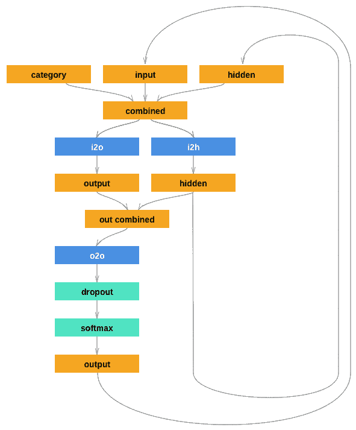
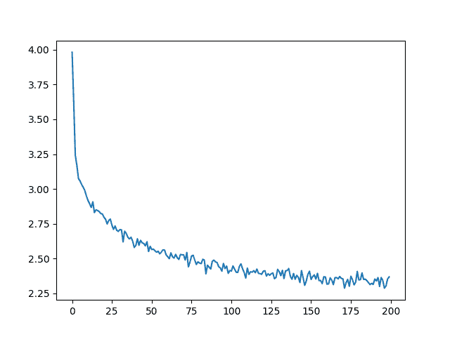

# 从零开始的 NLP：使用字符级 RNN 生成名称

> 原文：<https://pytorch.org/tutorials/intermediate/char_rnn_generation_tutorial.html>

**作者**： [Sean Robertson](https://github.com/spro/practical-pytorch)

这是我们关于“从零开始的 NLP”的三个教程中的第二个。 在第一个教程`/intermediate/char_rnn_classification_tutorial`中，我们使用了 RNN 将名称分类为源语言。 这次，我们将转过来并使用语言生成名称。

```py
> python sample.py Russian RUS
Rovakov
Uantov
Shavakov

> python sample.py German GER
Gerren
Ereng
Rosher

> python sample.py Spanish SPA
Salla
Parer
Allan

> python sample.py Chinese CHI
Chan
Hang
Iun

```

我们仍在手工制作带有一些线性层的小型 RNN。 最大的区别在于，我们无需输入名称中的所有字母即可预测类别，而是输入类别并一次输出一个字母。 反复预测字符以形成语言（这也可以用单词或其他高阶结构来完成）通常称为“语言模型”。

**推荐读物**：

我假设您至少已经安装了 PyTorch，Python 和张量：

*   [安装说明](https://pytorch.org/)
*   [使用 PyTorch 进行深度学习：60 分钟的突击](../beginner/deep_learning_60min_blitz.html)通常开始使用 PyTorch
*   [使用示例学习 PyTorch](../beginner/pytorch_with_examples.html)
*   [PyTorch（面向以前的 Torch 用户）](../beginner/former_torchies_tutorial.html)（如果您以前是 Lua Torch 用户）

了解 RNN 及其工作方式也将很有用：

*   [《循环神经网络的不合理有效性》](https://karpathy.github.io/2015/05/21/rnn-effectiveness/)显示了许多现实生活中的例子
*   [《了解 LSTM 网络》](https://colah.github.io/posts/2015-08-Understanding-LSTMs/)特别是关于 LSTM 的，但一般来说也有关 RNN 的

我还建议上一教程[《从零开始的 NLP：使用字符级 RNN 对名称进行分类》](char_rnn_classification_tutorial.html)

## 准备数据

注意

从的下载数据，并将其提取到当前目录。

有关此过程的更多详细信息，请参见上一教程。 简而言之，有一堆纯文本文件`data/names/[Language].txt`，每行都有一个名称。 我们将行拆分成一个数组，将 Unicode 转换为 ASCII，最后得到一个字典`{language: [names ...]}`。

```py
from __future__ import unicode_literals, print_function, division
from io import open
import glob
import os
import unicodedata
import string

all_letters = string.ascii_letters + " .,;'-"
n_letters = len(all_letters) + 1 # Plus EOS marker

def findFiles(path): return glob.glob(path)

# Turn a Unicode string to plain ASCII, thanks to https://stackoverflow.com/a/518232/2809427
def unicodeToAscii(s):
    return ''.join(
        c for c in unicodedata.normalize('NFD', s)
        if unicodedata.category(c) != 'Mn'
        and c in all_letters
    )

# Read a file and split into lines
def readLines(filename):
    lines = open(filename, encoding='utf-8').read().strip().split('\n')
    return [unicodeToAscii(line) for line in lines]

# Build the category_lines dictionary, a list of lines per category
category_lines = {}
all_categories = []
for filename in findFiles('data/names/*.txt'):
    category = os.path.splitext(os.path.basename(filename))[0]
    all_categories.append(category)
    lines = readLines(filename)
    category_lines[category] = lines

n_categories = len(all_categories)

if n_categories == 0:
    raise RuntimeError('Data not found. Make sure that you downloaded data '
        'from https://download.pytorch.org/tutorial/data.zip and extract it to '
        'the current directory.')

print('# categories:', n_categories, all_categories)
print(unicodeToAscii("O'Néàl"))

```

出：

```py
# categories: 18 ['French', 'Czech', 'Dutch', 'Polish', 'Scottish', 'Chinese', 'English', 'Italian', 'Portuguese', 'Japanese', 'German', 'Russian', 'Korean', 'Arabic', 'Greek', 'Vietnamese', 'Spanish', 'Irish']
O'Neal

```

## 创建网络

该网络扩展[最后一个教程](#Creating-the-Network)的 RNN，并为类别张量附加了一个参数，该参数与其他张量串联在一起。 类别张量就像字母输入一样是一个单向向量。

我们将输出解释为下一个字母的概率。 采样时，最可能的输出字母用作下一个输入字母。

我添加了第二个线性层`o2o`（在合并了隐藏和输出之后），以使其有更多的肌肉可以使用。 还有一个辍学层，[以给定的概率](https://arxiv.org/abs/1207.0580)（此处为 0.1）将输入的部分随机归零，通常用于模糊输入以防止过拟合。 在这里，我们在网络的末端使用它来故意添加一些混乱并增加采样种类。



```py
import torch
import torch.nn as nn

class RNN(nn.Module):
    def __init__(self, input_size, hidden_size, output_size):
        super(RNN, self).__init__()
        self.hidden_size = hidden_size

        self.i2h = nn.Linear(n_categories + input_size + hidden_size, hidden_size)
        self.i2o = nn.Linear(n_categories + input_size + hidden_size, output_size)
        self.o2o = nn.Linear(hidden_size + output_size, output_size)
        self.dropout = nn.Dropout(0.1)
        self.softmax = nn.LogSoftmax(dim=1)

    def forward(self, category, input, hidden):
        input_combined = torch.cat((category, input, hidden), 1)
        hidden = self.i2h(input_combined)
        output = self.i2o(input_combined)
        output_combined = torch.cat((hidden, output), 1)
        output = self.o2o(output_combined)
        output = self.dropout(output)
        output = self.softmax(output)
        return output, hidden

    def initHidden(self):
        return torch.zeros(1, self.hidden_size)

```

## 训练

### 准备训练

首先，辅助函数获取随机对（类别，行）：

```py
import random

# Random item from a list
def randomChoice(l):
    return l[random.randint(0, len(l) - 1)]

# Get a random category and random line from that category
def randomTrainingPair():
    category = randomChoice(all_categories)
    line = randomChoice(category_lines[category])
    return category, line

```

对于每个时间步（即，对于训练词中的每个字母），网络的输入将为`(category, current letter, hidden state)`，而输出将为`(next letter, next hidden state)`。 因此，对于每个训练集，我们都需要类别，一组输入字母和一组输出/目标字母。

由于我们正在预测每个时间步中当前字母的下一个字母，因此字母对是该行中连续字母的组-例如 对于`"ABCD<EOS>"`，我们将创建`('A', 'B'), ('B', 'C'), ('C', 'D'), ('D', 'EOS')`。


类别张量是大小为`<1 x n_categories>`的[单热张量](https://en.wikipedia.org/wiki/One-hot)。 训练时，我们会随时随地将其馈送到网络中-这是一种设计选择，它可能已作为初始隐藏状态或某些其他策略的一部分包含在内。

```py
# One-hot vector for category
def categoryTensor(category):
    li = all_categories.index(category)
    tensor = torch.zeros(1, n_categories)
    tensor[0][li] = 1
    return tensor

# One-hot matrix of first to last letters (not including EOS) for input
def inputTensor(line):
    tensor = torch.zeros(len(line), 1, n_letters)
    for li in range(len(line)):
        letter = line[li]
        tensor[li][0][all_letters.find(letter)] = 1
    return tensor

# LongTensor of second letter to end (EOS) for target
def targetTensor(line):
    letter_indexes = [all_letters.find(line[li]) for li in range(1, len(line))]
    letter_indexes.append(n_letters - 1) # EOS
    return torch.LongTensor(letter_indexes)

```

为了方便训练，我们将使用`randomTrainingExample`函数来获取随机（类别，行）对，并将其转换为所需的（类别，输入，目标）张量。

```py
# Make category, input, and target tensors from a random category, line pair
def randomTrainingExample():
    category, line = randomTrainingPair()
    category_tensor = categoryTensor(category)
    input_line_tensor = inputTensor(line)
    target_line_tensor = targetTensor(line)
    return category_tensor, input_line_tensor, target_line_tensor

```

### 训练网络

与仅使用最后一个输出的分类相反，我们在每个步骤进行预测，因此在每个步骤都计算损失。

Autograd 的神奇之处在于，您可以简单地在每个步骤中对这些损失进行求和，然后在末尾调用。

```py
criterion = nn.NLLLoss()

learning_rate = 0.0005

def train(category_tensor, input_line_tensor, target_line_tensor):
    target_line_tensor.unsqueeze_(-1)
    hidden = rnn.initHidden()

    rnn.zero_grad()

    loss = 0

    for i in range(input_line_tensor.size(0)):
        output, hidden = rnn(category_tensor, input_line_tensor[i], hidden)
        l = criterion(output, target_line_tensor[i])
        loss += l

    loss.backward()

    for p in rnn.parameters():
        p.data.add_(p.grad.data, alpha=-learning_rate)

    return output, loss.item() / input_line_tensor.size(0)

```

为了跟踪训练需要多长时间，我添加了一个`timeSince(timestamp)`函数，该函数返回人类可读的字符串：

```py
import time
import math

def timeSince(since):
    now = time.time()
    s = now - since
    m = math.floor(s / 60)
    s -= m * 60
    return '%dm %ds' % (m, s)

```

训练照常进行-召集训练多次并等待几分钟，每`print_every`个示例打印当前时间和损失，并在`all_losses`中保存每个`plot_every`实例的平均损失以供以后绘制。

```py
rnn = RNN(n_letters, 128, n_letters)

n_iters = 100000
print_every = 5000
plot_every = 500
all_losses = []
total_loss = 0 # Reset every plot_every iters

start = time.time()

for iter in range(1, n_iters + 1):
    output, loss = train(*randomTrainingExample())
    total_loss += loss

    if iter % print_every == 0:
        print('%s (%d %d%%) %.4f' % (timeSince(start), iter, iter / n_iters * 100, loss))

    if iter % plot_every == 0:
        all_losses.append(total_loss / plot_every)
        total_loss = 0

```

出：

```py
0m 26s (5000 5%) 3.2265
0m 51s (10000 10%) 3.0171
1m 16s (15000 15%) 2.1535
1m 41s (20000 20%) 2.0806
2m 7s (25000 25%) 2.3842
2m 32s (30000 30%) 2.5014
2m 57s (35000 35%) 2.2441
3m 22s (40000 40%) 2.2113
3m 47s (45000 45%) 2.1184
4m 13s (50000 50%) 1.3983
4m 38s (55000 55%) 2.5881
5m 3s (60000 60%) 1.8033
5m 29s (65000 65%) 2.4285
5m 54s (70000 70%) 2.4198
6m 20s (75000 75%) 2.9660
6m 45s (80000 80%) 1.9752
7m 11s (85000 85%) 3.7507
7m 36s (90000 90%) 2.2044
8m 2s (95000 95%) 2.8938
8m 27s (100000 100%) 2.2471

```

### 绘制损失图

绘制`all_loss`的历史损失可显示网络学习情况：

```py
import matplotlib.pyplot as plt
import matplotlib.ticker as ticker

plt.figure()
plt.plot(all_losses)

```



## 网络抽样

为了示例，我们给网络一个字母，询问下一个字母是什么，将其作为下一个字母输入，并重复直到 EOS 令牌。

*   为输入类别，起始字母和空隐藏状态创建张量
*   用起始字母创建一个字符串`output_name`
*   直到最大输出长度，
    *   将当前信件输入网络
    *   从最高输出中获取下一个字母，以及下一个隐藏状态
    *   如果字母是`EOS`，请在此处停止
    *   如果是普通字母，请添加到`output_name`并继续
*   返回姓氏

注意

不必给它起一个开始字母，另一种策略是在训练中包括一个“字符串开始”令牌，并让网络选择自己的开始字母。

```py
max_length = 20

# Sample from a category and starting letter
def sample(category, start_letter='A'):
    with torch.no_grad():  # no need to track history in sampling
        category_tensor = categoryTensor(category)
        input = inputTensor(start_letter)
        hidden = rnn.initHidden()

        output_name = start_letter

        for i in range(max_length):
            output, hidden = rnn(category_tensor, input[0], hidden)
            topv, topi = output.topk(1)
            topi = topi[0][0]
            if topi == n_letters - 1:
                break
            else:
                letter = all_letters[topi]
                output_name += letter
            input = inputTensor(letter)

        return output_name

# Get multiple samples from one category and multiple starting letters
def samples(category, start_letters='ABC'):
    for start_letter in start_letters:
        print(sample(category, start_letter))

samples('Russian', 'RUS')

samples('German', 'GER')

samples('Spanish', 'SPA')

samples('Chinese', 'CHI')

```

出：

```py
Rovanov
Uarinov
Santovov
Gangerten
Erer
Roure
Salla
Parera
Allan
Chin
Han
Iun

```

## 练习

*   尝试使用类别 -> 行的其他数据集，例如：
    *   虚构系列 -> 角色名称
    *   词性 -> 词
    *   国家 -> 城市
*   使用“句子开头”标记，以便无需选择开始字母即可进行采样
*   通过更大和/或形状更好的网络获得更好的结果
    *   尝试`nn.LSTM`和`nn.GRU`层
    *   将多个这些 RNN 合并为更高级别的网络

**脚本的总运行时间**：（8 分钟 27.431 秒）

[下载 Python 源码：`char_rnn_generation_tutorial.py`](../_downloads/8167177b6dd8ddf05bb9fe58744ac406/char_rnn_generation_tutorial.py)

[下载 Jupyter 笔记本：`char_rnn_generation_tutorial.ipynb`](../_downloads/a35c00bb5afae3962e1e7869c66872fa/char_rnn_generation_tutorial.ipynb)

[由 Sphinx 画廊](https://sphinx-gallery.readthedocs.io)生成的画廊