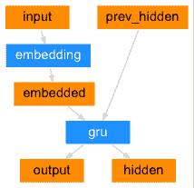
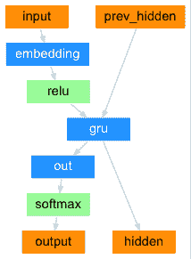
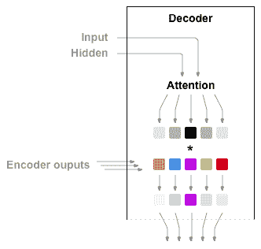
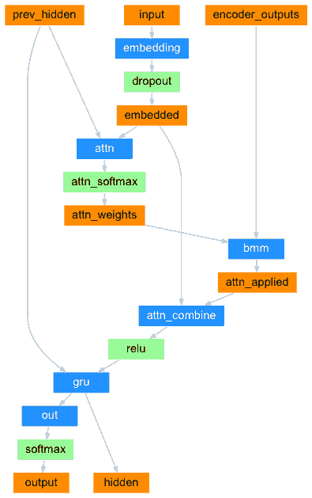
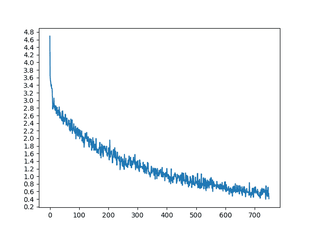
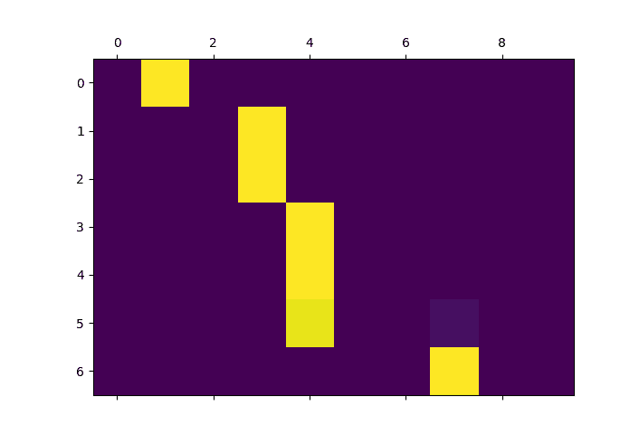
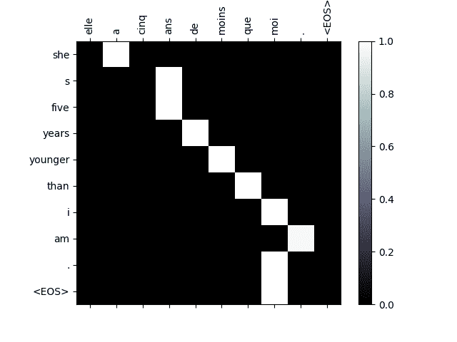
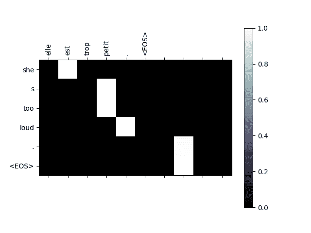
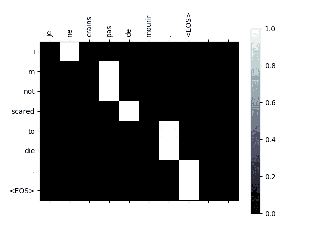
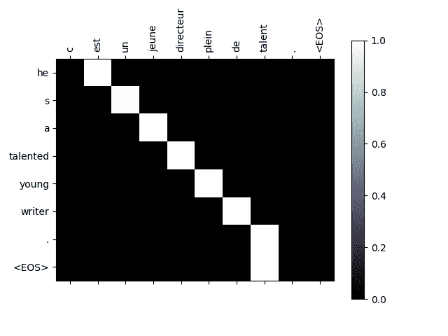

# 从零开始的 NLP：从序列到序列网络的翻译和注意¶

> 原文：<https://pytorch.org/tutorials/intermediate/seq2seq_translation_tutorial.html>

**作者**： [Sean Robertson](https://github.com/spro/practical-pytorch)

这是关于“从头开始进行 NLP”的第三篇也是最后一篇教程，我们在其中编写自己的类和函数来预处理数据以完成 NLP 建模任务。 我们希望在完成本教程后，您将继续学习紧接着本教程的三本教程， <cite>torchtext</cite> 如何为您处理许多此类预处理。

在这个项目中，我们将教授将法语翻译成英语的神经网络。

```py
[KEY: > input, = target, < output]

> il est en train de peindre un tableau .
= he is painting a picture .
< he is painting a picture .

> pourquoi ne pas essayer ce vin delicieux ?
= why not try that delicious wine ?
< why not try that delicious wine ?

> elle n est pas poete mais romanciere .
= she is not a poet but a novelist .
< she not not a poet but a novelist .

> vous etes trop maigre .
= you re too skinny .
< you re all alone .

```

……取得不同程度的成功。

通过[序列到序列网络](https://arxiv.org/abs/1409.3215)的简单但强大的构想，使这成为可能，其中两个递归神经网络协同工作，将一个序列转换为另一个序列。 编码器网络将输入序列压缩为一个向量，而解码器网络将该向量展开为一个新序列。


为了改进此模型，我们将使用[注意机制](https://arxiv.org/abs/1409.0473)，该机制可使解码器学会专注于输入序列的特定范围。

**推荐读物：**

我假设您至少已经安装了 PyTorch，Python 和 Tensors：

*   [https://pytorch.org/](https://pytorch.org/) 有关安装说明
*   [使用 PyTorch 进行深度学习：60 分钟的闪电战](../beginner/deep_learning_60min_blitz.html)通常开始使用 PyTorch
*   [使用示例](../beginner/pytorch_with_examples.html)学习 PyTorch 进行广泛而深入的概述
*   [PyTorch（以前的 Torch 用户）](../beginner/former_torchies_tutorial.html)（如果您以前是 Lua Torch 用户）

了解序列到序列网络及其工作方式也将很有用：

*   [使用 RNN 编解码器学习短语表示法进行统计机器翻译](https://arxiv.org/abs/1406.1078)
*   [序列到神经网络的序列学习](https://arxiv.org/abs/1409.3215)
*   [通过共同学习对齐和翻译的神经机器翻译](https://arxiv.org/abs/1409.0473)
*   [神经对话模型](https://arxiv.org/abs/1506.05869)

您还将找到有关[从零开始的 NLP：使用字符级 RNN](char_rnn_classification_tutorial.html) 分类名称和 [NLP 从零开始：使用字符级 RNN](char_rnn_generation_tutorial.html) 生成名称的先前教程。 分别与编码器和解码器模型非常相似。

有关更多信息，请阅读介绍以下主题的论文：

*   [使用 RNN 编解码器学习短语表示法进行统计机器翻译](https://arxiv.org/abs/1406.1078)
*   [序列到神经网络的序列学习](https://arxiv.org/abs/1409.3215)
*   [通过共同学习对齐和翻译的神经机器翻译](https://arxiv.org/abs/1409.0473)
*   [神经对话模型](https://arxiv.org/abs/1506.05869)

**要求**

```py
from __future__ import unicode_literals, print_function, division
from io import open
import unicodedata
import string
import re
import random

import torch
import torch.nn as nn
from torch import optim
import torch.nn.functional as F

device = torch.device("cuda" if torch.cuda.is_available() else "cpu")

```

## 加载数据文件]（docs / modern-java-zh /

该项目的数据是成千上万的英语到法语翻译对的集合。

[开放数据堆栈交换](https://opendata.stackexchange.com/questions/3888/dataset-of-sentences-translated-into-many-languages)上的这个问题使我指向开放翻译站点 [https://tatoeba.org/](https://tatoeba.org/) ，该站点可从 [https://tatoeba.org/下载。 eng / downloads](https://tatoeba.org/eng/downloads) -更好的是，有人在这里做了一些额外的工作，将语言对拆分为单独的文本文件： [https://www.manythings.org/anki/](https://www.manythings.org/anki/)

英文对法文对太大，无法包含在仓库中，因此请先下载到`data/eng-fra.txt`，然后再继续。 该文件是制表符分隔的翻译对列表：

```py
I am cold.    J'ai froid.

```

注意

从的下载数据，并将其提取到当前目录。

与字符级 RNN 教程中使用的字符编码类似，我们将一种语言中的每个单词表示为一个单向矢量，或零个大矢量（除单个单向索引外）（在单词的索引处）。 与某种语言中可能存在的数十个字符相比，单词更多很多，因此编码向量要大得多。 但是，我们将作弊并整理数据以使每种语言仅使用几千个单词。


我们将需要每个单词一个唯一的索引，以便以后用作网络的输入和目标。 为了跟踪所有这些，我们将使用一个名为`Lang`的帮助程序类，该类具有单词→索引（`word2index`）和索引→单词（`index2word`）字典，以及每个要使用的单词`word2count`的计数 以便以后替换稀有词。

```py
SOS_token = 0
EOS_token = 1

class Lang:
    def __init__(self, name):
        self.name = name
        self.word2index = {}
        self.word2count = {}
        self.index2word = {0: "SOS", 1: "EOS"}
        self.n_words = 2  # Count SOS and EOS

    def addSentence(self, sentence):
        for word in sentence.split(' '):
            self.addWord(word)

    def addWord(self, word):
        if word not in self.word2index:
            self.word2index[word] = self.n_words
            self.word2count[word] = 1
            self.index2word[self.n_words] = word
            self.n_words += 1
        else:
            self.word2count[word] += 1

```

文件全部为 Unicode，为简化起见，我们将 Unicode 字符转换为 ASCII，将所有内容都转换为小写，并修剪大多数标点符号。

```py
# Turn a Unicode string to plain ASCII, thanks to
# https://stackoverflow.com/a/518232/2809427
def unicodeToAscii(s):
    return ''.join(
        c for c in unicodedata.normalize('NFD', s)
        if unicodedata.category(c) != 'Mn'
    )

# Lowercase, trim, and remove non-letter characters

def normalizeString(s):
    s = unicodeToAscii(s.lower().strip())
    s = re.sub(r"([.!?])", r" \1", s)
    s = re.sub(r"[^a-zA-Z.!?]+", r" ", s)
    return s

```

要读取数据文件，我们将文件拆分为几行，然后将几行拆分为两对。 这些文件都是英语→其他语言的，因此，如果我们要从其他语言→英语进行翻译，我添加了`reverse`标志来反转对。

```py
def readLangs(lang1, lang2, reverse=False):
    print("Reading lines...")

    # Read the file and split into lines
    lines = open('data/%s-%s.txt' % (lang1, lang2), encoding='utf-8').\
        read().strip().split('\n')

    # Split every line into pairs and normalize
    pairs = [[normalizeString(s) for s in l.split('\t')] for l in lines]

    # Reverse pairs, make Lang instances
    if reverse:
        pairs = [list(reversed(p)) for p in pairs]
        input_lang = Lang(lang2)
        output_lang = Lang(lang1)
    else:
        input_lang = Lang(lang1)
        output_lang = Lang(lang2)

    return input_lang, output_lang, pairs

```

由于示例句子有*个*，并且我们想快速训练一些东西，因此我们将数据集修剪为仅相对简短的句子。 在这里，最大长度为 10 个字（包括结尾的标点符号），我们正在过滤翻译成“我是”或“他是”等形式的句子（考虑到前面已替换掉撇号的情况）。

```py
MAX_LENGTH = 10

eng_prefixes = (
    "i am ", "i m ",
    "he is", "he s ",
    "she is", "she s ",
    "you are", "you re ",
    "we are", "we re ",
    "they are", "they re "
)

def filterPair(p):
    return len(p[0].split(' ')) < MAX_LENGTH and \
        len(p[1].split(' ')) < MAX_LENGTH and \
        p[1].startswith(eng_prefixes)

def filterPairs(pairs):
    return [pair for pair in pairs if filterPair(pair)]

```

准备数据的完整过程是：

*   读取文本文件并拆分为行，将行拆分为成对
*   规范文本，按长度和内容过滤
*   成对建立句子中的单词列表

```py
def prepareData(lang1, lang2, reverse=False):
    input_lang, output_lang, pairs = readLangs(lang1, lang2, reverse)
    print("Read %s sentence pairs" % len(pairs))
    pairs = filterPairs(pairs)
    print("Trimmed to %s sentence pairs" % len(pairs))
    print("Counting words...")
    for pair in pairs:
        input_lang.addSentence(pair[0])
        output_lang.addSentence(pair[1])
    print("Counted words:")
    print(input_lang.name, input_lang.n_words)
    print(output_lang.name, output_lang.n_words)
    return input_lang, output_lang, pairs

input_lang, output_lang, pairs = prepareData('eng', 'fra', True)
print(random.choice(pairs))

```

出：

```py
Reading lines...
Read 135842 sentence pairs
Trimmed to 10599 sentence pairs
Counting words...
Counted words:
fra 4345
eng 2803
['il a l habitude des ordinateurs .', 'he is familiar with computers .']

```

## Seq2Seq 模型]（docs / modern-java-zh /

递归神经网络（RNN）是在序列上运行并将其自身的输出用作后续步骤的输入的网络。

[序列到序列网络](https://arxiv.org/abs/1409.3215)或 seq2seq 网络或[编码器解码器网络](https://arxiv.org/pdf/1406.1078v3.pdf)是由两个称为编码器和解码器的 RNN 组成的模型。 编码器读取输入序列并输出单个向量，而解码器读取该向量以产生输出序列。


与使用单个 RNN 进行序列预测（每个输入对应一个输出）不同，seq2seq 模型使我们摆脱了序列长度和顺序的限制，这使其非常适合两种语言之间的翻译。

考虑一下句子“ Je ne suis pas le chat noir”→“我不是黑猫”。 输入句子中的大多数单词在输出句子中具有直接翻译，但是顺序略有不同，例如 “黑猫聊天”和“黑猫”。 由于采用“ ne / pas”结构，因此在输入句子中还有一个单词。 直接从输入单词的序列中产生正确的翻译将是困难的。

使用 seq2seq 模型，编码器创建单个矢量，在理想情况下，该矢量将输入序列的“含义”编码为单个矢量—在句子的 N 维空间中的单个点。

### 编码器]（docs / modern-java-zh /

seq2seq 网络的编码器是 RNN，它为输入句子中的每个单词输出一些值。 对于每个输入字，编码器输出一个向量和一个隐藏状态，并将隐藏状态用于下一个输入字。



```py
class EncoderRNN(nn.Module):
    def __init__(self, input_size, hidden_size):
        super(EncoderRNN, self).__init__()
        self.hidden_size = hidden_size

        self.embedding = nn.Embedding(input_size, hidden_size)
        self.gru = nn.GRU(hidden_size, hidden_size)

    def forward(self, input, hidden):
        embedded = self.embedding(input).view(1, 1, -1)
        output = embedded
        output, hidden = self.gru(output, hidden)
        return output, hidden

    def initHidden(self):
        return torch.zeros(1, 1, self.hidden_size, device=device)

```

### 解码器]（docs / modern-java-zh /

解码器是另一个 RNN，它采用编码器输出矢量并输出单词序列来创建翻译。

#### 简单解码器]（docs / modern-java-zh /

在最简单的 seq2seq 解码器中，我们仅使用编码器的最后一个输出。 该最后的输出有时称为*上下文向量*，因为它从整个序列中编码上下文。 该上下文向量用作解码器的初始隐藏状态。

在解码的每个步骤中，为解码器提供输入令牌和隐藏状态。 初始输入令牌是字符串开始`<SOS>`令牌，第一个隐藏状态是上下文向量（编码器的最后一个隐藏状态）。



```py
class DecoderRNN(nn.Module):
    def __init__(self, hidden_size, output_size):
        super(DecoderRNN, self).__init__()
        self.hidden_size = hidden_size

        self.embedding = nn.Embedding(output_size, hidden_size)
        self.gru = nn.GRU(hidden_size, hidden_size)
        self.out = nn.Linear(hidden_size, output_size)
        self.softmax = nn.LogSoftmax(dim=1)

    def forward(self, input, hidden):
        output = self.embedding(input).view(1, 1, -1)
        output = F.relu(output)
        output, hidden = self.gru(output, hidden)
        output = self.softmax(self.out(output[0]))
        return output, hidden

    def initHidden(self):
        return torch.zeros(1, 1, self.hidden_size, device=device)

```

我鼓励您训练并观察该模型的结果，但是为了节省空间，我们将直接努力并引入注意力机制。

#### 注意解码器]（docs / modern-java-zh /

如果仅上下文向量在编码器和解码器之间传递，则该单个向量承担对整个句子进行编码的负担。

注意使解码器网络可以针对解码器自身输出的每一步，“专注”于编码器输出的不同部分。 首先，我们计算一组*注意权重*。 将这些与编码器输出向量相乘以创建加权组合。 结果（在代码中称为`attn_applied`）应包含有关输入序列特定部分的信息，从而帮助解码器选择正确的输出字。



另一个前馈层`attn`使用解码器的输入和隐藏状态作为输入来计算注意力权重。 由于训练数据中包含各种大小的句子，因此要实际创建和训练该层，我们必须选择可以应用的最大句子长度（输入长度​​，用于编码器输出）。 最大长度的句子将使用所有注意权重，而较短的句子将仅使用前几个。



```py
class AttnDecoderRNN(nn.Module):
    def __init__(self, hidden_size, output_size, dropout_p=0.1, max_length=MAX_LENGTH):
        super(AttnDecoderRNN, self).__init__()
        self.hidden_size = hidden_size
        self.output_size = output_size
        self.dropout_p = dropout_p
        self.max_length = max_length

        self.embedding = nn.Embedding(self.output_size, self.hidden_size)
        self.attn = nn.Linear(self.hidden_size * 2, self.max_length)
        self.attn_combine = nn.Linear(self.hidden_size * 2, self.hidden_size)
        self.dropout = nn.Dropout(self.dropout_p)
        self.gru = nn.GRU(self.hidden_size, self.hidden_size)
        self.out = nn.Linear(self.hidden_size, self.output_size)

    def forward(self, input, hidden, encoder_outputs):
        embedded = self.embedding(input).view(1, 1, -1)
        embedded = self.dropout(embedded)

        attn_weights = F.softmax(
            self.attn(torch.cat((embedded[0], hidden[0]), 1)), dim=1)
        attn_applied = torch.bmm(attn_weights.unsqueeze(0),
                                 encoder_outputs.unsqueeze(0))

        output = torch.cat((embedded[0], attn_applied[0]), 1)
        output = self.attn_combine(output).unsqueeze(0)

        output = F.relu(output)
        output, hidden = self.gru(output, hidden)

        output = F.log_softmax(self.out(output[0]), dim=1)
        return output, hidden, attn_weights

    def initHidden(self):
        return torch.zeros(1, 1, self.hidden_size, device=device)

```

注意

还有其他形式的注意，可以通过使用相对位置方法来解决长度限制问题。 在[基于注意力的神经机器翻译的有效方法](https://arxiv.org/abs/1508.04025)中阅读“本地注意力”。

## 培训] [docs / modern-java-zh /

### 准备训练数据]（docs / modern-java-zh /

为了训练，对于每一对，我们将需要一个输入张量（输入句子中单词的索引）和目标张量（目标句子中单词的索引）。 创建这些向量时，我们会将 EOS 令牌附加到两个序列上。

```py
def indexesFromSentence(lang, sentence):
    return [lang.word2index[word] for word in sentence.split(' ')]

def tensorFromSentence(lang, sentence):
    indexes = indexesFromSentence(lang, sentence)
    indexes.append(EOS_token)
    return torch.tensor(indexes, dtype=torch.long, device=device).view(-1, 1)

def tensorsFromPair(pair):
    input_tensor = tensorFromSentence(input_lang, pair[0])
    target_tensor = tensorFromSentence(output_lang, pair[1])
    return (input_tensor, target_tensor)

```

### 训练模型]（docs / modern-java-zh /

为了训练，我们通过编码器运行输入语句，并跟踪每个输出和最新的隐藏状态。 然后，为解码器提供`<SOS>`令牌作为其第一个输入，为编码器提供最后的隐藏状态作为其第一个隐藏状态。

“教师强制”的概念是使用实际目标输出作为每个下一个输入，而不是使用解码器的猜测作为下一个输入。 使用教师强制会导致其收敛更快，但是当使用受过训练的网络时，[可能会显示不稳定](http://citeseerx.ist.psu.edu/viewdoc/download?doi=10.1.1.378.4095&rep=rep1&type=pdf)。

您可以观察到以教师为主导的网络的输出，这些输出阅读的是连贯的语法，但是却偏离了正确的翻译-直观地，它已经学会了代表输出语法，并且一旦老师说了最初的几个单词就可以“理解”含义，但是 首先，它还没有正确地学习如何从翻译中创建句子。

由于 PyTorch 的 autograd 具有给我们的自由，我们可以通过简单的 if 语句随意选择是否使用教师强迫。 调高`teacher_forcing_ratio`以使用更多功能。

```py
teacher_forcing_ratio = 0.5

def train(input_tensor, target_tensor, encoder, decoder, encoder_optimizer, decoder_optimizer, criterion, max_length=MAX_LENGTH):
    encoder_hidden = encoder.initHidden()

    encoder_optimizer.zero_grad()
    decoder_optimizer.zero_grad()

    input_length = input_tensor.size(0)
    target_length = target_tensor.size(0)

    encoder_outputs = torch.zeros(max_length, encoder.hidden_size, device=device)

    loss = 0

    for ei in range(input_length):
        encoder_output, encoder_hidden = encoder(
            input_tensor[ei], encoder_hidden)
        encoder_outputs[ei] = encoder_output[0, 0]

    decoder_input = torch.tensor([[SOS_token]], device=device)

    decoder_hidden = encoder_hidden

    use_teacher_forcing = True if random.random() < teacher_forcing_ratio else False

    if use_teacher_forcing:
        # Teacher forcing: Feed the target as the next input
        for di in range(target_length):
            decoder_output, decoder_hidden, decoder_attention = decoder(
                decoder_input, decoder_hidden, encoder_outputs)
            loss += criterion(decoder_output, target_tensor[di])
            decoder_input = target_tensor[di]  # Teacher forcing

    else:
        # Without teacher forcing: use its own predictions as the next input
        for di in range(target_length):
            decoder_output, decoder_hidden, decoder_attention = decoder(
                decoder_input, decoder_hidden, encoder_outputs)
            topv, topi = decoder_output.topk(1)
            decoder_input = topi.squeeze().detach()  # detach from history as input

            loss += criterion(decoder_output, target_tensor[di])
            if decoder_input.item() == EOS_token:
                break

    loss.backward()

    encoder_optimizer.step()
    decoder_optimizer.step()

    return loss.item() / target_length

```

这是一个帮助功能，用于在给定当前时间和进度％的情况下打印经过的时间和估计的剩余时间。

```py
import time
import math

def asMinutes(s):
    m = math.floor(s / 60)
    s -= m * 60
    return '%dm %ds' % (m, s)

def timeSince(since, percent):
    now = time.time()
    s = now - since
    es = s / (percent)
    rs = es - s
    return '%s (- %s)' % (asMinutes(s), asMinutes(rs))

```

整个培训过程如下所示：

*   启动计时器
*   初始化优化器和标准
*   创建一组训练对
*   启动空损耗阵列进行绘图

然后，我们多次调用`train`，并偶尔打印进度（示例的百分比，到目前为止的时间，估计的时间）和平均损失。

```py
def trainIters(encoder, decoder, n_iters, print_every=1000, plot_every=100, learning_rate=0.01):
    start = time.time()
    plot_losses = []
    print_loss_total = 0  # Reset every print_every
    plot_loss_total = 0  # Reset every plot_every

    encoder_optimizer = optim.SGD(encoder.parameters(), lr=learning_rate)
    decoder_optimizer = optim.SGD(decoder.parameters(), lr=learning_rate)
    training_pairs = [tensorsFromPair(random.choice(pairs))
                      for i in range(n_iters)]
    criterion = nn.NLLLoss()

    for iter in range(1, n_iters + 1):
        training_pair = training_pairs[iter - 1]
        input_tensor = training_pair[0]
        target_tensor = training_pair[1]

        loss = train(input_tensor, target_tensor, encoder,
                     decoder, encoder_optimizer, decoder_optimizer, criterion)
        print_loss_total += loss
        plot_loss_total += loss

        if iter % print_every == 0:
            print_loss_avg = print_loss_total / print_every
            print_loss_total = 0
            print('%s (%d %d%%) %.4f' % (timeSince(start, iter / n_iters),
                                         iter, iter / n_iters * 100, print_loss_avg))

        if iter % plot_every == 0:
            plot_loss_avg = plot_loss_total / plot_every
            plot_losses.append(plot_loss_avg)
            plot_loss_total = 0

    showPlot(plot_losses)

```

### 绘图结果]（docs / modern-java-zh /

使用训练时保存的损失值数组`plot_losses`，使用 matplotlib 进行绘制。

```py
import matplotlib.pyplot as plt
plt.switch_backend('agg')
import matplotlib.ticker as ticker
import numpy as np

def showPlot(points):
    plt.figure()
    fig, ax = plt.subplots()
    # this locator puts ticks at regular intervals
    loc = ticker.MultipleLocator(base=0.2)
    ax.yaxis.set_major_locator(loc)
    plt.plot(points)

```

## 评估]（docs / modern-java-zh /

评估与训练基本相同，但是没有目标，因此我们只需将解码器的预测反馈给每一步。 每当它预测一个单词时，我们都会将其添加到输出字符串中，如果它预测到 EOS 令牌，我们将在此处停止。 我们还将存储解码器的注意输出，以供以后显示。

```py
def evaluate(encoder, decoder, sentence, max_length=MAX_LENGTH):
    with torch.no_grad():
        input_tensor = tensorFromSentence(input_lang, sentence)
        input_length = input_tensor.size()[0]
        encoder_hidden = encoder.initHidden()

        encoder_outputs = torch.zeros(max_length, encoder.hidden_size, device=device)

        for ei in range(input_length):
            encoder_output, encoder_hidden = encoder(input_tensor[ei],
                                                     encoder_hidden)
            encoder_outputs[ei] += encoder_output[0, 0]

        decoder_input = torch.tensor([[SOS_token]], device=device)  # SOS

        decoder_hidden = encoder_hidden

        decoded_words = []
        decoder_attentions = torch.zeros(max_length, max_length)

        for di in range(max_length):
            decoder_output, decoder_hidden, decoder_attention = decoder(
                decoder_input, decoder_hidden, encoder_outputs)
            decoder_attentions[di] = decoder_attention.data
            topv, topi = decoder_output.data.topk(1)
            if topi.item() == EOS_token:
                decoded_words.append('<EOS>')
                break
            else:
                decoded_words.append(output_lang.index2word[topi.item()])

            decoder_input = topi.squeeze().detach()

        return decoded_words, decoder_attentions[:di + 1]

```

我们可以从训练集中评估随机句子，并打印出输入，目标和输出以做出一些主观的质量判断：

```py
def evaluateRandomly(encoder, decoder, n=10):
    for i in range(n):
        pair = random.choice(pairs)
        print('>', pair[0])
        print('=', pair[1])
        output_words, attentions = evaluate(encoder, decoder, pair[0])
        output_sentence = ' '.join(output_words)
        print('<', output_sentence)
        print('')

```

## 培训和评估]（docs / modern-java-zh /

有了所有这些辅助功能（看起来像是额外的工作，但它使运行多个实验更加容易），我们实际上可以初始化网络并开始训练。

请记住，输入语句已被大量过滤。 对于这个小的数据集，我们可以使用具有 256 个隐藏节点和单个 GRU 层的相对较小的网络。 在 MacBook CPU 上运行约 40 分钟后，我们会得到一些合理的结果。

注意

如果运行此笔记本，则可以进行培训，中断内核，评估并在以后继续培训。 注释掉编码器和解码器已初始化的行，然后再次运行`trainIters`。

```py
hidden_size = 256
encoder1 = EncoderRNN(input_lang.n_words, hidden_size).to(device)
attn_decoder1 = AttnDecoderRNN(hidden_size, output_lang.n_words, dropout_p=0.1).to(device)

trainIters(encoder1, attn_decoder1, 75000, print_every=5000)

```

*   
*   

出：

```py
2m 6s (- 29m 28s) (5000 6%) 2.8538
4m 7s (- 26m 49s) (10000 13%) 2.3035
6m 10s (- 24m 40s) (15000 20%) 1.9812
8m 13s (- 22m 37s) (20000 26%) 1.7083
10m 15s (- 20m 31s) (25000 33%) 1.5199
12m 17s (- 18m 26s) (30000 40%) 1.3580
14m 18s (- 16m 20s) (35000 46%) 1.2002
16m 18s (- 14m 16s) (40000 53%) 1.0832
18m 21s (- 12m 14s) (45000 60%) 0.9719
20m 22s (- 10m 11s) (50000 66%) 0.8879
22m 23s (- 8m 8s) (55000 73%) 0.8130
24m 25s (- 6m 6s) (60000 80%) 0.7509
26m 27s (- 4m 4s) (65000 86%) 0.6524
28m 27s (- 2m 1s) (70000 93%) 0.6007
30m 30s (- 0m 0s) (75000 100%) 0.5699

```

```py
evaluateRandomly(encoder1, attn_decoder1)

```

出：

```py
> nous sommes desolees .
= we re sorry .
< we re sorry . <EOS>

> tu plaisantes bien sur .
= you re joking of course .
< you re joking of course . <EOS>

> vous etes trop stupide pour vivre .
= you re too stupid to live .
< you re too stupid to live . <EOS>

> c est un scientifique de niveau international .
= he s a world class scientist .
< he is a successful person . <EOS>

> j agis pour mon pere .
= i am acting for my father .
< i m trying to my father . <EOS>

> ils courent maintenant .
= they are running now .
< they are running now . <EOS>

> je suis tres heureux d etre ici .
= i m very happy to be here .
< i m very happy to be here . <EOS>

> vous etes bonne .
= you re good .
< you re good . <EOS>

> il a peur de la mort .
= he is afraid of death .
< he is afraid of death . <EOS>

> je suis determine a devenir un scientifique .
= i am determined to be a scientist .
< i m ready to make a cold . <EOS>

```

### 可视化注意] [docs / modern-java-zh /

注意机制的一个有用特性是其高度可解释的输出。 因为它用于加权输入序列的特定编码器输出，所以我们可以想象一下在每个时间步长上网络最关注的位置。

您可以简单地运行`plt.matshow(attentions)`以将注意力输出显示为矩阵，其中列为输入步骤，行为输出步骤：

```py
output_words, attentions = evaluate(
    encoder1, attn_decoder1, "je suis trop froid .")
plt.matshow(attentions.numpy())

```



为了获得更好的观看体验，我们将做一些额外的工作来添加轴和标签：

```py
def showAttention(input_sentence, output_words, attentions):
    # Set up figure with colorbar
    fig = plt.figure()
    ax = fig.add_subplot(111)
    cax = ax.matshow(attentions.numpy(), cmap='bone')
    fig.colorbar(cax)

    # Set up axes
    ax.set_xticklabels([''] + input_sentence.split(' ') +
                       ['<EOS>'], rotation=90)
    ax.set_yticklabels([''] + output_words)

    # Show label at every tick
    ax.xaxis.set_major_locator(ticker.MultipleLocator(1))
    ax.yaxis.set_major_locator(ticker.MultipleLocator(1))

    plt.show()

def evaluateAndShowAttention(input_sentence):
    output_words, attentions = evaluate(
        encoder1, attn_decoder1, input_sentence)
    print('input =', input_sentence)
    print('output =', ' '.join(output_words))
    showAttention(input_sentence, output_words, attentions)

evaluateAndShowAttention("elle a cinq ans de moins que moi .")

evaluateAndShowAttention("elle est trop petit .")

evaluateAndShowAttention("je ne crains pas de mourir .")

evaluateAndShowAttention("c est un jeune directeur plein de talent .")

```

*   
*   
*   
*   

出：

```py
input = elle a cinq ans de moins que moi .
output = she s five years younger than i am . <EOS>
input = elle est trop petit .
output = she s too loud . <EOS>
input = je ne crains pas de mourir .
output = i m not scared to die . <EOS>
input = c est un jeune directeur plein de talent .
output = he s a talented young writer . <EOS>

```

## 练习]（docs / modern-java-zh /

*   尝试使用其他数据集
    *   另一对语言
    *   人机→机器（例如 IOT 命令）
    *   聊天→回复
    *   问题→答案
*   用预训练的单词嵌入（例如 word2vec 或 GloVe）替换嵌入
*   尝试使用更多的图层，更多的隐藏单元和更多的句子。 比较训练时间和结果。
*   如果您使用翻译对，其中成对具有两个相同的词组（`I am test \t I am test`），则可以将其用作自动编码器。 尝试这个：
    *   训练为自动编码器
    *   仅保存编码器网络
    *   从那里训练新的解码器进行翻译

**脚本的总运行时间：**（30 分钟 37.929 秒）

[`Download Python source code: seq2seq_translation_tutorial.py`](../_downloads/a96a2daac1918ec72f68233dfe3f2c47/seq2seq_translation_tutorial.py)

[`Download Jupyter notebook: seq2seq_translation_tutorial.ipynb`](../_downloads/a60617788061539b5449701ae76aee56/seq2seq_translation_tutorial.ipynb)

[由狮身人面像画廊](https://sphinx-gallery.readthedocs.io)生成的画廊