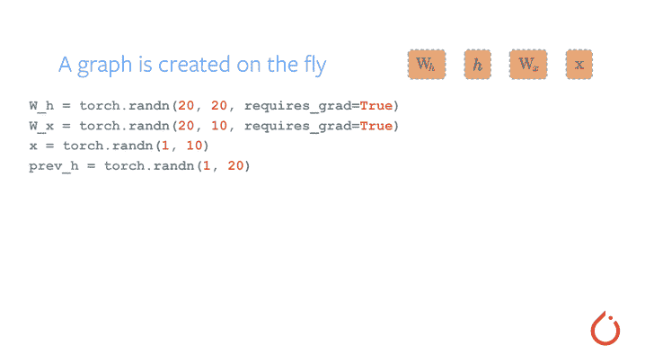

# TorchScript 简介

> 原文：<https://pytorch.org/tutorials/beginner/Intro_to_TorchScript_tutorial.html>

*James Reed (jamesreed@fb.com)，Michael Suo (suo@fb.com)*，修订 2

本教程是 TorchScript 的简介，TorchScript 是 PyTorch 模型（`nn.Module`的子类）的中间表示，可以在高性能环境（例如 C++）中运行。

在本教程中，我们将介绍：

1.  PyTorch 中模型创作的基础，包括：

*   模组
*   定义`forward`功能
*   将模块组成模块的层次结构

2.  将 PyTorch 模块转换为 TorchScript（我们的高性能部署运行时）的特定方法

*   跟踪现有模块
*   使用脚本直接编译模块
*   如何组合两种方法
*   保存和加载 TorchScript 模块

我们希望在完成本教程之后，您将继续学习[和后续教程](https://pytorch.org/tutorials/advanced/cpp_export.html)，该教程将引导您完成一个从 C++ 实际调用 TorchScript 模型的示例。

```py
import torch  # This is all you need to use both PyTorch and TorchScript!
print(torch.__version__)

```

出：

```py
1.7.1

```

## PyTorch 模型创作基础

首先定义一个简单的`Module`。 `Module`是 PyTorch 中组成的基本单位。 它包含：

1.  构造函数，为调用准备模块
2.  一组`Parameters`和子`Modules`。 这些由构造函数初始化，并且可以在调用期间由模块使用。
3.  `forward`功能。 这是调用模块时运行的代码。

我们来看一个小例子：

```py
class MyCell(torch.nn.Module):
    def __init__(self):
        super(MyCell, self).__init__()

    def forward(self, x, h):
        new_h = torch.tanh(x + h)
        return new_h, new_h

my_cell = MyCell()
x = torch.rand(3, 4)
h = torch.rand(3, 4)
print(my_cell(x, h))

```

出：

```py
(tensor([[0.8837, 0.5372, 0.4951, 0.9124],
        [0.6124, 0.7072, 0.6395, 0.9585],
        [0.6178, 0.8701, 0.8071, 0.2415]]), tensor([[0.8837, 0.5372, 0.4951, 0.9124],
        [0.6124, 0.7072, 0.6395, 0.9585],
        [0.6178, 0.8701, 0.8071, 0.2415]]))

```

因此，我们已经：

1.  创建了一个子类`torch.nn.Module`的类。
2.  定义一个构造函数。 构造函数没有做很多事情，只是调用`super`的构造函数。
3.  定义了`forward`函数，该函数具有两个输入并返回两个输出。 `forward`函数的实际内容并不是很重要，但它是一种伪造的 [RNN 单元格](https://colah.github.io/posts/2015-08-Understanding-LSTMs/)，即，该函数应用于循环。

我们实例化了该模块，并制作了`x`和`y`，它们只是`3x4`随机值矩阵。 然后，我们使用`my_cell(x, h)`调用该单元格。 这依次调用我们的`forward`函数。

让我们做一些更有趣的事情：

```py
class MyCell(torch.nn.Module):
    def __init__(self):
        super(MyCell, self).__init__()
        self.linear = torch.nn.Linear(4, 4)

    def forward(self, x, h):
        new_h = torch.tanh(self.linear(x) + h)
        return new_h, new_h

my_cell = MyCell()
print(my_cell)
print(my_cell(x, h))

```

出：

```py
MyCell(
  (linear): Linear(in_features=4, out_features=4, bias=True)
)
(tensor([[ 0.5042,  0.8137, -0.1593,  0.4167],
        [ 0.1716,  0.8078, -0.2267,  0.7011],
        [ 0.5616,  0.8753,  0.1597, -0.3899]], grad_fn=<TanhBackward>), tensor([[ 0.5042,  0.8137, -0.1593,  0.4167],
        [ 0.1716,  0.8078, -0.2267,  0.7011],
        [ 0.5616,  0.8753,  0.1597, -0.3899]], grad_fn=<TanhBackward>))

```

我们已经重新定义了模块`MyCell`，但是这次我们添加了`self.linear`属性，并且在`forward`函数中调用了`self.linear`。

这里到底发生了什么？ `torch.nn.Linear`是 PyTorch 标准库中的`Module`。 就像`MyCell`一样，可以使用调用语法来调用它。 我们正在建立`Module`的层次结构。

`Module`上的`print`将直观地表示`Module`的子类层次结构。 在我们的示例中，我们可以看到`Linear`子类及其参数。

通过以这种方式组成`Module`，我们可以简洁易读地编写具有可重用组件的模型。

您可能已经在输出上注意到`grad_fn`。 这是 PyTorch 自动区分方法的详细信息，称为 [autograd](https://pytorch.org/tutorials/beginner/blitz/autograd_tutorial.html) 。 简而言之，该系统允许我们通过潜在的复杂程序来计算导数。 该设计为模型创作提供了极大的灵活性。

现在，让我们检查一下灵活性：

```py
class MyDecisionGate(torch.nn.Module):
    def forward(self, x):
        if x.sum() > 0:
            return x
        else:
            return -x

class MyCell(torch.nn.Module):
    def __init__(self):
        super(MyCell, self).__init__()
        self.dg = MyDecisionGate()
        self.linear = torch.nn.Linear(4, 4)

    def forward(self, x, h):
        new_h = torch.tanh(self.dg(self.linear(x)) + h)
        return new_h, new_h

my_cell = MyCell()
print(my_cell)
print(my_cell(x, h))

```

出：

```py
MyCell(
  (dg): MyDecisionGate()
  (linear): Linear(in_features=4, out_features=4, bias=True)
)
(tensor([[0.8636, 0.5572, 0.6262, 0.8546],
        [0.7766, 0.5056, 0.5357, 0.8360],
        [0.7293, 0.7581, 0.7117, 0.2432]], grad_fn=<TanhBackward>), tensor([[0.8636, 0.5572, 0.6262, 0.8546],
        [0.7766, 0.5056, 0.5357, 0.8360],
        [0.7293, 0.7581, 0.7117, 0.2432]], grad_fn=<TanhBackward>))

```

我们再次重新定义了`MyCell`类，但是在这里我们定义了`MyDecisionGate`。 该模块利用**控制流**。 控制流包括循环和`if`语句之类的内容。

给定完整的程序表示形式，许多框架都采用计算符号派生的方法。 但是，在 PyTorch 中，我们使用梯度色带。 我们记录发生的操作，并在计算派生时向后回放。 这样，框架不必为语言中的所有构造显式定义派生类。



自动毕业的工作原理

## TorchScript 的基础

现在，让我们以正在运行的示例为例，看看如何应用 TorchScript。

简而言之，即使 PyTorch 具有灵活和动态的特性，TorchScript 也提供了捕获模型定义的工具。 让我们开始研究所谓的**跟踪**。

### 跟踪`Modules`

```py
class MyCell(torch.nn.Module):
    def __init__(self):
        super(MyCell, self).__init__()
        self.linear = torch.nn.Linear(4, 4)

    def forward(self, x, h):
        new_h = torch.tanh(self.linear(x) + h)
        return new_h, new_h

my_cell = MyCell()
x, h = torch.rand(3, 4), torch.rand(3, 4)
traced_cell = torch.jit.trace(my_cell, (x, h))
print(traced_cell)
traced_cell(x, h)

```

出：

```py
MyCell(
  original_name=MyCell
  (linear): Linear(original_name=Linear)
)

```

我们倒退了一点，并学习了`MyCell`类的第二版。 和以前一样，我们实例化了它，但是这一次，我们调用了`torch.jit.trace`，将其传递给`Module`，并传递给了*示例输入*，网络可能会看到。

这到底是做什么的？ 它调用了`Module`，记录了运行`Module`时发生的操作，并创建了`torch.jit.ScriptModule`的实例（其中`TracedModule`是实例）

TorchScript 将其定义记录在中间表示（或 IR）中，在深度学习中通常称为*图*。 我们可以检查带有`.graph`属性的图形：

```py
print(traced_cell.graph)

```

出：

```py
graph(%self.1 : __torch__.MyCell,
      %input : Float(3:4, 4:1, requires_grad=0, device=cpu),
      %h : Float(3:4, 4:1, requires_grad=0, device=cpu)):
  %19 : __torch__.torch.nn.modules.linear.Linear = prim::GetAttr[name="linear"](%self.1)
  %21 : Tensor = prim::CallMethod[name="forward"](%19, %input)
  %12 : int = prim::Constant[value=1]() # /var/lib/jenkins/workspace/beginner_source/Intro_to_TorchScript_tutorial.py:188:0
  %13 : Float(3:4, 4:1, requires_grad=1, device=cpu) = aten::add(%21, %h, %12) # /var/lib/jenkins/workspace/beginner_source/Intro_to_TorchScript_tutorial.py:188:0
  %14 : Float(3:4, 4:1, requires_grad=1, device=cpu) = aten::tanh(%13) # /var/lib/jenkins/workspace/beginner_source/Intro_to_TorchScript_tutorial.py:188:0
  %15 : (Float(3:4, 4:1, requires_grad=1, device=cpu), Float(3:4, 4:1, requires_grad=1, device=cpu)) = prim::TupleConstruct(%14, %14)
  return (%15)

```

但是，这是一个非常低级的表示形式，图中包含的大多数信息对最终用户没有用。 相反，我们可以使用`.code`属性来给出代码的 Python 语法解释：

```py
print(traced_cell.code)

```

出：

```py
def forward(self,
    input: Tensor,
    h: Tensor) -> Tuple[Tensor, Tensor]:
  _0 = torch.add((self.linear).forward(input, ), h, alpha=1)
  _1 = torch.tanh(_0)
  return (_1, _1)

```

那么**为什么我们要进行所有这些操作？ 有以下几个原因**：

1.  TorchScript 代码可以在其自己的解释器中调用，该解释器基本上是受限制的 Python 解释器。 该解释器不获取全局解释器锁定，因此可以在同一实例上同时处理许多请求。
2.  这种格式允许我们将整个模型保存到磁盘上，然后将其加载到另一个环境中，例如在以 Python 以外的语言编写的服务器中
3.  TorchScript 为我们提供了一种表示形式，其中我们可以对代码进行编译器优化以提供更有效的执行
4.  TorchScript 允许我们与许多后端/设备运行时进行交互，与单个操作员相比，它们要求更广泛的程序视图。

我们可以看到，调用`traced_cell`会产生与 Python 模块相同的结果：

```py
print(my_cell(x, h))
print(traced_cell(x, h))

```

出：

```py
(tensor([[-0.3869,  0.0678,  0.5692,  0.6332],
        [ 0.1230,  0.4653,  0.8051,  0.3346],
        [-0.5288,  0.2767,  0.9063,  0.4727]], grad_fn=<TanhBackward>), tensor([[-0.3869,  0.0678,  0.5692,  0.6332],
        [ 0.1230,  0.4653,  0.8051,  0.3346],
        [-0.5288,  0.2767,  0.9063,  0.4727]], grad_fn=<TanhBackward>))
(tensor([[-0.3869,  0.0678,  0.5692,  0.6332],
        [ 0.1230,  0.4653,  0.8051,  0.3346],
        [-0.5288,  0.2767,  0.9063,  0.4727]], grad_fn=<TanhBackward>), tensor([[-0.3869,  0.0678,  0.5692,  0.6332],
        [ 0.1230,  0.4653,  0.8051,  0.3346],
        [-0.5288,  0.2767,  0.9063,  0.4727]], grad_fn=<TanhBackward>))

```

## 使用脚本转换模块

有一个原因是我们使用了模块的第二版，而不是使用带有大量控制流的子模块。 现在让我们检查一下：

```py
class MyDecisionGate(torch.nn.Module):
    def forward(self, x):
        if x.sum() > 0:
            return x
        else:
            return -x

class MyCell(torch.nn.Module):
    def __init__(self, dg):
        super(MyCell, self).__init__()
        self.dg = dg
        self.linear = torch.nn.Linear(4, 4)

    def forward(self, x, h):
        new_h = torch.tanh(self.dg(self.linear(x)) + h)
        return new_h, new_h

my_cell = MyCell(MyDecisionGate())
traced_cell = torch.jit.trace(my_cell, (x, h))
print(traced_cell.code)

```

出：

```py
def forward(self,
    input: Tensor,
    h: Tensor) -> Tuple[Tensor, Tensor]:
  _0 = self.dg
  _1 = (self.linear).forward(input, )
  _2 = (_0).forward(_1, )
  _3 = torch.tanh(torch.add(_1, h, alpha=1))
  return (_3, _3)

```

查看`.code`输出，可以发现找不到`if-else`分支！ 为什么？ 跟踪完全按照我们所说的去做：运行代码，记录发生的操作，并构造一个执行此操作的`ScriptModule`。 不幸的是，诸如控制流之类的东西被擦除了。

我们如何在 TorchScript 中忠实地表示此模块？ 我们提供了**脚本编译器**，它可以直接分析您的 Python 源代码以将其转换为 TorchScript。 让我们使用脚本编译器转换`MyDecisionGate`：

```py
scripted_gate = torch.jit.script(MyDecisionGate())

my_cell = MyCell(scripted_gate)
traced_cell = torch.jit.script(my_cell)
print(traced_cell.code)

```

出：

```py
def forward(self,
    x: Tensor,
    h: Tensor) -> Tuple[Tensor, Tensor]:
  _0 = (self.dg).forward((self.linear).forward(x, ), )
  new_h = torch.tanh(torch.add(_0, h, alpha=1))
  return (new_h, new_h)

```

万岁！ 现在，我们已经忠实地捕获了我们在 TorchScript 中程序的行为。 现在，让我们尝试运行该程序：

```py
# New inputs
x, h = torch.rand(3, 4), torch.rand(3, 4)
traced_cell(x, h)

```

### 混合脚本和跟踪

在某些情况下，需要使用跟踪而不是脚本（例如，一个模块具有许多基于不变的 Python 值做出的架构决策，而我们不希望它们出现在 TorchScript 中）。 在这种情况下，可以通过跟踪来编写脚本：`torch.jit.script`将内联被跟踪模块的代码，而跟踪将内联脚本模块的代码。

第一种情况的示例：

```py
class MyRNNLoop(torch.nn.Module):
    def __init__(self):
        super(MyRNNLoop, self).__init__()
        self.cell = torch.jit.trace(MyCell(scripted_gate), (x, h))

    def forward(self, xs):
        h, y = torch.zeros(3, 4), torch.zeros(3, 4)
        for i in range(xs.size(0)):
            y, h = self.cell(xs[i], h)
        return y, h

rnn_loop = torch.jit.script(MyRNNLoop())
print(rnn_loop.code)

```

出：

```py
def forward(self,
    xs: Tensor) -> Tuple[Tensor, Tensor]:
  h = torch.zeros([3, 4], dtype=None, layout=None, device=None, pin_memory=None)
  y = torch.zeros([3, 4], dtype=None, layout=None, device=None, pin_memory=None)
  y0 = y
  h0 = h
  for i in range(torch.size(xs, 0)):
    _0 = (self.cell).forward(torch.select(xs, 0, i), h0, )
    y1, h1, = _0
    y0, h0 = y1, h1
  return (y0, h0)

```

还有第二种情况的示例：

```py
class WrapRNN(torch.nn.Module):
    def __init__(self):
        super(WrapRNN, self).__init__()
        self.loop = torch.jit.script(MyRNNLoop())

    def forward(self, xs):
        y, h = self.loop(xs)
        return torch.relu(y)

traced = torch.jit.trace(WrapRNN(), (torch.rand(10, 3, 4)))
print(traced.code)

```

出：

```py
def forward(self,
    argument_1: Tensor) -> Tensor:
  _0, h, = (self.loop).forward(argument_1, )
  return torch.relu(h)

```

这样，当情况需要它们时，可以使用脚本和跟踪并将它们一起使用。

## 保存和加载模型

我们提供 API，以存档格式将 TorchScript 模块保存到磁盘或从磁盘加载 TorchScript 模块。 这种格式包括代码，参数，属性和调试信息，这意味着归档文件是模型的独立表示形式，可以在完全独立的过程中加载。 让我们保存并加载包装好的 RNN 模块：

```py
traced.save('wrapped_rnn.zip')

loaded = torch.jit.load('wrapped_rnn.zip')

print(loaded)
print(loaded.code)

```

出：

```py
RecursiveScriptModule(
  original_name=WrapRNN
  (loop): RecursiveScriptModule(
    original_name=MyRNNLoop
    (cell): RecursiveScriptModule(
      original_name=MyCell
      (dg): RecursiveScriptModule(original_name=MyDecisionGate)
      (linear): RecursiveScriptModule(original_name=Linear)
    )
  )
)
def forward(self,
    argument_1: Tensor) -> Tensor:
  _0, h, = (self.loop).forward(argument_1, )
  return torch.relu(h)

```

如您所见，序列化保留了模块层次结构和我们一直在研究的代码。 也可以将模型加载到[中，例如](https://pytorch.org/tutorials/advanced/cpp_export.html)[到 C++ ](https://pytorch.org/tutorials/advanced/cpp_export.html) 中，以实现不依赖 Python 的执行。

### 进一步阅读

我们已经完成了教程！ 有关更多涉及的演示，[请查看 NeurIPS 演示以使用 TorchScript 转换机器翻译模型](https://colab.research.google.com/drive/1HiICg6jRkBnr5hvK2-VnMi88Vi9pUzEJ)。

**脚本的总运行时间**：（0 分钟 0.269 秒）

[下载 Python 源码：`Intro_to_TorchScript_tutorial.py`](../_downloads/bf4ee4ef1ffde8b469d9ed4001a28ee8/Intro_to_TorchScript_tutorial.py)

[下载 Jupyter 笔记本：`Intro_to_TorchScript_tutorial.ipynb`](../_downloads/0fd9e9bc92ac80a422914e974021c007/Intro_to_TorchScript_tutorial.ipynb)

[由 Sphinx 画廊](https://sphinx-gallery.readthedocs.io)生成的画廊