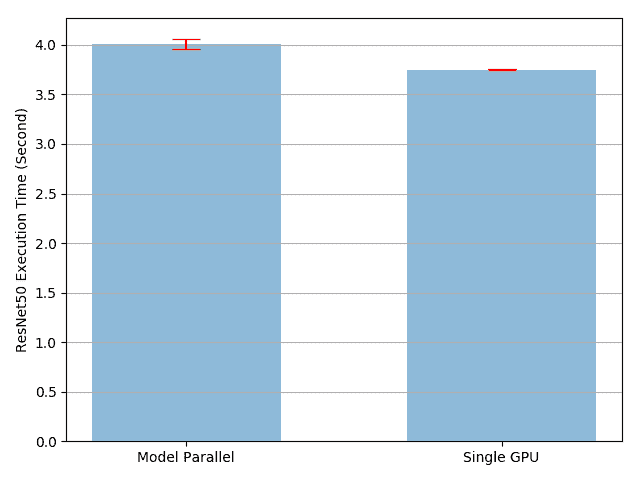
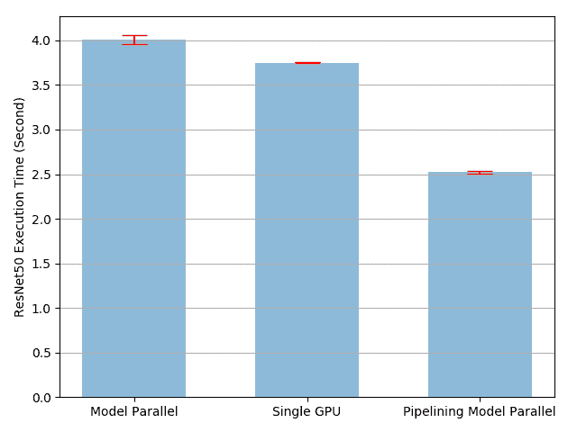
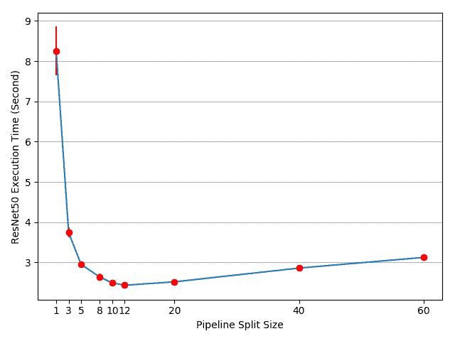

# 单机模型并行最佳实践¶

> 原文：<https://pytorch.org/tutorials/intermediate/model_parallel_tutorial.html>

**作者**：[申力](https://mrshenli.github.io/)

模型并行在分布式训练技术中被广泛使用。 先前的帖子已经解释了如何使用 [DataParallel](https://pytorch.org/tutorials/beginner/blitz/data_parallel_tutorial.html) 在多个 GPU 上训练神经网络； 此功能将相同的模型复制到所有 GPU，其中每个 GPU 消耗输入数据的不同分区。 尽管它可以极大地加快训练过程，但不适用于模型太大而无法容纳单个 GPU 的某些用例。 这篇文章展示了如何通过使用**模型并行**解决该问题，与`DataParallel`相比，该模型将单个模型拆分到不同的 GPU 上，而不是在每个 GPU 上复制整个模型（具体来说， 假设模型`m`包含 10 层：使用`DataParallel`时，每个 GPU 都具有这 10 层中的每一个的副本，而当在两个 GPU 上并行使用模型时，每个 GPU 可以承载 5 层。

模型并行化的高级思想是将模型的不同子网放置在不同的设备上，并相应地实现`forward`方法以在设备之间移动中间输出。 由于模型的一部分仅在任何单个设备上运行，因此一组设备可以共同为更大的模型服务。 在本文中，我们将不会尝试构建庞大的模型并将其压缩到有限数量的 GPU 中。 取而代之的是，本文着重展示并行模型的思想。 读者可以将这些想法应用到实际应用中。

注意

对于模型跨越多个服务器的分布式模型并行训练，请参考[分布式 RPC 框架入门](rpc_tutorial.html)，以获取示例和详细信息。

## 基本用法]（docs / modern-java-zh /

让我们从包含两个线性层的玩具模型开始。 要在两个 GPU 上运行该模型，只需将每个线性层放置在不同的 GPU 上，然后移动输入和中间输出以匹配层设备。

```py
import torch
import torch.nn as nn
import torch.optim as optim

class ToyModel(nn.Module):
    def __init__(self):
        super(ToyModel, self).__init__()
        self.net1 = torch.nn.Linear(10, 10).to('cuda:0')
        self.relu = torch.nn.ReLU()
        self.net2 = torch.nn.Linear(10, 5).to('cuda:1')

    def forward(self, x):
        x = self.relu(self.net1(x.to('cuda:0')))
        return self.net2(x.to('cuda:1'))

```

请注意，除了五个`to(device)`调用将线性层和张量放置在适当的设备上之外，上述`ToyModel`看起来非常类似于在单个 GPU 上实现它的方式。 那是模型中唯一需要更改的地方。 `backward()`和`torch.optim`将自动处理渐变，就像模型在一个 GPU 上一样。 调用损失函数时，只需确保标签与输出位于同一设备上。

```py
model = ToyModel()
loss_fn = nn.MSELoss()
optimizer = optim.SGD(model.parameters(), lr=0.001)

optimizer.zero_grad()
outputs = model(torch.randn(20, 10))
labels = torch.randn(20, 5).to('cuda:1')
loss_fn(outputs, labels).backward()
optimizer.step()

```

## 将模型并行应用于现有模块]（docs / modern-java-zh /

只需进行几行更改，就可以在多个 GPU 上运行现有的单 GPU 模块。 以下代码显示了如何将`torchvision.models.resnet50()`分解为两个 GPU。 这个想法是继承现有的`ResNet`模块，并在构建过程中将层拆分为两个 GPU。 然后，通过相应地移动中间输出，覆盖`forward`方法来缝合两个子网。

```py
from torchvision.models.resnet import ResNet, Bottleneck

num_classes = 1000

class ModelParallelResNet50(ResNet):
    def __init__(self, *args, **kwargs):
        super(ModelParallelResNet50, self).__init__(
            Bottleneck, [3, 4, 6, 3], num_classes=num_classes, *args, **kwargs)

        self.seq1 = nn.Sequential(
            self.conv1,
            self.bn1,
            self.relu,
            self.maxpool,

            self.layer1,
            self.layer2
        ).to('cuda:0')

        self.seq2 = nn.Sequential(
            self.layer3,
            self.layer4,
            self.avgpool,
        ).to('cuda:1')

        self.fc.to('cuda:1')

    def forward(self, x):
        x = self.seq2(self.seq1(x).to('cuda:1'))
        return self.fc(x.view(x.size(0), -1))

```

对于模型太大而无法放入单个 GPU 的情况，上述实现解决了该问题。 但是，您可能已经注意到，如果模型合适，它将比在单个 GPU 上运行它要慢。 这是因为在任何时间点，两个 GPU 中只有一个在工作，而另一个在那儿什么也没做。 由于中间输出需要在`layer2`和`layer3`之间从`cuda:0`复制到`cuda:1`，因此性能进一步恶化。

让我们进行实验以更定量地了解执行时间。 在此实验中，我们通过运行随机输入和标签来训练`ModelParallelResNet50`和现有的`torchvision.models.resnet50()`。 训练后，模型将不会产生任何有用的预测，但是我们可以对执行时间有一个合理的了解。

```py
import torchvision.models as models

num_batches = 3
batch_size = 120
image_w = 128
image_h = 128

def train(model):
    model.train(True)
    loss_fn = nn.MSELoss()
    optimizer = optim.SGD(model.parameters(), lr=0.001)

    one_hot_indices = torch.LongTensor(batch_size) \
                           .random_(0, num_classes) \
                           .view(batch_size, 1)

    for _ in range(num_batches):
        # generate random inputs and labels
        inputs = torch.randn(batch_size, 3, image_w, image_h)
        labels = torch.zeros(batch_size, num_classes) \
                      .scatter_(1, one_hot_indices, 1)

        # run forward pass
        optimizer.zero_grad()
        outputs = model(inputs.to('cuda:0'))

        # run backward pass
        labels = labels.to(outputs.device)
        loss_fn(outputs, labels).backward()
        optimizer.step()

```

上面的`train(model)`方法使用`nn.MSELoss`作为损失函数，并使用`optim.SGD`作为优化器。 它模拟了对`128 X 128`图像的训练，这些图像分为 3 批，每批包含 120 张图像。 然后，我们使用`timeit`来运行`train(model)`方法 10 次，并绘制带有标准偏差的执行时间。

```py
import matplotlib.pyplot as plt
plt.switch_backend('Agg')
import numpy as np
import timeit

num_repeat = 10

stmt = "train(model)"

setup = "model = ModelParallelResNet50()"
# globals arg is only available in Python 3\. In Python 2, use the following
# import __builtin__
# __builtin__.__dict__.update(locals())
mp_run_times = timeit.repeat(
    stmt, setup, number=1, repeat=num_repeat, globals=globals())
mp_mean, mp_std = np.mean(mp_run_times), np.std(mp_run_times)

setup = "import torchvision.models as models;" + \
        "model = models.resnet50(num_classes=num_classes).to('cuda:0')"
rn_run_times = timeit.repeat(
    stmt, setup, number=1, repeat=num_repeat, globals=globals())
rn_mean, rn_std = np.mean(rn_run_times), np.std(rn_run_times)

def plot(means, stds, labels, fig_name):
    fig, ax = plt.subplots()
    ax.bar(np.arange(len(means)), means, yerr=stds,
           align='center', alpha=0.5, ecolor='red', capsize=10, width=0.6)
    ax.set_ylabel('ResNet50 Execution Time (Second)')
    ax.set_xticks(np.arange(len(means)))
    ax.set_xticklabels(labels)
    ax.yaxis.grid(True)
    plt.tight_layout()
    plt.savefig(fig_name)
    plt.close(fig)

plot([mp_mean, rn_mean],
     [mp_std, rn_std],
     ['Model Parallel', 'Single GPU'],
     'mp_vs_rn.png')

```



结果表明，模型并行实现的执行时间比现有的单 GPU 实现长`4.02/3.75-1=7%`。 因此，我们可以得出结论，在 GPU 之间来回复制张量大约有 7% 的开销。 有待改进的地方，因为我们知道两个 GPU 之一在整个执行过程中处于空闲状态。 一种选择是将每个批次进一步划分为拆分流水线，以便当一个拆分到达第二子网时，可以将下一个拆分馈入第一子网。 这样，两个连续的拆分可以在两个 GPU 上同时运行。

## 通过流水线输入加快速度] [docs / modern-java-zh /

在以下实验中，我们将每个 120 图像批次进一步分为 20 图像分割。 当 PyTorch 异步启动 CUDA 操作时，该实现无需生成多个线程即可实现并发。

```py
class PipelineParallelResNet50(ModelParallelResNet50):
    def __init__(self, split_size=20, *args, **kwargs):
        super(PipelineParallelResNet50, self).__init__(*args, **kwargs)
        self.split_size = split_size

    def forward(self, x):
        splits = iter(x.split(self.split_size, dim=0))
        s_next = next(splits)
        s_prev = self.seq1(s_next).to('cuda:1')
        ret = []

        for s_next in splits:
            # A. s_prev runs on cuda:1
            s_prev = self.seq2(s_prev)
            ret.append(self.fc(s_prev.view(s_prev.size(0), -1)))

            # B. s_next runs on cuda:0, which can run concurrently with A
            s_prev = self.seq1(s_next).to('cuda:1')

        s_prev = self.seq2(s_prev)
        ret.append(self.fc(s_prev.view(s_prev.size(0), -1)))

        return torch.cat(ret)

setup = "model = PipelineParallelResNet50()"
pp_run_times = timeit.repeat(
    stmt, setup, number=1, repeat=num_repeat, globals=globals())
pp_mean, pp_std = np.mean(pp_run_times), np.std(pp_run_times)

plot([mp_mean, rn_mean, pp_mean],
     [mp_std, rn_std, pp_std],
     ['Model Parallel', 'Single GPU', 'Pipelining Model Parallel'],
     'mp_vs_rn_vs_pp.png')

```

请注意，设备到设备的张量复制操作在源设备和目标设备上的当前流上同步。 如果创建多个流，则必须确保复制操作正确同步。 在完成复制操作之前写入源张量或读取/写入目标张量可能导致不确定的行为。 上面的实现仅在源设备和目标设备上都使用默认流，因此不必强制执行其他同步。



实验结果表明，对并行 ResNet50 进行建模的流水线输入可大致加快`3.75/2.51-1=49%`的速度，加快训练过程。 距离理想的 100% 加速仍然相去甚远。 由于我们在管道并行实现中引入了新参数`split_sizes`，因此尚不清楚新参数如何影响整体训练时间。 直观地讲，使用较小的`split_size`会导致许多小的 CUDA 内核启动，而使用较大的`split_size`会导致在第一次和最后一次拆分期间出现较长的空闲时间。 两者都不是最优的。 对于此特定实验，可能会有最佳的`split_size`配置。 让我们尝试通过使用几个不同的`split_size`值进行实验来找到它。

```py
means = []
stds = []
split_sizes = [1, 3, 5, 8, 10, 12, 20, 40, 60]

for split_size in split_sizes:
    setup = "model = PipelineParallelResNet50(split_size=%d)" % split_size
    pp_run_times = timeit.repeat(
        stmt, setup, number=1, repeat=num_repeat, globals=globals())
    means.append(np.mean(pp_run_times))
    stds.append(np.std(pp_run_times))

fig, ax = plt.subplots()
ax.plot(split_sizes, means)
ax.errorbar(split_sizes, means, yerr=stds, ecolor='red', fmt='ro')
ax.set_ylabel('ResNet50 Execution Time (Second)')
ax.set_xlabel('Pipeline Split Size')
ax.set_xticks(split_sizes)
ax.yaxis.grid(True)
plt.tight_layout()
plt.savefig("split_size_tradeoff.png")
plt.close(fig)

```



结果表明，将`split_size`设置为 12 可获得最快的训练速度，从而导致`3.75/2.43-1=54%`加速。 仍有机会进一步加快训练过程。 例如，对`cuda:0`的所有操作都放在其默认流上。 这意味着下一个拆分的计算不能与上一个拆分的复制操作重叠。 但是，由于上一个和下一个分割是不同的张量，因此将一个计算与另一个副本重叠是没有问题的。 实现需要在两个 GPU 上使用多个流，并且不同的子网结构需要不同的流管理策略。 由于没有通用的多流解决方案适用于所有模型并行用例，因此在本教程中将不再讨论。

**注意：**

这篇文章显示了几个性能指标。 当您在自己的计算机上运行相同的代码时，您可能会看到不同的数字，因为结果取决于底层的硬件和软件。 为了使您的环境获得最佳性能，一种正确的方法是首先生成曲线以找出最佳分割尺寸，然后将该分割尺寸用于管道输入。

**脚本的总运行时间：**（6 分钟 20.515 秒）

[`Download Python source code: model_parallel_tutorial.py`](../_downloads/d961a67e594a77a630ec636c89f84bb8/model_parallel_tutorial.py)

[`Download Jupyter notebook: model_parallel_tutorial.ipynb`](../_downloads/b882009cab92c6a1d9121b1f8c4108c4/model_parallel_tutorial.ipynb)

[由狮身人面像画廊](https://sphinx-gallery.readthedocs.io)生成的画廊