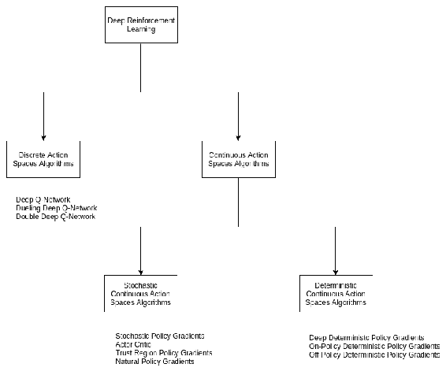
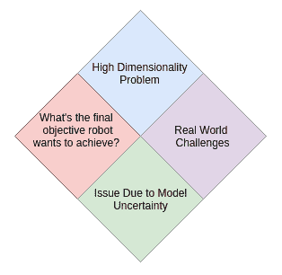
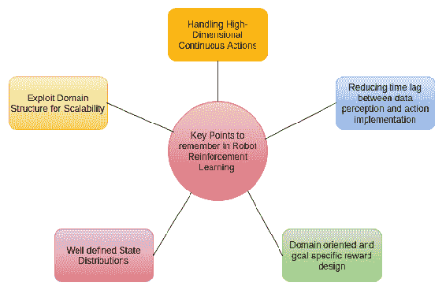

# 机器人技术中的强化学习

到目前为止，我们已经看到了强化学习在 AlphaGo，自动驾驶，项目组合管理等方面的进步。 研究表明，强化学习可以提供认知特征，例如动物行为。

与认知科学的紧密比较将是动态机器人系统和自动驾驶中强化学习的许多成功实施。 他们证明了将强化学习算法用于物理系统实时控制的理论。

在深度 Q 网络和策略梯度中使用神经网络可消除对人工设计的策略和状态表示的使用。 在深度强化学习中直接使用 CNN 并使用图像像素代替手工设计的功能作为状态已成为广泛接受的实践。 小型批量训练以及单独的主要网络和目标网络的概念为深度强化学习算法带来了成功。 在以像素为输入的 50 场 Atari 2600 游戏中，DeepMind 和深度强化学习的成功实现了超人的性能水平，这是强化学习研究的转折点。

研究人员试图在机器人技术中实现深层 Q 网络，但并未取得重大成功。 其背后的主要原因是机器人领域中的高维连续动作空间。 为了在连续的动作空间中实现 DQN，必须离散化它们，但是这种离散化会导致信息丢失，这对于诸如机器人之类的领域可能是非常危险的。

在**离散动作空间**（**DAS**）算法下，将处理离散动作空间域的算法归为一组。 诸如策略梯度之类的其他方法通过将状态空间作为输入来直接将状态空间与动作空间连接，并返回最佳策略作为输出，即采取的可行动作。 与基于值的方法（例如 Q 学习）相比，基于策略的方法的优势在于，它们解决了连续操作空间的处理问题，因为对于给定的状态输入，输出策略是跨不同可能操作的随机分布。

诸如处理连续动作空间域的策略梯度之类的算法归为**连续动作空间**（**CAS**）算法。 因此，在行动空间上提供随机表示的基于策略的方法解决了该问题，而不是 DAS 算法中的离散化。 CAS 算法最初是开发并用于低维状态空间，后来使用基于 CNN 的架构扩展到高维状态空间。 CAS 算法分为两个子类别：**随机连续动作空间**（**SCAS**）和**确定性连续动作空间**（**DCAS**）算法。 它们之间的主要区别在于复杂性，因为 SCAS 算法提供了更好的覆盖范围，因此需要大量的训练样本来学习更好的策略。 在现实世界的机器人应用中获取大量训练样本是非常不可行的，因此，仿真必须以尽可能最佳的方式表示现实世界，否则生成现实世界的数据将非常昂贵。

确定性策略梯度的发现超过了随机策略算法，如 [Silver 等人](http://proceedings.mlr.press/v32/silver14.pdf)所述，该技术已包含在[附录 A](../Text/15.html) 中， *强化学习*中的其他主题。 在本章中，我们将介绍机器人强化学习背后的挑战以及当前如何实施机器人强化学习。

本章将讨论的主题包括：

*   机器人技术中的强化学习
*   机器人强化学习中的挑战
*   悬而未决的问题和实际挑战
*   重要要点

# 机器人技术中的强化学习

机器人技术与行为的高度复杂性相关联，这使手工工程师既难以进行操作，也没有足够详尽的方法来使用监督学习来完成任务。 因此，强化学习提供了一种捕获此类复杂行为的框架。

与机器人技术有关的任何任务都由高维，连续状态和动作空间表示。 环境状态不是完全可观察到的。 仅在模拟中学习不足以说强化学习代理已经为现实世界做好了准备。 在使用机器人技术的情况下，强化学习代理应该在现实世界中遇到不确定性，但是获取和复制起来既困难又昂贵。

鲁棒性是机器人技术的重中之重。 在常规分析或传统机器学习问题中，数据，预处理或算法中的细微错误会导致行为发生重大变化，尤其是对于动态任务。 因此，需要能够捕获实际细节的健壮算法。 机器人强化学习的下一个挑战是奖励功能。 由于奖励功能在优化学习中起着最重要的作用，因此需要生成特定领域的奖励功能，以帮助学习代理尽快更好地适应现实世界。 因此，领域知识是设计好的奖励功能的关键，而这又是机器人机器学习中的艰巨任务。

在这里，将讨论通过我们在本书中研究的强化学习算法可以实现的机器人领域中的任务类型，并尝试将它们连接在一起以构建一种有前途的方法。

# 强化学习的演变

在本书中，我们涵盖了从基础到高级的强化学习领域中的大多数算法。 因此，这些章节是理解机器人领域中不同算法所面临的应用和挑战的前提。 早期强化学习算法通过首先获取状态动作值，然后从中得出策略来处理获取最佳策略的问题。 然后，策略迭代方法出现了，直接用于输出优化的策略。 勘探开发技术有助于完善现有政策，探索新措施并更新现有政策。 强化学习方法，例如 MDP（在第 3 章，*马尔可夫决策过程*中），其中需要采用过渡模型的值迭代方法称为基于**模型的学习器**。 另一方面，诸如 Q 学习（在第 5 章， *Q-Learning 和深度 Q 网络*中）的算法不需要这种过渡模型，因此也不需要任何预定义的策略。 ，他们被称为**模型免费土地脱离政策学习器**。

在深度强化学习领域，行动价值函数逼近器和策略函数逼近器在制定最先进的学习算法集方面发挥着关键作用。 策略搜索算法（例如策略梯度）旨在通过最大化期望的奖励总和来找到最佳策略，而使用行动值函数近似器（例如深度 Q 网络）的算法旨在通过最大化期望的总和来找到给定状态的行动值 奖励。 但是，在处理由高维和连续状态动作空间构成的环境时，性能上的差异在于，这最能描述机器人在其中运行的真实环境。 在这种情况下，策略搜索算法的性能会更好，因为它们在连续状态操作空间域中可以更好地工作：

上图显示了不同的深度强化学习算法的类别。 通过在深度 Q 网络中使用神经网络和策略梯度方法解决了映射连续和高维状态空间的问题。 各种 DAS 和 CAS 算法都使用神经网络有效地执行连续状态空间映射的任务。 但是主要的问题是将输入状态空间映射到高维连续动作空间。 为了在映射到连续动作空间的任务中获得更好的结果，派生了 CAS 算法。

# 机器人强化学习中的挑战

强化学习在机器人技术中的应用包括：

*   运动
*   操纵
*   自主机器控制

如前所述，为了使增强型学习代理在现实世界中的任务中表现更好，它应该具有定义明确，特定领域的奖励功能，这很难实现。 通过使用学徒制学习等技术可以解决此问题。 解决奖励不确定性的另一种方法是根据状态不断更新奖励功能，以便生成最优化的策略。 这种方法称为逆强化学习。

由于许多挑战，机器人强化学习是一个很难解决的问题。 第一个是连续的状态动作空间。 根据问题陈述，决定是采用 DAS 算法还是 CAS 算法。 这意味着机器人控制应处于何种粒度级别。 一大挑战是现实系统的复杂性，这导致执行时间，手动干预和维护的增加。 因此，需要一种可以实时运行并应对现实世界复杂性的算法。

因此，该算法必须处理现实世界系统的复杂性，并且必须实时运行，其目的是通过设计一个良好的，特定于领域的，知识衍生的奖励函数来最大化期望的奖励总和。 因此，在以下各节中讨论并在下图中显示的机器人强化学习面临许多挑战：

# 高维问题

随着维数的增加，数据也随之增加。 结果，有更多的计算覆盖了完整的状态动作空间。

让我们举个例子：

*   对于每个维度，状态空间都离散为 10 个不同的状态
*   因此，三维状态空间将具有 *10x10x10 = 1000* 个状态
*   因此，随着维数的增加，状态将增加 10 倍

因此，随着尺寸的增加，评估变得困难。 函数近似器（例如神经网络）可以有效地解决此问题。 机器人系统的问题是由于拟人（类人）机器人导致的高维状态和动作。 经典的强化学习方法考虑具有离散状态动作空间的网格世界环境。 在网格世界环境中，导航任务将涉及许多离散的动作，包括移动，加速，加速，下降，启动，停止以及更多高精度方向。

使用离散化来减少维数会导致信息丢失，尤其是在机器人领域。 由于连续的动作空间，这会阻碍动态能力。 将动作空间减小为离散值可掩盖许多重要动作。 在处理到连续动作空间的映射时，函数逼近是一种明智的方法。

# 现实世界中的挑战

机器人与现实世界互动。 因此，机器人强化学习的真正问题是应对这些现实问题。 这是因为在现实世界中机器人组件的定期磨损非常昂贵。 连续的维护和修理在劳力和维护和修理的时间损失方面付出了巨大的代价。 因此，安全探索是机器人强化学习过程中的关键问题。

Perkins 和 Barto（2002）提出了一种基于 Lyapunov 函数构造强化学习主体的方法（[附录 A](../Text/15.html) ，*强化学习*中的其他主题）。 现实世界带来的挑战包括环境因素的变化，即气候，温度，光线等。 结果，由于温度和气候的极端影响，机器人的动力学将受到影响，并且将避免学习过程的收敛。 现实环境是不确定的。 结果，由于气候，温度，光线等外部因素，无法产生过去的学习时间。 因此，状态是不确定的，因此很难模拟真实的真实场景。 因此，大多数模拟器都没有考虑气候，温度和光的要素。 因此，这对要解决的算法提出了严峻的挑战。 除此之外，传感器噪声测量的不确定性导致无法直接用传感器观察所有状态。

现实世界中的大多数机器人学习任务都需要人工监督，而获取现实世界中的样本在时间，劳动力和金钱方面都非常昂贵。 在机器人强化学习中，无法使用诸如模拟器之类的情景设置，因为它们在时间，维修和金钱上都花费很多。 机器人需要在严格的约束下与现实世界互动，以免造成重大破坏。

此外，由于这些强化学习算法是在计算机中实现的，因此无法避免时间离散化，从而导致在现实情况下无法复制连续时间系统。 由于以下过程，现实世界的状态表示与现实世界状态相比可能会滞后：

*   信号通讯延迟
*   信号信息处理
*   实时创建学习模型以输出要采取的最佳措施
*   延迟接收动作信号和致动导致机器人中的机器运动

由于这些延迟，动作无法立即实施，从而导致延迟效果。 在诸如**马尔科夫决策过程**（**MDP**）之类的强化学习算法中，假定动作会瞬间影响环境，而忽略了与现实世界相关的延迟。 可以通过汇总一些最近的操作并将其提供给州来解决此问题，但这也将导致尺寸的增加（在上一节中讨论的机器人强化学习中的挑战）。 解决该问题的另一种方法是增加时间步长，但这有两个缺点，一个缺点是妨碍了机器人的控制，第二个缺点是由于持续时间的变化而对系统的动态产生不利影响。

因此，我们总结了如下讨论的实际挑战：

*   现实世界中的磨损
*   昂贵的硬件
*   环境因素，例如气候，温度，光线，噪音等
*   接收环境信号与执行操作之间的延迟
*   包括大量的时间，人工和维护费用方面的投资

# 模型不确定性导致的问题

为了避免与实际交互相关的成本，使用了模拟器。 问题在于，仿真模型应接近实际情况。 对于理想的设置，方法是在模拟中执行学习任务，并将知识模型转移到机器人。 为机器人创建良好的精确学习模型以及现实场景的模拟环境模型非常具有挑战性，因为它需要大量的现实世界数据样本。

从少量数据中学到的小模型会导致建模不足，从而使机器人很容易与实际系统脱节。 模拟器的问题在于它们无法复制与物理交互（如摩擦和触摸）相关联的真实世界的复杂性，因此它们被忽略了。 结果，在现实世界中，由于与物理交互有关的挑战，机器人的能量和对它的控制也丢失了。 因此，忽略这些功能使机器人强化学习模型难以根据实际情况进行准确训练。 因此，在现实世界中学习有助于捕获环境的这些固有特征。

因此，由于现实世界的不完整状态表示而导致的模型不确定性是机器人强化学习要克服的巨大挑战。

# 机器人要实现的最终目标是什么？

奖励功能对于在机器人强化学习中指定学习代理的目标至关重要。 如我们所知，对于强化学习算法，最终目标是使从开始状态到达到目标状态的预期奖励总和最大化。

在现实世界中，设计好的奖励功能是一个巨大的挑战。 因此，代表或指定目标是现实世界中的挑战。 现实世界中充满不确定性，因此，奖励函数应能够捕获与此类不确定性相关的积极状态。

一些领域在任务完成后获得奖励，不确定性较小，但在某些情况下，导致更好的最终结果的每个动作都具有不同的奖励。 这是由于每个状态的重要性，因为每个状态都像在现实情况中那样采取了行动。 因此，任务完成奖励机制不能在现实世界中实现，因为它不会捕获不确定性，也不会导致学习趋同，从而导致性能下降。

在我们遇到的大多数现有模拟中，我们看到了一种二元奖励机制，该机制仅捕获了学习代理的成功和失败。 将中间奖励包含为奖励功能的一部分，将比二元奖励方法更好，从而导致更好的解决方案。 包括中间奖励在内，将捕获现实系统中从状态到状态转换的不确定性。

因此，奖励功能通常表示为状态动作对的函数。 如前所述，由于先前讨论的现实世界的挑战，该模拟不能准确地表示现实世界的状态。 但是，除了环境因素和时间滞后之外，由于具有良好的奖励功能，机器人加固代理还可以学习优化时间和管理风险，并避免了实际系统设置和维护的成本。

最近，已经进行了进一步的研究开发，以在简单模型的基础上构建复杂策略，以通过使用更好的参数化奖励函数来探索那些复杂策略来实现此目标。 在他们的研究中，Sorg 等人（2010 年）以及 Zucker 和 Bagnell（2012 年）通过调整奖励功能，通过策略搜索技术实现简单的最优控制，得出了复杂的策略。

# 悬而未决的问题和实际挑战

根据强化学习算法的不同挑战，与监督学习相比，它们无法直接应用于机器人技术，后者在研究和更好的部署方面已经取得了重大的进步。

在风险不是很高的机器人技术中，可以为各种物理系统和控制任务引入强化学习。 其背后的原因是在现实世界系统中强化学习模型的稳定性问题。 所有学习过程都需要已实现的领域知识，以便更好地表示状态并设计准确的奖励功能。 这需要进一步的研究和开发。

让我们讨论一些关于强化学习算法的开放性问题，这些问题在机器人强化学习领域中正在进行的和未来的研究中需要更多的关注。

# 公开问题

以下列出了一些开放的，并非详尽无遗的问题，需要特别注意以提供更好的机器人技术强化学习模型：

*   我们如何使状态动作空间表示过程自动化？
    *   机器人技术中的状态作用空间是连续的并且是多维的。 状态和动作空间的高维性和连续性使表示选择过程难以实现自动化。
    *   状态逼近也是一个未解决的问题，目前正在深入研究中。
*   我们如何根据收到的数据生成奖励函数？
    *   强化学习算法的成功很大程度上取决于奖励函数的质量，其对不同状态表示的覆盖范围以及与之相关的不确定性
*   先验领域知识的重要性是什么？

    *   先验知识对于加强学习代理的准确性更好。
    *   在尽可能少的情节中更好地学习所需的先验知识量尚不确定，并且尚待解决。 因此，重复大量的迭代以确保更好的学习。
    *   在某些情况下，由于与环境相关的大量不确定性，先验知识可能无济于事。
*   我们如何根据感知数据仔细学习？
    *   繁重的预处理和约束条件使感知到的大多数关键信息抽象化
    *   这种抽象是由于与处理不完整，模棱两可和嘈杂的传感器数据相关的限制
    *   当接收到数据信号时，在旅途中同时学习是一个活跃的研究领域
*   我们如何处理与模型相关的误差和不确定性？
    *   为了减少所需的实际交互，请使用基于模型的方法
    *   仅在模拟中学习的策略不应直接传递给机器人
    *   由于与实际系统相关的不确定性，这个问题似乎是不可避免的
    *   创建足够强大的算法来处理与现实世界系统相关的不确定性的算法是一个活跃的研究领域

# 机器人强化学习的实际挑战

除了前面讨论的基本挑战之外，机器人强化学习中还存在更大的问题和实际挑战。 这是因为要克服实际挑战很重要，要使机器人以最小的错误率有效地工作。 为了避免实际挑战，必须执行以下任务：

*   更好地利用数据集：
    *   人类能够在已经学到的知识和新的交互作用之上增强自己的学习。
    *   例如，一个孩子触摸火锅并迅速学会远离火锅。 同样，在步行或执行任何任务时，人类的表现也会得到改善，从而增强了学习能力。
    *   转移先前学到的知识并通过机器人在旅途中增强它是非常具有挑战性的。
    *   对于简单的任务，可以在学习中实现收敛，但是对于复杂的任务，由于缺少足够的数据来增强学习，因此学习可能永远不会收敛。
    *   更好地利用数据可以更好地处理噪声。
    *   创建处理环境变化的数据集以更好地表示状态是机器人强化学习中一个活跃的研究领域。
*   执行更好的实验并不断评估它们以进一步改进。
    *   在机器人强化学习中执行大规模，真实世界的实验是一项艰巨的任务
    *   AI 社区的研究人员正在为机器人强化学习进行实验的标准设置

# 重要要点

在本章中，我们经历了机器人技术领域强化学习算法所面临的主要挑战。 因此，下图显示了想要进入这一强大的机器人强化学习研究领域的学生的主要收获：

# 概要

在本章中，我们介绍了强化学习算法的现状以及机器人技术方面的挑战。 我们还尝试详细了解每个挑战。 我们还了解了实际挑战及其建议的解决方案。 破解端到端机器人技术的解决方案将是 AI 社区最大的里程碑。 当前，算法和数据处理单元的不断改进面临挑战。 但是，我们看到机器人执行一般人工任务的日子已经过去了。 如果您想跟进机器人强化学习中的一些研究，那么您可以从以下选项开始：

*   [顾世祥等人的《具有异步非策略更新的用于机器人操纵的深度强化学习》，2016](https://arxiv.org/pdf/1610.00633.pdf)
*   [Yahya 等人的《具有分布式异步指导策略搜索用于集体机器人的强化学习》，2016](https://arxiv.org/pdf/1610.00673.pdf)

在下一章中，我们将尝试涵盖另一个有趣的领域，即广告技术以及如何使用深度强化学习来破坏它。