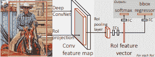
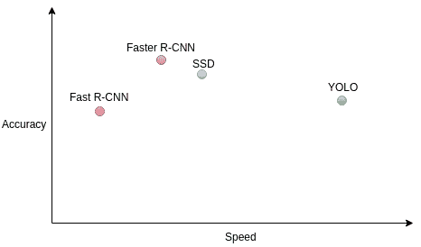
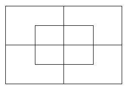
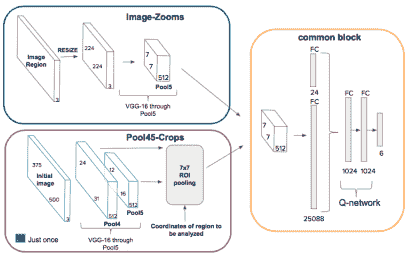
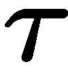
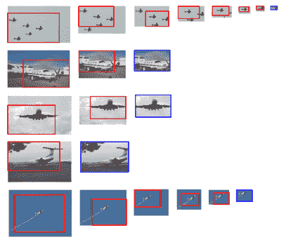

# 图像处理中的强化学习

在本章中，我们将介绍**人工智能**（**AI**）社区（计算机视觉）中最著名的应用领域之一。 将 AI 应用于图像和视频已经持续了二十多年。 具有更好的计算能力，诸如**卷积神经网络**（**CNN**）及其变体的算法在对象检测任务中表现良好。 在自动图像字幕，糖尿病性视网膜病变，视频对象检测，字幕等方面，已经采取了高级措施。

由于其令人鼓舞的结果和更通用的方法，将强化学习应用于计算机视觉成功地构成了研究人员的艰巨任务。 我们已经看到了 AlphaGo 和 AlphaGo Zero 如何胜过专业的人类围棋玩家，在每个步骤中，将深度强化学习方法应用于游戏板的图像。

因此，在本章中，我们将介绍计算机视觉中最著名的领域，**对象检测**以及强化学习如何尝试做到这一点。

# 深度强化学习的分层对象检测

在本节中，我们将尝试理解如何根据 Bellver 等人（2016）在[《使用深度强化学习的分层对象检测》](https://arxiv.org/pdf/1611.03718.pdf)中建议的框架，将深度增强学习应用于分层对象检测。 该实验展示了一种使用深度强化学习在图像中执行分层对象检测的方法，该方法主要侧重于承载更丰富信息的图像重要部分。 此处的目的是训练一个深度增强学习代理，为其提供一个图像窗口，并将图像进一步分为五个较小的窗口，并且该代理成功地将注意力集中在较小的窗口之一上。

现在，让我们考虑一下人类如何看待图像。 我们总是以顺序的方式提取信息以了解图像的内容：

*   首先，我们专注于图像的最重要部分
*   最重要部分提供的信息将引导我们进入图像的下一部分，重点关注
*   只要图像的不同部分提供一些相关信息，上述步骤便会继续

在计算机视觉中，图像是在局部范围内进行分析的，我们使用一个像素大小的小窗口，然后滑动窗口以扫描整个图像。 传统上，这就是我们处理图像处理和分析任务的方式。 使用这种窗口滑动方法，可以独立地分析图像的不同部分，而不会相互关联。 可以通过图像的分层表示来实现不同图像部分的关联。

为了获得图像的分层表示，首先，像以前一样，顺序进行图像的自顶向下扫描，以聚焦于包含相关信息的图像的不同局部部分。 使用强化学习，可以使代理具有足够的能力来检测图像中的对象。 代理首先分析整个图像，然后决定要聚焦的部分，并且代理在找到图像中的对象后最终停止。 在此实验中，图像窗口分为五个预定义的较小部分，其中四个部分代表四个象限，一个部分代表中心区域。

之所以使用强化学习，是因为代理可以按不同的顺序探索层次结构表示，并且仍然可以达到目标。 这是因为其目标是在目标状态为找到包含对象的图像部分的情况下，最大化预期的总和回报。

# 相关作品

物体检测中的大多数传统解决方案包括窗口大小选择，然后将窗口滑动到图像上，聚焦于不同区域。 区域之间的关系从未捕获，所有区域都用于计算。 在这里，我们将简要讨论在对象检测领域进行的其他一些研究。 本节中对以下研究的详细说明超出了本书的范围，但这将为您提供对象检测领域中取得的进展的基本知识。

# 基于区域的卷积神经网络

在较早的对象分类模型中，CNN 非常慢且计算量很大。 此外，作为分类问题的成功完全取决于准确性。 通过在每层的所有区域上滑动窗口来完成 CNN 中的运行卷积。 因此，更多的边界框（通过滑动窗口分析的不同区域的总数）意味着更高的计算成本。

**基于区域的卷积神经网络**（**R-CNN**）是首次采用选择性搜索方法来减少输入分类器的边界框的数量。 此外，选择性搜索使用纹理，强度，颜色等特征来创建对象的可能盒子位置。 现在，这些盒子可以送入 CNN 模型。

因此，R-CNN 的关键组件包括：

*   生成包含对象的可能的盒子区域（创建感兴趣的区域）
*   将这些生成的框区域输入到 CNN
*   然后，将 CNN 的表示输出馈送到 SVM 层，以预测每个框区域的类别
*   通过边界框回归来分别优化这些框区域，以实现更好的定位

# 空间金字塔池网络

通过消除对图像不必要区域的关注，R-CNN 的速度比普通 CNN 快，但 R-CNN 实际上仍然非常慢，因为 R-CNN 所关注的区域数量足够高，因此总体计算仍然很昂贵 。

**空间池金字塔网络**（**SPP-net**）是解决此问题的首次尝试。 在 SSP-net 中，整个图像的 CNN 表示仅计算一次，然后进一步用于计算通过选择性搜索方法生成的每个盒子区域的 CNN 表示。 这是通过在卷积表示的对应于框区域的那部分上进行合并来完成的。 通过考虑中间层的下采样，通过将盒区域投影到卷积层上来计算对应于盒区域的卷积表示部分。

与传统 CNN 方法中的最大池化不同，空间池化是在 SPP-net 中的最后一个卷积层之后进行的。 该空间池化层将任意大小的盒子区域划分为固定数量的容器，并在每个容器上进行最大池化。

SPP 网络的一大缺点是，只能微调网络的全连接层，而不能进行不会发生反向传播的空间池层。

# 快速 R-CNN

首先，是 Fast R-CNN（由 Microsoft Research 的 Ross Girshick 于 2015 年提出）提出了在图像的不同区域之间共享卷积输出的想法：

Ross Girshick 的 [Fast R-CNN](https://arxiv.org/pdf/1504.08083.pdf)

在 Fast R-CNN 中，将输入图像和多个感兴趣区域作为 CNN 的输入。 完成 RoI 的合并以获得固定大小的特征图，然后通过**全连接层**（**FC**）发送以获得特征向量。 R-CNN 每个感兴趣区域具有两个输出向量，如下所示：

*   Softmax 概率
*   每类边界框回归偏移

快速 R-CNN 解决了与 SPP 网络相关的关键问题； 由于空间池化层未进行微调，因此，快速 R-CNN 提供了端到端的学习网络。 快速 R-CNN 使用类似于最大池梯度计算的简单反向传播，但池区域重叠。

此外，与 R-CNN 不同，Fast R-CNN 结合了边界框回归和神经网络训练，而 R-CNN 则使用边界框回归单独进行此区域优化，这有助于更好地定位。 因此，在快速 R-CNN 中，分类和定位不需要单独的网络。 结果，相对于之前开发的任何其他对象检测模型，总的训练时间显着减少，并且由于端到端学习，与 SPP 网络相比，其准确性更高。

# 更快的 R-CNN

更快的 R-CNN 以其名字命名。 它比以前的 Fast R-CNN 更快。 这是通过用称为**区域提议网络**的非常小的卷积网络替换 Fast R-CNN 的最慢部分（感兴趣的生成框区域）的选择性搜索来执行相同的任务来生成的， 极有可能包含对象（感兴趣的区域）。

更快的 R-CNN 实现了锚框的概念，以处理宽高比和对象比例的变化。 对于每个区域，都有三个用于缩放比例和三个纵横比的锚点框。 因此，对于每个位置，我们有九个框被馈送到**区域提议网络**（**RPN**），以预测该区域是背景还是前景的可能性。 边界框回归用于改善每个此类区域的锚框。 因此，RPN 输出可变大小的边界框及其类概率。

因此，RPN 给出了各种大小的边界框，每个边界的概率与每个类的对应概率相同，其余网络类似于 Fast-RCNN。 Faster-RCNN 的速度是 Fast-RCNN 的 10 倍，具有相似的精度，从而使其成为可用的最精确的对象检测模型之一。 下表显示了 R-CNN 不同变体的速度分析：

| **类型** | **每张图像的测试时间（以秒为单位）** | **加快** |
| 神经网络 | 50 | 1 倍 |
| 快速 R-CNN | 2 | 25 倍 |
| 更快的 R-CNN | 0.2 | 250 倍 |

# 你只看一次

YOLO 通过执行回归学习类概率和边界框的大小，从而对输入图像执行对象检测。 YOLO 将图像划分为 *SxS* 网格，每个网格预测`N`边界框和置信度。 该置信度值量化边界框的准确性和对象在边界框中的出现。

YOLO 还可以预测训练中所有班级每个盒子的班级得分。 因此，图像中所有框上的类别得分的总和也有助于计算整个图像的类别概率，从而有助于预测对象。 由于将图像划分为 *SxS* 网格，并且针对每个输出 *N 个*边界框，因此，正在预测 *SxSxN* 框。 但是，由于我们具有盒子的置信度得分并使用显着的阈值，因此可以删除所有低置信度（不包含对象）的盒子。

而且，YOLO 一次扫描整个图像，而无需执行先生成感兴趣区域，然后以较早的方法将这些区域馈入 CNN 的步骤。 因此，在 YOLO 中运行，图像需要一次经过 CNN，并且实时生成结果。

# 单发探测器

**单发检测器**（**SSD**）以其在速度和准确性之间的平衡而著称。 就像 YOLO 一样，SSD 仅在输入图像上运行一次 CNN 即可学习表示形式。 在此表示形式上运行一个小的 3x3 卷积核，以预测边界框和类概率。 为了处理比例，SSD 会在多个卷积层之后预测边界框。 由于每个卷积层以不同的比例运行，因此它能够检测各种比例的对象。

下图显示了 Fast R-CNN，Faster R-CNN，YOLO 和 SSD 的性能指标：

# 分层对象检测模型

在这里，我们将尝试通过强化学习框架来实现对象检测问题，在强化学习框架中，强化学习代理将与环境图像进行交互，并且每步，代理将决定关注哪个区域，以实现目标。 以最少的时间步长找到对象。 问题陈述以**马尔可夫决策过程**（**MDP**）框架表示，其不同参数讨论如下：

# 州

代理状态的第一部分由使用两个模型提取的视觉特征定义，它们是：

*   图像缩放模型
*   Pool45-作物模型

在下面的*模型和培训*部分中说明了这两种变化。

代理状态的第二部分是存储向量，它捕获了代理为了搜索对象而采取的过去四个时间步骤的动作。 在每个时间步长，都有六种可能的操作（在下面的部分中进行介绍）。 因此，存储向量的尺寸为 *4 * 6 = 24* 。 已经发现该存储向量对于稳定搜索轨迹很有用。

# 动作

有两类可能的操作，如下所示：

*   运动动作暗示着当前观察区域的变化
*   终端操作，指示已检测到对象并且搜索已结束

每个移动动作只能从预定义的层次结构在区域之间自上而下转移注意力。 图像被进一步分为五个较小的子区域进行聚焦。 因此，在创建为的五个子区域（下图中）中构建了层次结构：

*   四个季度
*   一个中央重叠区域

因此，存在五个运动动作，每个运动动作与子区域相关联，并且具有一个终端动作，其被选择以指示成功检测到对象的搜索的结束。

# 奖励

运动动作的奖励函数由以下公式表示：

下式表示的终端动作的奖励函数：

此处，`g`是基本事实，`b`是当前步骤中的区域， *b'*是下一步中的新区域，而 IoU 是 事实真相之间的交集。

联合上的**交集（**IoU**）是对象检测中的一个指标，其中有两个重叠的边界框。 首先，计算盒子的交点，即重叠的面积。 其次，计算重叠框的并集，将整个框的面积之和减去重叠面积。 然后将相交除以并集得到 IoU。**

对于移动动作，对于特定状态`s`，朝着区域 *b'*移动的动作将获得更好的回报，该区域的地面实况 g 大于 IoU`g`与上一步中考虑的区域`b`的关系。 否则，行动将受到负面奖励。

对于终端动作，如果具有基本事实的当前区域`b`的 IoU 大于某个阈值*τ*，则奖励为正，否则为负。

# 模型与训练

在这里，训练了一个深度 Q 网络，针对该网络使用两个模型来创建代理状态表示的一部分。 这两种模型如下：

*   ImageZooms 模型
*   Pool45-作物模型

对于 Image-Zooms 模型，每个区域的大小调整为 224x224，并通过 Pool5 层馈入 VGG-16，以获得特征图。 对于 Pool45-Crops 模型，全分辨率的图像通过 Pool5 层输入到 VGG-16。 合并从整个图像中提取的所有**感兴趣区域**（**ROI**）的特征图。

这两个用于特征提取的模型输出 *7x7* 的特征图，该图被馈送到公共块中（如以下架构所示）。 这些特征图和存储向量（前面讨论过）被馈入由两个完全连接的层组成的深层 Q 网络，每个层各有 1024 个神经元。 每个完全连接的层都具有 ReLU 激活功能，并经过辍学训练：

**分层对象检测模型（架构）**来自[《具有深度强化学习的分层对象检测》](https://arxiv.org/pdf/1611.03718.pdf)，Bellver 等，2016 年

# 培训细节

通过-贪婪方法学习了一个深层 Q 网络，该网络以 = 1（完全 100％探索）开始，并以 0.1 的步长直到= 0.1（仅 10％探索，90％开发）减少。 在探索过程中，选择随机动作是因为通过更好的探索，可以避免局部最小值，并且还可以揭示通往目标状态的未知优化路径。 而且，为了帮助代理学习终端动作，每当当前区域具有 *IoU > * 时，代理便被迫采取该动作，这反过来又加速了学习过程。

我们在训练时发现的一个事实是，我们不应强加要首先看图像的哪个对象。 在每个时间步长，代理都将专注于当前区域中与地面真实性重叠程度最高的对象。 这样，目标对象有可能在自顶向下的探索过程中发生变化。

从正态分布和 Adam 优化器初始化深 Q 网络的权重和偏差参数，以使损失最小化。 高伽玛（折扣系数）用于平衡当前和未来的回报。

使用深度强化学习进行对象检测的这种方法显示了一种由学习代理自上而下探索区域层次结构的方法。 因此，通过适当的层次结构，可以在更少的时间步长内正确检测对象，如下图共享的结果所示：

# 概要

在本章中，我们介绍了对象检测中的各种最新技术，例如 R-CNN，Fast R-CNN，Faster R-CNN，YOLO，SSD 等。 此外，我们探索了 Bellver 等人在*中使用深度强化学习进行分层对象检测*所提供的方法。 等 （2016）。 按照这种方法，我们学习了如何创建 MDP 框架以进行对象检测，并以最短的时间步长以自上而下的探索方法分层检测对象。 图像中的对象检测是计算机视觉中的一种应用。 还有其他领域，例如视频中的对象检测，视频标记等等，在这些领域中，强化学习可以创建最先进的学习代理。

在下一章中，我们将学习如何在 NLP（自然语言处理）领域应用强化学习。